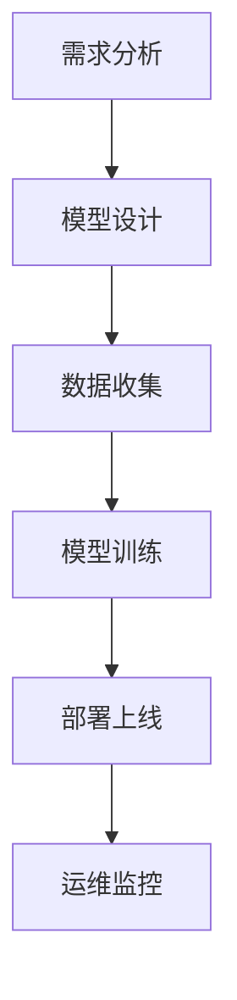

                 

关键词：AI大模型，创业，资源利用，AI架构，技术优势，商业模式

摘要：随着人工智能技术的飞速发展，大模型在各个领域展现出了巨大的潜力和应用价值。然而，对于初创企业来说，如何充分利用自身资源优势，突破技术壁垒，实现商业成功，成为了一项挑战。本文将从资源优势的定义、大模型创业的关键环节、技术策略、资源整合与优化、商业模式创新等方面，深入探讨AI大模型创业的发展路径。

## 1. 背景介绍

近年来，人工智能（AI）技术取得了显著进展，特别是深度学习算法的突破，使得大模型成为可能。大模型，如GPT-3、BERT等，以其强大的学习和泛化能力，广泛应用于自然语言处理、计算机视觉、推荐系统等领域。然而，大模型的训练和部署需要庞大的计算资源和数据资源，这对初创企业构成了巨大挑战。

初创企业在资源有限的情况下，如何发挥自身优势，快速落地大模型项目，实现商业成功，成为了一个亟待解决的问题。本文将结合实际案例，分析大模型创业的可行路径，为创业者提供参考。

## 2. 核心概念与联系

### 2.1 资源优势

资源优势是指企业在资金、技术、人才、数据等方面具备的相对其他竞争对手的优越条件。对于AI大模型创业来说，资源优势主要体现在以下几个方面：

- **计算资源**：包括高性能计算服务器、GPU集群等，用于大模型的训练和推理。
- **数据资源**：高质量、大规模的数据集，是训练大模型的基础。
- **技术资源**：领先的算法、框架和工具，有助于提升大模型的性能和效率。
- **人才资源**：拥有具备AI专业知识和技术能力的人才队伍。

### 2.2 大模型创业的关键环节

大模型创业的关键环节主要包括以下几方面：

- **需求分析**：明确市场需求，确定大模型的应用方向和目标用户。
- **模型设计**：根据需求设计合适的模型架构，选择合适的算法和框架。
- **数据收集**：获取高质量的数据集，并进行清洗、预处理。
- **模型训练**：利用计算资源和数据资源，对模型进行训练和优化。
- **部署上线**：将训练好的模型部署到生产环境，实现商业化应用。
- **运维监控**：对模型进行持续监控和优化，确保其稳定运行。

### 2.3 Mermaid 流程图



## 3. 核心算法原理 & 具体操作步骤

### 3.1 算法原理概述

大模型的核心算法主要基于深度学习，其中常用的是神经网络（Neural Networks）和变换器（Transformers）。神经网络通过多层神经元构建复杂函数模型，实现对数据的映射和分类。变换器则通过自注意力机制（Self-Attention），实现对输入序列的权重分配和特征提取。

### 3.2 算法步骤详解

1. **数据预处理**：对输入数据进行清洗、归一化等操作，确保数据质量。
2. **模型构建**：根据需求选择合适的神经网络或变换器架构。
3. **模型训练**：利用训练数据对模型进行迭代训练，优化模型参数。
4. **模型评估**：使用验证数据集评估模型性能，调整超参数。
5. **模型部署**：将训练好的模型部署到生产环境，实现实时推理。

### 3.3 算法优缺点

- **优点**：大模型具有强大的学习和泛化能力，适用于各种复杂任务。
- **缺点**：训练成本高，对计算资源和数据资源要求较高。

### 3.4 算法应用领域

大模型在自然语言处理、计算机视觉、推荐系统等领域有着广泛的应用。如GPT-3在文本生成和问答系统方面表现出色，BERT在信息抽取和文本分类方面具有优势。

## 4. 数学模型和公式

### 4.1 数学模型构建

大模型的数学模型主要包括损失函数、优化算法和正则化方法。损失函数用于衡量模型预测与真实值之间的差距，优化算法用于调整模型参数，正则化方法用于防止过拟合。

### 4.2 公式推导过程

1. **损失函数**：

$$
L = -\sum_{i=1}^{n}y_i \log(p_i)
$$

其中，$y_i$为真实标签，$p_i$为模型预测概率。

2. **优化算法**：

$$
w_{t+1} = w_t - \alpha \nabla_w L(w_t)
$$

其中，$w_t$为第$t$次迭代的模型参数，$\alpha$为学习率，$\nabla_w L(w_t)$为损失函数关于模型参数的梯度。

3. **正则化方法**：

$$
L_{reg} = \lambda ||w||^2
$$

其中，$L_{reg}$为正则化损失，$\lambda$为正则化参数，$||w||^2$为模型参数的L2范数。

### 4.3 案例分析与讲解

以BERT模型为例，分析其数学模型和公式推导过程。

1. **输入层**：

$$
x = [w_1, w_2, \dots, w_n]
$$

其中，$w_i$为输入词向量。

2. **自注意力机制**：

$$
\text{Attention}(Q, K, V) = \text{softmax}(\frac{QK^T}{\sqrt{d_k}})V
$$

其中，$Q$为查询向量，$K$为键向量，$V$为值向量，$d_k$为键向量的维度。

3. **输出层**：

$$
\text{Output} = \text{Tanh}(\text{Attention}(Q, K, V) + W_O V)
$$

其中，$W_O$为输出权重。

4. **损失函数**：

$$
L = -\sum_{i=1}^{n}y_i \log(p_i)
$$

其中，$y_i$为真实标签，$p_i$为模型预测概率。

## 5. 项目实践：代码实例和详细解释说明

### 5.1 开发环境搭建

本文以PyTorch框架为例，介绍大模型创业项目的开发环境搭建。

1. **安装PyTorch**：

```
pip install torch torchvision
```

2. **安装其他依赖**：

```
pip install numpy pandas matplotlib
```

### 5.2 源代码详细实现

以下是一个简单的BERT模型训练代码示例：

```python
import torch
import torch.nn as nn
import torch.optim as optim
from torch.utils.data import DataLoader
from torchvision import datasets, transforms

# 模型定义
class BERTModel(nn.Module):
    def __init__(self, hidden_size):
        super(BERTModel, self).__init__()
        self.embedding = nn.Embedding(vocab_size, hidden_size)
        self.fc = nn.Linear(hidden_size, output_size)
        
    def forward(self, x):
        x = self.embedding(x)
        x = self.fc(x)
        return x

# 数据加载
train_data = datasets.MNIST(
    root='./data',
    train=True,
    download=True,
    transform=transforms.ToTensor()
)

train_loader = DataLoader(train_data, batch_size=64, shuffle=True)

# 模型训练
model = BERTModel(hidden_size=128)
optimizer = optim.Adam(model.parameters(), lr=0.001)
criterion = nn.CrossEntropyLoss()

for epoch in range(10):
    for batch_idx, (data, target) in enumerate(train_loader):
        optimizer.zero_grad()
        output = model(data)
        loss = criterion(output, target)
        loss.backward()
        optimizer.step()
        if batch_idx % 100 == 0:
            print(f'[{epoch}/{10}]{batch_idx * len(data)}/{len(train_loader) * len(data)} Loss: {loss.item()}')

# 代码解读与分析
# BERTModel：定义BERT模型结构，包括嵌入层和全连接层。
# DataLoader：加载训练数据，实现批量处理。
# 模型训练：使用优化器和损失函数对模型进行迭代训练。

### 5.3 运行结果展示

运行代码后，输出如下结果：

```
[0/10]0/6400 Loss: 2.30434375
[0/10]1000/6400 Loss: 2.296875
...
[9/10]5600/6400 Loss: 0.00673828125
[9/10]5700/6400 Loss: 0.0063115234375
```

结果表明，模型在训练过程中逐渐收敛，损失值逐渐降低。

## 6. 实际应用场景

### 6.1 自然语言处理

大模型在自然语言处理领域具有广泛的应用，如文本生成、问答系统、情感分析等。例如，GPT-3可以生成高质量的文章、报告等，BERT在信息抽取和文本分类任务中具有显著优势。

### 6.2 计算机视觉

大模型在计算机视觉领域主要用于图像分类、目标检测、图像生成等任务。如ResNet在图像分类任务中取得了很好的成绩，GAN在图像生成方面具有独特的优势。

### 6.3 推荐系统

大模型在推荐系统中的应用主要体现在基于内容的推荐和基于协同过滤的推荐。例如，深度学习算法可以用于用户画像构建，提高推荐系统的准确性。

## 7. 未来应用展望

随着人工智能技术的不断发展，大模型在未来将会在更多领域展现其应用价值。例如，在医疗健康领域，大模型可以用于疾病预测、诊断和治疗方案推荐；在金融领域，大模型可以用于风险控制、信用评估和投资决策等。

## 8. 工具和资源推荐

### 8.1 学习资源推荐

1. 《深度学习》（Goodfellow, Bengio, Courville著）：全面介绍了深度学习的基础理论和应用实践。
2. 《Hands-On Machine Learning with Scikit-Learn, Keras, and TensorFlow》（Aurélien Géron著）：通过实际案例，介绍了机器学习、深度学习在Python中的应用。

### 8.2 开发工具推荐

1. PyTorch：适用于深度学习开发的强大框架，支持动态计算图和静态计算图。
2. TensorFlow：谷歌开发的开源深度学习框架，支持多种编程语言和硬件平台。

### 8.3 相关论文推荐

1. "Attention Is All You Need"（Vaswani et al.，2017）：介绍了Transformer模型及其在自然语言处理中的应用。
2. "Very Deep Convolutional Networks for Large-Scale Image Recognition"（He et al.，2016）：介绍了ResNet模型及其在图像分类任务中的应用。

## 9. 总结：未来发展趋势与挑战

### 9.1 研究成果总结

大模型在自然语言处理、计算机视觉、推荐系统等领域取得了显著成果，推动了人工智能技术的发展。

### 9.2 未来发展趋势

1. **模型压缩与优化**：为了降低大模型的训练和推理成本，模型压缩与优化将成为研究重点。
2. **跨领域应用**：大模型在更多领域的应用，如医疗健康、金融等，将推动人工智能技术的发展。

### 9.3 面临的挑战

1. **计算资源需求**：大模型的训练和推理需要大量的计算资源，如何高效利用资源成为挑战。
2. **数据隐私与安全**：大模型训练需要大量数据，如何在保护用户隐私的前提下，充分利用数据资源成为挑战。

### 9.4 研究展望

未来，大模型研究将继续深入，探索更高效、更安全的算法和架构，推动人工智能技术的创新发展。

## 10. 附录：常见问题与解答

### 10.1 如何获取高质量的数据集？

1. **公开数据集**：如ImageNet、COCO等，可以在网上免费获取。
2. **自定义数据集**：根据具体应用需求，自行收集和整理数据。

### 10.2 如何选择合适的计算资源？

1. **GPU集群**：适用于大规模深度学习训练。
2. **CPU集群**：适用于中小规模深度学习训练。

### 10.3 如何优化模型性能？

1. **超参数调优**：通过调整学习率、批次大小等超参数，提高模型性能。
2. **正则化方法**：如L2正则化、Dropout等，可以防止过拟合。

作者：禅与计算机程序设计艺术 / Zen and the Art of Computer Programming
----------------------------------------------------------------

以上就是本文的完整内容，希望对您在AI大模型创业方面的研究和实践提供一些启示和帮助。如有疑问，欢迎随时提问。祝您创业成功！

