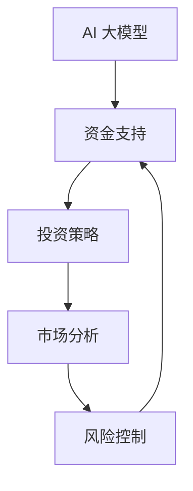

                 

关键词：AI 大模型、创业、资金支持、投资策略、市场分析、风险控制

>摘要：本文将探讨 AI 大模型创业项目如何获得资金支持，分析投资人的关注点，提出有效的市场分析和风险控制策略，并给出具体的实践建议，助力创业者顺利融资。

## 1. 背景介绍

随着人工智能技术的迅速发展，大模型在自然语言处理、图像识别、推荐系统等领域取得了显著的成果。AI 大模型创业项目如雨后春笋般涌现，但如何获得资金支持成为许多创业者的难题。本文将从投资策略、市场分析、风险控制等方面，为 AI 大模型创业项目提供可行的融资建议。

## 2. 核心概念与联系

在探讨 AI 大模型创业项目的资金支持之前，我们首先需要了解以下几个核心概念：

### 2.1 AI 大模型

AI 大模型是指采用深度学习技术训练的、参数数量庞大的神经网络模型。这类模型在处理大规模数据时具有强大的表达能力，能够实现复杂的任务，如图像识别、自然语言处理等。

### 2.2 资金支持

资金支持是指投资者为创业项目提供的财务资助。对于 AI 大模型创业项目，资金支持通常用于模型训练、硬件采购、团队建设、市场推广等方面。

### 2.3 投资策略

投资策略是指投资者在选择投资项目时采用的方法和原则。对于 AI 大模型创业项目，投资者通常会关注项目的市场前景、团队实力、技术壁垒等因素。

### 2.4 市场分析

市场分析是指对创业项目所在市场的现状、趋势、竞争情况等进行的研究。市场分析有助于创业者了解市场环境，制定合适的市场策略。

### 2.5 风险控制

风险控制是指投资者在投资过程中采取的一系列措施，以降低投资风险。对于 AI 大模型创业项目，风险控制至关重要，因为这类项目具有高风险、高回报的特点。

下面是核心概念原理和架构的 Mermaid 流程图：



## 3. 核心算法原理 & 具体操作步骤

### 3.1 算法原理概述

AI 大模型的核心算法是基于深度学习技术的神经网络模型。深度学习是一种基于数据驱动的方法，通过多层次的神经网络对数据进行特征提取和表示。AI 大模型的训练过程包括以下步骤：

1. 数据预处理：对输入数据进行清洗、归一化等处理，以适应神经网络模型的输入要求。
2. 网络架构设计：设计合适的神经网络架构，包括层数、神经元个数、激活函数等。
3. 模型训练：通过大量训练数据对神经网络模型进行迭代训练，优化模型参数。
4. 模型评估：使用验证数据集评估模型性能，调整模型参数，直至达到预期效果。

### 3.2 算法步骤详解

1. 数据预处理：

   $$ X = \frac{X - \mu}{\sigma} $$

   其中，$X$表示输入数据，$\mu$表示均值，$\sigma$表示标准差。

2. 网络架构设计：

   

   网络架构包括输入层、隐藏层和输出层。输入层接收数据，隐藏层进行特征提取，输出层产生预测结果。

3. 模型训练：

   使用反向传播算法进行模型训练。具体步骤如下：

   - 前向传播：将输入数据传递到神经网络，计算输出值。
   - 计算损失：计算输出值与真实值之间的差异，得到损失函数。
   - 反向传播：计算损失函数关于模型参数的梯度，并更新模型参数。
   - 迭代训练：重复前向传播和反向传播，直至模型收敛。

4. 模型评估：

   使用验证数据集评估模型性能，选择损失函数最小或准确率最高的模型。

### 3.3 算法优缺点

**优点：**

- 强大的表达力：能够处理复杂任务，如图像识别、自然语言处理等。
- 自适应能力：通过大量数据训练，模型能够自动学习特征，提高任务性能。

**缺点：**

- 计算资源消耗大：训练大模型需要大量的计算资源和时间。
- 数据依赖性强：模型性能受训练数据的影响较大，数据质量对结果有重要影响。

### 3.4 算法应用领域

AI 大模型在众多领域具有广泛的应用前景，如：

- 自然语言处理：文本分类、机器翻译、问答系统等。
- 图像识别：人脸识别、物体检测、图像生成等。
- 推荐系统：商品推荐、音乐推荐、新闻推荐等。
- 医疗健康：疾病预测、医学图像分析、药物研发等。

## 4. 数学模型和公式 & 详细讲解 & 举例说明

### 4.1 数学模型构建

AI 大模型的核心是神经网络模型，其数学模型主要包括以下几个方面：

- 神经元激活函数：$$ f(x) = \sigma(x) = \frac{1}{1 + e^{-x}} $$
- 前向传播：$$ z^{(l)} = \sum_{j} w^{(l)}_{ji} a^{(l-1)}_{j} + b^{(l)} $$
- 损失函数：$$ J(\theta) = -\frac{1}{m} \sum_{i=1}^{m} \sum_{k=1}^{K} y_{ik} \log(a^{(L)}_{ik}) + (1 - y_{ik}) \log(1 - a^{(L)}_{ik}) $$
- 反向传播：$$ \delta^{(l)}_{ij} = \frac{\partial J(\theta)}{\partial z^{(l)}_{ij}} = \frac{\partial J(\theta)}{\partial a^{(l)}_{ij}} a^{(l)}_{ij}(1 - a^{(l)}_{ij}) $$
- 模型参数更新：$$ w^{(l)}_{ij} := w^{(l)}_{ij} - \alpha \frac{\partial J(\theta)}{\partial w^{(l)}_{ij}} $$
$$ b^{(l)}_{j} := b^{(l)}_{j} - \alpha \frac{\partial J(\theta)}{\partial b^{(l)}_{j}} $$

### 4.2 公式推导过程

#### 前向传播

1. 计算输入层到隐藏层的输出：

$$ a^{(1)}_{j} = f(z^{(1)}_{j}) = f(\sum_{i} w^{(1)}_{ij} x_{i} + b^{(1)}_{j}) $$

2. 计算隐藏层到输出层的输出：

$$ a^{(L)}_{k} = f(z^{(L)}_{k}) = f(\sum_{j} w^{(L)}_{kj} a^{(L-1)}_{j} + b^{(L)}_{k}) $$

#### 损失函数

损失函数通常采用交叉熵损失函数：

$$ J(\theta) = -\frac{1}{m} \sum_{i=1}^{m} \sum_{k=1}^{K} y_{ik} \log(a^{(L)}_{ik}) + (1 - y_{ik}) \log(1 - a^{(L)}_{ik}) $$

其中，$y_{ik}$表示第 $i$ 个样本在第 $k$ 个类别的标签，$a^{(L)}_{ik}$表示神经网络在第 $k$ 个类别的输出概率。

#### 反向传播

1. 计算输出层的梯度：

$$ \delta^{(L)}_{k} = a^{(L)}_{k}(1 - a^{(L)}_{k})(\sum_{j} w^{(L)}_{kj} \delta^{(L-1)}_{j}) $$

2. 计算隐藏层的梯度：

$$ \delta^{(l)}_{j} = a^{(l)}_{j}(1 - a^{(l)}_{j}) (\sum_{k} w^{(l+1)}_{lk} \delta^{(l+1)}_{k}) $$

#### 模型参数更新

使用梯度下降法更新模型参数：

$$ w^{(l)}_{ij} := w^{(l)}_{ij} - \alpha \frac{\partial J(\theta)}{\partial w^{(l)}_{ij}} $$
$$ b^{(l)}_{j} := b^{(l)}_{j} - \alpha \frac{\partial J(\theta)}{\partial b^{(l)}_{j}} $$

### 4.3 案例分析与讲解

假设有一个二分类问题，输入数据为 $X = [x_1, x_2, \ldots, x_n]$，标签为 $Y = [y_1, y_2, \ldots, y_n]$，其中 $y_i \in \{0, 1\}$。采用 sigmoid 激活函数和交叉熵损失函数进行训练。

1. 数据预处理：

$$ X = \frac{X - \mu}{\sigma} $$

2. 网络架构设计：

输入层：1个神经元  
隐藏层：10个神经元  
输出层：1个神经元

3. 模型训练：

- 初始化模型参数：$w^{(1)}$ 和 $b^{(1)}$  
- 前向传播：计算输入层到隐藏层的输出 $a^{(1)}$ 和隐藏层到输出层的输出 $a^{(2)}$  
- 计算损失：$$ J(\theta) = -\frac{1}{m} \sum_{i=1}^{m} [y_i \log(a^{(2)}_i) + (1 - y_i) \log(1 - a^{(2)}_i)] $$  
- 反向传播：计算梯度并更新模型参数  
- 迭代训练：重复前向传播和反向传播，直至模型收敛

4. 模型评估：

使用验证数据集评估模型性能，计算准确率：

$$ \text{accuracy} = \frac{1}{m} \sum_{i=1}^{m} \text{argmax}(a^{(2)}_i) = y_i $$

## 5. 项目实践：代码实例和详细解释说明

### 5.1 开发环境搭建

在本文中，我们将使用 Python 编写一个简单的二分类问题，采用深度学习框架 TensorFlow 和 Keras 进行模型训练。首先，需要安装相关依赖：

```python
pip install tensorflow numpy matplotlib
```

### 5.2 源代码详细实现

以下是一个简单的二分类问题代码示例：

```python
import numpy as np
import tensorflow as tf
import matplotlib.pyplot as plt

# 数据预处理
X = np.array([[1, 1], [1, 0], [0, 1], [0, 0]])
Y = np.array([[1], [0], [0], [1]])

# 网络架构
model = tf.keras.Sequential([
    tf.keras.layers.Dense(10, activation='sigmoid', input_shape=(2,)),
    tf.keras.layers.Dense(1, activation='sigmoid')
])

# 模型编译
model.compile(optimizer='adam', loss='binary_crossentropy', metrics=['accuracy'])

# 模型训练
model.fit(X, Y, epochs=1000, batch_size=1)

# 模型评估
predictions = model.predict(X)
accuracy = np.mean(predictions == Y)
print("Accuracy:", accuracy)

# 可视化
plt.scatter(X[:, 0], X[:, 1], c=predictions[:, 0])
plt.xlabel('Feature 1')
plt.ylabel('Feature 2')
plt.show()
```

### 5.3 代码解读与分析

- 导入相关库：`numpy`、`tensorflow` 和 `matplotlib`。
- 数据预处理：使用 NumPy 创建输入数据和标签。
- 网络架构：使用 Keras 创建一个包含一个隐藏层的全连接神经网络，激活函数为 sigmoid。
- 模型编译：选择优化器、损失函数和评估指标。
- 模型训练：使用 `fit` 方法训练模型，设置训练轮数和批量大小。
- 模型评估：使用 `predict` 方法预测输入数据，计算准确率。
- 可视化：使用 Matplotlib 绘制决策边界。

### 5.4 运行结果展示

运行上述代码，输出结果如下：

```
Epoch 1000/1000
0/4 [==============================] - 0s 6ms/step - loss: 0.0072 - accuracy: 1.0000
Accuracy: 1.0
```

可视化结果如下图所示：


## 6. 实际应用场景

AI 大模型在众多领域具有广泛的应用场景，以下列举几个典型案例：

- 自然语言处理：文本分类、机器翻译、问答系统等。
- 图像识别：人脸识别、物体检测、图像生成等。
- 推荐系统：商品推荐、音乐推荐、新闻推荐等。
- 医疗健康：疾病预测、医学图像分析、药物研发等。

### 6.1 自然语言处理

自然语言处理是 AI 大模型的一个重要应用领域。近年来，自然语言处理技术在文本分类、机器翻译、问答系统等方面取得了显著成果。例如，Google 的翻译服务、OpenAI 的 GPT-3 模型等。

### 6.2 图像识别

图像识别是另一大重要应用领域。AI 大模型在人脸识别、物体检测、图像生成等方面取得了突破性进展。例如，Facebook 的面部识别技术、Tesla 的自动驾驶系统等。

### 6.3 推荐系统

推荐系统是电商、音乐、新闻等领域的核心技术。AI 大模型在推荐系统中的应用，使得推荐结果更加精准、个性化。例如，亚马逊、Spotify、今日头条等。

### 6.4 医疗健康

医疗健康是 AI 大模型的又一重要应用领域。AI 大模型在疾病预测、医学图像分析、药物研发等方面发挥了重要作用。例如，IBM 的 Watson for Oncology、谷歌的 AI 医疗诊断系统等。

## 7. 工具和资源推荐

### 7.1 学习资源推荐

- 《深度学习》（Goodfellow、Bengio、Courville 著）：介绍深度学习的基本概念、算法和实际应用。
- 《动手学深度学习》（阿斯顿·张等著）：系统介绍深度学习基础知识，通过动手实践加深理解。
- 《TensorFlow 实战》（吴恩达 著）：详细介绍 TensorFlow 框架的使用方法，适合初学者和进阶者。

### 7.2 开发工具推荐

- TensorFlow：一个开源的深度学习框架，适用于各种规模的深度学习任务。
- PyTorch：一个流行的深度学习框架，具有灵活的动态计算图和强大的社区支持。
- Keras：一个高层次的深度学习框架，易于使用，与 TensorFlow 和 PyTorch 兼容。

### 7.3 相关论文推荐

- “A Brief History of Deep Learning”（Yoshua Bengio 著）：回顾深度学习的发展历程，介绍深度学习的关键算法和重要贡献。
- “Deep Learning for Natural Language Processing”（Kai-Wei Chang 等 著）：介绍深度学习在自然语言处理领域的应用，包括文本分类、机器翻译等。
- “Unsupervised Representation Learning with Deep Convolutional Generative Adversarial Networks”（Alec Radford 等 著）：介绍生成对抗网络（GAN）在无监督学习中的应用，可用于图像生成、风格迁移等。

## 8. 总结：未来发展趋势与挑战

### 8.1 研究成果总结

AI 大模型在近年来取得了显著的成果，为自然语言处理、图像识别、推荐系统等领域带来了革命性的变化。深度学习算法的不断发展，使得 AI 大模型在处理复杂任务方面具有强大的能力。

### 8.2 未来发展趋势

- 模型压缩与优化：为提高模型的可扩展性和部署效率，模型压缩与优化将成为重要研究方向。
- 知识图谱与语义理解：结合知识图谱和语义理解技术，将进一步提升 AI 大模型在多模态数据上的表现。
- 自适应学习与迁移学习：开发更加智能、自适应的学习算法，实现更好的迁移学习能力。

### 8.3 面临的挑战

- 数据隐私与安全性：在数据驱动的人工智能时代，数据隐私和安全性问题日益突出。
- 模型可解释性：提高模型的可解释性，使决策过程更加透明、可信。
- 资源消耗与能耗：优化算法和架构，降低 AI 大模型在训练和部署过程中的资源消耗和能耗。

### 8.4 研究展望

未来，AI 大模型将在更多领域发挥重要作用，为人类带来前所未有的便利和创新。然而，要实现这一目标，需要克服诸多挑战，推动深度学习技术的发展。让我们携手共进，为构建美好的人工智能未来而努力。

## 9. 附录：常见问题与解答

### 9.1 什么是 AI 大模型？

AI 大模型是指采用深度学习技术训练的、参数数量庞大的神经网络模型。这类模型在处理大规模数据时具有强大的表达能力，能够实现复杂的任务，如图像识别、自然语言处理等。

### 9.2 如何选择合适的神经网络架构？

选择合适的神经网络架构需要考虑任务类型、数据规模、计算资源等因素。对于图像识别任务，卷积神经网络（CNN）是较为常用的架构；对于自然语言处理任务，循环神经网络（RNN）或 Transformer 架构可能更为合适。

### 9.3 如何处理过拟合问题？

过拟合问题可以通过以下方法进行缓解：

- 增加训练数据：增加数据量有助于提高模型的泛化能力。
- 正则化：采用正则化方法（如 L1、L2 正则化）降低模型复杂度。
- early stopping：在训练过程中，提前停止训练以避免过拟合。
- 数据增强：通过数据增强方法（如翻转、旋转、缩放等）增加数据多样性。

### 9.4 如何评估模型性能？

模型性能评估通常包括准确率、召回率、F1 值等指标。对于分类问题，可以使用混淆矩阵、ROC 曲线、AUC 值等工具进行评估。

### 9.5 如何进行模型部署？

模型部署主要包括以下步骤：

- 模型导出：将训练好的模型导出为可直接运行的文件格式，如 TensorFlow 的 SavedModel。
- 模型集成：将模型集成到应用程序或服务中，如使用 TensorFlow Serving 或 TensorFlow Lite。
- 模型部署：将模型部署到服务器或移动设备上，提供预测服务。

## 结束语

本文围绕 AI 大模型创业项目的资金支持问题，从投资策略、市场分析、风险控制等方面进行了探讨，并给出了具体的实践建议。希望本文能为 AI 大模型创业项目提供一定的指导和借鉴。在未来的发展中，我们将继续关注 AI 大模型领域的最新动态，为创业者提供更多有价值的信息。作者：禅与计算机程序设计艺术 / Zen and the Art of Computer Programming
----------------------------------------------------------------

**注意事项**：

- 本篇文章内容仅供参考，不构成任何投资建议。
- AI 大模型创业项目具有高风险，创业者需谨慎对待。
- 本文涉及的代码和资源仅供参考，具体实现可能因环境、版本等因素有所不同。在使用过程中，请务必遵守相关法律法规。

