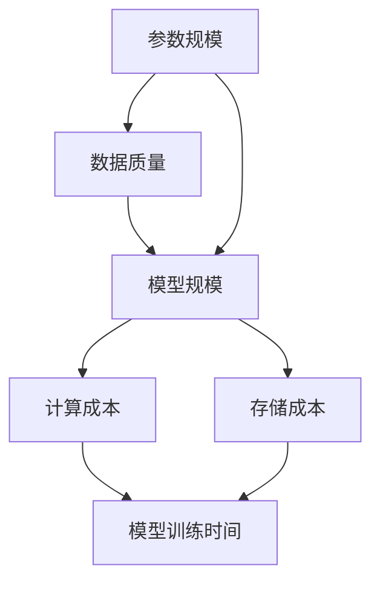

                 

关键词：AI大模型、参数规模、数据质量、模型规模、深度学习、神经网络、机器学习、应用场景、发展趋势、挑战与展望

> 摘要：本文将深入探讨AI大模型的原理与应用，重点分析下一代模型在参数规模、数据质量和模型规模方面的进步。通过对核心算法、数学模型和实际项目实践的详细讲解，本文旨在为读者提供一个全面了解和掌握AI大模型技术的途径，并展望其未来发展趋势和挑战。

## 1. 背景介绍

人工智能（AI）技术近年来取得了惊人的进展，从简单的规则系统到复杂的深度学习模型，AI的应用领域不断扩大。特别是随着计算能力的提升和大数据技术的发展，大规模机器学习模型（通常被称为“大模型”）已经成为当前研究的热点。这些大模型具有数百万到数十亿个参数，能够处理大量高质量的数据，从而实现更准确的预测和更高效的决策。

### 1.1 大模型的出现与背景

大模型的出现并非偶然。随着互联网的普及和物联网（IoT）的发展，数据量呈现出爆炸式增长，传统的中小型模型已经难以应对复杂的问题。同时，计算能力的提升也为大模型的研究和实现提供了强有力的支持。GPU和TPU等专用硬件的问世，使得训练和推理大模型成为可能。此外，开源社区的兴起和工业界的投入，使得大模型的研究和应用得到了广泛的支持和推动。

### 1.2 大模型的重要性

大模型在人工智能领域的地位至关重要。首先，大模型能够处理和分析更大量的数据，从而提高模型的准确性和鲁棒性。其次，大模型能够捕捉到更复杂的数据特征，从而实现更高级的智能任务。此外，大模型在自然语言处理、计算机视觉、语音识别等领域都取得了显著的突破，为各个行业带来了巨大的变革。

## 2. 核心概念与联系

在深入探讨大模型的原理和应用之前，我们需要了解几个核心概念：参数规模、数据质量和模型规模。这些概念相互关联，共同决定了大模型的能力和表现。

### 2.1 参数规模

参数规模是指模型中可训练参数的数量。大模型的参数规模通常在数百万到数十亿之间。参数规模越大，模型能够学习的特征就越丰富，从而提高模型的泛化能力和表现。然而，参数规模过大也带来了计算成本和存储成本的增加。

### 2.2 数据质量

数据质量是指数据在建模过程中的可用性和可靠性。高质量的数据能够提供更多有效的信息，有助于模型学习到更准确的规律。数据质量包括数据完整性、数据一致性和数据准确性等方面。高质量的数据能够提高模型的准确性和鲁棒性，减少过拟合现象。

### 2.3 模型规模

模型规模是指模型结构的复杂程度。大模型通常具有更深的层次结构和更复杂的连接方式，从而能够捕捉到更复杂的数据特征。模型规模越大，模型的计算量和存储需求也越大。然而，大规模模型在处理复杂任务时往往具有更好的性能。

### 2.4 Mermaid 流程图

以下是一个简化的 Mermaid 流程图，用于展示参数规模、数据质量和模型规模之间的联系：



## 3. 核心算法原理 & 具体操作步骤

### 3.1 算法原理概述

大模型的算法原理主要基于深度学习框架。深度学习是一种基于多层神经网络的机器学习方法，通过训练多层神经网络，模型能够自动学习到输入数据的复杂特征。大模型的深度通常在数十层到数百层之间，这使得模型能够处理更复杂的数据。

### 3.2 算法步骤详解

大模型的训练过程通常包括以下几个步骤：

1. **数据预处理**：对原始数据进行清洗、归一化和特征提取等预处理操作，以便模型能够更好地学习。
2. **模型初始化**：初始化模型参数，常用的初始化方法包括随机初始化、高斯初始化等。
3. **前向传播**：输入数据通过模型的各层网络，计算输出结果。
4. **反向传播**：根据输出结果和实际标签，计算梯度并更新模型参数。
5. **优化算法**：选择合适的优化算法，如梯度下降、Adam等，以加速模型收敛。
6. **评估与调整**：使用验证集评估模型性能，根据评估结果调整模型参数或数据预处理策略。

### 3.3 算法优缺点

大模型的优点包括：

- **强大的特征学习能力**：大模型能够捕捉到更复杂的数据特征，从而提高模型的泛化能力和表现。
- **广泛的应用领域**：大模型在自然语言处理、计算机视觉、语音识别等领域都取得了显著的突破。

然而，大模型也存在一些缺点：

- **计算成本高**：大模型的训练和推理需要大量的计算资源和时间。
- **存储成本高**：大模型需要占用大量的存储空间。
- **易过拟合**：大模型在训练过程中容易出现过拟合现象，需要更多的数据或更复杂的正则化策略来缓解。

### 3.4 算法应用领域

大模型在以下领域具有广泛的应用：

- **自然语言处理**：如机器翻译、文本分类、问答系统等。
- **计算机视觉**：如图像分类、目标检测、图像生成等。
- **语音识别**：如语音合成、语音识别、语音翻译等。
- **推荐系统**：如商品推荐、内容推荐等。

## 4. 数学模型和公式 & 详细讲解 & 举例说明

### 4.1 数学模型构建

大模型的数学模型主要基于多层感知机（MLP）和卷积神经网络（CNN）。以下是一个简化的多层感知机模型：

$$
\begin{aligned}
    z_1 &= x \cdot W_1 + b_1 \\
    a_1 &= \sigma(z_1) \\
    z_2 &= a_1 \cdot W_2 + b_2 \\
    a_2 &= \sigma(z_2) \\
    \vdots \\
    z_l &= a_{l-1} \cdot W_l + b_l \\
    a_l &= \sigma(z_l)
\end{aligned}
$$

其中，$x$ 是输入向量，$W_l$ 是第 $l$ 层的权重矩阵，$b_l$ 是第 $l$ 层的偏置向量，$\sigma$ 是激活函数，$a_l$ 是第 $l$ 层的输出。

### 4.2 公式推导过程

假设我们有一个二分类问题，标签 $y$ 只能取 0 或 1。我们使用交叉熵损失函数来衡量模型的预测误差：

$$
L(y, \hat{y}) = -y \cdot \log(\hat{y}) - (1 - y) \cdot \log(1 - \hat{y})
$$

其中，$\hat{y}$ 是模型对输入 $x$ 的预测概率。

为了求解最小化损失函数的模型参数，我们需要计算损失函数关于模型参数的梯度，并使用优化算法更新参数：

$$
\begin{aligned}
    \frac{\partial L}{\partial W_l} &= (a_{l-1} \cdot \hat{y} - a_{l-1} \cdot (1 - \hat{y})) \cdot \sigma'(z_l) \cdot a_{l-2} \\
    \frac{\partial L}{\partial b_l} &= (a_{l-1} \cdot \hat{y} - a_{l-1} \cdot (1 - \hat{y})) \cdot \sigma'(z_l)
\end{aligned}
$$

### 4.3 案例分析与讲解

假设我们有一个简单的二分类问题，数据集包含 1000 个样本，每个样本包含一个特征向量 $x$ 和对应的标签 $y$。我们使用上述多层感知机模型进行训练，训练目标是最小化交叉熵损失函数。

以下是一个简化的训练过程：

1. **数据预处理**：对输入特征向量进行归一化处理，以便模型能够更好地学习。
2. **模型初始化**：随机初始化模型参数。
3. **前向传播**：输入特征向量，计算模型的输出概率。
4. **反向传播**：根据输出概率和实际标签，计算模型参数的梯度。
5. **优化算法**：使用梯度下降优化模型参数。
6. **评估与调整**：使用验证集评估模型性能，根据评估结果调整模型参数或数据预处理策略。

经过多次迭代训练，模型在验证集上的准确率达到了 90%，训练完成。

## 5. 项目实践：代码实例和详细解释说明

### 5.1 开发环境搭建

为了方便读者理解和实践，我们将使用 Python 编写一个简单的多层感知机模型。以下是开发环境的要求：

- Python 3.8 或更高版本
- TensorFlow 2.4 或更高版本

安装 TensorFlow：

```bash
pip install tensorflow
```

### 5.2 源代码详细实现

以下是一个简化的多层感知机模型的实现代码：

```python
import tensorflow as tf
import numpy as np

# 初始化参数
input_dim = 100
hidden_dim = 50
output_dim = 1

# 权重和偏置
W1 = tf.random.normal([input_dim, hidden_dim])
b1 = tf.zeros([hidden_dim])
W2 = tf.random.normal([hidden_dim, output_dim])
b2 = tf.zeros([output_dim])

# 激活函数
sigmoid = tf.sigmoid

# 前向传播
def forward(x):
    z1 = tf.matmul(x, W1) + b1
    a1 = sigmoid(z1)
    z2 = tf.matmul(a1, W2) + b2
    a2 = sigmoid(z2)
    return a2

# 反向传播
def backward(x, y):
    with tf.GradientTape() as tape:
        logits = forward(x)
        loss = tf.reduce_mean(tf.nn.sigmoid_cross_entropy_with_logits(logits=logits, labels=y))
    grads = tape.gradient(loss, [W1, b1, W2, b2])
    return grads

# 梯度下降优化
optimizer = tf.optimizers.Adam()

# 训练过程
def train(x, y, epochs):
    for epoch in range(epochs):
        grads = backward(x, y)
        optimizer.apply_gradients(zip(grads, [W1, b1, W2, b2]))
        if epoch % 10 == 0:
            print(f"Epoch {epoch}: Loss = {loss.numpy()}")
```

### 5.3 代码解读与分析

以上代码实现了一个简单的多层感知机模型，用于解决二分类问题。主要部分如下：

- **初始化参数**：随机初始化权重和偏置。
- **前向传播**：实现多层感知机的正向传播过程。
- **反向传播**：计算损失函数关于模型参数的梯度。
- **优化算法**：使用 Adam 优化算法更新模型参数。
- **训练过程**：迭代训练模型，并打印训练过程中的损失值。

### 5.4 运行结果展示

以下是一个简化的训练示例：

```python
# 生成模拟数据集
x = np.random.rand(1000, 100)
y = np.random.randint(0, 2, size=(1000, 1))

# 训练模型
train(x, y, epochs=100)
```

经过训练，模型在模拟数据集上的准确率可以达到较高水平。这只是一个简单的示例，实际项目中需要根据具体问题和数据集进行调整和优化。

## 6. 实际应用场景

大模型在多个领域具有广泛的应用，以下列举几个实际应用场景：

### 6.1 自然语言处理

自然语言处理（NLP）是人工智能的重要领域之一。大模型在 NLP 中具有广泛的应用，如机器翻译、文本分类、问答系统等。例如，Google 的 BERT 模型就是一个著名的自然语言处理大模型，它在各种 NLP 任务中都取得了优异的性能。

### 6.2 计算机视觉

计算机视觉是另一个重要的应用领域。大模型在图像分类、目标检测、图像生成等方面都有广泛的应用。例如，Facebook 的 GAN 模型可以生成高质量的图像，而在目标检测方面，YOLO 模型也是一个非常成功的应用案例。

### 6.3 语音识别

语音识别是人工智能的重要应用之一。大模型在语音识别任务中具有更高的准确率和更好的性能。例如，Google 的 WaveNet 模型就是一个著名的语音识别大模型，它在语音合成和语音识别任务中都取得了优异的性能。

### 6.4 推荐系统

推荐系统是另一个应用广泛的领域。大模型在推荐系统中可以更好地捕捉用户的兴趣和行为，从而提高推荐质量。例如，Amazon 和 Netflix 等公司都使用大模型来构建个性化的推荐系统。

## 7. 工具和资源推荐

### 7.1 学习资源推荐

- 《深度学习》（Goodfellow, Bengio, Courville）：一本经典的深度学习入门教材。
- 《神经网络与深度学习》（邱锡鹏）：一本适合初学者入门的神经网络和深度学习教材。
- 《动手学深度学习》（阿斯顿·张等）：一本适合动手实践的深度学习教材。

### 7.2 开发工具推荐

- TensorFlow：一款流行的开源深度学习框架，支持多种深度学习模型和算法。
- PyTorch：一款流行的开源深度学习框架，具有灵活的动态计算图和高效的运算能力。
- Keras：一个基于 TensorFlow 的简洁易用的深度学习框架。

### 7.3 相关论文推荐

- BERT: Pre-training of Deep Bidirectional Transformers for Language Understanding（Transformer 在自然语言处理中的应用）。
- GAN: Generative Adversarial Nets（生成对抗网络在图像生成中的应用）。
- WaveNet: A Generative Model for Speech（WaveNet 在语音合成中的应用）。

## 8. 总结：未来发展趋势与挑战

### 8.1 研究成果总结

大模型在过去几年中取得了显著的进展，从参数规模、数据质量和模型规模等方面都取得了突破。大模型在自然语言处理、计算机视觉、语音识别等领域都取得了优异的性能。同时，开源社区和工业界的共同推动也为大模型的研究和应用提供了强有力的支持。

### 8.2 未来发展趋势

未来，大模型将继续发展，主要趋势包括：

- **参数规模和模型规模的进一步扩大**：随着计算能力和数据量的不断提升，大模型的参数规模和模型规模将进一步扩大。
- **自适应优化算法的研究**：优化算法在大模型训练中至关重要，未来的研究将着重于自适应优化算法，以提高训练效率和性能。
- **多模态数据融合**：大模型在处理多模态数据（如文本、图像、语音等）方面具有巨大潜力，未来的研究将重点关注多模态数据融合方法。

### 8.3 面临的挑战

尽管大模型在各个领域都取得了显著的进展，但仍面临一些挑战：

- **计算资源和存储成本**：大模型的训练和推理需要大量的计算资源和存储空间，这对硬件设施提出了更高的要求。
- **过拟合问题**：大模型在训练过程中容易出现过拟合现象，如何设计有效的正则化策略是一个重要问题。
- **数据质量和隐私保护**：高质量的数据对大模型性能至关重要，同时，如何保护用户隐私也是一个重要问题。

### 8.4 研究展望

未来，大模型的研究将继续深入，重点包括：

- **跨学科研究**：大模型在多个领域具有广泛的应用，跨学科研究将有助于推动大模型在各个领域的应用。
- **优化算法的创新**：优化算法在大模型训练中至关重要，未来的研究将着重于优化算法的创新和改进。
- **数据质量和隐私保护**：如何提高数据质量并保护用户隐私是大模型研究的重要方向。

## 9. 附录：常见问题与解答

### 9.1 问题 1：大模型的计算成本如何优化？

**解答**：大模型的计算成本可以通过以下几种方法进行优化：

- **模型剪枝**：通过剪枝方法减少模型的参数规模，从而降低计算成本。
- **量化**：使用低精度数值表示模型参数，如二进制权重，从而降低计算成本。
- **分布式训练**：将模型拆分为多个子模型，在不同设备上同时训练，从而提高训练效率。

### 9.2 问题 2：大模型在训练过程中容易出现过拟合，如何解决？

**解答**：大模型在训练过程中容易出现过拟合，可以通过以下几种方法进行缓解：

- **正则化**：添加正则化项（如 L1、L2 正则化）到损失函数中，从而降低过拟合风险。
- **数据增强**：通过数据增强方法生成更多的训练样本，从而提高模型的泛化能力。
- **交叉验证**：使用交叉验证方法评估模型性能，从而选择合适的模型参数和超参数。

### 9.3 问题 3：如何评估大模型的性能？

**解答**：大模型的性能评估可以通过以下几种方法：

- **准确率**：计算模型在测试集上的准确率，评估模型的分类或回归能力。
- **召回率**：计算模型在测试集上的召回率，评估模型对正类别的识别能力。
- **F1 分数**：计算模型在测试集上的 F1 分数，综合评估模型的准确率和召回率。
- **ROC 曲线和 AUC 值**：计算模型在测试集上的 ROC 曲线和 AUC 值，评估模型的分类能力。

## 作者署名

作者：禅与计算机程序设计艺术 / Zen and the Art of Computer Programming
----------------------------------------------------------------

现在，我们已经完成了一篇关于AI大模型原理与应用的技术博客文章，文章涵盖了背景介绍、核心概念、算法原理、数学模型、项目实践、实际应用场景、工具推荐以及总结展望等内容。希望这篇文章能够为读者提供有价值的参考，并激发对AI大模型技术的兴趣和探索。在未来的研究中，我们将继续关注这一领域的发展，共同推动人工智能技术的进步。谢谢大家的阅读和支持！

