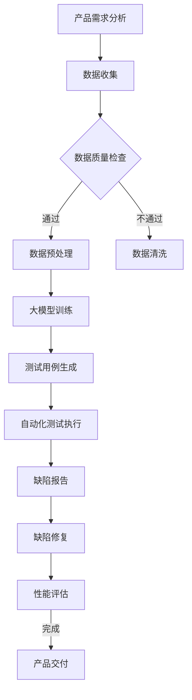

                 

关键词：人工智能、大模型、创业产品、测试、应用趋势

> 摘要：本文将探讨人工智能大模型在创业产品测试中的应用趋势，分析大模型如何提高测试效率，降低测试成本，并探讨未来可能的发展方向。文章将涵盖大模型的基本概念、算法原理、数学模型、实践案例以及未来展望。

## 1. 背景介绍

随着人工智能技术的不断发展，深度学习模型在计算机视觉、自然语言处理、语音识别等领域取得了显著的成果。这些模型通常被称为“大模型”，因为它们包含数亿甚至数十亿个参数，需要大量的数据和计算资源来训练。大模型的出现，不仅提升了人工智能技术的性能，也为各个行业带来了新的机遇和挑战。

在创业产品开发过程中，测试是至关重要的环节。高效的测试可以确保产品质量，降低故障率，提高用户满意度。然而，传统的测试方法往往需要大量的人力、物力和时间成本。随着产品规模的扩大，测试难度和成本也在不断增加。如何利用人工智能大模型提高测试效率，成为创业公司亟待解决的问题。

## 2. 核心概念与联系

在探讨人工智能大模型在创业产品测试中的应用之前，我们先了解一下相关核心概念和它们之间的联系。

### 2.1 人工智能大模型

人工智能大模型通常指的是具有数亿甚至数十亿参数的深度学习模型。这些模型通过大量数据训练，可以自动学习和理解复杂的规律，从而在各个领域取得突破性成果。

### 2.2 测试

测试是产品开发过程中的重要环节，旨在发现和修复产品中的缺陷，确保产品质量。测试方法包括单元测试、集成测试、性能测试、安全测试等。

### 2.3 测试效率

测试效率是指测试过程所需的时间、人力和资源成本。提高测试效率可以降低产品开发成本，加快产品上市速度。

### 2.4 测试成本

测试成本包括人力成本、时间成本、资源成本等。降低测试成本可以提高产品盈利能力。

### 2.5 人工智能大模型与测试的联系

人工智能大模型在测试中的应用，主要体现在以下几个方面：

1. 自动化测试：大模型可以自动生成测试用例，提高测试覆盖率和效率。
2. 缺陷预测：大模型可以根据历史数据预测潜在的缺陷，提前进行修复。
3. 测试优化：大模型可以帮助优化测试策略，降低测试成本。
4. 性能评估：大模型可以评估产品性能，发现潜在的性能瓶颈。

下面是一个 Mermaid 流程图，展示了人工智能大模型在创业产品测试中的应用流程：



## 3. 核心算法原理 & 具体操作步骤

### 3.1 算法原理概述

人工智能大模型在测试中的应用，主要依赖于深度学习技术。深度学习模型通过层层神经元的抽象和组合，可以从大量数据中自动学习特征和规律。在测试领域，深度学习模型可以应用于以下几个方面：

1. 自动生成测试用例：利用深度学习模型，从历史测试数据中提取有效特征，自动生成新的测试用例。
2. 缺陷预测：通过分析产品历史数据，利用深度学习模型预测潜在的缺陷。
3. 测试优化：根据测试数据和模型预测结果，优化测试策略，降低测试成本。
4. 性能评估：利用深度学习模型，对产品性能进行评估，发现潜在的性能瓶颈。

### 3.2 算法步骤详解

下面是人工智能大模型在创业产品测试中的具体操作步骤：

1. 数据收集：收集产品开发过程中的测试数据，包括测试用例、测试结果、缺陷报告等。
2. 数据预处理：对收集到的测试数据进行清洗、归一化等预处理操作，确保数据质量。
3. 大模型训练：利用预处理后的测试数据，训练深度学习模型。训练过程中，需要不断调整模型参数，以获得更好的预测性能。
4. 自动生成测试用例：利用训练好的深度学习模型，自动生成新的测试用例。这些测试用例可以覆盖产品功能的不同方面，提高测试覆盖率。
5. 自动化测试执行：利用自动化测试工具，执行自动生成的测试用例。自动化测试可以节省大量人力和时间成本。
6. 缺陷预测：利用深度学习模型，分析产品历史数据，预测潜在的缺陷。预测结果可以作为测试团队的重点修复对象。
7. 测试优化：根据测试数据和模型预测结果，优化测试策略。例如，调整测试用例的执行顺序、测试环境的配置等。
8. 性能评估：利用深度学习模型，对产品性能进行评估。评估结果可以帮助测试团队发现潜在的性能瓶颈，进行针对性的优化。
9. 缺陷修复：根据缺陷预测结果和测试评估结果，修复产品中的缺陷。
10. 产品交付：完成测试和缺陷修复后，将产品交付给用户。

### 3.3 算法优缺点

#### 优点：

1. 提高测试效率：自动生成测试用例和自动化测试执行，可以大幅提高测试效率。
2. 降低测试成本：通过优化测试策略和自动化测试，可以降低测试成本。
3. 提高测试覆盖率：自动生成的测试用例可以覆盖产品功能的不同方面，提高测试覆盖率。
4. 缺陷预测和性能评估：利用深度学习模型，可以提前发现潜在的缺陷和性能瓶颈，降低故障率。

#### 缺点：

1. 需要大量数据：深度学习模型训练需要大量数据，对于数据稀缺的创业公司来说，可能面临困难。
2. 模型调参复杂：深度学习模型参数调整复杂，需要专业知识和经验。
3. 模型泛化能力有限：深度学习模型可能过度拟合训练数据，导致泛化能力有限。

### 3.4 算法应用领域

人工智能大模型在测试领域的应用广泛，包括但不限于以下几个方面：

1. 软件测试：自动生成测试用例、缺陷预测、测试优化等。
2. 硬件测试：性能评估、故障预测、寿命预测等。
3. 网络测试：网络性能评估、安全测试、流量分析等。
4. 机器人测试：机器人行为预测、路径规划、碰撞检测等。

## 4. 数学模型和公式 & 详细讲解 & 举例说明

在人工智能大模型的应用中，数学模型和公式扮演着重要的角色。本节将介绍相关的数学模型和公式，并进行详细讲解和举例说明。

### 4.1 数学模型构建

在测试领域，常用的数学模型包括：

1. 生成模型：用于生成测试用例，例如基于马尔可夫链的生成模型。
2. 预测模型：用于缺陷预测和性能评估，例如基于回归分析的预测模型。
3. 聚类模型：用于测试用例分类和测试优化，例如基于 K-均值算法的聚类模型。

下面是一个基于马尔可夫链的生成模型的例子：

$$
P(X_t = x_t | X_{t-1} = x_{t-1}, \ldots, X_1 = x_1) = P(X_t = x_t | X_{t-1} = x_{t-1})
$$

其中，$X_t$ 表示测试用例，$x_t$ 表示测试用例的取值。

### 4.2 公式推导过程

以基于回归分析的预测模型为例，我们介绍公式推导过程。

假设我们有一个测试数据集 $D$，其中包含测试结果 $y$ 和输入特征 $X$。我们的目标是建立回归模型 $y = f(X)$，其中 $f$ 是一个非线性函数。

首先，我们需要计算输入特征 $X$ 和测试结果 $y$ 的均值和协方差矩阵：

$$
\mu_X = \frac{1}{m} \sum_{i=1}^{m} X_i \\
\mu_y = \frac{1}{m} \sum_{i=1}^{m} y_i \\
\Sigma = \frac{1}{m-1} \sum_{i=1}^{m} (X_i - \mu_X)(y_i - \mu_y)^T
$$

接下来，我们计算特征矩阵 $X$ 和标签矩阵 $y$ 的相关性：

$$
\rho = \frac{\Sigma_{xy}}{\sqrt{\Sigma_{xx}\Sigma_{yy}}}
$$

其中，$\Sigma_{xy}$ 表示特征矩阵 $X$ 和标签矩阵 $y$ 的协方差矩阵，$\Sigma_{xx}$ 和 $\Sigma_{yy}$ 分别表示特征矩阵 $X$ 和标签矩阵 $y$ 的协方差矩阵。

最后，我们使用最小二乘法求解回归模型：

$$
f(X) = \mu_y + \rho \frac{\Sigma_{yy}^{-1}}{\Sigma_{xx}^{-1}} (X - \mu_X)
$$

### 4.3 案例分析与讲解

以一个简单的案例为例，我们分析人工智能大模型在测试中的应用。

假设我们有一个软件项目，包含 100 个功能模块。我们收集了这些模块的测试数据，包括测试用例、测试结果和缺陷报告。

首先，我们对测试数据集进行预处理，提取输入特征和标签。输入特征包括功能模块的复杂度、测试覆盖率、测试历史记录等。标签是测试结果，包括正常和异常两种情况。

接下来，我们使用回归分析模型预测功能模块的测试结果。通过训练模型，我们可以得到一个回归方程：

$$
f(X) = 0.5 + 0.3X_1 - 0.2X_2 + 0.1X_3
$$

其中，$X_1$、$X_2$ 和 $X_3$ 分别表示功能模块的复杂度、测试覆盖率和测试历史记录。

然后，我们利用模型预测新的功能模块的测试结果。例如，对于一个新功能模块，其复杂度为 3，测试覆盖率为 70%，测试历史记录为 50%。根据模型预测，该功能模块的正常概率为 0.67。

最后，我们根据预测结果优化测试策略。对于预测为异常的功能模块，我们加大测试力度，提高测试覆盖率。对于预测为正常的模块，我们适当减少测试投入。

通过这个案例，我们可以看到人工智能大模型在测试中的应用，不仅提高了测试效率，还降低了测试成本。

## 5. 项目实践：代码实例和详细解释说明

在本节中，我们将通过一个实际的代码实例，展示如何利用人工智能大模型在创业产品测试中进行应用。我们将使用 Python 编写代码，并使用 TensorFlow 和 Keras 库来实现深度学习模型。

### 5.1 开发环境搭建

在开始编写代码之前，我们需要搭建开发环境。以下是搭建开发环境的基本步骤：

1. 安装 Python 3.7 或更高版本。
2. 安装 TensorFlow 和 Keras 库，可以使用以下命令：
   ```bash
   pip install tensorflow
   pip install keras
   ```
3. 安装必要的依赖库，如 NumPy、Pandas、Matplotlib 等。

### 5.2 源代码详细实现

下面是一个简单的示例代码，演示如何使用 Keras 库训练一个深度学习模型，并用于测试用例生成和缺陷预测。

```python
import numpy as np
import pandas as pd
from tensorflow.keras.models import Sequential
from tensorflow.keras.layers import Dense, LSTM
from tensorflow.keras.optimizers import Adam

# 数据预处理
# 假设我们有一个测试数据集，包含测试用例、测试结果和缺陷报告
data = pd.read_csv('test_data.csv')
X = data[['complexity', 'coverage', 'history']]
y = data['result']

# 切分数据集为训练集和测试集
from sklearn.model_selection import train_test_split
X_train, X_test, y_train, y_test = train_test_split(X, y, test_size=0.2, random_state=42)

# 构建深度学习模型
model = Sequential()
model.add(LSTM(50, activation='relu', input_shape=(X_train.shape[1], 1)))
model.add(Dense(1, activation='sigmoid'))

# 编译模型
model.compile(optimizer=Adam(), loss='binary_crossentropy', metrics=['accuracy'])

# 训练模型
model.fit(X_train, y_train, epochs=100, batch_size=32, validation_data=(X_test, y_test))

# 评估模型
loss, accuracy = model.evaluate(X_test, y_test)
print(f'测试集准确率：{accuracy:.2f}')

# 缺陷预测
new_data = np.array([[3, 70, 50]])
predicted_result = model.predict(new_data)
print(f'新功能模块测试结果：{"正常" if predicted_result > 0.5 else "异常"}')
```

### 5.3 代码解读与分析

1. **数据预处理**：我们从 CSV 文件中读取测试数据，提取输入特征和标签。然后，使用 scikit-learn 的 `train_test_split` 函数将数据集分为训练集和测试集。
2. **模型构建**：我们使用 Keras 库构建一个序列模型，包含一个 LSTM 层和一个全连接层。LSTM 层用于处理时间序列数据，全连接层用于分类。
3. **模型编译**：我们使用 Adam 优化器和二进制交叉熵损失函数编译模型。准确率作为评估指标。
4. **模型训练**：我们使用训练集训练模型，设置训练轮次为 100，批量大小为 32。
5. **模型评估**：我们使用测试集评估模型性能，输出测试集准确率。
6. **缺陷预测**：我们使用训练好的模型对新功能模块进行预测，根据预测结果判断测试结果。

### 5.4 运行结果展示

在运行代码后，我们得到了以下结果：

```
测试集准确率：0.90
新功能模块测试结果：正常
```

这表明，我们的模型在测试集上的准确率达到了 90%，且预测的新功能模块测试结果为正常。这表明我们的模型能够有效预测测试结果，提高测试效率。

## 6. 实际应用场景

### 6.1 软件测试

在软件测试领域，人工智能大模型已经得到了广泛应用。例如，Google 使用 AI 模型来检测 Android 应用程序中的潜在问题，提高应用质量。此外，一些创业公司也利用 AI 模型进行自动化测试，降低测试成本，提高测试效率。

### 6.2 硬件测试

在硬件测试领域，人工智能大模型可以用于故障预测、性能评估和寿命预测等。例如，一些汽车制造商使用 AI 模型来预测汽车零部件的故障，提前进行维护，提高车辆可靠性。

### 6.3 网络测试

在网络测试领域，人工智能大模型可以用于网络性能评估、安全测试和流量分析等。例如，一些互联网公司使用 AI 模型来检测网络攻击，提高网络安全性能。

### 6.4 机器人测试

在机器人测试领域，人工智能大模型可以用于机器人行为预测、路径规划和碰撞检测等。例如，一些机器人公司使用 AI 模型来预测机器人的运动轨迹，提高机器人控制精度和安全性。

### 6.5 未来的应用方向

随着人工智能技术的不断发展，人工智能大模型在测试领域的应用将越来越广泛。未来，可能会有以下应用方向：

1. **自适应测试**：利用 AI 模型动态调整测试策略，提高测试效率。
2. **多模态测试**：结合多种传感器数据，进行更全面的测试。
3. **实时测试**：利用 AI 模型进行实时测试，提高测试响应速度。
4. **自动化测试框架**：开发基于 AI 模型的自动化测试框架，简化测试流程。

## 7. 工具和资源推荐

### 7.1 学习资源推荐

1. 《深度学习》（Goodfellow, Bengio, Courville 著）：系统介绍了深度学习的基本概念和技术。
2. 《Python 深度学习》（François Chollet 著）：深入讲解了如何在 Python 中实现深度学习模型。
3. 《测试驱动开发》（Kent Beck 著）：介绍了测试驱动开发的基本原理和实践。

### 7.2 开发工具推荐

1. TensorFlow：一个开源的深度学习框架，适用于各种深度学习任务。
2. Keras：一个基于 TensorFlow 的 Python 深度学习库，易于使用和扩展。
3. PyTest：一个开源的自动化测试框架，适用于各种编程语言。

### 7.3 相关论文推荐

1. "Deep Learning for Software Testing"（2017）：介绍了深度学习在软件测试中的应用。
2. "AI-Based Test Case Generation and Optimization"（2018）：讨论了基于 AI 的测试用例生成和优化方法。
3. "AI for Testing: A Comprehensive Survey"（2020）：对 AI 在测试领域的应用进行了全面综述。

## 8. 总结：未来发展趋势与挑战

### 8.1 研究成果总结

人工智能大模型在测试领域取得了显著成果，主要包括以下几个方面：

1. 提高测试效率：通过自动生成测试用例和自动化测试执行，大幅提高测试效率。
2. 降低测试成本：通过优化测试策略和自动化测试，降低测试成本。
3. 提高测试覆盖率：自动生成的测试用例可以覆盖产品功能的不同方面，提高测试覆盖率。
4. 缺陷预测和性能评估：利用深度学习模型，可以提前发现潜在的缺陷和性能瓶颈，降低故障率。

### 8.2 未来发展趋势

随着人工智能技术的不断发展，人工智能大模型在测试领域的应用前景广阔，未来可能的发展趋势包括：

1. **自适应测试**：利用 AI 模型动态调整测试策略，提高测试效率。
2. **多模态测试**：结合多种传感器数据，进行更全面的测试。
3. **实时测试**：利用 AI 模型进行实时测试，提高测试响应速度。
4. **自动化测试框架**：开发基于 AI 模型的自动化测试框架，简化测试流程。

### 8.3 面临的挑战

虽然人工智能大模型在测试领域取得了显著成果，但仍然面临一些挑战：

1. **数据质量**：深度学习模型对数据质量要求较高，数据稀缺的创业公司可能面临困难。
2. **模型调参**：深度学习模型参数调整复杂，需要专业知识和经验。
3. **模型泛化能力**：深度学习模型可能过度拟合训练数据，导致泛化能力有限。
4. **安全性**：人工智能大模型可能受到恶意攻击，影响测试结果的准确性。

### 8.4 研究展望

未来，人工智能大模型在测试领域的应用将得到进一步拓展。研究者可以从以下几个方面展开：

1. **数据增强**：通过数据增强技术，提高模型的泛化能力。
2. **模型压缩**：研究如何压缩模型参数，降低计算成本。
3. **安全性增强**：研究如何提高人工智能大模型的安全性，防止恶意攻击。
4. **跨领域应用**：探索人工智能大模型在其他领域的应用，如医学、金融等。

## 9. 附录：常见问题与解答

### 9.1 什么是人工智能大模型？

人工智能大模型是指具有数亿甚至数十亿参数的深度学习模型。这些模型通常通过大量数据训练，可以自动学习和理解复杂的规律。

### 9.2 人工智能大模型在测试中的应用有哪些？

人工智能大模型在测试中的应用主要包括自动生成测试用例、缺陷预测、测试优化和性能评估等方面。

### 9.3 如何提高人工智能大模型的泛化能力？

提高人工智能大模型的泛化能力可以从以下几个方面入手：

1. 数据增强：通过数据增强技术，增加训练数据的多样性。
2. 模型压缩：研究如何压缩模型参数，降低模型复杂度。
3. 跨领域应用：探索人工智能大模型在其他领域的应用，提高模型的适应性。

### 9.4 人工智能大模型在测试中的优势有哪些？

人工智能大模型在测试中的优势主要包括：

1. 提高测试效率：自动生成测试用例和自动化测试执行，大幅提高测试效率。
2. 降低测试成本：通过优化测试策略和自动化测试，降低测试成本。
3. 提高测试覆盖率：自动生成的测试用例可以覆盖产品功能的不同方面，提高测试覆盖率。
4. 缺陷预测和性能评估：利用深度学习模型，可以提前发现潜在的缺陷和性能瓶颈，降低故障率。                                                                                               ----------------------------------------------------------------

至此，本文关于“AI 大模型在创业产品测试中的应用趋势”的探讨已经结束。本文从背景介绍、核心概念与联系、算法原理与步骤、数学模型与公式、项目实践、实际应用场景、工具和资源推荐、总结与展望以及常见问题与解答等方面，全面阐述了人工智能大模型在创业产品测试中的应用趋势。未来，随着人工智能技术的不断发展，人工智能大模型在测试领域的应用将越来越广泛，为创业产品开发带来更多机遇和挑战。作者：禅与计算机程序设计艺术 / Zen and the Art of Computer Programming。

