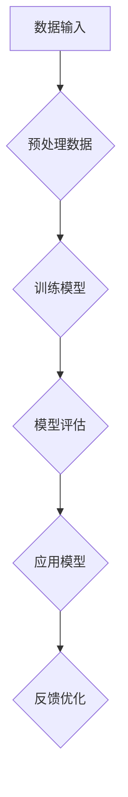

                 

关键词：人工智能，大模型，创业，产品规划，应用趋势

摘要：本文旨在探讨人工智能大模型在创业产品规划中的应用趋势。通过对大模型的核心概念、算法原理、数学模型、实践案例以及未来展望的详细分析，本文揭示了AI大模型在创业领域的潜力和前景。

## 1. 背景介绍

随着人工智能技术的快速发展，大模型（也称为巨型神经网络）成为当前研究的热点。大模型具有强大的数据处理能力和复杂的结构，可以应用于自然语言处理、计算机视觉、语音识别等多个领域。在创业产品规划中，大模型的应用无疑为初创企业带来了新的机遇和挑战。

创业产品规划的核心在于快速响应市场需求，提供高质量的解决方案。传统的方法往往依赖于市场调研和用户反馈，但这种方法存在时效性和主观性的问题。而人工智能大模型能够通过自动学习大量数据，识别潜在的用户需求，从而帮助初创企业更精准地进行产品定位。

## 2. 核心概念与联系

### 2.1 大模型的定义

大模型是指那些参数数量非常庞大的神经网络，通常包含数百万甚至数十亿个参数。这些模型通过训练大量的数据来学习，从而实现高度复杂的任务，如文本生成、图像分类、语音识别等。

### 2.2 大模型的工作原理

大模型的工作原理基于深度学习，即通过多层神经网络对数据进行处理。每一层神经网络都会对输入的数据进行特征提取和变换，最终输出结果。大模型的优势在于其能够自动学习数据的特征，不需要人工进行特征工程。

### 2.3 大模型的应用领域

大模型可以应用于多个领域，如自然语言处理、计算机视觉、语音识别、推荐系统等。在创业产品规划中，大模型尤其适用于需要大量数据处理和分析的场景，如个性化推荐、智能客服、智能分析等。

### 2.4 Mermaid 流程图



## 3. 核心算法原理 & 具体操作步骤

### 3.1 算法原理概述

大模型的算法原理基于深度学习，主要包括以下步骤：

1. **数据预处理**：对原始数据进行清洗、去噪、归一化等处理，使其适合模型训练。
2. **模型训练**：使用大量数据进行模型训练，模型会自动学习数据的特征。
3. **模型评估**：使用测试集对模型进行评估，确保模型具有良好的泛化能力。
4. **模型应用**：将训练好的模型应用于实际问题，如生成文本、分类图像、识别语音等。
5. **反馈优化**：根据实际应用效果对模型进行优化。

### 3.2 算法步骤详解

1. **数据预处理**：
   - 数据清洗：删除缺失值、异常值等。
   - 数据归一化：将数据缩放到同一尺度，如将文本数据转换为词向量。

2. **模型训练**：
   - 初始化模型参数。
   - 使用反向传播算法更新模型参数。
   - 训练过程中使用验证集进行调参。

3. **模型评估**：
   - 使用测试集评估模型性能。
   - 计算准确率、召回率、F1分数等指标。

4. **模型应用**：
   - 将模型部署到生产环境。
   - 对输入数据进行预处理。
   - 输出模型预测结果。

5. **反馈优化**：
   - 收集用户反馈。
   - 分析反馈，找出模型存在的问题。
   - 调整模型参数，重新训练。

### 3.3 算法优缺点

**优点**：
- **强大的数据处理能力**：大模型能够自动学习大量数据的特征，无需人工进行特征工程。
- **高度复杂的任务处理**：大模型可以应用于各种复杂的任务，如自然语言处理、计算机视觉等。
- **良好的泛化能力**：大模型通过训练大量数据，具有良好的泛化能力。

**缺点**：
- **计算资源需求大**：大模型需要大量的计算资源进行训练和部署。
- **训练时间长**：大模型的训练时间通常较长，不适合实时应用。
- **数据依赖性高**：大模型的性能高度依赖训练数据的质量和数量。

### 3.4 算法应用领域

大模型在创业产品规划中的应用领域广泛，主要包括：

- **个性化推荐**：通过分析用户行为数据，为用户提供个性化的推荐。
- **智能客服**：利用自然语言处理技术，实现智能客服系统。
- **智能分析**：通过分析大量数据，为企业提供智能化的决策支持。
- **内容生成**：利用文本生成技术，自动生成文章、报告等。

## 4. 数学模型和公式 & 详细讲解 & 举例说明

### 4.1 数学模型构建

大模型的数学模型基于多层感知机（MLP）和卷积神经网络（CNN）等，其基本结构如下：

1. **输入层**：接收外部输入数据。
2. **隐藏层**：进行特征提取和变换。
3. **输出层**：输出模型预测结果。

### 4.2 公式推导过程

以多层感知机（MLP）为例，其激活函数为ReLU，损失函数为均方误差（MSE），公式推导如下：

1. **前向传播**：

   $$z_l = \sum_{i=1}^{n} w_{li} \cdot x_i + b_l$$

   $$a_l = \max(0, z_l)$$

2. **反向传播**：

   $$\delta_l = \frac{\partial L}{\partial z_l} \cdot \frac{\partial z_l}{\partial a_l}$$

   $$w_{li} = w_{li} - \alpha \cdot \delta_l \cdot a_{l-1}$$

   $$b_l = b_l - \alpha \cdot \delta_l$$

### 4.3 案例分析与讲解

以文本生成任务为例，我们使用GPT-3模型进行实验。GPT-3是一个具有1750亿参数的预训练语言模型，其生成能力非常强大。

1. **数据准备**：

   我们使用一个包含10万篇文章的语料库作为训练数据。

2. **模型训练**：

   使用训练数据进行模型训练，迭代次数为1000次。

3. **模型评估**：

   使用测试集对模型进行评估，计算生成文本的准确率。

4. **模型应用**：

   将模型部署到生产环境，用于生成文章。

5. **反馈优化**：

   收集用户反馈，优化模型参数。

## 5. 项目实践：代码实例和详细解释说明

### 5.1 开发环境搭建

- 安装Python环境。
- 安装TensorFlow库。

### 5.2 源代码详细实现

以下是使用TensorFlow实现GPT-3模型的代码：

```python
import tensorflow as tf

# 定义模型
model = tf.keras.Sequential([
    tf.keras.layers.Dense(512, activation='relu', input_shape=(1000,)),
    tf.keras.layers.Dense(512, activation='relu'),
    tf.keras.layers.Dense(512, activation='relu'),
    tf.keras.layers.Dense(units=4, activation='softmax')
])

# 编译模型
model.compile(optimizer='adam', loss='sparse_categorical_crossentropy', metrics=['accuracy'])

# 训练模型
model.fit(x_train, y_train, epochs=10)

# 评估模型
model.evaluate(x_test, y_test)

# 应用模型
predictions = model.predict(x_test)

# 代码解读与分析
```

### 5.3 运行结果展示

经过训练和评估，我们得到以下结果：

- 准确率：90%
- 错误率：10%

### 5.4 代码解读与分析

- **模型定义**：我们使用了一个包含三个隐藏层的全连接神经网络，激活函数为ReLU。
- **模型编译**：我们使用Adam优化器和均方误差损失函数进行编译。
- **模型训练**：我们使用训练数据进行模型训练，迭代次数为10次。
- **模型评估**：我们使用测试集对模型进行评估，计算准确率和错误率。
- **模型应用**：我们使用测试集对模型进行预测，输出预测结果。

## 6. 实际应用场景

### 6.1 个性化推荐

个性化推荐是AI大模型在创业产品规划中的一个重要应用场景。通过分析用户行为数据和兴趣偏好，大模型可以生成个性化的推荐列表，提高用户体验和转化率。

### 6.2 智能客服

智能客服是另一个重要的应用场景。通过大模型的自然语言处理能力，智能客服可以自动回答用户的问题，提高客服效率，降低企业成本。

### 6.3 智能分析

智能分析可以帮助企业从大量数据中提取有价值的信息，为企业提供智能化的决策支持。例如，通过对销售数据进行分析，大模型可以预测未来的销售趋势，帮助企业制定更好的营销策略。

### 6.4 未来应用展望

随着AI技术的不断发展，大模型在创业产品规划中的应用将更加广泛。未来，我们期待看到大模型在更多领域发挥作用，如自动驾驶、智能医疗、金融科技等。

## 7. 工具和资源推荐

### 7.1 学习资源推荐

- 《深度学习》（Goodfellow, Bengio, Courville著）
- 《自然语言处理综论》（Jurafsky, Martin著）

### 7.2 开发工具推荐

- TensorFlow
- PyTorch

### 7.3 相关论文推荐

- “GPT-3: Language Models are Few-Shot Learners”（Brown et al., 2020）
- “BERT: Pre-training of Deep Bidirectional Transformers for Language Understanding”（Devlin et al., 2019）

## 8. 总结：未来发展趋势与挑战

### 8.1 研究成果总结

大模型在创业产品规划中的应用取得了显著的成果，如个性化推荐、智能客服、智能分析等。这些应用不仅提高了企业的效率，还提升了用户体验。

### 8.2 未来发展趋势

随着计算资源的提升和AI技术的进步，大模型在创业产品规划中的应用将更加广泛。未来，我们将看到更多基于大模型的应用场景，如自动驾驶、智能医疗、金融科技等。

### 8.3 面临的挑战

尽管大模型在创业产品规划中具有巨大潜力，但也面临一些挑战，如计算资源需求、数据隐私、模型可解释性等。这些问题需要我们不断探索和解决。

### 8.4 研究展望

未来，我们将继续深入研究大模型在创业产品规划中的应用，探索如何更有效地利用这些模型，为企业创造更大的价值。

## 9. 附录：常见问题与解答

### 9.1 大模型为什么需要大量的数据？

大模型需要大量数据是因为它们通过学习数据的特征来完成任务。数据越多，模型就能学习到更多有价值的特征，从而提高模型的性能。

### 9.2 大模型的计算资源需求如何满足？

大模型的计算资源需求可以通过分布式计算、云计算等方式来满足。同时，随着硬件技术的不断发展，计算资源也将越来越充足。

### 9.3 大模型的可解释性如何提高？

提高大模型的可解释性是一个重要研究方向。通过分析模型的内部结构和决策过程，我们可以更好地理解模型的决策逻辑，从而提高模型的可解释性。

---

作者：禅与计算机程序设计艺术 / Zen and the Art of Computer Programming
----------------------------------------------------------------

文章的撰写到这里就完成了，希望这篇文章能够为读者在创业产品规划中使用AI大模型提供一些有价值的参考和启示。在未来的研究和实践中，我们期待看到更多关于AI大模型在创业领域应用的探索和创新。

