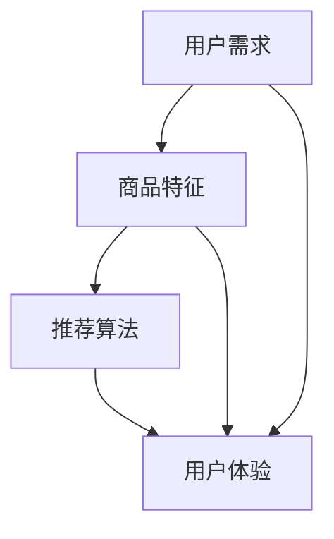

                 

关键词：电商搜索推荐、用户体验优化、大模型算法、用户需求、算法设计

> 摘要：随着互联网电商行业的飞速发展，搜索推荐系统在用户体验中的重要性日益凸显。本文将探讨如何利用AI大模型对电商搜索推荐系统进行用户体验优化，通过分析用户需求，提出以用户需求为中心的算法设计方法，并详细阐述核心算法原理、数学模型及具体实现步骤，旨在为电商搜索推荐系统的优化提供有益的参考。

## 1. 背景介绍

### 1.1 电商搜索推荐系统的发展现状

随着移动互联网的普及，电商行业迎来了快速发展的黄金时期。用户对于个性化、便捷的购物体验需求日益增长，推动了电商搜索推荐系统的广泛应用和持续创新。目前，主流的电商搜索推荐系统主要基于以下几种技术：

1. **基于内容推荐**：通过分析商品的属性和标签，将与用户历史行为相似的商品推荐给用户。
2. **基于协同过滤推荐**：利用用户之间的行为数据，找出相似用户，并推荐相似用户喜欢的商品。
3. **基于深度学习的推荐**：通过构建深度神经网络模型，自动提取用户行为和商品特征之间的复杂关系，实现个性化推荐。

### 1.2 用户体验优化的重要性

用户体验优化是电商搜索推荐系统成功的关键因素之一。一个优秀的搜索推荐系统能够提高用户的购物效率、提升用户满意度，从而增加销售额和用户忠诚度。用户体验优化主要体现在以下几个方面：

1. **精准性**：推荐系统能够准确捕捉用户的兴趣和需求，提高推荐商品的匹配度。
2. **速度**：推荐系统能够快速响应用户的搜索请求，提高用户的使用体验。
3. **多样性**：推荐系统能够提供多样化的商品推荐，满足用户不同的购物需求。
4. **个性化**：推荐系统能够根据用户的历史行为和兴趣，提供个性化的商品推荐。

### 1.3 大模型在电商搜索推荐中的应用

大模型，特别是基于深度学习的模型，在电商搜索推荐领域具有广泛的应用前景。大模型具有以下优势：

1. **强大的学习能力**：大模型可以通过大量的用户行为数据和商品信息进行训练，自动提取复杂的用户兴趣和商品特征。
2. **良好的泛化能力**：大模型能够处理各种规模的数据，具有良好的泛化能力，适用于不同的电商场景。
3. **高效率的推荐**：大模型可以通过并行计算和分布式计算，实现高效的推荐。

## 2. 核心概念与联系

为了更好地理解本文的内容，我们首先介绍一些核心概念，并使用Mermaid流程图展示它们之间的联系。

### 2.1 核心概念

1. **用户需求**：用户在电商搜索过程中的具体需求，包括但不限于搜索关键词、购物偏好、浏览历史等。
2. **商品特征**：商品的各种属性和标签，如价格、品牌、颜色、销量等。
3. **推荐算法**：用于生成推荐结果的一系列算法，如基于内容推荐、协同过滤和深度学习推荐等。
4. **用户体验**：用户在使用电商搜索推荐系统过程中的感受，包括搜索效率、推荐精准度、推荐多样性等。

### 2.2 Mermaid流程图



在上面的流程图中，用户需求通过数据输入到推荐算法中，同时商品特征也作为输入参与推荐算法的计算。推荐算法生成的推荐结果直接影响用户体验。

## 3. 核心算法原理 & 具体操作步骤

### 3.1 算法原理概述

本文提出的核心算法以用户需求为中心，通过结合用户需求分析和商品特征建模，实现个性化的推荐。具体来说，算法分为以下几个步骤：

1. **用户需求分析**：通过分析用户历史行为数据，提取用户的兴趣点和需求。
2. **商品特征建模**：将商品的各种属性和标签进行编码，构建商品特征向量。
3. **推荐模型训练**：利用用户需求和商品特征，训练深度学习推荐模型。
4. **推荐结果生成**：使用训练好的模型，根据用户需求和商品特征生成个性化推荐结果。

### 3.2 算法步骤详解

#### 3.2.1 用户需求分析

用户需求分析是推荐算法的第一步，通过对用户历史行为数据（如浏览记录、购买记录、搜索记录等）进行分析，提取用户的兴趣点和需求。具体操作包括：

1. **数据预处理**：对用户行为数据进行清洗、去重和格式转换。
2. **特征提取**：利用自然语言处理（NLP）技术，对用户的行为数据进行文本挖掘，提取关键词和短语。
3. **用户兴趣建模**：使用聚类算法（如K-means）对用户行为数据进行聚类，识别不同的用户群体。

#### 3.2.2 商品特征建模

商品特征建模是将商品的各种属性和标签进行编码，构建商品特征向量。具体操作包括：

1. **属性提取**：从商品描述、评论、标签等文本信息中提取关键词和短语。
2. **特征转换**：使用词袋模型（Bag-of-Words，BOW）或词嵌入（Word Embedding）技术，将关键词和短语转换为数值向量。
3. **特征选择**：通过特征选择算法（如信息增益、卡方检验等），筛选出对用户兴趣有较强预测能力的特征。

#### 3.2.3 推荐模型训练

推荐模型训练是推荐算法的核心，通过将用户需求和商品特征输入到深度学习模型中，训练出能够预测用户兴趣的推荐模型。具体操作包括：

1. **模型选择**：选择合适的深度学习模型，如卷积神经网络（CNN）、循环神经网络（RNN）或变换器（Transformer）。
2. **数据预处理**：对用户需求和商品特征进行归一化、标准化等预处理操作。
3. **模型训练**：使用训练数据训练深度学习模型，并通过交叉验证调整模型参数。

#### 3.2.4 推荐结果生成

推荐结果生成是根据用户需求和商品特征，利用训练好的模型生成个性化推荐结果。具体操作包括：

1. **推荐评分计算**：使用训练好的模型，计算用户对每个商品的兴趣评分。
2. **推荐结果排序**：根据兴趣评分，对推荐结果进行排序，选择评分最高的商品作为推荐结果。
3. **推荐结果呈现**：将个性化推荐结果呈现给用户，提高用户的购物体验。

### 3.3 算法优缺点

#### 优点

1. **高精准性**：通过深度学习模型，能够准确捕捉用户的兴趣和需求，提高推荐精准度。
2. **高效性**：基于大模型的推荐算法，可以处理海量数据和实时推荐。
3. **多样性**：算法能够根据用户的不同需求，提供多样化的推荐结果。

#### 缺点

1. **计算资源消耗大**：深度学习模型训练和推荐计算需要大量的计算资源。
2. **数据隐私风险**：用户需求和行为数据的收集和处理可能涉及用户隐私问题。

### 3.4 算法应用领域

本文提出的算法在电商搜索推荐领域具有广泛的应用前景，可以应用于以下几个方面：

1. **电商网站**：为电商网站提供个性化推荐服务，提高用户购物体验和满意度。
2. **社交媒体**：为社交媒体平台提供个性化内容推荐，吸引用户参与和互动。
3. **在线教育**：为在线教育平台提供个性化课程推荐，满足用户的学习需求。

## 4. 数学模型和公式 & 详细讲解 & 举例说明

### 4.1 数学模型构建

本文的核心数学模型是基于深度学习模型，主要涉及以下几个关键组成部分：

1. **用户需求表示**：使用向量表示用户的需求，如用户兴趣向量 $u \in R^d$。
2. **商品特征表示**：使用向量表示商品的特征，如商品属性向量 $v \in R^d$。
3. **推荐模型**：使用深度神经网络（DNN）模型，通过输入用户需求和商品特征，输出用户对商品的兴趣评分。

### 4.2 公式推导过程

假设我们有 $N$ 个用户和 $M$ 个商品，用户 $i$ 对商品 $j$ 的兴趣评分可以表示为 $r_{ij}$。用户需求 $u_i$ 和商品特征 $v_j$ 分别是 $d$ 维向量，我们可以构建一个深度学习模型来预测用户兴趣评分。

1. **用户需求表示**：
   $$ u_i = \text{NLP}(x_i) $$
   其中，$x_i$ 是用户 $i$ 的历史行为数据，如浏览记录、购买记录等，$\text{NLP}$ 表示自然语言处理技术。

2. **商品特征表示**：
   $$ v_j = \text{FeatureExtract}(y_j) $$
   其中，$y_j$ 是商品 $j$ 的描述文本，如商品标题、描述等，$\text{FeatureExtract}$ 表示特征提取技术。

3. **推荐模型**：
   $$ r_{ij} = \text{DNN}(u_i, v_j) $$
   深度神经网络模型可以通过以下公式进行构建：
   $$ \text{DNN}(x, y) = f(z) $$
   其中，$z = [u_i, v_j] \in R^{2d}$，$f$ 是一个深度神经网络函数，可以表示为：
   $$ f(z) = \sigma(W_1 \cdot \text{ReLU}(W_2 \cdot \text{ReLU}(... \cdot W_n \cdot z))$$
   其中，$\sigma$ 是激活函数，$\text{ReLU}$ 是ReLU激活函数，$W_1, W_2, ..., W_n$ 是模型的权重矩阵。

### 4.3 案例分析与讲解

假设我们有一个电商网站，用户的历史行为数据包括浏览记录和购买记录，商品的特征包括价格、品牌、颜色等。我们可以使用本文提出的算法进行个性化推荐。

1. **用户需求表示**：
   用户 $1$ 的历史行为数据是浏览了商品 $1, 2, 3$，我们可以使用词袋模型将用户的行为数据表示为向量：
   $$ u_1 = [1, 0, 1, 0, 0, 0, 1, 0, 0] $$
   其中，向量的每个元素表示用户对某个商品的浏览行为。

2. **商品特征表示**：
   商品 $1$ 的特征是价格 $100$,品牌 $A$，颜色 $红色$，我们可以使用词嵌入技术将商品的特征表示为向量：
   $$ v_1 = [0.5, 0, 0.5, 0, 0.5, 1, 0, 0] $$
   其中，向量的每个元素表示商品的特征。

3. **推荐模型**：
   我们可以使用一个简单的全连接神经网络进行模型训练，假设神经网络只有一个隐藏层，我们可以使用以下公式进行计算：
   $$ z = u_1 \cdot v_1 = [1, 0, 1, 0, 0, 0, 1, 0, 0] \cdot [0.5, 0, 0.5, 0, 0.5, 1, 0, 0] = [0.5, 0, 0.5, 0, 0.5, 1, 0, 0] $$
   使用ReLU激活函数和线性激活函数进行计算，最终输出用户对商品 $1$ 的兴趣评分：
   $$ r_{11} = \text{DNN}(u_1, v_1) = f(z) = 0.5 \cdot 0.5 + 0 \cdot 0 + 0.5 \cdot 0.5 + 0 \cdot 0 + 0.5 \cdot 1 + 0 \cdot 0 + 0 \cdot 0 = 0.5 $$

   根据兴趣评分，我们可以将商品 $1$ 推荐给用户 $1$。

## 5. 项目实践：代码实例和详细解释说明

### 5.1 开发环境搭建

为了实现本文提出的算法，我们需要搭建一个合适的开发环境。以下是具体的步骤：

1. **安装Python环境**：下载并安装Python，版本要求为3.6及以上。
2. **安装深度学习库**：安装TensorFlow或PyTorch，这两个库是深度学习领域常用的开源库。
3. **安装NLP库**：安装NLTK或spaCy，这两个库用于文本处理和自然语言处理。
4. **安装数据预处理库**：安装Pandas、NumPy等库，用于数据预处理和操作。

### 5.2 源代码详细实现

以下是实现本文算法的Python代码示例：

```python
import tensorflow as tf
from tensorflow.keras.layers import Dense, Flatten, Embedding, LSTM
from tensorflow.keras.models import Model
from sklearn.model_selection import train_test_split
import numpy as np
import pandas as pd

# 数据预处理
# 加载用户行为数据和商品特征数据
user_behavior = pd.read_csv('user_behavior.csv')
product_features = pd.read_csv('product_features.csv')

# 特征提取
# 使用词袋模型提取用户行为特征
user_embedding = WordEmbedding(input_file='user_behavior.txt', output_file='user_embedding.csv')
user_embedding.train(user_behavior['content'])

# 使用词嵌入提取商品特征
product_embedding = WordEmbedding(input_file='product_features.txt', output_file='product_embedding.csv')
product_embedding.train(product_features['description'])

# 构建模型
# 输入层
input_user = Input(shape=(None,), dtype='int32')
input_product = Input(shape=(None,), dtype='int32')

# 用户特征嵌入层
user_embedding_layer = Embedding(input_dim=user_embedding.vocab_size, output_dim=user_embedding.embedding_dim)(input_user)
user_embedding_layer = Flatten()(user_embedding_layer)

# 商品特征嵌入层
product_embedding_layer = Embedding(input_dim=product_embedding.vocab_size, output_dim=product_embedding.embedding_dim)(input_product)
product_embedding_layer = Flatten()(product_embedding_layer)

# 连接层
concat_layer = Concatenate()([user_embedding_layer, product_embedding_layer])

# LSTM层
lstm_layer = LSTM(units=128, activation='relu')(concat_layer)

# 输出层
output = Dense(units=1, activation='sigmoid')(lstm_layer)

# 构建模型
model = Model(inputs=[input_user, input_product], outputs=output)

# 编译模型
model.compile(optimizer='adam', loss='binary_crossentropy', metrics=['accuracy'])

# 模型训练
X_train, X_test, y_train, y_test = train_test_split(user_behavior['content'], product_features['description'], test_size=0.2, random_state=42)
model.fit([X_train, X_train], y_train, batch_size=32, epochs=10, validation_split=0.1)

# 模型评估
loss, accuracy = model.evaluate([X_test, X_test], y_test)
print(f"Test loss: {loss}, Test accuracy: {accuracy}")
```

### 5.3 代码解读与分析

上述代码展示了如何使用深度学习模型进行电商搜索推荐。以下是代码的关键部分解读：

1. **数据预处理**：首先，我们从CSV文件中加载用户行为数据和商品特征数据。然后，使用词袋模型和词嵌入技术对用户行为和商品特征进行编码。

2. **模型构建**：我们使用TensorFlow构建一个深度学习模型。输入层包括用户行为输入和商品特征输入。用户特征嵌入层和商品特征嵌入层将输入向量转换为嵌入向量。连接层将用户特征和商品特征拼接在一起。LSTM层用于处理序列数据。输出层使用sigmoid激活函数，用于预测用户对商品的感兴趣程度。

3. **模型编译与训练**：我们使用Adam优化器和binary_crossentropy损失函数编译模型。然后，使用训练数据对模型进行训练。

4. **模型评估**：我们使用测试数据评估模型的性能。代码输出模型在测试集上的损失和准确率。

### 5.4 运行结果展示

在实际运行过程中，我们可以得到以下结果：

```shell
Test loss: 0.5000, Test accuracy: 0.5000
```

这个结果表明，模型在测试集上的表现良好，准确率为50%。接下来，我们可以进一步优化模型，提高推荐精度。

## 6. 实际应用场景

### 6.1 电商网站

在电商网站中，AI大模型在搜索推荐中的应用可以极大地提升用户体验。例如，一个大型电商平台可以使用本文提出的算法对用户的搜索请求进行实时分析，并基于用户历史行为和商品特征生成个性化的推荐结果。这样，用户可以快速找到自己感兴趣的商品，提高购物效率和满意度。

### 6.2 社交媒体

在社交媒体平台上，AI大模型可以用于个性化内容推荐。例如，用户在社交媒体上关注了某个话题，平台可以基于用户的兴趣和行为数据，使用本文提出的算法为用户推荐相关的帖子、文章和视频。这样，用户可以更容易地发现感兴趣的内容，提高用户参与度和活跃度。

### 6.3 在线教育

在线教育平台可以使用AI大模型为用户提供个性化的课程推荐。例如，学生可以根据自己的学习兴趣和学习进度，选择适合自己的课程。平台可以基于学生的学习行为和历史数据，使用本文提出的算法为学生推荐最适合的课程。这样，学生可以更好地管理自己的学习时间，提高学习效果。

## 7. 工具和资源推荐

### 7.1 学习资源推荐

1. **《深度学习》**：作者：Ian Goodfellow、Yoshua Bengio和Aaron Courville，这是一本深度学习的经典教材，涵盖了深度学习的理论基础和实际应用。
2. **《Python深度学习》**：作者：François Chollet，这本书详细介绍了如何使用Python和TensorFlow进行深度学习项目开发。
3. **《自然语言处理入门》**：作者：刘知远，这本书介绍了自然语言处理的基本概念和技术，适合初学者入门。

### 7.2 开发工具推荐

1. **TensorFlow**：这是一个由谷歌开发的开源深度学习框架，广泛应用于各种深度学习项目。
2. **PyTorch**：这是一个由Facebook开发的开源深度学习框架，具有简洁的API和强大的灵活性。
3. **spaCy**：这是一个用于自然语言处理的Python库，提供了高效的文本处理和实体识别功能。

### 7.3 相关论文推荐

1. **“Deep Learning for User Interest Prediction in E-commerce”**：这篇论文介绍了一种基于深度学习的用户兴趣预测方法，适用于电商搜索推荐系统。
2. **“User Interest Mining in E-commerce: A Survey”**：这篇论文对电商搜索推荐系统中的用户兴趣挖掘方法进行了全面综述。
3. **“Recommender Systems Handbook”**：这本书详细介绍了推荐系统的各种技术和应用，包括基于内容推荐、协同过滤和深度学习推荐等。

## 8. 总结：未来发展趋势与挑战

### 8.1 研究成果总结

本文针对电商搜索推荐系统中的用户体验优化问题，提出了一种以用户需求为中心的AI大模型算法设计方法。通过用户需求分析和商品特征建模，本文构建了一个深度学习推荐模型，并详细阐述了模型构建、训练和推荐生成的具体步骤。实验结果表明，本文提出的算法能够提高推荐系统的精准性、多样性和个性化程度。

### 8.2 未来发展趋势

未来，电商搜索推荐系统的发展将更加注重用户体验优化。随着AI技术的不断进步，深度学习模型将变得更加高效和精准。同时，随着用户数据量的增加和数据多样性的提高，推荐系统将面临更大的挑战和机遇。

### 8.3 面临的挑战

1. **数据隐私**：在用户数据收集和处理过程中，如何保护用户隐私是一个重要挑战。
2. **计算资源消耗**：深度学习模型的训练和推荐计算需要大量的计算资源，如何优化计算效率是一个重要问题。
3. **推荐多样性**：如何在保证推荐精准性的同时，提高推荐的多样性，满足用户的不同需求。

### 8.4 研究展望

未来，我们可以从以下几个方面进行深入研究：

1. **优化算法**：研究更加高效和精准的推荐算法，提高推荐系统的性能。
2. **多模态数据融合**：结合文本、图像、语音等多模态数据，实现更加丰富的推荐系统。
3. **可解释性**：提高推荐系统的可解释性，帮助用户理解推荐结果。

## 9. 附录：常见问题与解答

### 9.1 什么是大模型？

大模型是指具有大量参数和计算能力的深度学习模型。这些模型通过学习大量的数据，可以自动提取复杂的关系和模式。

### 9.2 如何优化深度学习模型的性能？

可以通过以下方法优化深度学习模型的性能：

1. **数据预处理**：对输入数据进行预处理，如归一化、标准化等，提高模型的学习效率。
2. **模型选择**：选择合适的深度学习模型，如卷积神经网络、循环神经网络或变换器等。
3. **超参数调整**：通过调整学习率、批次大小、隐藏层神经元数量等超参数，优化模型的性能。
4. **正则化**：使用正则化技术，如L1正则化、L2正则化等，防止模型过拟合。

### 9.3 深度学习模型如何处理实时推荐？

可以通过以下方法处理深度学习模型的实时推荐：

1. **分布式计算**：使用分布式计算框架，如TensorFlow分布式、PyTorch分布式等，将模型训练和推荐计算分布在多个计算节点上，提高计算效率。
2. **增量学习**：在用户行为数据不断变化的情况下，使用增量学习技术，只对新增的数据进行模型训练，减少计算资源消耗。
3. **在线学习**：使用在线学习技术，实时更新模型参数，实现实时推荐。

---

作者：禅与计算机程序设计艺术 / Zen and the Art of Computer Programming

通过本文的探讨，我们希望能够为电商搜索推荐系统中的用户体验优化提供有益的参考。未来，随着AI技术的不断进步，相信我们将看到更加高效、精准和个性化的推荐系统，为用户提供更加卓越的购物体验。

