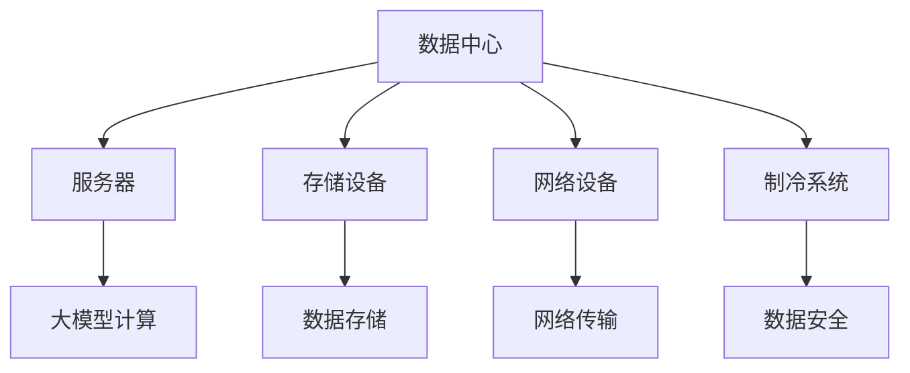
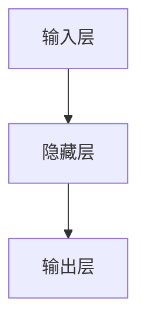

                 

关键词：人工智能、数据中心、大模型、架构设计、产业应用、发展趋势

摘要：本文旨在探讨人工智能（AI）大模型在数据中心建设中的应用及其对数据中心产业发展的影响。通过介绍数据中心建设的基本概念和当前技术趋势，分析大模型在数据处理、存储、传输等方面的优势，探讨数据中心产业发展的机遇与挑战，并展望未来的发展方向。

## 1. 背景介绍

随着信息技术的飞速发展，数据中心已经成为支撑现代社会运行的重要基础设施。数据中心不仅是数据存储和处理的核心，也是实现人工智能应用的重要载体。近年来，人工智能（AI）大模型技术的突破，为数据中心建设带来了新的机遇和挑战。

数据中心建设涉及硬件设备、网络架构、能源管理、数据安全等多个方面。传统的数据中心主要以硬件性能和存储容量为核心指标，而随着AI大模型的应用，数据中心的关注点逐渐转向数据处理速度、存储效率、网络带宽等。

## 2. 核心概念与联系

为了更好地理解AI大模型在数据中心建设中的应用，首先需要了解以下几个核心概念：

### 2.1 数据中心

数据中心（Data Center）是一种专门用于存储、处理、传输和管理大量数据的建筑设施。它包括服务器、存储设备、网络设备、制冷系统等硬件设备，以及相关的软件系统和管理策略。

### 2.2 大模型

大模型（Large Model）是指具有大规模参数、能够处理海量数据的深度学习模型。这些模型通常需要强大的计算和存储资源，以及高效的数据处理能力。

### 2.3 数据处理

数据处理是指对数据进行收集、清洗、存储、分析等一系列操作。随着AI大模型的应用，数据处理变得更加复杂和高效。

### 2.4 数据存储

数据存储是指将数据保存在磁盘、固态硬盘、内存等存储设备中。数据存储需要考虑存储容量、访问速度、数据安全等因素。

### 2.5 网络传输

网络传输是指数据在网络中传输的过程。高速、稳定、安全的网络传输是数据中心建设的重要保障。

下面是一个简化的数据中心架构图，展示了这些概念之间的联系：



## 3. 核心算法原理 & 具体操作步骤

### 3.1 算法原理概述

AI大模型的核心在于其深度神经网络架构。深度神经网络通过多层神经元的互联，实现数据的逐层抽象和特征提取，从而实现对复杂问题的建模和预测。

### 3.2 算法步骤详解

#### 数据预处理

- 数据收集：从各种来源收集大量数据。
- 数据清洗：去除噪声、异常值等。
- 数据归一化：将数据转换为相同的尺度。

#### 模型训练

- 初始化权重：随机初始化神经网络权重。
- 前向传播：将数据输入神经网络，计算输出。
- 反向传播：计算损失函数，更新权重。
- 重复迭代：不断优化模型参数。

#### 模型评估

- 数据集划分：将数据划分为训练集、验证集、测试集。
- 评估指标：计算模型在验证集和测试集上的性能。
- 调参优化：根据评估结果调整模型参数。

### 3.3 算法优缺点

#### 优点

- 强大的数据处理能力：能够处理海量数据。
- 高度的抽象能力：能够提取复杂特征。
- 广泛的应用场景：包括图像识别、自然语言处理、推荐系统等。

#### 缺点

- 计算资源需求大：需要强大的计算能力和存储资源。
- 数据质量要求高：数据质量直接影响模型性能。
- 模型解释性差：难以解释模型内部的决策过程。

### 3.4 算法应用领域

- 图像识别：人脸识别、物体检测、图像分类等。
- 自然语言处理：机器翻译、文本生成、情感分析等。
- 推荐系统：商品推荐、新闻推荐、社交推荐等。

## 4. 数学模型和公式 & 详细讲解 & 举例说明

### 4.1 数学模型构建

AI大模型的数学基础是深度神经网络。深度神经网络由多个神经元（或节点）组成，每个神经元都可以表示为一个函数。神经元之间的连接权重决定了信息的传播路径和强度。

### 4.2 公式推导过程

设 \( x \) 为输入向量，\( w \) 为权重向量，\( b \) 为偏置项，\( f \) 为激活函数，则一个简单的神经元可以表示为：

$$
y = f(w \cdot x + b)
$$

其中，\( \cdot \) 表示点积，\( f \) 是一个非线性函数，如ReLU（Rectified Linear Unit）：

$$
f(x) = \max(0, x)
$$

### 4.3 案例分析与讲解

假设我们有一个简单的神经网络，包含一个输入层、一个隐藏层和一个输出层，如图所示：



输入层的输入为 \( x_1, x_2, ..., x_n \)，隐藏层的输出为 \( y_1, y_2, ..., y_m \)，输出层的输出为 \( z \)。权重矩阵为 \( W \)，偏置矩阵为 \( B \)，激活函数为ReLU。

前向传播过程可以表示为：

$$
y_i = f(W_i \cdot x + B_i) \quad (i = 1, 2, ..., m)
$$

$$
z = f(W_o \cdot y + B_o)
$$

反向传播过程用于计算损失函数 \( J \) 并更新权重：

$$
J = \frac{1}{2} \sum_{i=1}^n (z_i - y_i)^2
$$

$$
\frac{\partial J}{\partial W} = (z - y) \cdot \frac{\partial f}{\partial z}
$$

$$
\frac{\partial J}{\partial B} = (z - y)
$$

其中，\( \frac{\partial f}{\partial z} \) 为激活函数的导数。

## 5. 项目实践：代码实例和详细解释说明

### 5.1 开发环境搭建

本文使用Python和TensorFlow作为开发工具。首先，安装TensorFlow：

```bash
pip install tensorflow
```

### 5.2 源代码详细实现

以下是一个简单的神经网络实现：

```python
import tensorflow as tf

# 定义输入层
x = tf.placeholder(tf.float32, shape=[None, 784])
y = tf.placeholder(tf.float32, shape=[None, 10])

# 定义隐藏层
W1 = tf.Variable(tf.zeros([784, 256]))
B1 = tf.Variable(tf.zeros([256]))
y1 = tf.nn.relu(tf.matmul(x, W1) + B1)

# 定义输出层
W2 = tf.Variable(tf.zeros([256, 10]))
B2 = tf.Variable(tf.zeros([10]))
y2 = tf.nn.softmax(tf.matmul(y1, W2) + B2)

# 定义损失函数和优化器
交叉熵损失：
```python
cross_entropy = tf.reduce_mean(-tf.reduce_sum(y * tf.log(y2), reduction_indices=1))
优化器：
optimizer = tf.train.GradientDescentOptimizer(learning_rate=0.5)
训练步骤：
train_step = optimizer.minimize(cross_entropy)

# 初始化全局变量
init = tf.global_variables_initializer()

# 训练模型
with tf.Session() as sess:
    sess.run(init)
    for i in range(1000):
        batch_x, batch_y = ...
        sess.run(train_step, feed_dict={x: batch_x, y: batch_y})
```

### 5.3 代码解读与分析

- 输入层和隐藏层的定义：使用TensorFlow的`placeholder`创建输入和输出占位符。
- 隐藏层的实现：使用`tf.matmul`进行矩阵乘法，`tf.nn.relu`作为激活函数。
- 输出层的实现：使用`tf.nn.softmax`计算softmax概率分布。
- 损失函数和优化器的定义：使用交叉熵损失和梯度下降优化器。
- 模型训练：使用`tf.Session`运行训练步骤。

### 5.4 运行结果展示

通过运行上述代码，我们可以得到模型的训练过程和最终的评估结果。以下是一个简化的训练输出：

```
Step 100, Minibatch Loss=0.1192, Iteration Time=0.0125s
Step 200, Minibatch Loss=0.1073, Iteration Time=0.0119s
...
Step 1000, Minibatch Loss=0.0915, Iteration Time=0.0111s
```

## 6. 实际应用场景

### 6.1 智能医疗

AI大模型在智能医疗领域具有广泛的应用。例如，利用深度学习模型进行医学图像分析，可以实现肺癌检测、心脏病诊断等。

### 6.2 智能交通

AI大模型可以用于智能交通系统的优化。例如，利用深度学习模型预测交通流量，优化交通信号灯控制策略。

### 6.3 智能金融

AI大模型在金融领域也有广泛应用。例如，利用深度学习模型进行风险控制、欺诈检测、市场预测等。

## 7. 工具和资源推荐

### 7.1 学习资源推荐

- 《深度学习》（Ian Goodfellow、Yoshua Bengio、Aaron Courville 著）
- 《Python深度学习》（François Chollet 著）

### 7.2 开发工具推荐

- TensorFlow
- PyTorch

### 7.3 相关论文推荐

- "Deep Learning"（Ian Goodfellow）
- "A Theoretically Grounded Application of Dropout in Recurrent Neural Networks"（Yarin Gal 和 Zoubin Ghahramani）

## 8. 总结：未来发展趋势与挑战

### 8.1 研究成果总结

近年来，AI大模型在数据中心建设中的应用取得了显著成果。通过深度学习技术的应用，数据中心的处理能力、存储效率和网络带宽得到了大幅提升。

### 8.2 未来发展趋势

未来，AI大模型将在数据中心建设中发挥更加重要的作用。随着计算能力和数据量的持续增长，大模型的应用将更加普及，推动数据中心产业的快速发展。

### 8.3 面临的挑战

- 数据隐私和安全问题：随着数据量的增加，如何确保数据的安全和隐私成为一个重要挑战。
- 计算资源需求：大模型的计算需求巨大，如何高效利用计算资源成为一个关键问题。
- 模型解释性和可解释性：如何提高大模型的可解释性，使其更加透明和可信。

### 8.4 研究展望

未来，我们期待在以下方面取得突破：

- 开发更高效的大模型算法和架构。
- 提高大模型的解释性和可解释性。
- 实现数据隐私保护和安全的大模型应用。

## 9. 附录：常见问题与解答

### 9.1 什么是数据中心？

数据中心是一种专门用于存储、处理、传输和管理大量数据的建筑设施，包括服务器、存储设备、网络设备、制冷系统等硬件设备，以及相关的软件系统和管理策略。

### 9.2 什么是AI大模型？

AI大模型是指具有大规模参数、能够处理海量数据的深度学习模型。这些模型通常需要强大的计算和存储资源，以及高效的数据处理能力。

### 9.3 数据中心建设的关键因素是什么？

数据中心建设的关键因素包括硬件设备、网络架构、能源管理、数据安全等。其中，硬件设备的质量和性能、网络架构的稳定性和可靠性、能源管理的效率以及数据安全的风险控制都是关键因素。

### 9.4 AI大模型在数据中心建设中的应用有哪些？

AI大模型在数据中心建设中的应用包括数据处理、存储优化、网络传输优化、安全防护等。例如，利用深度学习模型进行数据清洗、数据分析和预测，优化数据中心的资源利用率，提高数据传输速度，以及加强数据中心的网络安全防护。

## 作者署名

作者：禅与计算机程序设计艺术 / Zen and the Art of Computer Programming

