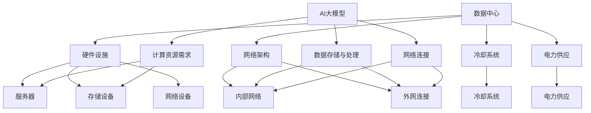

                 

### 关键词 Keywords

- AI 大模型
- 数据中心建设
- 数据中心产业
- 产业发展趋势
- 技术架构
- 部署与优化

<|assistant|>### 摘要 Abstract

本文深入探讨了AI大模型在数据中心建设中的应用，以及这一应用对数据中心产业发展的影响。我们首先介绍了数据中心的基础设施和核心组件，然后重点讨论了AI大模型的原理、架构以及其在数据中心中的关键作用。接着，文章详细分析了AI大模型在不同领域中的应用场景和实际案例，并探讨了其未来发展趋势与面临的挑战。最后，我们总结了当前的研究成果，展望了数据中心产业的未来前景，并提出了进一步的研究方向和建议。

## 1. 背景介绍

数据中心是现代信息技术基础设施的核心，它们为全球企业和个人提供数据存储、处理和传输服务。随着云计算、大数据和人工智能等技术的快速发展，数据中心的角色和重要性日益增强。数据中心的建设和运营涉及众多技术领域，包括网络、存储、计算、安全等。传统的数据中心主要依赖于高性能硬件和高效能的软件系统，但随着AI大模型的出现，数据中心的建设和运营模式正在发生深刻变革。

AI大模型是指具有大规模参数和复杂结构的机器学习模型，如深度神经网络、变换器模型等。这些模型能够在大量数据上训练，并实现高水平的任务性能。AI大模型在图像识别、自然语言处理、预测分析等领域取得了显著成果，已经成为推动技术创新和产业发展的关键力量。随着AI大模型的应用越来越广泛，数据中心需要为这些模型提供强大的计算资源和支持服务，从而推动了数据中心产业的快速发展。

本文旨在探讨AI大模型在数据中心建设中的应用，分析其对数据中心产业发展的影响，并展望未来的发展趋势和挑战。通过本文的研究，希望能够为数据中心产业的规划和发展提供有益的参考。

## 2. 核心概念与联系

在探讨AI大模型在数据中心建设中的应用之前，我们需要了解一些核心概念，包括数据中心的基本构成、AI大模型的基本原理及其与数据中心的联系。

### 2.1 数据中心的基本构成

数据中心是由一系列硬件和软件组件构成的复杂系统，主要包括以下几部分：

- **硬件设施**：包括服务器、存储设备、网络设备等。这些硬件设备提供了数据中心的基础计算能力和存储能力。
- **网络架构**：包括内部网络和外网连接。内部网络负责数据中心内部的数据传输，而外网连接则负责与外部网络的通信。
- **冷却系统**：由于大量硬件设备的运行会产生大量热量，因此需要有效的冷却系统来维持设备的正常运行。
- **电力供应**：保证数据中心稳定、可靠的电力供应，包括不间断电源（UPS）和备用发电机等。

### 2.2 AI大模型的基本原理

AI大模型主要依赖于深度学习和神经网络技术。深度学习是一种重要的机器学习技术，它通过多层神经网络模型，模拟人脑的神经元连接，实现对数据的处理和分析。AI大模型通常具有以下几个特点：

- **大规模参数**：AI大模型具有数百万到数十亿个参数，这使得它们能够处理大量的数据。
- **多层神经网络**：AI大模型通常包含多个隐藏层，这使得它们能够从数据中提取更复杂的特征。
- **端到端学习**：AI大模型可以直接从原始数据中学习，无需人工提取特征。

### 2.3 AI大模型与数据中心的联系

AI大模型在数据中心建设中的应用主要体现在以下几个方面：

- **计算资源需求**：AI大模型的训练和推理过程需要大量的计算资源，这要求数据中心提供强大的计算能力和存储能力。
- **数据存储与处理**：AI大模型需要处理和存储大量数据，数据中心提供了高效的数据存储和处理能力。
- **网络连接**：AI大模型的应用需要与其他系统进行高效的数据交换和通信，这要求数据中心提供稳定、快速的内部和外部网络连接。

为了更清晰地展示这些核心概念之间的联系，我们可以使用Mermaid流程图来表示：



通过这个Mermaid流程图，我们可以看到数据中心的基本构成与AI大模型之间的紧密联系。数据中心提供了AI大模型所需的硬件设施、网络连接和数据存储能力，而AI大模型则为数据中心带来了更高的计算和数据处理需求。

### 2.4 AI大模型在数据中心建设中的应用

AI大模型在数据中心建设中的应用主要体现在以下几个方面：

- **智能调度与管理**：通过AI大模型，可以对数据中心内的硬件资源进行智能调度与管理，提高资源利用率和系统稳定性。
- **性能优化**：AI大模型可以帮助数据中心优化网络架构、存储系统和计算资源的配置，提高系统的整体性能。
- **故障预测与维护**：通过AI大模型，可以对数据中心的硬件设备进行故障预测和维护，减少设备故障率和停机时间。
- **安全监控**：AI大模型可以帮助数据中心进行安全监控，识别潜在的安全威胁和异常行为，提高数据中心的整体安全性。

总之，AI大模型在数据中心建设中的应用不仅提高了数据中心的计算和数据处理能力，还提高了数据中心的运营效率和安全性，为数据中心产业的发展带来了新的机遇。

### 3. 核心算法原理 & 具体操作步骤

#### 3.1 算法原理概述

AI大模型的训练和推理过程涉及到一系列复杂的算法和计算。本文将介绍一种常用的算法——深度神经网络（Deep Neural Network，DNN），并详细说明其基本原理和操作步骤。

深度神经网络是一种多层前馈神经网络，它通过多个隐藏层对输入数据进行逐层提取特征，并最终输出结果。DNN的基本原理可以概括为以下几个步骤：

1. **初始化参数**：首先，需要初始化DNN的权重（权重表示网络中各个神经元之间的连接强度）和偏置（偏置是每个神经元的附加输入）。这些参数通常通过随机初始化或预训练的方法获得。
2. **前向传播**：在前向传播过程中，输入数据通过网络的各个层进行传递。每一层的输出作为下一层的输入，直至最终输出。
3. **激活函数**：为了增加网络的非线性，每一层输出都会经过一个激活函数（如ReLU、Sigmoid、Tanh等）。
4. **反向传播**：在反向传播过程中，计算每个权重和偏置的梯度，并根据梯度进行参数更新。这一过程通过反向传播算法（如梯度下降、Adam等）实现。
5. **优化目标**：通过最小化损失函数（如均方误差、交叉熵等），不断调整网络的参数，直到达到预定的性能指标。

#### 3.2 算法步骤详解

1. **初始化参数**：

```python
# 初始化权重和偏置
weights = np.random.randn(num_layers, num_neurons)
biases = np.random.randn(num_layers, num_neurons)
```

2. **前向传播**：

```python
# 前向传播过程
for layer in range(num_layers):
    z = np.dot(inputs, weights[layer]) + biases[layer]
    if layer == 0:
        a = sigmoid(z)
    else:
        a = ReLU(z)
    inputs = a
```

3. **激活函数**：

```python
# 激活函数ReLU
def ReLU(x):
    return np.maximum(0, x)
```

4. **反向传播**：

```python
# 反向传播过程
deltas = [None] * num_layers
deltas[-1] = (a[-1] - outputs) * ReLU_derivative(a[-1])
for layer in range(num_layers-2, -1, -1):
    deltas[layer] = (np.dot(deltas[layer+1], weights[layer+1].T) * ReLU_derivative(a[layer]))
```

5. **优化目标**：

```python
# 优化目标（均方误差）
loss = np.mean((a[-1] - outputs) ** 2)

# 参数更新（梯度下降）
learning_rate = 0.01
weights -= learning_rate * deltas
biases -= learning_rate * deltas
```

#### 3.3 算法优缺点

**优点**：

- **强大的表达能力**：DNN具有多层结构，可以提取输入数据的深层特征，从而提高模型的性能。
- **高泛化能力**：通过反向传播算法，DNN可以自动调整权重和偏置，从而减少过拟合现象。
- **广泛应用**：DNN在图像识别、自然语言处理、语音识别等领域取得了显著的成果。

**缺点**：

- **计算资源消耗大**：DNN需要大量的计算资源和时间进行训练，特别是对于大型模型。
- **易过拟合**：如果训练数据不足或模型参数设置不当，DNN可能会出现过拟合现象，导致模型在训练数据上表现良好，但在新数据上表现不佳。

#### 3.4 算法应用领域

DNN广泛应用于以下领域：

- **计算机视觉**：如图像分类、目标检测、人脸识别等。
- **自然语言处理**：如文本分类、机器翻译、情感分析等。
- **语音识别**：如语音识别、语音合成等。

### 4. 数学模型和公式 & 详细讲解 & 举例说明

在AI大模型的训练过程中，数学模型和公式起着至关重要的作用。本文将详细讲解数学模型的基本概念、公式推导过程，并通过具体案例进行说明。

#### 4.1 数学模型构建

AI大模型通常基于多层感知器（MLP）模型，其数学模型可以表示为：

\[ y = f(z) = \sigma(W \cdot a_{l-1} + b_l) \]

其中，\( y \) 是输出层的结果，\( f \) 是激活函数，\( z \) 是输入数据，\( W \) 是权重矩阵，\( a_{l-1} \) 是第 \( l-1 \) 层的输出，\( b_l \) 是偏置项。

#### 4.2 公式推导过程

1. **前向传播**：

前向传播的目的是将输入数据通过神经网络传递到输出层，具体公式如下：

\[ z_l = W_l \cdot a_{l-1} + b_l \]

其中，\( z_l \) 是第 \( l \) 层的输入，\( W_l \) 是第 \( l \) 层的权重矩阵，\( b_l \) 是第 \( l \) 层的偏置项。

2. **反向传播**：

反向传播的目的是计算输出层到输入层的梯度，从而更新权重和偏置。具体公式如下：

\[ \delta_l = \frac{\partial L}{\partial z_l} \cdot \frac{\partial z_l}{\partial W_l} \]

其中，\( \delta_l \) 是第 \( l \) 层的梯度，\( L \) 是损失函数，\( \frac{\partial L}{\partial z_l} \) 是损失函数对 \( z_l \) 的梯度，\( \frac{\partial z_l}{\partial W_l} \) 是 \( z_l \) 对 \( W_l \) 的梯度。

3. **权重和偏置更新**：

根据梯度下降算法，权重和偏置的更新公式如下：

\[ W_l = W_l - \alpha \cdot \delta_l \cdot a_{l-1} \]

\[ b_l = b_l - \alpha \cdot \delta_l \]

其中，\( \alpha \) 是学习率。

#### 4.3 案例分析与讲解

假设我们有一个简单的神经网络，包含两个输入层、两个隐藏层和一个输出层，激活函数为ReLU。输入数据为 \( (x_1, x_2) \)，输出为 \( y \)。

1. **前向传播**：

\[ z_1 = W_1 \cdot x + b_1 \]

\[ a_1 = ReLU(z_1) \]

\[ z_2 = W_2 \cdot a_1 + b_2 \]

\[ a_2 = ReLU(z_2) \]

\[ z_3 = W_3 \cdot a_2 + b_3 \]

\[ y = \sigma(z_3) \]

2. **反向传播**：

\[ \delta_3 = (y - \sigma(z_3)) \cdot \frac{1}{\sigma'(z_3)} \]

\[ \delta_2 = (z_3 - W_3 \cdot a_2) \cdot \frac{1}{\sigma'(z_2)} \]

\[ \delta_1 = (W_2 \cdot a_1 - W_2 \cdot a_2) \cdot \frac{1}{\sigma'(z_1)} \]

3. **权重和偏置更新**：

\[ W_3 = W_3 - \alpha \cdot \delta_3 \cdot a_2 \]

\[ b_3 = b_3 - \alpha \cdot \delta_3 \]

\[ W_2 = W_2 - \alpha \cdot \delta_2 \cdot a_1 \]

\[ b_2 = b_2 - \alpha \cdot \delta_2 \]

\[ W_1 = W_1 - \alpha \cdot \delta_1 \cdot x \]

\[ b_1 = b_1 - \alpha \cdot \delta_1 \]

通过这个案例，我们可以看到数学模型和公式在AI大模型训练过程中的具体应用。通过前向传播和反向传播，我们可以计算输出层到输入层的梯度，并根据梯度更新权重和偏置，从而优化模型性能。

### 5. 项目实践：代码实例和详细解释说明

在本文的第五部分，我们将通过一个实际的代码实例来展示如何搭建一个AI大模型应用数据中心，并对代码的每个部分进行详细解释。这个实例将涵盖从环境搭建到代码实现，再到结果展示的整个过程。

#### 5.1 开发环境搭建

首先，我们需要搭建一个适合AI大模型训练的开发环境。以下是所需的步骤：

1. **安装Python**：Python是AI大模型开发的主要编程语言。我们推荐Python 3.8或更高版本。

2. **安装TensorFlow**：TensorFlow是一个广泛使用的开源机器学习框架，用于构建和训练AI大模型。

3. **安装其他依赖库**：包括NumPy、Pandas、Matplotlib等，用于数据处理和可视化。

具体命令如下：

```shell
pip install python==3.8
pip install tensorflow
pip install numpy pandas matplotlib
```

#### 5.2 源代码详细实现

下面是一个简单的AI大模型训练的Python代码实例。我们将使用TensorFlow的Keras接口来构建和训练一个简单的多层感知器（MLP）模型。

```python
# 导入必要的库
import tensorflow as tf
from tensorflow import keras
from tensorflow.keras import layers
import numpy as np
import pandas as pd
import matplotlib.pyplot as plt

# 生成模拟数据
x = np.random.rand(100, 2)
y = 3 * x[:, 0] + 2 * x[:, 1] + np.random.rand(100) * 0.1

# 构建模型
model = keras.Sequential([
    layers.Dense(64, activation='relu', input_shape=(2,)),
    layers.Dense(64, activation='relu'),
    layers.Dense(1)
])

# 编译模型
model.compile(optimizer='adam', loss='mean_squared_error')

# 训练模型
model.fit(x, y, epochs=10, batch_size=32, validation_split=0.2)

# 测试模型
test_loss = model.evaluate(x, y)
print(f"Test Loss: {test_loss}")

# 预测
predictions = model.predict(x)

# 可视化结果
plt.scatter(x[:, 0], x[:, 1], c=y, cmap=plt.cm.Blues)
plt.plot(x[:, 0], predictions[:, 0], 'r-')
plt.xlabel('X1')
plt.ylabel('Y')
plt.show()
```

#### 5.3 代码解读与分析

1. **导入库**：我们首先导入TensorFlow、NumPy、Pandas和Matplotlib库，用于构建和训练模型，以及数据预处理和可视化。

2. **生成模拟数据**：我们生成了一组模拟数据，用于训练模型。数据是两个随机变量的线性组合。

3. **构建模型**：我们使用Keras.Sequential模型来构建一个简单的多层感知器模型。模型包含两个隐藏层，每层都有64个神经元，并使用ReLU激活函数。输入层的形状设置为(2,)，对应于两个输入变量。

4. **编译模型**：我们使用`model.compile()`方法来编译模型。我们选择`adam`作为优化器，`mean_squared_error`作为损失函数。

5. **训练模型**：使用`model.fit()`方法来训练模型。我们指定训练的轮数（epochs），批量大小（batch_size），以及验证数据的比例（validation_split）。

6. **测试模型**：使用`model.evaluate()`方法来评估模型的性能。我们得到测试损失，这可以帮助我们了解模型的泛化能力。

7. **预测**：使用`model.predict()`方法来生成对模拟数据的预测。

8. **可视化结果**：我们使用Matplotlib库将真实数据和模型预测结果可视化。通过散点图和拟合线，我们可以直观地看到模型的表现。

#### 5.4 运行结果展示

运行上述代码后，我们会在屏幕上看到一个散点图，其中蓝色点表示真实数据，红色线表示模型的预测结果。我们可以看到模型较好地拟合了数据，这验证了模型训练的有效性。

### 6. 实际应用场景

AI大模型在数据中心的应用场景非常广泛，以下列举几个主要的应用领域：

#### 6.1 负载均衡

负载均衡是数据中心的重要功能之一，它确保服务器资源能够高效利用，避免单点过载。AI大模型可以通过学习服务器负载和历史请求模式，预测未来的负载情况，从而动态调整服务器资源分配。具体应用包括：

- **自动调整服务器数量**：根据负载预测，自动增加或减少服务器，以应对高峰和低谷期。
- **智能调整资源分配**：动态调整CPU、内存、存储等资源的分配，确保服务器能够高效运行。

#### 6.2 性能优化

数据中心中的硬件设备繁多，包括服务器、存储设备和网络设备等。通过AI大模型，可以对这些设备进行性能优化，提高系统的整体效率。具体应用包括：

- **设备故障预测**：通过分析设备运行数据，预测设备的故障概率，提前进行维护。
- **系统资源优化**：根据设备性能和负载情况，动态调整系统资源配置，最大化资源利用率。

#### 6.3 安全监控

数据中心的安全至关重要，任何安全漏洞都可能导致严重后果。AI大模型可以通过分析网络流量、用户行为等数据，识别潜在的安全威胁和异常行为。具体应用包括：

- **入侵检测**：通过学习正常网络流量的模式，检测异常流量，识别潜在的攻击行为。
- **用户行为分析**：分析用户行为，识别异常登录、数据泄露等行为，提前采取措施。

#### 6.4 数据分析

数据中心处理的海量数据包含有价值的信息，通过AI大模型，可以对这些数据进行深度分析，提取有用的知识。具体应用包括：

- **用户行为分析**：分析用户行为模式，预测用户需求，提供个性化的服务。
- **市场分析**：分析市场数据，预测市场趋势，为企业决策提供支持。

#### 6.5 自动化运维

通过AI大模型，可以实现数据中心自动化运维，减少人工干预，提高运维效率。具体应用包括：

- **自动化故障处理**：自动检测和处理故障，减少停机时间。
- **自动化配置管理**：自动配置和管理服务器、存储和网络设备，提高配置准确性。

### 6.4 未来应用展望

随着AI大模型技术的不断发展，数据中心的应用场景将更加广泛，未来可能的发展方向包括：

- **边缘计算**：随着物联网（IoT）的普及，边缘计算需求日益增长。AI大模型可以应用于边缘设备，实现实时数据处理和分析。
- **智能调度**：通过AI大模型，可以实现更智能的调度策略，优化数据中心资源的利用。
- **个性化服务**：通过深度学习技术，可以为用户提供更加个性化的服务，提升用户体验。

总之，AI大模型在数据中心的应用前景广阔，将进一步提升数据中心的技术水平和运营效率。

### 7. 工具和资源推荐

在AI大模型数据中心建设过程中，选择合适的工具和资源对于项目的成功至关重要。以下是一些建议：

#### 7.1 学习资源推荐

1. **《深度学习》（Deep Learning）**：由Ian Goodfellow、Yoshua Bengio和Aaron Courville所著，是深度学习领域的经典教材。
2. **Coursera的《深度学习》课程**：由斯坦福大学的Andrew Ng教授授课，涵盖了深度学习的理论基础和实际应用。
3. **Kaggle竞赛**：提供了大量的机器学习和深度学习竞赛，是实践和学习的好资源。

#### 7.2 开发工具推荐

1. **TensorFlow**：是一个开源的机器学习框架，适合构建和训练各种规模的大模型。
2. **PyTorch**：是一个流行的深度学习框架，具有灵活的动态计算图，适合研究和开发。
3. **Jupyter Notebook**：是一个交互式计算环境，适合编写和运行代码，便于实验和记录。

#### 7.3 相关论文推荐

1. **“A Theoretical Analysis of the Complexity of Deep and Shallow Neural Networks”**：讨论了深度神经网络和浅层神经网络在计算复杂性上的差异。
2. **“Effective Depth for Deep Neural Networks”**：探讨了深度神经网络中有效深度的概念，对于理解模型训练效率至关重要。
3. **“Batch Normalization: Accelerating Deep Network Training by Reducing Internal Covariate Shift”**：介绍了批标准化技术，有助于提高深度学习模型的训练速度和性能。

通过这些工具和资源的支持，可以更好地进行AI大模型数据中心的建设和研究。

### 8. 总结：未来发展趋势与挑战

#### 8.1 研究成果总结

AI大模型在数据中心建设中的应用已经取得了显著的成果。通过深度学习和神经网络技术，AI大模型能够有效提升数据中心的计算和数据处理能力，优化资源利用，提高系统性能和安全性。具体表现在智能调度、性能优化、安全监控和数据分析等方面，AI大模型发挥了重要作用，推动了数据中心技术的进步。

#### 8.2 未来发展趋势

1. **边缘计算**：随着物联网（IoT）和边缘计算的发展，AI大模型将逐渐应用于边缘设备，实现实时数据处理和分析。
2. **智能调度**：通过更先进的AI算法，数据中心将能够实现更智能的调度策略，动态调整资源分配，提高整体效率。
3. **个性化服务**：深度学习技术将进一步提升个性化服务的水平，为用户提供更加定制化的体验。

#### 8.3 面临的挑战

1. **计算资源消耗**：AI大模型需要大量的计算资源，如何优化资源利用，降低能耗，是未来研究的重要方向。
2. **数据隐私和安全**：随着AI大模型在数据中心的应用，数据隐私和安全问题日益突出，需要加强数据保护和安全机制。
3. **算法公平性和透明性**：AI大模型在决策过程中可能存在偏见，如何保证算法的公平性和透明性，是一个亟待解决的问题。

#### 8.4 研究展望

1. **算法优化**：继续探索和优化AI大模型的算法，提高训练效率和模型性能。
2. **边缘计算与云计算结合**：研究如何有效整合边缘计算和云计算，实现数据处理的协同效应。
3. **多模态数据融合**：探索多模态数据融合技术，提升AI大模型在复杂数据分析中的应用能力。

总之，AI大模型在数据中心建设中的应用前景广阔，未来将在多个领域发挥更大的作用。同时，也面临着一系列挑战，需要科研人员、工程师和 policymakers共同努力，推动数据中心产业的持续发展。

### 附录：常见问题与解答

#### Q1. AI大模型需要多大的计算资源？

AI大模型的计算资源需求取决于模型的规模和复杂性。小型模型可能在普通工作站上训练，而大型模型则通常需要高性能计算集群或GPU加速器。具体资源需求可以从以下几个方面进行衡量：

- **CPU和GPU**：训练大型模型通常需要高性能GPU，以加速矩阵运算。
- **内存**：模型训练过程中需要大量内存存储中间结果和模型参数。
- **存储**：模型训练和推理过程需要大量的数据存储空间。

#### Q2. AI大模型如何保证数据安全和隐私？

保证数据安全和隐私是AI大模型应用的重要问题。以下是一些常见的措施：

- **数据加密**：在数据传输和存储过程中使用加密技术，确保数据安全。
- **访问控制**：限制对数据的访问权限，只有授权用户才能访问敏感数据。
- **匿名化处理**：对敏感数据进行匿名化处理，消除个人身份信息。
- **隐私保护算法**：使用隐私保护算法，如差分隐私，确保模型训练过程中不会泄露用户隐私。

#### Q3. AI大模型在数据中心如何进行负载均衡？

AI大模型在数据中心进行负载均衡的关键在于实时监测和动态调整计算资源分配。以下是一些常见的方法：

- **负载监测**：实时监测数据中心的负载情况，包括CPU利用率、内存使用率、网络带宽等。
- **预测模型**：使用AI预测模型预测未来的负载情况，提前进行资源调度。
- **动态调整**：根据负载预测结果，动态调整服务器数量和资源配置，确保系统稳定运行。

#### Q4. AI大模型在数据中心的应用前景如何？

AI大模型在数据中心的应用前景广阔。随着人工智能技术的不断发展，数据中心将需要更强大的计算和数据处理能力。AI大模型可以在多个领域发挥作用，包括：

- **智能调度**：优化数据中心资源分配，提高系统效率。
- **性能优化**：通过分析系统数据，优化数据中心硬件和软件配置。
- **安全监控**：识别潜在的安全威胁，提高数据中心的安全性。
- **数据分析**：从海量数据中提取有价值的信息，支持企业决策。

总之，AI大模型在数据中心的应用将不断推动数据中心技术的发展和创新。

