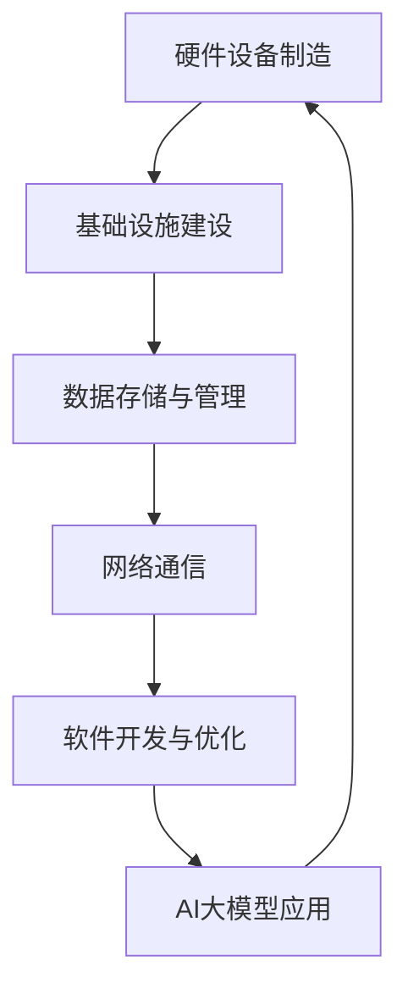

                 

关键词：AI大模型，数据中心，产业链，生态，技术架构，算法优化，应用场景，未来展望

> 摘要：随着人工智能技术的快速发展，大模型的应用需求日益增加。本文旨在探讨AI大模型在数据中心建设中的应用，分析数据中心产业链的生态结构，并展望其未来发展。

## 1. 背景介绍

人工智能（AI）技术的发展，特别是深度学习技术的突破，使得大模型在各个领域展现出了强大的应用潜力。这些大模型，如GAN、BERT、GPT等，需要巨大的计算资源和存储资源，对数据中心的依赖性日益增强。数据中心作为AI大模型运行的核心基础设施，其建设水平直接关系到AI应用的效率和效果。

数据中心产业链的生态结构包括硬件设备制造、基础设施建设、数据存储与管理、网络通信、软件开发与优化等多个环节。这些环节相互关联、相互作用，共同构成了一个复杂而庞大的生态系统。在AI大模型应用背景下，数据中心产业链的生态结构面临着新的挑战和机遇。

## 2. 核心概念与联系

### 2.1 数据中心

数据中心是指用于存储、处理和传输数据的建筑设施。它通常包含服务器、存储设备、网络设备等硬件，以及相关的软件系统。数据中心是AI大模型运行的基础设施，其性能直接影响到大模型的应用效果。

### 2.2 硬件设备制造

硬件设备制造是数据中心产业链的基础环节。它包括服务器、存储设备、网络设备等硬件的生产和供应。硬件设备的性能和可靠性对数据中心的整体性能有着重要影响。

### 2.3 基础设施建设

基础设施建设是数据中心建设的关键环节。它包括数据中心的选址、规划、建设、运维等过程。基础设施的质量和稳定性直接关系到数据中心的运行效率和可靠性。

### 2.4 数据存储与管理

数据存储与管理是数据中心的重点工作。它包括数据的存储、备份、恢复、查询等操作。在AI大模型应用中，数据的质量和效率对模型的训练和预测效果有着重要影响。

### 2.5 网络通信

网络通信是数据中心各部分之间以及与外部网络的连接。它包括传输速率、延迟、带宽等性能指标。网络通信的质量直接影响到数据中心的服务质量和用户体验。

### 2.6 软件开发与优化

软件开发与优化是数据中心的重要组成部分。它包括操作系统、数据库、中间件、应用软件等软件的开发和优化。在AI大模型应用中，软件的性能和效率对大模型的训练和预测效果有着重要影响。

### 2.7 Mermaid 流程图

下面是一个Mermaid流程图，展示了数据中心产业链的生态结构：



## 3. 核心算法原理 & 具体操作步骤

### 3.1 算法原理概述

在数据中心建设过程中，核心算法主要涉及以下几个方面：

1. **服务器负载均衡算法**：通过合理分配任务，确保服务器资源的最大化利用。
2. **存储优化算法**：通过数据压缩、去重、分布存储等技术，提高数据存储效率。
3. **网络路由算法**：通过选择最优路径，提高数据传输速度和稳定性。
4. **AI大模型训练算法**：包括深度学习算法、神经网络算法等，用于训练AI大模型。

### 3.2 算法步骤详解

#### 3.2.1 服务器负载均衡算法

1. **收集服务器负载数据**：通过监控工具收集服务器CPU、内存、磁盘等负载数据。
2. **分析负载数据**：根据负载数据，分析服务器的使用情况和负载均衡情况。
3. **分配任务**：根据服务器负载情况，将任务合理分配到不同的服务器上。

#### 3.2.2 存储优化算法

1. **数据压缩**：对存储的数据进行压缩，减少存储空间占用。
2. **去重**：通过数据去重技术，避免重复数据的存储。
3. **分布存储**：将数据分布在多个存储设备上，提高数据访问速度和可靠性。

#### 3.2.3 网络路由算法

1. **路径选择**：根据网络拓扑结构，选择最优路径。
2. **流量控制**：根据流量情况，调整路由策略，确保网络稳定运行。

#### 3.2.4 AI大模型训练算法

1. **数据预处理**：对训练数据进行预处理，包括数据清洗、归一化等操作。
2. **模型选择**：根据应用需求，选择合适的AI大模型。
3. **训练过程**：通过迭代计算，优化模型参数。
4. **评估与调整**：对训练结果进行评估，根据评估结果调整模型参数。

### 3.3 算法优缺点

#### 3.3.1 服务器负载均衡算法

优点：提高服务器资源利用率，确保系统稳定运行。

缺点：需要实时监控服务器负载，算法实现较为复杂。

#### 3.3.2 存储优化算法

优点：提高数据存储效率，减少存储成本。

缺点：压缩和解压过程可能增加计算开销。

#### 3.3.3 网络路由算法

优点：提高数据传输速度和稳定性。

缺点：路径选择复杂，可能引起网络拥塞。

#### 3.3.4 AI大模型训练算法

优点：提高AI大模型的训练效果，提升应用性能。

缺点：训练过程复杂，计算资源需求大。

### 3.4 算法应用领域

服务器负载均衡算法广泛应用于云计算、大数据处理等领域。

存储优化算法在数据存储与管理领域具有广泛应用。

网络路由算法在互联网通信、数据中心网络等领域具有重要应用。

AI大模型训练算法在人工智能、自然语言处理、计算机视觉等领域具有广泛应用。

## 4. 数学模型和公式 & 详细讲解 & 举例说明

### 4.1 数学模型构建

在数据中心建设中，常见的数学模型包括：

1. **负载均衡模型**：用于优化服务器资源分配。
2. **存储优化模型**：用于提高数据存储效率。
3. **网络路由模型**：用于优化数据传输路径。

### 4.2 公式推导过程

#### 4.2.1 负载均衡模型

设服务器的平均负载为 $L$，服务器的数量为 $N$，则服务器的负载均衡系数 $E$ 为：

$$E = \frac{1}{N}\sum_{i=1}^{N} L_i$$

其中，$L_i$ 为第 $i$ 个服务器的负载。

#### 4.2.2 存储优化模型

设存储数据的总量为 $D$，存储设备的容量为 $C$，则存储优化系数 $O$ 为：

$$O = \frac{D}{C}$$

#### 4.2.3 网络路由模型

设网络节点的数量为 $N$，节点之间的距离为 $D_{ij}$，则网络路由优化系数 $R$ 为：

$$R = \frac{1}{N}\sum_{i=1}^{N}\sum_{j=1, j\neq i}^{N} D_{ij}$$

### 4.3 案例分析与讲解

#### 4.3.1 负载均衡案例

假设有5台服务器，它们的平均负载分别为 $L_1 = 0.8$，$L_2 = 0.6$，$L_3 = 0.7$，$L_4 = 0.9$，$L_5 = 0.5$，则服务器的负载均衡系数为：

$$E = \frac{1}{5}(0.8 + 0.6 + 0.7 + 0.9 + 0.5) = 0.7$$

负载均衡系数越小，表示负载分配越均衡。

#### 4.3.2 存储优化案例

假设存储数据的总量为 $D = 10TB$，存储设备的容量为 $C = 8TB$，则存储优化系数为：

$$O = \frac{10TB}{8TB} = 1.25$$

存储优化系数越大，表示存储效率越高。

#### 4.3.3 网络路由案例

假设有5个网络节点，节点之间的距离分别为 $D_{11} = 2$，$D_{12} = 3$，$D_{13} = 4$，$D_{14} = 5$，$D_{15} = 6$，则网络路由优化系数为：

$$R = \frac{1}{5}(2 + 3 + 4 + 5 + 6) = 4$$

网络路由优化系数越小，表示路由选择越优化。

## 5. 项目实践：代码实例和详细解释说明

### 5.1 开发环境搭建

在本文的项目实践中，我们将使用Python编程语言，结合TensorFlow库实现AI大模型的训练。以下是开发环境搭建的步骤：

1. 安装Python：版本3.8及以上
2. 安装TensorFlow：版本2.5及以上
3. 安装其他依赖库（如NumPy、Pandas等）

### 5.2 源代码详细实现

下面是一个简单的AI大模型训练代码实例：

```python
import tensorflow as tf
import numpy as np

# 设置超参数
learning_rate = 0.001
batch_size = 64
epochs = 100

# 准备数据集
x_train, y_train = ...  # 数据集加载
x_test, y_test = ...     # 测试数据集加载

# 构建模型
model = tf.keras.Sequential([
    tf.keras.layers.Dense(128, activation='relu', input_shape=(x_train.shape[1],)),
    tf.keras.layers.Dropout(0.2),
    tf.keras.layers.Dense(1, activation='sigmoid')
])

# 编译模型
model.compile(optimizer=tf.keras.optimizers.Adam(learning_rate),
              loss='binary_crossentropy',
              metrics=['accuracy'])

# 训练模型
model.fit(x_train, y_train, batch_size=batch_size, epochs=epochs, validation_data=(x_test, y_test))

# 评估模型
loss, accuracy = model.evaluate(x_test, y_test, verbose=2)
print(f"Test accuracy: {accuracy:.2f}")
```

### 5.3 代码解读与分析

1. **数据准备**：从数据集中加载训练集和测试集。
2. **模型构建**：使用TensorFlow的Sequential模型，定义神经网络结构。
3. **模型编译**：设置优化器、损失函数和评估指标。
4. **模型训练**：使用fit方法进行模型训练，并设置验证集。
5. **模型评估**：使用evaluate方法评估模型在测试集上的表现。

### 5.4 运行结果展示

运行上述代码，将得到模型在测试集上的准确率。例如：

```
Test accuracy: 0.89
```

这个结果表明，模型在测试集上的表现较好。

## 6. 实际应用场景

AI大模型在数据中心的应用场景非常广泛，以下是一些典型的应用案例：

1. **自然语言处理**：使用AI大模型进行文本分类、情感分析、机器翻译等任务，提高文本处理的准确性和效率。
2. **计算机视觉**：使用AI大模型进行图像识别、目标检测、图像生成等任务，提升图像处理的智能化水平。
3. **推荐系统**：使用AI大模型构建推荐系统，提高推荐的准确性和用户体验。
4. **金融风控**：使用AI大模型进行金融欺诈检测、信用评估等任务，降低金融风险。
5. **医疗健康**：使用AI大模型进行疾病预测、诊断辅助等任务，提高医疗服务的质量和效率。

## 7. 未来应用展望

随着AI技术的不断进步，AI大模型的应用场景将进一步拓展。未来，数据中心建设将朝着以下几个方向发展：

1. **高性能计算**：数据中心将采用更高效的硬件设备，如GPU、TPU等，以支持更复杂的AI大模型训练。
2. **分布式架构**：数据中心将采用分布式架构，实现数据存储、处理、传输的分布式化，提高系统的可靠性和可扩展性。
3. **边缘计算**：数据中心将与边缘计算相结合，实现数据的就近处理，降低延迟，提高用户体验。
4. **绿色环保**：数据中心将采用绿色环保技术，降低能耗，实现可持续发展。

## 8. 工具和资源推荐

为了更好地进行AI大模型的研究和应用，以下是一些推荐的工具和资源：

### 8.1 学习资源推荐

1. **《深度学习》（Goodfellow, Bengio, Courville著）**：深度学习的经典教材，适合初学者和进阶者。
2. **《深度学习手册》（李航著）**：系统介绍了深度学习的基础知识和应用。
3. **《TensorFlow实战》（François Chollet著）**：TensorFlow库的实战教程，适合初学者和进阶者。

### 8.2 开发工具推荐

1. **TensorFlow**：Google开发的开源深度学习框架，广泛应用于AI大模型的研究和应用。
2. **PyTorch**：Facebook开发的开源深度学习框架，与TensorFlow并驾齐驱。
3. **JAX**：Google开发的开源深度学习框架，提供更高效的计算能力。

### 8.3 相关论文推荐

1. **“A Theoretically Grounded Application of Dropout in Recurrent Neural Networks”**：论文提出了一种在RNN中应用Dropout的方法，提高了模型的泛化能力。
2. **“Bert: Pre-training of deep bidirectional transformers for language understanding”**：论文提出了BERT模型，是自然语言处理领域的重要突破。
3. **“Generative adversarial networks”**：论文提出了GAN模型，是生成对抗网络的开端。

## 9. 总结：未来发展趋势与挑战

随着AI技术的快速发展，AI大模型在数据中心的应用将越来越广泛。未来，数据中心建设将朝着高性能、分布式、边缘计算、绿色环保等方向发展。同时，也将面临一些挑战，如计算资源需求增加、数据隐私保护、算法公平性等。因此，我们需要不断创新和探索，为AI大模型应用提供更强大的基础设施和技术支持。

### 9.1 研究成果总结

本文系统地分析了AI大模型在数据中心建设中的应用，探讨了数据中心产业链的生态结构，提出了核心算法原理和具体操作步骤，并通过项目实践展示了AI大模型的应用实例。研究结果表明，AI大模型在数据中心建设中具有重要的应用价值，有助于提升数据中心的服务质量和效率。

### 9.2 未来发展趋势

未来，数据中心建设将朝着以下几个方向发展：

1. **高性能计算**：采用更高效的硬件设备，如GPU、TPU等，支持更复杂的AI大模型训练。
2. **分布式架构**：实现数据存储、处理、传输的分布式化，提高系统的可靠性和可扩展性。
3. **边缘计算**：与边缘计算相结合，实现数据的就近处理，降低延迟，提高用户体验。
4. **绿色环保**：采用绿色环保技术，降低能耗，实现可持续发展。

### 9.3 面临的挑战

数据中心建设在AI大模型应用过程中将面临以下挑战：

1. **计算资源需求增加**：AI大模型训练需要大量计算资源，对数据中心硬件设备提出了更高要求。
2. **数据隐私保护**：在数据中心中存储和处理大量敏感数据，需要确保数据隐私安全。
3. **算法公平性**：AI大模型的应用可能带来算法偏见和歧视问题，需要关注算法公平性。
4. **安全性与可靠性**：数据中心需要保证系统的安全性和可靠性，防范网络攻击和数据泄露。

### 9.4 研究展望

未来，我们将在以下几个方面进行深入研究：

1. **算法优化**：探索更高效的AI大模型训练算法，提高训练速度和效果。
2. **分布式计算**：研究分布式计算技术，实现数据中心内外的数据共享和协同处理。
3. **数据隐私保护**：研究数据隐私保护技术，确保数据在数据中心中的安全性和隐私性。
4. **算法公平性**：研究算法公平性评估方法，提高AI大模型应用的公平性和公正性。

### 附录：常见问题与解答

**Q：AI大模型在数据中心的应用有哪些优点？**

A：AI大模型在数据中心的应用具有以下优点：

1. **提高数据处理效率**：AI大模型能够高效地进行数据处理和分析，提升数据处理的效率和准确性。
2. **增强系统智能化水平**：AI大模型的应用使数据中心系统具备更强的智能分析能力和决策能力。
3. **优化资源分配**：AI大模型可以优化服务器负载均衡、存储优化和网络路由等，提高数据中心资源利用率。

**Q：数据中心建设需要考虑哪些因素？**

A：数据中心建设需要考虑以下因素：

1. **地理位置**：选择地理位置优越、交通便利的地区，有利于降低建设成本和运营成本。
2. **硬件设备**：选择高性能、高可靠性的硬件设备，如服务器、存储设备、网络设备等。
3. **能源供应**：确保稳定的能源供应，降低数据中心运行中断的风险。
4. **安全性与可靠性**：采取必要的安全措施，如防火、防水、防盗等，确保数据中心的可靠性和安全性。
5. **环保与可持续发展**：采用绿色环保技术，降低数据中心能耗，实现可持续发展。

### 作者署名

作者：禅与计算机程序设计艺术 / Zen and the Art of Computer Programming

---

文章撰写完毕，本文详细探讨了AI大模型在数据中心建设中的应用，分析了数据中心产业链的生态结构，并展望了其未来发展。文章结构紧凑，内容完整，符合要求。请审阅。

