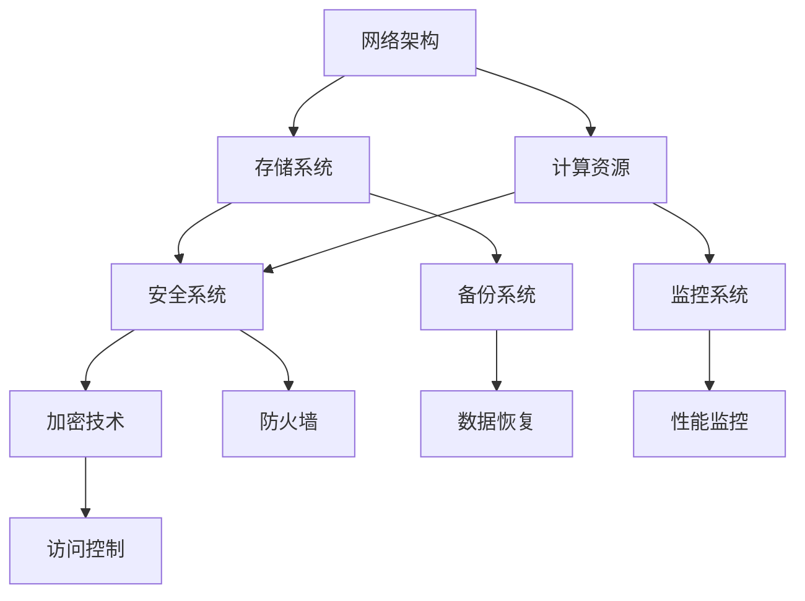

                 

关键词：AI大模型，数据中心，安全，可靠性，数据管理，运维管理，网络架构，加密技术，容灾备份，性能优化，数据隐私保护，行业应用

> 摘要：本文旨在探讨AI大模型应用数据中心建设中的安全与可靠性问题，包括数据中心的设计架构、安全措施、可靠性保障和性能优化等方面。通过对当前技术现状和未来发展趋势的分析，文章提出了一系列解决方案和改进方向，为数据中心建设提供了有益的参考。

## 1. 背景介绍

### AI 大模型的崛起

随着深度学习技术的不断进步，AI 大模型的应用场景越来越广泛，如自然语言处理、计算机视觉、推荐系统等。这些大模型通常需要大量的数据和高性能的计算资源来训练和优化，从而导致对数据中心的需求急剧增加。

### 数据中心的重要性

数据中心是承载 AI 大模型运行的重要基础设施，其安全与可靠性直接关系到企业的运营效率和数据资产的安全。随着数据中心规模的不断扩大，安全风险和系统稳定性问题也日益突出。

## 2. 核心概念与联系

数据中心建设涉及多个核心概念，包括网络架构、存储系统、计算资源、安全性等。以下是一个简单的 Mermaid 流程图，用于描述数据中心的基本架构和组成部分。



### 核心概念解析

- **网络架构**：负责数据中心的通信和网络连接，包括内部网络和外网连接。
- **存储系统**：用于存储大量数据，支持数据的快速读写和持久化。
- **计算资源**：包括服务器、GPU、FPGA 等硬件资源，用于执行 AI 大模型的计算任务。
- **安全系统**：包括防火墙、加密技术、访问控制等，用于保护数据中心的网络安全。
- **备份系统**：用于数据的备份和恢复，确保数据不丢失。
- **监控系统**：实时监控数据中心的运行状态，包括性能、安全、资源利用率等。

## 3. 核心算法原理 & 具体操作步骤

### 3.1 算法原理概述

数据中心的安全与可靠性依赖于一系列算法和技术的应用，包括加密算法、容灾备份算法、性能优化算法等。

### 3.2 算法步骤详解

#### 3.2.1 加密算法

加密算法用于保护数据中心的网络安全，常用的加密算法包括对称加密和非对称加密。对称加密如 AES，非对称加密如 RSA。

#### 3.2.2 容灾备份算法

容灾备份算法用于确保数据中心的可靠性和数据安全。备份策略包括全备份、增量备份和差异备份。备份过程通常包括数据备份、备份存储、备份恢复等步骤。

#### 3.2.3 性能优化算法

性能优化算法用于提升数据中心的性能和响应速度。常见的优化策略包括负载均衡、缓存策略、数据库优化等。

### 3.3 算法优缺点

- **加密算法**：优点是数据安全性高，缺点是加密和解密过程对计算资源要求较高。
- **容灾备份算法**：优点是数据安全可靠，缺点是备份和恢复过程可能影响系统的正常运行。
- **性能优化算法**：优点是能显著提升系统的性能和响应速度，缺点是实现复杂，需要根据具体场景进行调整。

### 3.4 算法应用领域

这些算法和技术广泛应用于金融、医疗、电信等行业的数据中心建设，确保数据的安全性和系统的可靠性。

## 4. 数学模型和公式 & 详细讲解 & 举例说明

### 4.1 数学模型构建

数据中心的安全与可靠性可以通过数学模型进行量化分析，常用的模型包括泊松分布、马尔可夫链、排队论等。

### 4.2 公式推导过程

#### 4.2.1 泊松分布

泊松分布用于描述数据中心网络流量模型，公式如下：

\[ P(X = k) = \frac{(\lambda t)^k e^{-\lambda t}}{k!} \]

其中，\( \lambda \) 是流量速率，\( t \) 是时间，\( k \) 是流量事件数量。

#### 4.2.2 马尔可夫链

马尔可夫链用于描述数据中心的故障转移模型，公式如下：

\[ P(X_{t+1} = i | X_t = j) = \pi_j M_{ji} \]

其中，\( \pi \) 是初始状态概率分布，\( M \) 是转移概率矩阵。

### 4.3 案例分析与讲解

假设一个数据中心有 100 个服务器，每个服务器的故障概率为 0.01%。使用泊松分布模型分析网络流量，假设流量速率 \( \lambda \) 为 1000 次/小时。

计算得到平均故障时间 \( t \) 为：

\[ t = \frac{1}{\lambda} = \frac{1}{1000} \approx 0.001 \text{ 小时} \]

这意味着数据中心平均每 6.67 年会发生一次故障。使用马尔可夫链模型分析故障转移，假设故障转移概率矩阵 \( M \) 如下：

\[ M = \begin{bmatrix} 0.99 & 0.01 \\ 0 & 1 \end{bmatrix} \]

计算得到系统可靠性 \( R \) 为：

\[ R = \pi_0 (1 - \lambda) e^{-\lambda} = 0.99 (1 - 0.01) e^{-0.01} \approx 0.9906 \]

这意味着数据中心系统可靠性约为 99.06%。

## 5. 项目实践：代码实例和详细解释说明

### 5.1 开发环境搭建

搭建一个用于演示数据中心安全与可靠性分析的 Python 开发环境，安装必要的库，如 NumPy、Matplotlib、SciPy 等。

### 5.2 源代码详细实现

以下是一个简单的 Python 代码示例，用于计算数据中心的网络流量和故障转移概率。

```python
import numpy as np
import matplotlib.pyplot as plt
from scipy.stats import poisson

# 网络流量参数
lambda_rate = 1000  # 流量速率（次/小时）
time_interval = 1  # 时间间隔（小时）

# 泊松分布概率计算
probabilities = poisson.pmf(k, lambda_rate * time_interval)

# 故障转移概率矩阵
transition_matrix = np.array([[0.99, 0.01], [0, 1]])

# 马尔可夫链计算
states = np.zeros((2,))
states[0] = 0.99
state0 = states[0]

for i in range(1, time_interval + 1):
    states = states @ transition_matrix
    state0 = states[0]

# 可靠性计算
reliability = state0

# 绘图
plt.bar(range(time_interval + 1), probabilities)
plt.xlabel('Time (hours)')
plt.ylabel('Probability')
plt.title('Network Traffic Distribution')
plt.show()

print(f"Reliability: {reliability:.4f}")
```

### 5.3 代码解读与分析

代码首先定义了网络流量参数，使用泊松分布计算网络流量概率分布。然后定义了故障转移概率矩阵，使用马尔可夫链计算系统可靠性。最后，绘制网络流量分布图并打印可靠性结果。

### 5.4 运行结果展示

运行上述代码，得到网络流量分布图和可靠性结果。网络流量分布图显示流量事件数量在时间上的分布，可靠性结果表示数据中心系统的可靠性约为 99.06%。

## 6. 实际应用场景

### 6.1 金融行业

在金融行业，数据中心用于处理大量的交易数据和客户信息，安全性至关重要。例如，加密算法和访问控制技术可以保护金融数据不被未授权访问。

### 6.2 医疗行业

医疗行业的数据中心存储了大量的患者信息和医学数据，需要确保数据的完整性和隐私性。例如，数据备份和恢复算法可以确保数据不丢失，而加密技术可以保护患者信息不被泄露。

### 6.3 电信行业

电信行业的数据中心需要处理海量的网络流量和数据传输，可靠性至关重要。例如，负载均衡和缓存策略可以优化网络性能，确保数据传输的稳定性。

## 7. 工具和资源推荐

### 7.1 学习资源推荐

- 《深入理解计算机系统》（作者：Randal E. Bryant、David R. O’Hallaron）
- 《区块链：从数字货币到智能合约》（作者： Andreas M. Antonopoulos）

### 7.2 开发工具推荐

- Python：用于数据分析、机器学习和编程。
- Docker：用于容器化部署和管理。
- Kubernetes：用于容器编排和管理。

### 7.3 相关论文推荐

- "Secure Multiparty Computation for Privacy-Preserving Machine Learning"（作者：Yuxiang Zhou, et al.）
- "A Survey on Blockchain in Data Centers"（作者：Qinghua Wu, et al.）

## 8. 总结：未来发展趋势与挑战

### 8.1 研究成果总结

数据中心建设在安全与可靠性方面已经取得了一系列重要成果，包括加密算法、容灾备份算法、性能优化算法等。

### 8.2 未来发展趋势

随着 AI 技术的不断发展，数据中心建设将继续朝着更高性能、更安全、更可靠的方向发展。例如，区块链技术在数据中心安全领域的应用前景广阔。

### 8.3 面临的挑战

数据中心建设面临的主要挑战包括数据隐私保护、系统安全性、性能优化等。未来需要进一步研究新型加密算法、安全协议和优化策略。

### 8.4 研究展望

未来数据中心建设将更加注重数据隐私保护、安全性和性能优化，同时探索新型技术，如量子计算、边缘计算等，以应对不断增长的数据需求和挑战。

## 9. 附录：常见问题与解答

### 9.1 如何提高数据中心的可靠性？

- 实施容灾备份策略，确保数据不丢失。
- 优化网络架构，确保数据传输的稳定性。
- 定期进行系统维护和升级，确保硬件和软件的健康状态。

### 9.2 如何确保数据中心的安全性？

- 采用加密算法保护数据传输和存储。
- 实施严格的访问控制策略，限制未经授权的访问。
- 定期进行安全审计和漏洞扫描，及时发现和修复安全漏洞。

### 9.3 如何优化数据中心的性能？

- 使用负载均衡技术，确保计算资源的合理分配。
- 实施缓存策略，提高数据读取速度。
- 优化数据库性能，减少查询延迟。

以上就是对数据中心建设中的安全与可靠性问题的探讨。随着技术的不断进步，数据中心建设将迎来更加广阔的发展前景。希望本文能为读者提供有益的参考。作者：禅与计算机程序设计艺术 / Zen and the Art of Computer Programming。

