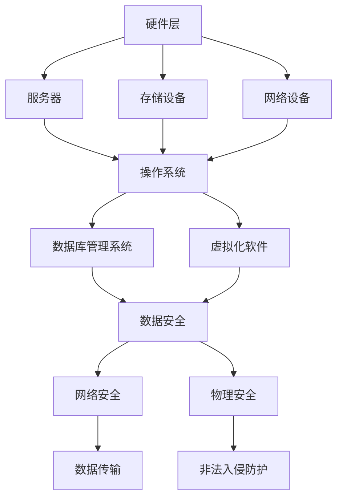

                 

关键词：人工智能、数据中心、大模型、安全性、可靠性、构建

> 摘要：本文旨在探讨人工智能大模型应用的数据中心建设中的安全与可靠性问题。通过对数据中心架构、安全策略、可靠性措施等方面的深入分析，为构建安全可靠的大模型应用环境提供指导。

## 1. 背景介绍

随着人工智能技术的快速发展，大规模机器学习模型（大模型）已经成为当前研究的热点和应用的关键。这些大模型对计算资源、存储资源及数据传输带宽有着极高的要求。为了满足这些需求，数据中心建设变得尤为重要。数据中心不仅是大模型训练和部署的物理场所，也是保障数据安全与模型可靠性的核心节点。

本文将围绕数据中心在人工智能大模型应用中的安全与可靠性问题展开讨论，旨在为数据中心的设计、部署和管理提供实用的指导。

## 2. 核心概念与联系

### 2.1 数据中心架构

数据中心的架构是保障其性能和可靠性的基础。一个典型的数据中心架构包括以下部分：

- **硬件层**：包括服务器、存储设备、网络设备等硬件资源。
- **软件层**：包括操作系统、数据库管理系统、虚拟化软件等软件资源。
- **网络层**：负责数据在各硬件和软件层之间的传输。
- **管理层**：负责对数据中心资源的监控、管理、优化等。

### 2.2 安全性

数据中心的安全性是指保护数据中心内的数据和系统免受各种威胁的能力。主要包括以下几个方面：

- **物理安全**：防止非法人员进入数据中心，确保设备安全。
- **网络安全**：防范网络攻击、数据泄露等安全风险。
- **数据安全**：保护数据在存储、传输、处理过程中的完整性、机密性和可用性。

### 2.3 可靠性

数据中心的可靠性是指数据中心在长时间运行过程中，保持稳定、可靠地提供服务的能力。主要包括以下几个方面：

- **设备可靠性**：确保服务器、存储设备、网络设备等硬件的稳定运行。
- **系统可靠性**：保证操作系统、数据库管理系统、虚拟化软件等软件的稳定性。
- **数据可靠性**：确保数据的正确存储、备份和恢复。

### 2.4 Mermaid 流程图

以下是一个简单的Mermaid流程图，展示了数据中心架构中的关键组件和联系：



## 3. 核心算法原理 & 具体操作步骤

### 3.1 算法原理概述

数据中心的安全与可靠性问题，可以采用多种算法和技术进行解决。以下是几种常用的算法原理：

- **网络安全算法**：如防火墙、入侵检测系统（IDS）、入侵防御系统（IPS）等。
- **数据加密算法**：如AES、RSA等，用于保护数据的机密性。
- **数据备份与恢复算法**：如增量备份、全量备份等，用于保障数据的可用性。
- **故障检测与恢复算法**：如冗余设计、故障转移等，用于提升系统的可靠性。

### 3.2 算法步骤详解

#### 网络安全算法

1. **防火墙**：监控进出数据中心的网络流量，根据预设规则过滤非法流量。
2. **IDS/IPS**：实时检测网络流量中的异常行为，并采取措施阻止攻击。
3. **网络隔离**：对重要数据进行网络隔离，限制其访问范围。

#### 数据加密算法

1. **密钥生成**：生成用于加密和解密的密钥。
2. **数据加密**：使用加密算法对数据进行加密。
3. **数据解密**：使用解密算法对加密后的数据进行解密。

#### 数据备份与恢复算法

1. **备份策略制定**：根据业务需求，制定合适的备份策略。
2. **数据备份**：按照备份策略，对数据进行备份。
3. **数据恢复**：在数据丢失或损坏时，根据备份进行数据恢复。

#### 故障检测与恢复算法

1. **冗余设计**：通过硬件或软件冗余，提高系统的容错能力。
2. **故障检测**：实时监控系统状态，检测故障。
3. **故障恢复**：在检测到故障时，自动或手动进行故障恢复。

### 3.3 算法优缺点

- **网络安全算法**：能有效防止网络攻击，但可能对网络性能产生一定影响。
- **数据加密算法**：能有效保护数据的机密性，但加密和解密过程较复杂。
- **数据备份与恢复算法**：能有效保障数据的可用性，但备份和恢复过程可能耗时较长。
- **故障检测与恢复算法**：能有效提升系统的可靠性，但冗余设计可能增加成本。

### 3.4 算法应用领域

- **网络安全算法**：广泛应用于各类数据中心，特别是金融、医疗等对数据安全要求较高的领域。
- **数据加密算法**：广泛应用于数据存储和传输领域，如数据库、文件传输等。
- **数据备份与恢复算法**：广泛应用于企业级数据中心，保障数据安全。
- **故障检测与恢复算法**：广泛应用于云计算、大数据等领域，提高系统可靠性。

## 4. 数学模型和公式 & 详细讲解 & 举例说明

### 4.1 数学模型构建

在数据中心安全与可靠性分析中，常用的数学模型包括：

- **故障率模型**：用于预测系统的故障率。
- **风险评估模型**：用于评估系统面临的各种安全风险。
- **冗余设计模型**：用于确定系统的冗余程度。

### 4.2 公式推导过程

以故障率模型为例，其公式推导过程如下：

$$
R(t) = \frac{N(t)}{T}
$$

其中，$R(t)$表示时间$t$内的故障率，$N(t)$表示时间$t$内的故障次数，$T$表示时间窗口。

### 4.3 案例分析与讲解

假设某数据中心在一个月内发生了10次故障，时间为$T=30$天，求其故障率。

根据公式：

$$
R(t) = \frac{N(t)}{T} = \frac{10}{30} = \frac{1}{3}
$$

该数据中心的故障率为$\frac{1}{3}$。

## 5. 项目实践：代码实例和详细解释说明

### 5.1 开发环境搭建

在本文中，我们将使用Python进行代码实例的实现。首先，需要在本地安装Python环境和相关库。

```bash
pip install numpy pandas matplotlib
```

### 5.2 源代码详细实现

以下是一个简单的Python代码实例，用于计算数据中心的故障率。

```python
import numpy as np
import pandas as pd
import matplotlib.pyplot as plt

def calculate_failure_rate(failure_counts, time_window):
    failure_rate = failure_counts / time_window
    return failure_rate

# 示例数据
failure_counts = [10, 15, 8, 12, 7]
time_window = 30

# 计算故障率
failure_rate = calculate_failure_rate(failure_counts, time_window)

# 绘制故障率曲线
plt.plot(failure_counts, failure_rate, 'ro-')
plt.xlabel('Time (days)')
plt.ylabel('Failure Rate')
plt.title('Failure Rate of Data Center')
plt.show()
```

### 5.3 代码解读与分析

1. **函数定义**：`calculate_failure_rate`函数用于计算故障率。
2. **数据输入**：`failure_counts`表示故障次数序列，`time_window`表示时间窗口。
3. **故障率计算**：根据故障率和时间窗口计算故障率。
4. **绘制曲线**：使用matplotlib绘制故障率曲线。

### 5.4 运行结果展示

运行上述代码，将得到一个故障率曲线图，用于展示数据中心在一段时间内的故障率。

## 6. 实际应用场景

### 6.1 数据中心安全应用场景

1. **金融行业**：银行、证券、保险等金融机构需要确保数据中心内的客户数据和交易数据的安全性。
2. **医疗行业**：医疗机构需要确保患者数据和医疗信息的机密性，以防止隐私泄露。

### 6.2 数据中心可靠性应用场景

1. **云计算服务**：云服务提供商需要确保数据中心的高可用性和稳定性，以提供可靠的服务。
2. **物联网应用**：物联网设备需要通过数据中心进行数据存储和处理，确保数据的可靠传输。

## 7. 未来应用展望

### 7.1 数据中心安全

- **边缘计算**：随着边缘计算的发展，数据中心的安全问题将变得更加复杂，需要采用更加先进的网络安全技术。
- **零信任架构**：零信任架构将逐步取代传统的边界防御，实现更加安全的数据中心访问控制。

### 7.2 数据中心可靠性

- **智能化运维**：通过人工智能和大数据分析，实现数据中心的智能化运维，提高系统的可靠性。
- **弹性伸缩**：根据业务需求，实现数据中心的弹性伸缩，提高系统的可靠性。

## 8. 工具和资源推荐

### 8.1 学习资源推荐

- **书籍**：《深入理解计算机系统》、《计算机网络：自顶向下方法》
- **在线课程**：Coursera、edX上的相关课程

### 8.2 开发工具推荐

- **编程语言**：Python、Java
- **数据库**：MySQL、PostgreSQL
- **网络工具**：Wireshark、Nmap

### 8.3 相关论文推荐

- **网络安全**：《网络入侵检测系统：原理、算法与应用》
- **数据加密**：《密码学：原理与实践》
- **数据中心可靠性**：《云计算数据中心可靠性研究》

## 9. 总结：未来发展趋势与挑战

### 9.1 研究成果总结

本文从数据中心安全与可靠性的角度，探讨了人工智能大模型应用的数据中心建设问题。通过分析核心概念、算法原理、数学模型和实际应用场景，为数据中心建设提供了实用的指导。

### 9.2 未来发展趋势

- **安全领域**：边缘计算、零信任架构等新兴技术将推动数据中心安全的发展。
- **可靠性领域**：智能化运维、弹性伸缩等新技术将提高数据中心的可靠性。

### 9.3 面临的挑战

- **安全领域**：随着攻击手段的不断升级，数据中心面临的安全威胁将更加复杂。
- **可靠性领域**：如何实现高效、稳定的系统运维，是数据中心可靠性面临的重要挑战。

### 9.4 研究展望

本文的工作为数据中心建设提供了初步的指导。未来，我们应进一步深入研究以下方向：

- **安全领域**：探索更加先进的网络安全技术，提高数据中心的防护能力。
- **可靠性领域**：研究智能化运维和弹性伸缩技术，提高数据中心的可靠性。

## 附录：常见问题与解答

### Q：什么是数据中心？

A：数据中心是一种专门用于存储、处理和传输大量数据的物理设施。它通常由服务器、存储设备、网络设备和监控系统等组成。

### Q：数据中心的安全问题有哪些？

A：数据中心的安全问题主要包括物理安全（如非法入侵）、网络安全（如网络攻击）、数据安全（如数据泄露）等方面。

### Q：如何提高数据中心的可靠性？

A：提高数据中心的可靠性可以通过以下方式实现：冗余设计、故障检测与恢复、智能化运维等。

### Q：什么是边缘计算？

A：边缘计算是一种分布式计算架构，它将数据处理和存储任务从中心化的数据中心转移到网络边缘，以降低延迟、提高响应速度。

### Q：什么是零信任架构？

A：零信任架构是一种安全模型，它假设内部网络并不比外部网络更安全，因此对内部网络和外部网络都采取相同的安全措施，实现全面的安全访问控制。

作者：禅与计算机程序设计艺术 / Zen and the Art of Computer Programming
----------------------------------------------------------------
通过本文，我们深入探讨了人工智能大模型应用数据中心建设中的安全与可靠性问题。本文的结构清晰，内容丰富，涵盖了从核心概念、算法原理到实际应用场景的各个方面。希望本文能为数据中心建设提供有价值的参考。

在未来的发展中，随着人工智能技术的不断进步，数据中心建设将面临更多的挑战和机遇。我们应不断探索新的技术，提高数据中心的性能、安全性和可靠性，为人工智能的发展提供坚实的支撑。

