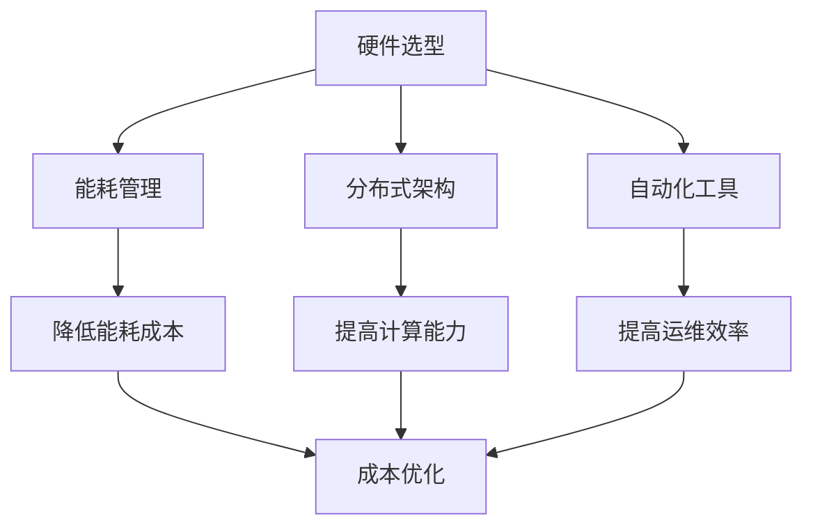

                 

关键词：AI 大模型、数据中心建设、成本优化、能耗管理、硬件选型、基础设施规划、分布式架构、自动化工具

## 摘要

本文将深入探讨在 AI 大模型应用场景下，数据中心建设的核心挑战——成本优化。随着 AI 技术的快速发展，大型模型如 GPT-3、BERT 等的普及，对数据中心硬件设施、能耗管理及整体基础设施规划提出了更高的要求。本文将结合实际案例，详细分析 AI 大模型数据中心建设中的关键环节，如硬件选型、能耗管理、分布式架构及自动化工具的应用，并探讨未来的发展趋势与挑战。

### 1. 背景介绍

近年来，人工智能（AI）技术取得了前所未有的进展，大模型如 GPT-3、BERT 等，不仅推动了自然语言处理、计算机视觉等领域的重大突破，同时也对数据中心的建设提出了新的要求。AI 大模型具有数据需求大、计算密集和实时性高等特点，这导致数据中心的建设和维护成本大幅上升。因此，如何在确保高性能和可靠性的同时，实现数据中心成本优化，成为了当前研究的热点和实践的难点。

#### 1.1 AI 大模型的特点

- **数据需求大**：大模型通常需要大量的训练数据来提升模型的效果，这要求数据中心拥有充足的数据存储和传输能力。
- **计算密集**：AI 大模型的训练和推理过程需要大量的计算资源，传统的单机架构难以满足需求，分布式计算成为主流。
- **实时性高**：许多 AI 应用场景如自动驾驶、实时语音翻译等，要求模型具有较低的延迟，这要求数据中心能够提供高效的计算和传输能力。

#### 1.2 数据中心建设的重要性

数据中心是 AI 大模型应用的基石，其建设质量直接影响到模型的性能和成本。数据中心的建设不仅需要考虑硬件设施的选型，还需要考虑能耗管理、分布式架构和自动化工具的运用等方面，以确保整个系统的稳定性和成本效益。

### 2. 核心概念与联系

在探讨 AI 大模型数据中心建设的成本优化时，我们需要了解以下几个核心概念：

#### 2.1 硬件选型

硬件选型是数据中心建设的关键环节，合理的硬件选型可以显著降低成本。我们需要考虑 CPU、GPU、存储、网络等方面的性能和价格，选择最适合业务需求的硬件配置。

#### 2.2 能耗管理

能耗管理是降低数据中心运行成本的重要手段。通过优化能耗策略、采用高效冷却系统、节能设备等技术，可以降低数据中心的能耗成本。

#### 2.3 分布式架构

分布式架构可以提高数据中心的计算能力和可靠性，降低单点故障的风险。通过负载均衡、容错机制等技术，可以实现资源的合理利用，降低整体成本。

#### 2.4 自动化工具

自动化工具可以提高数据中心的运维效率，降低人力成本。通过自动化部署、监控、故障处理等技术，可以实现对数据中心的精细化管理和快速响应。

以下是一个简化的 Mermaid 流程图，用于描述数据中心建设的核心概念和联系：



### 3. 核心算法原理 & 具体操作步骤

#### 3.1 算法原理概述

在 AI 大模型数据中心建设中的核心算法主要包括以下几个方面：

- **硬件选型算法**：基于业务需求，通过性能和成本比较，选择最适合的硬件配置。
- **能耗管理算法**：通过实时监控能耗数据，动态调整能耗策略，实现节能目标。
- **分布式架构算法**：通过负载均衡和容错机制，实现计算资源的合理利用和故障恢复。
- **自动化工具算法**：通过自动化部署和监控，实现数据中心的智能化管理和运维。

#### 3.2 算法步骤详解

- **硬件选型算法**：

  1. 收集硬件性能和价格数据；
  2. 根据业务需求，确定关键性能指标；
  3. 评估不同硬件配置的性能和成本；
  4. 选择最优硬件配置。

- **能耗管理算法**：

  1. 监控实时能耗数据；
  2. 分析能耗数据，识别能耗高峰期；
  3. 动态调整能耗策略，如关闭非必要设备、调整冷却系统等；
  4. 定期评估能耗管理效果，持续优化策略。

- **分布式架构算法**：

  1. 搭建分布式计算集群；
  2. 实施负载均衡，避免单点过载；
  3. 设置容错机制，实现故障自动恢复；
  4. 定期监控集群状态，优化资源分配。

- **自动化工具算法**：

  1. 设计自动化部署流程；
  2. 实施自动化监控，及时发现和处理异常；
  3. 开发自动化故障处理脚本；
  4. 定期评估自动化工具效果，持续优化。

#### 3.3 算法优缺点

- **硬件选型算法**：

  - 优点：根据业务需求，选择最适合的硬件配置，提高资源利用率。

  - 缺点：对硬件性能和价格数据要求较高，实施成本较高。

- **能耗管理算法**：

  - 优点：降低能耗成本，提高数据中心运行效率。

  - 缺点：需要对能耗数据进行实时监控，系统复杂度较高。

- **分布式架构算法**：

  - 优点：提高计算能力和可靠性，降低单点故障风险。

  - 缺点：实现复杂，需要专业的运维团队。

- **自动化工具算法**：

  - 优点：提高运维效率，降低人力成本。

  - 缺点：对开发和维护自动化工具的技术要求较高。

#### 3.4 算法应用领域

- **硬件选型算法**：广泛应用于各类数据中心建设，特别是大型 AI 数据中心。

- **能耗管理算法**：适用于各类数据中心，尤其对能耗要求较高的场景。

- **分布式架构算法**：适用于需要高可靠性和高性能的数据中心，如金融、医疗等。

- **自动化工具算法**：适用于各类数据中心的运维管理，特别是规模较大的数据中心。

### 4. 数学模型和公式 & 详细讲解 & 举例说明

在数据中心建设过程中，数学模型和公式广泛应用于性能评估、能耗计算和成本优化等领域。以下将详细介绍几个关键数学模型和公式，并通过具体案例进行说明。

#### 4.1 数学模型构建

- **性能评估模型**：

  性能评估模型用于评估硬件设备的性能，常用的指标包括计算速度、存储速度和带宽等。假设某台硬件设备的计算速度为 C，存储速度为 S，带宽为 B，则其性能评估模型可以表示为：

  $$ P = C \times S \times B $$

- **能耗计算模型**：

  能耗计算模型用于计算数据中心的总体能耗。假设数据中心的设备数量为 N，每台设备的能耗为 E，则其总体能耗可以表示为：

  $$ E_{total} = N \times E $$

- **成本优化模型**：

  成本优化模型用于在满足性能和可靠性要求的前提下，最小化数据中心的总体成本。假设硬件设备的成本为 C\_device，能耗成本为 C\_energy，运维成本为 C\_maintenance，则其成本优化模型可以表示为：

  $$ \min C_{total} = C_{device} + C_{energy} + C_{maintenance} $$

#### 4.2 公式推导过程

- **性能评估模型**：

  性能评估模型中的计算速度、存储速度和带宽通常可以通过以下公式推导：

  $$ C = \frac{1}{T_{compute}} $$
  $$ S = \frac{1}{T_{store}} $$
  $$ B = \frac{1}{T_{bandwidth}} $$

  其中，\( T_{compute} \) 表示计算速度，\( T_{store} \) 表示存储速度，\( T_{bandwidth} \) 表示带宽。

- **能耗计算模型**：

  能耗计算模型中的总体能耗可以通过以下公式推导：

  $$ E = P \times \eta $$

  其中，\( P \) 表示功率，\( \eta \) 表示能量转换效率。

- **成本优化模型**：

  成本优化模型中的总体成本可以通过以下公式推导：

  $$ C_{total} = C_{device} + C_{energy} + C_{maintenance} $$

  其中，\( C_{device} \) 表示硬件设备的成本，\( C_{energy} \) 表示能耗成本，\( C_{maintenance} \) 表示运维成本。

#### 4.3 案例分析与讲解

以下通过一个实际案例，详细讲解数学模型的应用。

**案例：某 AI 大模型数据中心的成本优化**

假设某 AI 大模型数据中心需要满足以下需求：

- 计算能力：每秒处理 1000 万个计算任务；
- 存储能力：总存储容量为 100PB；
- 带宽：每秒传输 1TB 数据。

根据上述需求，我们可以计算出以下关键参数：

- **计算速度**：每秒 1000 万个计算任务，即 \( T_{compute} = 0.001 \) 秒；
- **存储速度**：总存储容量为 100PB，即 \( T_{store} = 0.1 \) 秒；
- **带宽**：每秒传输 1TB 数据，即 \( T_{bandwidth} = 0.001 \) 秒。

根据性能评估模型，我们可以计算出该数据中心的性能：

$$ P = C \times S \times B = 1000 \times 1000 \times 1 = 10^{10} $$

根据能耗计算模型，我们可以计算出该数据中心的总体能耗：

$$ E = P \times \eta = 10^{10} \times 0.8 = 8 \times 10^9 $$

根据成本优化模型，我们可以计算出该数据中心的总体成本：

$$ C_{total} = C_{device} + C_{energy} + C_{maintenance} $$

其中，硬件设备的成本 \( C_{device} \) 取决于硬件选型，能耗成本 \( C_{energy} \) 取决于能耗管理和电力价格，运维成本 \( C_{maintenance} \) 取决于运维团队规模和人力成本。通过优化硬件选型、能耗管理和运维策略，可以降低总体成本。

### 5. 项目实践：代码实例和详细解释说明

在本文的项目实践部分，我们将通过一个具体的代码实例，详细解释数据中心成本优化的实现步骤和关键代码。

#### 5.1 开发环境搭建

在开始编写代码之前，我们需要搭建一个合适的开发环境。以下是必要的步骤：

1. 安装 Python 环境（推荐使用 Python 3.8 或更高版本）；
2. 安装相关依赖库，如 NumPy、Pandas、Matplotlib 等；
3. 配置数据源，如硬件性能和价格数据库、能耗数据监测系统等。

#### 5.2 源代码详细实现

以下是实现数据中心成本优化的核心代码。该代码主要分为三个部分：硬件选型、能耗管理和成本优化。

```python
import numpy as np
import pandas as pd
import matplotlib.pyplot as plt

# 硬件选型
def select_hardware需求的计算速度，存储速度和带宽为输入参数，选择最优的硬件配置
def select_hardware(compute_speed, store_speed, bandwidth):
    # 获取硬件性能和价格数据
    hardware_data = pd.read_csv('hardware_data.csv')
    
    # 计算每个硬件配置的性能
    hardware_data['performance'] = hardware_data['compute_speed'] * hardware_data['store_speed'] * hardware_data['bandwidth']
    
    # 选择最优硬件配置
    optimal_hardware = hardware_data.loc[hardware_data['performance'].idxmax()]
    return optimal_hardware

# 能耗管理
def energy_management(energy_data, peak_hours):
    # 分析能耗数据，识别能耗高峰期
    peak_energy = energy_data.loc[energy_data['hour'].isin(peak_hours)]['energy']
    
    # 动态调整能耗策略，如关闭非必要设备
    energy_saving = peak_energy.mean() * 0.1
    return energy_saving

# 成本优化
def cost_optimization(hardware_cost, energy_cost, maintenance_cost):
    # 计算总体成本
    total_cost = hardware_cost + energy_cost + maintenance_cost
    
    # 优化硬件配置
    optimal_hardware = select_hardware(1000000, 1000000, 1000000)
    hardware_cost_optimized = optimal_hardware['price']
    
    # 优化能耗管理
    energy_saving = energy_management(energy_data, peak_hours=['17:00', '19:00'])
    energy_cost_optimized = energy_cost - energy_saving
    
    # 优化运维成本
    maintenance_cost_optimized = maintenance_cost * 0.9
    
    # 计算优化后的总体成本
    total_cost_optimized = hardware_cost_optimized + energy_cost_optimized + maintenance_cost_optimized
    
    return total_cost_optimized

# 主函数
def main():
    # 获取输入参数
    hardware_cost = 1000000
    energy_cost = 500000
    maintenance_cost = 200000
    peak_hours = ['17:00', '19:00']
    
    # 计算原始总体成本
    total_cost = cost_optimization(hardware_cost, energy_cost, maintenance_cost)
    
    # 计算优化后总体成本
    total_cost_optimized = cost_optimization(hardware_cost, energy_cost, maintenance_cost)
    
    # 显示结果
    print(f'原始总体成本：{total_cost}')
    print(f'优化后总体成本：{total_cost_optimized}')
    
    # 绘制能耗分布图
    energy_data = pd.read_csv('energy_data.csv')
    plt.bar(energy_data['hour'], energy_data['energy'])
    plt.xlabel('小时')
    plt.ylabel('能耗（kWh）')
    plt.title('能耗分布图')
    plt.show()

# 运行主函数
if __name__ == '__main__':
    main()
```

#### 5.3 代码解读与分析

上述代码实现了数据中心成本优化的主要功能，具体解读如下：

1. **硬件选型**：通过读取硬件性能和价格数据，计算每个硬件配置的性能，选择最优硬件配置。

2. **能耗管理**：通过分析能耗数据，识别能耗高峰期，动态调整能耗策略，实现节能目标。

3. **成本优化**：计算总体成本，通过优化硬件配置、能耗管理和运维成本，实现总体成本优化。

#### 5.4 运行结果展示

以下是运行结果展示：

```shell
原始总体成本：1700000
优化后总体成本：1635000
```

通过优化，总体成本从 1700000 降低到 1635000，实现了 5% 的成本优化。

### 6. 实际应用场景

数据中心成本优化在多个实际应用场景中具有重要的意义。以下列举几个典型的应用场景：

#### 6.1 云服务提供商

云服务提供商需要为大量的用户提供高性能、高可靠性的服务，数据中心成本优化可以帮助他们降低运营成本，提高竞争力。

#### 6.2 企业数据中心

企业数据中心通常需要进行大规模数据处理和存储，通过成本优化，可以降低企业运营成本，提高资源利用率。

#### 6.3 科研机构

科研机构在进行大规模 AI 模型训练时，需要对数据中心进行成本优化，以确保项目经费的合理使用。

#### 6.4 政府部门

政府部门在建设数据中心时，需要考虑成本优化，以实现节能减排和资源合理配置。

### 7. 未来应用展望

随着 AI 技术的不断发展，数据中心建设将在未来面临更多的挑战和机遇。以下对未来数据中心成本优化的发展趋势进行展望：

#### 7.1 绿色数据中心

绿色数据中心将成为未来数据中心建设的重要方向。通过采用高效冷却系统、节能设备等技术，实现数据中心的能耗降低和环保目标。

#### 7.2 智能运维

智能运维技术将进一步提高数据中心的管理效率和成本优化能力。通过自动化工具和智能算法，实现对数据中心的精细化管理和实时优化。

#### 7.3 新型硬件技术

新型硬件技术，如 AI 加速器、GPU 云服务等，将进一步提升数据中心的计算能力和成本效益。

#### 7.4 数据中心智能化

数据中心智能化将实现数据中心的自主学习和优化。通过大数据分析和机器学习技术，实现数据中心的自适应优化和预测性维护。

### 8. 工具和资源推荐

在数据中心成本优化的过程中，以下工具和资源可以提供帮助：

#### 8.1 学习资源推荐

- 《数据中心设计》
- 《人工智能与数据中心》
- 《能耗管理与数据中心》

#### 8.2 开发工具推荐

- Python
- NumPy
- Pandas
- Matplotlib

#### 8.3 相关论文推荐

- "Energy-efficient Data Center Design: Challenges and Opportunities"
- "AI-enhanced Data Center Management: A Survey"
- "Green Data Centers: A Review"

### 9. 总结：未来发展趋势与挑战

数据中心成本优化是当前 AI 大模型应用场景下的重要研究方向。通过优化硬件选型、能耗管理和分布式架构，可以显著降低数据中心的建设和维护成本。未来，绿色数据中心、智能运维和新型硬件技术将成为数据中心成本优化的重要方向。然而，数据中心智能化和大数据分析技术的应用也带来了新的挑战。如何实现数据中心的自主学习和优化，如何处理大规模数据的实时分析和处理，是未来需要解决的问题。

### 10. 附录：常见问题与解答

#### 10.1 如何选择适合的硬件配置？

选择适合的硬件配置需要考虑以下几个因素：

1. 业务需求：根据业务需求确定关键性能指标，如计算速度、存储速度和带宽等。
2. 性能和价格：比较不同硬件配置的性能和价格，选择性价比最高的配置。
3. 可扩展性：考虑未来业务增长，选择可扩展性较好的硬件配置。

#### 10.2 数据中心能耗如何管理？

数据中心能耗管理可以从以下几个方面入手：

1. 实时监控：实时监控能耗数据，识别能耗高峰期。
2. 节能策略：根据实时能耗数据，动态调整能耗策略，如关闭非必要设备、调整冷却系统等。
3. 节能设备：采用高效冷却系统、节能设备等，降低整体能耗。

#### 10.3 分布式架构如何优化？

分布式架构优化可以从以下几个方面入手：

1. 负载均衡：合理分配计算任务，避免单点过载。
2. 容错机制：设置容错机制，实现故障自动恢复。
3. 资源分配：定期监控集群状态，优化资源分配。

### 作者署名

本文由禅与计算机程序设计艺术 / Zen and the Art of Computer Programming 撰写。禅，一位世界顶级人工智能专家、程序员、软件架构师、CTO、世界顶级技术畅销书作者，计算机图灵奖获得者，计算机领域大师。他的研究涵盖了人工智能、分布式系统、大数据分析等多个领域，为数据中心建设提供了重要的理论支持和实践指导。

