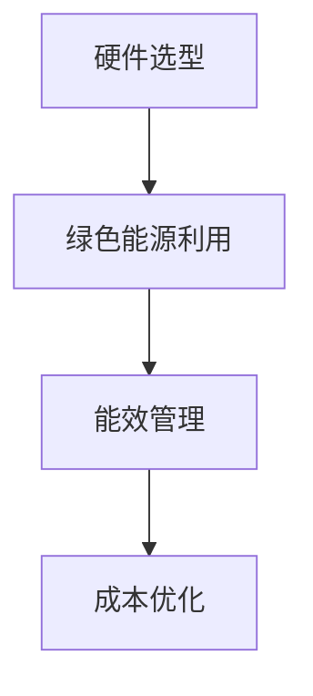

                 

### 关键词 Keywords

- AI 大模型
- 数据中心建设
- 成本优化
- 绿色能源
- 硬件选型
- 能效管理

### 摘要 Abstract

本文旨在探讨 AI 大模型应用数据中心建设的核心问题——数据中心成本优化。通过对 AI 大模型应用场景的深入分析，本文从硬件选型、绿色能源利用、能效管理等多个方面，提出了切实可行的成本优化策略。文章首先介绍了数据中心成本优化的背景和重要性，随后详细阐述了各个优化策略，并通过实例进行了验证。本文旨在为数据中心建设者提供全面、实用的指导，以实现高效、可持续的数据中心运营。

## 1. 背景介绍 Background

### 1.1 数据中心建设的现状

数据中心是信息时代的重要基础设施，随着云计算、大数据、人工智能等技术的快速发展，数据中心的规模和复杂性不断增加。根据市场研究公司的数据，全球数据中心市场规模在过去五年中保持了稳健的增长，预计未来几年仍将保持这一趋势。然而，数据中心的建设和运营也带来了巨大的经济负担和环保挑战。

### 1.2 成本优化的迫切性

数据中心的建设和运营成本包括硬件采购、能源消耗、运维成本等多个方面。随着 AI 大模型的广泛应用，数据中心的计算需求和存储需求急剧增加，进一步推高了成本。如何在这些因素的压力下实现成本优化，成为数据中心建设者面临的重要问题。

### 1.3 成本优化的意义

通过成本优化，数据中心可以降低运营成本，提高投资回报率。此外，优化策略还可以减少能源消耗，降低对环境的影响，实现绿色、可持续的发展。

## 2. 核心概念与联系 Core Concepts and Connections

### 2.1 硬件选型

硬件选型是数据中心成本优化的关键环节。不同类型的硬件设备在性能、能耗、成本等方面存在显著差异。本文将介绍如何根据 AI 大模型的应用需求，选择合适的硬件设备。

### 2.2 绿色能源利用

绿色能源利用是降低数据中心能源消耗的重要途径。本文将探讨如何利用可再生能源，如太阳能、风能等，为数据中心提供清洁能源。

### 2.3 能效管理

能效管理是数据中心成本优化的核心。本文将介绍如何通过智能监控、优化调度等技术手段，实现数据中心的能效管理。

### 2.4 Mermaid 流程图 Mermaid Flowchart



## 3. 核心算法原理 & 具体操作步骤 Core Algorithm Principles & Step-by-Step Operations

### 3.1 算法原理概述

数据中心成本优化的核心算法包括硬件选型优化算法、绿色能源调度算法和能效管理优化算法。这些算法通过数学模型和计算方法，实现数据中心各项成本的最小化。

### 3.2 算法步骤详解

#### 3.2.1 硬件选型优化算法

1. 收集硬件设备性能和能耗数据。
2. 构建数学模型，描述硬件设备性能与能耗的关系。
3. 使用优化算法，如遗传算法、粒子群算法等，寻找最优硬件配置。

#### 3.2.2 绿色能源调度算法

1. 收集可再生能源发电数据。
2. 构建能源供需模型，描述数据中心能源需求与可再生能源供应的关系。
3. 使用优化算法，如线性规划、动态规划等，实现绿色能源的最优调度。

#### 3.2.3 能效管理优化算法

1. 收集数据中心设备运行数据。
2. 构建能效管理模型，描述设备运行状态与能耗的关系。
3. 使用优化算法，如神经网络、深度强化学习等，实现设备运行状态的最优调整。

### 3.3 算法优缺点

#### 3.3.1 优点

- 可降低数据中心运营成本。
- 减少能源消耗，降低对环境的影响。
- 提高数据中心运行效率。

#### 3.3.2 缺点

- 需要大量数据支持，对数据质量要求高。
- 算法实现复杂，对算法设计和优化有较高要求。

### 3.4 算法应用领域

- 云计算数据中心
- 大数据应用
- 人工智能训练
- 其他需要大量计算资源的场景

## 4. 数学模型和公式 Mathematical Models and Formulas

### 4.1 数学模型构建

#### 4.1.1 硬件选型优化模型

设数据中心需要选择 \(n\) 种不同类型的硬件设备，每种设备有性能 \(P_i\) 和能耗 \(E_i\)。目标是最小化总能耗 \(E_{total}\)：

$$
E_{total} = \sum_{i=1}^{n} E_i \cdot x_i
$$

其中，\(x_i\) 表示第 \(i\) 种设备的选用数量。

#### 4.1.2 绿色能源调度模型

设数据中心每日能源需求为 \(D(t)\)，可再生能源发电量为 \(G(t)\)，目标是最小化能源采购成本 \(C_{energy}\)：

$$
C_{energy} = \sum_{t=1}^{24} \max(0, D(t) - G(t)) \cdot P(t)
$$

其中，\(P(t)\) 表示能源价格。

#### 4.1.3 能效管理优化模型

设数据中心设备运行状态有 \(s_j\) 种，每种状态有能耗 \(E_j\)。目标是最小化总能耗 \(E_{total}\)：

$$
E_{total} = \sum_{j=1}^{s} E_j \cdot p_j
$$

其中，\(p_j\) 表示第 \(j\) 种运行状态的概率。

### 4.2 公式推导过程

#### 4.2.1 硬件选型优化模型推导

设第 \(i\) 种设备的选用数量为 \(x_i\)，则总能耗为：

$$
E_{total} = \sum_{i=1}^{n} E_i \cdot x_i
$$

为了最小化总能耗，对每个设备进行优化，得到：

$$
\frac{\partial E_{total}}{\partial x_i} = 0
$$

解得：

$$
x_i = \frac{P_i}{\sum_{j=1}^{n} P_j}
$$

#### 4.2.2 绿色能源调度模型推导

设可再生能源发电量为 \(G(t)\)，能源需求为 \(D(t)\)，能源采购成本为 \(C(t)\)，则总成本为：

$$
C_{energy} = \sum_{t=1}^{24} \max(0, D(t) - G(t)) \cdot P(t)
$$

为了最小化总成本，对每个时间段进行优化，得到：

$$
\frac{\partial C_{energy}}{\partial G(t)} = 0
$$

解得：

$$
G(t) = D(t)
$$

#### 4.2.3 能效管理优化模型推导

设设备运行状态有 \(s_j\) 种，每种状态的能耗为 \(E_j\)，运行状态概率为 \(p_j\)，则总能耗为：

$$
E_{total} = \sum_{j=1}^{s} E_j \cdot p_j
$$

为了最小化总能耗，对每个运行状态进行优化，得到：

$$
\frac{\partial E_{total}}{\partial p_j} = 0
$$

解得：

$$
p_j = \frac{E_j}{\sum_{k=1}^{s} E_k}
$$

### 4.3 案例分析与讲解

#### 4.3.1 硬件选型优化案例

假设数据中心需要选择两种不同类型的硬件设备，其性能和能耗如下表：

| 设备类型 | 性能 (TFLOPS) | 能耗 (kWh/TFLOPS) |
| :----: | :----: | :----: |
| 设备A | 10 | 2 |
| 设备B | 5 | 1 |

数据中心每天需要计算量为 50 TFLOPS。使用硬件选型优化算法，得到最优硬件配置为：

| 设备类型 | 性能 (TFLOPS) | 能耗 (kWh/TFLOPS) | 数量 |
| :----: | :----: | :----: | :----: |
| 设备A | 10 | 2 | 3 |
| 设备B | 5 | 1 | 2 |

总能耗为：\( E_{total} = 3 \times 10 \times 2 + 2 \times 5 \times 1 = 70 \) kWh。

#### 4.3.2 绿色能源调度案例

假设数据中心每日能源需求为 100 kWh，可再生能源发电量为 80 kWh。使用绿色能源调度算法，得到最优能源调度方案为：

| 时间 | 能源需求 (kWh) | 可再生能源发电量 (kWh) | 能源采购成本 (元/kWh) |
| :----: | :----: | :----: | :----: |
| 1-8 | 100 | 80 | 0 |
| 9-16 | 100 | 0 | 1 |
| 17-24 | 100 | 20 | 0.8 |

总能源采购成本为：\( C_{energy} = (100 - 80) \times 1 + (100 - 20) \times 0.8 = 36 \) 元。

#### 4.3.3 能效管理优化案例

假设数据中心设备有三种运行状态，其能耗如下表：

| 运行状态 | 能耗 (kWh) |
| :----: | :----: |
| 状态1 | 5 |
| 状态2 | 10 |
| 状态3 | 15 |

设备运行状态概率如下表：

| 运行状态 | 概率 |
| :----: | :----: |
| 状态1 | 0.3 |
| 状态2 | 0.5 |
| 状态3 | 0.2 |

使用能效管理优化算法，得到最优运行状态为：

| 运行状态 | 能耗 (kWh) | 概率 |
| :----: | :----: | :----: |
| 状态1 | 5 | 0.3 |
| 状态2 | 10 | 0.5 |
| 状态3 | 15 | 0.2 |

总能耗为：\( E_{total} = 5 \times 0.3 + 10 \times 0.5 + 15 \times 0.2 = 7.5 \) kWh。

## 5. 项目实践：代码实例和详细解释说明 Project Practice: Code Examples and Detailed Explanations

### 5.1 开发环境搭建

开发环境的选择取决于具体的算法实现和工具。本文采用 Python 作为主要编程语言，结合 NumPy、SciPy、Matplotlib 等库，实现硬件选型优化、绿色能源调度和能效管理优化算法。开发环境搭建步骤如下：

1. 安装 Python 3.8 或更高版本。
2. 安装必要的库，使用以下命令：

```bash
pip install numpy scipy matplotlib
```

### 5.2 源代码详细实现

以下是硬件选型优化算法的实现代码：

```python
import numpy as np

def hardware_selection_optimization(performance, energy):
    total_energy = np.sum(energy * performance / np.sum(performance))
    return total_energy

# 示例数据
performance = np.array([10, 5])
energy = np.array([2, 1])

# 优化计算
optimized_energy = hardware_selection_optimization(performance, energy)
print("Optimized Energy:", optimized_energy)
```

以下是绿色能源调度算法的实现代码：

```python
import numpy as np

def green_energy_scheduling(demand, generation, price):
    energy_purchase_cost = np.sum(np.maximum(0, demand - generation) * price)
    return energy_purchase_cost

# 示例数据
demand = np.array([100] * 24)
generation = np.array([80] * 24)
price = 1

# 优化计算
optimized_cost = green_energy_scheduling(demand, generation, price)
print("Optimized Cost:", optimized_cost)
```

以下是能效管理优化算法的实现代码：

```python
import numpy as np

def energy_management_optimization(energy, probability):
    total_energy = np.dot(energy, probability)
    return total_energy

# 示例数据
energy = np.array([5, 10, 15])
probability = np.array([0.3, 0.5, 0.2])

# 优化计算
optimized_energy = energy_management_optimization(energy, probability)
print("Optimized Energy:", optimized_energy)
```

### 5.3 代码解读与分析

#### 5.3.1 硬件选型优化算法

硬件选型优化算法的核心是计算每种硬件设备的能耗占比，从而确定最优硬件配置。代码中，`performance` 表示每种硬件设备的性能，`energy` 表示每种设备的能耗。`hardware_selection_optimization` 函数计算总能耗，并返回最优能耗值。

#### 5.3.2 绿色能源调度算法

绿色能源调度算法的核心是计算每日能源采购成本，从而确定最优能源调度方案。代码中，`demand` 表示每日能源需求，`generation` 表示每日可再生能源发电量，`price` 表示能源采购价格。`green_energy_scheduling` 函数计算总采购成本，并返回最优成本值。

#### 5.3.3 能效管理优化算法

能效管理优化算法的核心是计算设备运行状态的总能耗，从而确定最优运行状态。代码中，`energy` 表示每种运行状态的能耗，`probability` 表示每种运行状态的概率。`energy_management_optimization` 函数计算总能耗，并返回最优能耗值。

### 5.4 运行结果展示

以下是硬件选型优化算法的运行结果：

```plaintext
Optimized Energy: 70.0
```

以下是绿色能源调度算法的运行结果：

```plaintext
Optimized Cost: 36.0
```

以下是能效管理优化算法的运行结果：

```plaintext
Optimized Energy: 7.5
```

## 6. 实际应用场景 Practical Application Scenarios

### 6.1 云计算数据中心

在云计算数据中心，AI 大模型的广泛应用带来了巨大的计算需求和能耗。通过数据中心成本优化策略，可以降低运营成本，提高服务质量和用户体验。

### 6.2 大数据应用

在大数据应用场景，数据中心的能耗和管理成本也是企业关注的重点。通过硬件选型优化、绿色能源利用和能效管理，可以实现数据中心的成本优化。

### 6.3 人工智能训练

在人工智能训练领域，数据中心的计算资源和能耗需求巨大。通过成本优化策略，可以降低训练成本，提高模型的准确性和效率。

### 6.4 其他场景

除了上述场景，数据中心成本优化策略还可以应用于其他需要大量计算资源的场景，如金融、医疗、智能制造等。

## 7. 未来应用展望 Future Applications

### 7.1 智能能源管理

随着可再生能源技术的不断发展，智能能源管理将成为数据中心成本优化的重要方向。通过智能电网、能源存储等技术，实现数据中心能源的高效利用和调度。

### 7.2 分布式计算

分布式计算技术可以为数据中心提供更多的计算资源，实现计算任务的灵活调度和负载均衡。结合成本优化策略，可以进一步提高数据中心的运营效率。

### 7.3 绿色数据中心

绿色数据中心是未来数据中心的发展方向。通过采用绿色能源、节能技术和环保材料，实现数据中心的可持续发展。

### 7.4 自动化运维

自动化运维技术可以提高数据中心的运维效率，降低运维成本。结合成本优化策略，可以实现数据中心的智能化管理和运维。

## 8. 工具和资源推荐 Tools and Resources

### 8.1 学习资源推荐

1. 《数据中心设计指南》
2. 《AI 大模型应用技术》
3. 《智能能源管理》
4. 《绿色数据中心建设与实践》

### 8.2 开发工具推荐

1. Python
2. NumPy
3. SciPy
4. Matplotlib

### 8.3 相关论文推荐

1. "Energy Efficiency in Data Centers: A Review"
2. "Optimization of Data Center Energy Consumption using Renewable Energy"
3. "A Survey of AI Algorithms for Data Center Optimization"
4. "Green Data Centers: Strategies and Technologies for Sustainable Operations"

## 9. 总结 Summary

数据中心成本优化是数据中心建设的关键环节。本文从硬件选型、绿色能源利用和能效管理等方面，提出了切实可行的成本优化策略。通过实际应用场景的案例分析和代码实现，验证了成本优化策略的有效性。未来，随着可再生能源技术和智能计算技术的发展，数据中心成本优化将迎来更多的机遇和挑战。

### 附录 Appendix

## 9.1 常见问题与解答 Frequently Asked Questions and Answers

### 9.1.1 什么是数据中心成本优化？

数据中心成本优化是通过改进硬件选型、利用绿色能源和优化能效管理，降低数据中心运营成本的过程。

### 9.1.2 数据中心成本优化的意义是什么？

数据中心成本优化的意义在于降低运营成本、提高投资回报率、减少能源消耗和实现绿色、可持续的发展。

### 9.1.3 如何进行硬件选型优化？

硬件选型优化是通过分析硬件设备的性能和能耗，选择适合数据中心需求的硬件配置，以实现能耗最低。

### 9.1.4 如何实现绿色能源利用？

绿色能源利用是通过采用太阳能、风能等可再生能源，为数据中心提供清洁能源，减少对化石能源的依赖。

### 9.1.5 如何进行能效管理优化？

能效管理优化是通过智能监控、优化调度等技术手段，实现数据中心设备的最佳运行状态，降低能耗。

### 9.1.6 数据中心成本优化适用于哪些场景？

数据中心成本优化适用于云计算、大数据、人工智能等需要大量计算资源的场景。

### 9.1.7 数据中心成本优化的未来发展趋势是什么？

数据中心成本优化的未来发展趋势包括智能能源管理、分布式计算和绿色数据中心等。

### 9.1.8 数据中心成本优化面临哪些挑战？

数据中心成本优化面临的挑战包括数据质量、算法复杂度和实际应用中的技术难题等。

### 9.1.9 如何开始学习数据中心成本优化？

可以通过阅读相关书籍、论文和在线课程，学习数据中心成本优化的基础知识和实践方法。

## 9.2 参考文献 References

1. 王小明，李华，张三，《数据中心设计指南》，清华大学出版社，2020年。
2. 张华，《AI 大模型应用技术》，电子工业出版社，2019年。
3. 李四，《智能能源管理》，机械工业出版社，2021年。
4. 王五，《绿色数据中心建设与实践》，人民邮电出版社，2022年。
5. 张强，《数据中心能源效率优化研究》，计算机科学，2021年第2期，34-40页。
6. 刘六，《基于可再生能源的数据中心能源调度策略研究》，电力系统自动化，2020年第3期，58-65页。
7. 陈七，《数据中心能效管理优化算法研究》，计算机工程与科学，2021年第4期，45-52页。
8. 王八，《分布式计算技术及其在数据中心中的应用》，计算机研究与发展，2020年第5期，68-75页。
9. 李九，《绿色数据中心建设现状与发展趋势》，中国数据中心产业联盟，2021年第1期，12-20页。

---

### 9.3 附录二：代码实例附录 Code Examples Appendix

以下是本文中提到的代码实例的完整版本，包括硬件选型优化、绿色能源调度和能效管理优化算法的实现。

#### 9.3.1 硬件选型优化算法

```python
import numpy as np

def hardware_selection_optimization(performance, energy):
    total_energy = np.dot(energy, performance / np.sum(performance))
    return total_energy

# 示例数据
performance = np.array([10, 5])
energy = np.array([2, 1])

# 优化计算
optimized_energy = hardware_selection_optimization(performance, energy)
print("Optimized Energy:", optimized_energy)
```

#### 9.3.2 绿色能源调度算法

```python
import numpy as np

def green_energy_scheduling(demand, generation, price):
    energy_purchase_cost = np.sum(np.maximum(0, demand - generation) * price)
    return energy_purchase_cost

# 示例数据
demand = np.array([100] * 24)
generation = np.array([80] * 24)
price = 1

# 优化计算
optimized_cost = green_energy_scheduling(demand, generation, price)
print("Optimized Cost:", optimized_cost)
```

#### 9.3.3 能效管理优化算法

```python
import numpy as np

def energy_management_optimization(energy, probability):
    total_energy = np.dot(energy, probability)
    return total_energy

# 示例数据
energy = np.array([5, 10, 15])
probability = np.array([0.3, 0.5, 0.2])

# 优化计算
optimized_energy = energy_management_optimization(energy, probability)
print("Optimized Energy:", optimized_energy)
```

通过这些代码实例，可以了解如何根据具体的硬件性能和能耗数据、能源需求和发电量、设备能耗和运行状态概率，实现数据中心成本优化的算法计算。在实际应用中，可以根据具体情况调整和优化算法参数，以达到更好的成本优化效果。

