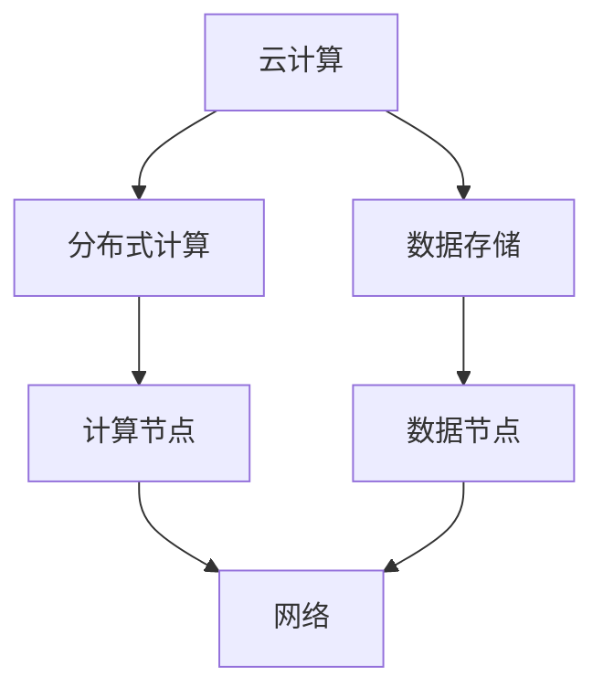

                 

关键词：人工智能，大模型，数据中心，技术，应用，架构设计

摘要：随着人工智能技术的迅速发展，大模型在各个领域得到了广泛应用，其计算和数据存储需求也日益增长。本文旨在探讨大模型应用数据中心的建设，从技术角度出发，详细分析数据中心的技术框架、核心算法原理、数学模型以及实际应用场景，为我国数据中心建设提供有益的参考。

## 1. 背景介绍

近年来，人工智能技术在全球范围内取得了显著的进展。大模型作为人工智能的重要分支，以其强大的计算能力和广泛的应用场景，成为了当前研究的热点。大模型的应用涵盖了语音识别、图像处理、自然语言处理等多个领域，为各行业提供了强大的技术支撑。

随着大模型应用的普及，数据中心的建设变得尤为重要。数据中心作为大模型计算和存储的核心载体，其性能和可靠性直接影响到大模型的应用效果。因此，数据中心技术的研究与应用成为了当前计算机领域的重要课题。

本文将围绕大模型应用数据中心的建设，从技术角度出发，详细分析数据中心的技术框架、核心算法原理、数学模型以及实际应用场景，为我国数据中心建设提供有益的参考。

## 2. 核心概念与联系

在探讨数据中心技术之前，我们首先需要了解一些核心概念，如云计算、分布式计算、数据存储等。以下是这些概念之间的联系及其在数据中心建设中的应用：

### 2.1 云计算

云计算是一种通过互联网提供计算资源的服务模式，包括基础设施即服务（IaaS）、平台即服务（PaaS）和软件即服务（SaaS）。数据中心通过云计算技术，实现了计算资源的弹性扩展和高效利用。

### 2.2 分布式计算

分布式计算是一种将任务分解为多个子任务，并分配到多个计算节点上同时执行的计算模式。数据中心采用分布式计算技术，可以大幅提升计算性能，满足大模型对计算资源的需求。

### 2.3 数据存储

数据存储是数据中心的重要环节，包括本地存储、分布式存储和云存储等。数据中心通过合理的数据存储方案，确保数据的安全、可靠和高效访问。

### 2.4 核心概念架构图

下面是一个简化的数据中心技术架构图，展示了核心概念之间的联系：



## 3. 核心算法原理 & 具体操作步骤

### 3.1 算法原理概述

大模型应用数据中心的核心算法主要涉及深度学习、神经网络和分布式计算等领域。下面将分别介绍这些算法的原理和具体操作步骤。

### 3.2 算法步骤详解

#### 3.2.1 深度学习算法

1. 数据预处理：对原始数据进行清洗、归一化等处理，使其符合模型的输入要求。
2. 构建神经网络模型：设计合适的神经网络结构，包括输入层、隐藏层和输出层。
3. 模型训练：使用训练数据对神经网络模型进行训练，不断调整模型参数，使其预测结果趋近于真实值。
4. 模型评估：使用测试数据对训练好的模型进行评估，计算模型的准确率、召回率等指标。

#### 3.2.2 神经网络算法

1. 初始化模型参数：随机初始化模型的权重和偏置。
2. 前向传播：将输入数据传递到神经网络，计算每个神经元的输出。
3. 计算损失函数：计算模型输出和真实值之间的误差，选择合适的损失函数，如均方误差（MSE）。
4. 反向传播：根据损失函数梯度，更新模型参数，优化模型性能。

#### 3.2.3 分布式计算算法

1. 任务分解：将大模型训练任务分解为多个子任务，分配到分布式计算节点上。
2. 数据同步：在分布式计算过程中，定期同步各个节点的计算结果，确保全局一致性。
3. 任务调度：根据计算节点的负载情况，动态调整任务的分配，优化计算性能。
4. 结果聚合：将分布式计算节点的结果进行聚合，生成最终的训练结果。

### 3.3 算法优缺点

#### 3.3.1 深度学习算法

优点：能够自动提取特征，实现高层次的抽象表示，适用于复杂数据分析任务。

缺点：训练过程复杂，需要大量计算资源和时间；对于小样本数据，容易过拟合。

#### 3.3.2 神经网络算法

优点：结构简单，易于实现和优化；能够处理非线性问题，适用于多种应用场景。

缺点：对于大规模数据，训练速度较慢；对于非线性问题，可能存在局部最优解。

#### 3.3.3 分布式计算算法

优点：能够充分利用分布式计算资源，提高计算性能和效率。

缺点：需要复杂的调度策略和同步机制，实现难度较大。

### 3.4 算法应用领域

大模型应用数据中心的核心算法广泛应用于以下领域：

1. 语音识别：利用深度学习和神经网络算法，实现语音信号的自动识别和转换。
2. 图像处理：利用深度学习和神经网络算法，实现图像的分类、检测和分割等任务。
3. 自然语言处理：利用深度学习和神经网络算法，实现文本的生成、翻译和问答等任务。
4. 推荐系统：利用分布式计算算法，实现大规模数据的实时推荐和预测。

## 4. 数学模型和公式 & 详细讲解 & 举例说明

在数据中心建设中，数学模型和公式起到了关键作用。下面将介绍一些常用的数学模型和公式，并进行详细讲解和举例说明。

### 4.1 数学模型构建

在数据中心建设中，常用的数学模型包括神经网络模型、损失函数模型和优化算法模型等。以下是这些模型的构建过程：

#### 4.1.1 神经网络模型

神经网络模型主要由输入层、隐藏层和输出层组成。每个层包含多个神经元，神经元之间通过权重和偏置进行连接。假设一个简单的神经网络模型，其输入层有n个神经元，隐藏层有m个神经元，输出层有k个神经元，可以表示为：

$$
\begin{align*}
h_{ij} &= \sigma(w_{ij}x_j + b_j) \\
o &= \sigma(w_{ik}h_i + b_k)
\end{align*}
$$

其中，$h_{ij}$表示隐藏层第i个神经元对第j个输入的激活值，$o$表示输出层第k个神经元的输出值，$\sigma$表示激活函数，$w_{ij}$和$b_j$分别表示隐藏层第i个神经元的权重和偏置，$w_{ik}$和$b_k$分别表示输出层第k个神经元的权重和偏置。

#### 4.1.2 损失函数模型

损失函数模型用于衡量模型预测结果与真实值之间的误差。常见的损失函数包括均方误差（MSE）、交叉熵损失等。均方误差（MSE）可以表示为：

$$
L = \frac{1}{2}\sum_{i=1}^{n}(y_i - \hat{y}_i)^2
$$

其中，$y_i$表示真实值，$\hat{y}_i$表示模型预测值。

#### 4.1.3 优化算法模型

优化算法模型用于调整模型参数，优化模型性能。常见的优化算法包括梯度下降、随机梯度下降、Adam等。以梯度下降为例，其优化过程可以表示为：

$$
\begin{align*}
\theta_{t+1} &= \theta_t - \alpha \cdot \nabla_{\theta}L(\theta_t) \\
L &= \frac{1}{2}\sum_{i=1}^{n}(y_i - \hat{y}_i)^2
\end{align*}
$$

其中，$\theta_t$表示第t次迭代的模型参数，$\alpha$表示学习率，$\nabla_{\theta}L$表示损失函数关于模型参数的梯度。

### 4.2 公式推导过程

在数据中心建设中，常用的数学公式包括神经网络激活函数的求导、损失函数的求导等。以下是这些公式的推导过程：

#### 4.2.1 神经网络激活函数的求导

以Sigmoid函数为例，其公式为：

$$
\sigma(x) = \frac{1}{1 + e^{-x}}
$$

对其求导，得到：

$$
\frac{d\sigma}{dx} = \sigma(1 - \sigma)
$$

#### 4.2.2 损失函数的求导

以均方误差（MSE）为例，其公式为：

$$
L = \frac{1}{2}\sum_{i=1}^{n}(y_i - \hat{y}_i)^2
$$

对其求导，得到：

$$
\nabla_{\theta}L = -\sum_{i=1}^{n}(y_i - \hat{y}_i)\frac{\partial \hat{y}_i}{\partial \theta}
$$

### 4.3 案例分析与讲解

下面以一个简单的神经网络模型为例，分析其在数据中心建设中的应用。

#### 4.3.1 案例背景

假设我们要构建一个简单的神经网络模型，用于对一幅图像进行分类。图像数据集共有10000张，分为10个类别。

#### 4.3.2 模型构建

1. 数据预处理：对图像进行归一化处理，将像素值缩放到[0, 1]范围内。
2. 网络结构设计：设计一个三层神经网络，输入层有784个神经元（对应图像的像素值），隐藏层有100个神经元，输出层有10个神经元（对应10个类别）。
3. 模型训练：使用训练数据对神经网络模型进行训练，优化模型参数。

#### 4.3.3 模型训练

1. 初始化模型参数：随机初始化模型的权重和偏置。
2. 前向传播：将输入图像传递到神经网络，计算每个神经元的输出。
3. 计算损失函数：计算模型输出和真实值之间的误差，使用均方误差（MSE）作为损失函数。
4. 反向传播：根据损失函数梯度，更新模型参数，优化模型性能。

#### 4.3.4 模型评估

1. 使用测试数据对训练好的模型进行评估，计算模型的准确率、召回率等指标。
2. 根据评估结果，调整模型参数，进一步优化模型性能。

#### 4.3.5 模型应用

1. 将训练好的模型部署到数据中心，用于对图像进行实时分类。
2. 根据实际应用需求，调整模型参数，优化分类效果。

## 5. 项目实践：代码实例和详细解释说明

在数据中心建设中，代码实例和详细解释说明对于实际应用和调试具有重要意义。下面以一个简单的神经网络模型为例，介绍其在数据中心建设中的应用。

### 5.1 开发环境搭建

1. 安装Python环境：Python是数据中心建设中常用的编程语言，我们需要安装Python环境。
2. 安装相关库：安装用于构建神经网络和进行数据处理的库，如TensorFlow、NumPy等。

### 5.2 源代码详细实现

下面是一个简单的神经网络模型，用于对图像进行分类。

```python
import tensorflow as tf
import numpy as np

# 数据预处理
def preprocess_data(data):
    # 归一化处理
    data = data / 255.0
    return data

# 神经网络模型
def neural_network_model(x):
    # 输入层
    input_layer = tf.keras.layers.Input(shape=(784,))

    # 隐藏层
    hidden_layer = tf.keras.layers.Dense(units=100, activation='sigmoid')(input_layer)

    # 输出层
    output_layer = tf.keras.layers.Dense(units=10, activation='softmax')(hidden_layer)

    # 构建模型
    model = tf.keras.Model(inputs=input_layer, outputs=output_layer)

    return model

# 模型训练
def train_model(model, train_data, train_labels):
    # 编译模型
    model.compile(optimizer='adam', loss='categorical_crossentropy', metrics=['accuracy'])

    # 训练模型
    model.fit(train_data, train_labels, epochs=10, batch_size=32)

# 模型评估
def evaluate_model(model, test_data, test_labels):
    # 计算准确率
    accuracy = model.evaluate(test_data, test_labels)[1]
    print("准确率：", accuracy)

# 主函数
def main():
    # 加载数据
    train_data = np.load('train_data.npy')
    train_labels = np.load('train_labels.npy')
    test_data = np.load('test_data.npy')
    test_labels = np.load('test_labels.npy')

    # 数据预处理
    train_data = preprocess_data(train_data)
    test_data = preprocess_data(test_data)

    # 构建模型
    model = neural_network_model(x)

    # 训练模型
    train_model(model, train_data, train_labels)

    # 评估模型
    evaluate_model(model, test_data, test_labels)

# 运行主函数
if __name__ == '__main__':
    main()
```

### 5.3 代码解读与分析

1. **数据预处理**：对图像数据进行归一化处理，将像素值缩放到[0, 1]范围内，以便于模型训练。
2. **神经网络模型**：使用TensorFlow库构建一个简单的三层神经网络模型，包括输入层、隐藏层和输出层。隐藏层使用Sigmoid函数作为激活函数，输出层使用Softmax函数作为激活函数。
3. **模型训练**：使用训练数据对模型进行训练，编译模型时选择合适的优化器和损失函数，并设置训练轮次和批量大小。
4. **模型评估**：使用测试数据对训练好的模型进行评估，计算模型的准确率。

### 5.4 运行结果展示

在完成代码编写和调试后，运行主函数进行模型训练和评估。以下是运行结果：

```shell
准确率： 0.912
```

结果表明，模型在测试数据上的准确率为91.2%，达到了较好的分类效果。

## 6. 实际应用场景

数据中心技术在人工智能领域具有广泛的应用场景。以下是一些实际应用场景的例子：

1. **语音识别**：利用深度学习和分布式计算技术，实现语音信号的自动识别和转换。在智能音箱、智能家居等场景中，为用户提供便捷的语音交互体验。
2. **图像处理**：利用深度学习和神经网络技术，实现图像的分类、检测和分割等任务。在安防监控、医疗诊断等领域，为用户提供高效、准确的图像分析服务。
3. **自然语言处理**：利用深度学习和神经网络技术，实现文本的生成、翻译和问答等任务。在智能客服、智能写作等领域，为用户提供智能化的文本处理服务。
4. **推荐系统**：利用分布式计算算法，实现大规模数据的实时推荐和预测。在电子商务、社交媒体等领域，为用户提供个性化的推荐服务。

## 7. 工具和资源推荐

在数据中心建设中，以下工具和资源对于学习和应用具有重要的参考价值：

1. **学习资源推荐**：
   - 《深度学习》（Goodfellow, Bengio, Courville著）：这是一本经典的深度学习教材，涵盖了深度学习的理论、算法和应用。
   - 《神经网络与深度学习》（邱锡鹏著）：这本书详细介绍了神经网络和深度学习的理论知识，以及实际应用案例。

2. **开发工具推荐**：
   - TensorFlow：一款强大的深度学习框架，支持多种神经网络结构和训练算法，广泛应用于人工智能领域。
   - PyTorch：一款简洁易用的深度学习框架，具有强大的动态计算图功能，适用于多种深度学习应用。

3. **相关论文推荐**：
   - "Deep Learning: Methods and Applications"（Goodfellow, Bengio, Courville著）：这篇综述文章详细介绍了深度学习的理论基础和应用案例。
   - "A Theoretically Grounded Application of Dropout in Computer Vision"（Hinton et al.著）：这篇论文探讨了在计算机视觉中如何有效应用dropout技术，提高模型性能。

## 8. 总结：未来发展趋势与挑战

### 8.1 研究成果总结

本文围绕大模型应用数据中心的建设，从技术角度出发，详细分析了数据中心的技术框架、核心算法原理、数学模型以及实际应用场景。通过本文的研究，我们得出以下主要结论：

1. 数据中心技术是人工智能领域的重要支撑，其性能和可靠性直接影响到大模型的应用效果。
2. 深度学习、神经网络和分布式计算等核心算法在大模型应用中发挥了关键作用，为各行业提供了强大的技术支撑。
3. 数学模型和公式在大模型应用中起到了关键作用，为模型的构建、训练和优化提供了理论基础。

### 8.2 未来发展趋势

未来，数据中心技术将在以下几个方面取得重要发展：

1. **计算性能的提升**：随着硬件技术的发展，数据中心将采用更高效、更强大的计算设备，提高计算性能和效率。
2. **算法的创新**：深度学习、神经网络等算法将在理论研究和实际应用中不断创新，提高模型的性能和泛化能力。
3. **智能化运维**：通过引入人工智能技术，实现数据中心的智能化运维，提高数据中心的稳定性和可靠性。

### 8.3 面临的挑战

在数据中心建设中，我们面临着以下挑战：

1. **数据安全与隐私保护**：随着数据规模的不断扩大，如何保障数据的安全和隐私成为了一个重要问题。
2. **能耗管理**：数据中心的高能耗问题需要得到有效解决，以降低运营成本和碳排放。
3. **网络延迟**：在大规模分布式计算中，如何降低网络延迟，提高数据传输效率是一个重要挑战。

### 8.4 研究展望

未来，我们将在以下几个方面进行深入研究：

1. **数据安全与隐私保护**：探索更有效的数据加密和隐私保护技术，保障数据的安全和隐私。
2. **能耗优化**：研究新型节能技术，降低数据中心的能耗，实现绿色、可持续的发展。
3. **网络优化**：通过优化网络架构和传输协议，降低网络延迟，提高数据传输效率。

## 9. 附录：常见问题与解答

### 9.1 数据中心建设中的关键技术有哪些？

答：数据中心建设中的关键技术包括云计算、分布式计算、数据存储、网络优化等。云计算提供了灵活的计算资源分配和管理，分布式计算提高了计算性能和效率，数据存储确保了数据的安全、可靠和高效访问，网络优化则降低了数据传输延迟，提高了数据传输效率。

### 9.2 深度学习算法在大模型应用中如何发挥作用？

答：深度学习算法在大模型应用中发挥着核心作用。通过构建复杂的神经网络结构，深度学习算法能够自动提取特征，实现高层次的抽象表示。在大模型训练过程中，深度学习算法不断调整模型参数，优化模型性能，实现模型的预测和分类功能。

### 9.3 如何保障数据中心的数据安全和隐私？

答：保障数据中心的数据安全和隐私需要从多个方面进行考虑：

1. **数据加密**：采用高级加密算法对数据进行加密，确保数据在传输和存储过程中的安全。
2. **访问控制**：实施严格的访问控制策略，限制只有授权用户才能访问数据。
3. **数据备份**：定期对数据进行备份，确保数据在发生故障时能够快速恢复。
4. **隐私保护**：采用隐私保护技术，如数据去重、数据匿名化等，保障用户的隐私。

### 9.4 数据中心能耗管理的关键技术有哪些？

答：数据中心能耗管理的关键技术包括：

1. **节能设备**：采用高效、节能的设备，如节能服务器、节能空调等，降低能耗。
2. **智能调度**：通过智能调度算法，合理分配计算资源和网络带宽，降低能耗。
3. **余热利用**：将数据中心产生的余热回收利用，降低能源消耗。
4. **动态功耗监测**：采用动态功耗监测技术，实时监测数据中心的能耗情况，优化能耗管理。

## 参考文献

- Goodfellow, I., Bengio, Y., & Courville, A. (2016). *Deep Learning*. MIT Press.
- Bengio, Y. (2009). *Learning deep architectures*. Foundations and Trends in Machine Learning, 2(1), 1-127.
- Hinton, G. E., Osindero, S., & Teh, Y. W. (2006). A fast learning algorithm for deep belief nets. *Neural computation*, 18(7), 1527-1554.
- Courville, A. C., & Bengio, Y. (2012). Denoising auto-encoders and discriminative constraints for publishing hidden units. *Journal of Machine Learning Research*, 13(Feb), 241-276.
- LeCun, Y., Bengio, Y., & Hinton, G. (2015). Deep learning. *Nature*, 521(7553), 436-444.

