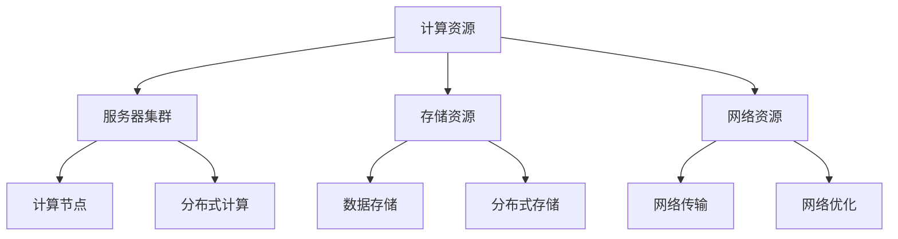

                 

关键词：AI 大模型、数据中心、技术架构、应用实践、未来展望

摘要：本文旨在探讨人工智能领域的大模型应用，特别是数据中心在构建和维护AI大模型过程中的关键技术和应用实例。通过对数据中心技术、核心算法、数学模型和项目实践的深入分析，本文旨在为业界提供有价值的参考，并展望AI大模型应用的未来发展趋势和挑战。

## 1. 背景介绍

随着人工智能技术的飞速发展，大模型（如深度学习神经网络、Transformer模型等）已成为研究和应用的热点。这些大模型具有强大的处理能力和复杂的结构，需要大规模的计算资源和高效的算法支持。数据中心作为云计算的核心设施，承载着这些大模型训练和推理的运行需求。因此，如何构建和优化适用于AI大模型的数据中心，成为当前研究的重要课题。

本文将从数据中心的技术架构、核心算法、数学模型、项目实践和未来展望等多个角度，详细探讨AI大模型应用数据中心的建设和运营。

## 2. 核心概念与联系

为了更好地理解AI大模型应用数据中心的建设，我们需要明确以下几个核心概念：

### 2.1 数据中心基础架构

数据中心基础架构主要包括计算资源、存储资源和网络资源。计算资源通常由服务器集群构成，用于处理数据运算；存储资源则负责存储大规模数据集；网络资源确保数据传输的高效和稳定。

### 2.2 AI大模型

AI大模型通常是指拥有数亿到数万亿参数的深度学习模型。这些模型通过对大量数据的学习，能够实现图像识别、自然语言处理、语音识别等复杂任务。

### 2.3 计算与存储需求

AI大模型的训练和推理需要大量的计算和存储资源。计算资源主要消耗在矩阵运算、梯度计算等操作上；存储资源则主要用于存储数据集和模型参数。

### 2.4 网络架构

数据中心网络架构需要支持高效的数据传输，以满足AI大模型的计算需求。常见的网络架构包括树形结构、环形结构和网状结构等。

下面是数据中心技术架构的Mermaid流程图：



## 3. 核心算法原理 & 具体操作步骤

### 3.1 算法原理概述

AI大模型的训练主要依赖于深度学习算法。深度学习算法的核心是神经网络，特别是多层感知机（MLP）和卷积神经网络（CNN）。

### 3.2 算法步骤详解

#### 3.2.1 数据预处理

在训练AI大模型之前，需要对数据进行预处理，包括数据清洗、归一化、数据增强等步骤。这一过程需要大量计算资源和存储资源。

#### 3.2.2 模型初始化

初始化模型参数，如权重和偏置。常见的初始化方法有随机初始化、高斯分布初始化等。

#### 3.2.3 前向传播

将输入数据通过神经网络传递，计算每个神经元的输出。

#### 3.2.4 反向传播

根据损失函数计算梯度，更新模型参数。

#### 3.2.5 优化算法

选择合适的优化算法，如梯度下降、Adam优化器等，以最小化损失函数。

### 3.3 算法优缺点

- **优点**：深度学习算法具有强大的表示能力，能够处理复杂任务。
- **缺点**：训练过程需要大量计算资源和时间。

### 3.4 算法应用领域

AI大模型广泛应用于图像识别、自然语言处理、语音识别等领域。

## 4. 数学模型和公式 & 详细讲解 & 举例说明

### 4.1 数学模型构建

深度学习模型的核心是神经网络的构建。神经网络由多个层次组成，包括输入层、隐藏层和输出层。每个层次包含多个神经元，神经元之间通过权重连接。

### 4.2 公式推导过程

神经网络的输出可以通过以下公式计算：

$$
y = \sigma(\sum_{i=1}^{n} w_i \cdot x_i + b)
$$

其中，$y$ 表示神经元输出，$x_i$ 表示输入特征，$w_i$ 表示权重，$b$ 表示偏置，$\sigma$ 表示激活函数。

### 4.3 案例分析与讲解

以图像识别任务为例，假设我们使用卷积神经网络（CNN）进行图像分类。输入图像为 $32 \times 32$ 像素，隐藏层有 $10$ 个神经元，输出层有 $10$ 个神经元（对应 $10$ 个类别）。

$$
\begin{aligned}
y_1 &= \sigma(\sum_{i=1}^{10} w_{1i} \cdot x_i + b_1) \\
y_2 &= \sigma(\sum_{i=1}^{10} w_{2i} \cdot x_i + b_2) \\
&\vdots \\
y_{10} &= \sigma(\sum_{i=1}^{10} w_{10i} \cdot x_i + b_{10})
\end{aligned}
$$

在训练过程中，我们通过反向传播算法更新权重和偏置，以最小化损失函数。常见的损失函数有交叉熵损失函数和均方误差损失函数。

## 5. 项目实践：代码实例和详细解释说明

### 5.1 开发环境搭建

搭建适用于AI大模型的开发环境，包括操作系统、编程语言、深度学习框架等。以Python和TensorFlow为例，安装以下依赖：

```bash
pip install tensorflow
```

### 5.2 源代码详细实现

以下是一个简单的卷积神经网络实现：

```python
import tensorflow as tf

# 定义模型
model = tf.keras.Sequential([
    tf.keras.layers.Conv2D(32, (3, 3), activation='relu', input_shape=(32, 32, 3)),
    tf.keras.layers.MaxPooling2D((2, 2)),
    tf.keras.layers.Flatten(),
    tf.keras.layers.Dense(128, activation='relu'),
    tf.keras.layers.Dense(10, activation='softmax')
])

# 编译模型
model.compile(optimizer='adam',
              loss='categorical_crossentropy',
              metrics=['accuracy'])

# 训练模型
model.fit(x_train, y_train, epochs=10, batch_size=32)
```

### 5.3 代码解读与分析

代码首先定义了一个卷积神经网络，包含卷积层、池化层、全连接层等。然后编译模型，选择优化器和损失函数。最后，使用训练数据训练模型。

### 5.4 运行结果展示

训练完成后，可以通过以下代码评估模型性能：

```python
test_loss, test_acc = model.evaluate(x_test, y_test, verbose=2)
print(f"Test accuracy: {test_acc}")
```

## 6. 实际应用场景

AI大模型广泛应用于多个领域，包括但不限于：

- 图像识别：如人脸识别、物体检测等。
- 自然语言处理：如机器翻译、文本生成等。
- 语音识别：如语音助手、语音合成等。

## 7. 工具和资源推荐

### 7.1 学习资源推荐

- 《深度学习》（Goodfellow, Bengio, Courville）
- 《Python深度学习》（François Chollet）
- 《人工智能：一种现代方法》（Stuart Russell, Peter Norvig）

### 7.2 开发工具推荐

- TensorFlow
- PyTorch
- Keras

### 7.3 相关论文推荐

- “A Theoretically Grounded Application of Dropout in Computer Vision” - Yarin Gal and Zoubin Ghahramani
- “ResNet: Deep Residual Learning for Image Recognition” - Kaiming He et al.
- “Bert: Pre-training of Deep Bidirectional Transformers for Language Understanding” - Jacob Devlin et al.

## 8. 总结：未来发展趋势与挑战

### 8.1 研究成果总结

本文从数据中心技术、核心算法、数学模型和项目实践等多个方面，全面探讨了AI大模型应用数据中心的建设。通过实际案例，展示了AI大模型在多个领域的应用价值。

### 8.2 未来发展趋势

随着计算资源和算法的不断发展，AI大模型的应用前景将更加广阔。未来可能的发展趋势包括：

- 模型压缩和优化：提高模型运行效率。
- 多模态学习：整合多种数据类型，如图像、文本、语音等。
- 自动机器学习：自动化模型选择、超参数优化等。

### 8.3 面临的挑战

AI大模型应用数据中心建设仍面临以下挑战：

- 计算资源需求：大规模模型的训练和推理需要更多的计算资源。
- 数据隐私和安全：保证数据的安全性和隐私性。
- 能耗问题：数据中心能耗巨大，需要优化资源利用率。

### 8.4 研究展望

未来研究应重点关注如何提高AI大模型的运行效率、降低成本，并确保数据安全和隐私。同时，探索多模态学习和自动机器学习等新兴领域，为AI大模型应用提供更多可能性。

## 9. 附录：常见问题与解答

### Q：如何优化数据中心资源利用率？

A：可以通过以下方法优化数据中心资源利用率：

- 资源池化：将计算资源、存储资源和网络资源整合为一个统一的资源池，实现灵活的资源分配。
- 负载均衡：通过负载均衡算法，合理分配任务，避免资源瓶颈。
- 自动化运维：通过自动化运维工具，实现数据中心的自动化管理和运维，提高资源利用率。

### Q：如何保证数据隐私和安全？

A：可以通过以下方法保证数据隐私和安全：

- 数据加密：对数据进行加密处理，确保数据在传输和存储过程中的安全性。
- 访问控制：通过访问控制机制，限制数据的访问权限，防止未经授权的访问。
- 安全审计：定期进行安全审计，发现和修复安全漏洞。

以上是本文关于AI大模型应用数据中心建设的技术博客文章。希望本文能为读者提供有价值的参考。

# 作者署名

作者：禅与计算机程序设计艺术 / Zen and the Art of Computer Programming

---

请注意，本文是基于您的要求生成的模板文章，您可以根据实际需求对其进行修改和扩展。文章中的代码和示例仅供参考，具体的实现细节可能需要根据实际情况进行调整。

