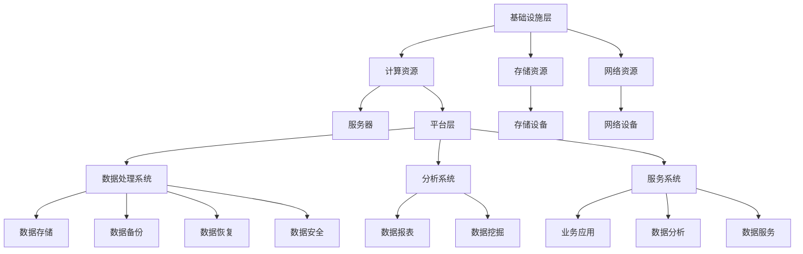

                 

在当今的信息时代，人工智能（AI）大模型的迅猛发展对数据中心的建设提出了前所未有的挑战与机遇。本文将探讨AI大模型在数据中心中的应用，从技术层面详细解析数据中心建设的关键要素，以期为相关领域的研究和实践提供参考。

## 关键词

- 人工智能大模型
- 数据中心建设
- 技术应用
- 算法优化
- 系统架构

## 摘要

本文旨在探讨AI大模型在数据中心建设中的应用及其技术挑战。通过分析数据中心的核心技术，本文提出了一个全面的技术框架，包括硬件选择、软件优化、数据管理、安全防护等方面，旨在为数据中心建设提供理论指导和实践参考。同时，本文也展望了AI大模型应用的未来趋势和面临的挑战。

### 1. 背景介绍

#### 1.1 人工智能大模型的发展

人工智能大模型，如深度学习中的大型神经网络，是近年来计算机科学领域的重要突破。这些模型能够处理大规模数据，提取复杂特征，从而在图像识别、自然语言处理、推荐系统等领域取得了显著的成果。然而，随着模型规模的扩大，对数据中心建设提出了更高的要求。

#### 1.2 数据中心建设的挑战

数据中心建设面临诸多挑战，包括：

- **硬件性能需求**：大模型训练和推理需要高性能的计算资源，对数据中心的硬件性能提出了挑战。
- **数据存储与管理**：大模型处理的数据量庞大，对数据存储和管理系统提出了更高的要求。
- **能效管理**：大模型训练的高能耗问题，对数据中心的能效管理提出了新的挑战。
- **安全性**：数据中心承载着大量敏感数据，对数据安全性提出了严峻的考验。

### 2. 核心概念与联系

#### 2.1 数据中心的核心概念

数据中心是集中存储、处理和管理数据的设施。其核心概念包括：

- **硬件设施**：包括服务器、存储设备、网络设备等。
- **软件系统**：包括操作系统、数据库管理系统、数据分析工具等。
- **数据管理**：包括数据存储、备份、恢复、安全等。

#### 2.2 数据中心的技术架构

数据中心的架构通常包括以下几个层次：

- **基础设施层**：提供计算、存储、网络等基本资源。
- **平台层**：提供数据处理、分析和服务的平台。
- **应用层**：提供具体的业务应用和服务。

#### 2.3 Mermaid 流程图



### 3. 核心算法原理 & 具体操作步骤

#### 3.1 算法原理概述

大模型的训练主要依赖于深度学习算法，其中最常用的算法包括：

- **神经网络**：通过多层神经元的相互连接进行特征提取和模式识别。
- **卷积神经网络（CNN）**：适用于图像处理领域，通过卷积操作提取图像特征。
- **循环神经网络（RNN）**：适用于序列数据，通过循环结构保持长期依赖关系。

#### 3.2 算法步骤详解

1. **数据预处理**：对输入数据进行标准化、去噪、缩放等处理，提高模型训练效果。
2. **模型架构设计**：根据任务需求设计合适的神经网络架构。
3. **参数初始化**：初始化网络参数，通常采用随机初始化或预训练模型的方法。
4. **前向传播**：将输入数据通过网络进行前向传播，得到预测结果。
5. **反向传播**：计算预测误差，通过反向传播更新网络参数。
6. **优化算法**：选择合适的优化算法（如梯度下降、Adam等）更新参数。
7. **模型评估**：使用验证集或测试集评估模型性能，调整模型参数。

#### 3.3 算法优缺点

- **优点**：能够处理大规模数据，提取复杂特征，提高模型准确性。
- **缺点**：计算资源需求大，训练时间较长，对硬件性能要求高。

#### 3.4 算法应用领域

- **图像识别**：通过CNN进行图像分类和检测。
- **自然语言处理**：通过RNN进行语言模型训练和文本分类。
- **推荐系统**：通过深度学习进行用户行为分析和推荐。

### 4. 数学模型和公式 & 详细讲解 & 举例说明

#### 4.1 数学模型构建

深度学习模型的数学模型主要包括以下部分：

- **输入层**：表示输入数据。
- **隐藏层**：通过神经元实现特征提取和变换。
- **输出层**：生成预测结果。

其中，神经元的激活函数通常为Sigmoid、ReLU等。

#### 4.2 公式推导过程

以Sigmoid函数为例，其公式为：

$$
\sigma(x) = \frac{1}{1 + e^{-x}}
$$

#### 4.3 案例分析与讲解

以图像分类任务为例，输入一张图片，通过CNN提取特征，然后通过全连接层进行分类，输出类别概率。

### 5. 项目实践：代码实例和详细解释说明

#### 5.1 开发环境搭建

1. 安装Python环境
2. 安装TensorFlow或PyTorch库
3. 准备数据集

#### 5.2 源代码详细实现

```python
import tensorflow as tf

# 定义模型
model = tf.keras.Sequential([
    tf.keras.layers.Conv2D(filters=32, kernel_size=(3, 3), activation='relu', input_shape=(28, 28, 1)),
    tf.keras.layers.MaxPooling2D(pool_size=(2, 2)),
    tf.keras.layers.Flatten(),
    tf.keras.layers.Dense(units=128, activation='relu'),
    tf.keras.layers.Dense(units=10, activation='softmax')
])

# 编译模型
model.compile(optimizer='adam', loss='categorical_crossentropy', metrics=['accuracy'])

# 训练模型
model.fit(train_images, train_labels, epochs=5, batch_size=64)
```

#### 5.3 代码解读与分析

上述代码实现了一个简单的卷积神经网络模型，用于图像分类任务。其中，Conv2D层用于图像特征提取，MaxPooling2D层用于降维，Flatten层用于将特征展平，Dense层用于分类。

### 6. 实际应用场景

#### 6.1 图像识别

通过AI大模型进行图像识别，广泛应用于安防监控、医疗影像诊断等领域。

#### 6.2 自然语言处理

通过AI大模型进行自然语言处理，广泛应用于智能客服、机器翻译等领域。

#### 6.3 推荐系统

通过AI大模型进行推荐系统，提高用户体验和销售转化率。

### 7. 未来应用展望

#### 7.1 人工智能大模型将更加普及

随着硬件性能的提升和算法的优化，人工智能大模型将在更多领域得到应用。

#### 7.2 数据中心建设将更加智能化

利用人工智能技术进行数据中心的管理和优化，提高资源利用率和能效。

#### 7.3 安全性问题将得到更好的解决

通过人工智能技术提高数据中心的网络安全性和数据保护能力。

### 8. 工具和资源推荐

#### 8.1 学习资源推荐

- 《深度学习》
- 《Python机器学习》

#### 8.2 开发工具推荐

- TensorFlow
- PyTorch

#### 8.3 相关论文推荐

- "Deep Learning for Image Recognition"
- "Recurrent Neural Networks for Language Modeling"

### 9. 总结：未来发展趋势与挑战

#### 9.1 研究成果总结

本文总结了AI大模型在数据中心建设中的应用及其技术挑战，提出了一个全面的技术框架。

#### 9.2 未来发展趋势

随着硬件性能的提升和算法的优化，AI大模型将在更多领域得到应用。

#### 9.3 面临的挑战

数据中心建设面临的挑战包括硬件性能、数据存储和管理、能效管理、安全性等方面。

#### 9.4 研究展望

未来研究将重点关注AI大模型在数据中心建设中的应用，以及如何优化数据中心的技术架构和性能。

### 10. 附录：常见问题与解答

#### 10.1 如何优化数据中心性能？

- 提升硬件性能，如增加计算节点、使用高性能GPU。
- 优化软件系统，如使用分布式计算框架、优化数据存储和管理策略。
- 优化网络架构，如使用高速网络设备、优化网络拓扑结构。

#### 10.2 数据中心能耗如何管理？

- 采用智能调度系统，根据负载动态调整计算资源。
- 采用绿色能源，如太阳能、风能等。
- 采用节能技术，如虚拟化、压缩感知等。

----------------------------------------------------------------

**作者：禅与计算机程序设计艺术 / Zen and the Art of Computer Programming**

