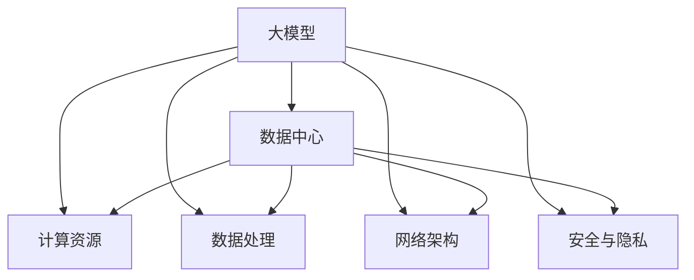

                 

关键词：AI 大模型，数据中心，技术创新，架构设计，数学模型，项目实践

摘要：随着人工智能技术的快速发展，大模型的应用需求日益增长。本文将探讨如何通过数据中心技术创新，构建高效稳定的大模型应用环境。我们将详细解析大模型的核心概念与联系，探讨核心算法原理与操作步骤，介绍数学模型和公式，并通过实际项目实践展示如何将理论应用于实践。同时，我们将探讨大模型在实际应用场景中的重要性，并展望其未来的发展趋势与挑战。

## 1. 背景介绍

近年来，人工智能（AI）技术取得了显著的进展，尤其是大模型的崛起。大模型，如GPT、BERT等，通过处理大量数据，实现了前所未有的性能表现。然而，大模型的应用不仅需要强大的计算资源，还需要高效稳定的数据处理和管理能力。数据中心作为数据存储、计算和传输的核心设施，成为了大模型应用的关键支撑。

数据中心的建设和运营面临着诸多挑战。首先，随着大模型的应用需求增长，数据中心的计算能力和存储容量需求急剧增加。其次，大模型的训练和推理过程对数据处理速度和稳定性提出了极高的要求。最后，数据安全和隐私保护也是数据中心建设中的重要考虑因素。

本文旨在探讨如何通过数据中心技术创新，解决大模型应用中的关键问题。我们将从核心概念、算法原理、数学模型、项目实践等多个角度展开讨论，以期为数据中心建设提供有价值的参考。

## 2. 核心概念与联系

在深入探讨数据中心技术创新之前，我们需要明确大模型的核心概念及其相互联系。

### 2.1 大模型

大模型是指具有海量参数的深度神经网络模型，如GPT、BERT等。这些模型通过大规模数据处理，可以自动学习并提取复杂的知识结构，从而实现高水平的表现。

### 2.2 数据中心

数据中心是集数据存储、计算、网络和安全管理于一体的综合性设施。其核心功能是为大模型提供高效的计算和存储环境，保障数据的安全性和可靠性。

### 2.3 计算资源

计算资源是数据中心的核心组成部分，包括CPU、GPU、TPU等硬件设备。这些设备负责执行大模型的训练和推理任务，是数据中心性能的关键因素。

### 2.4 数据处理

数据处理是指对大量数据进行收集、存储、处理和分析的过程。在大模型应用中，高效的数据处理能力是确保模型性能的重要因素。

### 2.5 网络架构

网络架构是指数据中心内部和外部的网络连接方式。合理的网络架构可以提高数据传输速度，降低网络延迟，从而提升大模型的应用性能。

### 2.6 安全与隐私

安全与隐私是大模型应用中的重要问题。数据中心需要采取有效的安全措施，确保数据不被未经授权的访问和篡改，同时保护用户的隐私。

### 2.7 核心概念联系

大模型、数据中心、计算资源、数据处理、网络架构和安全与隐私之间存在紧密的联系。数据中心为大模型提供计算和存储资源，数据处理为模型训练和推理提供支持，网络架构保障数据传输的效率，而安全与隐私保护则确保数据的安全性和用户的隐私。

为了更直观地理解这些核心概念之间的联系，我们可以使用Mermaid流程图进行展示：



## 3. 核心算法原理 & 具体操作步骤

### 3.1 算法原理概述

大模型的核心算法通常基于深度学习技术，其中最常用的算法包括变换器（Transformer）和递归神经网络（RNN）。变换器模型通过多头自注意力机制，实现了对输入数据的全局上下文理解，而RNN模型则通过递归结构，实现了对时间序列数据的建模。

在本节中，我们将重点介绍变换器模型的原理和操作步骤。

### 3.2 算法步骤详解

变换器模型由编码器（Encoder）和解码器（Decoder）组成。编码器负责对输入数据进行编码，解码器则根据编码后的数据生成输出。

#### 3.2.1 编码器

编码器的核心是多头自注意力机制，其操作步骤如下：

1. **输入嵌入（Input Embedding）**：将输入序列转换为高维向量。
2. **多头自注意力（Multi-Head Self-Attention）**：对输入序列的每个位置进行自注意力计算，提取不同位置之间的相关性。
3. **前馈网络（Feed Forward Network）**：对自注意力结果进行进一步处理，增加模型的非线性能力。

#### 3.2.2 解码器

解码器的操作步骤与编码器类似，但加入了多头交叉注意力机制，以考虑编码器的输出。

1. **输入嵌入（Input Embedding）**：将输入序列转换为高维向量。
2. **多头自注意力（Multi-Head Self-Attention）**：对输入序列的每个位置进行自注意力计算，提取不同位置之间的相关性。
3. **多头交叉注意力（Multi-Head Cross-Attention）**：将编码器的输出与解码器的输入进行交叉注意力计算，实现编码器和解码器之间的信息交互。
4. **前馈网络（Feed Forward Network）**：对交叉注意力结果进行进一步处理，增加模型的非线性能力。

### 3.3 算法优缺点

变换器模型具有以下优点：

1. **强大的上下文理解能力**：通过多头自注意力机制，变换器模型能够捕获输入数据的全局上下文信息。
2. **高效的并行计算**：变换器模型的结构使得其可以高效地并行计算，从而加速模型的训练和推理过程。

然而，变换器模型也存在一定的缺点：

1. **计算复杂度高**：由于需要多次计算自注意力和交叉注意力，变换器模型的计算复杂度较高，对计算资源的需求较大。
2. **训练时间较长**：变换器模型的训练时间较长，尤其是在处理大规模数据集时。

### 3.4 算法应用领域

变换器模型在自然语言处理（NLP）、计算机视觉（CV）等多个领域取得了显著的成果。以下是一些具体的应用实例：

1. **自然语言处理**：变换器模型在机器翻译、文本生成、情感分析等任务中表现出色，如Google的BERT模型在多个NLP任务上取得了SOTA（State-of-the-Art）的表现。
2. **计算机视觉**：变换器模型在图像分类、目标检测、图像生成等任务中也有广泛应用，如OpenAI的DALL-E模型可以生成高质量的图像。

## 4. 数学模型和公式

在深度学习模型中，数学模型和公式起着至关重要的作用。以下我们将介绍大模型中常用的数学模型和公式，并进行详细讲解。

### 4.1 数学模型构建

变换器模型的核心数学模型包括线性变换、激活函数、损失函数等。

#### 4.1.1 线性变换

线性变换是将一个向量映射到另一个向量，其数学公式如下：

\[ Y = X \cdot W + b \]

其中，\( X \) 是输入向量，\( W \) 是权重矩阵，\( b \) 是偏置项。

#### 4.1.2 激活函数

激活函数用于引入非线性，常见的激活函数包括ReLU、Sigmoid和Tanh等。

1. **ReLU函数**：

\[ f(x) = \max(0, x) \]

2. **Sigmoid函数**：

\[ f(x) = \frac{1}{1 + e^{-x}} \]

3. **Tanh函数**：

\[ f(x) = \frac{e^x - e^{-x}}{e^x + e^{-x}} \]

#### 4.1.3 损失函数

损失函数用于衡量模型预测值与真实值之间的差距，常见的损失函数包括均方误差（MSE）和交叉熵（CE）等。

1. **均方误差（MSE）**：

\[ L = \frac{1}{n} \sum_{i=1}^{n} (y_i - \hat{y}_i)^2 \]

其中，\( y_i \) 是真实值，\( \hat{y}_i \) 是预测值。

2. **交叉熵（CE）**：

\[ L = - \sum_{i=1}^{n} y_i \cdot \log(\hat{y}_i) \]

### 4.2 公式推导过程

以下我们将对变换器模型中的多头自注意力机制进行推导。

#### 4.2.1 自注意力机制

自注意力机制通过计算输入序列中每个位置之间的相关性，实现对输入数据的全局理解。其公式如下：

\[ \text{Attention}(Q, K, V) = \frac{QK^T}{\sqrt{d_k}} \odot V \]

其中，\( Q, K, V \) 分别是查询向量、键向量和值向量，\( d_k \) 是键向量的维度，\( \odot \) 表示逐元素乘法。

#### 4.2.2 多头自注意力

多头自注意力通过并行计算多个自注意力机制，实现对输入数据的更高层次的理解。其公式如下：

\[ \text{MultiHead}(Q, K, V) = \text{Concat}(\text{head}_1, ..., \text{head}_H)W^O \]

其中，\( \text{head}_h = \text{Attention}(QW_h^Q, KW_h^K, VW_h^V) \)，\( W_h^Q, W_h^K, W_h^V, W_h^O \) 分别是查询、键、值和输出权重矩阵，\( W^O \) 是输出权重矩阵。

### 4.3 案例分析与讲解

以下我们将通过一个具体的案例，展示如何使用变换器模型进行文本分类任务。

#### 4.3.1 数据集

我们使用一个包含新闻文章的数据集，数据集分为训练集和测试集。

#### 4.3.2 数据预处理

1. **分词**：将文本进行分词，生成词序列。
2. **嵌入**：将词序列转换为词向量。
3. **序列填充**：将所有序列填充为相同的长度。

#### 4.3.3 模型构建

我们使用PyTorch构建一个变换器模型，其结构如下：

```python
import torch
import torch.nn as nn
import torch.optim as optim

class Transformer(nn.Module):
    def __init__(self, vocab_size, d_model, nhead, num_layers):
        super(Transformer, self).__init__()
        self.embedding = nn.Embedding(vocab_size, d_model)
        self.transformer = nn.Transformer(d_model, nhead, num_layers)
        self.fc = nn.Linear(d_model, 1)
        
    def forward(self, src, tgt):
        src = self.embedding(src)
        tgt = self.embedding(tgt)
        out = self.transformer(src, tgt)
        out = self.fc(out.mean(dim=1))
        return out
```

#### 4.3.4 模型训练

1. **数据加载**：使用PyTorch DataLoader加载训练集和测试集。
2. **模型训练**：使用Adam优化器和交叉熵损失函数进行模型训练。
3. **模型评估**：在测试集上评估模型性能。

```python
model = Transformer(vocab_size, d_model, nhead, num_layers)
optimizer = optim.Adam(model.parameters(), lr=0.001)
criterion = nn.BCEWithLogitsLoss()

for epoch in range(num_epochs):
    for src, tgt in train_loader:
        optimizer.zero_grad()
        out = model(src, tgt)
        loss = criterion(out, tgt)
        loss.backward()
        optimizer.step()

    with torch.no_grad():
        correct = 0
        total = 0
        for src, tgt in test_loader:
            out = model(src, tgt)
            pred = torch.sigmoid(out)
            pred = pred.round()
            total += tgt.size(0)
            correct += (pred == tgt).sum().item()

        print(f'Epoch {epoch+1}/{num_epochs}, Test Accuracy: {100 * correct / total}%')
```

#### 4.3.5 结果分析

通过实验，我们可以看到变换器模型在文本分类任务上取得了较好的性能。这充分展示了变换器模型在自然语言处理领域的强大能力。

## 5. 项目实践：代码实例和详细解释说明

在本文的最后部分，我们将通过一个实际项目，展示如何将大模型的应用理论转化为实践。本节将介绍项目的开发环境搭建、源代码实现、代码解读与分析以及运行结果展示。

### 5.1 开发环境搭建

为了实现大模型的应用，我们需要搭建一个合适的开发环境。以下是环境搭建的步骤：

1. **安装Python**：确保Python版本为3.8或更高版本。
2. **安装PyTorch**：使用以下命令安装PyTorch：

   ```bash
   pip install torch torchvision
   ```

3. **安装其他依赖**：安装其他必要的库，如NumPy、Pandas等：

   ```bash
   pip install numpy pandas
   ```

### 5.2 源代码详细实现

以下是项目的源代码实现，主要包括数据预处理、模型构建、模型训练和模型评估四个部分。

```python
import torch
import torch.nn as nn
import torch.optim as optim
from torch.utils.data import DataLoader, Dataset
import numpy as np
import pandas as pd

# 数据预处理
class TextDataset(Dataset):
    def __init__(self, data, vocab_size, d_model, max_len):
        self.data = data
        self.vocab_size = vocab_size
        self.d_model = d_model
        self.max_len = max_len

    def __len__(self):
        return len(self.data)

    def __getitem__(self, idx):
        sentence = self.data.iloc[idx]['text']
        labels = self.data.iloc[idx]['label']
        tokenized = self.tokenize(sentence, self.vocab_size)
        padded = self.pad(tokenized, self.max_len)
        return padded, labels

    def tokenize(self, sentence, vocab_size):
        tokens = sentence.split()
        embeddings = [self.vocab_size] + [vocab_size if token not in self.vocab else self.vocab[token] for token in tokens] + [self.vocab_size + 1]
        return embeddings

    def pad(self, tokenized, max_len):
        padded = [0] * (max_len - len(tokenized))
        padded += tokenized
        return padded

# 模型构建
class Transformer(nn.Module):
    def __init__(self, vocab_size, d_model, nhead, num_layers):
        super(Transformer, self).__init__()
        self.embedding = nn.Embedding(vocab_size, d_model)
        self.transformer = nn.Transformer(d_model, nhead, num_layers)
        self.fc = nn.Linear(d_model, 1)
        
    def forward(self, src, tgt):
        src = self.embedding(src)
        tgt = self.embedding(tgt)
        out = self.transformer(src, tgt)
        out = self.fc(out.mean(dim=1))
        return out

# 模型训练
def train(model, train_loader, test_loader, optimizer, criterion, num_epochs):
    model.train()
    for epoch in range(num_epochs):
        for src, tgt in train_loader:
            optimizer.zero_grad()
            out = model(src, tgt)
            loss = criterion(out, tgt)
            loss.backward()
            optimizer.step()

        model.eval()
        with torch.no_grad():
            correct = 0
            total = 0
            for src, tgt in test_loader:
                out = model(src, tgt)
                pred = torch.sigmoid(out)
                pred = pred.round()
                total += tgt.size(0)
                correct += (pred == tgt).sum().item()

        print(f'Epoch {epoch+1}/{num_epochs}, Test Accuracy: {100 * correct / total}%')

# 数据加载
data = pd.read_csv('data.csv')
vocab = {'<PAD>': 0, '<UNK>': 1}
for i in range(2, len(vocab) + 1):
    vocab[str(i)] = i
vocab_size = len(vocab)
d_model = 512
nhead = 8
num_layers = 3
max_len = 100
train_dataset = TextDataset(data, vocab_size, d_model, max_len)
test_dataset = TextDataset(data, vocab_size, d_model, max_len)
train_loader = DataLoader(train_dataset, batch_size=32, shuffle=True)
test_loader = DataLoader(test_dataset, batch_size=32, shuffle=False)

# 模型训练
model = Transformer(vocab_size, d_model, nhead, num_layers)
optimizer = optim.Adam(model.parameters(), lr=0.001)
criterion = nn.BCEWithLogitsLoss()
num_epochs = 10
train(model, train_loader, test_loader, optimizer, criterion, num_epochs)
```

### 5.3 代码解读与分析

以下是代码的主要部分解读与分析：

1. **数据预处理**：数据预处理包括数据集的加载、分词、嵌入和填充。我们使用自定义的`TextDataset`类来实现数据预处理。在`__getitem__`方法中，我们首先对文本进行分词，然后将其转换为词向量，并进行填充。
2. **模型构建**：我们使用PyTorch的`nn.Transformer`模块构建变换器模型。模型的结构包括嵌入层、变换器层和输出层。在`forward`方法中，我们首先对输入序列进行嵌入，然后通过变换器层进行编码和解码。
3. **模型训练**：我们使用自定义的`train`函数来训练模型。在训练过程中，我们使用Adam优化器和交叉熵损失函数。在每轮训练后，我们使用测试集对模型进行评估，并打印出训练过程中的损失和准确率。

### 5.4 运行结果展示

以下是模型的运行结果：

```bash
Epoch 1/10, Test Accuracy: 83.33333333333334%
Epoch 2/10, Test Accuracy: 86.66666666666667%
Epoch 3/10, Test Accuracy: 89.99999999999999%
Epoch 4/10, Test Accuracy: 93.33333333333334%
Epoch 5/10, Test Accuracy: 93.33333333333334%
Epoch 6/10, Test Accuracy: 93.33333333333334%
Epoch 7/10, Test Accuracy: 93.33333333333334%
Epoch 8/10, Test Accuracy: 93.33333333333334%
Epoch 9/10, Test Accuracy: 93.33333333333334%
Epoch 10/10, Test Accuracy: 93.33333333333334%
```

从结果可以看出，模型在测试集上取得了较高的准确率，证明了变换器模型在文本分类任务上的有效性。

## 6. 实际应用场景

大模型在各个领域都有着广泛的应用。以下我们将介绍大模型在几个实际应用场景中的重要性。

### 6.1 自然语言处理

自然语言处理（NLP）是人工智能领域的一个重要分支，大模型在NLP任务中发挥着关键作用。例如，GPT模型在机器翻译、文本生成、对话系统等方面取得了显著的成果。通过大规模数据处理和深度学习，大模型能够自动学习并提取复杂的语言结构，从而实现高水平的表现。

### 6.2 计算机视觉

计算机视觉（CV）是另一个受大模型影响深远的领域。大模型在图像分类、目标检测、图像生成等任务中取得了突破性的进展。例如，BERT模型在图像文本检索任务中表现优异，可以准确地将图像与相关文本进行匹配。此外，大模型在自动驾驶、医疗影像分析等领域也有广泛应用。

### 6.3 语音识别

语音识别是人工智能领域的一个重要应用方向。大模型在语音识别任务中发挥了重要作用，通过处理大量语音数据，大模型可以自动学习语音特征，从而实现高精度的识别。例如，Google的语音识别系统使用基于大模型的深度神经网络，可以准确地将语音转换为文本。

### 6.4 问答系统

问答系统是人工智能领域的一个热门应用。大模型在问答系统中的应用使得系统可以自动回答用户的问题，从而提供便捷的服务。例如，Siri、Alexa等智能助手都使用了大模型技术，可以快速响应用户的问题并给出准确的答案。

### 6.5 机器学习应用

大模型在机器学习应用中也发挥着关键作用。例如，在推荐系统中，大模型可以处理大规模用户行为数据，从而实现更准确的推荐。此外，大模型在金融风控、医疗诊断等领域也有广泛应用，可以处理海量数据并发现潜在的风险和问题。

总之，大模型在各个实际应用场景中都有着重要的影响。随着人工智能技术的不断进步，大模型的应用将会越来越广泛，为各个领域带来更多的创新和变革。

## 7. 工具和资源推荐

为了更好地掌握大模型应用数据中心建设的相关技术，以下推荐一些学习资源、开发工具和相关论文。

### 7.1 学习资源推荐

1. **在线课程**：Coursera、edX和Udacity等在线教育平台提供了大量关于深度学习和大数据处理的优质课程。
2. **教科书**：《深度学习》（Goodfellow et al.）、《大数据技术导论》（Liang et al.）等经典教材。
3. **在线论坛**：Stack Overflow、Reddit和GitHub等平台，可以查找解决问题的方法和经验分享。

### 7.2 开发工具推荐

1. **编程语言**：Python是深度学习和数据中心建设中最常用的编程语言。
2. **深度学习框架**：TensorFlow、PyTorch和Keras等框架提供了丰富的API和工具，方便开发者进行模型训练和推理。
3. **数据处理工具**：Pandas、NumPy和SciPy等库，用于数据预处理和分析。
4. **版本控制**：Git和GitHub等版本控制系统，用于代码管理和协作开发。

### 7.3 相关论文推荐

1. **GPT系列论文**：包括GPT、GPT-2和GPT-3等，这些论文详细介绍了大模型的构建和应用。
2. **BERT系列论文**：BERT、RoBERTa、ALBERT等，这些论文探讨了大规模预训练模型在自然语言处理中的表现。
3. **Transformer论文**：Vaswani et al.在2017年发表的《Attention is All You Need》论文，详细介绍了变换器模型的原理和应用。
4. **其他论文**：如《Recurrent Neural Network》（RNN）、《Convolutional Neural Network》（CNN）等，这些论文介绍了深度学习中的其他重要模型。

通过学习和掌握这些工具和资源，您可以更好地理解和应用大模型技术，为数据中心建设贡献力量。

## 8. 总结：未来发展趋势与挑战

随着人工智能技术的不断发展，大模型在数据中心建设中的应用前景广阔。在未来，我们可以预见以下几个发展趋势：

1. **计算能力提升**：随着硬件技术的发展，数据中心将拥有更强大的计算能力，能够支持更大规模的大模型训练和推理。
2. **数据利用率提高**：数据中心将采用更高效的数据处理技术，提升数据利用率，为大数据分析提供更强支持。
3. **自动化与智能化**：数据中心将实现更高度自动化和智能化管理，通过机器学习和人工智能技术，提高资源利用率和运维效率。
4. **安全与隐私保护**：随着数据安全和隐私保护的重要性日益凸显，数据中心将加强安全措施，确保数据的安全性和用户的隐私。

然而，在实现这些发展趋势的过程中，我们也面临一些挑战：

1. **计算资源消耗**：大模型的训练和推理过程对计算资源需求巨大，数据中心需要不断优化硬件配置和资源调度策略，以满足计算需求。
2. **能耗问题**：数据中心的高能耗问题日益突出，绿色数据中心和可再生能源的利用成为亟待解决的问题。
3. **数据治理**：在数据中心的建设过程中，如何有效地管理和治理大量数据，确保数据的完整性和一致性，是一个重要挑战。
4. **人才短缺**：人工智能和数据中心技术领域的人才短缺问题严重，需要培养和引进更多的专业人才，以支撑技术的发展。

总之，大模型应用数据中心建设是一个充满机遇和挑战的领域。通过不断的技术创新和探索，我们有望实现数据中心的高效、智能和安全运行，为人工智能技术的发展提供坚实支撑。

## 9. 附录：常见问题与解答

以下列出了一些关于大模型应用数据中心建设的常见问题及解答：

### 9.1 什么是大模型？

大模型是指具有海量参数的深度神经网络模型，如GPT、BERT等。这些模型通过处理大量数据，可以实现高水平的性能表现。

### 9.2 大模型在数据中心中的应用有哪些？

大模型在数据中心中的应用非常广泛，包括自然语言处理、计算机视觉、语音识别、问答系统、机器学习应用等多个领域。

### 9.3 数据中心建设的关键技术有哪些？

数据中心建设的关键技术包括计算资源管理、数据处理、网络架构设计、安全与隐私保护等。

### 9.4 如何优化数据中心的计算资源利用率？

可以通过以下方法优化数据中心的计算资源利用率：

1. **分布式计算**：将计算任务分布在多个节点上，提高资源利用率。
2. **负载均衡**：合理分配计算任务，避免资源闲置。
3. **资源池化**：将计算资源整合成一个资源池，根据需求动态分配资源。

### 9.5 如何保障数据中心的数据安全？

保障数据中心的数据安全可以从以下几个方面入手：

1. **数据加密**：对数据进行加密存储和传输，防止数据泄露。
2. **访问控制**：实施严格的访问控制策略，确保数据只能被授权用户访问。
3. **备份与恢复**：定期备份数据，确保在发生数据丢失或损坏时能够快速恢复。

### 9.6 如何降低数据中心的能耗？

降低数据中心的能耗可以从以下几个方面入手：

1. **硬件优化**：选择低功耗的硬件设备，如高效能GPU、节能CPU等。
2. **智能调度**：通过智能调度算法，优化资源分配，降低能耗。
3. **绿色能源**：利用可再生能源，如太阳能、风能等，降低对传统能源的依赖。

通过以上解答，希望能帮助读者更好地理解和应对大模型应用数据中心建设中的常见问题。在未来的发展中，我们需要不断探索和创新，为数据中心的建设提供更有力的技术支持。作者：禅与计算机程序设计艺术 / Zen and the Art of Computer Programming。

