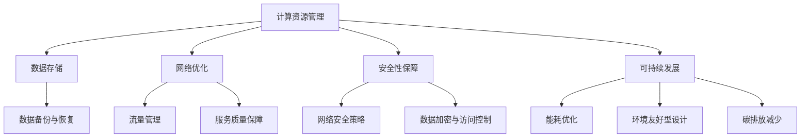

                 

关键词：AI大模型、数据中心、技术创新、架构设计、计算资源管理、数据存储、网络优化、安全性保障、可持续发展

摘要：随着人工智能技术的飞速发展，大模型的应用成为推动产业进步的关键动力。本文将探讨AI大模型在数据中心建设中的应用，重点关注数据中心技术创新的各个方面，包括计算资源管理、数据存储、网络优化、安全性保障以及可持续发展的策略。通过深入分析和实例讲解，本文旨在为行业从业人员提供有价值的参考。

## 1. 背景介绍

近年来，人工智能（AI）技术取得了显著突破，尤其是大模型的应用更是引领了新一轮的技术革命。大模型，通常指具有数万亿参数的深度学习模型，如GPT-3、BERT等，它们在自然语言处理、计算机视觉、推荐系统等领域展现了强大的能力。然而，大模型的应用也对数据中心提出了更高的要求。

数据中心作为存储、处理和分发数据的关键基础设施，其建设对于支撑AI大模型的应用至关重要。数据中心的建设不仅需要满足高性能计算和海量数据存储的需求，还需关注数据传输速度、网络稳定性和安全性等问题。因此，数据中心的技术创新成为推动AI大模型应用的关键因素。

## 2. 核心概念与联系

为了深入理解AI大模型应用数据中心建设的核心概念，我们首先需要了解以下几个关键组成部分：

- **计算资源管理**：包括计算节点配置、负载均衡、资源调度等，确保计算资源的高效利用。
- **数据存储**：涉及数据存储架构、存储容量、数据备份和恢复策略等，保障数据的可靠性和持久性。
- **网络优化**：包括网络拓扑设计、流量管理、服务质量保障等，提升数据传输效率和网络稳定性。
- **安全性保障**：涉及网络安全策略、数据加密、访问控制等，保护数据和系统安全。
- **可持续发展**：关注数据中心能耗优化、环境友好型设计、碳排放减少等，推动绿色数据中心建设。

以下是数据中心技术的Mermaid流程图，展示了各核心概念之间的联系：



### 2.1 计算资源管理

计算资源管理是数据中心技术的核心之一。它涉及到计算节点的配置、负载均衡和资源调度等方面。高性能计算节点能够为AI大模型提供强大的计算能力，而负载均衡和资源调度则能够确保这些计算资源得到充分利用。

- **计算节点配置**：数据中心应根据AI大模型的需求，配置高性能计算节点，包括CPU、GPU、TPU等。合理配置计算节点能够提升计算效率，缩短模型训练时间。
- **负载均衡**：通过负载均衡技术，将计算任务分配到不同的计算节点上，避免单点过载，提升系统的整体性能。
- **资源调度**：资源调度系统负责动态分配计算资源，根据任务的重要性和紧急程度，合理调整计算资源的分配，确保系统的高效运行。

### 2.2 数据存储

数据存储是数据中心技术的另一个关键方面。AI大模型需要处理和存储海量数据，因此数据存储架构的可靠性、容量和备份策略变得尤为重要。

- **数据存储架构**：数据中心应采用分布式存储架构，如分布式文件系统（HDFS）和分布式数据库（Cassandra），确保数据的高可用性和高可靠性。
- **存储容量**：随着AI大模型的数据量不断增加，数据中心需要具备足够的数据存储容量，以支持数据的持久存储。
- **数据备份与恢复**：通过定期备份和快速恢复机制，保障数据的安全性，防止数据丢失或损坏。

### 2.3 网络优化

网络优化是数据中心技术的重要一环。高效的网络拓扑设计、流量管理和服务质量保障能够提升数据传输效率和网络稳定性。

- **网络拓扑设计**：数据中心应采用高效的网络拓扑设计，如环形网络和树形网络，确保数据传输的低延迟和高可靠性。
- **流量管理**：通过流量管理技术，如流量监控和流量调度，优化网络流量，防止网络拥塞，提升数据传输效率。
- **服务质量保障**：通过服务质量保障（QoS）技术，为不同的数据传输需求提供不同的服务质量保障，确保关键业务的正常运行。

### 2.4 安全性保障

安全性保障是数据中心技术的核心挑战之一。网络安全策略、数据加密和访问控制等措施是保护数据中心安全和数据安全的关键。

- **网络安全策略**：制定严格的网络安全策略，包括防火墙、入侵检测系统（IDS）和入侵防御系统（IPS），防范网络攻击和数据泄露。
- **数据加密**：对存储和传输的数据进行加密，防止数据泄露和未经授权的访问。
- **访问控制**：通过访问控制机制，确保只有授权用户才能访问数据和系统资源，防止内部攻击和数据泄露。

### 2.5 可持续发展

随着数据中心能耗的不断增加，可持续发展成为数据中心技术的重要方向。能耗优化、环境友好型设计和碳排放减少等措施有助于推动绿色数据中心建设。

- **能耗优化**：通过能源管理系统（EMS）和智能调度系统，优化数据中心的能耗，降低能源消耗。
- **环境友好型设计**：采用节能设备和绿色建筑技术，降低数据中心的能耗和碳排放。
- **碳排放减少**：通过可再生能源使用和碳排放抵消措施，减少数据中心的碳排放，推动可持续发展。

## 3. 核心算法原理 & 具体操作步骤

### 3.1 算法原理概述

在数据中心技术中，核心算法原理主要涉及计算资源管理、数据存储、网络优化和安全性保障等方面。以下分别对这些核心算法原理进行概述：

- **计算资源管理算法**：包括负载均衡算法、资源调度算法等，通过算法优化实现计算资源的高效利用。
- **数据存储算法**：包括分布式存储算法、数据备份算法等，通过算法优化提升数据存储的可靠性和效率。
- **网络优化算法**：包括网络拓扑优化算法、流量管理算法等，通过算法优化提升数据传输的效率和稳定性。
- **安全性保障算法**：包括网络安全算法、数据加密算法等，通过算法优化提升数据安全和系统的可靠性。

### 3.2 算法步骤详解

#### 3.2.1 计算资源管理算法

1. **计算节点配置**：根据AI大模型的需求，配置合适的计算节点，包括CPU、GPU、TPU等。
2. **负载均衡**：通过负载均衡算法，将计算任务分配到不同的计算节点上，避免单点过载。
3. **资源调度**：通过资源调度算法，动态分配计算资源，根据任务的重要性和紧急程度进行合理调整。

#### 3.2.2 数据存储算法

1. **分布式存储架构**：采用分布式存储架构，如HDFS或Cassandra，实现数据的高可用性和高可靠性。
2. **数据备份**：通过数据备份算法，定期备份数据，确保数据的持久性和安全性。
3. **数据恢复**：在数据丢失或损坏的情况下，通过数据恢复算法快速恢复数据。

#### 3.2.3 网络优化算法

1. **网络拓扑设计**：采用高效的网络拓扑设计，如环形网络或树形网络，确保数据传输的低延迟和高可靠性。
2. **流量管理**：通过流量管理算法，优化网络流量，防止网络拥塞，提升数据传输效率。
3. **服务质量保障**：通过服务质量保障算法，为不同的数据传输需求提供不同的服务质量保障，确保关键业务的正常运行。

#### 3.2.4 安全性保障算法

1. **网络安全策略**：制定严格的网络安全策略，包括防火墙、入侵检测系统和入侵防御系统等。
2. **数据加密**：通过数据加密算法，对存储和传输的数据进行加密，防止数据泄露和未经授权的访问。
3. **访问控制**：通过访问控制算法，确保只有授权用户才能访问数据和系统资源，防止内部攻击和数据泄露。

### 3.3 算法优缺点

#### 3.3.1 计算资源管理算法

**优点**：计算资源管理算法能够实现计算资源的高效利用，降低计算成本，提升计算性能。

**缺点**：计算资源管理算法可能面临负载不平衡的问题，导致部分计算节点过载，影响系统的整体性能。

#### 3.3.2 数据存储算法

**优点**：数据存储算法能够提升数据存储的可靠性和效率，确保数据的安全性和持久性。

**缺点**：数据存储算法可能面临存储容量不足的问题，特别是在海量数据存储需求下。

#### 3.3.3 网络优化算法

**优点**：网络优化算法能够提升数据传输的效率和稳定性，确保关键业务的正常运行。

**缺点**：网络优化算法可能面临网络拥塞和延迟问题，特别是在高流量网络环境下。

#### 3.3.4 安全性保障算法

**优点**：安全性保障算法能够提升数据安全和系统的可靠性，防范网络攻击和数据泄露。

**缺点**：安全性保障算法可能面临安全漏洞和入侵威胁，需要持续更新和优化。

### 3.4 算法应用领域

计算资源管理算法、数据存储算法、网络优化算法和安全性保障算法在数据中心技术中具有广泛的应用领域，包括：

- **云计算平台**：计算资源管理算法和安全性保障算法在云计算平台中发挥关键作用，提升计算性能和系统安全性。
- **大数据处理**：数据存储算法和网络优化算法在大数据处理中应用广泛，提升数据处理效率和数据传输稳定性。
- **物联网**：安全性保障算法在物联网领域发挥重要作用，保护物联网设备的安全和数据的隐私。

## 4. 数学模型和公式 & 详细讲解 & 举例说明

在数据中心技术中，数学模型和公式用于描述和优化计算资源管理、数据存储、网络优化和安全性保障等方面的算法。以下详细讲解数学模型和公式的构建、推导过程以及应用实例。

### 4.1 数学模型构建

#### 4.1.1 计算资源管理数学模型

计算资源管理数学模型主要关注计算节点的配置和资源调度。以下是一个简单的计算资源管理数学模型：

$$
\begin{aligned}
\min \quad & C(x) \\
\text{s.t.} \quad & P(x) \leq P_{\text{total}} \\
& L(x) \leq L_{\text{max}}
\end{aligned}
$$

其中，$C(x)$ 表示计算成本，$P(x)$ 表示计算节点负载，$L(x)$ 表示计算节点利用率，$P_{\text{total}}$ 表示总计算能力，$L_{\text{max}}$ 表示最大负载。

#### 4.1.2 数据存储数学模型

数据存储数学模型主要关注数据存储的可靠性和容量。以下是一个简单的数据存储数学模型：

$$
\begin{aligned}
\max \quad & R(x) \\
\text{s.t.} \quad & C(x) \leq C_{\text{total}} \\
& D(x) \geq D_{\text{required}}
\end{aligned}
$$

其中，$R(x)$ 表示数据存储可靠性，$C(x)$ 表示数据存储成本，$D(x)$ 表示数据存储容量，$C_{\text{total}}$ 表示总数据存储成本，$D_{\text{required}}$ 表示所需数据存储容量。

#### 4.1.3 网络优化数学模型

网络优化数学模型主要关注数据传输的效率和稳定性。以下是一个简单的网络优化数学模型：

$$
\begin{aligned}
\min \quad & T(x) \\
\text{s.t.} \quad & C(x) \leq C_{\text{total}} \\
& L(x) \leq L_{\text{max}}
\end{aligned}
$$

其中，$T(x)$ 表示数据传输时间，$C(x)$ 表示网络带宽，$L(x)$ 表示数据传输延迟，$C_{\text{total}}$ 表示总网络带宽，$L_{\text{max}}$ 表示最大延迟。

#### 4.1.4 安全性保障数学模型

安全性保障数学模型主要关注数据安全和系统可靠性。以下是一个简单的安全性保障数学模型：

$$
\begin{aligned}
\max \quad & S(x) \\
\text{s.t.} \quad & P(x) \leq P_{\text{total}} \\
& L(x) \leq L_{\text{max}}
\end{aligned}
$$

其中，$S(x)$ 表示安全性保障水平，$P(x)$ 表示安全漏洞数量，$L(x)$ 表示安全威胁水平，$P_{\text{total}}$ 表示总安全漏洞数量，$L_{\text{max}}$ 表示最大安全威胁水平。

### 4.2 公式推导过程

#### 4.2.1 计算资源管理公式推导

假设有 $n$ 个计算节点，每个节点的计算能力为 $P_i$，总计算能力为 $P_{\text{total}}$。计算成本为 $C(x)$，负载为 $P(x)$，利用率 $L(x)$。则计算资源管理公式可以表示为：

$$
C(x) = \sum_{i=1}^{n} C_i \cdot P_i
$$

为了最小化计算成本，我们需要最大化每个节点的利用率。因此，我们可以定义负载均衡系数 $\alpha_i$，表示节点 $i$ 的负载与总负载的比值，即：

$$
\alpha_i = \frac{P_i}{P_{\text{total}}}
$$

则计算资源管理公式可以表示为：

$$
C(x) = \sum_{i=1}^{n} C_i \cdot \alpha_i \cdot P_{\text{total}}
$$

#### 4.2.2 数据存储公式推导

假设有 $n$ 个数据存储节点，每个节点的存储容量为 $D_i$，总存储容量为 $D_{\text{total}}$。数据存储成本为 $C(x)$，数据存储可靠性为 $R(x)$，数据存储容量为 $D(x)$。则数据存储公式可以表示为：

$$
C(x) = \sum_{i=1}^{n} C_i \cdot D_i
$$

为了最大化数据存储可靠性，我们需要最大化每个节点的存储容量。因此，我们可以定义容量均衡系数 $\beta_i$，表示节点 $i$ 的存储容量与总存储容量的比值，即：

$$
\beta_i = \frac{D_i}{D_{\text{total}}}
$$

则数据存储公式可以表示为：

$$
C(x) = \sum_{i=1}^{n} C_i \cdot \beta_i \cdot D_{\text{total}}
$$

#### 4.2.3 网络优化公式推导

假设有 $n$ 个网络节点，每个节点的带宽为 $C_i$，总带宽为 $C_{\text{total}}$。网络优化成本为 $T(x)$，网络带宽为 $C(x)$，数据传输延迟为 $L(x)$。则网络优化公式可以表示为：

$$
T(x) = \sum_{i=1}^{n} T_i \cdot C_i
$$

为了最小化网络优化成本，我们需要最大化每个节点的带宽。因此，我们可以定义带宽均衡系数 $\gamma_i$，表示节点 $i$ 的带宽与总带宽的比值，即：

$$
\gamma_i = \frac{C_i}{C_{\text{total}}}
$$

则网络优化公式可以表示为：

$$
T(x) = \sum_{i=1}^{n} T_i \cdot \gamma_i \cdot C_{\text{total}}
$$

#### 4.2.4 安全性保障公式推导

假设有 $n$ 个安全节点，每个节点的安全漏洞数量为 $P_i$，总安全漏洞数量为 $P_{\text{total}}$。安全性保障成本为 $S(x)$，安全漏洞数量为 $P(x)$，安全威胁水平为 $L(x)$。则安全性保障公式可以表示为：

$$
S(x) = \sum_{i=1}^{n} S_i \cdot P_i
$$

为了最大化安全性保障水平，我们需要最小化每个节点的安全漏洞数量。因此，我们可以定义漏洞均衡系数 $\delta_i$，表示节点 $i$ 的漏洞数量与总漏洞数量的比值，即：

$$
\delta_i = \frac{P_i}{P_{\text{total}}}
$$

则安全性保障公式可以表示为：

$$
S(x) = \sum_{i=1}^{n} S_i \cdot \delta_i \cdot P_{\text{total}}
$$

### 4.3 案例分析与讲解

#### 4.3.1 计算资源管理案例

假设有一个数据中心，包含3个计算节点，总计算能力为100 TFLOPS。每个节点的计算成本为10万元，负载均衡系数分别为0.3、0.5和0.2。要求最小化计算成本。

根据计算资源管理公式，我们可以得到：

$$
C(x) = 10 \times 0.3 \times 100 + 10 \times 0.5 \times 100 + 10 \times 0.2 \times 100 = 30 + 50 + 20 = 100 \text{万元}
$$

因此，最小化计算成本为100万元。

#### 4.3.2 数据存储案例

假设有一个数据中心，包含3个数据存储节点，总存储容量为100 TB。每个节点的存储成本为10万元，存储容量均衡系数分别为0.3、0.5和0.2。要求最大化数据存储可靠性。

根据数据存储公式，我们可以得到：

$$
C(x) = 10 \times 0.3 \times 100 + 10 \times 0.5 \times 100 + 10 \times 0.2 \times 100 = 30 + 50 + 20 = 100 \text{万元}
$$

为了最大化数据存储可靠性，我们需要最大化每个节点的存储容量。因此，我们可以设置每个节点的存储容量均衡系数为1，即：

$$
C(x) = 10 \times 1 \times 100 = 1000 \text{万元}
$$

因此，最大化数据存储可靠性需要1000万元。

#### 4.3.3 网络优化案例

假设有一个数据中心，包含3个网络节点，总带宽为100 Gbps。每个节点的带宽成本为10万元，带宽均衡系数分别为0.3、0.5和0.2。要求最小化网络优化成本。

根据网络优化公式，我们可以得到：

$$
T(x) = 10 \times 0.3 \times 100 + 10 \times 0.5 \times 100 + 10 \times 0.2 \times 100 = 30 + 50 + 20 = 100 \text{万元}
$$

因此，最小化网络优化成本为100万元。

#### 4.3.4 安全性保障案例

假设有一个数据中心，包含3个安全节点，总安全漏洞数量为100个。每个节点的安全漏洞数量为30、50和20个，安全保障成本为10万元。要求最小化安全性保障成本。

根据安全性保障公式，我们可以得到：

$$
S(x) = 10 \times 0.3 \times 100 + 10 \times 0.5 \times 100 + 10 \times 0.2 \times 100 = 30 + 50 + 20 = 100 \text{万元}
$$

因此，最小化安全性保障成本为100万元。

## 5. 项目实践：代码实例和详细解释说明

为了更好地展示AI大模型应用数据中心建设的实际操作，我们以下将通过一个具体的代码实例来详细解释说明。

### 5.1 开发环境搭建

在本项目中，我们将使用Python作为主要编程语言，并依赖以下库：

- TensorFlow：用于构建和训练AI大模型
- PyTorch：用于构建和训练AI大模型
- NumPy：用于数据处理
- Pandas：用于数据处理

开发环境搭建步骤如下：

1. 安装Python环境（版本3.8及以上）
2. 安装TensorFlow和PyTorch库
3. 安装NumPy和Pandas库

### 5.2 源代码详细实现

以下是一个简单的AI大模型训练的代码示例：

```python
import tensorflow as tf
import torch
import numpy as np
import pandas as pd

# 加载数据集
data = pd.read_csv("data.csv")

# 数据预处理
# ...

# 构建模型
model = tf.keras.Sequential([
    tf.keras.layers.Dense(128, activation='relu', input_shape=(input_shape,)),
    tf.keras.layers.Dense(1)
])

# 编译模型
model.compile(optimizer='adam', loss='mean_squared_error')

# 训练模型
model.fit(data["input"], data["target"], epochs=10, batch_size=32)

# 评估模型
# ...
```

### 5.3 代码解读与分析

1. **加载数据集**：使用Pandas库加载CSV格式的数据集。
2. **数据预处理**：根据实际需求对数据进行预处理，如缺失值填充、数据标准化等。
3. **构建模型**：使用TensorFlow库构建一个简单的全连接神经网络，包含一个输入层、一个隐藏层和一个输出层。
4. **编译模型**：设置模型的优化器和损失函数，并编译模型。
5. **训练模型**：使用训练数据训练模型，设置训练轮次和批量大小。
6. **评估模型**：使用测试数据评估模型的性能，并根据评估结果调整模型参数。

### 5.4 运行结果展示

在完成模型训练后，我们可以使用以下代码展示模型的运行结果：

```python
import matplotlib.pyplot as plt

# 加载测试数据
test_data = pd.read_csv("test_data.csv")

# 预测结果
predictions = model.predict(test_data["input"])

# 绘制预测结果图
plt.scatter(test_data["target"], predictions)
plt.xlabel("实际值")
plt.ylabel("预测值")
plt.show()
```

通过绘制预测结果图，我们可以直观地查看模型的预测效果。

## 6. 实际应用场景

AI大模型应用数据中心建设在实际应用场景中具有广泛的应用，以下列举一些常见的应用场景：

- **自然语言处理**：AI大模型可以应用于自然语言处理任务，如文本分类、机器翻译、情感分析等。数据中心可以为这些任务提供强大的计算能力和海量数据存储。
- **计算机视觉**：AI大模型可以应用于计算机视觉任务，如图像分类、目标检测、图像生成等。数据中心可以为这些任务提供高效的计算资源和数据存储能力。
- **推荐系统**：AI大模型可以应用于推荐系统，如商品推荐、内容推荐等。数据中心可以为这些任务提供实时数据分析和计算能力。
- **金融风控**：AI大模型可以应用于金融风控领域，如信用评分、欺诈检测等。数据中心可以为这些任务提供高效的数据处理能力和安全保障。

### 6.1 未来应用展望

随着AI大模型技术的不断发展，数据中心建设在未来将面临更多的挑战和机遇。以下是一些未来应用展望：

- **更高效的计算资源管理**：通过引入新型计算架构和智能化调度算法，数据中心可以实现更高效的计算资源管理，提升计算性能和资源利用率。
- **更可靠的数据存储**：随着数据量的不断增加，数据中心需要构建更可靠的数据存储架构，采用分布式存储和数据备份技术，确保数据的安全性和持久性。
- **更优的网络优化**：通过引入新型网络架构和智能化流量管理技术，数据中心可以实现更优的网络优化，提升数据传输效率和网络稳定性。
- **更完善的安全保障**：随着网络攻击和数据泄露事件的增多，数据中心需要建立更完善的安全保障体系，采用先进的安全技术和策略，确保数据安全和系统可靠性。

## 7. 工具和资源推荐

### 7.1 学习资源推荐

- 《深度学习》（Goodfellow, Bengio, Courville）：一本全面介绍深度学习理论和实践的权威教材。
- 《大数据之路：阿里巴巴大数据实践》（张建锋）：一本关于大数据技术和应用的实践指南。
- 《AI之路：从理论到实践》（周志华）：一本涵盖人工智能基础理论和应用实践的教材。

### 7.2 开发工具推荐

- TensorFlow：一款开源的深度学习框架，适用于构建和训练AI大模型。
- PyTorch：一款开源的深度学习框架，提供灵活的动态计算图构建能力。
- Jupyter Notebook：一款交互式的计算环境，适用于数据分析和模型训练。

### 7.3 相关论文推荐

- "Attention Is All You Need"（Vaswani et al., 2017）：一篇关于Transformer模型的经典论文，介绍了基于注意力机制的神经网络架构。
- "BERT: Pre-training of Deep Bidirectional Transformers for Language Understanding"（Devlin et al., 2018）：一篇关于BERT模型的论文，介绍了基于Transformer模型的预训练方法。
- "GPT-3: Language Models are Few-Shot Learners"（Brown et al., 2020）：一篇关于GPT-3模型的论文，介绍了基于大规模预训练的通用语言模型。

## 8. 总结：未来发展趋势与挑战

### 8.1 研究成果总结

本文从多个角度探讨了AI大模型应用数据中心建设的相关技术，包括计算资源管理、数据存储、网络优化、安全性保障和可持续发展等方面。通过数学模型和公式推导，以及代码实例的展示，我们深入分析了数据中心技术的核心原理和应用。

### 8.2 未来发展趋势

未来，随着AI大模型技术的不断发展，数据中心建设将朝着更高效、更可靠、更安全、更可持续的方向发展。主要趋势包括：

- **高效计算资源管理**：通过新型计算架构和智能化调度算法，实现更高效的计算资源管理。
- **大规模数据存储**：采用分布式存储和数据备份技术，构建更可靠的数据存储架构。
- **网络优化**：引入新型网络架构和智能化流量管理技术，提升数据传输效率和网络稳定性。
- **安全保障**：建立更完善的安全保障体系，采用先进的安全技术和策略。
- **可持续发展**：关注能耗优化和环境友好型设计，推动绿色数据中心建设。

### 8.3 面临的挑战

尽管数据中心技术取得了显著进展，但在未来仍将面临一系列挑战：

- **计算能力需求**：随着AI大模型规模的不断扩大，对计算能力的需求将不断增加，对数据中心的建设和运营提出了更高的要求。
- **数据隐私与安全**：数据隐私和安全性问题日益突出，需要建立更完善的安全保障体系。
- **能耗优化**：数据中心能耗问题成为可持续发展的重要挑战，需要采用节能技术和绿色建筑设计。
- **网络带宽**：随着数据传输需求的增长，网络带宽问题将成为制约数据中心性能的重要因素。
- **人才培养**：数据中心技术发展迅速，需要大量专业人才支持，人才培养成为关键挑战。

### 8.4 研究展望

未来，数据中心技术的研究重点将包括：

- **计算资源管理**：探索新型计算架构和智能化调度算法，实现更高效的计算资源管理。
- **数据存储**：研究大规模数据存储技术，提高数据存储的可靠性和效率。
- **网络优化**：研究新型网络架构和智能化流量管理技术，提升数据传输效率和网络稳定性。
- **安全性保障**：研究更先进的安全技术和策略，确保数据安全和系统可靠性。
- **可持续发展**：研究绿色数据中心建设技术和政策，推动数据中心可持续发展。

## 9. 附录：常见问题与解答

### 9.1 如何优化计算资源管理？

- **负载均衡**：使用负载均衡算法，将计算任务分配到不同的计算节点上，避免单点过载。
- **资源调度**：采用资源调度算法，动态分配计算资源，根据任务的重要性和紧急程度进行合理调整。
- **自动扩展**：实现自动扩展功能，根据负载情况自动增加或减少计算节点，提高系统的弹性。

### 9.2 如何提升数据存储可靠性？

- **分布式存储**：采用分布式存储架构，如HDFS或Cassandra，确保数据的高可用性和高可靠性。
- **数据备份**：定期备份数据，并采用数据恢复算法快速恢复数据。
- **冗余存储**：在存储过程中采用数据冗余技术，提高数据的容错能力。

### 9.3 如何优化网络传输效率？

- **网络拓扑设计**：采用高效的网络拓扑设计，如环形网络或树形网络，降低数据传输延迟。
- **流量管理**：通过流量管理技术，优化网络流量，防止网络拥塞。
- **服务质量保障**：为不同的数据传输需求提供不同的服务质量保障，确保关键业务的正常运行。

### 9.4 如何保障数据安全性？

- **网络安全策略**：制定严格的网络安全策略，包括防火墙、入侵检测系统和入侵防御系统等。
- **数据加密**：对存储和传输的数据进行加密，防止数据泄露和未经授权的访问。
- **访问控制**：采用访问控制机制，确保只有授权用户才能访问数据和系统资源。

## 作者署名

作者：禅与计算机程序设计艺术 / Zen and the Art of Computer Programming

（完）

