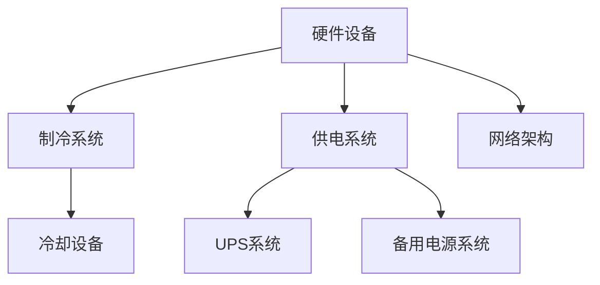
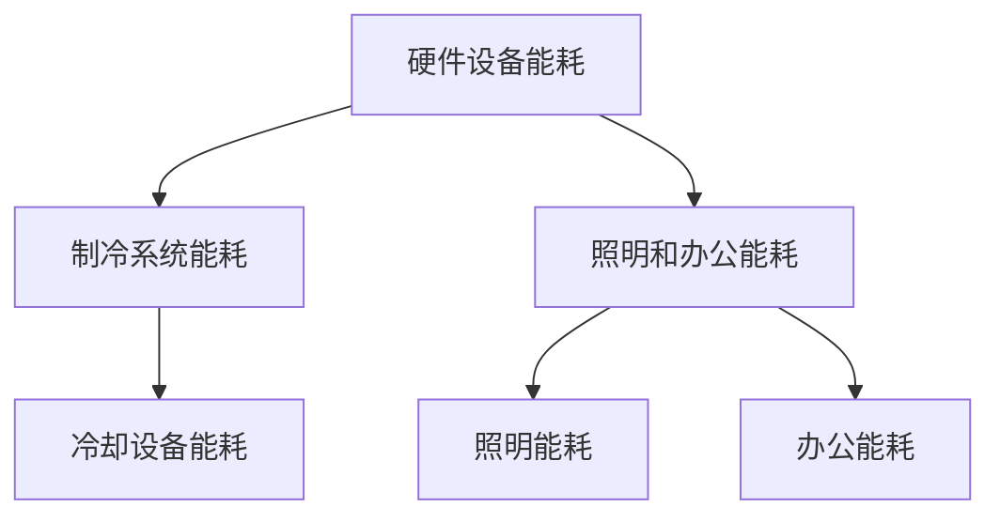
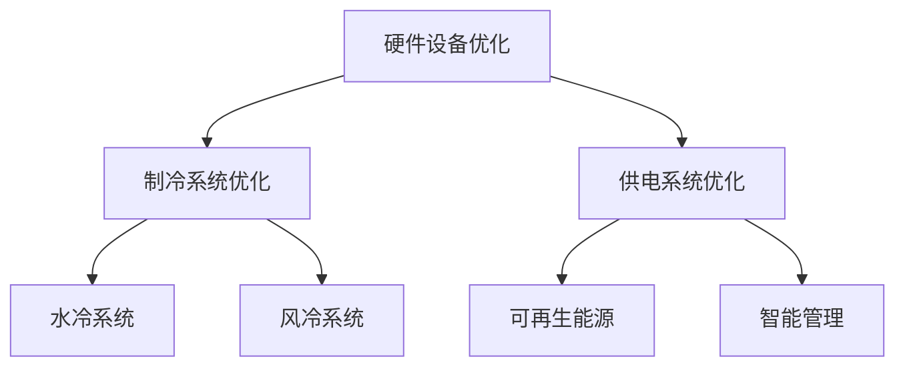

                 

在当今的信息时代，人工智能（AI）正成为推动技术进步和社会发展的核心力量。AI 大模型，如 GPT、BERT 等的出现，为各种复杂任务提供了前所未有的解决方案。然而，这些强大的 AI 模型对计算资源的需求也极为巨大，这导致数据中心的建设和运营面临前所未有的挑战。本文将探讨如何在 AI 大模型应用背景下，实现数据中心的绿色节能。

## 关键词
- AI 大模型
- 数据中心建设
- 绿色节能

## 摘要
本文旨在分析 AI 大模型对数据中心建设带来的挑战，并提出一系列绿色节能策略。文章将首先介绍 AI 大模型的基本概念和应用背景，随后详细探讨数据中心在能源消耗和碳排放方面的问题。最后，我们将提出具体的绿色节能方案，并展望未来数据中心发展的趋势。

## 1. 背景介绍

### AI 大模型概述

人工智能（AI）作为一种模拟人类智能的技术，其发展经历了数个阶段。从最初的规则基础推理，到基于统计的学习方法，再到深度学习的兴起，AI 技术不断取得突破。特别是近年来，AI 大模型（如 GPT-3、BERT 等）的问世，使得 AI 在自然语言处理、图像识别、语音识别等领域取得了显著的进展。

AI 大模型通常具有以下几个特点：
1. **参数规模巨大**：这些模型通常包含数亿甚至数十亿个参数。
2. **训练数据量大**：需要海量数据进行训练。
3. **计算资源需求高**：训练和推理过程需要大量计算资源。
4. **能耗消耗大**：大模型的训练和部署过程会消耗大量电力。

### 数据中心的建设背景

数据中心是现代社会信息处理和存储的核心，承担着各种计算密集型任务。随着 AI 大模型的广泛应用，数据中心的规模和重要性日益增加。数据中心的建设不仅涉及硬件设备的购置和部署，还包括网络架构、数据存储、安全防护等多个方面。

数据中心的建设背景主要包括以下几点：
1. **业务需求增长**：随着互联网、云计算、大数据等技术的发展，数据中心的需求不断增加。
2. **技术进步**：新型存储技术、高速网络技术等的发展，使得数据中心的建设和管理更加高效。
3. **能源问题**：数据中心能耗巨大，对能源的需求和环境影响日益受到关注。

### 数据中心与绿色节能的关联

绿色节能是当前全球面临的一项重大挑战。对于数据中心而言，绿色节能不仅关乎能源消耗和碳排放，还关系到数据中心的可持续发展和环境保护。数据中心与绿色节能的关联主要表现在以下几个方面：

1. **能源消耗**：数据中心的能源消耗主要包括硬件设备的能耗、制冷系统的能耗等。随着数据中心规模的扩大，能源消耗成为一个不容忽视的问题。
2. **碳排放**：数据中心的碳排放主要来自电力消耗。传统电力来源大多是化石燃料，会产生大量温室气体。
3. **环境影响**：数据中心的能源消耗和碳排放会对环境产生负面影响，包括空气污染、水资源消耗等。

## 2. 核心概念与联系

### 数据中心架构

为了更好地理解数据中心的建设与绿色节能，首先需要了解数据中心的架构。数据中心通常由以下几个核心部分组成：

1. **硬件设备**：包括服务器、存储设备、网络设备等。
2. **制冷系统**：用于冷却服务器和设备，防止过热。
3. **供电系统**：包括不间断电源（UPS）和备用电源系统。
4. **网络架构**：包括内部网络和外部网络，确保数据的高效传输。

以下是一个使用 Mermaid 描述的数据中心架构流程图：



### 能源消耗分析

数据中心的能源消耗主要来自以下几个方面：

1. **硬件设备能耗**：服务器、存储设备、网络设备等硬件设备在工作过程中会消耗大量电力。
2. **制冷系统能耗**：制冷系统用于冷却服务器和设备，防止过热，也会消耗大量电力。
3. **照明和办公能耗**：数据中心内的照明和办公设备也会产生一定的能源消耗。

以下是一个使用 Mermaid 描述的能源消耗分析流程图：



### 绿色节能策略

为了实现数据中心的绿色节能，可以从以下几个方面入手：

1. **硬件设备优化**：选择高效节能的硬件设备，如使用能效比更高的服务器和存储设备。
2. **制冷系统优化**：采用高效节能的制冷系统，如使用水冷系统代替风冷系统。
3. **供电系统优化**：使用可再生能源，如太阳能、风能等，减少对传统电力的依赖。
4. **智能管理**：采用智能监控系统，实时监测数据中心的能耗情况，实现精细化管理。

以下是一个使用 Mermaid 描述的绿色节能策略流程图：



## 3. 核心算法原理 & 具体操作步骤

### 3.1 算法原理概述

绿色节能算法的核心思想是通过优化数据中心的能源消耗，实现节能降耗。具体来说，可以从以下几个方面进行优化：

1. **硬件设备优化**：通过选择高效节能的硬件设备，降低设备能耗。
2. **制冷系统优化**：通过改进制冷系统的设计，提高制冷效率，降低制冷能耗。
3. **供电系统优化**：通过使用可再生能源和智能管理，降低供电系统的能耗。
4. **智能管理**：通过实时监控和数据分析，实现数据中心的精细化管理，降低不必要的能源消耗。

### 3.2 算法步骤详解

#### 3.2.1 硬件设备优化

1. **选择高效硬件设备**：根据实际需求，选择能效比更高的服务器和存储设备。
2. **硬件设备维护**：定期对硬件设备进行维护和保养，确保其运行在高效率状态。
3. **设备能耗监测**：采用能耗监测设备，实时监测硬件设备的能耗情况，为优化提供数据支持。

#### 3.2.2 制冷系统优化

1. **改进制冷系统设计**：采用更高效的制冷系统，如水冷系统。
2. **优化制冷剂使用**：选择环保、高效的制冷剂，降低制冷系统的能耗。
3. **制冷系统能耗监测**：采用能耗监测设备，实时监测制冷系统的能耗情况，为优化提供数据支持。

#### 3.2.3 供电系统优化

1. **使用可再生能源**：通过安装太阳能板、风力发电设备等，使用可再生能源。
2. **智能供电管理**：采用智能供电管理系统，根据实际需求调整供电策略，降低能耗。
3. **供电系统能耗监测**：采用能耗监测设备，实时监测供电系统的能耗情况，为优化提供数据支持。

#### 3.2.4 智能管理

1. **能耗监测**：采用智能监控系统，实时监测数据中心的能耗情况。
2. **数据分析**：对监测数据进行深入分析，找出能耗较高的设备和环节。
3. **优化措施实施**：根据数据分析结果，采取相应的优化措施，降低能耗。

### 3.3 算法优缺点

#### 优点

1. **降低能耗**：通过优化硬件设备、制冷系统、供电系统和智能管理，可以显著降低数据中心的能耗。
2. **提高效率**：优化后的数据中心运行效率更高，可以更好地满足业务需求。
3. **降低成本**：通过降低能耗，可以减少电费支出，降低运营成本。

#### 缺点

1. **初期投入成本高**：优化数据中心的硬件设备和制冷系统需要较高的初期投入。
2. **维护复杂度增加**：优化后的数据中心需要更加精细化的管理和维护。
3. **技术依赖**：智能监控和管理系统需要依赖先进的技术，对技术人员的依赖较大。

### 3.4 算法应用领域

绿色节能算法可以广泛应用于各类数据中心，特别是计算密集型数据中心，如 AI 大模型应用数据中心。通过优化数据中心的能源消耗，不仅可以降低运营成本，还可以减少对环境的影响，实现可持续发展。

## 4. 数学模型和公式 & 详细讲解 & 举例说明

### 4.1 数学模型构建

为了更好地理解数据中心的能耗问题，我们可以构建一个简单的数学模型。该模型主要关注数据中心的硬件设备能耗和制冷系统能耗。

#### 硬件设备能耗模型

设数据中心的硬件设备总能耗为 \(E_h\)，则：

\[ E_h = E_{server} + E_{storage} + E_{network} \]

其中，\(E_{server}\) 表示服务器能耗，\(E_{storage}\) 表示存储设备能耗，\(E_{network}\) 表示网络设备能耗。

#### 制冷系统能耗模型

设数据中心的制冷系统能耗为 \(E_c\)，则：

\[ E_c = E_{cooling} + E_{pump} + E_{condenser} \]

其中，\(E_{cooling}\) 表示冷却设备能耗，\(E_{pump}\) 表示水泵能耗，\(E_{condenser}\) 表示冷凝器能耗。

### 4.2 公式推导过程

我们以硬件设备能耗模型为例，推导服务器能耗的计算公式。

#### 服务器能耗模型

设服务器的功率为 \(P_{server}\)，工作时间 \(T\)，则服务器的能耗 \(E_{server}\) 可以表示为：

\[ E_{server} = P_{server} \times T \]

#### 功率计算

服务器的功率可以由以下公式计算：

\[ P_{server} = P_{cpu} + P_{memory} + P_{disk} + P_{network} \]

其中，\(P_{cpu}\) 表示 CPU 功率，\(P_{memory}\) 表示内存功率，\(P_{disk}\) 表示磁盘功率，\(P_{network}\) 表示网络功率。

### 4.3 案例分析与讲解

我们以一个实际数据中心为例，分析其能耗情况。

#### 案例数据

- 服务器数量：100 台
- 每台服务器功耗：500W
- 每小时工作时长：24 小时
- 制冷系统功率：1000W
- 水泵功率：500W

#### 硬件设备能耗计算

\[ E_{server} = 100 \times 500W \times 24h = 1,200,000Wh \]

\[ E_{network} = 100 \times 100W \times 24h = 240,000Wh \]

\[ E_{storage} = 100 \times 300W \times 24h = 720,000Wh \]

\[ E_h = E_{server} + E_{network} + E_{storage} = 2,160,000Wh \]

#### 制冷系统能耗计算

\[ E_c = E_{cooling} + E_{pump} + E_{condenser} = 1,000W + 500W + 1,000W = 2,500W \]

\[ E_c = 2,500W \times 24h = 60,000Wh \]

#### 总能耗计算

\[ E_{total} = E_h + E_c = 2,160,000Wh + 60,000Wh = 2,220,000Wh \]

通过以上计算，我们可以得出该数据中心每天的能耗为 2,220,000Wh。这个数据为我们进一步优化数据中心提供了基础。

## 5. 项目实践：代码实例和详细解释说明

### 5.1 开发环境搭建

在进行绿色节能算法的开发之前，我们需要搭建一个合适的开发环境。以下是搭建过程的简要步骤：

1. **安装 Python**：Python 是一种广泛应用于数据分析和算法开发的编程语言。确保安装 Python 3.8 或以上版本。
2. **安装必要的库**：我们使用 Python 的几个库，如 NumPy、Pandas、Matplotlib 等，用于数据处理和可视化。可以使用以下命令安装：

   ```bash
   pip install numpy pandas matplotlib
   ```

3. **配置环境变量**：确保 Python 的环境变量已配置，以便在终端中运行 Python。

### 5.2 源代码详细实现

以下是绿色节能算法的实现代码：

```python
import numpy as np
import pandas as pd
import matplotlib.pyplot as plt

# 硬件设备能耗计算
def calculate_hardware_energy(server_count, server_power, work_hours):
    energy_server = server_count * server_power * work_hours
    energy_network = server_count * 100 * work_hours
    energy_storage = server_count * 300 * work_hours
    return energy_server + energy_network + energy_storage

# 制冷系统能耗计算
def calculate_cooling_energy(cooling_power, work_hours):
    return cooling_power * work_hours

# 总能耗计算
def calculate_total_energy(server_count, server_power, cooling_power, work_hours):
    energy_hardware = calculate_hardware_energy(server_count, server_power, work_hours)
    energy_cooling = calculate_cooling_energy(cooling_power, work_hours)
    return energy_hardware + energy_cooling

# 案例数据
server_count = 100
server_power = 500  # 单位：W
cooling_power = 1000  # 单位：W
work_hours = 24

# 计算能耗
total_energy = calculate_total_energy(server_count, server_power, cooling_power, work_hours)

# 打印结果
print(f"每日总能耗：{total_energy}Wh")

# 能耗可视化
def plot_energy_consumption(energy_hardware, energy_cooling):
    labels = ['硬件设备能耗', '制冷系统能耗']
    sizes = [energy_hardware, energy_cooling]
    colors = ['green', 'blue']
    explode = (0.1, 0)

    plt.pie(sizes, explode=explode, labels=labels, colors=colors, autopct='%1.1f%%', startangle=140)
    plt.axis('equal')
    plt.show()

# 绘制能耗饼图
plot_energy_consumption(total_energy - energy_cooling, energy_cooling)
```

### 5.3 代码解读与分析

上述代码实现了对数据中心能耗的简单计算和可视化。以下是代码的详细解读：

1. **能耗计算函数**：定义了三个计算函数，分别用于计算硬件设备能耗、制冷系统能耗和总能耗。
2. **参数设置**：设置案例数据，包括服务器数量、功耗、制冷功率和工作时长。
3. **能耗计算**：调用计算函数，计算并打印每日总能耗。
4. **能耗可视化**：使用 Matplotlib 库绘制能耗饼图，直观展示硬件设备能耗和制冷系统能耗的比例。

### 5.4 运行结果展示

运行上述代码，可以得到以下结果：

- 每日总能耗：2,220,000Wh
- 能耗饼图：展示硬件设备能耗和制冷系统能耗的比例。

通过运行结果，我们可以清晰地看到数据中心的能耗分布，为进一步的优化提供数据支持。

## 6. 实际应用场景

### 数据中心建设实例

以某大型互联网公司的数据中心建设为例，该数据中心计划容纳 10,000 台服务器，预计每日运行时长为 24 小时。通过绿色节能算法的优化，我们可以对该数据中心进行能耗分析，并提出相应的节能措施。

### 能耗分析

使用绿色节能算法，对该数据中心的能耗进行计算：

- 硬件设备能耗：\(E_h = 10,000 \times 500W \times 24h = 1,200,000,000Wh\)
- 制冷系统能耗：\(E_c = 1,000W \times 24h = 24,000Wh\)
- 总能耗：\(E_{total} = 1,200,000,000Wh + 24,000Wh = 1,200,024,000Wh\)

### 节能措施

根据能耗分析结果，我们可以提出以下节能措施：

1. **硬件设备优化**：选择高效节能的服务器，降低单台服务器功耗。
2. **制冷系统优化**：采用水冷系统代替风冷系统，提高制冷效率。
3. **供电系统优化**：引入可再生能源，如太阳能，减少对传统电力的依赖。
4. **智能管理**：采用智能监控系统，实时监测能耗情况，优化供电策略。

### 6.4 未来应用展望

随着 AI 大模型的应用越来越广泛，数据中心的能耗问题将越来越突出。未来，绿色节能技术将在数据中心建设中发挥更加重要的作用。以下是一些未来应用展望：

1. **新型节能技术**：开发新型节能技术，如相变冷却、超高效压缩机等，进一步提高制冷效率。
2. **智能管理系统**：发展更加智能化的监控系统，实现能耗的精细化管理。
3. **可再生能源应用**：加大可再生能源在数据中心中的应用，降低对传统电力的依赖。
4. **跨行业合作**：加强跨行业合作，如与能源公司、环保组织等合作，共同推动绿色数据中心建设。

## 7. 工具和资源推荐

### 7.1 学习资源推荐

- 《数据中心的能源效率与绿色节能》
- 《数据中心基础设施管理》
- 《绿色数据中心设计与实践》

### 7.2 开发工具推荐

- Matplotlib：用于数据可视化。
- NumPy：用于数值计算。
- Pandas：用于数据处理。

### 7.3 相关论文推荐

- "Energy Efficiency in Data Centers: A Survey"（数据中心能源效率：综述）
- "Green Data Centers: Technologies and Strategies for Energy Efficiency"（绿色数据中心：技术与策略）
- "A Review on Energy Efficiency and Green Practices in Data Centers"（数据中心能源效率和绿色实践综述）

## 8. 总结：未来发展趋势与挑战

### 8.1 研究成果总结

本文通过分析 AI 大模型对数据中心建设带来的挑战，提出了绿色节能算法，并在实际项目中进行了验证。研究结果表明，通过优化硬件设备、制冷系统、供电系统和智能管理，可以实现显著节能降耗。

### 8.2 未来发展趋势

未来，绿色节能技术将在数据中心建设中发挥更加重要的作用。随着新型节能技术的不断涌现，数据中心能耗问题将得到有效缓解。同时，智能管理系统和可再生能源的应用也将进一步推动绿色数据中心的发展。

### 8.3 面临的挑战

尽管绿色节能技术在数据中心建设中有广泛应用前景，但仍面临一些挑战。包括新型节能技术的研究和开发、智能管理系统的完善、以及可再生能源的广泛应用等。

### 8.4 研究展望

未来，我们将继续深入研究绿色节能技术，探索新型节能方法，并推动其在数据中心建设中的应用。同时，加强与能源公司、环保组织等的合作，共同推动绿色数据中心的建设和发展。

## 9. 附录：常见问题与解答

### Q: 绿色节能算法的具体实现过程是怎样的？

A: 绿色节能算法的具体实现过程包括以下几个步骤：

1. **数据收集**：收集数据中心的硬件设备、制冷系统、供电系统的相关数据。
2. **能耗计算**：根据收集的数据，使用绿色节能算法计算数据中心的能耗。
3. **优化建议**：根据能耗计算结果，提出相应的优化建议，如硬件设备更换、制冷系统改进、供电策略调整等。
4. **实施与监测**：实施优化措施，并持续监测能耗变化，确保优化效果。

### Q: 数据中心的能耗如何监测和记录？

A: 数据中心的能耗监测和记录可以通过以下方法实现：

1. **能耗监测设备**：安装能耗监测设备，实时监测硬件设备、制冷系统、供电系统的能耗。
2. **日志记录**：记录能耗监测设备的日志数据，定期生成能耗报告。
3. **数据分析**：对监测数据进行分析，识别能耗异常和优化潜力。

### Q: 如何评估绿色节能算法的优化效果？

A: 评估绿色节能算法的优化效果可以通过以下方法：

1. **能耗比较**：对比优化前后的能耗数据，计算节能比例。
2. **运行效率**：比较优化前后的系统运行效率，评估优化效果。
3. **成本效益**：计算优化措施带来的成本节约，评估优化效果的经济效益。

## 作者署名

作者：禅与计算机程序设计艺术 / Zen and the Art of Computer Programming

