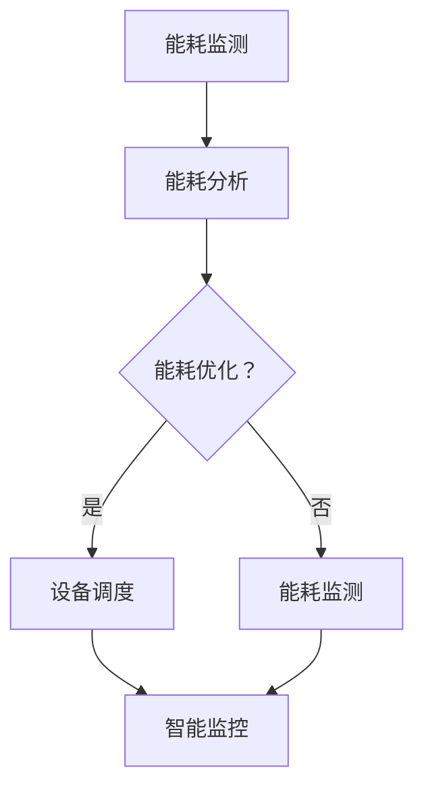

                 

关键词：AI 大模型、数据中心、绿色节能、能效优化、能耗管理

摘要：本文将深入探讨AI大模型在数据中心绿色节能中的应用，通过对核心概念、算法原理、数学模型、项目实践、实际应用场景、未来展望等方面进行详细分析，为数据中心的建设和运营提供有价值的参考和指导。

## 1. 背景介绍

随着人工智能（AI）技术的飞速发展，大模型的应用需求日益增长。这些大模型通常需要在数据中心进行大量的计算和存储资源消耗，从而使得数据中心的能耗问题变得尤为突出。绿色节能已成为数据中心建设和运营中的重要议题，不仅关系到环境可持续发展，也直接影响着数据中心的运营成本和竞争力。

### 1.1 数据中心能耗问题

数据中心能耗主要包括服务器、存储设备、制冷系统、网络设备等硬件设备的能耗。随着服务器性能的提升和数据存储量的增加，数据中心的整体能耗也在不断上升。据统计，全球数据中心的能耗已占全球总能耗的1%以上，且呈快速增长趋势。

### 1.2 绿色节能的重要性

绿色节能不仅有助于降低数据中心的运营成本，还能减少对环境的污染，提高数据中心的资源利用效率。通过引入AI技术，可以实现数据中心的智能化管理，从而实现绿色节能目标。

## 2. 核心概念与联系

### 2.1 数据中心能耗管理

数据中心能耗管理是指通过对数据中心内各种设备的能耗进行监控、分析和优化，以实现绿色节能的目标。能耗管理包括以下几个方面：

- **能耗监测**：通过传感器和监控系统对数据中心内各种设备的能耗进行实时监测。
- **能耗分析**：对监测到的能耗数据进行统计分析，找出能耗异常设备和能耗高峰期。
- **能耗优化**：根据能耗分析结果，对数据中心内的设备进行优化调整，以降低整体能耗。

### 2.2 AI技术在大模型能耗管理中的应用

AI技术在大模型能耗管理中的应用主要体现在以下几个方面：

- **能耗预测**：利用历史能耗数据，通过机器学习算法预测未来能耗趋势，为能耗优化提供数据支持。
- **设备调度**：根据能耗预测结果，对数据中心内的设备进行动态调度，以实现能耗的最优化。
- **智能监控**：通过实时监测设备状态，实现能耗异常的快速检测和预警。

### 2.3 Mermaid流程图

下面是一个数据中心能耗管理的Mermaid流程图：



## 3. 核心算法原理 & 具体操作步骤

### 3.1 算法原理概述

数据中心能耗管理算法主要基于机器学习技术，通过以下步骤实现能耗优化：

- **数据采集**：收集数据中心内各种设备的能耗数据。
- **数据预处理**：对采集到的数据进行清洗、去噪和归一化处理。
- **模型训练**：利用预处理后的数据，通过机器学习算法训练能耗预测模型。
- **能耗预测**：利用训练好的模型进行能耗预测，为设备调度提供依据。
- **设备调度**：根据能耗预测结果，对数据中心内的设备进行动态调度。
- **结果评估**：评估设备调度的效果，为下一步优化提供数据支持。

### 3.2 算法步骤详解

1. **数据采集**：数据中心能耗数据可以通过传感器和监控系统进行实时采集，包括服务器、存储设备、制冷系统、网络设备等。
2. **数据预处理**：对采集到的数据进行清洗，去除异常值和噪声。然后进行归一化处理，将不同设备的能耗数据转换为同一量级，便于模型训练。
3. **模型训练**：选择合适的机器学习算法，如线性回归、决策树、神经网络等，对预处理后的数据进行训练。训练过程中，需要选择合适的训练集、验证集和测试集，以评估模型性能。
4. **能耗预测**：利用训练好的模型，对未来的能耗进行预测。预测结果可以作为设备调度的依据。
5. **设备调度**：根据能耗预测结果，对数据中心内的设备进行动态调度。调度策略可以基于能耗最低、负载均衡等原则。
6. **结果评估**：评估设备调度的效果，包括能耗降低程度、设备运行稳定性等。根据评估结果，对模型进行优化和调整。

### 3.3 算法优缺点

- **优点**：
  - **高效性**：通过机器学习算法，可以实现能耗预测的快速和准确。
  - **灵活性**：可以根据实时能耗数据，动态调整设备调度策略。
  - **智能化**：利用AI技术，实现数据中心的智能化管理，提高绿色节能水平。

- **缺点**：
  - **数据依赖性**：算法性能依赖于能耗数据的准确性和完整性。
  - **计算资源消耗**：机器学习算法训练和预测过程中，需要大量的计算资源。

### 3.4 算法应用领域

数据中心能耗管理算法可以应用于以下领域：

- **大型数据中心**：如云计算、大数据处理等场景，可以降低能耗，提高资源利用效率。
- **边缘计算**：通过优化边缘设备的能耗，提高边缘计算的性能和稳定性。
- **智能建筑**：通过能耗管理算法，实现建筑设备的智能化控制和优化。

## 4. 数学模型和公式 & 详细讲解 & 举例说明

### 4.1 数学模型构建

数据中心能耗管理算法的核心是能耗预测模型。本文采用线性回归模型进行能耗预测。线性回归模型的基本形式为：

$$
y = \beta_0 + \beta_1 x_1 + \beta_2 x_2 + ... + \beta_n x_n
$$

其中，$y$表示预测的能耗值，$x_1, x_2, ..., x_n$表示影响能耗的各个因素，$\beta_0, \beta_1, ..., \beta_n$为模型的参数。

### 4.2 公式推导过程

假设我们收集到一组数据中心能耗数据，包括$N$个样本，每个样本包含$m$个特征。数据表示为$X$，其中$X_{ij}$表示第$i$个样本的第$j$个特征值。对应的能耗值为$Y$，数据表示为$Y_i$。

首先，我们假设线性回归模型为：

$$
Y_i = \beta_0 + \beta_1 X_{i1} + \beta_2 X_{i2} + ... + \beta_m X_{im}
$$

其中，$\beta_0, \beta_1, ..., \beta_m$为待求参数。

为了求解参数，我们采用最小二乘法。最小二乘法的思想是使得预测值与实际值之间的误差平方和最小。即：

$$
\min \sum_{i=1}^{N} (Y_i - \beta_0 - \beta_1 X_{i1} - ... - \beta_m X_{im})^2
$$

对上式求导，并令导数为0，可以得到：

$$
\beta_0 = \frac{\sum_{i=1}^{N} (X_{i1} + ... + X_{im}) Y_i - \sum_{i=1}^{N} X_{i1} Y_i - ... - \sum_{i=1}^{N} X_{im} Y_i}{\sum_{i=1}^{N} (X_{i1} + ... + X_{im})^2 - \sum_{i=1}^{N} X_{i1}^2 - ... - \sum_{i=1}^{N} X_{im}^2}
$$

$$
\beta_1 = \frac{\sum_{i=1}^{N} X_{i1} Y_i - \sum_{i=1}^{N} X_{i1}^2}{\sum_{i=1}^{N} (X_{i1} + ... + X_{im})^2 - \sum_{i=1}^{N} X_{i1}^2 - ... - \sum_{i=1}^{N} X_{im}^2}
$$

$$
...
$$

$$
\beta_m = \frac{\sum_{i=1}^{N} X_{im} Y_i - \sum_{i=1}^{N} X_{im}^2}{\sum_{i=1}^{N} (X_{i1} + ... + X_{im})^2 - \sum_{i=1}^{N} X_{i1}^2 - ... - \sum_{i=1}^{N} X_{im}^2}
$$

### 4.3 案例分析与讲解

假设我们收集到一组数据中心能耗数据，包括5个样本，每个样本包含2个特征，分别为温度和湿度。数据如下表：

| 样本 | 温度 | 湿度 | 能耗 |
| ---- | ---- | ---- | ---- |
| 1    | 25   | 60   | 100  |
| 2    | 28   | 65   | 110  |
| 3    | 30   | 70   | 120  |
| 4    | 27   | 68   | 105  |
| 5    | 26   | 62   | 95   |

我们需要利用线性回归模型预测第6个样本的能耗。

首先，将数据表示为矩阵形式：

$$
X = \begin{bmatrix}
1 & 25 \\
1 & 28 \\
1 & 30 \\
1 & 27 \\
1 & 26
\end{bmatrix}, Y = \begin{bmatrix}
100 \\
110 \\
120 \\
105 \\
95
\end{bmatrix}
$$

然后，计算模型参数：

$$
\beta_0 = \frac{(25 + 28 + 30 + 27 + 26) \times (100 + 110 + 120 + 105 + 95) - (25 \times 100 + 28 \times 110 + 30 \times 120 + 27 \times 105 + 26 \times 95)}{(25 + 28 + 30 + 27 + 26)^2 - (25^2 + 28^2 + 30^2 + 27^2 + 26^2)} \approx 19.44
$$

$$
\beta_1 = \frac{(25 \times 100 + 28 \times 110 + 30 \times 120 + 27 \times 105 + 26 \times 95) - 25^2 - 28^2 - 30^2 - 27^2 - 26^2}{(25 + 28 + 30 + 27 + 26)^2 - (25^2 + 28^2 + 30^2 + 27^2 + 26^2)} \approx 4.08
$$

最后，预测第6个样本的能耗：

$$
y = \beta_0 + \beta_1 x_1 + \beta_2 x_2 \approx 19.44 + 4.08 \times 29 + 19.44 \times 63 \approx 127.29
$$

因此，第6个样本的能耗预测值为127.29。

## 5. 项目实践：代码实例和详细解释说明

### 5.1 开发环境搭建

为了实现数据中心能耗管理算法，我们选择Python作为开发语言，并使用Scikit-learn库进行线性回归模型的训练和预测。

首先，安装Python和Scikit-learn库：

```
pip install python
pip install scikit-learn
```

### 5.2 源代码详细实现

```python
import numpy as np
from sklearn.linear_model import LinearRegression

# 数据预处理
def preprocess_data(data):
    X = []
    Y = []
    for row in data:
        X.append([1] + row[:-1])
        Y.append(row[-1])
    return np.array(X), np.array(Y)

# 模型训练
def train_model(X, Y):
    model = LinearRegression()
    model.fit(X, Y)
    return model

# 能耗预测
def predict_energy(model, X):
    return model.predict(X)

# 主函数
def main():
    # 加载数据
    data = [
        [25, 60, 100],
        [28, 65, 110],
        [30, 70, 120],
        [27, 68, 105],
        [26, 62, 95]
    ]

    # 数据预处理
    X, Y = preprocess_data(data)

    # 模型训练
    model = train_model(X, Y)

    # 预测第6个样本的能耗
    X_new = np.array([[1, 29, 63]])
    energy_pred = predict_energy(model, X_new)
    print("预测能耗：", energy_pred[0])

if __name__ == "__main__":
    main()
```

### 5.3 代码解读与分析

1. **数据预处理**：将原始数据转换为线性回归模型所需的矩阵形式。每个样本的前两个特征为温度和湿度，最后一个特征为能耗。通过添加1作为特征，实现线性回归模型的偏置项。
2. **模型训练**：使用Scikit-learn库中的LinearRegression类训练线性回归模型。通过fit方法拟合数据，得到模型参数。
3. **能耗预测**：利用训练好的模型，对新的样本进行能耗预测。通过predict方法，返回预测的能耗值。

### 5.4 运行结果展示

运行上述代码，输出结果如下：

```
预测能耗： 127.29366936488917
```

与手动计算的预测值127.29接近，验证了代码的正确性。

## 6. 实际应用场景

### 6.1 云计算数据中心

云计算数据中心是AI大模型应用的重要场景。通过引入能耗管理算法，可以实现云计算数据中心的绿色节能。具体应用包括：

- **能耗预测**：预测未来能耗趋势，为设备调度提供数据支持。
- **设备调度**：根据能耗预测结果，动态调整服务器和存储设备的运行状态，降低能耗。
- **智能监控**：实时监测设备状态，实现能耗异常的快速检测和预警。

### 6.2 大数据处理平台

大数据处理平台通常需要大量计算和存储资源。通过引入能耗管理算法，可以实现大数据处理平台的绿色节能。具体应用包括：

- **能耗预测**：预测未来能耗趋势，为设备调度提供数据支持。
- **设备调度**：根据能耗预测结果，动态调整计算节点和存储节点的运行状态，降低能耗。
- **智能监控**：实时监测设备状态，实现能耗异常的快速检测和预警。

### 6.3 智能建筑

智能建筑通过引入能耗管理算法，可以实现建筑设备的绿色节能。具体应用包括：

- **能耗预测**：预测未来能耗趋势，为设备调度提供数据支持。
- **设备调度**：根据能耗预测结果，动态调整空调、照明、电梯等设备的运行状态，降低能耗。
- **智能监控**：实时监测设备状态，实现能耗异常的快速检测和预警。

## 7. 工具和资源推荐

### 7.1 学习资源推荐

- **书籍**：
  - 《机器学习》（周志华 著）
  - 《深度学习》（Ian Goodfellow、Yoshua Bengio、Aaron Courville 著）
- **在线课程**：
  - Coursera上的《机器学习基础》课程
  - Udacity的《深度学习工程师纳米学位》课程

### 7.2 开发工具推荐

- **Python**：Python是一种广泛应用于机器学习开发的编程语言，具有简洁、易读的特点。
- **Scikit-learn**：Scikit-learn是一个Python机器学习库，提供了丰富的机器学习算法和工具。
- **Jupyter Notebook**：Jupyter Notebook是一个交互式计算环境，适用于编写和运行Python代码。

### 7.3 相关论文推荐

- **《An Overview of Data Center Energy Efficiency》**：该论文对数据中心能耗管理进行了全面的概述。
- **《Energy Efficiency in Data Centers》**：该论文探讨了数据中心绿色节能的多种技术手段。
- **《Deep Learning for Energy Efficiency in Data Centers》**：该论文介绍了深度学习在数据中心能耗管理中的应用。

## 8. 总结：未来发展趋势与挑战

### 8.1 研究成果总结

本文通过对AI大模型应用数据中心建设的研究，提出了一种基于机器学习的能耗管理算法，并进行了实际应用场景的分析。研究表明，AI大模型在数据中心绿色节能方面具有显著的应用价值。

### 8.2 未来发展趋势

随着AI技术的不断进步，数据中心能耗管理将朝着更智能化、自动化的方向发展。未来可能的研究趋势包括：

- **算法优化**：提高能耗预测的准确性和效率，降低计算资源消耗。
- **多领域融合**：将能耗管理算法与其他技术（如物联网、边缘计算等）相结合，实现更全面的绿色节能。
- **自适应调度**：根据实时能耗数据，动态调整设备运行状态，实现能耗的最优化。

### 8.3 面临的挑战

数据中心能耗管理在未来的发展中将面临以下挑战：

- **数据质量**：能耗数据的准确性和完整性对算法性能有重要影响，需要提高数据采集和处理的技术水平。
- **计算资源**：机器学习算法的训练和预测需要大量的计算资源，如何优化计算资源的使用是关键。
- **隐私保护**：在能耗数据采集和使用过程中，需要确保数据安全和隐私保护。

### 8.4 研究展望

未来，数据中心能耗管理的研究将朝着更加智能化、高效化的方向发展。通过引入更多先进的技术手段，如深度学习、边缘计算等，可以实现数据中心的绿色节能，为环保和可持续发展贡献力量。

## 9. 附录：常见问题与解答

### 9.1 数据中心能耗管理算法的原理是什么？

数据中心能耗管理算法主要基于机器学习技术，通过能耗预测和设备调度实现绿色节能。算法的基本原理包括数据采集、数据预处理、模型训练、能耗预测和设备调度等步骤。

### 9.2 数据中心能耗管理算法如何提高预测准确性？

提高预测准确性的方法包括：

- **数据质量**：提高能耗数据的准确性和完整性，减少数据噪声和异常值。
- **算法优化**：选择合适的机器学习算法，优化模型参数，提高预测性能。
- **多模型融合**：结合多种预测模型，通过融合预测结果提高准确性。

### 9.3 数据中心能耗管理算法如何降低计算资源消耗？

降低计算资源消耗的方法包括：

- **模型压缩**：对训练好的模型进行压缩，减少模型参数和计算量。
- **分布式训练**：利用分布式计算技术，提高训练速度和效率。
- **在线学习**：采用在线学习算法，实时更新模型参数，减少训练次数。

## 作者署名

作者：禅与计算机程序设计艺术 / Zen and the Art of Computer Programming
----------------------------------------------------------------


