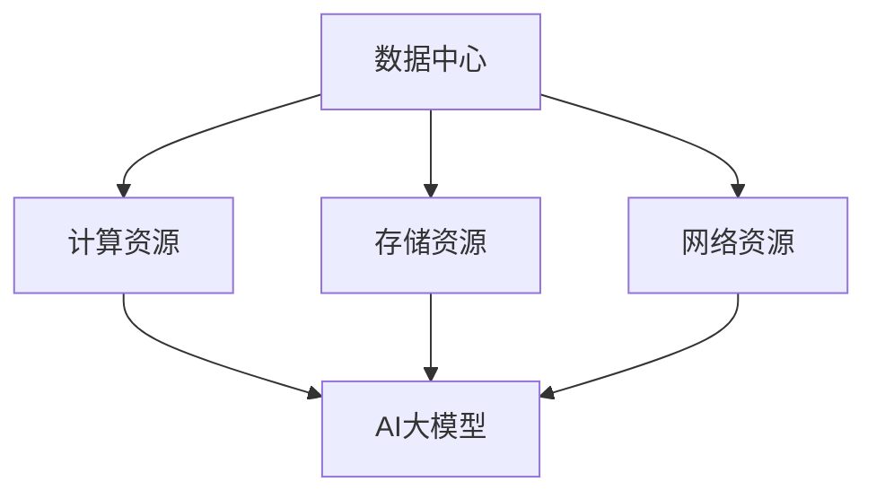

                 

关键词：AI大模型、数据中心、运维管理、架构设计、性能优化、安全性保障

> 摘要：本文将深入探讨AI大模型应用数据中心的建设，重点分析数据中心运维与管理的核心要素，提供实用的操作步骤和实施策略。通过对数据中心整体架构的剖析，我们旨在为行业从业者提供一套系统化的建设与运维指南，助力企业高效利用AI技术，实现数字化转型。

## 1. 背景介绍

随着人工智能（AI）技术的迅猛发展，AI大模型在自然语言处理、计算机视觉、语音识别等领域取得了显著的成果。这些大模型通常需要处理海量数据，对计算资源和存储资源的需求极高。因此，数据中心的建设成为了支撑AI大模型应用的关键环节。

数据中心作为信息化基础设施的重要组成部分，其运维与管理质量直接关系到AI大模型应用的稳定性和效率。本文将从数据中心的建设目标、核心要素、运维策略等方面进行深入分析，旨在为从业者提供一套全面的建设与运维指南。

## 2. 核心概念与联系

在讨论数据中心的建设与运维之前，我们首先需要了解以下几个核心概念：

### 2.1 数据中心定义

数据中心（Data Center）是指一种专门用于存储、处理、分发和管理数据的信息化设施。它通常包括计算资源、存储资源、网络资源等。

### 2.2 AI大模型特点

AI大模型具有以下特点：

- **计算密集**：处理海量数据，需要大量计算资源。
- **存储需求大**：存储大模型及其训练数据，需要高效存储解决方案。
- **实时性要求高**：在一些应用场景中，需要快速响应，对网络的实时性要求较高。

### 2.3 数据中心与AI大模型的联系

数据中心为AI大模型提供了必要的计算资源和存储资源，确保其稳定运行。同时，数据中心还需要提供高效的运维管理，以保障AI大模型的应用效果。

### 2.4 Mermaid流程图

下面是一个简单的Mermaid流程图，展示了数据中心与AI大模型之间的联系：



## 3. 核心算法原理 & 具体操作步骤

### 3.1 算法原理概述

数据中心运维与管理涉及多个核心算法，主要包括：

- **负载均衡算法**：用于分配计算任务，保证系统资源充分利用。
- **数据备份与恢复算法**：确保数据的安全性和可靠性。
- **网络流量监控算法**：实时监控网络流量，防止网络攻击和数据泄漏。
- **能耗优化算法**：降低数据中心能耗，提高资源利用效率。

### 3.2 算法步骤详解

#### 3.2.1 负载均衡算法

负载均衡算法主要包括以下步骤：

1. **收集系统资源信息**：获取服务器负载、CPU利用率、内存使用情况等。
2. **计算负载均衡策略**：根据系统资源状况，计算最优的负载均衡策略。
3. **分配计算任务**：将计算任务分配到不同服务器，实现负载均衡。

#### 3.2.2 数据备份与恢复算法

数据备份与恢复算法主要包括以下步骤：

1. **备份策略选择**：根据数据重要性和业务需求，选择合适的备份策略。
2. **数据备份**：定期对数据进行备份，确保数据的安全性。
3. **数据恢复**：在数据丢失或损坏时，快速恢复数据。

#### 3.2.3 网络流量监控算法

网络流量监控算法主要包括以下步骤：

1. **流量采集**：实时采集网络流量数据。
2. **流量分析**：分析流量数据，识别异常流量和潜在风险。
3. **安全防护**：根据分析结果，采取相应的安全防护措施。

#### 3.2.4 能耗优化算法

能耗优化算法主要包括以下步骤：

1. **能耗数据采集**：实时采集数据中心能耗数据。
2. **能耗分析**：分析能耗数据，找出能耗高的设备或环节。
3. **能耗优化**：采取优化措施，降低数据中心能耗。

### 3.3 算法优缺点

#### 3.3.1 负载均衡算法

优点：提高系统资源利用效率，避免单点故障。

缺点：配置和维护成本较高。

#### 3.3.2 数据备份与恢复算法

优点：确保数据安全性和可靠性。

缺点：备份和恢复过程可能影响系统性能。

#### 3.3.3 网络流量监控算法

优点：实时监控网络流量，防止网络攻击和数据泄漏。

缺点：需要大量计算资源，对系统性能有一定影响。

#### 3.3.4 能耗优化算法

优点：降低数据中心能耗，提高资源利用效率。

缺点：优化效果可能有限，需要长期持续改进。

### 3.4 算法应用领域

这些算法主要应用于：

- **云计算**：实现计算资源的动态分配和优化。
- **大数据**：确保数据存储的安全性和可靠性。
- **物联网**：实时监控和优化网络流量。
- **边缘计算**：优化边缘节点的能耗。

## 4. 数学模型和公式 & 详细讲解 & 举例说明

### 4.1 数学模型构建

在数据中心运维与管理中，我们常用到的数学模型包括：

- **资源利用率模型**：用于计算数据中心的资源利用率。
- **负载均衡模型**：用于分配计算任务，实现负载均衡。

### 4.2 公式推导过程

#### 4.2.1 资源利用率模型

假设数据中心的总计算资源为 \(C\)，当前使用的计算资源为 \(C_u\)，则资源利用率 \(U\) 可表示为：

\[ U = \frac{C_u}{C} \]

#### 4.2.2 负载均衡模型

假设有 \(N\) 个服务器，每个服务器的负载为 \(L_i\)（\(i=1,2,...,N\)），总负载为 \(L_{total}\)，则负载均衡模型可表示为：

\[ \sum_{i=1}^{N} L_i = L_{total} \]

### 4.3 案例分析与讲解

#### 4.3.1 资源利用率模型案例分析

假设一个数据中心有10台服务器，每台服务器的计算资源为1000个CPU核心，当前使用6台服务器，每台服务器使用500个CPU核心。则该数据中心的资源利用率为：

\[ U = \frac{6 \times 500}{10 \times 1000} = 0.3 \]

即30%。

#### 4.3.2 负载均衡模型案例分析

假设有3台服务器，每台服务器的负载分别为200、300和400个CPU核心，总负载为900个CPU核心。为了实现负载均衡，我们可以将任务分配如下：

- 服务器1：200个CPU核心
- 服务器2：300个CPU核心
- 服务器3：400个CPU核心

此时，总负载为：

\[ 200 + 300 + 400 = 900 \]

实现了负载均衡。

## 5. 项目实践：代码实例和详细解释说明

### 5.1 开发环境搭建

为了便于理解，我们使用Python编写一个简单的负载均衡算法。首先，需要安装Python环境，版本建议为3.8及以上。

```bash
pip install Flask
```

### 5.2 源代码详细实现

以下是一个简单的负载均衡服务器的实现代码：

```python
from flask import Flask, request, jsonify
import random

app = Flask(__name__)

# 假设有3台服务器
servers = [
    {'name': 'server1', 'load': 0},
    {'name': 'server2', 'load': 0},
    {'name': 'server3', 'load': 0}
]

def find_server():
    # 根据服务器负载，选择一个最优的服务器
    min_load = min(s['load'] for s in servers)
    candidates = [s for s in servers if s['load'] == min_load]
    return random.choice(candidates)

@app.route('/submit', methods=['POST'])
def submit():
    # 接收提交的任务
    data = request.json
    task = data['task']
    
    # 选择服务器
    server = find_server()
    server['load'] += 1
    
    # 返回服务器信息
    return jsonify({'server': server['name'], 'task': task})

if __name__ == '__main__':
    app.run()
```

### 5.3 代码解读与分析

1. **服务器状态管理**：我们使用一个列表`servers`来管理服务器状态，包括服务器名称和负载。
2. **负载均衡算法**：`find_server`函数实现了负载均衡算法，选择负载最小的服务器。
3. **任务提交接口**：`submit`函数处理任务提交请求，选择服务器后，将任务分配给服务器。

### 5.4 运行结果展示

在命令行中运行此代码，启动Flask服务：

```bash
python load_balancer.py
```

使用curl或Postman等工具，向服务提交任务：

```json
POST /submit
{
    "task": "任务1"
}
```

服务将返回一个包含服务器名称的任务分配结果。

## 6. 实际应用场景

### 6.1 云计算平台

在云计算平台中，数据中心承担着计算和存储的核心任务。通过高效的运维管理，可以实现计算资源的动态分配，满足用户多样化的需求。

### 6.2 大数据分析

大数据分析通常需要处理海量数据，对计算和存储资源的需求极高。数据中心为大数据分析提供了可靠的计算和存储环境。

### 6.3 物联网

物联网（IoT）设备产生的海量数据需要存储和处理。数据中心为物联网应用提供了高效的数据存储和计算能力。

### 6.4 边缘计算

边缘计算将部分计算任务转移到边缘节点，降低对中心数据中心的依赖。数据中心仍需提供稳定的运维管理，确保边缘节点的正常运行。

## 7. 工具和资源推荐

### 7.1 学习资源推荐

- 《大数据技术导论》
- 《深度学习》
- 《云计算架构与应用》

### 7.2 开发工具推荐

- Docker：容器化工具，方便部署和管理应用。
- Kubernetes：容器编排工具，实现集群管理。
- Jenkins：持续集成工具，自动化构建和部署。

### 7.3 相关论文推荐

- "Large-Scale Machine Learning on Heterogeneous Distributed Systems"
- "Energy Efficiency in Data Centers"
- "Load Balancing in Data Centers: A Survey"

## 8. 总结：未来发展趋势与挑战

### 8.1 研究成果总结

本文探讨了AI大模型应用数据中心的建设，分析了数据中心运维与管理的核心算法和实际应用场景。通过对资源利用率、负载均衡、数据备份与恢复、网络流量监控和能耗优化等方面的研究，为数据中心的建设与运维提供了实用的操作步骤和实施策略。

### 8.2 未来发展趋势

1. **智能化运维**：利用AI技术，实现数据中心的智能化运维，提高运维效率。
2. **绿色数据中心**：通过技术创新，降低数据中心的能耗，实现绿色、可持续发展。
3. **边缘计算与中心数据中心的协同**：边缘计算和中心数据中心的协同发展，满足多样化应用需求。

### 8.3 面临的挑战

1. **数据安全与隐私保护**：随着数据量的增长，数据安全与隐私保护成为重要挑战。
2. **计算资源的分配与调度**：如何实现高效、公平的资源分配和调度，仍需深入研究。
3. **运维人才的培养**：随着技术的不断发展，对运维人才的需求越来越高，人才培养成为重要挑战。

### 8.4 研究展望

未来，数据中心建设与运维将朝着智能化、绿色化和边缘化方向发展。针对面临的挑战，我们需要从以下几个方面展开研究：

1. **数据安全与隐私保护**：深入研究加密、隐私保护等技术，确保数据安全和用户隐私。
2. **资源优化与调度**：探索新的资源优化与调度算法，提高数据中心资源利用效率。
3. **人才培养与知识体系建设**：加强运维人才的培养，建立完善的知识体系，推动行业健康发展。

## 9. 附录：常见问题与解答

### 9.1 数据中心建设初期如何进行资源规划？

答：首先，根据业务需求，确定数据中心的规模和功能。其次，分析现有资源，包括计算资源、存储资源、网络资源等，确保资源充足。最后，制定详细的资源规划方案，包括硬件采购、软件配置等。

### 9.2 数据中心运维中如何确保数据安全？

答：数据中心运维中，要确保数据安全，需要从以下几个方面入手：

- **数据加密**：对存储和传输中的数据进行加密处理。
- **访问控制**：实施严格的访问控制策略，限制未经授权的访问。
- **备份与恢复**：定期备份数据，确保数据在丢失或损坏时能够快速恢复。
- **安全审计**：定期进行安全审计，检查数据中心的漏洞和安全隐患。

### 9.3 如何优化数据中心的能耗？

答：优化数据中心的能耗可以从以下几个方面入手：

- **能耗监测**：实时监测数据中心的能耗，找出能耗高的设备或环节。
- **节能技术**：采用节能技术，如高效电源供应、空调优化等。
- **设备更新**：及时更新高能耗设备，采用更节能的设备。
- **合理布局**：合理布局数据中心设备，降低散热和能耗。

---

作者：禅与计算机程序设计艺术 / Zen and the Art of Computer Programming


