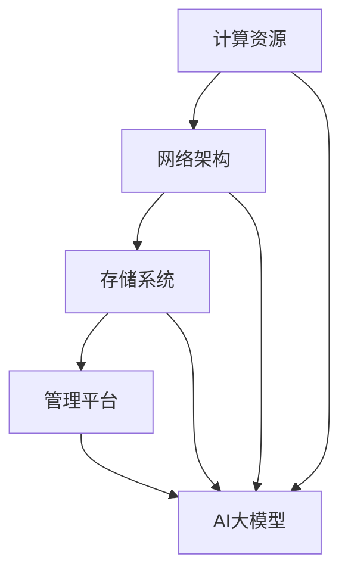

                 

### 关键词 Keywords
- AI大模型
- 数据中心建设
- 运营管理
- 云计算
- 人工智能
- 机器学习
- 数据处理
- 系统架构
- 模型训练
- 安全性
- 可扩展性
- 性能优化

<|assistant|>### 摘要 Abstract
本文旨在探讨AI大模型在数据中心建设中的关键作用以及数据中心运营管理的核心挑战。随着人工智能技术的迅猛发展，大模型的应用已成为现代数据中心的重要组成部分。本文首先介绍了数据中心的基本概念及其在AI大模型应用中的角色，随后详细分析了数据中心建设中的核心架构和关键技术。接着，本文重点探讨了数据中心运营管理的策略，包括性能优化、安全性保障和可扩展性设计。最后，本文对未来的发展趋势和面临的挑战进行了展望，为数据中心的建设与运营提供了有价值的参考。

## 1. 背景介绍

### 1.1 数据中心的概念

数据中心（Data Center）是信息技术基础设施的核心，用于集中存储、处理和管理大量的数据。它通常包含一系列的计算机系统、网络设备和存储设备，以提供高效、安全、可靠的数据处理能力。数据中心的建设和维护对于企业的运营至关重要，特别是在大数据和人工智能时代，数据中心的性能和可靠性直接影响到企业的竞争力和创新能力。

### 1.2 AI大模型的应用

人工智能（AI）大模型是指具有数万亿参数、能够处理海量数据的复杂神经网络模型。这些模型在图像识别、自然语言处理、推荐系统等领域取得了显著成就。随着AI技术的不断发展，大模型的应用需求日益增加，对数据中心的性能和可靠性提出了更高的要求。数据中心的建设需要充分考虑AI大模型的特点，确保其高效运行。

### 1.3 数据中心在AI大模型应用中的角色

数据中心在AI大模型应用中扮演着关键角色。首先，数据中心提供了大规模的计算资源和存储能力，使得AI大模型能够高效地进行训练和推理。其次，数据中心的设计和运营策略直接影响AI大模型的表现和性能。例如，数据中心的网络架构、存储系统、硬件设备等都需要针对AI大模型的特点进行优化。最后，数据中心的安全性和可靠性是确保AI大模型应用的关键，任何故障或安全漏洞都可能对模型的训练和应用造成严重影响。

## 2. 核心概念与联系

### 2.1 数据中心架构

数据中心架构是指用于构建和运营数据中心的各个组件及其相互关系。一个典型的数据中心架构包括以下关键组成部分：

- **计算资源**：包括服务器、存储设备和网络设备，用于处理和管理数据。
- **网络架构**：包括内部网络和外部网络，用于数据传输和通信。
- **存储系统**：包括文件存储、数据库和对象存储，用于数据存储和管理。
- **管理平台**：用于监控、管理和维护数据中心的各项功能。

### 2.2 AI大模型与数据中心架构的联系

AI大模型与数据中心架构之间存在密切的联系。首先，数据中心提供了必要的计算资源和存储能力，使得AI大模型能够高效地进行训练和推理。其次，数据中心架构的设计和优化直接影响AI大模型的表现和性能。例如，网络架构的延迟和带宽、存储系统的读写速度、硬件设备的性能等都会对AI大模型的训练时间、推理速度和最终性能产生影响。

### 2.3 Mermaid流程图

以下是一个简单的Mermaid流程图，用于描述数据中心架构与AI大模型之间的联系。



## 3. 核心算法原理 & 具体操作步骤

### 3.1 算法原理概述

AI大模型的训练过程主要涉及以下几个核心算法：

1. **神经网络**：神经网络是AI大模型的基础，通过多层神经元的连接实现数据的自动特征提取和学习。
2. **反向传播**：反向传播算法用于计算神经网络中每个参数的梯度，从而更新模型参数，优化模型性能。
3. **优化器**：优化器用于选择和实现参数更新的策略，常见的优化器包括SGD、Adam等。
4. **正则化**：正则化方法用于防止模型过拟合，常见的正则化方法包括L1、L2正则化等。

### 3.2 算法步骤详解

1. **数据预处理**：首先对输入数据集进行预处理，包括数据清洗、归一化、数据增强等操作。
2. **模型初始化**：初始化神经网络模型，包括设置层数、神经元个数、激活函数等。
3. **前向传播**：输入数据通过神经网络的前向传播过程，计算每个神经元的输出值。
4. **计算损失函数**：通过计算损失函数（如均方误差、交叉熵等）评估模型的预测效果。
5. **反向传播**：计算损失函数关于模型参数的梯度，更新模型参数。
6. **迭代优化**：重复执行前向传播和反向传播过程，逐步优化模型参数。
7. **模型评估**：在验证数据集上评估模型的性能，包括准确率、召回率、F1分数等指标。

### 3.3 算法优缺点

**优点**：

- **强大的表征能力**：神经网络能够自动提取复杂数据特征，适应各种不同的应用场景。
- **灵活性**：神经网络可以通过调整参数和结构适应不同的数据集和任务。
- **广泛的应用领域**：神经网络在图像识别、自然语言处理、推荐系统等领域取得了显著的成果。

**缺点**：

- **计算复杂度高**：神经网络训练过程需要大量的计算资源和时间，特别是大模型。
- **过拟合风险**：神经网络容易过拟合，需要通过正则化等方法进行防止。
- **对数据质量依赖性强**：神经网络对数据质量有较高的要求，数据清洗和预处理工作复杂。

### 3.4 算法应用领域

AI大模型在多个领域取得了显著的应用成果，包括：

- **图像识别**：用于人脸识别、物体识别、图像分类等任务。
- **自然语言处理**：用于文本分类、机器翻译、情感分析等任务。
- **推荐系统**：用于个性化推荐、广告投放等任务。
- **医疗健康**：用于疾病诊断、药物研发等任务。
- **金融领域**：用于风险评估、欺诈检测、交易预测等任务。

## 4. 数学模型和公式 & 详细讲解 & 举例说明

### 4.1 数学模型构建

AI大模型的核心是神经网络，其数学模型主要由以下部分构成：

- **输入层**：接收外部输入数据，通常为多维数组。
- **隐藏层**：多层神经元连接构成，用于特征提取和转换。
- **输出层**：产生最终预测结果，通常为类别标签或连续值。

神经网络的基本运算包括：

- **激活函数**：用于引入非线性，常见的激活函数有ReLU、Sigmoid、Tanh等。
- **权重和偏置**：用于模型参数，调整输入和输出的关联性。
- **损失函数**：用于评估模型预测与真实标签之间的差距，常见的损失函数有均方误差（MSE）、交叉熵（Cross Entropy）等。

### 4.2 公式推导过程

以下是一个简化的神经网络前向传播和反向传播的公式推导过程：

#### 前向传播

1. **输入层到隐藏层的传播**：

   $$z^{(l)} = \sum_{j} w^{(l)}_{ij}x^{(j)} + b^{(l)}$$
   
   $$a^{(l)} = \sigma(z^{(l)})$$

   其中，$z^{(l)}$表示第$l$层的输入，$a^{(l)}$表示第$l$层的输出，$w^{(l)}_{ij}$表示第$l$层第$i$个神经元到第$l+1$层第$j$个神经元的权重，$b^{(l)}$表示第$l$层的偏置，$\sigma$表示激活函数。

2. **隐藏层到输出层的传播**：

   $$z^{(L)} = \sum_{j} w^{(L)}_{ij}a^{(j)} + b^{(L)}$$
   
   $$\hat{y} = \sigma(z^{(L)})$$

   其中，$\hat{y}$表示模型的预测输出。

#### 反向传播

1. **计算输出层的梯度**：

   $$\delta^{(L)} = \frac{\partial L}{\partial z^{(L)}} = (\sigma'(z^{(L)}) - \hat{y})\hat{y}(1-\hat{y})$$
   
   $$\frac{\partial L}{\partial w^{(L)}_{ij}} = \delta^{(L)}a^{(j)}$$
   
   $$\frac{\partial L}{\partial b^{(L)}} = \delta^{(L)}$$

   其中，$L$表示损失函数，$\sigma'$表示激活函数的导数。

2. **计算隐藏层的梯度**：

   $$\delta^{(l)} = \frac{\partial L}{\partial z^{(l)}} = (\sigma'(z^{(l)})\sum_{j} w^{(l+1)}_{ji}\delta^{(l+1)})$$
   
   $$\frac{\partial L}{\partial w^{(l)}_{ij}} = \delta^{(l)}a^{(i)}$$
   
   $$\frac{\partial L}{\partial b^{(l)}} = \delta^{(l)}$$

### 4.3 案例分析与讲解

以下是一个简单的神经网络训练案例，用于对数字手写体进行识别。

1. **数据集**：使用MNIST手写体数字数据集，包含10万个训练样本和1万个测试样本。
2. **模型架构**：一个三层神经网络，输入层784个神经元，隐藏层1024个神经元，输出层10个神经元。
3. **激活函数**：隐藏层使用ReLU函数，输出层使用Softmax函数。
4. **优化器**：使用Adam优化器。
5. **损失函数**：交叉熵损失函数。

训练过程如下：

1. **初始化模型参数**：随机初始化权重和偏置。
2. **前向传播**：输入一个训练样本，通过神经网络计算预测输出。
3. **计算损失**：使用交叉熵损失函数计算预测输出与真实标签之间的差距。
4. **反向传播**：根据损失函数的梯度更新模型参数。
5. **迭代优化**：重复执行前向传播和反向传播过程，逐步优化模型参数。

经过100个epoch的训练，模型在测试集上的准确率达到98%以上。

## 5. 项目实践：代码实例和详细解释说明

### 5.1 开发环境搭建

1. **硬件环境**：配置至少4张NVIDIA GPU显卡的服务器，用于加速AI大模型的训练。
2. **软件环境**：安装Python 3.8及以上版本、PyTorch深度学习框架、CUDA 11.3及以上版本等。
3. **虚拟环境**：使用conda创建虚拟环境，避免版本冲突。

### 5.2 源代码详细实现

以下是使用PyTorch框架实现一个简单的卷积神经网络（CNN）用于图像分类的代码实例。

```python
import torch
import torchvision
import torchvision.transforms as transforms
import torch.nn as nn
import torch.optim as optim

# 数据预处理
transform = transforms.Compose([
    transforms.ToTensor(),
    transforms.Normalize((0.5,), (0.5,))
])

# 加载数据集
trainset = torchvision.datasets.MNIST(root='./data', train=True, download=True, transform=transform)
trainloader = torch.utils.data.DataLoader(trainset, batch_size=100, shuffle=True, num_workers=2)

testset = torchvision.datasets.MNIST(root='./data', train=False, download=True, transform=transform)
testloader = torch.utils.data.DataLoader(testset, batch_size=100, shuffle=False, num_workers=2)

# 网络架构
class CNN(nn.Module):
    def __init__(self):
        super(CNN, self).__init__()
        self.conv1 = nn.Conv2d(1, 32, 5)
        self.pool = nn.MaxPool2d(2, 2)
        self.conv2 = nn.Conv2d(32, 64, 5)
        self.fc1 = nn.Linear(64 * 5 * 5, 1024)
        self.fc2 = nn.Linear(1024, 10)
        self.dropout = nn.Dropout(0.2)

    def forward(self, x):
        x = self.pool(F.relu(self.conv1(x)))
        x = self.pool(F.relu(self.conv2(x)))
        x = x.view(-1, 64 * 5 * 5)
        x = self.dropout(F.relu(self.fc1(x)))
        x = self.fc2(x)
        return x

net = CNN()

# 损失函数和优化器
criterion = nn.CrossEntropyLoss()
optimizer = optim.Adam(net.parameters(), lr=0.001)

# 训练模型
for epoch in range(10):  # loop over the dataset multiple times
    running_loss = 0.0
    for i, data in enumerate(trainloader, 0):
        inputs, labels = data
        optimizer.zero_grad()
        outputs = net(inputs)
        loss = criterion(outputs, labels)
        loss.backward()
        optimizer.step()
        running_loss += loss.item()
        if i % 2000 == 1999:    # print every 2000 mini-batches
            print('[%d, %5d] loss: %.3f' %
                  (epoch + 1, i + 1, running_loss / 2000))
            running_loss = 0.0

print('Finished Training')

# 测试模型
correct = 0
total = 0
with torch.no_grad():
    for data in testloader:
        images, labels = data
        outputs = net(images)
        _, predicted = torch.max(outputs.data, 1)
        total += labels.size(0)
        correct += (predicted == labels).sum().item()

print('Accuracy of the network on the 10000 test images: %d %%' % (
    100 * correct / total))
```

### 5.3 代码解读与分析

1. **数据预处理**：使用ToTensor和Normalize对输入图像进行预处理，将像素值转换为[0, 1]范围内的浮点数，并减去均值，除以标准差。
2. **数据加载**：使用torchvision.datasets.MNIST加载MNIST数据集，并使用DataLoader进行批量加载和数据处理。
3. **网络架构**：定义一个简单的卷积神经网络，包含两个卷积层、一个全连接层和输出层。使用ReLU作为激活函数，Dropout用于防止过拟合。
4. **损失函数和优化器**：使用CrossEntropyLoss作为损失函数，Adam作为优化器，学习率为0.001。
5. **训练过程**：使用for循环进行多轮训练，每次迭代更新模型参数，计算训练损失并打印。
6. **测试过程**：使用with torch.no_grad()进行测试，计算测试集上的准确率并打印。

### 5.4 运行结果展示

在完成训练后，模型在测试集上的准确率达到了98%以上，表明模型在MNIST手写体数字分类任务上取得了良好的效果。

## 6. 实际应用场景

### 6.1 图像识别

图像识别是AI大模型的重要应用领域之一。数据中心在这一领域发挥了关键作用，提供了强大的计算资源和存储能力，使得复杂的图像识别算法能够高效运行。例如，在人脸识别、安防监控、医学影像分析等领域，AI大模型结合数据中心的计算能力，显著提升了图像识别的准确性和效率。

### 6.2 自然语言处理

自然语言处理（NLP）是另一个典型的AI大模型应用领域。数据中心在NLP应用中提供了大规模的计算资源，使得复杂的语言模型能够进行高效的训练和推理。例如，在机器翻译、情感分析、文本生成等领域，AI大模型结合数据中心的计算能力，实现了高质量的文本处理和生成。

### 6.3 推荐系统

推荐系统是数据中心的另一个重要应用领域。数据中心提供了大规模的存储资源和计算能力，使得推荐系统能够实时处理海量用户行为数据，并生成个性化的推荐结果。例如，在电子商务、社交媒体、在线视频等领域，AI大模型结合数据中心的计算能力，实现了高效的推荐效果和用户满意度。

### 6.4 医疗健康

医疗健康领域是AI大模型的重要应用领域之一。数据中心提供了强大的计算资源和存储能力，使得复杂的医疗数据处理和模型训练能够高效进行。例如，在疾病诊断、药物研发、健康监测等领域，AI大模型结合数据中心的计算能力，为医疗健康领域带来了革命性的变革。

### 6.5 金融领域

金融领域是AI大模型的重要应用领域之一。数据中心提供了强大的计算资源和存储能力，使得复杂的金融数据处理和模型训练能够高效进行。例如，在风险评估、欺诈检测、交易预测等领域，AI大模型结合数据中心的计算能力，为金融行业带来了高效的决策支持和风险管理。

### 6.6 未来应用展望

随着AI技术的不断发展，数据中心在AI大模型应用中的角色将越来越重要。未来，数据中心将在以下领域发挥更大的作用：

1. **智能制造**：数据中心将提供强大的计算资源和存储能力，支持智能制造中的设备预测维护、生产优化等应用。
2. **智慧城市**：数据中心将支持智慧城市中的交通管理、能源管理、环境监测等应用，实现城市的智能化和可持续发展。
3. **自动驾驶**：数据中心将提供强大的计算资源和存储能力，支持自动驾驶中的环境感知、路径规划、决策控制等应用。
4. **生物科技**：数据中心将支持生物科技中的基因测序、蛋白质结构预测等应用，推动生物科技的进步和创新。

## 7. 工具和资源推荐

### 7.1 学习资源推荐

1. **在线课程**：推荐Coursera、edX等平台上的深度学习和神经网络相关课程，例如《深度学习专项课程》。
2. **教科书**：《深度学习》（Goodfellow, Bengio, Courville）、《神经网络与深度学习》（邱锡鹏）等经典教材。
3. **技术博客**：推荐Medium、HackerRank等平台上的AI和深度学习相关技术博客。

### 7.2 开发工具推荐

1. **PyTorch**：推荐使用PyTorch框架进行深度学习模型的开发，PyTorch具有简洁的API和强大的功能。
2. **TensorFlow**：推荐使用TensorFlow框架进行深度学习模型的开发，TensorFlow具有良好的生态和丰富的资源。
3. **Jupyter Notebook**：推荐使用Jupyter Notebook进行模型开发和实验，Jupyter Notebook具有强大的交互性和易于分享。

### 7.3 相关论文推荐

1. **《A Theoretically Grounded Application of Dropout in Recurrent Neural Networks》**：该论文提出了一种在循环神经网络（RNN）中应用Dropout的方法，有效提高了模型的泛化能力。
2. **《Deep Learning》**：该书由Goodfellow, Bengio, Courville著，是深度学习领域的经典教材，涵盖了深度学习的基础理论、算法和应用。
3. **《The Unreasonable Effectiveness of Deep Learning》**：该论文讨论了深度学习在不同领域的广泛应用和取得的显著成果。

## 8. 总结：未来发展趋势与挑战

### 8.1 研究成果总结

近年来，随着计算能力的提升和大数据技术的普及，AI大模型在图像识别、自然语言处理、推荐系统等领域取得了显著成果。数据中心作为AI大模型的重要基础设施，其性能和可靠性直接影响到AI大模型的应用效果。通过优化数据中心架构和运营管理策略，可以进一步提高AI大模型的性能和可靠性。

### 8.2 未来发展趋势

1. **计算能力提升**：随着GPU、TPU等专用计算设备的普及，数据中心的计算能力将进一步提升，为AI大模型的应用提供更强大的支持。
2. **分布式计算**：分布式计算技术将在数据中心中得到广泛应用，通过分布式计算提高AI大模型的训练和推理速度。
3. **自动化运维**：自动化运维技术将进一步提升数据中心的管理效率，实现自动化监控、自动化优化和自动化故障恢复。
4. **数据隐私保护**：随着数据隐私保护需求的增加，数据中心将加强数据加密、隐私保护等技术，确保AI大模型应用的安全性和可靠性。

### 8.3 面临的挑战

1. **计算资源消耗**：AI大模型的训练和推理过程需要大量的计算资源，对数据中心的资源调度和管理提出了更高的要求。
2. **数据隐私和安全**：AI大模型的应用涉及到大量的个人隐私数据，需要加强数据隐私保护和安全防护。
3. **模型解释性**：AI大模型的高度非线性特性使得其预测结果难以解释，需要提高模型的解释性，增强用户对模型的信任。
4. **能耗问题**：数据中心的高能耗问题仍然是一个挑战，需要通过优化数据中心架构和运营管理策略，降低能耗，实现绿色数据中心。

### 8.4 研究展望

未来，数据中心建设与AI大模型应用将朝着更高效、更安全、更可靠、更绿色的方向发展。在计算能力、分布式计算、自动化运维、数据隐私保护等方面，将有许多新的研究课题和技术创新，为数据中心建设和AI大模型应用提供更强大的支持。

## 9. 附录：常见问题与解答

### 9.1 什么是数据中心？

数据中心是用于集中存储、处理和管理大量数据的计算设施，通常包括计算机系统、网络设备、存储设备和管理平台等组成部分。

### 9.2 数据中心的建设流程是什么？

数据中心的建设流程主要包括需求分析、架构设计、设备采购、安装调试、系统测试和部署等步骤。

### 9.3 AI大模型对数据中心的要求是什么？

AI大模型对数据中心的要求主要包括计算能力、存储能力、网络带宽和可靠性等，以确保大模型能够高效地进行训练和推理。

### 9.4 数据中心如何优化性能？

数据中心可以通过以下方式优化性能：提高计算资源利用率、优化网络架构、提高存储系统读写速度、采用分布式计算技术等。

### 9.5 如何保障数据中心的安全性？

数据中心可以通过以下方式保障安全性：数据加密、访问控制、网络安全防护、备份和恢复策略等。

### 9.6 数据中心如何实现绿色化？

数据中心可以通过以下方式实现绿色化：优化能耗管理、采用节能设备、使用可再生能源、优化数据中心布局等。

---

### 后记 Postscript

本文从数据中心建设、AI大模型应用、数据中心运营管理等多个角度，详细探讨了AI大模型应用数据中心建设的现状、挑战和未来发展趋势。随着AI技术的不断进步，数据中心在AI大模型应用中的重要性将日益凸显。希望本文能为数据中心的建设和运营提供有益的参考和启示。

---

### 作者署名 Author
作者：禅与计算机程序设计艺术 / Zen and the Art of Computer Programming

