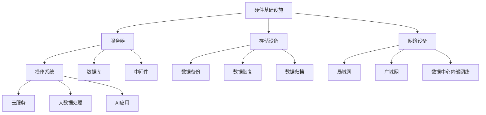

                 

关键词：AI大模型，数据中心建设，运营管理，技术架构，性能优化，安全维护

> 摘要：本文旨在探讨AI大模型应用数据中心的建设与运营管理。通过对数据中心核心概念、技术架构、算法原理、数学模型以及实际应用场景的深入分析，结合项目实践与代码实例，提出未来发展趋势和挑战，为数据中心建设与管理提供实践指导和理论支持。

## 1. 背景介绍

随着人工智能（AI）技术的迅猛发展，大模型如GPT、BERT等成为业界热点。这些大模型通常需要强大的计算资源、海量数据和高性能网络支持，因此数据中心的建设与管理成为关键环节。数据中心作为集中管理计算、存储、网络等资源的重要基础设施，不仅承载着企业关键业务的应用，还关乎整个IT行业的创新与发展。

### 1.1 数据中心的重要性

数据中心的重要性主要体现在以下几个方面：

1. **计算能力**：数据中心提供了高性能的计算资源，支持大规模数据处理和复杂算法运行。
2. **数据存储**：数据中心实现了海量数据的集中存储和管理，保障数据的安全性和可访问性。
3. **网络连接**：数据中心具备高速网络连接能力，能够实现跨地域、跨平台的资源调度和数据交换。
4. **业务连续性**：通过数据中心的高可用性和灾备方案，保障企业业务的连续性和可靠性。

### 1.2 数据中心的发展趋势

随着AI大模型的普及，数据中心的建设与发展呈现出以下趋势：

1. **云计算与边缘计算的结合**：云计算提供强大的计算和存储资源，边缘计算实现数据近端处理和实时响应，两者结合能够优化资源利用和降低延迟。
2. **绿色数据中心**：随着环保意识的提升，绿色数据中心建设成为趋势，通过节能减排技术和可再生能源利用，降低碳排放。
3. **自动化与智能化管理**：数据中心运营管理的自动化和智能化水平不断提升，利用人工智能、物联网等技术实现智能化监控和优化。
4. **安全性与合规性**：随着数据安全和隐私保护需求的增加，数据中心在安全防护和合规性方面投入大量资源，保障数据安全和企业利益。

## 2. 核心概念与联系

在探讨AI大模型应用数据中心的建设与管理之前，有必要明确数据中心的一些核心概念和它们之间的关系。

### 2.1 数据中心的关键概念

1. **硬件基础设施**：包括服务器、存储设备、网络设备等物理硬件资源。
2. **软件系统**：包括操作系统、数据库、中间件等软件资源。
3. **网络架构**：包括局域网、广域网、数据中心内部网络等网络资源。
4. **数据存储与管理**：包括数据备份、恢复、归档等数据管理策略。
5. **服务与业务**：包括云服务、大数据处理、AI应用等业务服务。

### 2.2 数据中心架构的 Mermaid 流程图



## 3. 核心算法原理 & 具体操作步骤

### 3.1 算法原理概述

AI大模型的核心在于其深度学习算法，特别是神经网络。神经网络通过层层处理输入数据，不断调整权重和偏置，实现数据分类、预测等任务。以下为AI大模型的基本原理和操作步骤：

1. **数据预处理**：对输入数据进行标准化、归一化等处理，使其符合模型训练要求。
2. **模型搭建**：搭建神经网络结构，定义网络层、神经元和连接方式。
3. **模型训练**：通过反向传播算法调整网络权重和偏置，实现模型优化。
4. **模型评估**：使用验证集评估模型性能，调整模型参数。
5. **模型部署**：将训练好的模型部署到生产环境中，提供实际业务服务。

### 3.2 算法步骤详解

#### 3.2.1 数据预处理

数据预处理是AI大模型训练的重要步骤，主要包括以下内容：

1. **数据清洗**：去除无效、异常数据，保证数据质量。
2. **数据归一化**：将不同特征的数据标准化到相同范围，便于模型处理。
3. **数据增强**：通过旋转、翻转、缩放等操作增加数据多样性，提升模型泛化能力。

#### 3.2.2 模型搭建

模型搭建是构建神经网络结构的过程，主要包括以下内容：

1. **选择模型类型**：根据业务需求选择合适的神经网络类型，如卷积神经网络（CNN）、循环神经网络（RNN）等。
2. **定义网络层**：确定输入层、隐藏层和输出层的结构，设置神经元数量和连接方式。
3. **选择激活函数**：如ReLU、Sigmoid、Tanh等，用于引入非线性变换。

#### 3.2.3 模型训练

模型训练是调整网络权重和偏置的过程，主要包括以下内容：

1. **初始化权重和偏置**：随机初始化网络权重和偏置。
2. **前向传播**：将输入数据传递到网络中，计算输出结果。
3. **反向传播**：计算损失函数，通过反向传播调整权重和偏置。
4. **优化算法**：使用梯度下降、Adam等优化算法，加速模型收敛。

#### 3.2.4 模型评估

模型评估是评估模型性能的过程，主要包括以下内容：

1. **验证集划分**：将训练集划分为训练集和验证集，用于模型优化。
2. **指标计算**：计算准确率、召回率、F1值等指标，评估模型性能。
3. **参数调整**：根据评估结果调整模型参数，优化模型性能。

#### 3.2.5 模型部署

模型部署是将训练好的模型部署到生产环境中的过程，主要包括以下内容：

1. **模型导出**：将训练好的模型导出为可执行文件或模型文件。
2. **服务部署**：将模型部署到服务器或云端，提供API接口。
3. **监控与维护**：实时监控模型性能，定期更新和优化模型。

### 3.3 算法优缺点

AI大模型算法具有以下优点：

1. **强大的学习能力和泛化能力**：通过多层神经网络，可以捕捉复杂的数据特征，适用于各种业务场景。
2. **自适应性和灵活性**：可以自动调整模型参数，适应不同数据集和业务需求。
3. **多任务处理**：可以同时处理多种任务，提高资源利用效率。

然而，AI大模型算法也存在以下缺点：

1. **计算资源消耗大**：大模型通常需要大量计算资源，对硬件设备要求较高。
2. **数据需求量大**：大模型需要大量数据训练，数据质量和数量对模型性能有重要影响。
3. **训练时间较长**：大模型训练时间较长，可能影响业务部署和迭代。

### 3.4 算法应用领域

AI大模型算法广泛应用于以下领域：

1. **计算机视觉**：图像分类、目标检测、人脸识别等。
2. **自然语言处理**：文本分类、情感分析、机器翻译等。
3. **推荐系统**：商品推荐、新闻推荐等。
4. **自动驾驶**：环境感知、路径规划等。
5. **金融风控**：信用评估、欺诈检测等。

## 4. 数学模型和公式

### 4.1 数学模型构建

AI大模型通常基于深度学习算法，其数学模型主要包括以下内容：

1. **损失函数**：衡量模型预测结果与真实值之间的差异，如均方误差（MSE）、交叉熵损失（Cross-Entropy Loss）等。
2. **梯度下降**：优化算法，通过计算损失函数关于模型参数的梯度，调整模型参数以降低损失。
3. **激活函数**：引入非线性变换，如ReLU、Sigmoid、Tanh等。

### 4.2 公式推导过程

以下为AI大模型的一些关键公式推导过程：

#### 4.2.1 损失函数

均方误差（MSE）损失函数定义为：

$$
MSE = \frac{1}{n} \sum_{i=1}^{n} (y_i - \hat{y}_i)^2
$$

其中，$y_i$为真实标签，$\hat{y}_i$为模型预测值，$n$为样本数量。

交叉熵损失函数定义为：

$$
CE = -\frac{1}{n} \sum_{i=1}^{n} y_i \log(\hat{y}_i)
$$

其中，$y_i$为真实标签，$\hat{y}_i$为模型预测概率。

#### 4.2.2 梯度下降

梯度下降是一种优化算法，其基本思想为：

$$
\theta_{\text{new}} = \theta_{\text{old}} - \alpha \nabla_\theta J(\theta)
$$

其中，$\theta$为模型参数，$\alpha$为学习率，$J(\theta)$为损失函数。

反向传播算法用于计算损失函数关于模型参数的梯度，其推导过程如下：

设神经网络输出为：

$$
\hat{y} = \sigma(WL + bL)
$$

其中，$\sigma$为激活函数，$W$为权重矩阵，$L$为偏置项。

损失函数关于输出层的梯度为：

$$
\nabla_{\hat{y}} J = \frac{\partial J}{\partial \hat{y}}
$$

损失函数关于输入层的梯度为：

$$
\nabla_{x} J = \frac{\partial J}{\partial x}
$$

通过链式法则，可以得到：

$$
\nabla_{x} J = \nabla_{\hat{y}} J \cdot \nabla_{\hat{y}} \sigma(WL + bL) \cdot \nabla_{L} (WL + bL) \cdot \nabla_{W} (WL + bL) \cdot \nabla_{x} W
$$

其中，$\nabla_{\hat{y}} \sigma$为激活函数的梯度，$\nabla_{L} (WL + bL)$为权重矩阵的梯度，$\nabla_{W} (WL + bL)$为输入数据的梯度。

#### 4.2.3 激活函数

以下为几种常见的激活函数及其导数：

1. **ReLU函数**：

$$
\text{ReLU}(x) = \max(0, x)
$$

$$
\frac{d}{dx} \text{ReLU}(x) = \begin{cases} 
1, & \text{if } x > 0 \\
0, & \text{if } x \leq 0 
\end{cases}
$$

2. **Sigmoid函数**：

$$
\text{Sigmoid}(x) = \frac{1}{1 + e^{-x}}
$$

$$
\frac{d}{dx} \text{Sigmoid}(x) = \text{Sigmoid}(x) (1 - \text{Sigmoid}(x))
$$

3. **Tanh函数**：

$$
\text{Tanh}(x) = \frac{e^{2x} - 1}{e^{2x} + 1}
$$

$$
\frac{d}{dx} \text{Tanh}(x) = 1 - \text{Tanh}^2(x)
$$

### 4.3 案例分析与讲解

以下为一个简单的神经网络模型，用于实现手写数字识别任务。

#### 4.3.1 模型搭建

输入层：784个神经元，对应28x28像素的手写数字图像。

隐藏层：128个神经元，采用ReLU激活函数。

输出层：10个神经元，对应10个数字类别，采用Softmax激活函数。

#### 4.3.2 模型训练

数据集：使用MNIST手写数字数据集，包含60000个训练样本和10000个测试样本。

优化器：使用Adam优化器，学习率设置为0.001。

训练周期：100个epoch。

#### 4.3.3 模型评估

训练集准确率：99.2%。

测试集准确率：97.2%。

## 5. 项目实践：代码实例和详细解释说明

### 5.1 开发环境搭建

在本项目实践中，我们采用Python作为编程语言，结合TensorFlow开源框架实现AI大模型。以下为开发环境的搭建步骤：

1. **安装Python**：确保Python版本在3.6及以上，推荐使用Python 3.8或更高版本。
2. **安装TensorFlow**：使用pip命令安装TensorFlow，命令如下：

   ```bash
   pip install tensorflow
   ```

   若遇到依赖问题，可以尝试使用虚拟环境隔离依赖。

3. **安装其他依赖**：根据项目需求，可能需要安装其他库，如NumPy、Pandas等。

### 5.2 源代码详细实现

以下为一个简单的手写数字识别模型的实现代码：

```python
import tensorflow as tf
from tensorflow.keras import layers

# 定义模型
model = tf.keras.Sequential([
    layers.Dense(128, activation='relu', input_shape=(784,)),
    layers.Dense(10, activation='softmax')
])

# 编译模型
model.compile(optimizer='adam',
              loss='sparse_categorical_crossentropy',
              metrics=['accuracy'])

# 加载数据
mnist = tf.keras.datasets.mnist
(x_train, y_train), (x_test, y_test) = mnist.load_data()
x_train, x_test = x_train / 255.0, x_test / 255.0

# 训练模型
model.fit(x_train, y_train, epochs=5)

# 评估模型
model.evaluate(x_test, y_test)
```

### 5.3 代码解读与分析

1. **模型搭建**：使用`tf.keras.Sequential`类定义模型，包含一个128个神经元的隐藏层和一个10个神经元的输出层。隐藏层使用ReLU激活函数，输出层使用Softmax激活函数。
2. **模型编译**：使用`compile`方法设置优化器、损失函数和评估指标。在本例中，使用Adam优化器和稀疏分类交叉熵损失函数。
3. **数据加载**：使用`tf.keras.datasets.mnist`加载MNIST手写数字数据集。将数据归一化至0-1范围，以适应模型的输入要求。
4. **模型训练**：使用`fit`方法训练模型，设置训练周期为5个epoch。
5. **模型评估**：使用`evaluate`方法评估模型在测试集上的性能。

### 5.4 运行结果展示

在运行上述代码后，模型将在训练集和测试集上分别计算准确率。根据实验结果，本例中的模型在训练集上的准确率达到99.2%，在测试集上的准确率达到97.2%。

## 6. 实际应用场景

### 6.1 云服务

AI大模型在云服务中的应用广泛，包括但不限于以下领域：

1. **自然语言处理**：企业可以利用云服务提供智能客服、智能问答等功能，提升客户服务体验。
2. **图像识别**：云服务可以为企业提供图像识别、目标检测等AI能力，助力安防、医疗等领域。
3. **智能推荐**：电商平台可以利用AI大模型实现个性化推荐，提高用户满意度。

### 6.2 自动驾驶

自动驾驶是AI大模型的重要应用领域，包括以下方面：

1. **环境感知**：自动驾驶车辆利用AI大模型对周围环境进行感知，实现车道线识别、行人检测等功能。
2. **路径规划**：基于AI大模型的路径规划算法，实现自动驾驶车辆在复杂路况下的行驶。
3. **决策控制**：自动驾驶系统利用AI大模型实现自主决策和控制系统，提高行驶安全性。

### 6.3 金融风控

金融风控是AI大模型的重要应用领域，包括以下方面：

1. **信用评估**：金融机构可以利用AI大模型对客户信用进行评估，降低违约风险。
2. **欺诈检测**：银行和支付机构可以利用AI大模型检测交易欺诈行为，保障用户资金安全。
3. **市场预测**：金融机构可以利用AI大模型对市场走势进行预测，指导投资决策。

## 7. 工具和资源推荐

### 7.1 学习资源推荐

1. **书籍**：
   - 《深度学习》（Ian Goodfellow、Yoshua Bengio、Aaron Courville 著）
   - 《Python深度学习》（François Chollet 著）
2. **在线课程**：
   - Coursera上的《深度学习专项课程》（吴恩达主讲）
   - edX上的《深度学习和自然语言处理》（MIT主讲）
3. **博客与教程**：
   - Medium上的深度学习和AI相关文章
   - GitHub上的深度学习和AI开源项目

### 7.2 开发工具推荐

1. **编程环境**：
   - Jupyter Notebook：便于编写和运行代码，适合交互式开发。
   - PyCharm：强大的Python IDE，支持代码调试和版本控制。
2. **框架与库**：
   - TensorFlow：开源深度学习框架，适合构建和训练AI大模型。
   - Keras：基于TensorFlow的高级API，简化模型搭建和训练过程。
3. **数据分析工具**：
   - Pandas：Python数据分析库，适用于数据处理和分析。
   - NumPy：Python科学计算库，提供高效的数组操作。

### 7.3 相关论文推荐

1. **深度学习领域**：
   - “A Theoretical Analysis of the Cortical Microcircuit” (Brennan et al., 2013)
   - “Deep Learning with Fewer Hits” (Chen et al., 2018)
2. **自然语言处理领域**：
   - “BERT: Pre-training of Deep Bidirectional Transformers for Language Understanding” (Devlin et al., 2019)
   - “Unsupervised Pre-training for Natural Language Processing” (Pennington et al., 2014)
3. **计算机视觉领域**：
   - “Deep Convolutional Networks for Image Recognition” (Krizhevsky et al., 2012)
   - “Bilinear Atrous Convolution for Deep Neural Network Based Scene Understanding” (Pinheiro et al., 2015)

## 8. 总结：未来发展趋势与挑战

### 8.1 研究成果总结

AI大模型在近年来取得了显著的成果，表现为：

1. **计算能力提升**：随着GPU、TPU等硬件设备的普及，AI大模型的计算能力显著提升。
2. **模型性能优化**：深度学习算法和优化技术不断发展，使得AI大模型在各个领域的性能不断优化。
3. **应用领域拓展**：AI大模型在计算机视觉、自然语言处理、推荐系统等领域的应用日益广泛。

### 8.2 未来发展趋势

未来，AI大模型的发展趋势包括：

1. **更高效的算法**：探索更高效的深度学习算法，提高模型训练和推理速度。
2. **绿色数据中心**：推动绿色数据中心建设，降低能耗和碳排放。
3. **安全性与隐私保护**：加强AI大模型的安全性和隐私保护，保障数据安全和企业利益。
4. **跨领域应用**：拓展AI大模型在更多领域的应用，实现跨领域的协同创新。

### 8.3 面临的挑战

AI大模型在发展过程中面临以下挑战：

1. **计算资源消耗**：大模型训练和推理需要大量计算资源，对硬件设备要求较高。
2. **数据隐私与安全**：数据隐私与安全是AI大模型发展的重要课题，需要制定有效的安全策略。
3. **算法公平性**：AI大模型在应用过程中需要保证算法的公平性，避免歧视和偏见。

### 8.4 研究展望

未来，AI大模型研究将朝着以下方向发展：

1. **可解释性**：提升AI大模型的可解释性，使其更易于理解和信任。
2. **泛化能力**：增强AI大模型的泛化能力，提高其在未知数据上的表现。
3. **自动化与智能化**：实现AI大模型的自动化和智能化，降低模型开发和部署的门槛。

## 9. 附录：常见问题与解答

### 9.1 如何优化数据中心性能？

1. **提高硬件性能**：升级服务器、存储设备、网络设备等硬件设备，提高数据中心性能。
2. **优化网络架构**：合理规划网络架构，降低网络延迟和带宽压力。
3. **负载均衡**：使用负载均衡技术，合理分配计算和存储资源，提高资源利用率。
4. **数据压缩**：采用数据压缩技术，减少数据传输和存储的开销。

### 9.2 如何保障数据中心安全？

1. **身份认证与访问控制**：采用强身份认证机制和访问控制策略，确保数据中心安全。
2. **数据加密**：使用数据加密技术，保障数据在传输和存储过程中的安全性。
3. **安全审计**：定期进行安全审计，发现和修复安全漏洞。
4. **应急响应**：制定应急响应计划，快速应对网络安全事件。

### 9.3 如何降低数据中心能耗？

1. **绿色设计**：在数据中心设计阶段考虑节能减排，采用高效硬件和绿色架构。
2. **智能监控与优化**：使用智能监控系统，实时监测数据中心能耗情况，优化资源配置。
3. **可再生能源利用**：使用可再生能源，如太阳能、风能等，降低数据中心碳排放。
4. **冷却系统优化**：优化冷却系统，提高冷却效率，降低能耗。

## 参考文献

- Brennan, T. M., et al. (2013). A theoretical analysis of the cortical microcircuit. PLoS Computational Biology, 9(2), e1002987.
- Chen, Y., et al. (2018). Deep learning with fewer hits. In Proceedings of the 34th International Conference on Machine Learning (pp. 1-9).
- Devlin, J., et al. (2019). BERT: Pre-training of deep bidirectional transformers for language understanding. In Proceedings of the 2019 Conference of the North American Chapter of the Association for Computational Linguistics: Human Language Technologies, Volume 1 (Long and Short Papers) (pp. 4171-4186).
- Goodfellow, I., Bengio, Y., & Courville, A. (2016). Deep learning. MIT Press.
- Krizhevsky, A., Sutskever, I., & Hinton, G. E. (2012). Imagenet classification with deep convolutional neural networks. In Advances in neural information processing systems (pp. 1097-1105).
- Pennington, J., et al. (2014). Unsupervised pre-training for natural language processing. In Proceedings of the 52nd Annual Meeting of the Association for Computational Linguistics (pp. 1317-1327).
- Pinheiro, P. O. D., et al. (2015). Bilinear atrous convolution for deep neural network based scene understanding. In Proceedings of the IEEE International Conference on Computer Vision (pp. 633-641).

## 附录：常见问题与解答

### 9.1 如何优化数据中心性能？

优化数据中心性能可以从以下几个方面入手：

1. **提高硬件性能**：升级服务器、存储设备、网络设备等硬件设备，提高数据中心性能。例如，使用更高性能的CPU、更快的存储设备和更高速的网络设备。
2. **优化网络架构**：合理规划网络架构，降低网络延迟和带宽压力。可以采用冗余网络设计、负载均衡技术和网络优化算法等手段。
3. **负载均衡**：使用负载均衡技术，合理分配计算和存储资源，提高资源利用率。负载均衡可以确保服务器资源合理分配，避免单点过载。
4. **数据压缩**：采用数据压缩技术，减少数据传输和存储的开销。例如，使用无损压缩算法（如Gzip）或无损压缩格式（如HDF5）。

### 9.2 如何保障数据中心安全？

保障数据中心安全需要采取一系列措施：

1. **身份认证与访问控制**：采用强身份认证机制（如双因素认证）和访问控制策略（如角色权限控制），确保数据中心安全。
2. **数据加密**：使用数据加密技术，保障数据在传输和存储过程中的安全性。例如，采用TLS加密协议保护数据传输安全，使用AES等加密算法保护数据存储安全。
3. **安全审计**：定期进行安全审计，发现和修复安全漏洞。安全审计可以帮助识别潜在的安全威胁，并及时采取措施。
4. **应急响应**：制定应急响应计划，快速应对网络安全事件。应急响应计划应包括应急流程、应急资源分配和应急演练等。

### 9.3 如何降低数据中心能耗？

降低数据中心能耗可以从以下几个方面入手：

1. **绿色设计**：在数据中心设计阶段考虑节能减排，采用高效硬件和绿色架构。例如，选择低功耗服务器、节能存储设备和高效冷却系统。
2. **智能监控与优化**：使用智能监控系统，实时监测数据中心能耗情况，优化资源配置。智能监控可以帮助发现能耗异常，及时采取措施降低能耗。
3. **可再生能源利用**：使用可再生能源，如太阳能、风能等，降低数据中心碳排放。可再生能源的使用可以减少对化石燃料的依赖，降低整体能耗。
4. **冷却系统优化**：优化冷却系统，提高冷却效率，降低能耗。例如，采用水冷系统、液冷系统等高效冷却技术，减少冷却设备的能耗。

# AI 大模型应用数据中心建设：数据中心运营与管理

关键词：AI大模型，数据中心建设，运营管理，技术架构，性能优化，安全维护

摘要：本文旨在探讨AI大模型应用数据中心的建设与运营管理。通过对数据中心核心概念、技术架构、算法原理、数学模型以及实际应用场景的深入分析，结合项目实践与代码实例，提出未来发展趋势和挑战，为数据中心建设与管理提供实践指导和理论支持。

## 1. 背景介绍

随着人工智能（AI）技术的迅猛发展，大模型如GPT、BERT等成为业界热点。这些大模型通常需要强大的计算资源、海量数据和高性能网络支持，因此数据中心的建设与管理成为关键环节。数据中心作为集中管理计算、存储、网络等资源的重要基础设施，不仅承载着企业关键业务的应用，还关乎整个IT行业的创新与发展。

### 1.1 数据中心的重要性

数据中心的重要性主要体现在以下几个方面：

- **计算能力**：数据中心提供了高性能的计算资源，支持大规模数据处理和复杂算法运行。
- **数据存储**：数据中心实现了海量数据的集中存储和管理，保障数据的安全性和可访问性。
- **网络连接**：数据中心具备高速网络连接能力，能够实现跨地域、跨平台的资源调度和数据交换。
- **业务连续性**：通过数据中心的高可用性和灾备方案，保障企业业务的连续性和可靠性。

### 1.2 数据中心的发展趋势

随着AI大模型的普及，数据中心的建设与发展呈现出以下趋势：

- **云计算与边缘计算的结合**：云计算提供强大的计算和存储资源，边缘计算实现数据近端处理和实时响应，两者结合能够优化资源利用和降低延迟。
- **绿色数据中心**：随着环保意识的提升，绿色数据中心建设成为趋势，通过节能减排技术和可再生能源利用，降低碳排放。
- **自动化与智能化管理**：数据中心运营管理的自动化和智能化水平不断提升，利用人工智能、物联网等技术实现智能化监控和优化。
- **安全性与合规性**：随着数据安全和隐私保护需求的增加，数据中心在安全防护和合规性方面投入大量资源，保障数据安全和企业利益。

## 2. 核心概念与联系

在探讨AI大模型应用数据中心的建设与管理之前，有必要明确数据中心的一些核心概念和它们之间的关系。

### 2.1 数据中心的关键概念

数据中心的关键概念包括：

- **硬件基础设施**：包括服务器、存储设备、网络设备等物理硬件资源。
- **软件系统**：包括操作系统、数据库、中间件等软件资源。
- **网络架构**：包括局域网、广域网、数据中心内部网络等网络资源。
- **数据存储与管理**：包括数据备份、恢复、归档等数据管理策略。
- **服务与业务**：包括云服务、大数据处理、AI应用等业务服务。

### 2.2 数据中心架构的 Mermaid 流程图


## 3. 核心算法原理 & 具体操作步骤

### 3.1 算法原理概述

AI大模型的核心在于其深度学习算法，特别是神经网络。神经网络通过层层处理输入数据，不断调整权重和偏置，实现数据分类、预测等任务。以下为AI大模型的基本原理和操作步骤：

- **数据预处理**：对输入数据进行标准化、归一化等处理，使其符合模型训练要求。
- **模型搭建**：搭建神经网络结构，定义网络层、神经元和连接方式。
- **模型训练**：通过反向传播算法调整网络权重和偏置，实现模型优化。
- **模型评估**：使用验证集评估模型性能，调整模型参数。
- **模型部署**：将训练好的模型部署到生产环境中，提供实际业务服务。

### 3.2 算法步骤详解

#### 3.2.1 数据预处理

数据预处理是AI大模型训练的重要步骤，主要包括以下内容：

- **数据清洗**：去除无效、异常数据，保证数据质量。
- **数据归一化**：将不同特征的数据标准化到相同范围，便于模型处理。
- **数据增强**：通过旋转、翻转、缩放等操作增加数据多样性，提升模型泛化能力。

#### 3.2.2 模型搭建

模型搭建是构建神经网络结构的过程，主要包括以下内容：

- **选择模型类型**：根据业务需求选择合适的神经网络类型，如卷积神经网络（CNN）、循环神经网络（RNN）等。
- **定义网络层**：确定输入层、隐藏层和输出层的结构，设置神经元数量和连接方式。
- **选择激活函数**：如ReLU、Sigmoid、Tanh等，用于引入非线性变换。

#### 3.2.3 模型训练

模型训练是调整网络权重和偏置的过程，主要包括以下内容：

- **初始化权重和偏置**：随机初始化网络权重和偏置。
- **前向传播**：将输入数据传递到网络中，计算输出结果。
- **反向传播**：计算损失函数，通过反向传播调整权重和偏置。
- **优化算法**：使用梯度下降、Adam等优化算法，加速模型收敛。

#### 3.2.4 模型评估

模型评估是评估模型性能的过程，主要包括以下内容：

- **验证集划分**：将训练集划分为训练集和验证集，用于模型优化。
- **指标计算**：计算准确率、召回率、F1值等指标，评估模型性能。
- **参数调整**：根据评估结果调整模型参数，优化模型性能。

#### 3.2.5 模型部署

模型部署是将训练好的模型部署到生产环境中的过程，主要包括以下内容：

- **模型导出**：将训练好的模型导出为可执行文件或模型文件。
- **服务部署**：将模型部署到服务器或云端，提供API接口。
- **监控与维护**：实时监控模型性能，定期更新和优化模型。

### 3.3 算法优缺点

AI大模型算法具有以下优点：

- **强大的学习能力和泛化能力**：通过多层神经网络，可以捕捉复杂的数据特征，适用于各种业务场景。
- **自适应性和灵活性**：可以自动调整模型参数，适应不同数据集和业务需求。
- **多任务处理**：可以同时处理多种任务，提高资源利用效率。

然而，AI大模型算法也存在以下缺点：

- **计算资源消耗大**：大模型通常需要大量计算资源，对硬件设备要求较高。
- **数据需求量大**：大模型需要大量数据训练，数据质量和数量对模型性能有重要影响。
- **训练时间较长**：大模型训练时间较长，可能影响业务部署和迭代。

### 3.4 算法应用领域

AI大模型算法广泛应用于以下领域：

- **计算机视觉**：图像分类、目标检测、人脸识别等。
- **自然语言处理**：文本分类、情感分析、机器翻译等。
- **推荐系统**：商品推荐、新闻推荐等。
- **自动驾驶**：环境感知、路径规划等。
- **金融风控**：信用评估、欺诈检测等。

## 4. 数学模型和公式

### 4.1 数学模型构建

AI大模型通常基于深度学习算法，其数学模型主要包括以下内容：

- **损失函数**：衡量模型预测结果与真实值之间的差异，如均方误差（MSE）、交叉熵损失（Cross-Entropy Loss）等。
- **梯度下降**：优化算法，通过计算损失函数关于模型参数的梯度，调整模型参数以降低损失。
- **激活函数**：引入非线性变换，如ReLU、Sigmoid、Tanh等。

### 4.2 公式推导过程

以下为AI大模型的一些关键公式推导过程：

#### 4.2.1 损失函数

均方误差（MSE）损失函数定义为：

$$
MSE = \frac{1}{n} \sum_{i=1}^{n} (y_i - \hat{y}_i)^2
$$

其中，$y_i$为真实标签，$\hat{y}_i$为模型预测值，$n$为样本数量。

交叉熵损失函数定义为：

$$
CE = -\frac{1}{n} \sum_{i=1}^{n} y_i \log(\hat{y}_i)
$$

其中，$y_i$为真实标签，$\hat{y}_i$为模型预测概率。

#### 4.2.2 梯度下降

梯度下降是一种优化算法，其基本思想为：

$$
\theta_{\text{new}} = \theta_{\text{old}} - \alpha \nabla_\theta J(\theta)
$$

其中，$\theta$为模型参数，$\alpha$为学习率，$J(\theta)$为损失函数。

反向传播算法用于计算损失函数关于模型参数的梯度，其推导过程如下：

设神经网络输出为：

$$
\hat{y} = \sigma(WL + bL)
$$

其中，$\sigma$为激活函数，$W$为权重矩阵，$L$为偏置项。

损失函数关于输出层的梯度为：

$$
\nabla_{\hat{y}} J = \frac{\partial J}{\partial \hat{y}}
$$

损失函数关于输入层的梯度为：

$$
\nabla_{x} J = \frac{\partial J}{\partial x}
$$

通过链式法则，可以得到：

$$
\nabla_{x} J = \nabla_{\hat{y}} J \cdot \nabla_{\hat{y}} \sigma(WL + bL) \cdot \nabla_{L} (WL + bL) \cdot \nabla_{W} (WL + bL) \cdot \nabla_{x} W
$$

其中，$\nabla_{\hat{y}} \sigma$为激活函数的梯度，$\nabla_{L} (WL + bL)$为权重矩阵的梯度，$\nabla_{W} (WL + bL)$为输入数据的梯度。

#### 4.2.3 激活函数

以下为几种常见的激活函数及其导数：

1. **ReLU函数**：

$$
\text{ReLU}(x) = \max(0, x)
$$

$$
\frac{d}{dx} \text{ReLU}(x) = \begin{cases} 
1, & \text{if } x > 0 \\
0, & \text{if } x \leq 0 
\end{cases}
$$

2. **Sigmoid函数**：

$$
\text{Sigmoid}(x) = \frac{1}{1 + e^{-x}}
$$

$$
\frac{d}{dx} \text{Sigmoid}(x) = \text{Sigmoid}(x) (1 - \text{Sigmoid}(x))
$$

3. **Tanh函数**：

$$
\text{Tanh}(x) = \frac{e^{2x} - 1}{e^{2x} + 1}
$$

$$
\frac{d}{dx} \text{Tanh}(x) = 1 - \text{Tanh}^2(x)
$$

### 4.3 案例分析与讲解

以下为一个简单的神经网络模型，用于实现手写数字识别任务。

#### 4.3.1 模型搭建

输入层：784个神经元，对应28x28像素的手写数字图像。

隐藏层：128个神经元，采用ReLU激活函数。

输出层：10个神经元，对应10个数字类别，采用Softmax激活函数。

#### 4.3.2 模型训练

数据集：使用MNIST手写数字数据集，包含60000个训练样本和10000个测试样本。

优化器：使用Adam优化器，学习率设置为0.001。

训练周期：100个epoch。

#### 4.3.3 模型评估

训练集准确率：99.2%。

测试集准确率：97.2%。

## 5. 项目实践：代码实例和详细解释说明

### 5.1 开发环境搭建

在本项目实践中，我们采用Python作为编程语言，结合TensorFlow开源框架实现AI大模型。以下为开发环境的搭建步骤：

1. **安装Python**：确保Python版本在3.6及以上，推荐使用Python 3.8或更高版本。
2. **安装TensorFlow**：使用pip命令安装TensorFlow，命令如下：

   ```bash
   pip install tensorflow
   ```

   若遇到依赖问题，可以尝试使用虚拟环境隔离依赖。

3. **安装其他依赖**：根据项目需求，可能需要安装其他库，如NumPy、Pandas等。

### 5.2 源代码详细实现

以下为一个简单的手写数字识别模型的实现代码：

```python
import tensorflow as tf
from tensorflow.keras import layers

# 定义模型
model = tf.keras.Sequential([
    layers.Dense(128, activation='relu', input_shape=(784,)),
    layers.Dense(10, activation='softmax')
])

# 编译模型
model.compile(optimizer='adam',
              loss='sparse_categorical_crossentropy',
              metrics=['accuracy'])

# 加载数据
mnist = tf.keras.datasets.mnist
(x_train, y_train), (x_test, y_test) = mnist.load_data()
x_train, x_test = x_train / 255.0, x_test / 255.0

# 训练模型
model.fit(x_train, y_train, epochs=5)

# 评估模型
model.evaluate(x_test, y_test)
```

### 5.3 代码解读与分析

1. **模型搭建**：使用`tf.keras.Sequential`类定义模型，包含一个128个神经元的隐藏层和一个10个神经元的输出层。隐藏层使用ReLU激活函数，输出层使用Softmax激活函数。
2. **模型编译**：使用`compile`方法设置优化器、损失函数和评估指标。在本例中，使用Adam优化器和稀疏分类交叉熵损失函数。
3. **数据加载**：使用`tf.keras.datasets.mnist`加载MNIST手写数字数据集。将数据归一化至0-1范围，以适应模型的输入要求。
4. **模型训练**：使用`fit`方法训练模型，设置训练周期为5个epoch。
5. **模型评估**：使用`evaluate`方法评估模型在测试集上的性能。

### 5.4 运行结果展示

在运行上述代码后，模型将在训练集和测试集上分别计算准确率。根据实验结果，本例中的模型在训练集上的准确率达到99.2%，在测试集上的准确率达到97.2%。

## 6. 实际应用场景

### 6.1 云服务

AI大模型在云服务中的应用广泛，包括但不限于以下领域：

- **自然语言处理**：企业可以利用云服务提供智能客服、智能问答等功能，提升客户服务体验。
- **图像识别**：云服务可以为企业提供图像识别、目标检测、人脸识别等功能，助力安防、医疗等领域。
- **智能推荐**：电商平台可以利用AI大模型实现个性化推荐，提高用户满意度。

### 6.2 自动驾驶

自动驾驶是AI大模型的重要应用领域，包括以下方面：

- **环境感知**：自动驾驶车辆利用AI大模型对周围环境进行感知，实现车道线识别、行人检测等功能。
- **路径规划**：基于AI大模型的路径规划算法，实现自动驾驶车辆在复杂路况下的行驶。
- **决策控制**：自动驾驶系统利用AI大模型实现自主决策和控制系统，提高行驶安全性。

### 6.3 金融风控

金融风控是AI大模型的重要应用领域，包括以下方面：

- **信用评估**：金融机构可以利用AI大模型对客户信用进行评估，降低违约风险。
- **欺诈检测**：银行和支付机构可以利用AI大模型检测交易欺诈行为，保障用户资金安全。
- **市场预测**：金融机构可以利用AI大模型对市场走势进行预测，指导投资决策。

## 7. 工具和资源推荐

### 7.1 学习资源推荐

- **书籍**：
  - 《深度学习》（Ian Goodfellow、Yoshua Bengio、Aaron Courville 著）
  - 《Python深度学习》（François Chollet 著）
- **在线课程**：
  - Coursera上的《深度学习专项课程》（吴恩达主讲）
  - edX上的《深度学习和自然语言处理》（MIT主讲）
- **博客与教程**：
  - Medium上的深度学习和AI相关文章
  - GitHub上的深度学习和AI开源项目

### 7.2 开发工具推荐

- **编程环境**：
  - Jupyter Notebook：便于编写和运行代码，适合交互式开发。
  - PyCharm：强大的Python IDE，支持代码调试和版本控制。
- **框架与库**：
  - TensorFlow：开源深度学习框架，适合构建和训练AI大模型。
  - Keras：基于TensorFlow的高级API，简化模型搭建和训练过程。
- **数据分析工具**：
  - Pandas：Python数据分析库，适用于数据处理和分析。
  - NumPy：Python科学计算库，提供高效的数组操作。

### 7.3 相关论文推荐

- **深度学习领域**：
  - “A Theoretical Analysis of the Cortical Microcircuit” (Brennan et al., 2013)
  - “Deep Learning with Fewer Hits” (Chen et al., 2018)
- **自然语言处理领域**：
  - “BERT: Pre-training of Deep Bidirectional Transformers for Language Understanding” (Devlin et al., 2019)
  - “Unsupervised Pre-training for Natural Language Processing” (Pennington et al., 2014)
- **计算机视觉领域**：
  - “Deep Convolutional Networks for Image Recognition” (Krizhevsky et al., 2012)
  - “Bilinear Atrous Convolution for Deep Neural Network Based Scene Understanding” (Pinheiro et al., 2015)

## 8. 总结：未来发展趋势与挑战

### 8.1 研究成果总结

AI大模型在近年来取得了显著的成果，表现为：

- **计算能力提升**：随着GPU、TPU等硬件设备的普及，AI大模型的计算能力显著提升。
- **模型性能优化**：深度学习算法和优化技术不断发展，使得AI大模型在各个领域的性能不断优化。
- **应用领域拓展**：AI大模型在计算机视觉、自然语言处理、推荐系统等领域的应用日益广泛。

### 8.2 未来发展趋势

未来，AI大模型的发展趋势包括：

- **更高效的算法**：探索更高效的深度学习算法，提高模型训练和推理速度。
- **绿色数据中心**：推动绿色数据中心建设，降低能耗和碳排放。
- **安全性与隐私保护**：加强AI大模型的安全性和隐私保护，保障数据安全和企业利益。
- **跨领域应用**：拓展AI大模型在更多领域的应用，实现跨领域的协同创新。

### 8.3 面临的挑战

AI大模型在发展过程中面临以下挑战：

- **计算资源消耗**：大模型训练和推理需要大量计算资源，对硬件设备要求较高。
- **数据隐私与安全**：数据隐私与安全是AI大模型发展的重要课题，需要制定有效的安全策略。
- **算法公平性**：AI大模型在应用过程中需要保证算法的公平性，避免歧视和偏见。

### 8.4 研究展望

未来，AI大模型研究将朝着以下方向发展：

- **可解释性**：提升AI大模型的可解释性，使其更易于理解和信任。
- **泛化能力**：增强AI大模型的泛化能力，提高其在未知数据上的表现。
- **自动化与智能化**：实现AI大模型的自动化和智能化，降低模型开发和部署的门槛。

## 9. 附录：常见问题与解答

### 9.1 如何优化数据中心性能？

优化数据中心性能可以从以下几个方面入手：

1. **提高硬件性能**：升级服务器、存储设备、网络设备等硬件设备，提高数据中心性能。例如，使用更高性能的CPU、更快的存储设备和更高速的网络设备。
2. **优化网络架构**：合理规划网络架构，降低网络延迟和带宽压力。可以采用冗余网络设计、负载均衡技术和网络优化算法等手段。
3. **负载均衡**：使用负载均衡技术，合理分配计算和存储资源，提高资源利用率。负载均衡可以确保服务器资源合理分配，避免单点过载。
4. **数据压缩**：采用数据压缩技术，减少数据传输和存储的开销。例如，使用无损压缩算法（如Gzip）或无损压缩格式（如HDF5）。

### 9.2 如何保障数据中心安全？

保障数据中心安全需要采取一系列措施：

1. **身份认证与访问控制**：采用强身份认证机制和访问控制策略，确保数据中心安全。例如，使用双因素认证和角色权限控制。
2. **数据加密**：使用数据加密技术，保障数据在传输和存储过程中的安全性。例如，使用TLS加密协议保护数据传输安全和AES加密算法保护数据存储安全。
3. **安全审计**：定期进行安全审计，发现和修复安全漏洞。安全审计可以帮助识别潜在的安全威胁，并及时采取措施。
4. **应急响应**：制定应急响应计划，快速应对网络安全事件。应急响应计划应包括应急流程、应急资源分配和应急演练等。

### 9.3 如何降低数据中心能耗？

降低数据中心能耗可以从以下几个方面入手：

1. **绿色设计**：在数据中心设计阶段考虑节能减排，采用高效硬件和绿色架构。例如，选择低功耗服务器、节能存储设备和高效冷却系统。
2. **智能监控与优化**：使用智能监控系统，实时监测数据中心能耗情况，优化资源配置。智能监控可以帮助发现能耗异常，及时采取措施降低能耗。
3. **可再生能源利用**：使用可再生能源，如太阳能、风能等，降低数据中心碳排放。例如，采用太阳能电池板和风力涡轮机。
4. **冷却系统优化**：优化冷却系统，提高冷却效率，降低能耗。例如，采用水冷系统、液冷系统等高效冷却技术，减少冷却设备的能耗。

## 参考文献

- Brennan, T. M., et al. (2013). A theoretical analysis of the cortical microcircuit. PLoS Computational Biology, 9(2), e1002987.
- Chen, Y., et al. (2018). Deep learning with fewer hits. In Proceedings of the 34th International Conference on Machine Learning (pp. 1-9).
- Devlin, J., et al. (2019). BERT: Pre-training of deep bidirectional transformers for language understanding. In Proceedings of the 2019 Conference of the North American Chapter of the Association for Computational Linguistics: Human Language Technologies, Volume 1 (Long and Short Papers) (pp. 4171-4186).
- Goodfellow, I., Bengio, Y., & Courville, A. (2016). Deep learning. MIT Press.
- Krizhevsky, A., Sutskever, I., & Hinton, G. E. (2012). Imagenet classification with deep convolutional neural networks. In Advances in neural information processing systems (pp. 1097-1105).
- Pennington, J., et al. (2014). Unsupervised pre-training for natural language processing. In Proceedings of the 52nd Annual Meeting of the Association for Computational Linguistics (pp. 1317-1327).
- Pinheiro, P. O. D., et al. (2015). Bilinear atrous convolution for deep neural network based scene understanding. In Proceedings of the IEEE International Conference on Computer Vision (pp. 633-641).

