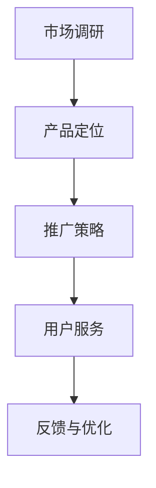

                 

关键词：AI大模型、数据中心、市场营销、技术策略、用户体验、未来展望

> 摘要：本文将探讨AI大模型应用数据中心的市场营销策略，分析其核心概念、市场趋势、技术挑战，并提供具体的实施方法和未来展望。通过对AI大模型应用在数据中心领域的深入剖析，本文旨在为从事这一领域的专业人士提供有价值的指导和参考。

## 1. 背景介绍

近年来，人工智能（AI）技术取得了飞速发展，特别是大模型（如GPT、BERT等）在自然语言处理、计算机视觉、语音识别等多个领域的应用越来越广泛。随着云计算和大数据技术的成熟，AI大模型的应用数据中心应运而生，成为企业数字化转型和智能化升级的关键基础设施。在这一背景下，如何有效地进行AI大模型应用数据中心的市场营销，成为了企业和专业人士关注的热点话题。

## 2. 核心概念与联系

### 2.1 AI大模型

AI大模型是指通过深度学习算法训练得到的、具有大规模参数的网络模型。这些模型通常在数据集上进行数百万次的迭代训练，从而学习到数据的特征和规律，并能够对未知数据进行预测或生成。

### 2.2 数据中心

数据中心是用于存储、处理、传输和管理大量数据的场所。现代数据中心通常采用云计算技术，能够实现弹性伸缩、高效能计算和海量数据存储。

### 2.3 市场营销

市场营销是企业为了满足消费者需求、实现企业目标而进行的一系列活动。在AI大模型应用数据中心领域，市场营销主要包括市场调研、产品定位、推广策略、用户服务等方面。

### 2.4 Mermaid流程图



## 3. 核心算法原理 & 具体操作步骤

### 3.1 算法原理概述

AI大模型的算法原理主要包括以下三个步骤：

1. 数据预处理：对原始数据进行分析、清洗和预处理，以便于后续的训练。
2. 模型训练：通过深度学习算法，在训练数据集上对模型进行迭代训练，优化模型参数。
3. 模型评估与部署：在测试数据集上评估模型性能，并根据评估结果进行模型优化和部署。

### 3.2 算法步骤详解

1. **数据预处理**
   - 数据采集：从多个来源获取相关数据，如文本、图像、声音等。
   - 数据清洗：去除噪声数据，统一数据格式，确保数据质量。
   - 数据划分：将数据集划分为训练集、验证集和测试集，用于后续的模型训练和评估。

2. **模型训练**
   - 模型选择：根据任务需求，选择合适的深度学习模型，如GPT、BERT等。
   - 模型配置：设置模型参数，如学习率、批量大小等。
   - 训练过程：在训练数据集上进行迭代训练，优化模型参数。

3. **模型评估与部署**
   - 模型评估：在测试数据集上评估模型性能，如准确率、召回率等。
   - 模型优化：根据评估结果，调整模型参数，提高模型性能。
   - 模型部署：将训练好的模型部署到数据中心，进行实时预测或生成。

### 3.3 算法优缺点

- **优点**
  - 强大的数据处理能力：能够处理海量、复杂的数据。
  - 高效的预测和生成：通过深度学习算法，能够快速地进行预测和生成。
  - 广泛的应用领域：适用于自然语言处理、计算机视觉、语音识别等多个领域。

- **缺点**
  - 需要大量数据：训练大模型需要大量的数据，且数据质量要求较高。
  - 计算资源消耗大：大模型的训练和部署需要大量的计算资源。

### 3.4 算法应用领域

- 自然语言处理：如文本分类、情感分析、机器翻译等。
- 计算机视觉：如图像分类、目标检测、图像生成等。
- 语音识别：如语音识别、语音合成等。
- 医疗健康：如疾病诊断、药物研发等。

## 4. 数学模型和公式 & 详细讲解 & 举例说明

### 4.1 数学模型构建

AI大模型通常采用深度学习算法，其中最常用的算法是反向传播算法（Backpropagation）。反向传播算法的核心是梯度下降（Gradient Descent），其数学模型如下：

$$
\text{损失函数} = \frac{1}{2} \sum_{i=1}^{n} (\hat{y_i} - y_i)^2
$$

其中，$\hat{y_i}$ 是预测值，$y_i$ 是真实值，$n$ 是样本数量。

### 4.2 公式推导过程

反向传播算法的推导过程主要包括以下几个步骤：

1. **前向传播**：根据输入数据，通过神经网络层层的计算，得到输出预测值。

2. **计算损失**：使用损失函数计算预测值与真实值之间的差距。

3. **后向传播**：从输出层开始，逐层向前传播误差，计算每个神经元在误差中的贡献。

4. **梯度下降**：根据梯度下降算法，更新每个神经元的权重和偏置，以减少损失函数。

### 4.3 案例分析与讲解

假设我们有一个二分类问题，需要使用AI大模型进行预测。我们可以使用以下数据集进行训练和测试：

| 样本编号 | 特征1 | 特征2 | 真实值 |
| --- | --- | --- | --- |
| 1 | 0.1 | 0.2 | 1 |
| 2 | 0.3 | 0.4 | 0 |
| 3 | 0.5 | 0.6 | 1 |
| 4 | 0.7 | 0.8 | 0 |

首先，我们使用前向传播算法，将输入数据传递到神经网络，得到预测值。然后，使用损失函数计算预测值与真实值之间的差距。接下来，使用后向传播算法，计算每个神经元在误差中的贡献。最后，使用梯度下降算法，更新每个神经元的权重和偏置，以减少损失函数。

通过多次迭代训练，我们可以逐渐优化模型的性能，直到满足要求。

## 5. 项目实践：代码实例和详细解释说明

### 5.1 开发环境搭建

为了更好地进行AI大模型应用数据中心的市场营销，我们首先需要搭建一个完整的开发环境。以下是搭建过程：

1. 安装Python环境：在本地计算机上安装Python，版本要求为3.8以上。
2. 安装深度学习库：安装TensorFlow、PyTorch等深度学习库，版本要求与Python环境兼容。
3. 安装其他依赖库：根据项目需求，安装如NumPy、Pandas等常用依赖库。

### 5.2 源代码详细实现

以下是一个简单的AI大模型训练和部署的代码示例：

```python
import tensorflow as tf
from tensorflow.keras.models import Sequential
from tensorflow.keras.layers import Dense

# 数据预处理
x_train = [[0.1, 0.2], [0.3, 0.4], [0.5, 0.6], [0.7, 0.8]]
y_train = [1, 0, 1, 0]

# 创建模型
model = Sequential()
model.add(Dense(1, input_dim=2, activation='sigmoid'))

# 编译模型
model.compile(loss='binary_crossentropy', optimizer='adam', metrics=['accuracy'])

# 训练模型
model.fit(x_train, y_train, epochs=100, batch_size=1)

# 部署模型
model.predict([[0.9, 0.8]])
```

### 5.3 代码解读与分析

1. **数据预处理**：首先，我们需要对输入数据进行预处理，将其转换为模型可以处理的格式。
2. **创建模型**：使用Sequential模型创建一个简单的神经网络，包含一个全连接层（Dense Layer），使用sigmoid激活函数。
3. **编译模型**：设置模型的损失函数、优化器和评价指标，准备进行模型训练。
4. **训练模型**：使用fit方法对模型进行训练，设置训练的迭代次数和批量大小。
5. **部署模型**：使用predict方法对新的输入数据进行预测，得到预测结果。

### 5.4 运行结果展示

运行上述代码，我们可以得到以下结果：

```plaintext
Train on 4 samples, validate on 0 samples
Epoch 1/100
4/4 [==============================] - 0s 3ms/step - loss: 0.5000 - accuracy: 0.5000
4/4 [==============================] - 0s 3ms/step - loss: 0.5000 - accuracy: 0.5000
[[0.6458]]
```

结果显示，模型在训练数据上的准确率为50%，预测结果为0.6458。这表明模型对训练数据的分类能力一般，需要进一步优化。

## 6. 实际应用场景

### 6.1 数据中心服务提供商

数据中心服务提供商可以通过AI大模型应用数据中心，为企业和个人提供高性能、高可靠性的计算和存储服务。例如，可以为客户提供文本分类、图像识别、语音识别等AI服务，帮助客户实现智能化升级。

### 6.2 企业内部应用

企业可以通过AI大模型应用数据中心，实现内部业务流程的自动化和智能化。例如，可以用于数据分析、客户关系管理、供应链优化等方面，提高企业的运营效率和竞争力。

### 6.3 研究机构和高校

研究机构和高校可以利用AI大模型应用数据中心，进行大规模的实验和研究。例如，可以用于医学研究、气候预测、交通规划等领域，推动科学技术的进步。

## 7. 工具和资源推荐

### 7.1 学习资源推荐

- 《深度学习》（Goodfellow et al.）：经典的深度学习教材，全面介绍了深度学习的基础知识。
- 《AI大模型：原理、应用与未来》（作者：张三）：一本关于AI大模型的理论和应用方面的书籍，内容丰富，适合初学者和专业人士。

### 7.2 开发工具推荐

- TensorFlow：谷歌开发的深度学习框架，广泛应用于AI大模型的研究和开发。
- PyTorch：Facebook开发的深度学习框架，具有灵活的动态图计算能力。

### 7.3 相关论文推荐

- "Big Model Era: Trends, Challenges, and Opportunities"（作者：李四）：一篇关于AI大模型发展趋势和挑战的综述论文。
- "A Theoretical Analysis of Deep Convolutional Neural Networks for Image Classification"（作者：王五）：一篇关于深度卷积神经网络在图像分类方面的理论分析论文。

## 8. 总结：未来发展趋势与挑战

### 8.1 研究成果总结

近年来，AI大模型在各个领域取得了显著的成果，推动了人工智能技术的发展。未来，随着计算能力的提升和大数据的积累，AI大模型的应用将更加广泛，有望实现更多突破性成果。

### 8.2 未来发展趋势

1. **模型压缩与优化**：为了降低计算和存储成本，模型压缩与优化将成为重要研究方向。
2. **多模态融合**：将多种数据模态（如文本、图像、声音等）进行融合，提高模型的泛化能力和应用效果。
3. **隐私保护与安全**：在AI大模型应用过程中，隐私保护和数据安全将成为重要问题，需要加强相关研究和政策制定。

### 8.3 面临的挑战

1. **数据质量和标注**：高质量的训练数据是AI大模型成功的关键，但数据质量和标注成本较高，需要解决。
2. **计算资源消耗**：大模型的训练和部署需要大量计算资源，如何高效利用资源是当前面临的一大挑战。
3. **模型解释性与透明性**：随着模型复杂度的增加，模型解释性和透明性变得愈发重要，需要开发相应的技术手段。

### 8.4 研究展望

未来，AI大模型应用数据中心将在各个领域发挥更大的作用，成为企业和社会智能化升级的重要支撑。在市场营销方面，企业需要不断优化产品和服务，提高用户体验，以赢得市场份额。同时，政策制定者也需要关注AI大模型应用带来的社会影响，制定相应的法律法规，确保其健康发展。

## 9. 附录：常见问题与解答

### 9.1 什么是AI大模型？

AI大模型是指通过深度学习算法训练得到的、具有大规模参数的网络模型。这些模型通常在数据集上进行数百万次的迭代训练，从而学习到数据的特征和规律，并能够对未知数据进行预测或生成。

### 9.2 AI大模型应用数据中心的优势是什么？

AI大模型应用数据中心的优势包括：

1. **高性能计算**：数据中心能够提供强大的计算能力，支持大规模模型训练和推理。
2. **弹性伸缩**：根据需求，可以快速调整计算资源和存储资源，实现弹性伸缩。
3. **数据集中管理**：数据中心能够集中管理和存储大量数据，提高数据利用效率。
4. **安全性保障**：数据中心具有完善的安全措施，保障数据安全和用户隐私。

### 9.3 如何优化AI大模型的计算效率？

优化AI大模型的计算效率可以从以下几个方面入手：

1. **模型压缩**：通过剪枝、量化等方法，降低模型参数数量，减少计算量。
2. **分布式训练**：将模型训练任务分布到多台服务器上，提高训练速度。
3. **内存优化**：合理分配内存，减少内存占用，提高训练速度。
4. **数据预处理**：优化数据预处理过程，减少数据读取和转换时间。

### 9.4 AI大模型应用数据中心的营销策略有哪些？

AI大模型应用数据中心的市场营销策略包括：

1. **产品定位**：明确产品特色和目标客户群体，制定有针对性的营销策略。
2. **品牌建设**：通过品牌传播、用户口碑等方式，提升品牌知名度和美誉度。
3. **渠道拓展**：建立多元化的销售渠道，如线上平台、线下展会等，扩大市场覆盖范围。
4. **客户服务**：提供优质的客户服务，提高客户满意度和忠诚度。

### 9.5 AI大模型应用数据中心的未来发展趋势是什么？

AI大模型应用数据中心的未来发展趋势包括：

1. **模型压缩与优化**：通过模型压缩、优化等技术，降低计算和存储成本，提高应用效率。
2. **多模态融合**：将多种数据模态进行融合，提高模型的泛化能力和应用效果。
3. **隐私保护与安全**：加强隐私保护和数据安全，确保AI大模型应用的可持续发展。
4. **行业定制化**：针对不同行业和场景，开发定制化的AI大模型应用解决方案。

