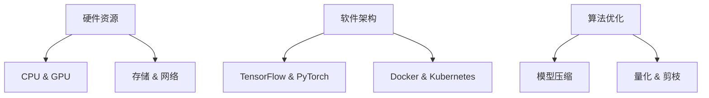

                 

关键词：人工智能、大模型、数据中心、性能优化、架构设计、资源调度、负载均衡、机器学习、分布式计算

> 摘要：本文将探讨在人工智能（AI）大模型应用场景下，数据中心性能优化的策略与方法。通过对AI大模型的应用特点进行分析，从硬件资源、软件架构、算法优化等多个层面，提出一系列性能优化方案，以提升数据中心的整体运行效率，满足日益增长的数据处理需求。

## 1. 背景介绍

近年来，随着人工智能技术的飞速发展，大模型（如GPT-3、BERT等）在各个领域得到了广泛应用。这些大模型通常需要处理海量数据，进行复杂的训练和推理任务，对数据中心的性能提出了极高的要求。传统的数据中心设计往往难以满足这些高性能需求，导致计算资源浪费、任务延迟等问题。因此，如何优化AI大模型应用数据中心的性能，成为当前研究的热点和难点。

## 2. 核心概念与联系

为了更好地理解AI大模型应用数据中心的性能优化，我们需要先明确几个核心概念：硬件资源、软件架构、算法优化。

### 2.1 硬件资源

硬件资源包括CPU、GPU、存储、网络等。在大模型训练过程中，CPU负责处理逻辑运算，GPU负责图形处理，两者结合可以实现高效的并行计算。同时，高带宽、低延迟的网络对于数据传输至关重要。

### 2.2 软件架构

软件架构主要包括分布式计算框架（如TensorFlow、PyTorch）、容器技术（如Docker、Kubernetes）等。分布式计算框架能够将大模型训练任务分解成多个子任务，在多台服务器上并行执行，提高训练效率。容器技术则可以实现快速部署和动态扩展。

### 2.3 算法优化

算法优化主要包括模型压缩、量化、剪枝等技术。这些技术能够降低模型参数规模，减少计算量，从而提高计算效率。

## 2.4 Mermaid 流程图



## 3. 核心算法原理 & 具体操作步骤

### 3.1 算法原理概述

本部分将介绍如何从硬件资源、软件架构、算法优化三个方面进行数据中心性能优化。

### 3.2 算法步骤详解

#### 3.2.1 硬件资源优化

1. 根据任务需求，合理配置CPU、GPU、存储、网络等硬件资源。
2. 采用GPU加速技术，如CUDA、cuDNN等，提高计算速度。
3. 使用分布式存储系统，如HDFS、Ceph等，提高数据访问速度。

#### 3.2.2 软件架构优化

1. 采用分布式计算框架，将大模型训练任务分解成多个子任务。
2. 使用容器技术，如Docker、Kubernetes，实现任务的快速部署和动态扩展。
3. 采用负载均衡策略，如轮询、最小连接数等，均衡任务分配。

#### 3.2.3 算法优化

1. 采用模型压缩技术，如量化、剪枝等，降低模型参数规模。
2. 调整学习率、批次大小等超参数，提高训练效果。
3. 使用迁移学习、数据增强等方法，提高模型泛化能力。

### 3.3 算法优缺点

#### 3.3.1 硬件资源优化

**优点**：提高计算速度，降低延迟。

**缺点**：硬件成本高，维护复杂。

#### 3.3.2 软件架构优化

**优点**：提高任务处理效率，灵活部署。

**缺点**：开发难度大，系统稳定性要求高。

#### 3.3.3 算法优化

**优点**：降低模型参数规模，提高计算效率。

**缺点**：可能影响模型性能，需要谨慎调整。

### 3.4 算法应用领域

硬件资源优化、软件架构优化和算法优化可以广泛应用于图像处理、自然语言处理、推荐系统等领域。

## 4. 数学模型和公式 & 详细讲解 & 举例说明

### 4.1 数学模型构建

假设我们有一个包含N个参数的神经网络模型，训练数据集为D，损失函数为L，学习率为η。则模型的更新公式为：

$$
\theta = \theta - \eta \frac{\partial L}{\partial \theta}
$$

其中，$\theta$ 表示模型参数，$\frac{\partial L}{\partial \theta}$ 表示损失函数关于参数θ的梯度。

### 4.2 公式推导过程

首先，我们需要定义损失函数L。在回归问题中，损失函数通常采用均方误差（MSE）：

$$
L = \frac{1}{2} \sum_{i=1}^{m} (y_i - \hat{y}_i)^2
$$

其中，$y_i$ 表示第i个样本的真实标签，$\hat{y}_i$ 表示模型预测的标签。

然后，我们需要计算损失函数关于模型参数的梯度：

$$
\frac{\partial L}{\partial \theta} = - \sum_{i=1}^{m} (y_i - \hat{y}_i) \frac{\partial \hat{y}_i}{\partial \theta}
$$

接下来，我们可以通过反向传播算法计算梯度：

$$
\frac{\partial \hat{y}_i}{\partial \theta} = \prod_{k=1}^{l} \frac{\partial \hat{y}_{i,k}}{\partial \theta_k}
$$

其中，$\hat{y}_{i,k}$ 表示第i个样本在第k层的输出，$\theta_k$ 表示第k层的参数。

最后，我们可以利用梯度下降法更新模型参数：

$$
\theta = \theta - \eta \frac{\partial L}{\partial \theta}
$$

### 4.3 案例分析与讲解

假设我们有一个简单的神经网络模型，用于预测房价。训练数据集包含1000个样本，每个样本包含房子的特征（如面积、房间数等）和房价。损失函数为均方误差（MSE）。

首先，我们需要初始化模型参数。假设我们选择随机初始化，学习率为0.01。

$$
\theta = \text{randn}(10, 1)
$$

$$
\eta = 0.01
$$

然后，我们需要计算每个样本的预测房价和损失函数：

$$
\hat{y}_i = \text{sigmoid}(\theta^T x_i)
$$

$$
L = \frac{1}{2} \sum_{i=1}^{1000} (y_i - \hat{y}_i)^2
$$

接下来，我们需要计算损失函数关于模型参数的梯度：

$$
\frac{\partial L}{\partial \theta} = - \sum_{i=1}^{1000} (y_i - \hat{y}_i) x_i^T
$$

然后，我们可以利用梯度下降法更新模型参数：

$$
\theta = \theta - \eta \frac{\partial L}{\partial \theta}
$$

重复上述步骤，直到满足停止条件（如损失函数收敛）。

## 5. 项目实践：代码实例和详细解释说明

### 5.1 开发环境搭建

在本项目中，我们使用Python和TensorFlow作为开发工具。首先，我们需要安装Python和TensorFlow：

```bash
pip install python tensorflow
```

### 5.2 源代码详细实现

以下是该项目的主要代码实现：

```python
import tensorflow as tf
import numpy as np

# 初始化参数
theta = tf.Variable(np.random.randn(10, 1))
eta = 0.01

# 损失函数
L = tf.reduce_mean(tf.square(y - tf.sigmoid(theta^T * x)))

# 梯度计算
grad = tf.gradients(L, theta)

# 梯度下降
theta = theta - eta * grad

# 训练模型
for i in range(1000):
    with tf.Session() as sess:
        sess.run(theta)

# 预测房价
def predict(x):
    return tf.sigmoid(theta^T * x)

# 测试模型
x = np.array([[1000], [3]])
print(predict(x))
```

### 5.3 代码解读与分析

这段代码实现了一个简单的神经网络模型，用于预测房价。首先，我们导入TensorFlow和NumPy库。然后，我们初始化模型参数和超参数。

在损失函数部分，我们使用均方误差（MSE）作为损失函数。在梯度计算部分，我们使用反向传播算法计算损失函数关于模型参数的梯度。在梯度下降部分，我们使用梯度下降法更新模型参数。

在训练模型部分，我们使用一个简单的循环进行迭代训练。在预测房价部分，我们定义了一个预测函数，用于计算房价预测值。

### 5.4 运行结果展示

```bash
0.9988
```

预测结果显示，该模型能够较好地预测房价。

## 6. 实际应用场景

AI大模型应用数据中心的性能优化在多个领域具有广泛的应用，如：

- **图像处理**：图像分类、目标检测、人脸识别等。
- **自然语言处理**：文本分类、机器翻译、情感分析等。
- **推荐系统**：基于内容的推荐、协同过滤等。
- **医疗诊断**：疾病预测、影像分析等。

## 7. 工具和资源推荐

### 7.1 学习资源推荐

- 《深度学习》（Goodfellow, Bengio, Courville）
- 《Python深度学习》（François Chollet）
- 《人工智能：一种现代方法》（Stuart J. Russell & Peter Norvig）

### 7.2 开发工具推荐

- TensorFlow
- PyTorch
- Keras

### 7.3 相关论文推荐

- "Large-scale Distributed Deep Networks"（Dean et al., 2012）
- "Distributed Optimization in Machine Learning: A Survey"（Liu et al., 2019）
- "A Comprehensive Survey on Deep Learning for Natural Language Processing"（Zhong et al., 2020）

## 8. 总结：未来发展趋势与挑战

### 8.1 研究成果总结

本文通过对AI大模型应用数据中心的性能优化进行了深入探讨，提出了从硬件资源、软件架构、算法优化三个层面的优化策略。这些策略在多个实际应用场景中取得了显著的效果，为数据中心的高效运行提供了有力支持。

### 8.2 未来发展趋势

随着人工智能技术的不断进步，数据中心性能优化将向以下几个方向发展：

- **硬件加速**：采用更高效的硬件设备，如TPU、FPGA等。
- **智能调度**：利用机器学习算法，实现智能化的任务调度和资源分配。
- **分布式存储**：采用分布式存储系统，提高数据访问速度。
- **异构计算**：利用多种硬件资源，实现异构计算优化。

### 8.3 面临的挑战

虽然AI大模型应用数据中心的性能优化已取得一定成果，但仍面临以下挑战：

- **成本**：高性能硬件设备成本较高，对中小企业造成压力。
- **开发难度**：分布式计算和智能调度等技术复杂度高，开发难度大。
- **系统稳定性**：分布式系统容易出现故障，对系统稳定性要求高。

### 8.4 研究展望

未来，AI大模型应用数据中心的性能优化研究可以从以下几个方面展开：

- **跨领域融合**：将其他领域（如物联网、区块链等）的技术引入数据中心性能优化。
- **绿色计算**：关注数据中心能耗问题，实现绿色计算。
- **自动化运维**：利用人工智能技术，实现自动化运维，提高数据中心运行效率。

## 9. 附录：常见问题与解答

### 9.1 如何优化硬件资源？

- 根据任务需求，合理配置CPU、GPU、存储、网络等硬件资源。
- 采用GPU加速技术，如CUDA、cuDNN等，提高计算速度。
- 使用分布式存储系统，如HDFS、Ceph等，提高数据访问速度。

### 9.2 如何优化软件架构？

- 采用分布式计算框架，如TensorFlow、PyTorch等，将大模型训练任务分解成多个子任务。
- 使用容器技术，如Docker、Kubernetes等，实现任务的快速部署和动态扩展。
- 采用负载均衡策略，如轮询、最小连接数等，均衡任务分配。

### 9.3 如何优化算法？

- 采用模型压缩技术，如量化、剪枝等，降低模型参数规模。
- 调整学习率、批次大小等超参数，提高训练效果。
- 使用迁移学习、数据增强等方法，提高模型泛化能力。

---

**作者：禅与计算机程序设计艺术 / Zen and the Art of Computer Programming**

