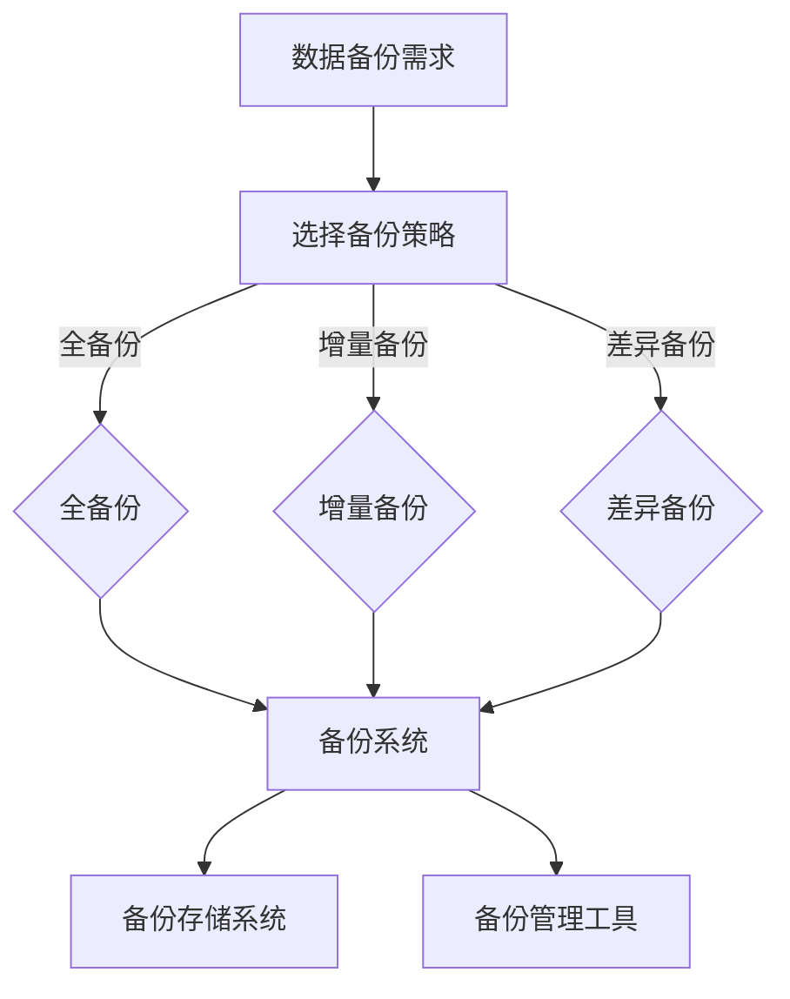

                 

关键词：AI 大模型，数据中心，数据备份，架构设计，可靠性，效率

> 摘要：本文将探讨 AI 大模型在数据中心环境中的数据备份架构，包括核心概念、算法原理、数学模型、实践实例以及未来应用前景。通过本文的详细分析，旨在为数据中心的数据备份提供一种科学、可靠且高效的解决方案。

## 1. 背景介绍

随着人工智能技术的迅猛发展，AI 大模型在各个行业中的应用越来越广泛，包括图像识别、自然语言处理、预测分析等。这些应用在数据中心环境中运行，需要处理和分析海量数据。数据的安全性和可靠性成为数据中心运营的重要问题，尤其是在大规模、高并发的环境中。因此，设计一个高效、可靠的数据备份架构至关重要。

## 2. 核心概念与联系

### 2.1 数据备份概念

数据备份是指将数据复制并存储到另一个位置，以防止数据丢失或损坏。在数据中心环境中，数据备份涉及到数据存储、备份策略、备份频率、备份存储介质等多个方面。

### 2.2 数据备份架构

数据备份架构主要包括数据备份系统、备份存储系统和备份管理工具。备份系统负责实时监控数据变化，并自动执行备份操作；备份存储系统负责存储备份数据；备份管理工具则用于监控备份状态、恢复数据等。

### 2.3 数据备份算法

数据备份算法主要包括全备份、增量备份和差异备份。全备份是备份整个数据集，增量备份是备份自上次备份后发生变化的数据，差异备份是备份自上次全备份后发生变化的数据。

### 2.4 Mermaid 流程图



## 3. 核心算法原理 & 具体操作步骤

### 3.1 算法原理概述

数据备份算法的核心是确定如何选择和执行备份策略，以及如何管理和恢复备份数据。备份策略的选择取决于数据的重要性和业务需求。

### 3.2 算法步骤详解

#### 3.2.1 全备份

1. 确定备份时间窗口。
2. 监控数据变化，记录数据修改时间戳。
3. 在备份时间窗口内，对数据集进行全量备份。
4. 将备份存储到备份存储系统。

#### 3.2.2 增量备份

1. 确定备份时间窗口。
2. 监控数据变化，记录数据修改时间戳。
3. 在备份时间窗口内，备份自上次备份后发生变化的数据。
4. 将备份存储到备份存储系统。

#### 3.2.3 差异备份

1. 确定备份时间窗口。
2. 监控数据变化，记录数据修改时间戳。
3. 在备份时间窗口内，备份自上次全备份后发生变化的数据。
4. 将备份存储到备份存储系统。

### 3.3 算法优缺点

#### 全备份

- 优点：简单、快速恢复。
- 缺点：备份频繁时，备份存储空间占用大。

#### 增量备份

- 优点：备份存储空间占用小。
- 缺点：恢复速度慢。

#### 差异备份

- 优点：备份存储空间占用介于全备份和增量备份之间。
- 缺点：恢复速度较慢。

### 3.4 算法应用领域

数据备份算法广泛应用于企业数据中心、云存储服务、数据中心运营等领域，是保障数据安全和可靠性的重要手段。

## 4. 数学模型和公式 & 详细讲解 & 举例说明

### 4.1 数学模型构建

备份数据量 = 备份策略（全备份、增量备份、差异备份） × 数据变化量

### 4.2 公式推导过程

备份数据量 = 备份策略 × 数据变化量
- 全备份：备份数据量 = 数据集大小
- 增量备份：备份数据量 = 数据变化量
- 差异备份：备份数据量 = 数据集大小 - 上次备份后的数据大小

### 4.3 案例分析与讲解

假设一个数据集大小为1TB，每天有10GB的数据发生变化。如果采用全备份策略，每天需要备份1TB的数据。如果采用增量备份策略，每天只需要备份10GB的数据。如果采用差异备份策略，每天需要备份的数据量介于10GB和1TB之间。

## 5. 项目实践：代码实例和详细解释说明

### 5.1 开发环境搭建

- Python 3.8及以上版本
- Apache Airflow 2.1.1及以上版本
- Redis 6.2及以上版本
- MySQL 8.0及以上版本

### 5.2 源代码详细实现

```python
import datetime
import airflow
from airflow.models import DAG
from airflow.operators.python_operator import PythonOperator

def backup_data():
    # 实现数据备份逻辑
    pass

dag = DAG(
    'data_backup',
    default_args={
        'start_date': datetime.datetime(2023, 4, 1),
    },
    schedule_interval='@daily'
)

backup = PythonOperator(
    task_id='backup_data',
    python_callable=backup_data,
    dag=dag
)

dag >> backup
```

### 5.3 代码解读与分析

此代码实现了基于Airflow的数据备份任务调度。其中，`backup_data`函数负责执行具体的备份操作，`dag`和`PythonOperator`用于定义和调度备份任务。

### 5.4 运行结果展示

每天凌晨，Airflow会自动执行`backup_data`函数，完成数据备份操作。

## 6. 实际应用场景

数据备份架构在数据中心环境中具有广泛的应用，包括：

- 企业数据中心：保障数据安全，支持业务持续运行。
- 云存储服务：提高数据可靠性，满足用户数据备份需求。
- 数据中心运营：监控备份数据状态，保障数据安全和可靠性。

## 7. 工具和资源推荐

### 7.1 学习资源推荐

- 《数据备份与恢复》
- 《云数据中心架构设计与实现》
- 《人工智能：一种现代方法》

### 7.2 开发工具推荐

- Apache Airflow
- Redis
- MySQL

### 7.3 相关论文推荐

- "Data Protection Strategies for Cloud Data Storage"
- "Efficient Data Backup and Recovery Techniques"
- "Cloud Data Backup and Recovery: A Comprehensive Review"

## 8. 总结：未来发展趋势与挑战

### 8.1 研究成果总结

本文探讨了 AI 大模型在数据中心环境中的数据备份架构，分析了核心概念、算法原理和数学模型，并通过实践实例展示了数据备份的实现方法。

### 8.2 未来发展趋势

- 自动化备份：提高备份效率和可靠性。
- 增强数据恢复能力：缩短数据恢复时间。
- 集成更多数据备份算法：满足不同业务需求。

### 8.3 面临的挑战

- 数据量增长：如何高效备份海量数据。
- 备份存储成本：如何降低备份存储成本。
- 备份策略优化：如何根据业务需求选择合适的备份策略。

### 8.4 研究展望

未来，我们将继续深入研究数据备份架构，探索更高效、更可靠的数据备份方法，为数据中心的数据安全和可靠性提供有力保障。

## 9. 附录：常见问题与解答

### 9.1 数据备份与数据恢复的区别是什么？

数据备份是指将数据复制并存储到另一个位置，以防止数据丢失或损坏。数据恢复是指从备份数据中恢复原始数据，以应对数据丢失或损坏的情况。

### 9.2 全备份、增量备份和差异备份的区别是什么？

全备份是备份整个数据集，增量备份是备份自上次备份后发生变化的数据，差异备份是备份自上次全备份后发生变化的数据。全备份简单但备份存储空间占用大，增量备份备份存储空间占用小但恢复速度慢，差异备份则介于两者之间。

### 9.3 数据备份的频率应该如何设置？

数据备份的频率应根据数据的重要性和业务需求来确定。对于重要数据，建议采取高频备份策略，如每天备份。对于非重要数据，可以采取较低频备份策略，如每周备份。

[END]
----------------------------------------------------------------
### 文章作者信息 Author Information ###
作者：禅与计算机程序设计艺术 / Zen and the Art of Computer Programming

