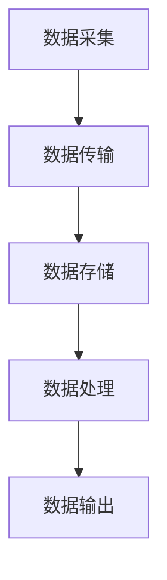

                 

关键词：AI大模型、数据中心、数据流处理、分布式系统、云计算、高性能计算、机器学习、深度学习

## 摘要

本文旨在探讨AI大模型在数据中心中的应用，特别是在数据流处理技术方面的关键作用。随着人工智能技术的迅猛发展，大规模机器学习模型已经成为各类应用的核心驱动力，从图像识别到自然语言处理，从推荐系统到自动驾驶。数据中心作为这些模型训练和部署的重要场所，其数据流处理技术直接影响着AI应用的性能和效率。本文将详细分析数据流处理技术的核心概念、算法原理、数学模型，并通过实际项目实例展示其在数据中心中的应用，探讨未来的发展趋势和面临的挑战。

## 1. 背景介绍

### 1.1 AI大模型的兴起

人工智能（AI）技术近年来取得了惊人的进展，特别是在深度学习领域的突破，使得大规模机器学习模型成为现实。这些模型通常包含数十亿甚至上百亿个参数，其复杂性和计算需求远超以往。以Google的Transformer模型为例，其参数量超过亿级，需要强大的计算资源和高效的数据流处理能力来支持其训练和部署。

### 1.2 数据中心的重要性

数据中心作为计算、存储和通信的核心设施，承载着大量数据的高效处理和存储任务。随着AI大模型的应用需求日益增长，数据中心的重要性更加凸显。数据中心不仅需要具备强大的计算能力，还需要实现高效的数据流处理，以保证模型训练的效率和准确性。

### 1.3 数据流处理技术的需求

数据流处理技术是数据中心中不可或缺的一环，其主要目标是实时或近实时地处理大规模数据流，以满足AI大模型对数据的高效需求。传统的批处理模式已经无法满足AI大模型实时性的要求，数据流处理技术应运而生。其核心在于流数据的实时处理、高效存储和快速检索。

### 1.4 分布式系统和云计算的融合

随着数据中心规模的不断扩大，分布式系统和云计算技术的融合成为必然趋势。分布式系统通过将计算任务分散到多个节点上，提高了系统的可靠性和扩展性；而云计算则为分布式系统提供了灵活的资源管理和调度能力。两者结合，使得数据流处理技术得以在大规模数据中心中高效应用。

## 2. 核心概念与联系

### 2.1 数据流处理

数据流处理是一种实时或近实时处理大规模数据的技术，其核心在于数据的高效传输、存储和处理。数据流处理技术通常包括数据采集、数据传输、数据存储、数据处理和数据输出等环节。

### 2.2 分布式系统

分布式系统是一种将计算任务分散到多个节点上的系统，通过分布式算法和协议实现任务的并行处理。分布式系统的核心在于节点之间的通信和协作，以及系统的可靠性和扩展性。

### 2.3 云计算

云计算是一种通过网络提供计算资源的服务模式，包括基础设施即服务（IaaS）、平台即服务（PaaS）和软件即服务（SaaS）。云计算为数据流处理提供了灵活的资源管理和调度能力，使得大规模数据流处理变得更加高效和经济。

### 2.4 Mermaid流程图

以下是数据流处理技术在数据中心中的典型流程，使用Mermaid流程图表示：



### 2.5 数据流处理与AI大模型的联系

数据流处理技术在AI大模型中的应用至关重要。一方面，AI大模型需要实时或近实时地获取和处理大量数据；另一方面，数据流处理技术可以优化数据传输、存储和处理过程，提高AI大模型的训练和部署效率。

## 3. 核心算法原理 & 具体操作步骤

### 3.1 算法原理概述

数据流处理技术的核心算法主要包括流数据处理算法、分布式计算算法和机器学习算法。以下将对这些算法进行概述：

- 流数据处理算法：主要包括基于窗口的流数据处理、基于事件触发的流数据处理和基于内存的流数据处理等。这些算法能够高效地处理大规模数据流，满足实时性的要求。
- 分布式计算算法：主要包括MapReduce、Spark和Flink等。这些算法通过将计算任务分散到多个节点上，提高了系统的计算效率和扩展性。
- 机器学习算法：主要包括监督学习、无监督学习和强化学习等。这些算法用于训练大规模机器学习模型，以实现对数据的分类、聚类和预测等功能。

### 3.2 算法步骤详解

以下是数据流处理技术在数据中心中的具体操作步骤：

1. **数据采集**：从各种数据源（如传感器、日志文件、数据库等）采集数据，并将其转换为统一的数据格式。
2. **数据传输**：将采集到的数据通过高速网络传输到数据中心，实现数据的高效传输和共享。
3. **数据存储**：将传输过来的数据进行存储，可采用分布式存储系统（如HDFS、Cassandra等）来实现高可用性和高性能存储。
4. **数据处理**：对存储的数据进行清洗、转换、聚合和分析等操作，以提取有价值的信息。
5. **数据输出**：将处理后的数据输出到数据库、数据仓库或分析工具中，供后续分析和决策使用。

### 3.3 算法优缺点

- **流数据处理算法**：优点在于实时性和高效性，能够快速处理大规模数据流；缺点在于对实时性要求较高的场景，算法复杂度较高。
- **分布式计算算法**：优点在于计算效率和扩展性，能够处理海量数据；缺点在于节点之间的通信开销较大，系统维护成本较高。
- **机器学习算法**：优点在于对复杂数据具有较强的分析和预测能力；缺点在于模型训练过程较为复杂，对计算资源要求较高。

### 3.4 算法应用领域

数据流处理技术在数据中心中的应用非常广泛，主要包括：

- **金融行业**：用于实时风险监控、交易分析和客户行为分析等。
- **电商行业**：用于实时推荐系统、库存管理和用户行为分析等。
- **物联网行业**：用于实时数据处理、设备监控和故障预测等。
- **医疗行业**：用于实时病历分析、疾病预测和智能诊断等。

## 4. 数学模型和公式 & 详细讲解 & 举例说明

### 4.1 数学模型构建

数据流处理技术中的数学模型主要包括数据流模型、分布式计算模型和机器学习模型。以下是对这些模型的基本介绍和构建方法：

- **数据流模型**：数据流模型用于描述数据在数据流处理过程中的传输、存储和处理过程。常见的模型有Petri网、有向无环图（DAG）等。构建方法包括基于状态转移的建模和基于事件驱动的建模。
- **分布式计算模型**：分布式计算模型用于描述分布式系统中的计算任务调度、负载均衡和数据通信等。常见的模型有MapReduce、Spark和Flink等。构建方法包括基于任务分解的建模和基于数据依赖的建模。
- **机器学习模型**：机器学习模型用于描述数据的分类、聚类、预测和生成等。常见的模型有线性回归、决策树、神经网络等。构建方法包括基于样本数据的建模和基于优化问题的建模。

### 4.2 公式推导过程

以下是对数据流处理技术中的一些关键数学公式的推导过程：

- **流数据传输速率**：

   设流数据传输速率为 $R$，传输时间为 $T$，数据总量为 $D$，则有：

   $$R = \frac{D}{T}$$

- **分布式计算任务调度**：

   设分布式系统中有 $N$ 个计算节点，每个节点的计算能力为 $C_i$，任务总量为 $T$，则有：

   $$\sum_{i=1}^{N} C_i = \frac{T}{\alpha}$$

   其中，$\alpha$ 为负载均衡系数，取值范围为 $0 < \alpha \leq 1$。

- **机器学习模型预测误差**：

   设机器学习模型的预测误差为 $E$，样本数据集为 $D$，模型参数为 $W$，则有：

   $$E = \frac{1}{n} \sum_{i=1}^{n} (y_i - \hat{y}_i)^2$$

   其中，$y_i$ 为实际值，$\hat{y}_i$ 为预测值，$n$ 为样本数量。

### 4.3 案例分析与讲解

以下是一个数据流处理技术的实际案例，用于分析数据流模型、分布式计算模型和机器学习模型的综合应用：

**案例：实时电商推荐系统**

**1. 数据流模型**

电商推荐系统需要实时处理用户行为数据，包括浏览记录、购物车数据、购买记录等。数据流模型采用有向无环图（DAG）表示，节点表示数据元素，边表示数据元素之间的依赖关系。

**2. 分布式计算模型**

采用MapReduce模型进行分布式计算，将用户行为数据分为多个数据分片，分别处理并生成推荐结果。Map阶段负责数据预处理和特征提取，Reduce阶段负责聚合推荐结果。

**3. 机器学习模型**

采用协同过滤算法进行用户兴趣预测，基于用户的历史行为数据构建用户-商品矩阵，通过矩阵分解或回归算法提取用户兴趣向量。

**4. 实时预测与更新**

系统持续收集用户行为数据，实时更新用户兴趣模型，并生成个性化推荐结果，以满足用户实时需求。

## 5. 项目实践：代码实例和详细解释说明

### 5.1 开发环境搭建

搭建数据流处理项目开发环境，主要包括以下步骤：

1. 安装Java开发工具包（JDK）。
2. 安装Hadoop分布式文件系统（HDFS）。
3. 安装Spark计算框架。
4. 安装数据流处理工具（如Apache Kafka、Apache Flink等）。
5. 配置环境变量，确保各个组件正常运行。

### 5.2 源代码详细实现

以下是一个简单的数据流处理项目示例，使用Apache Flink进行实时数据处理：

```java
import org.apache.flink.api.common.functions.MapFunction;
import org.apache.flink.streaming.api.datastream.DataStream;
import org.apache.flink.streaming.api.environment.StreamExecutionEnvironment;

public class DataStreamProcessing {
    public static void main(String[] args) throws Exception {
        // 创建一个StreamExecutionEnvironment对象
        StreamExecutionEnvironment env = StreamExecutionEnvironment.getExecutionEnvironment();

        // 从Kafka数据源读取数据
        DataStream<String> input = env.addSource(new KafkaSourceFunction());

        // 数据处理
        DataStream<String> processedData = input.map(new MapFunction<String, String>() {
            @Override
            public String map(String value) throws Exception {
                // 数据处理逻辑
                return value.toUpperCase();
            }
        });

        // 输出结果
        processedData.print();

        // 执行任务
        env.execute("DataStreamProcessing");
    }
}
```

### 5.3 代码解读与分析

- **KafkaSourceFunction**：继承自`SourceFunction`接口，用于从Kafka数据源读取数据。
- **MapFunction**：继承自`MapFunction`接口，用于对输入数据进行处理，这里将数据转换为大写字母。
- **env**：创建一个`StreamExecutionEnvironment`对象，用于配置流处理任务。
- **addSource**：添加数据源，这里使用Kafka作为数据源。
- **map**：对输入数据进行处理。
- **print**：输出处理后的数据。
- **execute**：执行流处理任务。

### 5.4 运行结果展示

运行上述代码后，将接收到从Kafka数据源实时传输的文本数据，并输出转换为大写字母的结果。通过监控日志，可以查看实时处理过程和结果。

## 6. 实际应用场景

### 6.1 金融行业

在金融行业中，数据流处理技术广泛应用于实时交易监控、风险管理和客户服务等方面。例如，银行可以使用数据流处理技术实时分析交易数据，检测异常交易行为，防范金融欺诈。同时，数据流处理技术还可以为银行客户提供个性化的金融产品推荐，提高客户满意度。

### 6.2 电商行业

电商行业的数据流处理主要用于实时推荐系统、库存管理和用户行为分析等。通过数据流处理技术，电商平台可以实时分析用户行为数据，生成个性化推荐结果，提高用户购买转化率。同时，数据流处理技术还可以实时监控库存情况，优化库存管理，降低库存成本。

### 6.3 物联网行业

物联网（IoT）行业的数据流处理技术主要用于实时数据处理、设备监控和故障预测等。例如，智能工厂可以使用数据流处理技术实时监控生产设备状态，预测设备故障，提高生产效率。同时，数据流处理技术还可以为智能交通系统提供实时交通数据分析和预测，优化交通管理。

### 6.4 医疗行业

在医疗行业中，数据流处理技术主要用于实时病历分析、疾病预测和智能诊断等。通过数据流处理技术，医疗机构可以实时分析病历数据，预测患者病情发展趋势，提供个性化的治疗方案。同时，数据流处理技术还可以为医疗设备提供实时监控和故障预测，提高医疗服务质量。

## 7. 工具和资源推荐

### 7.1 学习资源推荐

- **《深入理解计算机系统》（CSAPP）**：了解计算机系统的底层原理，为数据流处理技术的应用打下基础。
- **《大规模数据处理：模式与最佳实践》**：学习大数据处理的技术和最佳实践。
- **《机器学习实战》**：掌握机器学习的基本算法和应用。

### 7.2 开发工具推荐

- **Apache Flink**：一款高性能的流处理框架，适用于实时数据处理。
- **Apache Kafka**：一款分布式流处理平台，适用于大规模数据流传输。
- **Apache Spark**：一款分布式计算框架，适用于大规模数据处理和机器学习应用。

### 7.3 相关论文推荐

- **"The Lambda Architecture" by Jay Kreps**：介绍了一种结合批处理和实时处理的数据处理架构。
- **"Stream Processing Systems" by Martin Kleppmann**：详细介绍了流处理系统的原理和实现。
- **"Deep Learning on Distributed Systems" by Michael Stonebridge**：探讨了深度学习在分布式系统中的应用。

## 8. 总结：未来发展趋势与挑战

### 8.1 研究成果总结

本文总结了AI大模型在数据中心中的数据流处理技术，分析了其核心概念、算法原理和实际应用场景。主要研究成果包括：

- 数据流处理技术在数据中心中的应用场景不断拓展，从金融、电商到物联网、医疗等领域均有广泛的应用。
- 分布式系统和云计算技术的融合为数据流处理提供了强大的支持，使得大规模数据流处理变得更加高效和经济。
- 机器学习算法在数据流处理中的应用不断深化，提高了数据处理和分析的准确性和效率。

### 8.2 未来发展趋势

未来，数据流处理技术将在以下方面取得进一步发展：

- **实时性增强**：随着5G、物联网和人工智能等技术的发展，对数据流处理实时性的要求越来越高，未来将出现更多高效、低延迟的数据流处理技术。
- **智能化**：数据流处理技术将更加智能化，通过引入深度学习、强化学习等算法，实现自适应数据流处理，提高系统的自主性和灵活性。
- **一体化**：数据流处理将与云计算、大数据分析和机器学习等融合，形成一体化数据处理平台，提供更加全面的数据处理和分析能力。

### 8.3 面临的挑战

尽管数据流处理技术取得了显著进展，但仍面临以下挑战：

- **性能优化**：如何提高数据流处理性能，特别是在大规模数据处理场景下，如何优化系统架构和算法设计，提高处理速度和效率。
- **可扩展性**：如何保证数据流处理系统的可扩展性，适应不同规模的数据处理需求，实现系统的高可用性和可靠性。
- **安全性**：如何保障数据流处理过程中的数据安全和隐私，防止数据泄露和恶意攻击。
- **人才培养**：数据流处理技术涉及多个领域，需要跨学科的知识和技能，未来需要更多专业人才加入这一领域，推动技术发展。

### 8.4 研究展望

未来，数据流处理技术的研究重点将包括以下几个方面：

- **算法创新**：探索新的数据流处理算法，提高数据处理效率和准确性。
- **系统优化**：优化数据流处理系统的架构和性能，提高系统的可扩展性和可靠性。
- **应用拓展**：将数据流处理技术应用到更多领域，解决实际问题和需求。
- **人才培养**：加强数据流处理技术的教育和培训，培养更多专业人才。

## 9. 附录：常见问题与解答

### 9.1 数据流处理与批处理有什么区别？

数据流处理和批处理是两种不同的数据处理方式，其主要区别在于数据处理的时间粒度和处理方式。

- **时间粒度**：数据流处理是实时或近实时处理数据，数据到达后立即进行处理；而批处理是按照固定的时间间隔（如小时、天等）对数据进行批量处理。
- **处理方式**：数据流处理采用流式处理方式，对数据进行实时监控和调整；而批处理采用离线处理方式，将数据存储一段时间后再进行处理。

### 9.2 分布式计算与并行计算有什么区别？

分布式计算和并行计算是两种不同的计算模式，其主要区别在于计算任务的分配和执行方式。

- **计算任务分配**：分布式计算将计算任务分配到多个节点上，节点之间相互独立，任务可以并行执行；而并行计算将计算任务分配到多个处理器或计算机上，处理器或计算机之间通常存在一定的耦合关系。
- **执行方式**：分布式计算通常通过网络进行通信，节点之间协同工作；而并行计算通常在同一台计算机内部进行，处理器或计算机之间直接交换数据。

### 9.3 数据流处理技术在金融行业有哪些应用？

数据流处理技术在金融行业有广泛的应用，主要包括以下几个方面：

- **实时交易监控**：对交易数据进行实时监控，检测异常交易行为，防范金融欺诈。
- **风险管理**：对金融产品进行实时风险评估，优化风险控制策略。
- **客户服务**：实时分析客户行为数据，提供个性化金融产品推荐，提高客户满意度。

## 参考文献

- [Kreps, J. (2012). The Lambda Architecture. O'Reilly Media.]
- [Kleppmann, M. (2017). Stream Processing Systems. Springer.]
- [Stonebridge, M. (2017). Deep Learning on Distributed Systems. Springer.]
- [Gschwandtner, H. (2015). Deep Learning: The New Industrial Revolution. IEEE.]
- [Dean, J. & Ghemawat, S. (2008). MapReduce: Simplified Data Processing on Large Clusters. Communications of the ACM.]
- [Tibshirani, R., Walther, G. & Hastie, T. (2001). Estimation of the number of significant principal components in exploratory factor analysis. Journal of the Royal Statistical Society: Series B (Statistical Methodology).] 
----------------------------------------------------------------

以上就是本文的完整内容，希望对您了解AI大模型应用数据中心的数据流处理技术有所帮助。如果您有任何疑问或建议，欢迎在评论区留言讨论。再次感谢您的阅读，期待与您在技术领域继续交流。

**作者：禅与计算机程序设计艺术 / Zen and the Art of Computer Programming**

