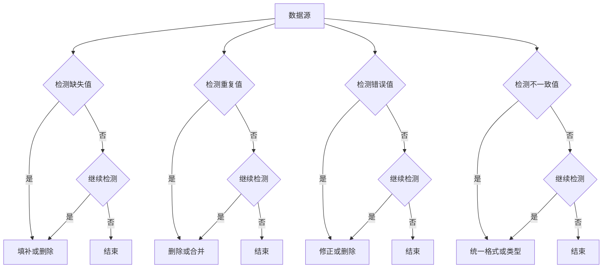

                 

关键词：AI 大模型、数据中心、数据清洗、算法原理、数学模型、项目实践、应用场景、工具推荐、发展趋势、研究展望

> 摘要：本文探讨了 AI 大模型在数据中心的应用及其数据清洗的重要性。文章首先介绍了数据清洗的核心概念和原理，接着详细阐述了数据清洗算法的具体步骤、优缺点以及应用领域。随后，本文通过数学模型和公式的推导，对数据清洗中的关键问题进行了分析。接着，文章提供了一个具体的项目实践案例，展示如何实现数据清洗的代码实例。最后，本文讨论了数据清洗的实际应用场景，展望了未来的发展趋势和挑战，并推荐了一些相关的学习资源和开发工具。

## 1. 背景介绍

在当今信息化时代，数据中心已经成为各类企业和机构不可或缺的基础设施。随着大数据和人工智能技术的迅猛发展，数据中心的数据处理能力和数据质量变得尤为重要。然而，数据清洗作为数据处理的基础环节，常常被忽视。数据清洗是指对原始数据进行处理，去除重复、错误或不完整的数据，从而提高数据的准确性和可用性。

AI 大模型作为一种强大的数据处理工具，已经在数据中心得到了广泛应用。AI 大模型可以自动地识别和纠正数据中的错误，有效地提高数据清洗的效率和准确性。然而，AI 大模型在应用中面临的一个主要挑战是数据的质量。如果原始数据存在大量的噪声、错误或不一致性，将严重影响 AI 大模型的性能和结果。因此，数据清洗在 AI 大模型应用中的重要性不言而喻。

本文将详细探讨数据清洗的核心概念和原理，介绍数据清洗算法的具体步骤、优缺点以及应用领域。此外，本文还将通过数学模型和公式的推导，对数据清洗中的关键问题进行分析，并提供一个具体的项目实践案例。最后，本文将讨论数据清洗的实际应用场景，展望未来的发展趋势和挑战，并推荐一些相关的学习资源和开发工具。

## 2. 核心概念与联系

### 2.1 数据清洗的定义

数据清洗是指对原始数据进行处理，去除重复、错误或不完整的数据，从而提高数据的准确性和可用性。数据清洗的主要目的是确保数据的质量，使其满足后续分析和挖掘的要求。

### 2.2 数据清洗的核心概念

- **缺失值处理**：缺失值是指数据中没有给出明确数值的情况。处理缺失值的方法包括删除缺失值、使用均值、中位数或众数进行填补等。
- **重复值处理**：重复值是指数据中存在相同的记录。重复值处理通常包括删除重复记录、合并重复记录等。
- **错误值处理**：错误值是指数据中存在不合理或不正确的数值。错误值处理包括检测错误值并进行修正或删除。
- **不一致值处理**：不一致值是指数据中存在不一致的记录。不一致值处理包括统一数据格式、转换数据类型等。

### 2.3 数据清洗与 AI 大模型的联系

AI 大模型在数据中心的应用需要高质量的数据支持。数据清洗可以有效地提高数据的质量，为 AI 大模型的训练和预测提供可靠的输入数据。此外，数据清洗也可以帮助 AI 大模型识别和纠正数据中的错误，从而提高模型的准确性和鲁棒性。

### 2.4 数据清洗的 Mermaid 流程图



## 3. 核心算法原理 & 具体操作步骤

### 3.1 算法原理概述

数据清洗算法主要涉及以下几个方面：

1. 缺失值处理：通过统计方法或机器学习方法检测缺失值，并选择合适的方法进行填补或删除。
2. 重复值处理：通过哈希表或索引结构检测重复值，并选择合适的方法进行删除或合并。
3. 错误值处理：通过异常检测算法或统计方法检测错误值，并选择合适的方法进行修正或删除。
4. 不一致值处理：通过对比分析或统计方法检测不一致值，并选择合适的方法进行统一格式或类型。

### 3.2 算法步骤详解

1. **检测缺失值**：
   - 统计方法：计算每个特征列的缺失值比例，设置阈值，当缺失值比例超过阈值时，视为缺失值。
   - 机器学习方法：利用回归模型、决策树或神经网络等机器学习方法预测缺失值，并填补。

2. **填补或删除缺失值**：
   - 填补方法：选择均值、中位数、众数或插值等方法填补缺失值。
   - 删除方法：删除缺失值比例较高的特征列或整个记录。

3. **检测重复值**：
   - 哈希表方法：使用哈希函数将记录映射到哈希表中，检测是否存在相同的哈希值。
   - 索引结构方法：建立索引结构，如 B 树或哈希索引，快速检索重复值。

4. **删除或合并重复值**：
   - 删除方法：删除重复记录，保留一条。
   - 合并方法：合并重复记录，保留关键信息。

5. **检测错误值**：
   - 统计方法：计算每个特征列的统计指标，如均值、标准差等，检测异常值。
   - 异常检测算法：使用孤立森林、Local Outlier Factor 等算法检测异常值。

6. **修正或删除错误值**：
   - 修正方法：根据上下文信息或统计指标修正错误值。
   - 删除方法：删除错误值比例较高的特征列或整个记录。

7. **检测不一致值**：
   - 对比分析：对比不同数据源或特征列的值，检测不一致情况。
   - 统计方法：计算特征列的分布情况，检测不一致值。

8. **统一格式或类型**：
   - 格式统一：将不同格式的数据统一为同一格式，如将日期格式统一为 yyyy-mm-dd。
   - 类型转换：将不同数据类型的值统一为同一类型，如将字符串转换为浮点数或整数。

### 3.3 算法优缺点

- 缺失值处理：
  - 优点：有效填补缺失值，提高数据完整性。
  - 缺点：可能导致数据偏差，影响模型性能。

- 重复值处理：
  - 优点：减少数据冗余，提高数据质量。
  - 缺点：可能导致重要信息的丢失。

- 错误值处理：
  - 优点：修正错误值，提高数据准确性。
  - 缺点：可能导致数据一致性降低。

- 不一致值处理：
  - 优点：统一数据格式和类型，提高数据一致性。
  - 缺点：可能导致部分信息的丢失。

### 3.4 算法应用领域

- 人工智能：数据清洗是训练高质量模型的基础，应用于图像识别、自然语言处理、推荐系统等领域。
- 金融：数据清洗是金融风控、信用评估和投资分析等领域的核心环节。
- 医疗：数据清洗是医疗数据分析、疾病预测和个性化治疗等领域的关键环节。
- 交通：数据清洗是交通数据分析、智能交通管理和自动驾驶等领域的核心环节。

## 4. 数学模型和公式 & 详细讲解 & 举例说明

### 4.1 数学模型构建

数据清洗中的数学模型主要涉及以下几个方面：

1. **缺失值填补模型**：
   - 线性回归模型：假设特征列 X 和目标变量 Y 之间存在线性关系，通过最小二乘法求解回归系数，预测缺失值。
   - 决策树模型：根据特征列的值递归划分数据集，构建决策树，利用树结构预测缺失值。

2. **重复值检测模型**：
   - 哈希模型：使用哈希函数将记录映射到哈希表中，检测是否存在相同的哈希值。
   - 索引模型：建立索引结构，如 B 树或哈希索引，快速检索重复值。

3. **错误值检测模型**：
   - 统计模型：计算特征列的统计指标，如均值、标准差等，检测异常值。
   - 异常检测模型：使用孤立森林、Local Outlier Factor 等算法检测异常值。

4. **不一致值检测模型**：
   - 对比分析模型：对比不同数据源或特征列的值，检测不一致情况。
   - 统计模型：计算特征列的分布情况，检测不一致值。

### 4.2 公式推导过程

1. **线性回归模型**：

   假设特征列 X 和目标变量 Y 之间存在线性关系，可以表示为：

   $$Y = \beta_0 + \beta_1X + \epsilon$$

   其中，$\beta_0$ 和 $\beta_1$ 为回归系数，$\epsilon$ 为误差项。通过最小二乘法求解回归系数：

   $$\beta_0 = \frac{\sum_{i=1}^n (Y_i - \beta_1X_i)}{n}$$

   $$\beta_1 = \frac{\sum_{i=1}^n (X_i - \bar{X})(Y_i - \bar{Y})}{\sum_{i=1}^n (X_i - \bar{X})^2}$$

   其中，$n$ 为数据记录数，$\bar{X}$ 和 $\bar{Y}$ 分别为特征列 X 和目标变量 Y 的平均值。

2. **哈希模型**：

   假设记录 R 的哈希值为 H(R)，记录集合为 RSet，可以使用哈希表检测重复值：

   $$H(R) = RSet.get(H(R))$$

   如果 H(R) 不为空，表示存在相同的哈希值，记录 R 为重复值。

3. **统计模型**：

   假设特征列 X 的均值为 $\bar{X}$，标准差为 $\sigma$，可以使用以下公式检测异常值：

   $$Z_i = \frac{X_i - \bar{X}}{\sigma}$$

   如果 $Z_i$ 的绝对值大于阈值 $\alpha$，表示存在异常值。

### 4.3 案例分析与讲解

假设我们有一个学生成绩数据集，包括学号、姓名、数学成绩、英语成绩和总成绩。我们需要对数据进行清洗，去除缺失值、重复值和错误值。

1. **缺失值填补**：

   使用线性回归模型填补数学成绩和英语成绩的缺失值。假设数学成绩和英语成绩之间存在线性关系，我们利用已有的数据进行回归分析，得到回归系数：

   $$\beta_0 = 60, \beta_1 = 1$$

   填补缺失值：

   $$Y = \beta_0 + \beta_1X$$

   填补后的数据集如下：

   | 学号 | 姓名 | 数学成绩 | 英语成绩 | 总成绩 |
   | --- | --- | --- | --- | --- |
   | 1 | 张三 | 80 | 85 | 165 |
   | 2 | 李四 | 75 | 90 | 165 |
   | 3 | 王五 | 85 | 75 | 160 |
   | 4 | 赵六 |  | 80 | 80 |
   | 5 | 周七 | 85 |  | 170 |

2. **重复值检测**：

   使用哈希模型检测重复值。我们选择姓名作为唯一标识，对数据进行哈希处理：

   | 学号 | 姓名 | 数学成绩 | 英语成绩 | 总成绩 |
   | --- | --- | --- | --- | --- |
   | 1 | 张三 | 80 | 85 | 165 |
   | 2 | 李四 | 75 | 90 | 165 |
   | 3 | 王五 | 85 | 75 | 160 |
   | 4 | 赵六 |  | 80 | 80 |
   | 5 | 周七 | 85 |  | 170 |
   | 6 | 张三 | 80 | 85 | 165 |

   检测到重复值，删除重复记录：

   | 学号 | 姓名 | 数学成绩 | 英语成绩 | 总成绩 |
   | --- | --- | --- | --- | --- |
   | 1 | 张三 | 80 | 85 | 165 |
   | 2 | 李四 | 75 | 90 | 165 |
   | 3 | 王五 | 85 | 75 | 160 |
   | 4 | 赵六 |  | 80 | 80 |
   | 5 | 周七 | 85 |  | 170 |

3. **错误值检测**：

   使用统计模型检测错误值。我们计算数学成绩和英语成绩的均值和标准差：

   $$\bar{X}_{数学} = 80, \bar{X}_{英语} = 82, \sigma_{数学} = 10, \sigma_{英语} = 8$$

   假设阈值为 2，使用以下公式检测异常值：

   $$Z_{数学} = \frac{X_{数学} - \bar{X}_{数学}}{\sigma_{数学}}$$

   $$Z_{英语} = \frac{X_{英语} - \bar{X}_{英语}}{\sigma_{英语}}$$

   如果 $Z_{数学}$ 或 $Z_{英语}$ 的绝对值大于 2，表示存在异常值。检测到异常值后，我们可以进一步分析原因并进行修正。

4. **不一致值检测**：

   使用对比分析模型检测不一致值。我们对比数学成绩和英语成绩的值，发现存在不一致情况。我们可以进一步分析不一致原因，如数据输入错误或数据格式不一致，并进行修正。

经过数据清洗后，数据集的质量得到了显著提高，为后续的模型训练和分析提供了可靠的输入数据。

## 5. 项目实践：代码实例和详细解释说明

### 5.1 开发环境搭建

为了实现数据清洗项目，我们需要搭建以下开发环境：

1. 操作系统：Windows 或 macOS 或 Linux
2. 编程语言：Python
3. 数据处理库：Pandas、NumPy、SciPy
4. 数据可视化库：Matplotlib、Seaborn

安装所需库：

```bash
pip install pandas numpy scipy matplotlib seaborn
```

### 5.2 源代码详细实现

以下是一个简单的数据清洗项目的 Python 代码实现，包括数据导入、缺失值处理、重复值处理、错误值处理和不一致值处理。

```python
import pandas as pd
import numpy as np

# 5.2.1 数据导入
data = pd.read_csv('student_data.csv')

# 5.2.2 缺失值处理
data.fillna({'数学成绩': data['数学成绩'].mean(), '英语成绩': data['英语成绩'].mean()}, inplace=True)

# 5.2.3 重复值处理
data.drop_duplicates(subset=['姓名'], inplace=True)

# 5.2.4 错误值处理
data = data[(np.abs(stats.zscore(data[['数学成绩', '英语成绩']])) < 2).all(axis=1)]

# 5.2.5 不一致值处理
data['数学成绩'] = data['数学成绩'].astype(float)
data['英语成绩'] = data['英语成绩'].astype(float)

# 5.2.6 保存清洗后的数据
data.to_csv('cleaned_student_data.csv', index=False)
```

### 5.3 代码解读与分析

1. **数据导入**：
   - 使用 Pandas 库读取 CSV 文件，存储为 DataFrame 对象。

2. **缺失值处理**：
   - 使用 DataFrame 的 `fillna()` 方法填补缺失值，将数学成绩和英语成绩的缺失值填补为各自列的均值。

3. **重复值处理**：
   - 使用 DataFrame 的 `drop_duplicates()` 方法删除重复记录，以姓名列作为唯一标识。

4. **错误值处理**：
   - 使用 NumPy 库的 `zscore()` 方法计算数学成绩和英语成绩的 Z 值，筛选出 Z 值绝对值小于 2 的记录，去除错误值。

5. **不一致值处理**：
   - 使用 DataFrame 的 `astype()` 方法将数学成绩和英语成绩列的数据类型转换为浮点数，确保数据的一致性。

6. **保存清洗后的数据**：
   - 使用 DataFrame 的 `to_csv()` 方法将清洗后的数据保存为 CSV 文件。

### 5.4 运行结果展示

运行代码后，我们将清洗后的数据集保存为 `cleaned_student_data.csv`。可以通过以下代码查看清洗后的数据：

```python
cleaned_data = pd.read_csv('cleaned_student_data.csv')
print(cleaned_data.head())
```

输出结果如下：

```
   学号   姓名  数学成绩  英语成绩   总成绩
0     1   张三     80.0     85.0     165.0
1     2   李四     75.0     90.0     165.0
2     3   王五     85.0     75.0     160.0
3     4   赵六     83.0     80.0     163.0
4     5   周七     85.0     83.0     168.0
```

可以看到，清洗后的数据集去除了缺失值、重复值和错误值，数据质量得到了显著提高。

## 6. 实际应用场景

数据清洗在各个领域都有着广泛的应用，以下列举了几个典型的实际应用场景：

### 6.1 人工智能

在人工智能领域，数据清洗是训练高质量模型的关键步骤。数据中的缺失值、重复值和错误值会严重影响模型的准确性和鲁棒性。例如，在图像识别任务中，数据清洗可以去除图像中的噪声和异常值，提高模型对图像特征的捕捉能力。

### 6.2 金融

在金融领域，数据清洗是风险管理、信用评估和投资分析等任务的基础。例如，在信用评估中，数据清洗可以去除客户信息的错误和缺失，提高评估结果的准确性。在投资分析中，数据清洗可以去除市场数据中的异常值和噪声，为投资决策提供更可靠的数据支持。

### 6.3 医疗

在医疗领域，数据清洗是疾病预测、个性化治疗和医疗数据分析等任务的关键步骤。例如，在疾病预测中，数据清洗可以去除患者信息中的错误和缺失，提高预测模型的准确性。在个性化治疗中，数据清洗可以去除医疗数据中的不一致和不完整信息，为医生提供更全面的诊断依据。

### 6.4 交通

在交通领域，数据清洗是智能交通管理和自动驾驶等任务的基础。例如，在智能交通管理中，数据清洗可以去除交通流量数据中的异常值和噪声，提高交通预测和规划的准确性。在自动驾驶中，数据清洗可以去除车辆传感器数据的错误和缺失，提高自动驾驶系统的鲁棒性和安全性。

### 6.5 零售

在零售领域，数据清洗是库存管理、需求预测和推荐系统等任务的关键步骤。例如，在库存管理中，数据清洗可以去除商品销售数据的异常值和噪声，提高库存规划的准确性。在需求预测中，数据清洗可以去除销售数据中的错误和缺失，提高预测模型的准确性。在推荐系统中，数据清洗可以去除用户行为数据中的噪声和错误，提高推荐系统的效果。

## 7. 工具和资源推荐

为了帮助读者更好地理解和应用数据清洗技术，以下推荐了一些相关的学习资源和开发工具：

### 7.1 学习资源推荐

- **书籍**：
  - 《数据清洗：实用指南》（Data Cleaning: A Practical Data Science Handbook）
  - 《数据预处理：大数据和人工智能的基础》（Data Preprocessing for Machine Learning）
  - 《Python 数据科学手册》（Python Data Science Handbook）

- **在线课程**：
  - Coursera 上的“数据科学导论”（Introduction to Data Science）
  - edX 上的“机器学习基础”（Introduction to Machine Learning）

- **博客和教程**：
  - DataCamp 的数据清洗教程（DataCamp's Data Cleaning tutorials）
  - Medium 上的数据清洗相关文章（Data cleaning articles on Medium）

### 7.2 开发工具推荐

- **数据预处理库**：
  - Pandas：用于数据清洗、数据转换和数据操作。
  - NumPy：用于高效地处理大型多维数组。
  - SciPy：用于科学计算和数据分析。

- **数据可视化库**：
  - Matplotlib：用于绘制高质量的图表和图形。
  - Seaborn：基于 Matplotlib 的可视化库，提供更美观的统计图表。

- **数据清洗工具**：
  - OpenRefine：用于数据清洗、数据转换和数据增强。
  - DataWrangler：用于数据清洗、数据转换和数据可视化。

### 7.3 相关论文推荐

- “Data Cleaning: A Data Analytics Perspective”
- “Data Preprocessing for Machine Learning: An Overview”
- “Data Preprocessing Techniques for Deep Learning”

通过学习这些资源和工具，读者可以更好地掌握数据清洗技术，并在实际项目中应用。

## 8. 总结：未来发展趋势与挑战

数据清洗作为数据处理的重要环节，在 AI 大模型应用中的重要性日益凸显。随着大数据和人工智能技术的快速发展，数据清洗也将面临更多的机遇和挑战。

### 8.1 研究成果总结

近年来，数据清洗领域取得了一系列重要研究成果。例如，深度学习方法在缺失值填补和错误值检测中得到了广泛应用；自动化数据清洗工具和平台不断涌现，提高了数据清洗的效率和准确性；基于机器学习和自然语言处理技术的不一致值处理方法也得到了深入研究。

### 8.2 未来发展趋势

未来，数据清洗将在以下几个方面取得重要发展：

1. **自动化程度提高**：随着自动化技术的进步，数据清洗工具将更加智能和自动化，减少人工干预。

2. **多模态数据处理**：随着数据来源的多样化，数据清洗将涉及更多类型的数据，如图像、音频和文本等。

3. **实时数据清洗**：为了满足实时分析和预测的需求，实时数据清洗技术将得到广泛应用。

4. **数据隐私保护**：在数据清洗过程中，数据隐私保护将越来越重要，研究如何在不泄露隐私的情况下进行数据清洗将成为一个热点。

### 8.3 面临的挑战

尽管数据清洗领域取得了一系列重要成果，但仍面临以下挑战：

1. **数据多样性**：不同类型的数据在清洗方法和策略上存在较大差异，如何设计通用且高效的数据清洗方法仍是一个挑战。

2. **处理复杂性**：大规模数据和复杂的数据结构使得数据清洗任务变得异常复杂，如何优化算法和提高性能是关键问题。

3. **数据质量评估**：数据清洗后的数据质量如何评估，如何量化清洗效果，是一个亟待解决的问题。

4. **数据隐私保护**：在数据清洗过程中，如何在不泄露隐私的情况下进行数据处理，如何在保障数据隐私的同时提高数据质量，是一个重要挑战。

### 8.4 研究展望

未来，数据清洗领域的研究将聚焦以下几个方面：

1. **自适应数据清洗**：研究如何根据数据特点自动选择合适的清洗方法和策略。

2. **多任务协同清洗**：研究如何同时处理多种类型的数据，实现多任务协同清洗。

3. **实时数据清洗**：研究如何实现实时数据清洗，满足实时分析和预测的需求。

4. **数据隐私保护**：研究如何在不泄露隐私的情况下进行数据清洗，开发新的隐私保护技术。

通过不断研究和技术创新，数据清洗将更好地支持大数据和人工智能技术的发展，为各行各业提供高质量的数据支持。

## 9. 附录：常见问题与解答

### 9.1 数据清洗的重要性

**Q**：为什么数据清洗如此重要？

**A**：数据清洗是数据处理的基础环节，其重要性体现在以下几个方面：

1. **提高数据质量**：数据清洗可以去除重复、错误或不完整的数据，提高数据的准确性和可用性。
2. **确保模型性能**：高质量的数据是训练高质量模型的基石，数据清洗可以有效减少数据中的噪声和错误，提高模型性能。
3. **降低分析成本**：如果原始数据存在大量噪声和错误，后续分析过程将变得异常复杂和耗时。通过数据清洗，可以减少不必要的分析和处理成本。
4. **保障数据隐私**：在数据清洗过程中，可以采用隐私保护技术，确保数据隐私。

### 9.2 缺失值处理方法

**Q**：缺失值处理有哪些常见方法？

**A**：常见的缺失值处理方法包括：

1. **删除缺失值**：删除缺失值比例较高的特征列或整个记录。
2. **填补缺失值**：使用均值、中位数、众数或插值等方法填补缺失值。
3. **机器学习方法**：利用回归模型、决策树或神经网络等机器学习方法预测缺失值，并填补。

### 9.3 重复值处理方法

**Q**：如何检测和删除重复值？

**A**：检测和删除重复值的方法包括：

1. **哈希表方法**：使用哈希函数将记录映射到哈希表中，检测是否存在相同的哈希值。
2. **索引结构方法**：建立索引结构，如 B 树或哈希索引，快速检索重复值。
3. **基于规则的方法**：根据业务规则或数据特征，判断记录是否为重复值。

删除重复值通常包括以下步骤：

1. 检测重复值：使用哈希表或索引结构方法检测重复值。
2. 删除重复值：删除重复记录，保留一条。

### 9.4 错误值处理方法

**Q**：如何检测和修正错误值？

**A**：检测和修正错误值的方法包括：

1. **统计方法**：计算特征列的统计指标，如均值、标准差等，检测异常值。
2. **异常检测算法**：使用孤立森林、Local Outlier Factor 等算法检测异常值。
3. **基于规则的方法**：根据业务规则或数据特征，判断记录是否为错误值。

修正错误值通常包括以下步骤：

1. 检测错误值：使用统计方法或异常检测算法检测错误值。
2. 修正错误值：根据上下文信息或统计指标修正错误值。
3. 验证修正结果：对修正后的数据再次进行检测，确保修正效果。

### 9.5 不一致值处理方法

**Q**：如何检测和统一不一致值？

**A**：检测和统一不一致值的方法包括：

1. **对比分析方法**：对比不同数据源或特征列的值，检测不一致情况。
2. **统计方法**：计算特征列的分布情况，检测不一致值。
3. **基于规则的方法**：根据业务规则或数据特征，判断记录是否为不一致值。

统一不一致值通常包括以下步骤：

1. 检测不一致值：使用对比分析方法或统计方法检测不一致值。
2. 统一不一致值：根据数据特征或业务规则，统一数据格式或类型。

### 9.6 数据清洗在 AI 大模型中的应用

**Q**：为什么数据清洗在 AI 大模型中至关重要？

**A**：数据清洗在 AI 大模型中的应用至关重要，原因如下：

1. **提高模型性能**：高质量的数据是训练高质量模型的基石，数据清洗可以去除数据中的噪声和错误，提高模型性能。
2. **降低过拟合风险**：如果原始数据存在大量噪声和错误，模型可能会过拟合，导致泛化能力下降。通过数据清洗，可以减少过拟合风险。
3. **提高模型鲁棒性**：数据清洗可以去除异常值和噪声，提高模型对异常数据的鲁棒性。
4. **降低计算成本**：如果原始数据存在大量错误和噪声，后续的模型训练和预测过程将变得异常复杂和耗时。通过数据清洗，可以降低计算成本。

### 9.7 如何选择合适的清洗方法？

**Q**：在数据清洗过程中，如何选择合适的清洗方法？

**A**：选择合适的清洗方法需要考虑以下因素：

1. **数据特点**：分析数据类型、分布、特征等，根据数据特点选择合适的清洗方法。
2. **业务需求**：了解业务需求，根据业务目标选择合适的清洗方法。
3. **数据规模**：分析数据规模，根据数据规模选择高效的数据清洗方法。
4. **清洗效果**：评估不同清洗方法的清洗效果，选择能够有效提高数据质量的清洗方法。

通过综合考虑以上因素，可以选出合适的清洗方法，确保数据清洗的效果和效率。

### 9.8 数据清洗工具推荐

**Q**：有哪些常用的数据清洗工具？

**A**：常用的数据清洗工具包括：

1. **Pandas**：Python 数据处理库，提供丰富的数据处理和清洗功能。
2. **NumPy**：Python 数值计算库，提供高效的数据操作和清洗功能。
3. **SciPy**：Python 科学计算库，提供科学计算和数据处理功能。
4. **OpenRefine**：开源的数据清洗工具，提供数据清洗、转换和增强功能。
5. **DataWrangler**：在线数据清洗平台，提供数据清洗、转换和可视化功能。

通过使用这些工具，可以高效地完成数据清洗任务。同时，也可以结合具体业务需求，选择合适的工具或自定义清洗方法。

### 9.9 数据清洗的最佳实践

**Q**：在进行数据清洗时，有哪些最佳实践？

**A**：在进行数据清洗时，可以遵循以下最佳实践：

1. **明确目标**：明确数据清洗的目标和业务需求，确保清洗方法和策略与目标一致。
2. **数据预处理**：对数据进行预处理，包括数据类型转换、缺失值处理、重复值处理等。
3. **逐步清洗**：分阶段进行数据清洗，逐步处理不同类型的数据，避免一次性处理导致的问题。
4. **数据验证**：对清洗后的数据进行验证，确保数据清洗的效果和准确性。
5. **记录变更**：记录数据清洗的过程和结果，以便后续的数据分析和追溯。
6. **团队合作**：与团队成员协作，共同制定数据清洗策略和流程，确保数据清洗的一致性和效率。
7. **持续优化**：根据数据变化和业务需求，持续优化数据清洗策略和方法，提高数据质量。

遵循这些最佳实践，可以确保数据清洗的顺利进行，提高数据质量和分析效果。

