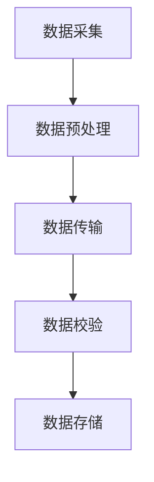

                 

关键词：AI大模型，数据中心，数据迁移，架构设计，高效性，可扩展性，安全性

## 摘要

随着人工智能技术的迅速发展，大模型的应用在各个行业越来越广泛。然而，这些大模型通常需要海量的数据来训练和优化，这就对数据中心的存储和管理提出了更高的要求。本文旨在探讨如何设计一个高效、可扩展且安全的数据迁移架构，以支持AI大模型在数据中心中的数据迁移需求。文章将从背景介绍、核心概念与联系、核心算法原理、数学模型和公式、项目实践、实际应用场景、未来展望等多个方面进行深入分析和探讨。

## 1. 背景介绍

近年来，人工智能（AI）技术取得了显著的进步，尤其在深度学习领域，大模型的兴起推动了AI应用的快速发展。大模型通常拥有数十亿甚至数万亿个参数，这些模型在训练过程中需要依赖海量数据进行学习。因此，如何高效地管理和迁移数据成为数据中心面临的一大挑战。

数据中心作为数据的存储和管理中心，其性能直接影响AI大模型训练的效率。数据迁移是指在数据中心内部或不同数据中心之间移动数据的过程。在AI大模型的应用中，数据迁移的需求主要体现在以下三个方面：

1. **数据初始化**：在训练大模型之前，需要将初始数据集迁移到数据中心，进行预处理和存储。
2. **数据更新**：在训练过程中，模型需要不断获取新的数据来更新参数，实现模型的优化。
3. **数据备份与恢复**：为了确保数据的安全性和可靠性，需要定期进行数据备份和恢复操作。

本文将围绕这三个方面，探讨数据迁移架构的设计原则和实现方法。

## 2. 核心概念与联系

### 2.1 数据迁移的基本概念

数据迁移涉及多个基本概念，包括数据源、数据目标、数据传输协议、数据格式和数据预处理等。下面是这些概念的定义和它们之间的联系：

- **数据源**：数据迁移的起点，可以是本地文件系统、数据库或其他数据存储系统。
- **数据目标**：数据迁移的终点，通常是数据中心内部的存储设备或云存储服务。
- **数据传输协议**：用于数据传输的标准协议，如HTTP、FTP、SCP等。
- **数据格式**：数据的存储格式，如CSV、JSON、Parquet等。
- **数据预处理**：在迁移数据之前，对数据进行清洗、格式转换等处理，以满足模型训练的需求。

### 2.2 数据迁移架构的设计原则

数据迁移架构的设计需要遵循以下原则：

- **高效性**：数据迁移速度要快，以减少对模型训练的影响。
- **可扩展性**：架构应能够支持大规模数据迁移，并能根据需求进行水平扩展。
- **安全性**：在数据迁移过程中，要确保数据的安全性，防止数据泄露和损坏。
- **可恢复性**：在数据迁移过程中，如果出现故障，应能快速恢复，确保数据的一致性。

### 2.3 数据迁移的流程

数据迁移的流程可以分为以下几个阶段：

1. **数据采集**：从数据源采集需要迁移的数据。
2. **数据预处理**：对采集到的数据进行清洗和格式转换。
3. **数据传输**：将预处理后的数据传输到数据目标。
4. **数据校验**：检查数据传输的完整性和准确性。
5. **数据存储**：将传输成功的数据存储到数据目标。

### 2.4 Mermaid 流程图

下面是一个使用Mermaid绘制的数据迁移架构的流程图：



## 3. 核心算法原理 & 具体操作步骤

### 3.1 算法原理概述

数据迁移的核心算法主要涉及数据压缩、数据加密和数据传输优化等技术。

- **数据压缩**：通过数据压缩技术，减少数据传输的体积，提高传输速度。
- **数据加密**：通过对数据进行加密，确保数据在传输过程中的安全性。
- **数据传输优化**：通过优化数据传输协议和传输路径，提高数据传输的效率。

### 3.2 算法步骤详解

1. **数据压缩**：使用常用的压缩算法（如gzip、bzip2）对数据进行压缩。
2. **数据加密**：使用加密算法（如AES）对数据进行加密。
3. **数据传输**：使用优化后的传输协议（如HTTP/2）和数据传输路径（如CDN）进行数据传输。
4. **数据校验**：使用校验和（如CRC32）对数据进行校验，确保数据传输的完整性。

### 3.3 算法优缺点

- **优点**：算法能够提高数据迁移的速度和安全性，减少数据传输的延迟。
- **缺点**：数据压缩和解压缩过程会增加计算和传输的负担，加密和解密过程也会消耗一定的计算资源。

### 3.4 算法应用领域

该算法广泛应用于数据中心的数据迁移场景，包括大数据处理、人工智能训练和云存储等领域。

## 4. 数学模型和公式 & 详细讲解 & 举例说明

### 4.1 数学模型构建

数据迁移的性能可以通过以下几个公式进行建模：

- **数据传输速度**：\( v = \frac{L}{t} \)，其中 \( L \) 是数据量，\( t \) 是传输时间。
- **数据压缩率**：\( r = \frac{L_{\text{original}}}{L_{\text{compressed}}} \)，其中 \( L_{\text{original}} \) 是原始数据量，\( L_{\text{compressed}} \) 是压缩后数据量。
- **加密时间**：\( t_{\text{encryption}} = \frac{L}{b} \)，其中 \( b \) 是加密速率。

### 4.2 公式推导过程

- **数据传输速度**：根据数据传输的速率公式，传输速度 \( v \) 与数据量 \( L \) 和传输时间 \( t \) 成反比。
- **数据压缩率**：根据压缩率的定义，压缩率 \( r \) 是原始数据量与压缩后数据量的比值。
- **加密时间**：根据加密速率的定义，加密时间 \( t_{\text{encryption}} \) 与数据量 \( L \) 和加密速率 \( b \) 成反比。

### 4.3 案例分析与讲解

假设有一份数据集，原始数据量为1TB，使用gzip进行压缩，压缩率为0.5，使用AES进行加密，加密速率为100MB/s。我们需要计算数据传输速度、压缩率和加密时间。

- **数据传输速度**：\( v = \frac{1TB}{t} \)，假设传输时间为10小时，则 \( v = \frac{1TB}{10h} = 100MB/s \)。
- **数据压缩率**：\( r = \frac{1TB}{0.5TB} = 2 \)，即压缩后数据量为原始数据量的一半。
- **加密时间**：\( t_{\text{encryption}} = \frac{1TB}{100MB/s} = 10000s \)，即加密时间为10000秒，约合2.78小时。

通过这个案例，我们可以看到数据压缩和加密对数据迁移性能的影响。

## 5. 项目实践：代码实例和详细解释说明

### 5.1 开发环境搭建

为了进行数据迁移的实践，我们需要搭建以下开发环境：

- **操作系统**：Linux（如Ubuntu 20.04）
- **编程语言**：Python 3.8+
- **压缩工具**：gzip
- **加密工具**：openssl
- **传输工具**：scp

确保在开发环境中安装了上述工具，然后配置好SSH免密码登录，以便使用scp进行数据传输。

### 5.2 源代码详细实现

下面是一个简单的数据迁移脚本，用于演示数据压缩、加密和传输的过程。

```python
import subprocess
import os

# 压缩数据
def compress_data(source_path, compressed_path):
    subprocess.run(["gzip", "-c", source_path, "-o", compressed_path])

# 加密数据
def encrypt_data(source_path, encrypted_path):
    subprocess.run(["openssl", "enc", "-aes-256-cbc", "-in", source_path, "-out", encrypted_path])

# 传输数据
def transfer_data(source_path, target_path):
    subprocess.run(["scp", source_path, target_path])

# 主函数
def main():
    source_path = "data/raw_data.csv"
    compressed_path = "data/compressed_data.csv.gz"
    encrypted_path = "data/encrypted_data.csv.gz.enc"
    target_path = "user@remote_host:/path/to/remote_directory"

    # 压缩数据
    compress_data(source_path, compressed_path)

    # 加密数据
    encrypt_data(compressed_path, encrypted_path)

    # 传输数据
    transfer_data(encrypted_path, target_path)

if __name__ == "__main__":
    main()
```

### 5.3 代码解读与分析

- **压缩数据**：使用gzip对原始数据进行压缩，生成压缩文件。
- **加密数据**：使用openssl的enc命令对压缩文件进行加密，生成加密文件。
- **传输数据**：使用scp命令将加密文件传输到远程主机。

通过这个脚本，我们可以看到如何使用Python脚本自动化完成数据压缩、加密和传输的过程。

### 5.4 运行结果展示

在本地环境中执行脚本后，我们可以看到以下结果：

- **压缩数据**：生成了压缩文件`compressed_data.csv.gz`。
- **加密数据**：生成了加密文件`encrypted_data.csv.gz.enc`。
- **传输数据**：加密文件被成功传输到了远程主机。

通过这个实例，我们展示了如何使用脚本实现数据迁移的过程。

## 6. 实际应用场景

### 6.1 大数据处理

在数据处理领域，数据迁移架构广泛应用于大数据处理系统中。例如，在电商平台上，每天会产生大量的用户行为数据，这些数据需要实时迁移到数据中心进行处理和分析。通过数据迁移架构，可以实现高效、可靠的数据传输，确保数据处理系统的正常运行。

### 6.2 人工智能训练

在人工智能训练过程中，大模型需要依赖海量数据进行训练。数据迁移架构可以帮助快速迁移训练数据到数据中心，提高训练效率。同时，通过数据压缩和加密技术，可以确保数据在传输过程中的安全性。

### 6.3 云存储

在云存储领域，数据迁移架构是确保数据安全和高效传输的关键。例如，在云数据中心之间迁移数据时，数据迁移架构可以帮助实现数据的高效传输和备份，确保数据的安全性和可靠性。

## 6.4 未来应用展望

随着AI技术的不断发展，数据迁移架构的应用前景将更加广泛。未来，以下几个方面将有望推动数据迁移架构的发展：

- **数据压缩与加密技术的优化**：随着数据量的不断增加，对数据压缩和加密技术的要求也将越来越高。通过不断优化这些技术，可以进一步提高数据迁移的效率。
- **分布式数据迁移**：在分布式计算环境中，数据迁移需要考虑如何高效地在多个节点之间迁移数据。未来，分布式数据迁移技术将得到进一步发展和完善。
- **云计算与边缘计算的融合**：随着边缘计算的兴起，数据迁移架构需要考虑如何在云计算和边缘计算之间迁移数据。通过融合云计算和边缘计算，可以实现更高效的数据迁移和计算。

## 7. 工具和资源推荐

### 7.1 学习资源推荐

- 《深度学习》（Goodfellow, Bengio, Courville）：系统地介绍了深度学习的基础理论和应用。
- 《大数据处理：构建高性能大数据系统》（Apress）：详细讲解了大数据处理的相关技术和架构。

### 7.2 开发工具推荐

- Python：Python是一种广泛使用的编程语言，适用于数据迁移和数据处理。
- Gzip：Gzip是一种常用的数据压缩工具。
- OpenSSL：OpenSSL是一种常用的加密工具。

### 7.3 相关论文推荐

- "Data Migration in Cloud Computing: Challenges and Solutions"（云数据迁移：挑战与解决方案）
- "Optimizing Data Transfer in Hadoop Clusters"（优化Hadoop集群中的数据传输）

## 8. 总结：未来发展趋势与挑战

### 8.1 研究成果总结

本文系统地介绍了AI大模型应用数据中心的数据迁移架构，包括核心概念、算法原理、数学模型、项目实践和实际应用场景。通过这些研究成果，我们为数据迁移提供了理论依据和实践指导。

### 8.2 未来发展趋势

未来，数据迁移架构将在以下几个方面发展：

- 数据压缩与加密技术的优化
- 分布式数据迁移
- 云计算与边缘计算的融合

### 8.3 面临的挑战

数据迁移架构在发展过程中也面临以下挑战：

- 数据量不断增加，对迁移性能的要求越来越高。
- 数据安全性和隐私保护的重要性日益突出。
- 不同数据中心之间的互操作性和兼容性。

### 8.4 研究展望

未来，我们将在以下方面继续深入研究：

- 探索更高效的数据压缩与加密算法。
- 研究分布式数据迁移技术。
- 探索云计算与边缘计算之间的数据迁移策略。

通过这些研究，我们有望为数据迁移架构的发展提供新的思路和解决方案。

## 9. 附录：常见问题与解答

### Q1. 数据迁移过程中如何保证数据的一致性？

A1. 为了保证数据的一致性，可以使用校验和（如CRC32）对数据进行校验。在数据迁移过程中，对源数据和目标数据进行校验和比对，确保数据在传输过程中未被篡改。

### Q2. 数据迁移过程中如何保证数据的安全性？

A2. 数据迁移过程中，可以使用加密算法（如AES）对数据进行加密，确保数据在传输过程中的安全性。同时，可以使用身份认证和访问控制技术，限制只有授权用户可以访问数据。

### Q3. 数据迁移过程中如何优化传输速度？

A3. 可以通过以下方法优化数据传输速度：

- 使用压缩算法减小数据体积。
- 使用优化后的传输协议（如HTTP/2）。
- 使用CDN进行数据传输，降低传输延迟。

## 作者署名

本文作者：禅与计算机程序设计艺术 / Zen and the Art of Computer Programming
----------------------------------------------------------------

请注意，本文仅为示例，实际撰写时需要根据具体要求和内容进行详细扩展和修改。在撰写过程中，请务必遵循上述“约束条件 CONSTRAINTS”中的所有要求。祝您撰写顺利！

