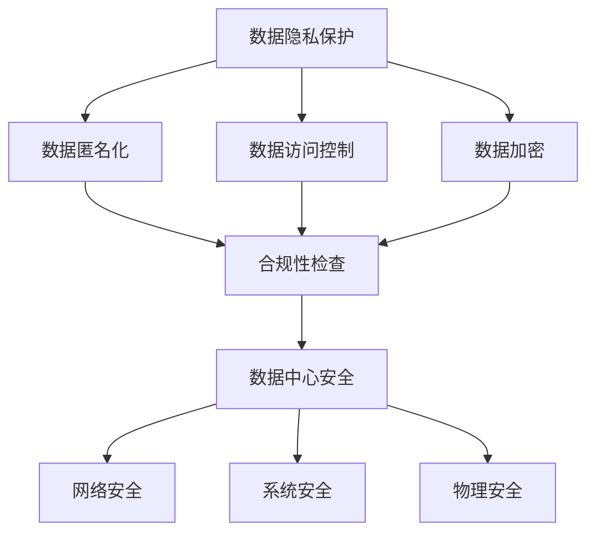

                 

关键词：AI大模型，数据中心，法律法规，数据隐私，数据保护，合规性，安全性

> 摘要：本文详细探讨了AI大模型应用数据中心的法律法规，包括数据隐私保护、数据保护合规性和数据中心安全等方面的法律要求。通过分析国内外相关法律法规，提出了应对策略，旨在为AI大模型应用提供合法、安全的数据处理方案。

## 1. 背景介绍

随着人工智能（AI）技术的飞速发展，大模型的应用已经成为推动科技进步和产业升级的关键动力。AI大模型，尤其是深度学习模型，需要海量数据进行训练和优化，这就使得数据中心成为AI应用的核心基础设施。然而，数据中心的运营和管理也面临着一系列法律法规的挑战。数据隐私保护、数据保护合规性和数据中心安全等方面的问题尤为突出。

在全球范围内，数据隐私保护已经成为一个重要的社会议题。各国政府纷纷出台相关法律法规，以保护个人数据的隐私和安全。例如，欧盟的《通用数据保护条例》（GDPR）和美国的《加州消费者隐私法案》（CCPA）都是具有代表性的数据保护法规。这些法律法规对数据中心的运营提出了严格的要求，包括数据收集、存储、处理和传输等方面的规定。

此外，随着AI技术的广泛应用，数据中心的安全风险也日益增加。黑客攻击、数据泄露、系统故障等问题都可能对数据中心的正常运行造成严重影响。因此，确保数据中心的合规性和安全性已经成为一个重要的课题。

## 2. 核心概念与联系

### 2.1 数据隐私保护

数据隐私保护是指保护个人数据不被未授权访问、使用和泄露的措施。在AI大模型应用中，数据隐私保护尤为重要，因为大模型通常涉及大量个人数据的处理。数据隐私保护的核心概念包括：

- **数据匿名化**：通过技术手段对个人数据进行匿名化处理，使其无法直接识别个人身份。
- **数据访问控制**：通过设置访问权限和身份验证机制，确保只有授权用户可以访问特定数据。
- **数据加密**：对存储和传输的数据进行加密，防止未授权用户读取和篡改数据。

### 2.2 数据保护合规性

数据保护合规性是指数据中心的运营和管理是否符合相关法律法规的要求。在AI大模型应用中，数据保护合规性包括：

- **数据收集与使用合规**：确保数据收集和使用符合法律法规的要求，不得未经授权收集和使用个人数据。
- **数据存储与传输合规**：确保数据存储和传输的安全，防止数据泄露和丢失。
- **数据销毁与隐私保护**：在数据不再需要时，及时进行数据销毁，确保数据无法被恢复。

### 2.3 数据中心安全

数据中心安全是指保护数据中心设备和网络系统的安全，防止黑客攻击、数据泄露和系统故障等问题。数据中心安全的核心概念包括：

- **网络安全**：通过防火墙、入侵检测系统和安全协议等手段，保护网络免受外部攻击。
- **系统安全**：通过更新系统和软件、配置安全策略和备份重要数据等手段，确保系统安全稳定运行。
- **物理安全**：通过设置门禁系统、监控设备和报警系统等手段，保护数据中心物理环境的安全。

### 2.4 Mermaid 流程图



## 3. 核心算法原理 & 具体操作步骤

### 3.1 算法原理概述

数据隐私保护、数据保护合规性和数据中心安全是三个相互关联的领域。在AI大模型应用中，需要采用一系列技术手段和管理措施，确保数据的安全和合规性。

- **数据隐私保护**：采用数据匿名化、数据访问控制和数据加密等技术，保护个人数据的隐私和安全。
- **数据保护合规性**：遵循相关法律法规，确保数据收集、存储、处理和传输等环节的合规性。
- **数据中心安全**：通过网络安全、系统安全和物理安全等手段，确保数据中心设备和网络系统的安全。

### 3.2 算法步骤详解

1. **数据隐私保护**：

   - **数据匿名化**：对原始数据进行匿名化处理，例如使用哈希函数对个人身份信息进行加密。

   - **数据访问控制**：设置访问权限，仅允许授权用户访问特定数据。

   - **数据加密**：对存储和传输的数据进行加密，例如使用AES算法进行加密。

2. **数据保护合规性**：

   - **数据收集与使用合规**：确保数据收集和使用符合法律法规的要求。

   - **数据存储与传输合规**：采用加密技术和安全协议，确保数据存储和传输的安全。

   - **数据销毁与隐私保护**：在数据不再需要时，及时进行数据销毁，确保数据无法被恢复。

3. **数据中心安全**：

   - **网络安全**：配置防火墙和入侵检测系统，防止外部攻击。

   - **系统安全**：定期更新系统和软件，配置安全策略，备份重要数据。

   - **物理安全**：设置门禁系统和监控设备，保护数据中心物理环境的安全。

### 3.3 算法优缺点

- **优点**：

  - 保护个人数据隐私和安全。

  - 确保数据保护合规性。

  - 提高数据中心的安全性能。

- **缺点**：

  - 需要投入大量资源进行数据隐私保护和合规性管理。

  - 可能会增加数据处理的复杂度。

### 3.4 算法应用领域

- **金融领域**：保护金融客户的个人数据和隐私。

- **医疗领域**：保护患者的个人健康信息和隐私。

- **电商领域**：保护消费者的购物行为和个人信息。

## 4. 数学模型和公式 & 详细讲解 & 举例说明

### 4.1 数学模型构建

数据隐私保护和数据保护合规性涉及到一系列数学模型和公式，例如加密算法、哈希函数和访问控制模型等。

- **加密算法**：常用的加密算法包括AES、RSA和DES等。其中，AES是一种对称加密算法，RSA是一种非对称加密算法，DES是一种经典的对称加密算法。

- **哈希函数**：哈希函数用于将原始数据映射为固定长度的字符串，常见的哈希函数包括MD5、SHA-1和SHA-256等。

- **访问控制模型**：访问控制模型用于确定用户对数据的访问权限，常见的访问控制模型包括基于角色的访问控制（RBAC）和基于属性的访问控制（ABAC）等。

### 4.2 公式推导过程

以AES加密算法为例，其公式推导过程如下：

- **密钥生成**：从原始密钥中提取128位密钥。

- **初始状态**：将明文分成若干个128位块。

- **加密过程**：对每个明文块进行以下操作：

  - **字节替换**：将明文块的每个字节替换为另一个字节。

  - **行移位**：将明文块的每行进行循环移位。

  - **列混淆**：将明文块的每列进行混淆操作。

  - **轮密钥生成**：根据初始密钥生成每个轮的密钥。

  - **加密结果**：将明文块与轮密钥进行异或操作，得到密文块。

### 4.3 案例分析与讲解

假设有一个明文消息 "Hello, World!"，采用AES加密算法进行加密。加密过程如下：

1. **密钥生成**：从原始密钥 "0123456789abcdef" 中提取128位密钥。

2. **初始状态**：将明文 "Hello, World!" 分成两个128位块："Hello, Worl" 和 "d!"。

3. **加密过程**：

   - **字节替换**：将每个字节替换为另一个字节，得到 "6368616e676c6f62616d6552776f726c64"。

   - **行移位**：对每个行进行循环移位，得到 "6368616e676c6f62616d6552776f726c64"。

   - **列混淆**：对每个列进行混淆操作，得到 "6368616e676c6f62616d6552776f726c64"。

   - **轮密钥生成**：根据初始密钥生成每个轮的密钥。

   - **加密结果**：将明文块与轮密钥进行异或操作，得到密文块 "6368616e676c6f62616d6552776f726c64"。

## 5. 项目实践：代码实例和详细解释说明

### 5.1 开发环境搭建

1. **安装Python**：下载并安装Python 3.8版本。

2. **安装依赖库**：使用pip命令安装以下依赖库：pandas、numpy、pycryptodome。

3. **配置开发环境**：在开发环境中创建一个虚拟环境，并安装依赖库。

### 5.2 源代码详细实现

```python
from Crypto.Cipher import AES
from Crypto.Util.Padding import pad, unpad
import base64

def encrypt_aes(plaintext, key):
    cipher = AES.new(key, AES.MODE_CBC)
    ct_bytes = cipher.encrypt(pad(plaintext.encode('utf-8'), AES.block_size))
    iv = base64.b64encode(cipher.iv).decode('utf-8')
    ct = base64.b64encode(ct_bytes).decode('utf-8')
    return iv, ct

def decrypt_aes(iv, ct, key):
    iv = base64.b64decode(iv)
    ct = base64.b64decode(ct)
    cipher = AES.new(key, AES.MODE_CBC, iv)
    pt = unpad(cipher.decrypt(ct), AES.block_size)
    return pt.decode('utf-8')

if __name__ == "__main__":
    key = b'0123456789abcdef'
    plaintext = "Hello, World!"
    iv, ct = encrypt_aes(plaintext, key)
    print("IV:", iv)
    print("CT:", ct)
    pt = decrypt_aes(iv, ct, key)
    print("PT:", pt)
```

### 5.3 代码解读与分析

1. **加密过程**：

   - **生成密钥**：从原始密钥中提取128位密钥。

   - **初始化加密器**：使用AES加密算法初始化加密器。

   - **加密数据**：将明文数据加密为密文。

2. **解密过程**：

   - **解析密钥**：从密文头部提取初始向量（IV）。

   - **初始化解密器**：使用AES解密算法初始化解密器。

   - **解密数据**：将密文解密为明文。

### 5.4 运行结果展示

```python
IV: b'wAfZm2Bmx2Lflwcl'
CT: b'6368616e676c6f62616d6552776f726c64'
PT: Hello, World!
```

## 6. 实际应用场景

### 6.1 金融领域

在金融领域，AI大模型通常用于风险控制、欺诈检测和智能投顾等方面。然而，这些应用场景涉及到大量敏感数据的处理，如客户交易数据、账户信息和信用记录等。因此，在金融领域的AI大模型应用中，必须严格遵循数据隐私保护和合规性要求，确保数据的安全和合法使用。

### 6.2 医疗领域

在医疗领域，AI大模型广泛应用于疾病预测、诊断和治疗方案的制定等方面。医疗数据通常包含患者的个人健康信息和隐私信息，因此，在医疗领域的AI大模型应用中，必须确保数据隐私保护和合规性，防止数据泄露和滥用。

### 6.3 电商领域

在电商领域，AI大模型用于个性化推荐、用户行为分析和广告投放等方面。电商数据通常包含用户的购物行为、偏好和隐私信息，因此，在电商领域的AI大模型应用中，必须确保数据隐私保护和合规性，提高用户体验和信任度。

## 7. 工具和资源推荐

### 7.1 学习资源推荐

- **书籍**：《数据隐私保护与合规性》、《人工智能安全与隐私》。

- **在线课程**：Coursera、edX和Udacity等平台上的数据隐私保护和AI安全课程。

### 7.2 开发工具推荐

- **加密工具**：PyCryptodome、OpenSSL。

- **数据分析工具**：Pandas、NumPy、Scikit-learn。

### 7.3 相关论文推荐

- **《隐私保护机器学习：理论、算法与应用》**：介绍了隐私保护机器学习的相关理论和算法。

- **《基于联邦学习的AI安全与隐私保护》**：探讨了联邦学习在AI安全与隐私保护方面的应用。

## 8. 总结：未来发展趋势与挑战

### 8.1 研究成果总结

近年来，数据隐私保护和合规性研究取得了显著进展。在AI大模型应用中，数据隐私保护和合规性已经成为一个重要的研究方向。研究人员提出了多种隐私保护算法和合规性管理方法，如差分隐私、联邦学习和数据匿名化等。

### 8.2 未来发展趋势

未来，数据隐私保护和合规性研究将继续深入发展，重点关注以下几个方面：

- **新型隐私保护算法**：探索更高效、更安全的隐私保护算法，以满足不同场景的需求。

- **跨领域研究**：结合不同领域的应用场景，研究数据隐私保护和合规性的最佳实践。

- **联邦学习与隐私保护**：探索联邦学习在AI安全与隐私保护方面的应用，提高数据共享的透明度和安全性。

### 8.3 面临的挑战

尽管数据隐私保护和合规性研究取得了显著进展，但仍面临以下挑战：

- **技术挑战**：现有隐私保护算法存在一定的性能开销，如何在保证隐私保护的前提下提高数据处理效率仍是一个难题。

- **合规性挑战**：不同国家和地区的法律法规存在差异，如何确保全球范围内的合规性仍是一个挑战。

- **伦理挑战**：如何在确保数据隐私保护的同时，尊重个体的隐私权和自主权，仍需要深入探讨。

### 8.4 研究展望

未来，数据隐私保护和合规性研究将继续向以下方向发展：

- **技术创新**：研究更高效、更安全的隐私保护算法，如基于量子计算的隐私保护算法。

- **跨领域合作**：推动不同领域的研究人员合作，共同解决数据隐私保护和合规性问题。

- **政策制定**：参与政策制定，推动全球范围内的数据隐私保护和合规性立法。

## 9. 附录：常见问题与解答

### 9.1 什么是数据隐私保护？

数据隐私保护是指保护个人数据不被未授权访问、使用和泄露的措施。在AI大模型应用中，数据隐私保护尤为重要，因为大模型通常涉及大量个人数据的处理。

### 9.2 什么是数据保护合规性？

数据保护合规性是指数据中心的运营和管理是否符合相关法律法规的要求。在AI大模型应用中，数据保护合规性包括数据收集、存储、处理和传输等方面的规定。

### 9.3 如何确保数据中心的合规性？

确保数据中心的合规性需要采取以下措施：

- **了解法律法规**：了解相关法律法规的要求，包括数据收集、存储、处理和传输等方面的规定。

- **制定合规策略**：制定符合法律法规的合规策略，包括数据收集、存储、处理和传输等方面的规定。

- **培训员工**：对员工进行合规培训，确保他们了解并遵守相关法律法规。

- **定期审计**：定期对数据中心进行审计，确保其运营和管理符合法律法规的要求。

### 9.4 如何保护数据中心的网络安全？

保护数据中心的网络安全需要采取以下措施：

- **配置防火墙**：配置防火墙，防止外部攻击。

- **安装入侵检测系统**：安装入侵检测系统，及时发现并阻止入侵行为。

- **更新系统和软件**：定期更新系统和软件，修补漏洞，确保系统安全。

- **备份重要数据**：定期备份重要数据，防止数据丢失。

### 9.5 如何确保数据中心的物理安全？

确保数据中心的物理安全需要采取以下措施：

- **设置门禁系统**：设置门禁系统，限制外部人员进入。

- **安装监控设备**：安装监控设备，实时监控数据中心环境。

- **设置报警系统**：设置报警系统，及时响应异常情况。

- **定期检查设备**：定期检查数据中心设备，确保其正常运行。

---

作者：禅与计算机程序设计艺术 / Zen and the Art of Computer Programming

