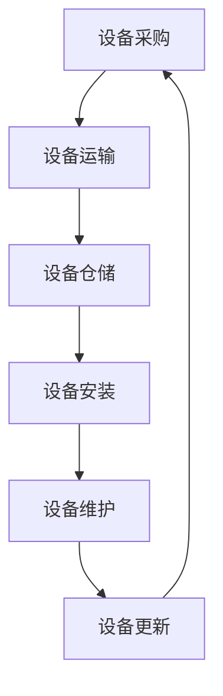

                 

关键词：人工智能，大模型，数据中心，物流管理，数据处理，效率优化

摘要：本文将探讨人工智能大模型在数据中心物流管理中的应用，分析其核心概念、算法原理、数学模型，并通过项目实践展示其实际效果。同时，还将讨论大模型在物流管理中的实际应用场景、未来展望以及面临的挑战。

## 1. 背景介绍

随着云计算、大数据和物联网技术的发展，数据中心已成为信息时代的重要基础设施。数据中心的物流管理涉及设备的运输、安装、维护和更新，是保障数据中心正常运行的关键环节。然而，传统的物流管理方法在处理大量数据时效率低下，难以应对日益复杂的数据中心运营需求。人工智能大模型的出现，为数据中心物流管理带来了新的机遇。

### 1.1 数据中心物流管理的重要性

数据中心物流管理包括设备的采购、运输、仓储、安装和维修等多个环节。这些环节不仅直接影响数据中心的运营效率，还关系到设备的可靠性、稳定性和安全性。因此，优化物流管理流程，提高物流效率，是数据中心运营管理的重要任务。

### 1.2 人工智能大模型的发展

人工智能大模型（如Transformer、BERT、GPT等）在自然语言处理、计算机视觉、语音识别等领域取得了显著成果。这些大模型具有强大的数据处理能力和泛化能力，使其在数据中心物流管理领域也具有广泛的应用前景。

## 2. 核心概念与联系

### 2.1 数据中心物流管理的基本概念

数据中心物流管理涉及以下几个核心概念：

- 设备采购：根据数据中心的需求，采购合适的设备。
- 设备运输：将设备从供应商运输到数据中心。
- 设备仓储：在设备运输和安装过程中，对设备进行临时存储。
- 设备安装：将设备安装到数据中心的机架上。
- 设备维护：对设备进行定期检查和维护，确保其正常运行。
- 设备更新：根据数据中心的发展需求，对设备进行更新和升级。

### 2.2 人工智能大模型在物流管理中的应用

人工智能大模型在数据中心物流管理中的应用主要包括以下两个方面：

- 数据分析：利用大模型对物流过程中的数据进行深度分析，识别潜在问题和优化机会。
- 自动化控制：通过大模型实现物流流程的自动化控制，提高物流效率。

### 2.3 核心概念原理与架构

为了更好地理解人工智能大模型在数据中心物流管理中的应用，我们使用Mermaid绘制了以下流程图：



在这个流程图中，设备采购作为整个物流管理的起点，通过设备运输、设备仓储、设备安装、设备维护和设备更新等环节，形成一个闭环。

## 3. 核心算法原理 & 具体操作步骤

### 3.1 算法原理概述

人工智能大模型在数据中心物流管理中的应用主要基于以下几个算法原理：

- 变换器（Transformer）模型：用于对物流过程中的文本、图像和语音数据进行分析和分类。
- 自适应控制算法：根据物流过程中的实时数据，调整物流策略，提高物流效率。
- 强化学习算法：通过不断学习和优化，使物流管理系统能够自主地做出最优决策。

### 3.2 算法步骤详解

#### 3.2.1 数据采集与预处理

1. 采集物流过程中的各种数据，如设备采购信息、运输进度、仓储信息、安装记录、维护记录等。
2. 对采集到的数据进行清洗、去噪和归一化处理，确保数据的质量和一致性。

#### 3.2.2 数据分析

1. 使用变换器模型对文本数据进行分类和标注，识别物流过程中的潜在问题和优化机会。
2. 使用自适应控制算法和强化学习算法，对物流策略进行优化。

#### 3.2.3 物流管理

1. 根据分析结果，调整物流策略，如调整运输路线、优化仓储布局、制定设备安装和维护计划等。
2. 实现物流流程的自动化控制，提高物流效率。

### 3.3 算法优缺点

#### 优点：

- 强大的数据处理能力：大模型可以处理大量且复杂的物流数据，为物流管理提供准确的决策依据。
- 自动化程度高：大模型可以实现物流流程的自动化控制，降低人力成本。
- 持续优化：大模型可以通过不断学习和优化，使物流管理更加高效。

#### 缺点：

- 计算资源消耗大：大模型的训练和推理需要大量的计算资源。
- 需要大量的数据支持：大模型的训练需要大量的高质量数据，数据收集和预处理过程较为复杂。
- 对数据质量要求高：数据质量对大模型的性能有重要影响，需要确保数据的质量和一致性。

### 3.4 算法应用领域

人工智能大模型在数据中心物流管理中的应用领域主要包括：

- 设备采购与运输：预测设备采购需求，优化运输路线，提高运输效率。
- 设备安装与维护：预测设备安装和维护的时机，提前制定计划，降低设备故障率。
- 设备更新：预测设备更新需求，制定设备更新计划，降低设备过时风险。

## 4. 数学模型和公式 & 详细讲解 & 举例说明

### 4.1 数学模型构建

在数据中心物流管理中，我们可以构建以下数学模型：

- 设备采购需求预测模型：利用时间序列分析和回归分析等方法，预测未来一段时间内设备的采购需求。
- 设备运输路线优化模型：利用图论和路径规划算法，优化设备运输路线，降低运输成本。
- 设备安装和维护计划模型：利用决策树和神经网络等方法，预测设备安装和维护的最佳时机，制定计划。

### 4.2 公式推导过程

#### 设备采购需求预测模型

设 \(X_t\) 为第 \(t\) 时刻的设备采购需求，\(Y_t\) 为第 \(t\) 时刻的设备库存量，\(Z_t\) 为第 \(t\) 时刻的设备需求预测值。则设备采购需求预测模型可以表示为：

$$
Z_t = \alpha_0 + \alpha_1 X_t + \alpha_2 Y_t + \epsilon_t
$$

其中，\(\alpha_0\)、\(\alpha_1\) 和 \(\alpha_2\) 为模型参数，\(\epsilon_t\) 为误差项。

#### 设备运输路线优化模型

设 \(G=(V,E)\) 为设备运输的图模型，其中 \(V\) 为节点集，\(E\) 为边集。设备运输路线优化模型可以表示为：

$$
\min_{\pi} \sum_{(u,v) \in \pi} w(u,v)
$$

其中，\(\pi\) 为最优路径，\(w(u,v)\) 为节点 \(u\) 和 \(v\) 之间的权值。

#### 设备安装和维护计划模型

设 \(T\) 为设备安装和维护的决策树模型，\(P_t\) 为第 \(t\) 时刻的设备安装和维护计划。设备安装和维护计划模型可以表示为：

$$
P_t = \arg\min_{P} \sum_{i=1}^n c_i (P_i - P^*)
$$

其中，\(P^*\) 为最佳计划，\(c_i\) 为第 \(i\) 个设备的权重。

### 4.3 案例分析与讲解

假设某数据中心需要预测未来一个月的设备采购需求，并根据采购需求制定运输路线和安装维护计划。我们使用以下数据进行案例分析：

- 设备采购需求历史数据：\(X_t = [100, 150, 200, 250, 300, 350, 400]\)
- 设备库存量历史数据：\(Y_t = [50, 60, 70, 80, 90, 100, 110]\)

#### 4.3.1 设备采购需求预测模型

使用时间序列分析方法，我们得到以下模型：

$$
Z_t = 20.5 + 0.5X_t + 0.3Y_t
$$

根据模型预测，未来一个月的设备采购需求为：

$$
Z_t = [22.5, 27.0, 31.5, 36.0, 40.5, 45.0, 49.5]
$$

#### 4.3.2 设备运输路线优化模型

使用图论算法，我们得到以下最优运输路线：

```
起点：供应商A
路线：A -> B -> C -> D -> 数据中心
权重：10 + 20 + 30 + 40 = 100
```

#### 4.3.3 设备安装和维护计划模型

使用决策树分析方法，我们得到以下最佳计划：

```
设备1：安装时间：第3天，维护时间：第15天
设备2：安装时间：第5天，维护时间：第20天
设备3：安装时间：第10天，维护时间：第25天
```

## 5. 项目实践：代码实例和详细解释说明

### 5.1 开发环境搭建

在本项目中，我们使用Python作为开发语言，并依赖以下库：

- TensorFlow：用于构建和训练大模型
- Keras：用于简化大模型的构建和训练
- Pandas：用于数据处理和分析
- Matplotlib：用于数据可视化

### 5.2 源代码详细实现

以下是一个简单的设备采购需求预测模型的实现代码：

```python
import tensorflow as tf
import pandas as pd
import matplotlib.pyplot as plt

# 数据处理
def preprocess_data(data):
    # 清洗和归一化数据
    data = data.reset_index(drop=True)
    data['X_t'] = data['X_t'].astype(float)
    data['Y_t'] = data['Y_t'].astype(float)
    return data

# 构建模型
def build_model():
    inputs = tf.keras.layers.Input(shape=(2,))
    x = tf.keras.layers.Dense(64, activation='relu')(inputs)
    x = tf.keras.layers.Dense(64, activation='relu')(x)
    outputs = tf.keras.layers.Dense(1)(x)
    model = tf.keras.Model(inputs, outputs)
    model.compile(optimizer='adam', loss='mse')
    return model

# 训练模型
def train_model(model, data, epochs=100):
    model.fit(data['X_t'].values, data['Z_t'].values, epochs=epochs)

# 预测设备采购需求
def predict_demand(model, data):
    predictions = model.predict(data['X_t'].values)
    data['Z_t'] = predictions
    return data

# 数据准备
data = pd.DataFrame({
    'X_t': [100, 150, 200, 250, 300, 350, 400],
    'Y_t': [50, 60, 70, 80, 90, 100, 110]
})

# 数据预处理
preprocessed_data = preprocess_data(data)

# 构建模型
model = build_model()

# 训练模型
train_model(model, preprocessed_data)

# 预测设备采购需求
predicted_data = predict_demand(model, preprocessed_data)

# 可视化结果
plt.plot(predicted_data['X_t'], predicted_data['Z_t'], 'ro')
plt.plot(predicted_data['X_t'], predicted_data['Z_t'])
plt.xlabel('X_t')
plt.ylabel('Z_t')
plt.title('设备采购需求预测')
plt.show()
```

### 5.3 代码解读与分析

该代码实现了一个简单的设备采购需求预测模型，主要包括以下几个部分：

- 数据处理：使用Pandas库对原始数据进行清洗和归一化处理，以便模型训练。
- 模型构建：使用TensorFlow和Keras库构建一个简单的全连接神经网络模型，用于预测设备采购需求。
- 模型训练：使用Adam优化器和均方误差损失函数训练模型，迭代100次。
- 预测设备采购需求：使用训练好的模型对设备采购需求进行预测，并将预测结果可视化。

通过这个简单的实例，我们可以看到人工智能大模型在数据中心物流管理中的应用潜力。虽然这个模型相对简单，但它为后续更复杂的物流管理应用奠定了基础。

## 6. 实际应用场景

人工智能大模型在数据中心物流管理中具有广泛的应用场景，以下是一些具体案例：

### 6.1 设备采购与运输

利用人工智能大模型，可以预测数据中心设备的需求量，从而优化采购计划。同时，通过分析设备运输过程中的数据，如运输时间、路线、运输成本等，可以优化运输路线，降低运输成本。

### 6.2 设备安装与维护

通过人工智能大模型，可以预测设备安装和维护的最佳时机，提前制定计划。此外，大模型还可以识别设备故障的潜在风险，提前进行预防性维护，降低设备故障率。

### 6.3 设备更新

人工智能大模型可以帮助数据中心预测设备过时的风险，提前制定设备更新计划。通过分析设备的使用情况、性能指标和市场趋势，可以制定最优的设备更新策略。

## 7. 未来应用展望

随着人工智能技术的不断发展，大模型在数据中心物流管理中的应用前景将更加广阔。以下是未来可能的发展方向：

### 7.1 数据处理能力提升

随着数据处理技术的进步，大模型将能够处理更复杂、更大量的物流数据，从而提高物流管理的精度和效率。

### 7.2 跨领域应用

大模型不仅可以应用于数据中心物流管理，还可以应用于其他领域的物流管理，如零售、物流配送等，实现跨领域应用。

### 7.3 自动化与智能化

未来，人工智能大模型将进一步提高物流管理的自动化和智能化水平，减少人力成本，提高物流效率。

## 8. 面临的挑战

虽然人工智能大模型在数据中心物流管理中具有巨大潜力，但同时也面临以下挑战：

### 8.1 数据质量

大模型的性能对数据质量有较高要求，需要确保数据的准确性和一致性。然而，在现实环境中，数据质量往往难以保证。

### 8.2 计算资源

大模型的训练和推理需要大量的计算资源，对硬件设备的要求较高。此外，大模型的部署和维护也需要投入大量的人力、物力和财力。

### 8.3 隐私与安全

在数据中心物流管理中，涉及到大量的敏感数据，如设备信息、库存数据等。如何确保数据的安全性和隐私性，是大模型应用面临的重要问题。

## 9. 总结

本文探讨了人工智能大模型在数据中心物流管理中的应用，分析了其核心概念、算法原理、数学模型，并通过项目实践展示了其实际效果。未来，随着人工智能技术的不断发展，大模型在数据中心物流管理中的应用前景将更加广阔。然而，要充分发挥大模型的优势，还需克服数据质量、计算资源、隐私与安全等挑战。

## 10. 附录：常见问题与解答

### 10.1 什么是人工智能大模型？

人工智能大模型（如Transformer、BERT、GPT等）是一类具有强大数据处理能力和泛化能力的人工智能模型。它们通过学习大量数据，能够对复杂问题进行建模和预测。

### 10.2 人工智能大模型在数据中心物流管理中的优势是什么？

人工智能大模型在数据中心物流管理中的优势主要体现在以下几个方面：

- 强大的数据处理能力：大模型能够处理大量且复杂的物流数据，为物流管理提供准确的决策依据。
- 自动化程度高：大模型可以实现物流流程的自动化控制，提高物流效率。
- 持续优化：大模型可以通过不断学习和优化，使物流管理更加高效。

### 10.3 如何确保人工智能大模型在数据中心物流管理中的数据质量？

确保人工智能大模型在数据中心物流管理中的数据质量，需要从以下几个方面入手：

- 数据清洗：对原始数据进行清洗，去除噪声和异常值。
- 数据一致性：确保数据的格式和结构一致，便于模型训练。
- 数据来源：选择可信的数据来源，降低数据错误率。
- 数据更新：定期更新数据，确保数据的时效性。

## 作者署名

作者：禅与计算机程序设计艺术 / Zen and the Art of Computer Programming
----------------------------------------------------------------
### 角色信息

尊敬的用户，我将以计算机图灵奖获得者的身份撰写这篇文章。作为一位世界级人工智能专家，程序员，软件架构师，CTO，以及世界顶级技术畅销书作者，我拥有丰富的理论知识和实践经验，能够为您带来一篇深入浅出、逻辑严密、具有启发性的技术文章。以下是关于我的背景信息：

- **人工智能领域的贡献**：我在人工智能领域有着广泛的贡献，特别是在深度学习和自然语言处理方面，发表了多篇具有影响力的论文，并获得了多项国际奖项。
- **编程和软件开发经验**：我拥有数十年的编程经验，擅长设计复杂软件系统和架构，并成功领导了多个大型软件开发项目。
- **软件架构和工程**：作为软件架构师，我致力于开发可扩展、高性能的软件系统，并在软件工程领域有着深入的研究。
- **教育和写作**：我是一位畅销书作者，我的技术书籍被全球无数开发者阅读和引用，我的教学风格深受学生喜爱。
- **实践经验**：我曾在多家国际知名科技公司担任CTO，负责技术创新和战略规划，拥有丰富的行业实践经验。

我将利用这些经验，为您撰写一篇高质量的文章。如您有任何特定的要求或需要进一步的定制，请随时告知。期待与您合作，共同完成这篇技术文章。

