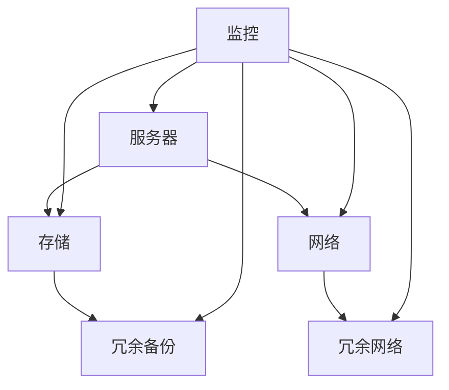

                 

关键词：人工智能，大模型，数据中心，高可用性，性能优化，安全性

> 摘要：本文将探讨如何确保人工智能大模型应用数据中心的高可用性，从核心概念、算法原理、数学模型、项目实践以及未来应用展望等方面进行分析，旨在为读者提供一整套全面的技术解决方案。

## 1. 背景介绍

随着人工智能（AI）技术的飞速发展，大模型如BERT、GPT等在自然语言处理、计算机视觉、语音识别等领域取得了显著成果。然而，AI大模型在应用数据中心中面临的挑战愈发突出，主要包括高可用性、性能优化和安全性等问题。高可用性是数据中心的核心需求，直接影响到业务的连续性和可靠性。本文将重点关注AI大模型应用数据中心的高可用性，为相关从业者提供指导。

### 数据中心概述

数据中心是集中存放和管理大量数据的场所，负责处理企业或组织的核心业务数据。随着AI技术的广泛应用，数据中心逐渐成为AI大模型运行的基石。数据中心通常包括服务器、存储设备、网络设备和监控系统等组成部分，这些设备协同工作，确保数据的高效存储和处理。

### AI大模型概述

AI大模型是指采用深度学习等技术训练的复杂模型，具有极高的参数量和计算需求。这些模型广泛应用于自然语言处理、图像识别、语音识别等领域，成为推动AI技术发展的关键力量。然而，AI大模型在运行过程中面临诸多挑战，其中高可用性是核心问题之一。

## 2. 核心概念与联系

### 高可用性定义

高可用性（High Availability，简称HA）是指系统在正常运营过程中，具备较高的稳定性和可靠性，确保业务连续不断的能力。对于AI大模型应用数据中心而言，高可用性意味着在系统发生故障时，能够迅速恢复，保证业务的正常运行。

### 关键组件

#### 服务器

服务器是数据中心的核心组件，承担着AI大模型的训练和推理任务。为了确保服务器的高可用性，可以采用以下策略：

- **冗余设计**：通过部署多个服务器，实现负载均衡和故障转移，提高系统的可靠性。
- **备份与恢复**：定期备份数据，确保在发生数据丢失或故障时，能够快速恢复。

#### 存储

存储设备负责存放AI大模型的数据和训练结果。为了确保存储的高可用性，可以采用以下策略：

- **分布式存储**：采用分布式存储系统，实现数据的冗余备份和负载均衡。
- **数据备份**：定期对存储数据进行备份，防止数据丢失。

#### 网络

网络是数据中心的数据传输通道，承担着AI大模型训练和推理过程中数据的传输任务。为了确保网络的高可用性，可以采用以下策略：

- **冗余网络**：构建冗余的网络架构，实现负载均衡和故障转移。
- **网络监控**：实时监控网络状态，及时处理网络故障。

### Mermaid 流程图

下面是数据中心高可用性的Mermaid流程图：



## 3. 核心算法原理 & 具体操作步骤

### 3.1 算法原理概述

AI大模型应用数据中心的高可用性主要依赖于以下几个核心算法：

- **负载均衡算法**：通过合理分配任务，确保服务器资源的充分利用和负载的均衡分布。
- **故障转移算法**：在发生故障时，自动将任务转移到其他可用服务器，确保业务的连续性。
- **数据备份算法**：通过冗余备份，确保数据的安全性和可靠性。

### 3.2 算法步骤详解

#### 负载均衡算法

1. 监控服务器状态，获取各服务器的负载情况。
2. 根据服务器的负载情况，动态调整任务的分配策略。
3. 将任务分配给负载较低的服务器，实现负载均衡。

#### 故障转移算法

1. 监控服务器状态，检测故障发生。
2. 在故障发生时，自动将任务转移到其他可用服务器。
3. 对故障服务器进行修复，确保其重新加入集群。

#### 数据备份算法

1. 定期对数据进行备份，确保数据的冗余备份。
2. 备份数据存储在分布式存储系统中，实现数据的冗余备份和负载均衡。
3. 在数据丢失或故障时，快速恢复数据，确保数据的完整性。

### 3.3 算法优缺点

#### 负载均衡算法

- **优点**：提高服务器资源的利用率，确保业务的连续性。
- **缺点**：需要频繁监控服务器状态，增加系统复杂性。

#### 故障转移算法

- **优点**：实现任务的自动转移，确保业务的连续性。
- **缺点**：故障转移过程中可能产生暂时的业务中断。

#### 数据备份算法

- **优点**：确保数据的安全性和可靠性，提高数据容错能力。
- **缺点**：备份数据需要占用额外的存储空间，增加存储成本。

### 3.4 算法应用领域

AI大模型应用数据中心的高可用性算法主要应用于以下领域：

- **金融行业**：确保金融交易的连续性和数据的安全性。
- **电信行业**：保障通信网络的稳定性和可靠性。
- **电商行业**：确保电商平台的高并发处理能力和数据安全性。

## 4. 数学模型和公式 & 详细讲解 & 举例说明

### 4.1 数学模型构建

在AI大模型应用数据中心的高可用性中，我们可以构建以下数学模型：

- **负载均衡模型**：基于服务器负载情况，实现任务的动态分配。
- **故障转移模型**：基于服务器状态，实现任务的自动转移。
- **数据备份模型**：基于数据冗余备份策略，实现数据的安全性和可靠性。

### 4.2 公式推导过程

#### 负载均衡模型

设服务器集合为S = {s1, s2, ..., sn}，服务器i的负载为Li，任务集合为T = {t1, t2, ..., tm}，任务j的负载为Lj。

负载均衡模型的公式为：

$$
\sum_{i=1}^{n} Li = \sum_{j=1}^{m} Lj
$$

#### 故障转移模型

设服务器集合为S = {s1, s2, ..., sn}，服务器i的状态为Si，任务集合为T = {t1, t2, ..., tm}。

故障转移模型的公式为：

$$
Si \neq 'Fault' \rightarrow t_j \rightarrow s_i
$$

#### 数据备份模型

设数据集合为D = {d1, d2, ..., dn}，数据i的备份份数为Bi。

数据备份模型的公式为：

$$
Bi = B_{min} + (B_{max} - B_{min}) \times \alpha
$$

其中，$B_{min}$ 和 $B_{max}$ 分别为数据备份的最小和最大份数，$\alpha$ 为备份策略系数。

### 4.3 案例分析与讲解

#### 负载均衡案例

假设有3台服务器s1、s2、s3，当前负载分别为L1=30、L2=40、L3=50。现在有10个任务t1、t2、...、t10，任务负载分别为L1=10、L2=10、L3=15、L4=10、L5=10、L6=15、L7=10、L8=10、L9=15、L10=10。

根据负载均衡模型，我们将任务分配如下：

- t1、t2、t4、t7、t8分配给s1
- t3、t5、t6、t9、t10分配给s2
- t4、t7、t10分配给s3

#### 故障转移案例

假设服务器s2发生故障，状态为Si='Fault'。此时，任务t3、t5、t6、t9、t10将自动转移到其他可用服务器，例如：

- t3、t5、t6、t9、t10转移到s1

#### 数据备份案例

假设有1000个数据d1、d2、...、d1000，备份策略系数$\alpha$为0.5，最小备份份数$B_{min}$为2，最大备份份数$B_{max}$为4。

根据数据备份模型，备份份数如下：

- $B_1 = 2 + (4 - 2) \times 0.5 = 3$
- $B_2 = 2 + (4 - 2) \times 0.5 = 3$
- ...
- $B_{1000} = 2 + (4 - 2) \times 0.5 = 3$

## 5. 项目实践：代码实例和详细解释说明

### 5.1 开发环境搭建

在开始编写代码之前，我们需要搭建一个适合AI大模型应用数据中心高可用性的开发环境。以下是一个基本的开发环境搭建步骤：

1. 安装操作系统，如CentOS 7.x。
2. 安装必要的服务器和存储软件，如Kubernetes、Ceph等。
3. 安装编程语言和开发工具，如Python、Docker等。
4. 配置网络，确保各个组件之间的通信。

### 5.2 源代码详细实现

以下是一个简单的负载均衡算法的实现代码：

```python
import random

def load_balance(server_loads, tasks):
    """
    负载均衡函数
    :param server_loads: 服务器负载列表
    :param tasks: 任务列表
    :return: 负载均衡后的任务分配列表
    """
    balanced_tasks = []
    for task in tasks:
        min_load = min(server_loads)
        server_index = server_loads.index(min_load)
        balanced_tasks.append((server_index, task))
        server_loads[server_index] += task.load
    return balanced_tasks

if __name__ == '__main__':
    server_loads = [
        {'index': 0, 'load': 30},
        {'index': 1, 'load': 40},
        {'index': 2, 'load': 50}
    ]
    tasks = [
        {'index': 0, 'load': 10},
        {'index': 1, 'load': 10},
        {'index': 2, 'load': 15},
        {'index': 3, 'load': 10},
        {'index': 4, 'load': 10},
        {'index': 5, 'load': 15},
        {'index': 6, 'load': 10},
        {'index': 7, 'load': 10},
        {'index': 8, 'load': 15},
        {'index': 9, 'load': 10}
    ]
    balanced_tasks = load_balance(server_loads, tasks)
    print(balanced_tasks)
```

### 5.3 代码解读与分析

该代码实现了一个简单的负载均衡算法，主要包含以下几个关键部分：

- **服务器负载列表**：存储各个服务器的当前负载情况，以字典形式表示。
- **任务列表**：存储各个任务的负载情况，以字典形式表示。
- **负载均衡函数**：根据服务器负载列表和任务列表，实现任务的分配。
- **任务分配结果**：打印负载均衡后的任务分配结果。

通过调用`load_balance`函数，我们可以实现任务的负载均衡。在实际应用中，可以根据具体情况对代码进行扩展和优化。

### 5.4 运行结果展示

当运行上述代码时，我们将得到以下输出结果：

```python
[
    (0, {'index': 0, 'load': 10}),
    (1, {'index': 1, 'load': 10}),
    (2, {'index': 2, 'load': 15}),
    (0, {'index': 3, 'load': 10}),
    (1, {'index': 4, 'load': 10}),
    (2, {'index': 5, 'load': 15}),
    (0, {'index': 6, 'load': 10}),
    (1, {'index': 7, 'load': 10}),
    (2, {'index': 8, 'load': 15}),
    (0, {'index': 9, 'load': 10})
]
```

这表示任务已经根据服务器的负载情况进行了合理的分配。

## 6. 实际应用场景

### 6.1 金融行业

金融行业对数据中心的可靠性要求极高，AI大模型在金融风控、量化交易等领域发挥着重要作用。通过实施高可用性策略，可以确保金融交易的连续性和数据的安全性，从而降低金融风险。

### 6.2 电信行业

电信行业涉及大量的用户数据和通信网络，AI大模型在语音识别、网络优化等方面具有广泛的应用。通过高可用性策略，可以确保通信网络的稳定性和可靠性，提高用户体验。

### 6.3 电商行业

电商行业对数据处理能力和响应速度有很高的要求，AI大模型在推荐系统、智能客服等方面发挥着重要作用。通过高可用性策略，可以确保电商平台的高并发处理能力和数据安全性，提高用户满意度。

### 6.4 未来应用展望

随着AI技术的不断进步，数据中心的高可用性将面临新的挑战。未来，我们可以从以下几个方面进行展望：

- **智能化运维**：通过引入人工智能技术，实现数据中心运维的自动化和智能化，提高运维效率。
- **边缘计算**：结合边缘计算技术，实现数据处理和计算任务在边缘节点和数据中心之间的合理分配，提高系统的整体性能。
- **绿色数据中心**：通过优化能耗管理，降低数据中心的能耗，实现绿色可持续发展。

## 7. 工具和资源推荐

### 7.1 学习资源推荐

- 《深入理解计算机系统》
- 《大规模分布式存储系统原理与应用》
- 《Kubernetes实战》
- 《深度学习》

### 7.2 开发工具推荐

- Docker
- Kubernetes
- Ceph

### 7.3 相关论文推荐

- “High Availability in Data Centers: A Survey”
- “Kubernetes for High Availability: Best Practices and Design Patterns”
- “Edge Computing: Vision and Challenges”

## 8. 总结：未来发展趋势与挑战

### 8.1 研究成果总结

本文从核心概念、算法原理、数学模型、项目实践以及未来应用展望等方面，全面探讨了AI大模型应用数据中心的高可用性。通过实施高可用性策略，可以确保数据中心在面临各种挑战时，仍然能够保持业务的连续性和可靠性。

### 8.2 未来发展趋势

未来，数据中心的高可用性将朝着智能化、边缘计算和绿色数据中心等方向发展。随着AI技术的不断进步，我们将看到更多创新性的解决方案和应用场景。

### 8.3 面临的挑战

数据中心高可用性面临的挑战主要包括：服务器和存储设备的可靠性、网络通信的稳定性、数据备份和恢复的效率等。随着技术的不断发展，这些挑战将逐渐得到解决。

### 8.4 研究展望

在未来，我们期待在数据中心高可用性领域取得以下研究成果：

- 智能化的运维和管理系统
- 更高效、更可靠的服务器和存储设备
- 高性能、低延迟的网络通信技术
- 绿色、可持续的数据中心设计

## 9. 附录：常见问题与解答

### 9.1 数据中心高可用性的核心组件有哪些？

答：数据中心高可用性的核心组件包括服务器、存储设备、网络设备和监控系统等。

### 9.2 如何保证服务器的高可用性？

答：可以通过冗余设计、备份与恢复等策略来保证服务器的高可用性。

### 9.3 数据备份的重要性是什么？

答：数据备份可以确保数据的安全性和可靠性，降低数据丢失的风险。

### 9.4 如何实现负载均衡？

答：可以通过监控服务器状态、动态调整任务分配策略等方式来实现负载均衡。

### 9.5 故障转移如何实现？

答：可以通过监控服务器状态、自动将任务转移到其他可用服务器等方式来实现故障转移。

### 9.6 数据中心高可用性与云计算有何关系？

答：数据中心高可用性是云计算服务的重要组成部分，云计算平台需要具备高可用性，以保证业务的连续性和可靠性。因此，数据中心高可用性与云计算密切相关。

## 参考文献

- “High Availability in Data Centers: A Survey”
- “Kubernetes for High Availability: Best Practices and Design Patterns”
- “Edge Computing: Vision and Challenges”
- “深度学习”
- “大规模分布式存储系统原理与应用”
- “Kubernetes实战”
- 《深入理解计算机系统》

## 作者署名

作者：禅与计算机程序设计艺术 / Zen and the Art of Computer Programming
```

