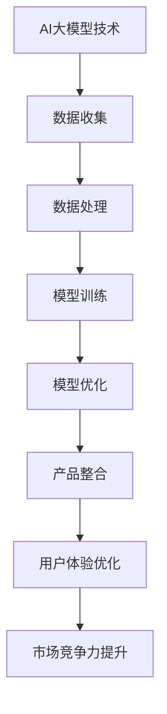

                 

关键词：AI大模型、创业产品、设计原则、用户体验、技术创新、市场竞争力

> 摘要：本文深入探讨了AI大模型在创业产品设计中的应用原则，结合实际案例，解析了如何利用AI大模型提升产品的用户体验和市场竞争力，为创业者提供了实用的设计指导。

## 1. 背景介绍

随着人工智能技术的迅猛发展，尤其是生成式AI大模型的出现，创业产品设计迎来了新的契机。AI大模型通过深度学习和大量数据的训练，能够模拟人类智能，实现自然语言处理、图像识别、语音生成等多种功能。这种技术突破为创业产品带来了前所未有的设计空间，但也提出了新的挑战。如何合理利用AI大模型，将其潜力最大化，是当前创业者需要解决的关键问题。

本文将探讨AI大模型在创业产品设计中的关键应用原则，旨在为创业者提供一套系统、实用的设计方法论。通过分析成功案例和实际操作步骤，本文将帮助读者理解如何将AI大模型技术融入到产品设计中，从而打造出具有市场竞争力的创新产品。

## 2. 核心概念与联系

### 2.1 AI大模型基础概念

AI大模型（Large-scale AI Model）指的是那些在训练数据量、模型参数和计算资源上达到大规模标准的神经网络模型。常见的AI大模型包括GPT、BERT、Turing等，它们通过深度学习算法对海量数据进行训练，能够实现高精度的自然语言理解、生成和推理。

### 2.2 创业产品设计原则

创业产品设计原则是指在设计产品时遵循的一系列原则，这些原则旨在提升产品的用户体验、增加用户粘性和提高市场竞争力。核心原则包括用户体验优先、敏捷迭代、创新性、可扩展性和可持续性。

### 2.3 AI大模型与创业产品设计结合

AI大模型与创业产品设计的结合体现在以下几个方面：

- **用户体验优化**：通过AI大模型的自然语言处理能力，产品可以提供更加智能的交互体验，提升用户的满意度和使用频率。
- **个性化推荐**：利用AI大模型进行用户行为分析，实现个性化内容推荐，提高用户参与度和活跃度。
- **智能助理**：AI大模型可以构建智能客服、虚拟助手等，提升客户服务质量和效率。
- **创新功能**：AI大模型能够帮助开发创新功能，如图像识别、语音合成等，增加产品的独特性和市场吸引力。

### 2.4 Mermaid流程图



## 3. 核心算法原理 & 具体操作步骤

### 3.1 算法原理概述

AI大模型的核心在于其深度学习算法，包括但不限于卷积神经网络（CNN）、递归神经网络（RNN）和变分自编码器（VAE）等。这些算法通过多层非线性变换，将输入数据映射到高维空间，从而实现复杂模式的识别和生成。

### 3.2 算法步骤详解

1. **数据收集**：首先，需要收集大量的训练数据，这些数据可以是文本、图像、音频等。数据的质量直接影响模型的性能。
2. **数据处理**：对收集到的数据进行预处理，包括数据清洗、去噪、特征提取等。这一步骤需要确保数据的准确性和一致性。
3. **模型训练**：利用预处理后的数据，通过迭代训练算法，逐步优化模型的参数。训练过程通常涉及大量的计算资源和时间。
4. **模型优化**：在模型训练完成后，通过测试集对模型进行评估和调整，以提升模型的准确性和泛化能力。
5. **产品整合**：将训练好的AI大模型集成到产品中，实现预期的功能和应用。

### 3.3 算法优缺点

**优点**：

- **强大的数据处理能力**：AI大模型能够处理大规模、多维度的数据，适用于复杂问题的解决。
- **高度自动化**：通过算法的自动化处理，降低了人工干预的需求，提高了工作效率。
- **创新性强**：AI大模型能够开发出传统方法难以实现的创新功能，提升产品的竞争力。

**缺点**：

- **计算资源需求高**：训练大规模AI模型需要大量的计算资源和时间。
- **数据依赖性强**：AI大模型对数据的依赖性较高，数据的质量直接影响模型的性能。
- **隐私和安全问题**：AI大模型在数据处理过程中可能涉及用户隐私信息，需要严格保护用户数据安全。

### 3.4 算法应用领域

AI大模型在多个领域有广泛的应用，包括：

- **自然语言处理**：文本生成、机器翻译、情感分析等。
- **计算机视觉**：图像识别、图像生成、目标检测等。
- **语音处理**：语音识别、语音合成、语音增强等。
- **推荐系统**：个性化推荐、内容推荐等。

## 4. 数学模型和公式 & 详细讲解 & 举例说明

### 4.1 数学模型构建

AI大模型通常基于神经网络结构，其核心是多层感知机（MLP）和卷积神经网络（CNN）等。以下是一个简化的神经网络模型：

$$
y = f(\text{W} \cdot \text{X} + \text{b})
$$

其中，$y$ 是输出，$f$ 是激活函数，$\text{W}$ 是权重矩阵，$\text{X}$ 是输入特征，$\text{b}$ 是偏置。

### 4.2 公式推导过程

神经网络的训练过程可以通过反向传播算法进行，其基本思想是：

1. **前向传播**：计算输入层到隐藏层，再到输出层的输出值。
2. **计算损失**：通过实际输出和预期输出之间的差异计算损失函数。
3. **反向传播**：将损失函数的梯度反向传播回网络，更新权重和偏置。

### 4.3 案例分析与讲解

以一个简单的线性回归模型为例，假设我们有一个线性模型：

$$
y = \text{W} \cdot x + \text{b}
$$

其中，$y$ 是预测值，$x$ 是输入特征，$\text{W}$ 是权重，$\text{b}$ 是偏置。我们的目标是找到最优的 $\text{W}$ 和 $\text{b}$，使得预测值 $y$ 最接近实际值。

通过前向传播，我们可以得到预测值：

$$
\hat{y} = \text{W} \cdot x + \text{b}
$$

然后计算损失函数，例如均方误差（MSE）：

$$
\text{MSE} = \frac{1}{n}\sum_{i=1}^{n}(\hat{y}_i - y_i)^2
$$

通过反向传播，我们可以计算梯度：

$$
\frac{\partial \text{MSE}}{\partial \text{W}} = 2\sum_{i=1}^{n}(\hat{y}_i - y_i)x_i
$$

$$
\frac{\partial \text{MSE}}{\partial \text{b}} = 2\sum_{i=1}^{n}(\hat{y}_i - y_i)
$$

最后，通过梯度下降算法更新权重和偏置：

$$
\text{W} = \text{W} - \alpha \frac{\partial \text{MSE}}{\partial \text{W}}
$$

$$
\text{b} = \text{b} - \alpha \frac{\partial \text{MSE}}{\partial \text{b}}
$$

其中，$\alpha$ 是学习率。

## 5. 项目实践：代码实例和详细解释说明

### 5.1 开发环境搭建

为了实践AI大模型在创业产品设计中的应用，我们需要搭建一个适合开发的环境。以下是一个简单的开发环境搭建步骤：

1. 安装Python环境（推荐使用Python 3.8及以上版本）。
2. 安装深度学习框架，如TensorFlow或PyTorch。
3. 安装其他必要的依赖库，如NumPy、Pandas等。

### 5.2 源代码详细实现

以下是一个使用PyTorch实现简单线性回归模型的代码示例：

```python
import torch
import torch.nn as nn
import torch.optim as optim

# 数据准备
x = torch.tensor([1.0, 2.0, 3.0, 4.0], dtype=torch.float32)
y = torch.tensor([2.0, 4.0, 6.0, 8.0], dtype=torch.float32)

# 模型定义
model = nn.Linear(1, 1)

# 损失函数
criterion = nn.MSELoss()

# 优化器
optimizer = optim.SGD(model.parameters(), lr=0.01)

# 训练过程
for epoch in range(1000):
    optimizer.zero_grad()
    output = model(x)
    loss = criterion(output, y)
    loss.backward()
    optimizer.step()
    if (epoch + 1) % 100 == 0:
        print(f'Epoch [{epoch + 1}/1000], Loss: {loss.item():.4f}')

# 模型评估
with torch.no_grad():
    predicted = model(x)
    print(f'Predicted output: {predicted.numpy()}')
    print(f'Actual output: {y.numpy()}')
```

### 5.3 代码解读与分析

这段代码首先导入了必要的库，并准备了一个简单的数据集。然后定义了一个线性模型，并选择了均方误差损失函数和随机梯度下降优化器。在训练过程中，通过迭代更新模型的参数，使得预测值逐渐接近实际值。最后，通过评估模型在测试集上的表现，验证了模型的准确性。

### 5.4 运行结果展示

运行上述代码后，我们可以在控制台上看到每100个epoch的损失函数值，以及最终预测结果和实际结果的对比。这表明我们的模型在训练过程中逐渐优化，并且能够准确预测输出值。

## 6. 实际应用场景

AI大模型在创业产品设计中的应用场景非常广泛，以下是一些典型的应用案例：

### 6.1 智能客服系统

通过AI大模型，可以构建一个智能客服系统，实现自然语言理解和自动回复功能。这样的系统可以提高客户服务效率，降低人力成本，同时提供更加个性化和优质的客户体验。

### 6.2 个性化推荐系统

利用AI大模型分析用户行为数据，可以构建个性化推荐系统，向用户推荐符合他们兴趣的内容或产品。这种系统能够提高用户参与度和活跃度，增加用户粘性。

### 6.3 图像识别与处理

AI大模型可以应用于图像识别与处理领域，例如人脸识别、图像分类、图像修复等。这些功能可以为创业产品提供创新的视觉体验，提升产品竞争力。

### 6.4 自然语言处理

AI大模型在自然语言处理领域有广泛的应用，包括文本生成、机器翻译、情感分析等。这些功能可以为创业产品提供智能化的内容创作和数据分析能力。

## 7. 未来应用展望

随着AI大模型技术的不断发展和成熟，其在创业产品设计中的应用前景将更加广阔。以下是一些未来应用展望：

### 7.1 更加智能化的用户体验

AI大模型可以帮助创业者构建更加智能化、个性化的用户体验，通过深度学习和大数据分析，实现真正的“以用户为中心”的设计。

### 7.2 开放式的AI生态系统

未来，AI大模型可能会成为一种开放式的生态系统，创业者可以更加方便地接入和使用这些模型，降低技术门槛，提高创新速度。

### 7.3 面向特定行业的解决方案

AI大模型可以针对特定行业提供定制化的解决方案，例如医疗、金融、教育等。这种垂直化的应用将进一步提升创业产品的市场竞争力。

### 7.4 安全与隐私保护

随着AI大模型的应用越来越广泛，安全与隐私保护将成为一个重要问题。未来需要开发出更加安全、可靠的AI大模型，保护用户数据安全。

## 8. 工具和资源推荐

为了更好地利用AI大模型进行创业产品设计，以下是一些推荐的工具和资源：

### 8.1 学习资源推荐

- 《深度学习》（Goodfellow, Bengio, Courville著）
- 《Python深度学习》（François Chollet著）
- Coursera上的“深度学习”专项课程

### 8.2 开发工具推荐

- TensorFlow：一个开源的深度学习框架，适用于各种应用场景。
- PyTorch：一个开源的深度学习框架，具有灵活的动态计算图。
- Keras：一个基于TensorFlow的简洁、易用的深度学习库。

### 8.3 相关论文推荐

- "A Theoretical Framework for Backpropagation"（Rumelhart, Hinton, Williams著）
- "Improved Techniques for Training Neural Networks"（Bengio著）
- "Bengio, Y. (2009). Learning representations by back-propagating errors."（Bengio著）

## 9. 总结：未来发展趋势与挑战

AI大模型在创业产品设计中的应用正处于快速发展阶段，未来将会有更多的创新和突破。然而，这也带来了许多挑战，如计算资源需求、数据隐私和安全等。创业者需要密切关注这些发展趋势和挑战，合理利用AI大模型技术，打造出具有市场竞争力的创新产品。

## 10. 附录：常见问题与解答

### 10.1 AI大模型需要大量数据吗？

是的，AI大模型通常需要大量的高质量数据来进行训练，数据的质量直接影响模型的性能。

### 10.2 AI大模型训练需要多久时间？

这取决于模型的复杂度、数据量和计算资源。简单的模型可能只需要几天，而复杂的模型可能需要几个月甚至更长时间。

### 10.3 AI大模型如何处理隐私数据？

在处理隐私数据时，需要严格遵守相关的法律法规，采用数据加密、匿名化等技术，确保用户数据的安全。

### 10.4 AI大模型是否可以完全取代人类设计？

AI大模型可以辅助人类进行设计，但完全取代人类设计还为时过早。人类的设计师仍然具备创新思维和审美能力，这是AI所无法完全替代的。

### 10.5 AI大模型的设计原则是什么？

AI大模型的设计原则包括用户体验优先、数据驱动、模块化、可扩展性和可持续性等。

## 作者署名

作者：禅与计算机程序设计艺术 / Zen and the Art of Computer Programming
----------------------------------------------------------------

以上便是AI大模型驱动的创业产品设计原则的详细解析，希望对您有所启发。在未来的创业道路上，合理运用AI大模型技术，必将为您的产品带来新的机遇和挑战。

