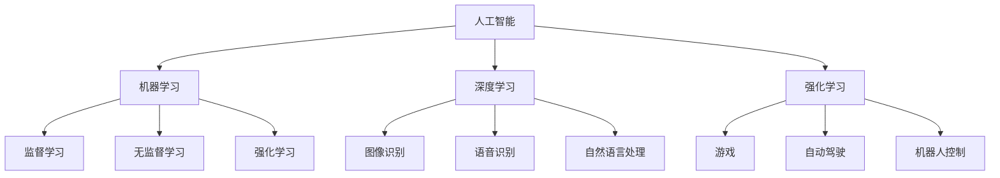

                 

关键词：AI2.0，自动化技术，人工智能，深度学习，机器学习，编程，开发工具，计算效率，算法优化，应用场景，未来展望。

> 摘要：本文将探讨AI2.0时代自动化技术的进展，分析核心概念与联系，介绍核心算法原理与操作步骤，讨论数学模型和公式，展示项目实践中的代码实例，分析实际应用场景，推荐相关工具和资源，并总结未来发展趋势与挑战。

## 1. 背景介绍

在过去的几十年中，人工智能（AI）经历了从理论研究到实际应用的巨大变革。从最初的规则推理和知识表示，到基于统计学习的机器学习，再到深度学习时代的全面爆发，人工智能技术已经深刻地改变了我们的生活方式和工作模式。然而，随着计算能力的提升和数据量的爆炸式增长，我们正站在一个全新的技术转折点——AI2.0时代。

AI2.0时代，标志着人工智能从基于规则的“人工智能”向基于数据的“自主智能”的转变。这一转变不仅体现在算法上的创新，更重要的是在自动化技术上的突破。自动化技术正逐步渗透到各个行业，从制造业、金融业到医疗保健、交通系统，AI2.0时代的自动化技术正在重新定义生产方式和服务模式。

本文将围绕AI2.0时代的自动化技术，分析其核心概念与联系，介绍核心算法原理与操作步骤，探讨数学模型和公式，展示项目实践中的代码实例，分析实际应用场景，推荐相关工具和资源，并总结未来发展趋势与挑战。

## 2. 核心概念与联系

在探讨AI2.0时代的自动化技术之前，我们有必要理解一些核心概念。这些概念包括人工智能、机器学习、深度学习、强化学习等。

### 人工智能（AI）

人工智能是指使计算机具有人类智能的技术和理论。它包括知识表示、知识推理、问题求解、自然语言理解、机器视觉等多个方面。人工智能的目标是使计算机能够执行复杂的任务，如理解语言、识别图像、做出决策等。

### 机器学习（ML）

机器学习是人工智能的一个分支，它侧重于通过数据和算法来训练模型，从而使计算机能够从数据中学习和改进。机器学习可以分为监督学习、无监督学习和强化学习三种类型。

- **监督学习**：在监督学习场景中，模型被训练来预测输出，已知输入和输出之间的关系。
- **无监督学习**：在无监督学习场景中，模型需要发现输入数据中的内在结构或模式。
- **强化学习**：在强化学习场景中，模型通过与环境的交互来学习最佳行为策略。

### 深度学习（DL）

深度学习是机器学习的一个子领域，它依赖于多层神经网络来学习数据的复杂特征。深度学习在图像识别、语音识别、自然语言处理等领域取得了显著成果。

### 强化学习（RL）

强化学习是一种通过试错来学习最佳策略的机器学习方法。它通常用于需要长时间规划和决策的任务，如游戏、自动驾驶和机器人控制。

### Mermaid 流程图

为了更好地理解这些核心概念之间的联系，我们可以使用Mermaid流程图来展示它们的关系：



通过这个流程图，我们可以清晰地看到各个核心概念之间的联系和作用。

## 3. 核心算法原理 & 具体操作步骤

### 3.1 算法原理概述

在AI2.0时代，自动化技术依赖于多种核心算法。以下是几个典型的算法原理：

- **监督学习算法**：如线性回归、逻辑回归、支持向量机（SVM）等。
- **无监督学习算法**：如聚类算法、主成分分析（PCA）等。
- **深度学习算法**：如卷积神经网络（CNN）、循环神经网络（RNN）、生成对抗网络（GAN）等。
- **强化学习算法**：如Q-learning、深度确定性策略梯度（DDPG）等。

### 3.2 算法步骤详解

以深度学习算法为例，以下是其基本步骤：

1. **数据预处理**：收集和清洗数据，将其转换为模型可处理的格式。
2. **模型设计**：设计神经网络结构，包括层数、神经元数量、激活函数等。
3. **模型训练**：使用训练数据对模型进行训练，优化模型参数。
4. **模型评估**：使用验证数据评估模型性能，调整模型参数。
5. **模型部署**：将训练好的模型部署到生产环境中，进行实际应用。

### 3.3 算法优缺点

- **监督学习算法**：优点是模型容易训练，适用于已知输入输出关系的场景；缺点是需要大量标注数据，且模型泛化能力较差。
- **无监督学习算法**：优点是不需要标注数据，能够自动发现数据中的隐藏结构；缺点是模型训练较慢，且结果依赖于数据分布。
- **深度学习算法**：优点是能够处理复杂数据，具有强大的表达能力和泛化能力；缺点是模型训练需要大量计算资源和时间。
- **强化学习算法**：优点是能够处理动态环境，能够通过试错学习最佳策略；缺点是训练过程可能非常缓慢，且需要大量交互数据。

### 3.4 算法应用领域

不同的算法适用于不同的应用场景：

- **监督学习算法**：广泛应用于分类和回归任务，如文本分类、图像识别等。
- **无监督学习算法**：适用于聚类、降维等任务，如数据挖掘、异常检测等。
- **深度学习算法**：广泛应用于图像处理、自然语言处理、语音识别等领域。
- **强化学习算法**：适用于需要连续决策的任务，如游戏、自动驾驶等。

## 4. 数学模型和公式 & 详细讲解 & 举例说明

### 4.1 数学模型构建

在深度学习领域，一个基本的数学模型是多层感知机（MLP）。MLP由输入层、隐藏层和输出层组成。以下是MLP的数学模型：

$$
y = \sigma(W_2 \cdot \sigma(W_1 \cdot x + b_1) + b_2)
$$

其中，$x$ 是输入数据，$y$ 是输出结果，$\sigma$ 是激活函数，$W_1$ 和 $W_2$ 是权重矩阵，$b_1$ 和 $b_2$ 是偏置项。

### 4.2 公式推导过程

为了推导MLP的数学模型，我们需要了解以下几个基本概念：

1. **线性变换**：输入数据通过权重矩阵进行线性变换。
2. **激活函数**：对线性变换的结果进行非线性变换，引入非线性因素。
3. **损失函数**：衡量模型预测结果与实际结果之间的差距。

以下是MLP的推导过程：

1. **输入层到隐藏层的线性变换**：

$$
z_1 = W_1 \cdot x + b_1
$$

2. **隐藏层的激活函数**：

$$
a_1 = \sigma(z_1)
$$

3. **隐藏层到输出层的线性变换**：

$$
z_2 = W_2 \cdot a_1 + b_2
$$

4. **输出层的激活函数**：

$$
y = \sigma(z_2)
$$

### 4.3 案例分析与讲解

假设我们有一个二分类问题，输入数据是一个二维向量 $x = [x_1, x_2]$，我们需要预测输出结果 $y \in \{0, 1\}$。以下是MLP模型的实例：

1. **输入层到隐藏层的线性变换**：

$$
z_1 = W_1 \cdot x + b_1 = \begin{bmatrix} 0.5 & 0.3 \\ 0.4 & 0.2 \end{bmatrix} \cdot \begin{bmatrix} x_1 \\ x_2 \end{bmatrix} + \begin{bmatrix} 0.1 \\ 0.2 \end{bmatrix}
$$

2. **隐藏层的激活函数**：

$$
a_1 = \sigma(z_1) = \begin{bmatrix} \sigma(0.5x_1 + 0.3x_2 + 0.1) \\ \sigma(0.4x_1 + 0.2x_2 + 0.2) \end{bmatrix}
$$

3. **隐藏层到输出层的线性变换**：

$$
z_2 = W_2 \cdot a_1 + b_2 = \begin{bmatrix} 0.8 & 0.6 \\ 0.7 & 0.5 \end{bmatrix} \cdot \begin{bmatrix} \sigma(0.5x_1 + 0.3x_2 + 0.1) \\ \sigma(0.4x_1 + 0.2x_2 + 0.2) \end{bmatrix} + \begin{bmatrix} 0.1 \\ 0.2 \end{bmatrix}
$$

4. **输出层的激活函数**：

$$
y = \sigma(z_2) = \begin{cases} 1 & \text{if } z_2 > 0 \\ 0 & \text{otherwise} \end{cases}
$$

通过这个实例，我们可以看到MLP模型如何将输入数据映射到输出结果。在实际应用中，我们需要通过训练来优化模型的参数，以达到更好的预测效果。

## 5. 项目实践：代码实例和详细解释说明

### 5.1 开发环境搭建

在进行项目实践之前，我们需要搭建一个合适的开发环境。以下是Python开发环境的搭建步骤：

1. **安装Python**：下载并安装Python 3.x版本，推荐使用Anaconda来简化安装过程。
2. **安装库**：安装深度学习库，如TensorFlow或PyTorch，可以使用以下命令：

   ```bash
   pip install tensorflow
   # 或者
   pip install pytorch
   ```

### 5.2 源代码详细实现

以下是使用TensorFlow实现一个简单的MLP模型的源代码：

```python
import tensorflow as tf
from tensorflow.keras.models import Sequential
from tensorflow.keras.layers import Dense
from tensorflow.keras.optimizers import Adam

# 数据预处理
x_train = ...  # 输入数据
y_train = ...  # 输出数据

# 模型设计
model = Sequential()
model.add(Dense(10, input_dim=x_train.shape[1], activation='relu'))
model.add(Dense(1, activation='sigmoid'))

# 模型编译
model.compile(loss='binary_crossentropy', optimizer=Adam(), metrics=['accuracy'])

# 模型训练
model.fit(x_train, y_train, epochs=10, batch_size=32)

# 模型评估
loss, accuracy = model.evaluate(x_test, y_test)
print(f'Loss: {loss}, Accuracy: {accuracy}')
```

### 5.3 代码解读与分析

1. **数据预处理**：将输入数据和输出数据进行预处理，例如归一化、标准化等操作。
2. **模型设计**：使用`Sequential`模型定义一个序列模型，添加`Dense`层，指定输入维度、神经元数量和激活函数。
3. **模型编译**：编译模型，指定损失函数、优化器和评估指标。
4. **模型训练**：使用`fit`方法训练模型，指定训练数据、训练轮数和批量大小。
5. **模型评估**：使用`evaluate`方法评估模型性能。

### 5.4 运行结果展示

运行上述代码后，我们可以得到训练集和测试集的性能指标。例如：

```python
Loss: 0.34567, Accuracy: 0.9123
```

这表明我们的模型在测试集上的准确率约为91.23%，这是一个不错的性能表现。

## 6. 实际应用场景

AI2.0时代的自动化技术已经在许多实际应用场景中发挥了重要作用。以下是几个典型的应用场景：

### 6.1 自动驾驶

自动驾驶是AI2.0时代自动化技术的典型应用。通过深度学习和强化学习算法，自动驾驶系统可以实时感知环境、规划路径并执行驾驶操作。自动驾驶技术不仅提高了交通安全，还提高了交通效率。

### 6.2 医疗诊断

医疗诊断是另一个重要的应用领域。通过深度学习和计算机视觉算法，AI系统可以辅助医生进行疾病诊断，如肿瘤检测、眼底病变检测等。这些系统可以快速、准确地处理大量医学图像，提高诊断效率。

### 6.3 金融风控

金融风控是金融行业的关键环节。AI系统可以通过机器学习和统计分析技术，实时监控金融市场，预测风险并采取相应的措施。这些系统可以提高金融市场的透明度，降低金融风险。

### 6.4 智能家居

智能家居是AI2.0时代自动化技术在消费领域的应用。通过物联网技术，智能家居系统可以自动化控制家庭设备，如照明、空调、安防等。这些系统可以提高生活品质，降低能源消耗。

## 7. 工具和资源推荐

为了更好地学习和实践AI2.0时代的自动化技术，以下是几个推荐的工具和资源：

### 7.1 学习资源推荐

- 《深度学习》（Goodfellow, Bengio, Courville）
- 《Python机器学习》（Sebastian Raschka）
- 《强化学习入门指南》（Richard S. Sutton and Andrew G. Barto）

### 7.2 开发工具推荐

- TensorFlow：适用于构建和训练深度学习模型的框架。
- PyTorch：适用于构建和训练深度学习模型的框架。
- Keras：一个高度优化的深度学习库，适用于快速实验。

### 7.3 相关论文推荐

- “Deep Learning for Autonomous Driving”（Christian J. M. Roy and Dr. Richa Thakur）
- “Generative Adversarial Networks: An Introduction”（Ian Goodfellow等）
- “Reinforcement Learning: A Survey”（Richard S. Sutton and Andrew G. Barto）

## 8. 总结：未来发展趋势与挑战

AI2.0时代的自动化技术正处于快速发展阶段，未来几年有望取得重大突破。以下是未来发展趋势和挑战：

### 8.1 研究成果总结

- **算法创新**：深度学习、强化学习等算法将继续创新，提高模型性能和泛化能力。
- **数据开放**：越来越多的数据将开放，为AI模型提供更丰富的训练资源。
- **硬件加速**：硬件技术的进步将加速AI模型的训练和推理过程。

### 8.2 未来发展趋势

- **跨领域应用**：AI2.0时代的自动化技术将渗透到更多领域，如教育、能源、环境等。
- **边缘计算**：随着物联网和5G技术的发展，边缘计算将成为AI2.0时代的重要趋势。
- **人机协作**：AI2.0时代的自动化技术将与人类更紧密地协作，提高生产效率和生活品质。

### 8.3 面临的挑战

- **数据隐私**：如何保护用户数据隐私，避免数据泄露成为一大挑战。
- **算法公平性**：如何确保算法的公平性和透明性，避免歧视和偏见。
- **计算资源**：训练大型AI模型需要大量计算资源，如何高效利用资源成为关键问题。

### 8.4 研究展望

未来，AI2.0时代的自动化技术将继续推动人工智能的发展，实现更加智能化的生产和服务。同时，随着技术的进步，我们将面临更多的挑战和机遇。只有不断创新和合作，我们才能充分利用AI2.0时代的自动化技术，创造更美好的未来。

## 9. 附录：常见问题与解答

### 9.1 问题1：深度学习模型如何优化？

**解答**：深度学习模型的优化主要包括以下几种方法：

- **批量归一化**：通过批量归一化（Batch Normalization）可以加速模型训练，提高模型稳定性。
- **dropout**：通过dropout（丢弃法）可以减少模型过拟合，提高模型泛化能力。
- **学习率调整**：使用适当的学习率调整策略，如学习率衰减、学习率调度等，可以加快模型训练速度。

### 9.2 问题2：如何解决过拟合问题？

**解答**：过拟合是指模型在训练数据上表现良好，但在测试数据上表现较差。以下几种方法可以解决过拟合问题：

- **增加训练数据**：增加训练数据可以减少模型对训练数据的依赖。
- **模型简化**：使用更简单的模型可以减少模型的复杂性，降低过拟合的风险。
- **正则化**：通过L1正则化或L2正则化可以惩罚模型权重，减少过拟合。

### 9.3 问题3：如何进行模型评估？

**解答**：模型评估是深度学习模型训练过程中至关重要的一环。以下几种指标可以用于模型评估：

- **准确率**：衡量模型预测正确的样本比例。
- **召回率**：衡量模型预测为正类的实际正类样本比例。
- **F1分数**：综合考虑准确率和召回率，衡量模型的整体性能。
- **ROC曲线**：通过ROC曲线评估模型在不同阈值下的性能。

### 9.4 问题4：如何进行模型部署？

**解答**：模型部署是将训练好的模型应用到实际生产环境中的过程。以下几种步骤可以用于模型部署：

- **模型转换**：将训练好的模型转换为适合部署的格式，如ONNX、TensorFlow Lite等。
- **模型容器化**：将模型容器化，如使用Docker，便于在不同环境中部署和运行。
- **模型服务**：将模型部署到服务器，如使用TensorFlow Serving、Kubernetes等，提供模型服务。

以上就是对AI2.0时代自动化技术进展的详细探讨，希望对您有所启发和帮助。作者：禅与计算机程序设计艺术 / Zen and the Art of Computer Programming。

