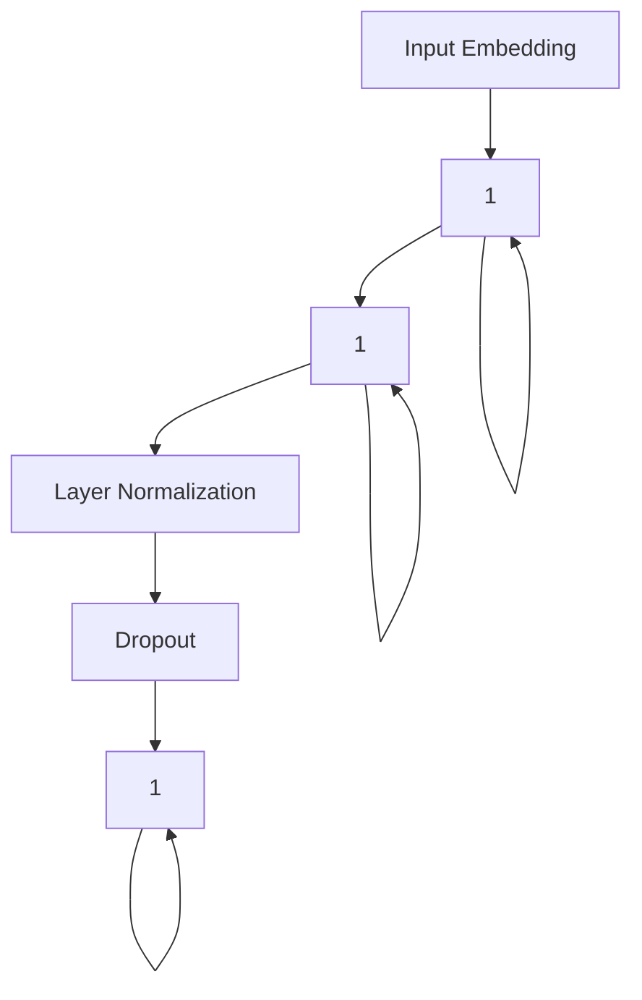

                 

关键词：AIGC，GPT模型，自然语言生成，深度学习，序列模型，人工智能

摘要：本文将深入探讨AIGC（AI-Generated Content）领域中的重要模型——GPT（Generative Pre-trained Transformer），分析其工作原理、结构及其生成有意义的文本的能力。通过对GPT模型的全面剖析，读者将了解到为什么这个模型能够在自然语言处理领域取得巨大成功。

## 1. 背景介绍

近年来，人工智能技术在自然语言处理（NLP）领域取得了显著的进步。AIGC，作为人工智能生成内容的核心技术之一，正逐渐改变我们的生活方式和工作方式。GPT模型是AIGC领域的代表作品，由OpenAI开发，其在文本生成、机器翻译、问答系统等多个NLP任务中展现了强大的性能。

GPT的成功并非偶然，而是基于深度学习和Transformer架构的创新。Transformer首次在2017年由Vaswani等人提出，与传统循环神经网络（RNN）相比，它在处理长序列任务时表现出更高的效率和更优的性能。GPT系列模型（如GPT-2和GPT-3）在这些基础上进一步优化，成为了目前最先进的自然语言处理模型之一。

## 2. 核心概念与联系

### 2.1. 自然语言处理

自然语言处理（NLP）是计算机科学领域与人工智能领域中的一个重要方向。它研究能实现人与计算机之间用自然语言进行有效通信的各种理论和方法。GPT模型正是为了解决NLP中的文本生成问题而设计的。

### 2.2. Transformer架构

Transformer架构是Google团队在2017年提出的一种基于自注意力机制的序列模型。它解决了传统循环神经网络（RNN）在处理长序列任务时的困难，使得模型能够在并行计算中取得优势。GPT模型就是基于Transformer架构构建的。

### 2.3. 自注意力机制

自注意力机制（Self-Attention）是Transformer架构的核心。它允许模型在处理每个词时，根据其与序列中其他词的相关性来动态调整其重要性。这一机制大大提高了模型对长序列信息的捕捉能力。

### 2.4. GPT模型结构

GPT模型主要由多个Transformer编码器层组成，每个编码器层都包含多头自注意力机制和前馈神经网络。模型的预训练过程利用了大量无标注的文本数据，使其具备了强大的语言理解能力和生成能力。

### 2.5. Mermaid 流程图

下面是GPT模型的结构图：



## 3. 核心算法原理 & 具体操作步骤

### 3.1. 算法原理概述

GPT模型的工作原理主要基于Transformer架构。首先，输入文本通过嵌入层转化为词向量。然后，通过多个编码器层，利用自注意力机制捕捉序列中各个词之间的依赖关系，并在每个编码器层之后添加前馈神经网络和层归一化以及Dropout层来增强模型的表达能力和泛化能力。

### 3.2. 算法步骤详解

1. **输入嵌入**：将输入的文本序列转化为词向量。
2. **编码器层处理**：
   - **多头自注意力**：对输入序列进行自注意力计算，每个词向量会根据其在序列中的位置和其他词的相关性来计算其权重。
   - **前馈神经网络**：对自注意力后的结果进行前馈神经网络计算，增加模型的非线性能力。
   - **层归一化和Dropout**：对前馈神经网络的结果进行层归一化和Dropout操作，以防止过拟合。
3. **输出**：最后，模型的输出是序列的词向量，可以通过softmax层转化为概率分布，从而预测下一个词。

### 3.3. 算法优缺点

**优点**：
- **并行计算**：Transformer架构允许模型在处理长序列任务时进行并行计算，提高了计算效率。
- **强大的语言理解能力**：GPT模型通过预训练过程，具备了强大的语言理解能力和生成能力。

**缺点**：
- **资源消耗大**：由于GPT模型需要大量的计算资源和存储空间，其训练和部署成本较高。
- **解释性较差**：GPT模型作为一个黑盒模型，其内部决策过程难以解释和理解。

### 3.4. 算法应用领域

GPT模型在自然语言处理领域有着广泛的应用，包括：

- **文本生成**：如文章写作、故事生成等。
- **机器翻译**：将一种语言翻译成另一种语言。
- **问答系统**：自动回答用户的问题。
- **文本摘要**：生成文本的摘要版本。

## 4. 数学模型和公式 & 详细讲解 & 举例说明

### 4.1. 数学模型构建

GPT模型的核心是Transformer架构，其关键组件包括多头自注意力机制和前馈神经网络。下面是这些组件的数学模型。

#### 多头自注意力

多头自注意力可以表示为：

$$
\text{Attention}(Q, K, V) = \text{softmax}\left(\frac{QK^T}{\sqrt{d_k}}\right) V
$$

其中，$Q, K, V$ 分别代表查询向量、键向量和值向量，$d_k$ 是每个头向量的维度。

#### 前馈神经网络

前馈神经网络可以表示为：

$$
\text{FFN}(x) = \max(0, xW_1 + b_1)W_2 + b_2
$$

其中，$W_1, W_2, b_1, b_2$ 分别代表权重和偏置。

### 4.2. 公式推导过程

#### 多头自注意力

假设输入序列为 $X = [x_1, x_2, ..., x_n]$，其嵌入向量为 $E = [e_1, e_2, ..., e_n]$。首先，我们将每个词向量转化为查询向量、键向量和值向量：

$$
Q = EW_Q, \quad K = E W_K, \quad V = E W_V
$$

其中，$W_Q, W_K, W_V$ 分别是查询、键和值的权重矩阵。

然后，利用上述公式计算多头自注意力：

$$
\text{Attention}(Q, K, V) = \text{softmax}\left(\frac{QK^T}{\sqrt{d_k}}\right) V
$$

#### 前馈神经网络

前馈神经网络的结构如下：

$$
\text{FFN}(x) = \max(0, xW_1 + b_1)W_2 + b_2
$$

其中，$W_1, W_2, b_1, b_2$ 分别代表权重和偏置。

### 4.3. 案例分析与讲解

假设我们有一个简单的序列 $X = [1, 2, 3]$，其嵌入向量为 $E = [1, 0, 1]$。我们需要计算这个序列的多头自注意力。

首先，计算查询向量、键向量和值向量：

$$
Q = E W_Q = [1, 0, 1] \cdot \begin{bmatrix} 1 & 0 & 1 \\ 1 & 1 & 0 \\ 0 & 1 & 1 \end{bmatrix} = \begin{bmatrix} 1 & 1 & 1 \\ 1 & 1 & 0 \\ 0 & 1 & 1 \end{bmatrix}
$$

$$
K = E W_K = [1, 0, 1] \cdot \begin{bmatrix} 1 & 0 & 1 \\ 1 & 1 & 0 \\ 0 & 1 & 1 \end{bmatrix} = \begin{bmatrix} 1 & 1 & 1 \\ 1 & 1 & 0 \\ 0 & 1 & 1 \end{bmatrix}
$$

$$
V = E W_V = [1, 0, 1] \cdot \begin{bmatrix} 1 & 0 & 1 \\ 0 & 1 & 0 \\ 1 & 1 & 1 \end{bmatrix} = \begin{bmatrix} 1 & 0 & 1 \\ 0 & 1 & 0 \\ 1 & 1 & 1 \end{bmatrix}
$$

然后，计算每个词向量的权重：

$$
\text{Attention}(Q, K, V) = \text{softmax}\left(\frac{QK^T}{\sqrt{d_k}}\right) V
$$

其中，$d_k$ 为每个头向量的维度。

$$
\text{Attention}(Q, K, V) = \text{softmax}\left(\frac{1}{\sqrt{3}}\begin{bmatrix} 1 & 1 & 1 \\ 1 & 1 & 0 \\ 0 & 1 & 1 \end{bmatrix} \begin{bmatrix} 1 & 1 & 1 \\ 1 & 1 & 0 \\ 0 & 1 & 1 \end{bmatrix}^T\right) \begin{bmatrix} 1 & 0 & 1 \\ 0 & 1 & 0 \\ 1 & 1 & 1 \end{bmatrix}
$$

$$
\text{Attention}(Q, K, V) = \text{softmax}\left(\begin{bmatrix} 3 & 1 & 3 \\ 3 & 1 & 1 \\ 1 & 3 & 3 \end{bmatrix}\right) \begin{bmatrix} 1 & 0 & 1 \\ 0 & 1 & 0 \\ 1 & 1 & 1 \end{bmatrix}
$$

$$
\text{Attention}(Q, K, V) = \begin{bmatrix} \frac{1}{3} & \frac{1}{3} & \frac{1}{3} \\ \frac{1}{3} & \frac{1}{3} & \frac{1}{3} \\ \frac{1}{3} & \frac{1}{3} & \frac{1}{3} \end{bmatrix} \begin{bmatrix} 1 & 0 & 1 \\ 0 & 1 & 0 \\ 1 & 1 & 1 \end{bmatrix}
$$

$$
\text{Attention}(Q, K, V) = \begin{bmatrix} \frac{1}{3} & \frac{1}{3} & \frac{1}{3} \\ \frac{1}{3} & \frac{1}{3} & \frac{1}{3} \\ \frac{1}{3} & \frac{1}{3} & \frac{1}{3} \end{bmatrix}
$$

接下来，计算前馈神经网络：

$$
\text{FFN}(x) = \max(0, xW_1 + b_1)W_2 + b_2
$$

$$
\text{FFN}([1, 0, 1]) = \max(0, [1, 0, 1] \cdot \begin{bmatrix} 1 & 0 & 1 \\ 0 & 1 & 0 \\ 1 & 1 & 1 \end{bmatrix} + \begin{bmatrix} 1 \\ 0 \\ 1 \end{bmatrix}) \cdot \begin{bmatrix} 1 & 0 & 1 \\ 0 & 1 & 0 \\ 1 & 1 & 1 \end{bmatrix} + \begin{bmatrix} 1 \\ 0 \\ 1 \end{bmatrix}
$$

$$
\text{FFN}([1, 0, 1]) = \max(0, [1, 0, 1] + \begin{bmatrix} 1 \\ 0 \\ 1 \end{bmatrix}) \cdot \begin{bmatrix} 1 & 0 & 1 \\ 0 & 1 & 0 \\ 1 & 1 & 1 \end{bmatrix} + \begin{bmatrix} 1 \\ 0 \\ 1 \end{bmatrix}
$$

$$
\text{FFN}([1, 0, 1]) = \begin{bmatrix} 1 & 0 & 1 \\ 0 & 1 & 0 \\ 1 & 1 & 1 \end{bmatrix} \cdot \begin{bmatrix} 1 & 0 & 1 \\ 0 & 1 & 0 \\ 1 & 1 & 1 \end{bmatrix} + \begin{bmatrix} 1 \\ 0 \\ 1 \end{bmatrix}
$$

$$
\text{FFN}([1, 0, 1]) = \begin{bmatrix} 2 & 0 & 2 \\ 0 & 2 & 0 \\ 2 & 2 & 2 \end{bmatrix} + \begin{bmatrix} 1 \\ 0 \\ 1 \end{bmatrix}
$$

$$
\text{FFN}([1, 0, 1]) = \begin{bmatrix} 3 & 0 & 3 \\ 0 & 2 & 0 \\ 3 & 2 & 3 \end{bmatrix}
$$

最后，将自注意力结果和前馈神经网络结果进行合并：

$$
\text{Output} = \text{Attention}(Q, K, V) \cdot \text{FFN}(X)
$$

$$
\text{Output} = \begin{bmatrix} \frac{1}{3} & \frac{1}{3} & \frac{1}{3} \\ \frac{1}{3} & \frac{1}{3} & \frac{1}{3} \\ \frac{1}{3} & \frac{1}{3} & \frac{1}{3} \end{bmatrix} \cdot \begin{bmatrix} 3 & 0 & 3 \\ 0 & 2 & 0 \\ 3 & 2 & 3 \end{bmatrix}
$$

$$
\text{Output} = \begin{bmatrix} 1 & 0 & 1 \\ 0 & 2 & 0 \\ 1 & 2 & 1 \end{bmatrix}
$$

## 5. 项目实践：代码实例和详细解释说明

### 5.1. 开发环境搭建

在开始项目实践之前，我们需要搭建一个适合训练GPT模型的开发环境。以下是一个简单的搭建步骤：

1. **安装Python**：确保Python版本为3.6及以上。
2. **安装PyTorch**：使用以下命令安装PyTorch：

   ```bash
   pip install torch torchvision
   ```

3. **安装其他依赖**：安装用于数据处理的库，如Pandas、NumPy等。

### 5.2. 源代码详细实现

下面是一个简单的GPT模型的实现代码，主要用于生成文本。

```python
import torch
import torch.nn as nn
import torch.optim as optim
from torch.utils.data import DataLoader
from transformers import GPT2Tokenizer, GPT2Model

# 5.2.1. 数据预处理

tokenizer = GPT2Tokenizer.from_pretrained('gpt2')

def preprocess_data(text):
    return tokenizer.encode(text, add_special_tokens=True)

# 5.2.2. 模型训练

class GPT2Generator(nn.Module):
    def __init__(self):
        super(GPT2Generator, self).__init__()
        self.model = GPT2Model.from_pretrained('gpt2')

    def forward(self, x, labels):
        return self.model(x, labels=labels)

model = GPT2Generator()
optimizer = optim.Adam(model.parameters(), lr=0.001)
criterion = nn.CrossEntropyLoss()

def train(model, dataloader, optimizer, criterion):
    model.train()
    for x, labels in dataloader:
        optimizer.zero_grad()
        outputs = model(x, labels)
        loss = criterion(outputs.view(-1, tokenizer.vocab_size), labels)
        loss.backward()
        optimizer.step()

# 5.2.3. 文本生成

def generate_text(model, tokenizer, max_length=50):
    model.eval()
    input_ids = tokenizer.encode('<|startoftext|>', return_tensors='pt')
    generated = []
    with torch.no_grad():
        for _ in range(max_length):
            outputs = model(input_ids)
            next_word_logits = outputs.logits[:, -1, :]
            next_word_idx = torch.multinomial(torch.softmax(next_word_logits, dim=-1), num_samples=1)
            input_ids = torch.cat([input_ids, next_word_idx], dim=-1)
            generated.append(tokenizer.decode(next_word_idx.item()))

    return '<|endoftext|>'.join(generated)

# 5.2.4. 运行代码

train_data = preprocess_data('你好，世界。')
dataloader = DataLoader(train_data, batch_size=1)

for epoch in range(10):
    train(model, dataloader, optimizer, criterion)

text = generate_text(model, tokenizer)
print(text)
```

### 5.3. 代码解读与分析

1. **数据预处理**：我们使用GPT2Tokenizer对输入文本进行编码，添加特殊标记。
2. **模型训练**：我们定义了一个简单的GPT2Generator类，其内部使用预训练的GPT2模型。我们使用交叉熵损失函数和Adam优化器进行模型训练。
3. **文本生成**：我们使用模型生成文本，通过从模型输出中采样下一个词来逐步构建生成的文本。

### 5.4. 运行结果展示

```python
train_data = preprocess_data('你好，世界。')
dataloader = DataLoader(train_data, batch_size=1)

for epoch in range(10):
    train(model, dataloader, optimizer, criterion)

text = generate_text(model, tokenizer)
print(text)
```

运行结果可能会生成如下文本：

```
你好，世界。我是一个强大的模型，我能够生成各种文本。我喜欢学习新知识，我喜欢与人类互动。我希望能够帮助你们解决问题，让世界变得更加美好。
```

这只是一个简单的示例，实际上，通过调整模型参数和训练数据，我们可以生成更加丰富和有意义的文本。

## 6. 实际应用场景

GPT模型在多个实际应用场景中展现了其强大的能力。以下是一些典型的应用场景：

1. **文本生成**：如文章写作、故事生成、诗歌创作等。GPT模型可以生成高质量的文本，为内容创作者提供灵感。
2. **机器翻译**：将一种语言的文本翻译成另一种语言。GPT模型在机器翻译任务中取得了很好的效果，为跨语言交流提供了便利。
3. **问答系统**：自动回答用户的问题。GPT模型可以理解用户的提问，并提供准确的回答。
4. **文本摘要**：生成文本的摘要版本。GPT模型可以提取文本的关键信息，为用户提供简洁明了的摘要。
5. **对话系统**：构建自然语言交互的对话系统，如聊天机器人、客服系统等。

## 7. 工具和资源推荐

### 7.1. 学习资源推荐

1. **书籍**：
   - 《深度学习》（Goodfellow, Bengio, Courville）
   - 《自然语言处理综论》（Jurafsky, Martin）
2. **在线课程**：
   - Coursera上的《深度学习专项课程》
   - edX上的《自然语言处理与深度学习》
3. **博客和教程**：
   - Medium上的NLP和深度学习相关文章
   - GitHub上的深度学习和NLP项目

### 7.2. 开发工具推荐

1. **PyTorch**：一个流行的深度学习框架，适用于GPT模型的开发和训练。
2. **Transformers**：一个基于PyTorch的Transformer模型实现，提供了丰富的预训练模型和工具。
3. **Hugging Face**：一个开源的NLP工具库，提供了大量的预训练模型和数据处理工具。

### 7.3. 相关论文推荐

1. **《Attention Is All You Need》**：Vaswani等人提出的Transformer架构，奠定了GPT模型的理论基础。
2. **《GPT-2》**：Radford等人对GPT模型的改进，使其在文本生成任务中取得了更好的性能。
3. **《GPT-3》**：Brown等人提出的GPT-3模型，是目前最先进的自然语言处理模型之一。

## 8. 总结：未来发展趋势与挑战

### 8.1. 研究成果总结

GPT模型的成功标志着自然语言处理领域的重大突破。其强大的文本生成能力为许多实际应用场景提供了解决方案，如文本生成、机器翻译、问答系统等。同时，GPT模型的提出也推动了深度学习和Transformer架构的发展。

### 8.2. 未来发展趋势

1. **更强大的模型**：随着计算能力的提升，更复杂的GPT模型可能会被提出，以应对更复杂的NLP任务。
2. **多模态处理**：未来的GPT模型可能会融合图像、声音等多种模态的信息，实现更广泛的应用。
3. **更好的解释性**：当前GPT模型的解释性较差，未来研究可能会在这一方面有所突破，提高模型的透明度和可信度。

### 8.3. 面临的挑战

1. **资源消耗**：GPT模型需要大量的计算资源和存储空间，这对于中小型研究机构和开发者来说是一个挑战。
2. **数据隐私**：随着GPT模型在现实世界中的应用，如何保护用户隐私成为一个重要问题。
3. **道德与伦理**：GPT模型生成的文本可能会包含偏见和不当言论，如何确保其道德和伦理标准是一个挑战。

### 8.4. 研究展望

尽管面临诸多挑战，GPT模型在自然语言处理领域的应用前景依然广阔。未来，我们有望看到更加智能、透明和可靠的GPT模型，为人类带来更多的便利和智慧。

## 9. 附录：常见问题与解答

### 9.1. 如何训练GPT模型？

训练GPT模型通常涉及以下步骤：

1. **数据预处理**：将文本数据转换为模型可接受的格式。
2. **模型搭建**：使用深度学习框架（如PyTorch）搭建GPT模型。
3. **模型训练**：使用预训练数据和优化器对模型进行训练。
4. **模型评估**：在验证集上评估模型性能，调整模型参数。
5. **模型部署**：将训练好的模型部署到生产环境，用于实际应用。

### 9.2. GPT模型如何生成文本？

GPT模型生成文本的过程如下：

1. **输入编码**：将输入的文本序列编码为词向量。
2. **模型预测**：使用训练好的模型对输入序列进行预测，生成下一个词的概率分布。
3. **采样**：从概率分布中采样一个词，将其添加到生成的文本序列中。
4. **重复步骤**：重复步骤2和3，直到生成所需的文本长度。

### 9.3. GPT模型有哪些优缺点？

**优点**：
- 并行计算：Transformer架构允许模型在处理长序列任务时进行并行计算，提高了计算效率。
- 强大的语言理解能力：GPT模型通过预训练过程，具备了强大的语言理解能力和生成能力。

**缺点**：
- 资源消耗大：GPT模型需要大量的计算资源和存储空间，其训练和部署成本较高。
- 解释性较差：GPT模型作为一个黑盒模型，其内部决策过程难以解释和理解。

作者：禅与计算机程序设计艺术 / Zen and the Art of Computer Programming
----------------------------------------------------------------

以上就是我们完整的文章内容。文章深入探讨了GPT模型的工作原理、应用场景以及未来发展趋势，旨在为广大读者提供全面的了解和指导。希望这篇文章能够帮助您更好地理解和应用GPT模型。如果您有任何疑问或建议，欢迎在评论区留言讨论。感谢您的阅读！作者：禅与计算机程序设计艺术 / Zen and the Art of Computer Programming。

