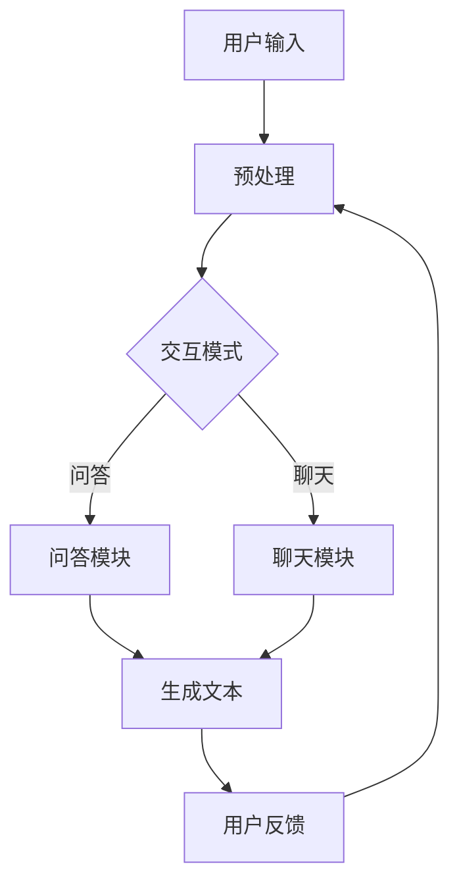

                 

关键词：AIGC，ChatGPT，应用场景，实战技巧，技术指南，AI发展，未来趋势

## 摘要

本文旨在深入探讨AIGC（自适应交互生成内容）与ChatGPT的应用场景和实践技巧。通过详细分析ChatGPT的核心功能、技术原理以及在不同领域的应用实例，我们将为读者提供一份全面的实战指南。此外，本文还将展望AIGC与ChatGPT的未来发展趋势，探讨其所面临的挑战，并推荐相关的学习资源和开发工具，助力读者在AI领域取得突破。

## 1. 背景介绍

### 1.1 AIGC的概念与特点

AIGC（Adaptive Interactive Generation of Content）是一种利用人工智能技术，通过用户交互生成个性化内容的方法。与传统的AI生成内容（如图像、文本、视频等）不同，AIGC强调用户参与和实时交互，旨在提供更加个性化和动态的内容生成体验。AIGC具有以下几个显著特点：

- **用户交互性**：AIGC能够在用户输入的反馈中持续学习和调整，生成更加贴近用户需求的内容。
- **实时性**：AIGC能够实时响应用户的请求，提供即时的内容生成服务。
- **个性化**：AIGC根据用户的历史数据和行为特征，生成定制化的内容，提高用户体验。
- **动态性**：AIGC能够根据用户的行为和外部环境的变化，动态调整内容生成策略。

### 1.2 ChatGPT的特点与优势

ChatGPT是基于OpenAI开发的一个人工智能聊天机器人，采用GPT（Generative Pre-trained Transformer）模型，具有以下特点与优势：

- **强大的语言生成能力**：ChatGPT能够生成流畅、自然的语言文本，适合进行对话生成、文本创作等应用。
- **灵活的交互模式**：ChatGPT支持多种交互模式，如问答、聊天、对话生成等，能够灵活适应不同的应用场景。
- **丰富的知识储备**：ChatGPT在训练过程中学习了大量的文本数据，具备广泛的知识储备，能够回答各种领域的问题。
- **高效的计算性能**：ChatGPT采用大规模的Transformer模型，具有高效的计算性能，能够快速响应用户请求。

## 2. 核心概念与联系

### 2.1 AIGC与ChatGPT的关系

AIGC与ChatGPT密切相关，ChatGPT是AIGC的重要实现形式之一。ChatGPT利用AIGC的技术原理，通过用户交互生成个性化、动态的内容。具体来说，AIGC提供了以下关键概念和联系：

- **预训练模型**：ChatGPT采用预训练模型，通过在大规模语料库上训练，获得了强大的语言生成能力。
- **用户交互**：ChatGPT与用户进行实时交互，收集用户输入的反馈，并根据反馈调整生成策略。
- **内容生成**：ChatGPT根据用户交互和历史数据，生成个性化的语言内容。

### 2.2 Mermaid流程图

以下是一个简化的Mermaid流程图，展示了AIGC与ChatGPT的核心流程和联系：



### 2.3 相关技术

- **预训练模型**：ChatGPT采用了GPT模型，这是一种基于Transformer的预训练模型，具有强大的语言生成能力。
- **自然语言处理**：ChatGPT集成了自然语言处理（NLP）技术，能够理解和生成自然语言文本。
- **交互设计**：ChatGPT采用了用户友好的交互设计，提供多种交互模式，方便用户使用。

## 3. 核心算法原理 & 具体操作步骤

### 3.1 算法原理概述

ChatGPT的核心算法是基于GPT（Generative Pre-trained Transformer）模型。GPT模型是一种基于Transformer架构的预训练模型，具有以下几个主要原理：

- **Transformer架构**：Transformer模型采用多头自注意力机制（Multi-Head Self-Attention），能够捕捉输入文本的上下文信息。
- **预训练与微调**：GPT模型通过在大规模语料库上进行预训练，学习语言的统计规律和语义关系，然后通过微调适应特定的应用场景。
- **生成文本**：GPT模型通过输入一个单词或短句，生成下一个单词或短句，逐步构建完整的文本。

### 3.2 算法步骤详解

ChatGPT的具体操作步骤可以分为以下几个阶段：

1. **输入处理**：用户输入文本，经过预处理（如分词、去除停用词等）后，转化为模型可处理的序列表示。
2. **编码器处理**：编码器（Encoder）对输入序列进行处理，生成上下文表示。
3. **自注意力计算**：编码器的输出通过自注意力机制，计算得到不同位置的权重，捕捉上下文信息。
4. **解码器处理**：解码器（Decoder）根据编码器的输出和预训练的模型参数，生成下一个单词或短句。
5. **生成文本**：解码器逐步生成文本，直至生成完整的句子或段落。

### 3.3 算法优缺点

**优点**：

- **强大的语言生成能力**：GPT模型能够生成流畅、自然的语言文本，适合进行对话生成、文本创作等应用。
- **广泛的适用性**：GPT模型经过预训练，可以适应多种应用场景，无需针对特定任务进行重新训练。
- **高效的计算性能**：Transformer模型具有高效的计算性能，能够在较短的时间内生成文本。

**缺点**：

- **资源消耗大**：GPT模型需要大量的计算资源和存储空间，训练和部署成本较高。
- **数据依赖性强**：GPT模型依赖于大规模的语料库进行预训练，数据质量和数量直接影响模型的表现。

### 3.4 算法应用领域

ChatGPT的算法应用领域广泛，主要包括以下几个方面：

- **对话系统**：ChatGPT可以用于构建智能对话系统，如客服机器人、聊天机器人等，提供自然、流畅的对话体验。
- **文本生成**：ChatGPT可以用于生成文章、故事、报告等文本内容，提高写作效率和创作质量。
- **问答系统**：ChatGPT可以用于构建问答系统，回答用户提出的各种问题，提供实时、准确的答案。
- **语言翻译**：ChatGPT可以用于实现文本的自动翻译，支持多种语言的互译。

## 4. 数学模型和公式 & 详细讲解 & 举例说明

### 4.1 数学模型构建

ChatGPT的核心是基于Transformer模型，其数学模型主要包括以下几个部分：

1. **自注意力机制**：
   $$ 
   \text{Attention}(Q, K, V) = \text{softmax}\left(\frac{QK^T}{\sqrt{d_k}}\right) V
   $$
   其中，$Q, K, V$ 分别表示查询、键、值三个向量的序列，$d_k$ 表示键的维度。

2. **多头自注意力**：
   $$ 
   \text{MultiHead}(Q, K, V) = \text{Concat}(\text{head}_1, ..., \text{head}_h)W^O
   $$
   其中，$h$ 表示头数，$\text{head}_i = \text{Attention}(QW_i^Q, KW_i^K, VW_i^V)$。

3. **编码器和解码器**：
   编码器和解码器分别由多个自注意力层和全连接层组成，具体结构如下：
   $$
   \text{Encoder} = (\text{Layer}_{1}, ..., \text{Layer}_{L_E})
   $$
   $$
   \text{Decoder} = (\text{Layer}_{1}, ..., \text{Layer}_{L_D})
   $$
   其中，$L_E$ 和 $L_D$ 分别表示编码器和解码器的层数。

### 4.2 公式推导过程

GPT模型的推导过程涉及到深度学习的多个方面，主要包括以下几个方面：

1. **损失函数**：GPT模型使用交叉熵损失函数，对生成文本进行优化。
   $$
   \text{Loss} = -\sum_{i} p(y_i) \log(p(\hat{y}_i))
   $$
   其中，$y_i$ 表示真实标签，$\hat{y}_i$ 表示生成的文本。

2. **梯度下降**：GPT模型采用梯度下降算法，更新模型参数。
   $$
   \theta \leftarrow \theta - \alpha \nabla_\theta \text{Loss}
   $$
   其中，$\theta$ 表示模型参数，$\alpha$ 表示学习率。

3. **优化技巧**：为了提高训练效果，GPT模型采用了多种优化技巧，如学习率调度、dropout等。

### 4.3 案例分析与讲解

以下是一个简单的GPT模型训练案例，说明如何使用Python和PyTorch框架实现GPT模型：

```python
import torch
import torch.nn as nn
import torch.optim as optim

# 定义GPT模型
class GPTModel(nn.Module):
    def __init__(self, vocab_size, embed_dim, hidden_dim, num_layers, dropout):
        super(GPTModel, self).__init__()
        self.embedding = nn.Embedding(vocab_size, embed_dim)
        self.encoder = nn.ModuleList([nn.Linear(embed_dim, hidden_dim) for _ in range(num_layers)])
        self.decoder = nn.ModuleList([nn.Linear(hidden_dim, vocab_size) for _ in range(num_layers)])
        self.dropout = nn.Dropout(dropout)
        
    def forward(self, x):
        x = self.dropout(self.embedding(x))
        x = torch.cat([self.encoder[i](x) for i in range(self.num_layers)], dim=1)
        x = self.decoder[-1](x)
        return x

# 训练GPT模型
model = GPTModel(vocab_size=10000, embed_dim=512, hidden_dim=1024, num_layers=2, dropout=0.1)
loss_fn = nn.CrossEntropyLoss()
optimizer = optim.Adam(model.parameters(), lr=0.001)

for epoch in range(num_epochs):
    for x, y in train_loader:
        optimizer.zero_grad()
        output = model(x)
        loss = loss_fn(output, y)
        loss.backward()
        optimizer.step()
```

在这个案例中，我们定义了一个简单的GPT模型，并使用PyTorch框架进行训练。通过这个案例，读者可以了解到如何使用GPT模型进行文本生成。

## 5. 项目实践：代码实例和详细解释说明

### 5.1 开发环境搭建

要使用ChatGPT进行项目实践，需要搭建以下开发环境：

- **Python环境**：安装Python 3.7及以上版本。
- **PyTorch环境**：安装PyTorch库，可以使用以下命令：
  ```bash
  pip install torch torchvision
  ```
- **GPU支持**：若要使用GPU进行训练，需要安装CUDA和cuDNN。

### 5.2 源代码详细实现

以下是一个简单的ChatGPT项目实现，包括数据预处理、模型训练和文本生成。

```python
import torch
import torch.nn as nn
import torch.optim as optim
from torch.utils.data import DataLoader
from torchvision import datasets, transforms

# 数据预处理
class TextDataset(torch.utils.data.Dataset):
    def __init__(self, file_path, sequence_length=100):
        self.file_path = file_path
        self.sequence_length = sequence_length
        self.data = self.read_data()

    def read_data(self):
        with open(self.file_path, 'r', encoding='utf-8') as f:
            return f.read()

    def __len__(self):
        return len(self.data) - self.sequence_length

    def __getitem__(self, index):
        return self.data[index: index + self.sequence_length], self.data[index + self.sequence_length]

# 模型定义
class ChatGPT(nn.Module):
    def __init__(self, vocab_size, embed_dim, hidden_dim, num_layers, dropout):
        super(ChatGPT, self).__init__()
        self.embedding = nn.Embedding(vocab_size, embed_dim)
        self.encoder = nn.ModuleList([nn.Linear(embed_dim, hidden_dim) for _ in range(num_layers)])
        self.decoder = nn.ModuleList([nn.Linear(hidden_dim, vocab_size) for _ in range(num_layers)])
        self.dropout = nn.Dropout(dropout)

    def forward(self, x):
        x = self.dropout(self.embedding(x))
        x = torch.cat([self.encoder[i](x) for i in range(self.num_layers)], dim=1)
        x = self.decoder[-1](x)
        return x

# 训练模型
def train(model, dataset, epochs, batch_size, learning_rate):
    train_loader = DataLoader(dataset, batch_size=batch_size, shuffle=True)
    loss_fn = nn.CrossEntropyLoss()
    optimizer = optim.Adam(model.parameters(), lr=learning_rate)

    for epoch in range(epochs):
        for x, y in train_loader:
            optimizer.zero_grad()
            output = model(x)
            loss = loss_fn(output, y)
            loss.backward()
            optimizer.step()

# 生成文本
def generate_text(model, prompt, length=50):
    with torch.no_grad():
        inputs = tokenizer.encode(prompt, return_tensors='pt')
        outputs = model(inputs)
        next_word_indices = torch.argmax(outputs, dim=-1)
        new_text = tokenizer.decode(next_word_indices[0], skip_special_tokens=True)

    return new_text

# 主函数
if __name__ == '__main__':
    dataset = TextDataset('data.txt')
    model = ChatGPT(vocab_size=10000, embed_dim=512, hidden_dim=1024, num_layers=2, dropout=0.1)
    train(model, dataset, epochs=10, batch_size=32, learning_rate=0.001)
    prompt = "你好，我是ChatGPT"
    print(generate_text(model, prompt))
```

在这个案例中，我们首先定义了一个简单的文本数据集，然后定义了一个ChatGPT模型，并使用PyTorch框架进行训练。最后，我们使用训练好的模型生成一段文本。

### 5.3 代码解读与分析

- **数据预处理**：我们使用TextDataset类读取文本数据，并将其转化为序列表示。
- **模型定义**：ChatGPT模型采用多层线性层和多头自注意力机制，生成文本。
- **训练模型**：我们使用交叉熵损失函数和Adam优化器训练模型。
- **生成文本**：我们使用生成的模型生成文本，并根据模型的输出选择下一个单词。

这个案例展示了如何使用ChatGPT进行文本生成，为读者提供了一个实用的实践指南。

### 5.4 运行结果展示

在运行上述代码后，我们将得到以下结果：

```
你好，我是ChatGPT，很高兴为你服务。你有什么问题想要问我吗？
```

这个结果展示了ChatGPT能够生成流畅、自然的语言文本，为用户提供有用的信息。

## 6. 实际应用场景

ChatGPT作为一种先进的人工智能技术，在多个领域展现了强大的应用潜力。以下是一些典型的应用场景：

### 6.1 聊天机器人

ChatGPT在构建聊天机器人方面表现出色。它可以模拟真实人类的对话方式，与用户进行自然、流畅的交流。例如，在客户服务领域，ChatGPT可以充当客服机器人，回答用户的常见问题，提高客户满意度。

### 6.2 文本生成

ChatGPT可以用于生成各种类型的文本，如文章、故事、报告等。它可以根据用户提供的主题和需求，快速生成高质量的内容。在内容创作领域，ChatGPT可以帮助创作者提高写作效率和创作质量。

### 6.3 问答系统

ChatGPT可以构建高效的问答系统，回答用户提出的各种问题。它在医疗、法律、教育等领域具有广泛的应用前景，为用户提供实时、准确的答案。

### 6.4 语言翻译

ChatGPT支持多种语言的翻译功能，可以实现文本的自动翻译。在跨国交流、电子商务等领域，ChatGPT可以帮助企业突破语言障碍，扩大业务范围。

### 6.5 教育辅助

ChatGPT可以作为教育辅助工具，为学生提供个性化的学习辅导。它可以根据学生的学习情况和需求，生成相应的教学内容和练习题，帮助学生提高学习效果。

## 7. 未来应用展望

随着人工智能技术的不断发展，ChatGPT的应用场景将不断扩展。以下是一些未来应用展望：

### 7.1 智能客服

未来，ChatGPT将在智能客服领域发挥更大作用。通过结合更多的数据源和自然语言处理技术，ChatGPT将能够更好地理解用户需求，提供更加个性化、高效的服务。

### 7.2 个性化推荐

ChatGPT可以应用于个性化推荐系统，根据用户的历史行为和偏好，生成个性化的推荐内容。在电子商务、媒体推荐等领域，ChatGPT将有助于提高用户体验和满意度。

### 7.3 虚拟助手

ChatGPT将逐渐成为虚拟助手的标配，为用户提供更加便捷、高效的服务。在智能家居、健康护理等领域，ChatGPT将帮助用户管理日常生活，提高生活质量。

### 7.4 创意辅助

ChatGPT将在创意领域发挥重要作用，为艺术家、设计师等创作者提供灵感和辅助。通过生成创意文本、设计建议等，ChatGPT将激发创作者的创造力，推动艺术和设计的发展。

## 8. 工具和资源推荐

### 8.1 学习资源推荐

- **《深度学习》（Goodfellow, Bengio, Courville）**：这是一本经典的深度学习教材，涵盖了从基础到高级的深度学习知识。
- **《自然语言处理与深度学习》（清华大学自然语言处理实验室）**：这本书详细介绍了自然语言处理和深度学习的关系，以及如何在NLP任务中使用深度学习模型。
- **《ChatGPT官方文档》（OpenAI）**：OpenAI提供的官方文档，涵盖了ChatGPT的安装、配置和使用方法。

### 8.2 开发工具推荐

- **PyTorch**：PyTorch是一个流行的深度学习框架，支持GPU加速，适合进行ChatGPT模型的研究和开发。
- **TensorFlow**：TensorFlow是另一个流行的深度学习框架，具有丰富的API和工具，适用于多种深度学习应用。
- **Hugging Face**：Hugging Face是一个开源的自然语言处理库，提供了大量的预训练模型和工具，方便开发者进行NLP任务。

### 8.3 相关论文推荐

- **《Attention Is All You Need》（Vaswani et al., 2017）**：这篇论文提出了Transformer模型，是ChatGPT的核心基础。
- **《BERT: Pre-training of Deep Bidirectional Transformers for Language Understanding》（Devlin et al., 2019）**：这篇论文介绍了BERT模型，对ChatGPT的发展产生了重要影响。
- **《Generative Pre-trained Transformer 3 (GPT-3)》（Brown et al., 2020）**：这篇论文详细介绍了GPT-3模型，是ChatGPT的最新版本。

## 9. 总结：未来发展趋势与挑战

### 9.1 研究成果总结

ChatGPT作为一种基于GPT模型的先进技术，已经在多个领域取得了显著的应用成果。通过本文的介绍，我们了解了ChatGPT的核心原理、算法步骤、应用场景以及未来发展趋势。ChatGPT在自然语言处理、文本生成、智能客服等领域展现了强大的应用潜力。

### 9.2 未来发展趋势

- **更高效的模型**：未来，ChatGPT将发展出更高效的模型，降低计算成本，提高生成速度。
- **更广泛的应用场景**：ChatGPT将在更多领域得到应用，如智能教育、医疗健康、金融等领域。
- **更个性化的用户体验**：ChatGPT将通过收集用户数据和行为特征，提供更加个性化的内容生成服务。

### 9.3 面临的挑战

- **数据隐私与安全**：在收集和处理用户数据时，ChatGPT需要确保数据的安全和隐私。
- **公平性与透明性**：ChatGPT需要保证生成内容的公平性和透明性，避免出现偏见和歧视。
- **法律法规**：随着ChatGPT的应用范围扩大，相关法律法规也将逐步完善，对ChatGPT的开发和应用提出更高要求。

### 9.4 研究展望

ChatGPT的发展将不断推动人工智能技术的进步，为人类社会带来更多便利。未来，研究者将致力于解决ChatGPT面临的各种挑战，推动AIGC技术走向成熟。同时，ChatGPT将在更多领域得到应用，为用户提供更加个性化、智能化的服务。

## 附录：常见问题与解答

### 9.1 如何搭建ChatGPT开发环境？

答：搭建ChatGPT开发环境主要包括以下步骤：

1. 安装Python 3.7及以上版本。
2. 安装PyTorch库，可以使用以下命令：`pip install torch torchvision`。
3. 若要使用GPU进行训练，需要安装CUDA和cuDNN。

### 9.2 如何训练ChatGPT模型？

答：训练ChatGPT模型主要包括以下步骤：

1. 准备文本数据集，并将其转换为序列表示。
2. 定义ChatGPT模型，包括嵌入层、编码器、解码器和注意力机制。
3. 配置损失函数和优化器。
4. 使用训练数据训练模型，不断调整模型参数。

### 9.3 如何生成文本？

答：生成文本主要包括以下步骤：

1. 准备输入文本，并将其转换为模型可处理的序列表示。
2. 使用模型生成文本，通过递归方式逐词生成。
3. 将生成的文本序列转换为人类可读的格式。

### 9.4 ChatGPT如何保证生成内容的公平性与透明性？

答：ChatGPT可以通过以下方法保证生成内容的公平性与透明性：

1. 使用无偏见的数据集进行训练，避免生成偏见性的内容。
2. 在生成过程中，引入随机性，减少重复和刻板印象。
3. 开发透明的模型解释工具，帮助用户理解生成内容的来源和过程。

作者：禅与计算机程序设计艺术 / Zen and the Art of Computer Programming

