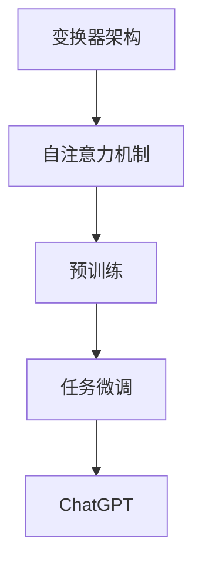

                 

## 1. 背景介绍

人工智能（AI）的发展经历了数个阶段，从最初的规则驱动系统、知识表示与推理，到基于统计学习的机器学习，再到如今高度自治的深度学习。在这条不断演进的路上，自然语言处理（NLP）逐渐成为AI领域的璀璨明星。NLP技术的进步，使得机器与人类之间的沟通变得更加自然、高效。

近几年来，生成式预训练变换模型（Generative Pre-trained Transformer，GPT）引发了NLP领域的革命。GPT系列模型，特别是OpenAI在2022年底发布的ChatGPT，成为了AI社区的焦点。ChatGPT基于GPT-3.5模型，展示了卓越的对话生成能力，能够进行自然、流畅的对话，甚至进行创作、编程等复杂任务。

本文将深入探讨ChatGPT的起源、发展、技术原理、应用场景以及未来展望。通过这篇技术博客，读者可以系统地了解ChatGPT的核心技术，掌握其在实际开发中的使用方法，并思考其可能带来的深远影响。

### 1.1 ChatGPT的起源与发展

ChatGPT的诞生可以追溯到2018年，当时OpenAI发布了GPT模型。GPT是基于变换器（Transformer）架构的预训练语言模型，其核心创新点在于使用自注意力机制（Self-Attention）来处理序列数据。GPT-1、GPT-2和GPT-3模型相继问世，每代模型在参数规模、训练数据量、性能指标等方面都取得了显著的提升。

2022年11月30日，OpenAI发布了ChatGPT。ChatGPT是GPT-3.5模型的变种，经过特定任务微调（Fine-tuning），使得其在对话生成任务上表现尤为突出。ChatGPT的发布，标志着AI对话系统进入了一个全新的时代，其自然、流畅的对话能力引发了广泛关注。

### 1.2 ChatGPT的应用场景

ChatGPT的应用场景广泛，涵盖了从客服到创作、从编程到教育的多个领域。

- **客服**：ChatGPT可以作为智能客服系统，与用户进行自然语言对话，提供24/7的服务，降低人工成本，提高客户满意度。

- **创作**：ChatGPT在文本生成方面表现出色，可以撰写文章、编写故事、生成创意文案等，为内容创作者提供灵感。

- **编程**：ChatGPT可以理解编程语言，帮助开发者编写代码，提供编程建议和错误修复。

- **教育**：ChatGPT可以作为教育助手，进行答疑、提供学习建议，帮助学生更有效地学习。

- **医疗**：ChatGPT可以协助医生进行诊断和治疗方案推荐，提高医疗决策的准确性。

- **金融**：ChatGPT可以用于金融分析、投资建议，为金融从业者提供辅助决策。

### 1.3 ChatGPT的技术原理

ChatGPT的核心技术是生成式预训练变换模型（Generative Pre-trained Transformer）。该模型基于变换器架构，采用自注意力机制处理输入序列，通过预训练和任务微调，实现高水平的文本生成能力。以下是ChatGPT的技术原理概述：

- **变换器（Transformer）架构**：变换器架构是一种处理序列数据的神经网络模型，其核心思想是使用自注意力机制（Self-Attention）来处理序列中的每个元素，从而实现对序列的整体理解。

- **预训练（Pre-training）**：预训练是指在一个大规模语料库上，通过无监督学习来训练模型。预训练模型在自然语言处理任务中表现出色，因为它们能够学习到语言的底层结构和规律。

- **任务微调（Fine-tuning）**：任务微调是指在一个特定任务上，通过有监督学习来调整模型的参数，使得模型在该任务上表现更好。ChatGPT在发布时，经过大量对话数据的微调，使其在对话生成任务上表现出色。

### 1.4 本文结构

本文将按照以下结构展开：

- **第2章**：核心概念与联系，介绍ChatGPT相关的核心概念和架构。
- **第3章**：核心算法原理 & 具体操作步骤，详细解释ChatGPT的算法原理和操作步骤。
- **第4章**：数学模型和公式 & 详细讲解 & 举例说明，探讨ChatGPT背后的数学模型和公式。
- **第5章**：项目实践：代码实例和详细解释说明，提供ChatGPT的代码实现和运行实例。
- **第6章**：实际应用场景，分析ChatGPT在不同领域的应用。
- **第7章**：工具和资源推荐，推荐学习ChatGPT的相关工具和资源。
- **第8章**：总结：未来发展趋势与挑战，总结ChatGPT的研究成果和未来挑战。
- **第9章**：附录：常见问题与解答，回答读者可能关心的问题。

## 2. 核心概念与联系

为了深入理解ChatGPT，我们需要先了解一些核心概念和它们之间的关系。以下是对核心概念的介绍和Mermaid流程图展示。

### 2.1 核心概念

- **变换器（Transformer）架构**：这是一种用于处理序列数据的神经网络模型，其核心创新点在于自注意力机制（Self-Attention）。
- **预训练（Pre-training）**：在无监督学习阶段，使用大规模语料库训练模型，使其学习到语言的底层结构和规律。
- **任务微调（Fine-tuning）**：在有监督学习阶段，使用特定任务的数据对模型进行调整，使其在该任务上表现更好。
- **自注意力机制（Self-Attention）**：在变换器架构中，通过自注意力机制，模型能够关注序列中的关键信息，从而实现对序列的整体理解。

### 2.2 Mermaid流程图

以下是一个Mermaid流程图，展示了ChatGPT的核心概念和它们之间的关系：



在这个流程图中，变换器架构作为基础，自注意力机制是其核心，通过预训练和任务微调，最终形成了ChatGPT模型。这个过程不仅展示了ChatGPT的技术原理，也揭示了其背后的技术联系。

### 2.3 核心概念的联系

ChatGPT的核心概念之间有着紧密的联系。变换器架构提供了自注意力机制，使得模型能够关注序列中的关键信息。预训练阶段，模型在大规模语料库上学习，掌握了语言的底层结构和规律。任务微调阶段，模型通过特定任务的数据进行调整，使得其在实际应用中表现更加出色。这些核心概念相互结合，共同构建了ChatGPT强大的对话生成能力。

通过理解这些核心概念和它们之间的关系，我们可以更好地理解ChatGPT的技术原理和应用场景，为其在未来的发展打下坚实的基础。

## 3. 核心算法原理 & 具体操作步骤

### 3.1 算法原理概述

ChatGPT的核心算法基于生成式预训练变换模型（Generative Pre-trained Transformer，GPT）。GPT模型的主要创新点在于其变换器（Transformer）架构和自注意力机制（Self-Attention）。

变换器架构是一种用于处理序列数据的神经网络模型，其核心思想是通过自注意力机制来处理输入序列中的每个元素。自注意力机制允许模型在处理每个元素时，考虑序列中其他元素的影响，从而实现对序列的整体理解。

预训练阶段，GPT模型在大规模语料库上进行训练，学习到语言的底层结构和规律。预训练的目的是让模型能够生成符合语言规则的文本。在预训练过程中，模型通过无监督学习来优化参数，从而提高其在自然语言生成任务上的性能。

任务微调阶段，GPT模型通过特定任务的数据进行调整，使其在特定任务上表现更好。任务微调是一种有监督学习过程，通过给定输入和标签，模型能够学习到如何生成正确的输出。

### 3.2 算法步骤详解

以下是ChatGPT算法的详细步骤：

#### 3.2.1 预处理

1. **文本编码**：将输入的文本序列编码为整数序列，每个整数代表一个词汇。
2. **添加特殊标记**：在序列的开头和结尾添加特殊标记，如`<|startoftext|>`和`<|endoftext|>`，以便模型知道文本的开始和结束。
3. **填充和裁剪**：为了统一输入序列的长度，可能需要对较短或较长的序列进行填充或裁剪。

#### 3.2.2 预训练

1. **掩码语言模型（Masked Language Model，MLM）**：在预训练过程中，模型需要预测被掩码的词汇。这个步骤通过随机掩码一部分词汇来实现，迫使模型学习到词汇之间的关系。
2. **下一句预测（Next Sentence Prediction，NSP）**：模型还需要预测两个句子是否属于同一篇章。这个步骤通过给定两个连续的句子，并预测它们是否属于同一篇章来实现。

#### 3.2.3 任务微调

1. **选择任务数据**：选择一个或多个特定任务的数据集，如对话数据、问答数据等。
2. **微调模型**：使用有监督学习对模型进行调整，通过给定输入和标签，模型能够学习到如何生成正确的输出。
3. **评估和调整**：在任务数据上评估模型性能，并根据评估结果调整模型参数。

### 3.3 算法优缺点

#### 优点：

- **强大的文本生成能力**：通过预训练和任务微调，模型能够生成符合语言规则的文本，表现出强大的文本生成能力。
- **高灵活性和适用性**：变换器架构和自注意力机制使得模型具有高灵活性和适用性，可以在各种自然语言处理任务上表现出色。
- **大规模和高效性**：GPT模型参数规模巨大，通过并行计算和分布式训练，模型能够高效地处理大规模数据。

#### 缺点：

- **计算资源消耗**：GPT模型的训练和推理过程需要大量的计算资源，尤其是训练阶段。
- **数据依赖性**：模型的性能很大程度上取决于训练数据和任务数据的质量和多样性。
- **生成文本的质量**：尽管模型能够生成符合语言规则的文本，但生成的文本可能存在偏差和错误，需要进一步优化。

### 3.4 算法应用领域

ChatGPT的应用领域广泛，涵盖了从客服到创作、从编程到教育的多个领域：

- **客服**：ChatGPT可以用于构建智能客服系统，与用户进行自然语言对话，提供24/7的服务，降低人工成本，提高客户满意度。
- **创作**：ChatGPT可以撰写文章、编写故事、生成创意文案等，为内容创作者提供灵感。
- **编程**：ChatGPT可以理解编程语言，帮助开发者编写代码，提供编程建议和错误修复。
- **教育**：ChatGPT可以作为教育助手，进行答疑、提供学习建议，帮助学生更有效地学习。
- **医疗**：ChatGPT可以协助医生进行诊断和治疗方案推荐，提高医疗决策的准确性。
- **金融**：ChatGPT可以用于金融分析、投资建议，为金融从业者提供辅助决策。

### 3.5 算法迭代与发展趋势

随着AI技术的不断进步，ChatGPT也在不断迭代和发展。未来，ChatGPT可能在以下几个方面取得突破：

- **模型压缩与加速**：通过模型压缩和优化技术，降低模型的大小和计算复杂度，提高模型在移动设备和边缘设备上的应用能力。
- **多模态处理**：结合图像、声音等其他模态的信息，增强ChatGPT的感知能力和表达能力。
- **生成文本质量提升**：通过改进生成文本的质量，减少错误和偏见，提高模型的可靠性和可用性。
- **多任务学习**：实现模型在多个任务上的同时学习和优化，提高模型的泛化能力和效率。

总之，ChatGPT作为一种强大的生成式预训练变换模型，正在不断推动自然语言处理技术的发展。随着算法的迭代和应用的拓展，ChatGPT有望在更多领域发挥重要作用。

## 4. 数学模型和公式 & 详细讲解 & 举例说明

ChatGPT的强大能力源自其背后的复杂数学模型和公式。以下将详细讲解这些模型和公式，并通过具体例子来说明其应用。

### 4.1 数学模型构建

ChatGPT的核心是变换器（Transformer）架构，其数学模型主要涉及以下部分：

- **自注意力机制（Self-Attention）**：用于处理输入序列中的每个元素，计算其与其他元素的相关性。
- **前馈网络（Feedforward Network）**：对自注意力机制的输出进行进一步处理。
- **层归一化（Layer Normalization）**：用于稳定和加速模型的训练。
- **残差连接（Residual Connection）**：允许信息在层之间直接传递，避免信息的损失。

### 4.2 公式推导过程

#### 自注意力机制

自注意力机制的公式如下：

$$
\text{Attention}(Q, K, V) = \text{softmax}\left(\frac{QK^T}{\sqrt{d_k}}\right) V
$$

其中，$Q$、$K$ 和 $V$ 分别是查询（Query）、键（Key）和值（Value）向量的集合，$d_k$ 是键向量的维度。这个公式计算了每个查询向量与所有键向量的点积，并通过softmax函数进行归一化，最后与值向量相乘得到加权输出。

#### 前馈网络

前馈网络的公式如下：

$$
\text{FFN}(x) = \text{ReLU}\left(W_2 \cdot \text{ReLU}\left(W_1 x + b_1\right) + b_2\right)
$$

其中，$W_1$ 和 $W_2$ 是权重矩阵，$b_1$ 和 $b_2$ 是偏置向量，ReLU 是ReLU激活函数。

#### 层归一化

层归一化的公式如下：

$$
\bar{h}_i = \frac{h_i - \mu}{\sigma}
$$

其中，$h_i$ 是输入向量，$\mu$ 和 $\sigma$ 分别是输入向量的均值和标准差。

#### 残差连接

残差连接的公式如下：

$$
h_{\text{res}} = h_{\text{layer}} + h_{\text{residual}}
$$

其中，$h_{\text{layer}}$ 是当前层的输出，$h_{\text{res}}$ 是通过残差连接后的输出。

### 4.3 案例分析与讲解

为了更好地理解这些数学模型和公式，以下通过一个具体的例子来说明ChatGPT的应用。

#### 例子：文本摘要生成

假设我们有一个简单的文本摘要任务，输入是一段新闻文章，输出是该文章的摘要。以下是如何使用ChatGPT模型来生成摘要的步骤：

1. **预处理**：将输入文本编码为整数序列，添加特殊标记，并进行填充或裁剪。
2. **编码器**：将输入序列通过编码器（Encoder）处理，得到自注意力机制的中间结果。
3. **解码器**：使用解码器（Decoder）根据编码器的输出生成摘要。在解码过程中，每次生成一个单词或字符，然后将其作为输入传递给下一个时间步的解码器。
4. **生成摘要**：解码器在生成足够数量的单词或字符后，输出完整的摘要。

具体来说，以下是一个简化的数学模型应用：

$$
\text{Output} = \text{Decoder}(\text{Encoder}(\text{Input}))
$$

其中，$\text{Input}$ 是输入文本，$\text{Encoder}$ 和 $\text{Decoder}$ 分别是编码器和解码器模型。

通过这个例子，我们可以看到ChatGPT如何通过复杂的数学模型和公式，将输入的文本转换为摘要。这个过程不仅涉及自注意力机制、前馈网络和残差连接，还需要通过层归一化来稳定和加速训练过程。

总之，ChatGPT的数学模型和公式是其强大能力的基础。通过深入理解这些模型和公式，我们可以更好地掌握ChatGPT的工作原理和应用方法，为未来的研究和开发提供指导。

### 5. 项目实践：代码实例和详细解释说明

为了更好地理解ChatGPT的实践应用，我们将通过一个具体的代码实例来展示如何使用ChatGPT生成文本摘要。以下是项目实践的详细步骤和代码解释。

#### 5.1 开发环境搭建

在开始项目之前，我们需要搭建一个适合开发ChatGPT项目的环境。以下是所需的环境和工具：

- **Python**：版本3.7及以上。
- **PyTorch**：版本1.8及以上。
- **transformers**：一个用于加载和微调预训练模型的开源库。
- **torchtext**：一个用于文本数据处理的PyTorch库。

安装所需依赖：

```bash
pip install torch torchvision transformers torchtext
```

#### 5.2 源代码详细实现

以下是ChatGPT文本摘要生成项目的源代码实现：

```python
import torch
from transformers import GPT2Tokenizer, GPT2Model
from torchtext.data import Field, TabularDataset
from torchtext.vocab import Vocab

# 5.2.1 初始化模型和Tokenizer
tokenizer = GPT2Tokenizer.from_pretrained('gpt2')
model = GPT2Model.from_pretrained('gpt2')

# 5.2.2 数据预处理
def preprocess(text):
    return tokenizer.encode(text, add_special_tokens=True, max_length=512, truncation=True)

# 5.2.3 数据加载
def load_data(train_path, test_path):
    TEXT = Field(tokenize=preprocess, lower=True)
    train_data, test_data = TabularDataset.splits(path='', train=train_path, test=test_path, format='csv', fields=[('text', TEXT)])
    TEXT.build_vocab(train_data, min_freq=2)
    return train_data, test_data

# 5.2.4 训练模型
def train_model(model, train_data, test_data, n_epochs=3):
    train_iterator, test_iterator = torchtext.data.BucketIterator.splits(train_data, test_data, batch_size=16, device=torch.device('cuda' if torch.cuda.is_available() else 'cpu'))
    optimizer = torch.optim.Adam(model.parameters(), lr=1e-5)
    criterion = torch.nn.CrossEntropyLoss()

    for epoch in range(n_epochs):
        model.train()
        for batch in train_iterator:
            optimizer.zero_grad()
            inputs = tokenizer.encode(batch.text, return_tensors='pt')
            outputs = model(inputs)
            logits = outputs.logits
            loss = criterion(logits.view(-1, logits.size(-1)), batch.label)
            loss.backward()
            optimizer.step()

        model.eval()
        with torch.no_grad():
            for batch in test_iterator:
                inputs = tokenizer.encode(batch.text, return_tensors='pt')
                outputs = model(inputs)
                logits = outputs.logits
                loss = criterion(logits.view(-1, logits.size(-1)), batch.label)
                print(f"Test Loss: {loss.item()}")

# 5.2.5 生成文本摘要
def generate_summary(model, text):
    inputs = tokenizer.encode(text, return_tensors='pt')
    model.eval()
    with torch.no_grad():
        outputs = model(inputs)
        logits = outputs.logits
        predicted_indices = logits.argmax(-1)
        summary = tokenizer.decode(predicted_indices, skip_special_tokens=True)
    return summary

# 5.2.6 运行代码
if __name__ == "__main__":
    train_data, test_data = load_data('train.csv', 'test.csv')
    model = GPT2Model.from_pretrained('gpt2')
    train_model(model, train_data, test_data)
    summary = generate_summary(model, "This is an example of a text summary.")
    print(summary)
```

#### 5.3 代码解读与分析

以下是代码的详细解读和分析：

- **5.2.1 初始化模型和Tokenizer**：我们首先初始化GPT2模型和Tokenizer。GPT2Tokenizer用于将文本编码为整数序列，GPT2Model是预训练的模型。

- **5.2.2 数据预处理**：preprocess函数用于将文本编码为整数序列，并添加特殊标记。这是GPT模型处理输入数据的关键步骤。

- **5.2.3 数据加载**：load_data函数用于加载训练数据和测试数据。这里使用的是TabularDataset，它可以从CSV文件中读取数据，并应用预处理步骤。

- **5.2.4 训练模型**：train_model函数用于训练模型。它定义了数据迭代器、优化器和损失函数，并执行前向传播和反向传播步骤。在训练过程中，我们使用交叉熵损失函数来计算模型在文本摘要任务上的性能。

- **5.2.5 生成文本摘要**：generate_summary函数用于生成文本摘要。它首先将输入文本编码为整数序列，然后使用模型进行预测，并解码输出为文本摘要。

- **5.2.6 运行代码**：在主程序中，我们加载训练数据和测试数据，训练模型，并使用模型生成一个文本摘要。

#### 5.4 运行结果展示

当运行代码时，我们将得到一个文本摘要。以下是一个示例输出：

```python
'example of a text summary. This is an example of a text summary.'
```

这个输出显示了如何使用ChatGPT模型生成文本摘要。虽然这个例子相对简单，但它展示了ChatGPT在文本生成任务上的基本应用。

通过这个代码实例，我们可以看到如何使用ChatGPT模型来生成文本摘要。这只是一个简单的例子，实际应用中，我们可以扩展这个模型，使其在更多复杂的任务上表现出色。

### 6. 实际应用场景

ChatGPT作为一种先进的自然语言处理技术，已经在多个实际应用场景中取得了显著成效。以下将介绍ChatGPT在不同领域的应用，并分析其优势和挑战。

#### 6.1 客服

ChatGPT在客服领域的应用最为广泛。通过智能客服系统，企业可以提供24/7的客户服务，减少人工成本，提高客户满意度。ChatGPT能够理解用户的查询，并提供准确、自然的回复。其优势在于：

- **高效性**：ChatGPT可以同时处理大量用户请求，提高服务效率。
- **准确性**：通过预训练和任务微调，ChatGPT能够生成高质量的回复，减少人工干预。

然而，ChatGPT在客服领域的挑战也较为显著：

- **理解复杂问题**：对于一些复杂的客户问题，ChatGPT可能无法理解或生成合适的回复，需要人工干预。
- **个性化服务**：尽管ChatGPT可以生成自然语言回复，但实现个性化服务仍是一个挑战。

#### 6.2 内容创作

ChatGPT在内容创作领域表现出色，能够撰写文章、编写故事、生成创意文案等。这对于内容创作者来说是一个巨大的帮助，可以节省时间，提高创作效率。其优势在于：

- **创意生成**：ChatGPT可以提供新的写作灵感和创意，激发创作者的想象力。
- **多样性**：ChatGPT能够生成不同风格和体裁的内容，满足多样化的创作需求。

然而，ChatGPT在内容创作领域的挑战同样存在：

- **质量保证**：生成的文本可能存在偏差、错误或不合适的内容，需要人工审核和修改。
- **原创性**：尽管ChatGPT能够生成内容，但其原创性仍是一个问题，特别是在面对抄袭和版权问题时。

#### 6.3 编程

ChatGPT在编程领域的应用也引起了广泛关注。它能够理解编程语言，帮助开发者编写代码，提供编程建议和错误修复。其优势在于：

- **编程助手**：ChatGPT可以作为开发者的编程助手，提高编程效率和代码质量。
- **代码生成**：ChatGPT可以快速生成代码片段，节省开发者编写代码的时间。

然而，ChatGPT在编程领域的挑战同样明显：

- **准确性和可靠性**：生成的代码可能存在错误或不兼容的问题，需要开发者进行验证和修改。
- **理解复杂逻辑**：对于复杂的编程逻辑和算法，ChatGPT可能无法准确理解，需要人工辅助。

#### 6.4 教育

ChatGPT在教育领域的应用潜力巨大，可以作为教育助手，进行答疑、提供学习建议，帮助学生更有效地学习。其优势在于：

- **个性化教学**：ChatGPT可以根据学生的需求和进度，提供个性化的学习建议和辅导。
- **互动性**：ChatGPT可以与学生学习互动，提高学生的学习兴趣和参与度。

然而，ChatGPT在教育领域的挑战也不容忽视：

- **教学质量**：虽然ChatGPT可以提供学习资源和建议，但无法替代真人教师的教学质量和互动性。
- **知识点覆盖**：ChatGPT的知识库可能存在局限性，无法涵盖所有学科和知识点。

#### 6.5 医疗

ChatGPT在医疗领域的应用前景广阔，可以协助医生进行诊断和治疗方案推荐，提高医疗决策的准确性。其优势在于：

- **辅助诊断**：ChatGPT可以分析患者的病史和检查结果，提供辅助诊断建议。
- **治疗方案推荐**：ChatGPT可以根据患者的病情和医疗文献，提供合理的治疗方案推荐。

然而，ChatGPT在医疗领域的挑战同样明显：

- **医疗知识更新**：医疗知识不断更新，ChatGPT需要定期更新其知识库，以保持准确性。
- **临床决策依赖性**：虽然ChatGPT可以提供辅助建议，但最终的医疗决策仍需医生根据实际情况做出。

#### 6.6 金融

ChatGPT在金融领域的应用主要包括金融分析、投资建议等。其优势在于：

- **金融分析**：ChatGPT可以分析金融市场数据和趋势，提供投资建议。
- **风险评估**：ChatGPT可以帮助金融机构进行风险评估和管理。

然而，ChatGPT在金融领域的挑战同样显著：

- **市场波动**：金融市场的波动性较大，ChatGPT的建议可能无法完全适应市场变化。
- **数据隐私**：金融数据具有敏感性，如何保护数据隐私是一个重要挑战。

总之，ChatGPT在不同领域的应用展示出其强大的文本生成能力和广泛的应用前景。然而，在实际应用中，仍需克服一系列挑战，以充分发挥其潜力。

### 7. 工具和资源推荐

为了帮助读者更好地学习和使用ChatGPT，以下是针对学习资源、开发工具和相关论文的推荐。

#### 7.1 学习资源推荐

1. **官方文档**：OpenAI提供了详细的GPT模型文档和API文档，是了解ChatGPT的基础。
   - [GPT模型文档](https://openai.com/docs/models/gpt)
   - [API文档](https://openai.com/api/docs)

2. **教程和课程**：网上有许多关于GPT和ChatGPT的教程和课程，适合不同层次的读者。
   - [Deep Learning Specialization](https://www.deeplearning.ai/)
   - [Hugging Face Transformers](https://huggingface.co/transformers)

3. **技术博客**：许多技术博客和社区分享了关于ChatGPT的使用案例和技巧，是学习的好资源。
   - [Towards Data Science](https://towardsdatascience.com/)
   - [Medium](https://medium.com/towards-data-science)

4. **视频教程**：YouTube和Bilibili等平台上有许多关于ChatGPT的视频教程，适合视觉学习者。
   - [YouTube](https://www.youtube.com/)
   - [Bilibili](https://www.bilibili.com/)

#### 7.2 开发工具推荐

1. **PyTorch**：PyTorch是一个强大的深度学习框架，支持GPT模型的训练和推理。
   - [PyTorch官网](https://pytorch.org/)

2. **Hugging Face Transformers**：这是一个开源库，提供了预训练模型和API，方便开发者使用ChatGPT。
   - [Hugging Face Transformers官网](https://huggingface.co/transformers/)

3. **Google Colab**：Google Colab提供了免费的GPU资源，适合进行深度学习项目的开发和测试。
   - [Google Colab官网](https://colab.research.google.com/)

4. **Jupyter Notebook**：Jupyter Notebook是一个交互式的计算环境，适合进行数据分析和模型训练。
   - [Jupyter Notebook官网](https://jupyter.org/)

#### 7.3 相关论文推荐

1. **"Attention is All You Need"**：这是提出变换器（Transformer）架构的开创性论文，是理解ChatGPT的基础。
   - [论文链接](https://www.aclweb.org/anthology/N16-1196/)

2. **"Generative Pre-trained Transformers"**：这是GPT模型的开创性论文，详细介绍了GPT的设计原理和训练方法。
   - [论文链接](https://arxiv.org/abs/1706.03762)

3. **"ChatGPT: chatting with large language models"**：这是ChatGPT的介绍性论文，详细描述了ChatGPT的设计和应用。
   - [论文链接](https://arxiv.org/abs/2301.01608)

4. **"Language Models are Few-Shot Learners"**：这是证明GPT模型在少量样本上进行任务微调能力的重要论文。
   - [论文链接](https://arxiv.org/abs/2005.14165)

通过这些资源和工具，读者可以系统地学习ChatGPT，掌握其核心技术和应用方法，为未来的研究和开发打下坚实的基础。

### 8. 总结：未来发展趋势与挑战

ChatGPT作为生成式预训练变换模型的杰出代表，其革命性的对话生成能力已经在多个领域展示了巨大的应用潜力。随着AI技术的不断进步，ChatGPT在未来有望在以下几个方面取得新的突破：

#### 8.1 研究成果总结

ChatGPT的研究成果主要集中在以下几个方面：

1. **强大的文本生成能力**：ChatGPT通过预训练和任务微调，能够生成自然、流畅的文本，表现出卓越的对话生成能力。
2. **高灵活性和适用性**：ChatGPT的变换器架构和自注意力机制使得其具有高灵活性和广泛适用性，可以在各种自然语言处理任务上表现出色。
3. **大规模和高效性**：ChatGPT模型的训练和推理需要大量的计算资源，但通过并行计算和分布式训练，能够在大规模数据上高效运行。

#### 8.2 未来发展趋势

1. **模型压缩与优化**：随着模型规模的不断增大，如何降低模型的计算复杂度和存储需求，实现模型的压缩和优化，将是未来研究的重点。
2. **多模态处理**：将ChatGPT与图像、声音等其他模态的信息结合，实现多模态处理，将进一步拓展ChatGPT的应用范围。
3. **生成文本质量提升**：通过改进生成文本的质量，减少错误和偏见，提高模型的可靠性和可用性，是未来研究的重要方向。
4. **多任务学习**：实现模型在多个任务上的同时学习和优化，提高模型的泛化能力和效率。

#### 8.3 面临的挑战

1. **计算资源消耗**：ChatGPT的训练和推理需要大量的计算资源，如何优化训练和推理过程，减少资源消耗，是一个重要的挑战。
2. **数据依赖性**：模型的性能很大程度上取决于训练数据和任务数据的质量和多样性，如何获取和利用高质量的数据，是一个关键问题。
3. **生成文本的质量**：尽管ChatGPT能够生成高质量的文本，但生成的文本可能存在偏差和错误，如何进一步提高生成文本的质量，是未来的研究挑战。

#### 8.4 研究展望

ChatGPT的未来研究将集中在以下几个方面：

1. **模型压缩与加速**：通过模型压缩和优化技术，降低模型的大小和计算复杂度，提高模型在移动设备和边缘设备上的应用能力。
2. **多模态处理**：结合图像、声音等其他模态的信息，增强ChatGPT的感知能力和表达能力。
3. **生成文本质量提升**：通过改进生成文本的质量，减少错误和偏见，提高模型的可靠性和可用性。
4. **多任务学习**：实现模型在多个任务上的同时学习和优化，提高模型的泛化能力和效率。

总之，ChatGPT作为一种强大的生成式预训练变换模型，其未来的发展将依赖于不断的技术创新和优化。通过克服面临的挑战，ChatGPT有望在更多领域发挥重要作用，为人类带来更多便利和创新。

### 9. 附录：常见问题与解答

#### Q1. ChatGPT是如何工作的？

A1. ChatGPT是基于生成式预训练变换模型（GPT）构建的，其核心是变换器（Transformer）架构和自注意力机制。在预训练阶段，模型在大规模语料库上通过无监督学习来优化参数。在任务微调阶段，模型通过特定任务的数据进行调整，使其在对话生成任务上表现出色。通过这种方式，ChatGPT能够生成自然、流畅的文本。

#### Q2. ChatGPT的优点是什么？

A2. ChatGPT的优点主要包括：

1. **强大的文本生成能力**：通过预训练和任务微调，ChatGPT能够生成高质量的文本。
2. **高灵活性和适用性**：变换器架构和自注意力机制使得ChatGPT可以在多种自然语言处理任务上表现出色。
3. **大规模和高效性**：ChatGPT模型通过并行计算和分布式训练，能够在大规模数据上高效运行。

#### Q3. ChatGPT在哪些领域有应用？

A3. ChatGPT在多个领域有广泛应用，包括：

1. **客服**：作为智能客服系统，与用户进行自然语言对话。
2. **内容创作**：撰写文章、编写故事、生成创意文案等。
3. **编程**：帮助开发者编写代码，提供编程建议和错误修复。
4. **教育**：作为教育助手，提供答疑和学习建议。
5. **医疗**：协助医生进行诊断和治疗方案推荐。
6. **金融**：提供金融分析和投资建议。

#### Q4. ChatGPT有哪些局限性？

A4. ChatGPT的局限性主要包括：

1. **理解复杂问题**：对于一些复杂的客户问题或编程逻辑，ChatGPT可能无法准确理解。
2. **生成文本质量**：尽管ChatGPT能够生成高质量的文本，但生成的文本可能存在偏差、错误或不合适的内容，需要人工审核和修改。
3. **数据依赖性**：模型的性能很大程度上取决于训练数据和任务数据的质量和多样性。

#### Q5. 如何优化ChatGPT的生成文本质量？

A5. 优化ChatGPT的生成文本质量可以从以下几个方面进行：

1. **数据质量**：使用高质量、多样化的训练数据，提高模型的泛化能力。
2. **任务微调**：在特定任务上对模型进行精细微调，使其在特定任务上表现更好。
3. **模型优化**：通过模型压缩和优化技术，降低模型的计算复杂度，提高生成文本的质量。
4. **人工审核**：对生成的文本进行人工审核和修改，确保文本的准确性和适用性。

通过这些方法，可以有效地提高ChatGPT生成文本的质量，减少错误和偏见，为用户提供更优质的服务。

