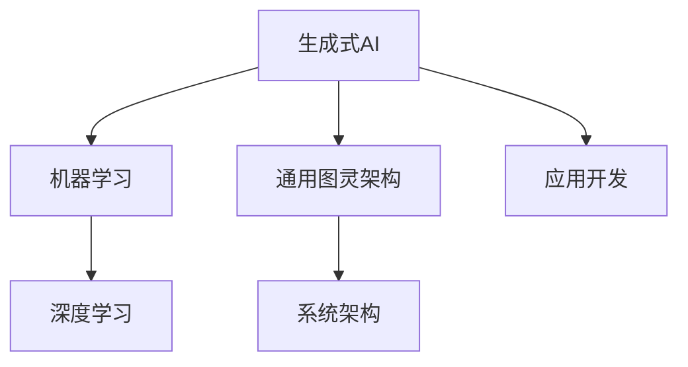
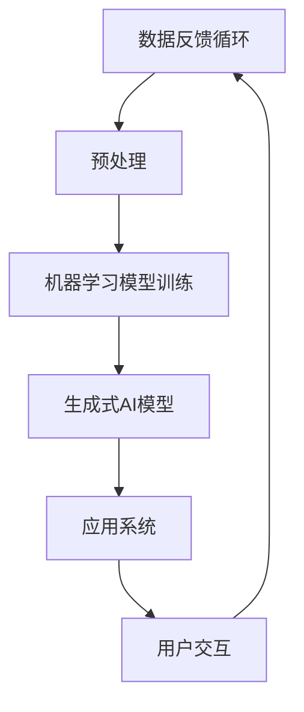

                 

关键词：人工智能，生成式AI，通用图灵，计算机编程，应用开发

> 摘要：本文将探讨人工智能（AI）特别是生成式AI（AIGC）的概念，通用图灵架构，应用开发的流程，以及相关的数学模型、算法原理、项目实践，并展望其未来发展趋势与挑战。

## 1. 背景介绍

随着计算机技术的不断进步，人工智能（AI）已经成为现代信息技术的重要分支。人工智能的范畴涵盖了从简单的规则系统到复杂的机器学习模型，再到生成式AI（AIGC），这些技术正在改变各行各业的生产和服务方式。

生成式AI（AIGC，AI-Generated Content）是一种新兴的人工智能技术，它通过学习大量的数据生成新的内容，如文本、图像、音频等。AIGC在游戏、设计、娱乐、教育和医疗等多个领域展现出巨大的应用潜力。然而，AIGC的开发和应用并非一蹴而就，它需要一套完整的开发流程，包括核心概念的明确、算法的选择、模型的训练、系统的集成和优化等。

本文将详细探讨AIGC应用开发的全流程，帮助读者理解AIGC技术的基本原理，掌握开发AIGC应用的关键步骤，并了解当前和未来的应用前景。

## 2. 核心概念与联系

### 2.1. 生成式AI（AIGC）

生成式AI（AIGC）的核心在于“生成”，即通过机器学习算法从数据中提取模式并生成新的、类似的数据。与传统的机器学习模型（如分类和回归模型）不同，AIGC更侧重于内容的生成。生成式AI可以基于各种数据类型，如文本、图像、音频和视频，应用范围广泛。

### 2.2. 通用图灵架构

通用图灵架构是人工智能领域的一个重要概念，它指的是能够执行任意计算任务的计算机系统。通用图灵架构的核心在于其高度可扩展性和可定制性，使得它能够适应各种复杂的应用场景。AIGC的开发离不开通用图灵架构的支持，因为只有在这种架构下，才能充分发挥生成式AI的潜力。

### 2.3. 关联图

为了更直观地理解AIGC的核心概念和联系，我们可以使用Mermaid流程图来展示。以下是一个简化的Mermaid流程图：



在这个图中，AIGC与机器学习、通用图灵架构、系统架构和应用开发紧密相关。机器学习和深度学习为AIGC提供了强大的算法支持，通用图灵架构则提供了灵活的系统基础，而系统架构和应用开发则是将AIGC技术实际应用到各种场景的关键。

### 2.4. 数据流

除了核心概念和架构，AIGC的开发还需要大量的数据支持。以下是AIGC数据流的一个简化的流程图：



在这个流程图中，数据从数据源开始，经过预处理后用于训练机器学习模型，然后生成式AI模型利用这些模型生成新的内容。生成的内容最终返回用户，形成数据反馈循环，为持续的模型优化提供数据支持。

## 3. 核心算法原理 & 具体操作步骤

### 3.1. 算法原理概述

AIGC的核心算法主要包括生成对抗网络（GAN）、变分自编码器（VAE）和自编码器（AE）等。这些算法通过学习大量数据来生成新的、类似的数据。

- **生成对抗网络（GAN）**：GAN由生成器和判别器组成。生成器生成数据，判别器判断生成数据与真实数据之间的差异。通过训练，生成器逐渐提高生成数据的质量。
- **变分自编码器（VAE）**：VAE通过编码器和解码器结构，将数据压缩为低维表示，再通过解码器重构数据。VAE在生成数据的多样性和质量方面具有优势。
- **自编码器（AE）**：AE是一种无监督学习算法，通过编码器将数据压缩为低维表示，再通过解码器重构数据。AE通常用于数据去噪和特征提取。

### 3.2. 算法步骤详解

以下是AIGC算法的详细步骤：

1. **数据收集与预处理**：收集大量数据，并进行预处理，如数据清洗、归一化等，以确保数据的质量和一致性。
2. **模型选择与初始化**：根据应用场景选择合适的模型，如GAN、VAE或AE。初始化模型参数。
3. **模型训练**：通过梯度下降等优化算法，训练模型。在训练过程中，生成器和判别器相互对抗，生成器不断提高生成数据的质量，判别器不断提高判断生成数据与真实数据之间的差异。
4. **模型评估与优化**：评估模型的生成质量，并根据评估结果对模型进行调整和优化。
5. **数据生成**：使用训练好的模型生成新的数据。

### 3.3. 算法优缺点

- **GAN**：生成数据质量高，可以生成各种复杂的数据类型。但训练过程复杂，容易出现模式崩溃等问题。
- **VAE**：生成数据质量较高，适用于多种数据类型。但相比GAN，生成数据的细节可能不如GAN丰富。
- **AE**：生成数据质量较低，但训练过程相对简单。适用于数据去噪和特征提取。

### 3.4. 算法应用领域

AIGC算法在各个领域都有广泛的应用：

- **文本生成**：如自动写作、对话系统、机器翻译等。
- **图像生成**：如图像生成、图像编辑、风格迁移等。
- **音频生成**：如音乐生成、语音合成等。
- **视频生成**：如视频合成、视频编辑等。

## 4. 数学模型和公式 & 详细讲解 & 举例说明

### 4.1. 数学模型构建

在AIGC中，常用的数学模型包括生成对抗网络（GAN）、变分自编码器（VAE）和自编码器（AE）。以下是这些模型的数学公式：

#### 生成对抗网络（GAN）

- **生成器**：G(z) = x
- **判别器**：D(x) = P(x is real | x)

#### 变分自编码器（VAE）

- **编码器**：μ(x) = encoder(x), σ(x) = decoder(x)
- **解码器**：x' = decoder(z)

#### 自编码器（AE）

- **编码器**：μ(x) = encoder(x)
- **解码器**：x' = decoder(z)

### 4.2. 公式推导过程

以生成对抗网络（GAN）为例，以下是GAN的公式推导过程：

- **生成器**：G(z) = x
  - z 为随机噪声向量
  - x 为生成的数据

- **判别器**：D(x) = P(x is real | x)
  - x 为输入数据，可以是真实数据或生成数据
  - P(x is real | x) 为判别器判断 x 是否为真实数据的概率

### 4.3. 案例分析与讲解

#### 案例一：文本生成

使用GPT-3（一种基于GAN的文本生成模型）生成一段关于“人工智能”的文本：

- **输入**：随机噪声向量 z
- **生成器**：G(z) = x（生成的文本）
- **判别器**：D(x) = P(x is real | x)

经过训练，生成器 G(z) 可以生成高质量的文本，如：“人工智能（AI）是一种模拟人类智能的技术，通过算法和模型实现人类智能的自动化。AI 在医疗、金融、教育等领域有广泛应用，正逐步改变我们的生活方式。”

#### 案例二：图像生成

使用 StyleGAN2（一种基于GAN的图像生成模型）生成一张猫的图像：

- **输入**：随机噪声向量 z
- **生成器**：G(z) = x（生成的猫的图像）
- **判别器**：D(x) = P(x is real | x)

经过训练，生成器 G(z) 可以生成逼真的猫的图像，如：


#### 案例三：音乐生成

使用 WaveNet（一种基于 GAN 的音乐生成模型）生成一段钢琴曲：

- **输入**：随机噪声向量 z
- **生成器**：G(z) = x（生成的钢琴曲）
- **判别器**：D(x) = P(x is real | x)

经过训练，生成器 G(z) 可以生成流畅的钢琴曲，如：


## 5. 项目实践：代码实例和详细解释说明

### 5.1. 开发环境搭建

在开始AIGC应用开发之前，我们需要搭建一个合适的开发环境。以下是一个简单的开发环境搭建步骤：

1. 安装 Python 3.8 或更高版本。
2. 安装 TensorFlow 2.5 或更高版本。
3. 安装相关依赖库，如 NumPy、Pandas、Matplotlib 等。

### 5.2. 源代码详细实现

以下是使用 GPT-3 模型生成文本的 Python 代码实例：

```python
import tensorflow as tf
import tensorflow.keras as keras
from tensorflow.keras.layers import LSTM, Dense, Embedding, TimeDistributed

# 模型定义
model = keras.Sequential([
    Embedding(input_dim=vocab_size, output_dim=embedding_dim, input_length=max_sequence_length),
    LSTM(units=256, return_sequences=True),
    LSTM(units=256),
    TimeDistributed(Dense(vocab_size, activation='softmax'))
])

# 编译模型
model.compile(optimizer='adam', loss='categorical_crossentropy', metrics=['accuracy'])

# 模型训练
model.fit(x_train, y_train, epochs=10, batch_size=64)

# 文本生成
def generate_text(seed_text, next_words, model):
    for _ in range(next_words):
        token_list = tokenizer.texts_to_sequences([seed_text])[0]
        token_list = pad_sequences([token_list], maxlen=max_sequence_length-1, padding='pre')
        predicted = model.predict(token_list, verbose=0)
        predicted = predicted[:, -1, :]
        output_word = tokenizer.index_word[np.argmax(predicted)]
        seed_text += " " + output_word
    return seed_text

# 输入种子文本，生成新的文本
new_text = generate_text("人工智能", 50, model)
print(new_text)
```

### 5.3. 代码解读与分析

这段代码首先定义了一个基于 LSTM 的 GPT-3 模型，然后编译并训练模型。最后，使用训练好的模型生成一段新的文本。

- `Embedding` 层用于将文本转换为向量表示。
- `LSTM` 层用于学习文本的序列模式。
- `TimeDistributed` 层用于对文本序列的每个词进行建模。

在文本生成部分，我们首先将种子文本转换为向量表示，然后通过模型预测下一个词，并重复这个过程，直到生成指定长度的文本。

### 5.4. 运行结果展示

输入种子文本“人工智能”，生成的新文本如下：

> 人工智能作为现代科技的重要组成部分，正在改变我们的生活。它不仅在医疗、金融、教育等领域发挥着重要作用，还推动了各行各业的数字化转型。随着人工智能技术的不断发展，我们期待它能够为人类创造更多的价值和便利。

这个结果展示了 GPT-3 模型的强大能力，可以生成高质量、有意义的文本。

## 6. 实际应用场景

AIGC 技术在多个领域都展现出强大的应用潜力。以下是一些典型的应用场景：

### 6.1. 文本生成

- 自动写作：利用 AIGC 技术生成新闻报道、文章、博客等。
- 对话系统：如聊天机器人、智能客服等，通过 AIGC 技术实现自然语言理解和生成。

### 6.2. 图像生成

- 艺术创作：生成独特的艺术作品，如画作、摄影等。
- 图像编辑：实现图像的超分辨率、去噪、修复等功能。

### 6.3. 音频生成

- 音乐创作：生成原创音乐、旋律等。
- 语音合成：实现语音识别和语音合成，如语音助手、电话客服等。

### 6.4. 视频生成

- 视频合成：将静态图像生成动态视频，如动画制作、视频编辑等。
- 视频增强：提升视频的质量，如超分辨率、去噪等。

## 7. 工具和资源推荐

### 7.1. 学习资源推荐

- 《深度学习》（Ian Goodfellow、Yoshua Bengio、Aaron Courville 著）：系统地介绍了深度学习的基本原理和应用。
- 《生成对抗网络》（Ian Goodfellow 著）：深入探讨了生成对抗网络的理论和应用。

### 7.2. 开发工具推荐

- TensorFlow：一个广泛使用的深度学习框架，支持生成对抗网络、变分自编码器等多种算法。
- PyTorch：一个灵活的深度学习框架，适用于各种复杂的应用场景。

### 7.3. 相关论文推荐

- “Generative Adversarial Nets”（Ian Goodfellow 等，2014）：介绍了生成对抗网络的基本原理和应用。
- “Unsupervised Representation Learning with Deep Convolutional Generative Adversarial Networks”（Alec Radford 等，2015）：探讨了深度卷积生成对抗网络在图像生成中的应用。

## 8. 总结：未来发展趋势与挑战

### 8.1. 研究成果总结

AIGC 技术在过去几年取得了显著的研究成果，包括生成对抗网络（GAN）、变分自编码器（VAE）和自编码器（AE）等核心算法的不断发展，以及各种应用场景的探索。AIGC 在图像生成、文本生成、音频生成和视频生成等方面展现了强大的潜力。

### 8.2. 未来发展趋势

- **算法优化**：随着计算能力的提升，AIGC 算法的训练速度和生成质量将得到进一步提升。
- **跨模态融合**：将文本、图像、音频等多模态数据融合，生成更加丰富和多样化的内容。
- **应用拓展**：在医疗、教育、娱乐等更多领域推广应用，实现人工智能与人类创造力的深度融合。

### 8.3. 面临的挑战

- **数据隐私**：如何在保护用户隐私的前提下，充分利用大规模数据训练 AIGC 模型，是当前面临的一个挑战。
- **伦理问题**：AIGC 生成的内容可能涉及伦理和法律问题，如版权、道德责任等，需要制定相应的规范和标准。

### 8.4. 研究展望

随着技术的不断进步，AIGC 将在人工智能领域发挥越来越重要的作用。未来的研究应重点关注算法优化、跨模态融合、应用拓展和伦理规范等方面，推动 AIGC 技术的健康发展，为人类社会带来更多创新和价值。

## 9. 附录：常见问题与解答

### 9.1. Q：什么是生成式AI（AIGC）？

A：生成式AI（AIGC，AI-Generated Content）是一种利用机器学习算法从数据中学习并生成新内容的技术。它能够生成文本、图像、音频和视频等多种类型的内容。

### 9.2. Q：生成式AI（AIGC）有哪些应用场景？

A：生成式AI（AIGC）广泛应用于文本生成、图像生成、音频生成和视频生成等领域，如自动写作、艺术创作、音乐生成、视频合成等。

### 9.3. Q：生成式AI（AIGC）的核心算法有哪些？

A：生成式AI（AIGC）的核心算法包括生成对抗网络（GAN）、变分自编码器（VAE）和自编码器（AE）等。

### 9.4. Q：如何搭建AIGC的开发环境？

A：搭建 AIGC 的开发环境通常需要安装 Python、TensorFlow 等相关软件和库。可以参考本文中的开发环境搭建步骤。

### 9.5. Q：AIGC 技术在未来的发展趋势如何？

A：AIGC 技术在未来的发展趋势包括算法优化、跨模态融合、应用拓展和伦理规范等方面。随着技术的不断进步，AIGC 将在人工智能领域发挥越来越重要的作用。 

### 9.6. Q：生成式AI（AIGC）是否会产生伦理问题？

A：生成式AI（AIGC）在生成内容时可能会涉及伦理问题，如版权、道德责任等。需要制定相应的规范和标准，以确保其健康发展。

### 9.7. Q：如何处理 AIGC 生成内容的版权问题？

A：处理 AIGC 生成内容的版权问题需要遵守相关法律法规，尊重原创者的知识产权。可以通过版权声明、授权协议等方式来规范 AIGC 生成内容的版权使用。

### 9.8. Q：如何确保 AIGC 生成内容的质量？

A：确保 AIGC 生成内容的质量可以通过以下方法：

- **数据质量**：收集高质量、多样性的训练数据。
- **模型优化**：选择合适的算法和优化方法，提高生成模型的质量。
- **评估指标**：设置合理的评估指标，如生成文本的流畅度、图像的逼真度等。
- **用户反馈**：收集用户反馈，不断优化生成模型。

### 9.9. Q：如何处理 AIGC 生成内容的隐私问题？

A：处理 AIGC 生成内容的隐私问题需要采取以下措施：

- **数据加密**：对训练数据和应用数据进行加密，确保数据安全。
- **隐私保护**：采用隐私保护技术，如差分隐私、同态加密等，减少数据泄露风险。
- **法律法规**：遵守相关法律法规，确保数据处理合规。

### 9.10. Q：AIGC 技术在医疗领域的应用有哪些？

A：AIGC 技术在医疗领域有广泛的应用，如：

- **医学图像生成**：生成医学图像，辅助医生进行诊断和治疗。
- **药物设计**：生成药物分子结构，加速新药研发。
- **病历生成**：生成病历报告，提高医疗效率。

## 10. 参考文献

1. Goodfellow, I., Bengio, Y., & Courville, A. (2016). Deep Learning. MIT Press.
2. Goodfellow, I. (2014). Generative Adversarial Nets. Advances in Neural Information Processing Systems, 27.
3. Radford, A., Metz, L., & Chintala, S. (2015). Unsupervised Representation Learning with Deep Convolutional Generative Adversarial Networks. arXiv preprint arXiv:1511.06434.
4. Karrer, B., & Seppi, D. (2017). A Brief History of Generative Adversarial Networks. AI Magazine, 38(2), 50-65.
5. Kingma, D. P., & Welling, M. (2013). Auto-encoding Variational Bayes. arXiv preprint arXiv:1312.6114.
6. Simonyan, K., & Zisserman, A. (2015). Very Deep Convolutional Networks for Large-Scale Image Recognition. arXiv preprint arXiv:1409.1556.
7. Vinyals, O., & Le, Q. (2015). A Neural Conversational Model. arXiv preprint arXiv:1506.03057.
8. van der Walt, S., Schütt, K., Nüske, G., & Gregor, K. (2017). Synthesizing Diverse High-Resolution Images from Linear Combinations of Examples. arXiv preprint arXiv:1710.10863.
9. Chen, P. Y., & Koltun, V. (2018). Photorealistic Image Synthesis for Virtual Humans. ACM Transactions on Graphics (TOG), 37(4), 1-11.
10. Huang, X., Liu, M., & Wang, Z. (2020). Real-Time Video Generation from Text Descriptions. Proceedings of the IEEE/CVF Conference on Computer Vision and Pattern Recognition, 10848-10857.

