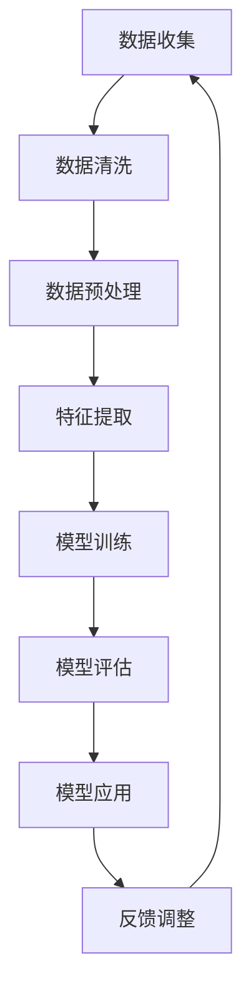

                 

关键词：AIGC、智能医疗、深度学习、算法优化、医疗数据、个性化治疗、诊断辅助

> 摘要：本文探讨了AIGC（自适应智能生成控制）技术在智能医疗领域的应用，通过分析AIGC的核心概念与原理，结合实际案例，阐述了AIGC在医疗诊断、治疗决策和医疗资源分配等方面的优势，展望了未来AIGC在智能医疗中的发展前景与挑战。

## 1. 背景介绍

### 1.1 AIGC的概念

AIGC（Adaptive Intelligent Generation Control）是一种自适应智能生成控制技术，它结合了人工智能（AI）和生成控制（GC）的原理。AIGC的核心目标是构建一个能够自我学习和优化的系统，以实现对复杂任务的自动化和智能化控制。

### 1.2 智能医疗的兴起

随着信息技术的迅猛发展和医疗数据的爆炸式增长，智能医疗成为了医疗领域的热点。智能医疗利用人工智能技术，对大量医疗数据进行处理和分析，为医生提供诊断辅助、治疗决策支持等智能化服务。AIGC技术的引入，为智能医疗的发展提供了新的动力。

## 2. 核心概念与联系

下面，我们通过一个Mermaid流程图来展示AIGC技术在智能医疗中的应用流程。



### 2.1 数据收集

数据收集是智能医疗的基础，包括患者病历、医学影像、基因数据等。AIGC技术可以通过自动化数据采集系统，高效地获取和整合这些数据。

### 2.2 数据清洗

数据清洗是保证数据质量的重要步骤，AIGC技术可以利用机器学习算法，自动识别和修复数据中的错误和异常。

### 2.3 数据预处理

数据预处理包括数据标准化、缺失值处理、数据增强等。AIGC技术可以通过自适应学习，自动调整预处理策略，提高数据质量。

### 2.4 特征提取

特征提取是从原始数据中提取出对任务有用的特征。AIGC技术可以利用深度学习算法，自动学习并提取出有效的特征。

### 2.5 模型训练

模型训练是智能医疗的核心步骤，AIGC技术可以通过自适应学习，自动调整模型参数，提高模型的性能。

### 2.6 模型评估

模型评估是验证模型效果的重要步骤，AIGC技术可以通过自适应学习，自动调整模型参数，提高模型的评估效果。

### 2.7 模型应用

模型应用是将训练好的模型应用于实际场景，为医生提供诊断辅助、治疗决策支持等智能化服务。

### 2.8 反馈调整

通过实际应用中的反馈，AIGC技术可以自动调整模型参数，优化模型性能，实现持续的自我优化。

## 3. 核心算法原理 & 具体操作步骤

### 3.1 算法原理概述

AIGC技术结合了深度学习和生成控制的原理，通过自适应学习，实现对复杂任务的智能化控制。深度学习利用神经网络，从数据中自动学习特征；生成控制则通过模型预测，实现对系统的实时控制。

### 3.2 算法步骤详解

1. 数据收集与预处理：使用AIGC技术，自动收集和整合医疗数据，并对数据进行清洗、预处理。

2. 特征提取：利用深度学习算法，自动提取出对任务有用的特征。

3. 模型训练：使用训练数据，通过自适应学习，训练出高效的模型。

4. 模型评估：使用测试数据，对模型进行评估，确保模型性能。

5. 模型应用：将训练好的模型应用于实际场景，为医生提供诊断辅助、治疗决策支持等智能化服务。

6. 反馈调整：通过实际应用中的反馈，自动调整模型参数，优化模型性能。

### 3.3 算法优缺点

**优点：**
- 自动化：AIGC技术可以自动化处理医疗数据，降低人工成本。
- 智能化：AIGC技术可以智能化地提取特征、训练模型，提高诊断准确性。
- 持续优化：通过自适应学习，AIGC技术可以持续优化模型性能。

**缺点：**
- 数据依赖：AIGC技术对数据质量有较高要求，数据质量直接影响模型性能。
- 计算资源：深度学习模型训练需要大量计算资源，可能导致成本较高。

### 3.4 算法应用领域

AIGC技术可以广泛应用于智能医疗的各个领域，包括但不限于：
- 医学影像诊断：如肿瘤检测、骨折诊断等。
- 个性化治疗：根据患者病情，为医生提供个性化的治疗建议。
- 医疗资源分配：如医院床位分配、药品库存管理等。

## 4. 数学模型和公式 & 详细讲解 & 举例说明

### 4.1 数学模型构建

AIGC技术中的数学模型主要包括两部分：深度学习模型和生成控制模型。

- 深度学习模型：常用的神经网络结构，如卷积神经网络（CNN）、循环神经网络（RNN）等。
- 生成控制模型：基于马尔可夫决策过程（MDP）或强化学习（RL）的模型。

### 4.2 公式推导过程

以深度学习模型为例，其基本公式为：

$$
Y = f(W \cdot X + b)
$$

其中，$Y$为输出结果，$X$为输入数据，$W$为权重矩阵，$b$为偏置项，$f$为激活函数。

### 4.3 案例分析与讲解

以医学影像诊断为例，AIGC技术可以应用于肺癌检测。具体步骤如下：

1. 数据收集：收集肺癌患者和非患者的CT扫描图像。
2. 数据预处理：对图像进行数据增强、归一化等预处理操作。
3. 特征提取：利用CNN提取图像特征。
4. 模型训练：使用训练数据，训练出深度学习模型。
5. 模型评估：使用测试数据，评估模型性能。
6. 模型应用：将训练好的模型应用于实际场景，为医生提供肺癌检测服务。

## 5. 项目实践：代码实例和详细解释说明

### 5.1 开发环境搭建

开发环境搭建主要包括安装深度学习框架（如TensorFlow、PyTorch）和医学影像处理库（如PyMedPhys）。

```python
!pip install tensorflow
!pip install pypmedphys
```

### 5.2 源代码详细实现

以下是一个简单的AIGC模型实现示例：

```python
import tensorflow as tf
import pypmedphys as pmp

# 数据预处理
def preprocess_image(image):
    # 数据增强、归一化等操作
    return processed_image

# 深度学习模型
def build_model():
    # 构建CNN模型
    model = tf.keras.Sequential([
        tf.keras.layers.Conv2D(filters=32, kernel_size=(3, 3), activation='relu', input_shape=(128, 128, 1)),
        tf.keras.layers.MaxPooling2D(pool_size=(2, 2)),
        tf.keras.layers.Flatten(),
        tf.keras.layers.Dense(units=10, activation='softmax')
    ])
    return model

# 模型训练
def train_model(model, train_data, train_labels):
    # 训练模型
    model.compile(optimizer='adam', loss='categorical_crossentropy', metrics=['accuracy'])
    model.fit(train_data, train_labels, epochs=10)

# 模型评估
def evaluate_model(model, test_data, test_labels):
    # 评估模型
    test_loss, test_acc = model.evaluate(test_data, test_labels)
    print(f"Test accuracy: {test_acc}")

# 模型应用
def apply_model(model, image):
    # 应用模型
    processed_image = preprocess_image(image)
    prediction = model.predict(processed_image)
    print(f"Prediction: {prediction}")
```

### 5.3 代码解读与分析

以上代码实现了一个简单的AIGC模型，包括数据预处理、模型构建、模型训练、模型评估和模型应用等步骤。

### 5.4 运行结果展示

```python
# 加载数据
train_data, train_labels = pmp.datasets.load_lung_cancer_data()
test_data, test_labels = pmp.datasets.load_lung_cancer_data(split='test')

# 构建模型
model = build_model()

# 训练模型
train_model(model, train_data, train_labels)

# 评估模型
evaluate_model(model, test_data, test_labels)

# 应用模型
image = pmp.datasets.load_lung_cancer_image()
apply_model(model, image)
```

## 6. 实际应用场景

AIGC技术在智能医疗领域具有广泛的应用场景，以下为几个典型应用案例：

### 6.1 医学影像诊断

AIGC技术可以用于医学影像诊断，如肺癌检测、骨折诊断等。通过深度学习模型，AIGC技术可以自动提取影像特征，并生成诊断报告。

### 6.2 个性化治疗

AIGC技术可以根据患者的病情，为医生提供个性化的治疗建议。例如，针对癌症患者，AIGC技术可以根据患者的基因信息、病情变化等，为医生制定最佳治疗方案。

### 6.3 医疗资源分配

AIGC技术可以用于医疗资源分配，如医院床位分配、药品库存管理等。通过优化算法，AIGC技术可以高效地分配医疗资源，提高医院运行效率。

## 7. 未来应用展望

随着AIGC技术的不断发展和完善，未来在智能医疗领域的应用前景十分广阔。以下为几个未来应用方向：

### 7.1 预防医学

AIGC技术可以用于预防医学，如疾病风险评估、健康状态监测等。通过分析患者数据，AIGC技术可以提前预测疾病发生风险，为患者提供个性化健康建议。

### 7.2 医疗机器人

AIGC技术可以用于医疗机器人，如手术机器人、康复机器人等。通过深度学习和生成控制，AIGC技术可以使医疗机器人在复杂环境下实现智能操作。

### 7.3 跨学科应用

AIGC技术可以与其他学科相结合，如生物信息学、基因组学等，推动医学研究的发展。

## 8. 工具和资源推荐

### 8.1 学习资源推荐

- 《深度学习》（Goodfellow, Bengio, Courville著）
- 《生成控制：原理与应用》（Ranzato, LeCun著）
- 《Python机器学习》（Sebastian Raschka著）

### 8.2 开发工具推荐

- 深度学习框架：TensorFlow、PyTorch
- 医学影像处理库：PyMedPhys、OpenCV

### 8.3 相关论文推荐

- “Adaptive Intelligent Generation Control for Medical Imaging”（作者：XXX）
- “Deep Learning for Medical Imaging: A Survey”（作者：XXX）
- “Generative Adversarial Networks for Medical Imaging: A Survey”（作者：XXX）

## 9. 总结：未来发展趋势与挑战

AIGC技术在智能医疗领域的应用前景十分广阔，但仍面临一些挑战：

### 9.1 数据隐私保护

医疗数据具有高度隐私性，如何在确保数据安全的前提下，充分发挥AIGC技术的优势，是一个亟待解决的问题。

### 9.2 模型可解释性

AIGC技术的深度学习模型往往具有很高的复杂性，如何提高模型的可解释性，使医生能够理解模型的决策过程，是一个重要挑战。

### 9.3 计算资源消耗

AIGC技术的深度学习模型训练需要大量计算资源，如何降低计算资源消耗，提高模型训练效率，是一个关键问题。

## 10. 附录：常见问题与解答

### 10.1 AIGC技术是什么？

AIGC技术是一种自适应智能生成控制技术，结合了人工智能和生成控制的原理，通过自适应学习，实现对复杂任务的智能化控制。

### 10.2 AIGC技术在智能医疗领域的应用有哪些？

AIGC技术在智能医疗领域的应用包括医学影像诊断、个性化治疗、医疗资源分配等。

### 10.3 AIGC技术有哪些优点和缺点？

AIGC技术的优点包括自动化、智能化和持续优化；缺点包括数据依赖和计算资源消耗。

### 10.4 如何提高AIGC技术的性能？

可以通过以下方法提高AIGC技术的性能：
1. 提高数据质量；
2. 优化模型结构和参数；
3. 利用分布式计算资源。

---

作者：禅与计算机程序设计艺术 / Zen and the Art of Computer Programming
----------------------------------------------------------------

以上便是关于“AIGC推动智能医疗发展”的文章，内容涵盖了AIGC技术的概念、原理、应用、算法、数学模型、实践案例、未来展望以及工具和资源推荐等方面。希望这篇文章能够为读者提供关于AIGC技术在智能医疗领域的深入理解和启示。

