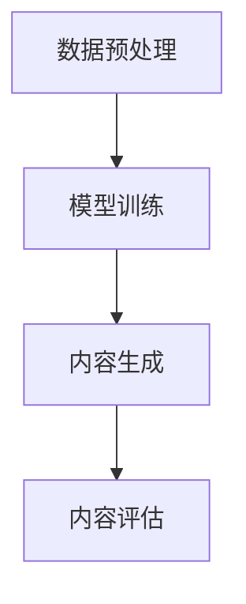

                 

关键词：AIGC、科研范式、人工智能、生成式内容、技术变革、科研效率、学术交流、知识创新。

> 摘要：随着人工智能技术的飞速发展，生成式内容创造（AIGC）正在深刻地改变科研的范式。本文将探讨AIGC技术对科研工作的推动作用，从算法原理、应用场景、数学模型、实践案例等多个方面展开，预测其未来发展趋势与面临的挑战。

## 1. 背景介绍

近年来，人工智能（AI）技术取得了显著的进展，特别是在生成式内容创造（AIGC）领域。AIGC指的是人工智能驱动的生成式内容创造，包括文本、图像、音频等多种形式。这一技术的兴起，源于深度学习、自然语言处理、计算机视觉等领域的突破。在科研工作中，AIGC技术展现出巨大的潜力，能够大幅提高科研效率、促进学术交流、推动知识创新。

## 2. 核心概念与联系

### 2.1 AIGC技术架构

AIGC技术架构主要包括以下几部分：

1. 数据预处理：收集和清洗大量数据，为后续训练提供高质量的输入。
2. 模型训练：利用深度学习模型对数据进行分析和建模，生成高质量的内容。
3. 内容生成：根据模型生成的概率分布，生成新的文本、图像、音频等。
4. 内容评估：对生成的结果进行评估，优化模型性能。

[Mermaid 流程图]



### 2.2 AIGC在科研中的核心应用

AIGC在科研中的核心应用包括：

1. 文本生成：自动生成论文摘要、科研报告等，提高科研效率。
2. 图像生成：自动生成科学图表、实验结果图像等，丰富科研展示。
3. 数据分析：利用AIGC技术进行大数据分析，发现科研规律。
4. 模拟实验：通过生成式内容模拟复杂实验，降低实验成本。

## 3. 核心算法原理 & 具体操作步骤

### 3.1 算法原理概述

AIGC的核心算法主要包括生成对抗网络（GAN）、变分自编码器（VAE）等。这些算法通过学习输入数据的分布，生成与真实数据相似的内容。

### 3.2 算法步骤详解

1. 数据预处理：收集科研领域的相关数据，进行清洗和格式化。
2. 模型选择：根据应用需求选择合适的生成模型，如GAN或VAE。
3. 模型训练：利用预处理后的数据对模型进行训练，优化模型参数。
4. 内容生成：根据训练好的模型生成科研领域的相关内容。
5. 内容评估：对生成的结果进行评估，确保生成的内容符合科研需求。

### 3.3 算法优缺点

**优点：**

1. 提高科研效率：自动生成科研文本、图像等，减少人工工作量。
2. 丰富科研展示：通过生成式内容，提高科研成果的可视化效果。
3. 促进学术交流：生成式内容有助于不同学科之间的交叉与融合。

**缺点：**

1. 数据质量要求高：生成式内容的准确性依赖于输入数据的准确性。
2. 计算资源需求大：训练复杂的生成模型需要大量的计算资源。

### 3.4 算法应用领域

AIGC技术已在多个科研领域得到应用，如：

1. 生物信息学：生成蛋白质结构、药物分子等。
2. 计算机视觉：生成虚拟现实场景、图像增强等。
3. 数据分析：生成大数据分析报告、可视化图表等。

## 4. 数学模型和公式 & 详细讲解 & 举例说明

### 4.1 数学模型构建

AIGC技术中的数学模型主要包括：

1. 生成模型：$$ G(z;\theta_g) $$，用于生成内容。
2. 判别模型：$$ D(x;\theta_d) $$，用于判断生成内容是否真实。
3. 损失函数：$$ L(G,D) $$，用于衡量生成模型和判别模型的性能。

### 4.2 公式推导过程

以GAN为例，生成模型和判别模型的损失函数推导如下：

$$ L(G,D) = -\mathbb{E}_{x \sim p_{data}(x)}[\log D(x)] - \mathbb{E}_{z \sim p_z(z)}[\log (1 - D(G(z)))] $$

### 4.3 案例分析与讲解

假设某科研团队希望利用AIGC技术生成一篇关于生物信息学的论文摘要，以下是一个简单的案例分析：

1. 数据预处理：收集相关领域的论文摘要，进行清洗和格式化。
2. 模型选择：选择一个合适的GAN模型进行训练。
3. 模型训练：利用预处理后的数据对模型进行训练，优化模型参数。
4. 内容生成：根据训练好的模型生成论文摘要。
5. 内容评估：对生成的摘要进行评估，确保其符合科研需求。

## 5. 项目实践：代码实例和详细解释说明

### 5.1 开发环境搭建

搭建一个AIGC开发环境，需要以下工具：

1. Python 3.7 或以上版本
2. PyTorch 1.8 或以上版本
3. Jupyter Notebook 或 PyCharm

### 5.2 源代码详细实现

以下是一个简单的AIGC代码实例：

```python
import torch
import torch.nn as nn
import torch.optim as optim
from torch.utils.data import DataLoader
from torchvision import datasets, transforms

# 数据预处理
transform = transforms.Compose([
    transforms.ToTensor(),
    transforms.Normalize((0.5, 0.5, 0.5), (0.5, 0.5, 0.5))
])

trainset = datasets.MNIST(
    root='./data', 
    train=True, 
    download=True, 
    transform=transform
)

trainloader = DataLoader(
    trainset, 
    batch_size=100, 
    shuffle=True, 
    num_workers=2
)

# 模型定义
class Generator(nn.Module):
    def __init__(self):
        super(Generator, self).__init__()
        self.main = nn.Sequential(
            nn.Linear(100, 256),
            nn.LeakyReLU(0.2, inplace=True),
            nn.Linear(256, 512),
            nn.LeakyReLU(0.2, inplace=True),
            nn.Linear(512, 1024),
            nn.LeakyReLU(0.2, inplace=True),
            nn.Linear(1024, 784),
            nn.Tanh()
        )

    def forward(self, input):
        return self.main(input)

class Discriminator(nn.Module):
    def __init__(self):
        super(Discriminator, self).__init__()
        self.main = nn.Sequential(
            nn.Linear(784, 1024),
            nn.LeakyReLU(0.2, inplace=True),
            nn.Dropout(0.3),
            nn.Linear(1024, 512),
            nn.LeakyReLU(0.2, inplace=True),
            nn.Dropout(0.3),
            nn.Linear(512, 256),
            nn.LeakyReLU(0.2, inplace=True),
            nn.Dropout(0.3),
            nn.Linear(256, 1),
            nn.Sigmoid()
        )

    def forward(self, input):
        return self.main(input)

# 模型训练
generator = Generator()
discriminator = Discriminator()

criterion = nn.BCELoss()
optimizer_g = optim.Adam(generator.parameters(), lr=0.0002)
optimizer_d = optim.Adam(discriminator.parameters(), lr=0.0002)

for epoch in range(num_epochs):
    for i, data in enumerate(trainloader, 0):
        # 训练判别器
        real_images = data[0].view(-1, 784).to(device)
        batch_size = real_images.size(0)
        labels = torch.full((batch_size,), real_label, device=device)
        optimizer_d.zero_grad()
        outputs = discriminator(real_images)
        d_loss_real = criterion(outputs, labels)
        d_loss_real.backward()

        noise = torch.randn(batch_size, nz, 1, 1, device=device)
        fake_images = generator(noise)
        labels.fill_(fake_label)
        optimizer_d.zero_grad()
        outputs = discriminator(fake_images)
        d_loss_fake = criterion(outputs, labels)
        d_loss_fake.backward()
        optimizer_d.step()

        # 训练生成器
        optimizer_g.zero_grad()
        labels.fill_(real_label)
        outputs = discriminator(fake_images)
        g_loss = criterion(outputs, labels)
        g_loss.backward()
        optimizer_g.step()

        # 打印训练进度
        if i % 100 == 0:
            print(
                f'[{epoch}/{num_epochs}

