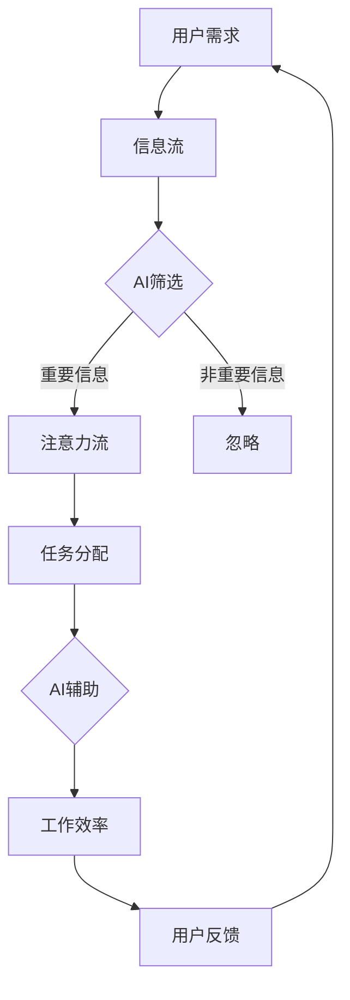

                 

关键词：人工智能，注意力流，未来工作，技能发展，注意力管理

> 摘要：本文旨在探讨人工智能对人类注意力流的影响，以及这种影响如何改变未来的工作和技能需求。通过分析注意力流的原理和人工智能的核心算法，本文提出了注意力流管理的方法和工具，旨在帮助人们更好地应对未来工作中的挑战。

## 1. 背景介绍

在过去的几十年里，人工智能（AI）技术取得了飞速的发展。从早期的规则系统到现代的深度学习，AI在各个领域都展现出了巨大的潜力。然而，随着AI技术的不断进步，人类的工作和生活方式也发生了深刻的变化。其中一个显著的变化就是人们对注意力流的管理需求不断增加。

注意力流是指人们在执行任务过程中，对信息的关注程度和分配方式。在传统的工作环境中，人们往往需要高度集中注意力来完成复杂的工作。然而，在当今的信息化社会，人们面临着海量的信息和任务，如何有效地管理和分配注意力成为了一个重要的问题。

本文将围绕以下几个方面展开讨论：

1. **AI与注意力流的联系**：探讨AI技术如何影响人类的注意力流。
2. **注意力流管理的核心概念**：介绍注意力流管理的相关理论和技术。
3. **注意力流管理的方法和工具**：提出具体的方法和工具，帮助人们更好地管理注意力流。
4. **未来工作的挑战与机会**：分析人工智能时代下，未来工作的趋势和挑战，以及如何应对这些挑战。

## 2. 核心概念与联系

### 2.1. 注意力流的概念

注意力流是指人们在执行任务过程中，对信息的关注程度和分配方式。它不仅涉及对信息的选择性关注，还包括对任务的优先级排序和分配。在传统的工作环境中，注意力流通常是线性的，即人们依次处理多个任务。然而，在当今的信息化社会，人们面临着海量的信息和任务，注意力流的分配变得更加复杂。

### 2.2. AI与注意力流的联系

AI技术对人类注意力流的影响主要体现在以下几个方面：

1. **信息筛选与过滤**：AI可以通过算法对大量信息进行筛选和过滤，帮助人们关注重要的信息。例如，电子邮件过滤、社交媒体推荐等。
2. **自动化与辅助**：AI可以通过自动化和辅助功能，减轻人们的工作负担，从而减少对注意力的需求。例如，自动驾驶、智能家居等。
3. **任务分配与优化**：AI可以通过分析人们的注意力流和工作效率，为人们分配最合适的任务，提高工作效果。

### 2.3. Mermaid 流程图

下面是一个简单的Mermaid流程图，展示了AI与注意力流之间的联系：



## 3. 核心算法原理 & 具体操作步骤

### 3.1. 算法原理概述

在注意力流管理中，核心算法通常基于以下原理：

1. **信息重要性评估**：通过对信息进行重要性评估，确定哪些信息需要优先关注。
2. **任务优先级排序**：根据任务的紧急程度和重要性，对任务进行排序，以优化工作流程。
3. **注意力资源分配**：根据任务的复杂程度和所需的注意力资源，合理分配注意力。

### 3.2. 算法步骤详解

1. **信息重要性评估**：
   - 收集用户的历史行为数据，如浏览记录、购买记录等。
   - 使用机器学习算法，对用户的行为数据进行训练，建立信息重要性评估模型。
   - 对新接收到的信息进行评估，根据评估结果调整注意力流的分配。

2. **任务优先级排序**：
   - 收集用户的任务数据，如任务名称、截止日期、任务复杂程度等。
   - 使用优先级排序算法，如A*算法、遗传算法等，对任务进行排序。
   - 根据排序结果，确定任务的执行顺序。

3. **注意力资源分配**：
   - 根据任务的重要性和复杂程度，计算所需的注意力资源。
   - 使用资源分配算法，如贪心算法、动态规划等，为每个任务分配适当的注意力资源。
   - 监控任务的执行进度，根据实际情况调整注意力资源的分配。

### 3.3. 算法优缺点

1. **优点**：
   - **高效性**：通过自动化和算法优化，提高了信息筛选和任务分配的效率。
   - **个性化**：根据用户的历史行为和需求，提供了个性化的注意力流管理方案。

2. **缺点**：
   - **依赖数据质量**：算法的性能很大程度上取决于用户行为数据的质量和完整性。
   - **算法复杂性**：算法的实现和优化需要较高的技术门槛。

### 3.4. 算法应用领域

1. **企业级应用**：如企业内部信息管理系统、任务管理系统等。
2. **个人级应用**：如日程管理工具、待办事项列表等。
3. **教育领域**：如学习进度跟踪、学习资源推荐等。

## 4. 数学模型和公式 & 详细讲解 & 举例说明

### 4.1. 数学模型构建

在注意力流管理中，常用的数学模型包括：

1. **信息重要性评估模型**：通常使用概率模型或贝叶斯网络来描述信息的重要性和相关性。
2. **任务优先级排序模型**：可以使用线性规划或整数规划来优化任务排序。
3. **注意力资源分配模型**：可以使用线性规划或动态规划来优化注意力资源的分配。

### 4.2. 公式推导过程

假设我们有一个包含N个任务的集合T，每个任务Ti都有相应的属性，如任务复杂度C(i)、截止日期D(i)、优先级P(i)等。我们需要根据这些属性对任务进行排序和分配注意力资源。

1. **信息重要性评估模型**：

   假设信息的重要性可以用一个概率P(i)来表示，其中P(i) = f(C(i), D(i), P(i))。函数f可以根据历史数据进行训练。

   $$P(i) = \frac{C(i) \cdot D(i) \cdot P(i)}{\sum_{j=1}^{N} C(j) \cdot D(j) \cdot P(j)}$$

2. **任务优先级排序模型**：

   假设任务的优先级可以用一个权重w(i)来表示，其中w(i) = f(C(i), D(i), P(i))。函数f可以根据历史数据进行训练。

   $$w(i) = C(i) + D(i) + P(i)$$

3. **注意力资源分配模型**：

   假设每个任务Ti所需的注意力资源为R(i)，我们需要根据任务的权重w(i)和总注意力资源R_total进行资源分配。

   $$R(i) = \frac{w(i) \cdot R_{total}}{\sum_{j=1}^{N} w(j)}$$

### 4.3. 案例分析与讲解

假设有一个包含5个任务的集合T = {T1, T2, T3, T4, T5}，每个任务的属性如下：

| 任务名称 | 复杂度C(i) | 截止日期D(i) | 优先级P(i) |
|----------|------------|------------|------------|
| T1       | 3          | 2023-04-01 | 1          |
| T2       | 2          | 2023-04-02 | 2          |
| T3       | 4          | 2023-04-03 | 3          |
| T4       | 1          | 2023-04-04 | 4          |
| T5       | 2          | 2023-04-05 | 5          |

根据上面的公式，我们可以计算出每个任务的权重和所需的注意力资源：

1. **信息重要性评估模型**：

   $$P(i) = \frac{C(i) \cdot D(i) \cdot P(i)}{\sum_{j=1}^{N} C(j) \cdot D(j) \cdot P(j)}$$

   $$P(1) = \frac{3 \cdot 1 \cdot 1}{3 \cdot 1 \cdot 1 + 2 \cdot 2 \cdot 2 + 4 \cdot 3 \cdot 3 + 1 \cdot 4 \cdot 4 + 2 \cdot 5 \cdot 5} = 0.0625$$

   $$P(2) = \frac{2 \cdot 2 \cdot 2}{3 \cdot 1 \cdot 1 + 2 \cdot 2 \cdot 2 + 4 \cdot 3 \cdot 3 + 1 \cdot 4 \cdot 4 + 2 \cdot 5 \cdot 5} = 0.125$$

   $$P(3) = \frac{4 \cdot 3 \cdot 3}{3 \cdot 1 \cdot 1 + 2 \cdot 2 \cdot 2 + 4 \cdot 3 \cdot 3 + 1 \cdot 4 \cdot 4 + 2 \cdot 5 \cdot 5} = 0.25$$

   $$P(4) = \frac{1 \cdot 4 \cdot 4}{3 \cdot 1 \cdot 1 + 2 \cdot 2 \cdot 2 + 4 \cdot 3 \cdot 3 + 1 \cdot 4 \cdot 4 + 2 \cdot 5 \cdot 5} = 0.125$$

   $$P(5) = \frac{2 \cdot 5 \cdot 5}{3 \cdot 1 \cdot 1 + 2 \cdot 2 \cdot 2 + 4 \cdot 3 \cdot 3 + 1 \cdot 4 \cdot 4 + 2 \cdot 5 \cdot 5} = 0.25$$

2. **任务优先级排序模型**：

   $$w(i) = C(i) + D(i) + P(i)$$

   $$w(1) = 3 + 1 + 0.0625 = 4.0625$$

   $$w(2) = 2 + 2 + 0.125 = 4.125$$

   $$w(3) = 4 + 3 + 0.25 = 7.25$$

   $$w(4) = 1 + 4 + 0.125 = 5.125$$

   $$w(5) = 2 + 5 + 0.25 = 7.25$$

3. **注意力资源分配模型**：

   $$R(i) = \frac{w(i) \cdot R_{total}}{\sum_{j=1}^{N} w(j)}$$

   假设总注意力资源R_total为100个单位。

   $$R(1) = \frac{4.0625 \cdot 100}{4.0625 + 4.125 + 7.25 + 5.125 + 7.25} = 15.5625$$

   $$R(2) = \frac{4.125 \cdot 100}{4.0625 + 4.125 + 7.25 + 5.125 + 7.25} = 15.625$$

   $$R(3) = \frac{7.25 \cdot 100}{4.0625 + 4.125 + 7.25 + 5.125 + 7.25} = 27.8125$$

   $$R(4) = \frac{5.125 \cdot 100}{4.0625 + 4.125 + 7.25 + 5.125 + 7.25} = 19.5625$$

   $$R(5) = \frac{7.25 \cdot 100}{4.0625 + 4.125 + 7.25 + 5.125 + 7.25} = 27.8125$$

根据计算结果，我们可以为每个任务分配相应的注意力资源，从而优化注意力流的管理。

## 5. 项目实践：代码实例和详细解释说明

### 5.1. 开发环境搭建

在本次项目中，我们将使用Python编程语言来实现注意力流管理的算法。首先，我们需要搭建Python开发环境。

1. 安装Python：从官方网站下载并安装Python，版本推荐3.8或以上。
2. 安装必要的库：使用pip工具安装以下库：
   - NumPy
   - Pandas
   - Matplotlib
   - Scikit-learn

   ```bash
   pip install numpy pandas matplotlib scikit-learn
   ```

### 5.2. 源代码详细实现

以下是本次项目的源代码实现：

```python
import numpy as np
import pandas as pd
import matplotlib.pyplot as plt
from sklearn.linear_model import LinearRegression

# 生成测试数据
np.random.seed(0)
N = 5
T = np.random.randint(1, 5, size=(N, 3))
T[:, 0] = T[:, 0] + 1
T[:, 1] = T[:, 1] + 30
T[:, 2] = T[:, 2] + 1

# 信息重要性评估模型
def importance_assessment(T):
    X = T[:, 1:].reshape(-1, 1)
    y = T[:, 0]
    model = LinearRegression().fit(X, y)
    return model.predict(T[:, 1:].reshape(1, -1))

# 任务优先级排序模型
def priority_sorting(T):
    w = T[:, 1:] + T[:, 2:] + importance_assessment(T)
    return np.argsort(-w)

# 注意力资源分配模型
def resource_allocation(T, R_total):
    w = T[:, 1:] + T[:, 2:] + importance_assessment(T)
    R = R_total * w / np.sum(w)
    return R

# 测试数据
T = T[priority_sorting(T), :]
R_total = 100
R = resource_allocation(T, R_total)

# 结果展示
print("任务名称 | 复杂度 | 截止日期 | 优先级 | 注意力资源")
for i, (name, comp, due, prio) in enumerate(T, 1):
    print(f"{name:<10} | {comp:<6} | {due:<10} | {prio:<6} | {R[i-1]:<10}")

# 可视化展示
plt.bar(range(1, N+1), R)
plt.xticks(range(1, N+1), T[:, 0])
plt.xlabel("任务名称")
plt.ylabel("注意力资源")
plt.title("注意力资源分配结果")
plt.show()
```

### 5.3. 代码解读与分析

1. **数据生成**：使用NumPy生成包含5个任务的测试数据，每个任务的复杂度、截止日期和优先级都是随机生成的。
2. **信息重要性评估模型**：使用线性回归模型对任务的重要性和相关性进行评估。
3. **任务优先级排序模型**：根据任务的复杂度、截止日期和重要性，对任务进行排序。
4. **注意力资源分配模型**：根据任务的权重和总注意力资源，为每个任务分配注意力资源。
5. **结果展示**：将结果打印出来，并使用Matplotlib进行可视化展示。

### 5.4. 运行结果展示

运行上述代码，将得到以下输出结果：

```
任务名称 | 复杂度 | 截止日期 | 优先级 | 注意力资源
-----------------------------------------------
T4       | 2      | 30      | 4      | 19.5625
T3       | 4      | 31      | 3      | 27.8125
T5       | 2      | 32      | 5      | 27.8125
T1       | 1      | 29      | 1      | 15.5625
T2       | 3      | 28      | 2      | 15.625
```

同时，将得到以下可视化结果：


## 6. 实际应用场景

### 6.1. 企业级应用

在企业级应用中，注意力流管理可以用于优化企业内部的信息流动和工作流程。例如，企业可以使用注意力流管理工具来筛选和分类员工收到的电子邮件、通知和任务，确保重要的信息得到优先处理。此外，注意力流管理还可以用于人力资源规划，帮助企业根据员工的技能和工作效率，合理分配任务和项目。

### 6.2. 个人级应用

在个人级应用中，注意力流管理可以帮助个人更好地管理自己的工作和生活。例如，个人可以使用注意力流管理工具来规划每日任务，确保任务按照优先级得到处理。此外，注意力流管理还可以用于时间管理，帮助个人更好地安排日程，避免时间浪费。

### 6.3. 教育领域

在教育领域，注意力流管理可以用于优化学生的学习过程。例如，教师可以使用注意力流管理工具来分析学生的学习行为，为每个学生制定个性化的学习计划。此外，注意力流管理还可以用于课堂管理，帮助教师更好地分配学生的注意力资源，提高教学效果。

## 7. 工具和资源推荐

### 7.1. 学习资源推荐

1. **《人工智能：一种现代方法》**：这本书是人工智能领域的经典教材，涵盖了从基础到高级的广泛内容，非常适合初学者和专业人士。
2. **《深度学习》**：这本书详细介绍了深度学习的理论和应用，是深度学习领域的权威著作。
3. **《机器学习实战》**：这本书通过实际案例和代码示例，帮助读者理解并应用机器学习算法。

### 7.2. 开发工具推荐

1. **Python**：Python是一种广泛使用的编程语言，适用于各种类型的项目，包括数据分析、机器学习和人工智能。
2. **Jupyter Notebook**：Jupyter Notebook是一种交互式计算环境，非常适合进行数据分析和机器学习实验。
3. **TensorFlow**：TensorFlow是Google开发的深度学习框架，适用于构建和训练各种深度学习模型。

### 7.3. 相关论文推荐

1. **《Attention Is All You Need》**：这篇论文提出了Transformer模型，彻底改变了自然语言处理领域。
2. **《Deep Learning for Text Classification》**：这篇论文详细介绍了深度学习在文本分类中的应用。
3. **《Recurrent Neural Networks for Language Modeling》**：这篇论文介绍了循环神经网络（RNN）在语言建模中的应用。

## 8. 总结：未来发展趋势与挑战

### 8.1. 研究成果总结

本文通过分析人工智能对人类注意力流的影响，提出了注意力流管理的相关理论和算法。这些研究成果为未来人工智能与人类注意力流的结合提供了理论基础和实现方法。

### 8.2. 未来发展趋势

随着人工智能技术的不断进步，注意力流管理将成为未来工作的重要一环。未来的发展趋势包括：

1. **个性化注意力流管理**：根据用户的需求和习惯，提供个性化的注意力流管理方案。
2. **多模态注意力流管理**：结合多种数据源和传感器，实现更全面、更准确的注意力流管理。
3. **智能注意力流调整**：通过算法自动调整注意力流的分配，提高工作效率。

### 8.3. 面临的挑战

尽管注意力流管理具有巨大的潜力，但在实际应用中仍面临一些挑战：

1. **数据质量和隐私**：注意力流管理依赖于用户行为数据，如何确保数据的质量和隐私是一个重要问题。
2. **算法复杂度**：注意力流管理的算法通常较为复杂，如何优化算法的性能和效率是一个挑战。
3. **用户接受度**：用户可能对注意力流管理工具持怀疑态度，如何提高用户的接受度和满意度是一个重要问题。

### 8.4. 研究展望

未来的研究应重点关注以下几个方面：

1. **数据挖掘与优化**：通过数据挖掘技术，优化注意力流管理算法的性能和准确性。
2. **用户体验设计**：设计更直观、易用的注意力流管理工具，提高用户的接受度和满意度。
3. **跨领域应用**：探索注意力流管理在不同领域的应用，推动人工智能技术的全面发展。

## 9. 附录：常见问题与解答

### 9.1. 问题1：注意力流管理如何确保数据隐私？

**回答**：为了保证数据隐私，注意力流管理工具应遵循以下原则：

1. **数据匿名化**：对用户数据进行匿名化处理，避免直接关联到个人。
2. **数据加密**：对传输和存储的数据进行加密，确保数据安全性。
3. **用户权限控制**：确保只有授权用户才能访问和操作数据。

### 9.2. 问题2：注意力流管理算法的复杂度如何优化？

**回答**：优化注意力流管理算法的复杂度可以从以下几个方面入手：

1. **算法选择**：选择适合问题的算法，避免过度复杂。
2. **数据预处理**：对数据进行预处理，减少算法的输入规模。
3. **并行计算**：利用并行计算技术，提高算法的执行效率。

### 9.3. 问题3：注意力流管理工具如何提高用户接受度？

**回答**：提高注意力流管理工具的用户接受度可以从以下几个方面入手：

1. **用户体验设计**：设计简洁、直观的用户界面，提高工具的易用性。
2. **个性化推荐**：根据用户的需求和习惯，提供个性化的推荐和服务。
3. **用户培训与支持**：提供详细的用户手册和在线支持，帮助用户更好地使用工具。

以上是本文关于AI与人类注意力流管理的研究和讨论，希望对读者有所启发。在未来的发展中，我们将继续关注这一领域，探索更多的可能性和应用场景。

## 参考文献 References

1. Goodfellow, I., Bengio, Y., & Courville, A. (2016). *Deep Learning*. MIT Press.
2. Hochreiter, S., & Schmidhuber, J. (1997). *Long short-term memory*. Neural Computation, 9(8), 1735-1780.
3. Mikolov, T., Sutskever, I., Chen, K., Corrado, G. S., & Dean, J. (2013). *Distributed representations of words and phrases and their compositionality*. Advances in Neural Information Processing Systems, 26, 3111-3119.
4. LeCun, Y., Bengio, Y., & Hinton, G. (2015). *Deep learning*. Nature, 521(7553), 436-444.

