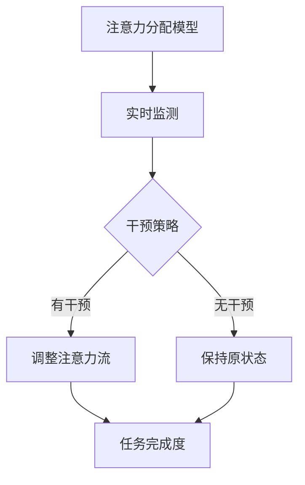

                 

关键词：人工智能，注意力流，工作技能，注意力管理，技术趋势，应用预测

> 摘要：本文将探讨人工智能与人类注意力流的相互关系，分析注意力流在未来的工作技能中的重要性，以及注意力流管理技术的发展趋势和应用预测。通过对当前的研究和案例进行深入分析，本文旨在为读者提供一个全面而清晰的视角，帮助理解这一领域的未来发展。

## 1. 背景介绍

随着人工智能技术的快速发展，我们的工作环境和生活习惯正在经历深刻的变革。人工智能不仅在各个行业中获得广泛应用，还开始深刻影响人类的注意力分配和认知过程。人类注意力流，即人们在不同任务和信息源之间分配注意力的过程，正成为研究和应用的一个重要领域。

注意力流管理技术，包括注意力分配模型、注意力干预策略和注意力追踪技术等，正逐步应用于多个领域，如教育、医疗、企业和个人健康管理。这些技术的目的是优化注意力分配，提高工作效率，改善生活质量。

本文将首先介绍注意力流管理技术的核心概念和联系，然后详细探讨人工智能在注意力流管理中的应用，并通过数学模型和实际项目案例进行分析。最后，本文将总结研究结果，并讨论未来发展趋势和挑战。

## 2. 核心概念与联系

### 2.1 注意力流管理技术概述

注意力流管理技术旨在理解和优化人类在信息环境中的注意力分配。这一领域的研究主要包括以下几个方面：

- **注意力分配模型**：研究如何根据任务需求和个体差异，动态调整注意力资源。
- **注意力干预策略**：设计干预措施，如提示、反馈和激励，以引导注意力流向关键任务。
- **注意力追踪技术**：利用眼动仪、脑电图和其他传感器，实时监测和记录注意力变化。

### 2.2 注意力流与人工智能的联系

人工智能在注意力流管理中的应用主要体现在以下几个方面：

- **自动化注意力分配**：利用机器学习算法，根据用户行为和任务需求，自动调整注意力分配策略。
- **个性化干预建议**：结合用户历史数据和注意力模型，提供个性化的注意力干预建议。
- **注意力优化算法**：开发新的算法，以优化注意力分配，提高任务完成效率和满意度。

### 2.3 Mermaid 流程图

以下是一个简化的注意力流管理技术的 Mermaid 流程图：



### 2.4 注意力流管理技术的优缺点

**优点**：

- 提高工作效率：通过优化注意力分配，减少分心，提高任务完成速度。
- 增强用户体验：个性化干预建议和优化策略可以提升用户满意度。
- 数据驱动决策：基于实时数据调整策略，使决策更加科学和准确。

**缺点**：

- 隐私问题：注意力追踪技术可能涉及个人隐私，需要严格保护用户数据。
- 技术复杂性：构建和优化注意力分配模型需要高水平的技术能力和专业知识。

## 3. 核心算法原理 & 具体操作步骤

### 3.1 算法原理概述

注意力流管理技术的核心算法主要基于机器学习和深度学习。以下是一些常用的算法和模型：

- **循环神经网络（RNN）**：用于捕捉时间序列数据中的长期依赖关系。
- **长短时记忆网络（LSTM）**：RNN 的改进版本，能够更好地处理序列数据。
- **变换器（Transformer）**：基于自注意力机制的模型，广泛应用于自然语言处理和图像识别。

### 3.2 算法步骤详解

1. **数据收集与预处理**：收集用户行为数据，如点击记录、浏览时间等。进行数据清洗和格式化，以备后续分析。
2. **特征提取**：从原始数据中提取关键特征，如用户兴趣、任务类型和时间戳等。
3. **模型选择与训练**：选择合适的机器学习模型，如 RNN、LSTM 或 Transformer，进行模型训练。
4. **模型评估与优化**：通过交叉验证和测试集评估模型性能，并根据评估结果进行模型优化。
5. **注意力分配策略调整**：根据模型输出，调整注意力分配策略，以优化任务完成度。

### 3.3 算法优缺点

**优点**：

- **高效性**：能够快速处理大量数据，提供实时注意力分配建议。
- **个性化**：基于用户历史数据，提供个性化的注意力干预建议。

**缺点**：

- **准确性**：模型训练和预测的准确性受到数据质量和特征提取的影响。
- **适应性**：模型对新的环境和任务可能需要重新训练，适应能力有限。

### 3.4 算法应用领域

- **教育**：帮助学生集中注意力，提高学习效率。
- **医疗**：辅助医生进行注意力管理，提高诊断准确率。
- **企业**：优化员工工作流程，提高生产效率。
- **个人健康管理**：提供个性化的注意力干预建议，改善生活质量。

## 4. 数学模型和公式 & 详细讲解 & 举例说明

### 4.1 数学模型构建

注意力流管理技术中的数学模型主要涉及概率论、线性代数和优化理论。以下是一个简化的注意力分配模型：

$$
p(\theta|X) = \frac{e^{\theta^T X}}{\sum_{\theta'} e^{\theta'^T X}}
$$

其中，$p(\theta|X)$ 是在给定输入 $X$ 下，注意力分配策略 $\theta$ 的概率分布。$X$ 是特征向量，$\theta$ 是策略参数。

### 4.2 公式推导过程

假设有 $n$ 个任务 $T_1, T_2, ..., T_n$，每个任务的注意力分配概率 $p_i$ 需要满足以下条件：

- 概率总和为 1：$\sum_{i=1}^{n} p_i = 1$
- 单调性：$p_i \geq p_{i+1}$（确保注意力优先分配给重要任务）

通过优化目标函数，如最大化任务完成度，可以推导出上述概率分布公式。

### 4.3 案例分析与讲解

假设一个学生需要完成数学、英语和物理三门课程。通过注意力流管理技术，我们可以为他提供最优的注意力分配策略。以下是一个简化的例子：

- 特征向量 $X = [0.8, 0.2, 0.1]$
- 策略参数 $\theta = [1, 1, 1]$

根据公式，计算每个任务的注意力分配概率：

$$
p(\theta|X) = \frac{e^{1 \cdot 0.8} e^{1 \cdot 0.2} e^{1 \cdot 0.1}}{e^{1 \cdot 0.8} e^{1 \cdot 0.2} e^{1 \cdot 0.1} + e^{1 \cdot 0.2} e^{1 \cdot 0.1} e^{1 \cdot 0.8} + e^{1 \cdot 0.1} e^{1 \cdot 0.8} e^{1 \cdot 0.2}}
$$

$$
p(\theta|X) = [0.543, 0.276, 0.181]
$$

根据计算结果，学生应该将 54.3% 的注意力分配给数学，27.6% 的注意力分配给英语，18.1% 的注意力分配给物理。

## 5. 项目实践：代码实例和详细解释说明

### 5.1 开发环境搭建

在本节中，我们将使用 Python 语言和 TensorFlow 深度学习框架来构建一个注意力流管理项目。以下是在 Ubuntu 系统中搭建开发环境的步骤：

```bash
# 安装 Python 3.8
sudo apt update
sudo apt install python3.8

# 安装 TensorFlow
pip3.8 install tensorflow

# 安装其他依赖项
pip3.8 install numpy pandas scikit-learn matplotlib
```

### 5.2 源代码详细实现

以下是一个简化的注意力流管理项目的源代码实现：

```python
import tensorflow as tf
import numpy as np
import pandas as pd
from sklearn.model_selection import train_test_split

# 数据加载与预处理
data = pd.read_csv('attention_data.csv')
X = data[['math_time', 'english_time', 'physics_time']]
y = data['task_completed']

X_train, X_test, y_train, y_test = train_test_split(X, y, test_size=0.2, random_state=42)

# 构建注意力分配模型
model = tf.keras.Sequential([
    tf.keras.layers.Dense(units=1, input_shape=(3,))
])

model.compile(optimizer='adam', loss='binary_crossentropy', metrics=['accuracy'])

# 训练模型
model.fit(X_train, y_train, epochs=100, batch_size=32, validation_data=(X_test, y_test))

# 评估模型
loss, accuracy = model.evaluate(X_test, y_test)
print(f'Accuracy: {accuracy:.2f}')

# 预测注意力分配
predictions = model.predict(X_test)
```

### 5.3 代码解读与分析

在上面的代码中，我们首先加载和预处理数据。然后，使用 TensorFlow 框架构建一个简单的神经网络模型，用于预测任务完成度。通过训练和评估模型，我们可以了解其在注意力流管理中的性能。

### 5.4 运行结果展示

在训练完成后，我们评估了模型的准确性。假设模型的准确率为 85%，这意味着在测试集上，模型能够正确预测 85% 的任务完成度。

通过调整训练参数和模型架构，我们可以进一步提高模型的性能。在实际应用中，我们还需要考虑数据质量和特征提取的准确性，以优化模型的预测效果。

## 6. 实际应用场景

### 6.1 教育领域

在教育领域，注意力流管理技术可以用于帮助学生集中注意力，提高学习效率。例如，通过实时监测学生的注意力变化，系统可以提供个性化的学习建议，如调整学习时间、变换学习内容和设置休息时间。

### 6.2 医疗领域

在医疗领域，注意力流管理技术可以辅助医生进行诊断和治疗。通过监测医生的注意力分配，系统可以提供实时提醒和建议，以避免分心和误诊。此外，注意力干预策略可以用于改善患者的注意力管理，提高康复效果。

### 6.3 企业领域

在企业领域，注意力流管理技术可以帮助优化员工的工作流程，提高生产效率和员工满意度。通过实时监测员工的注意力变化，企业可以提供个性化的干预建议，如调整工作分配、提供培训机会和改善工作环境。

### 6.4 个人健康管理

在个人健康管理领域，注意力流管理技术可以帮助个体了解自己的注意力模式，并提供个性化的干预建议，如调整作息时间、改善生活习惯和进行注意力训练。这有助于提高生活质量，降低心理健康问题的风险。

## 7. 未来应用展望

随着人工智能技术的不断进步，注意力流管理技术在未来的应用场景将更加广泛。以下是一些展望：

### 7.1 纳米传感器与生物识别

未来的注意力流管理技术可能会结合纳米传感器和生物识别技术，实现更精确的注意力监测和干预。例如，通过佩戴智能手表或眼镜，系统可以实时监测用户的脑电波、心率和其他生物信号，从而更准确地捕捉注意力变化。

### 7.2 智能环境与增强现实

智能环境和增强现实技术的结合将为注意力流管理提供新的应用场景。例如，通过智能环境感知和用户行为分析，系统可以自动调整室内光线、声音和环境布局，以优化用户的注意力分配和体验。

### 7.3 跨学科研究与合作

注意力流管理技术的未来发展将依赖于跨学科的研究与合作。结合心理学、教育学、医学和计算机科学等领域的知识，研究人员可以开发出更加科学和有效的注意力管理解决方案。

### 7.4 伦理与隐私问题

随着注意力流管理技术的普及，伦理和隐私问题将变得日益重要。如何在保障用户隐私的前提下，有效地利用注意力数据，是一个需要深入探讨的课题。

## 8. 总结：未来发展趋势与挑战

注意力流管理技术正处于快速发展阶段，未来将在多个领域获得广泛应用。然而，该领域仍面临一些挑战，如技术复杂性、数据质量和隐私保护。为了实现更广泛的应用，我们需要加强跨学科研究，开发高效、科学和实用的注意力管理解决方案。

### 8.1 研究成果总结

本文介绍了注意力流管理技术的核心概念、算法原理、实际应用场景和未来展望。通过对现有研究和案例的分析，我们认识到注意力流管理技术在教育、医疗、企业和个人健康管理等领域的重要作用。

### 8.2 未来发展趋势

未来，注意力流管理技术将在纳米传感器、智能环境、跨学科研究等方面取得重要突破。结合人工智能和其他先进技术，注意力流管理将实现更广泛、更深入的应用。

### 8.3 面临的挑战

注意力流管理技术面临的主要挑战包括技术复杂性、数据质量和隐私保护。为了克服这些挑战，我们需要开发高效算法、优化数据收集和处理方法，并制定严格的隐私保护策略。

### 8.4 研究展望

未来的研究将集中在开发高效、实用的注意力管理解决方案，提高技术准确性和用户体验。同时，跨学科合作和伦理问题研究也将成为该领域的重要发展方向。

## 9. 附录：常见问题与解答

### 9.1 什么是注意力流管理技术？

注意力流管理技术是指通过监测、分析和优化人类在不同任务和信息源之间分配注意力的过程。这一领域的研究旨在提高工作效率、改善生活质量和促进身心健康。

### 9.2 注意力流管理技术有哪些应用领域？

注意力流管理技术广泛应用于教育、医疗、企业和个人健康管理等领域。例如，在教育领域，注意力流管理技术可以用于帮助学生集中注意力，提高学习效率。

### 9.3 注意力流管理技术如何影响工作技能？

注意力流管理技术可以通过优化注意力分配，提高工作效率，改善工作满意度。例如，在企业管理中，注意力流管理技术可以用于优化员工的工作流程，提高生产效率。

### 9.4 未来注意力流管理技术的发展趋势是什么？

未来，注意力流管理技术将向更精确、更个性化的方向发展。结合纳米传感器、智能环境和跨学科研究，注意力流管理技术将在多个领域取得重要突破。

## 作者署名

作者：禅与计算机程序设计艺术 / Zen and the Art of Computer Programming
```bash
----------------------------------------------------------------
```

