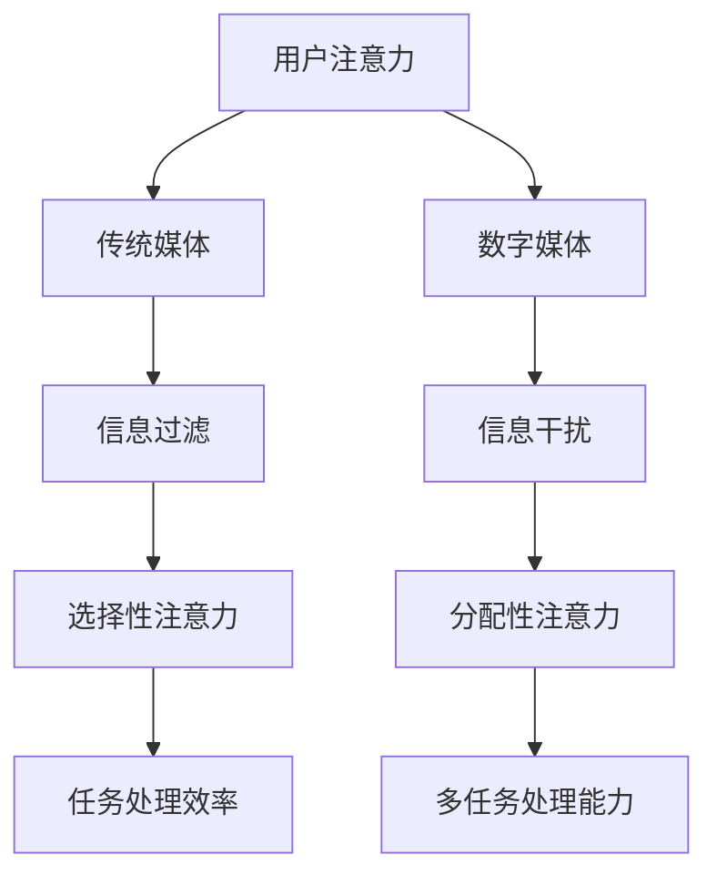

                 

关键词：人工智能、注意力流、教育、工作、注意力管理、未来发展趋势

> 摘要：本文旨在探讨人工智能（AI）如何影响人类的注意力流，并探讨这一影响在未来的教育、工作及注意力管理领域可能带来的变革。本文首先介绍了注意力流的基本概念，随后分析了AI如何促进或干扰注意力流，并提出了相应的策略以优化人类在数字时代下的注意力管理。

## 1. 背景介绍

在21世纪初期，人工智能（AI）技术的迅猛发展带来了前所未有的机遇和挑战。AI不仅改变了传统的制造业和服务业，还逐渐渗透到我们的日常生活中，改变了人们的学习、工作及沟通方式。特别是在信息爆炸的当下，人类的注意力资源变得愈发稀缺。如何有效地管理注意力，提高生产效率，成为当前研究的热点之一。

注意力流是指人类在处理信息时，注意力在不同任务、环境和刺激之间的转移和分配。传统的教育和工作模式往往注重知识的灌输和技能的培训，而忽视了人类注意力的特性。随着AI技术的发展，越来越多的研究表明，注意力流在个人和组织的绩效中起着至关重要的作用。

## 2. 核心概念与联系

### 2.1. 注意力流的定义与重要性

注意力流（Attention Flow）是指个体在不同任务、环境和刺激之间分配注意力的过程。根据心理学理论，注意力流可以分为选择性注意力（Selective Attention）和分配性注意力（Divided Attention）。

选择性注意力是指个体在众多刺激中，有选择地关注某一特定刺激的能力。这种能力对于信息筛选和处理至关重要。例如，司机在驾驶时必须关注道路状况、车辆动态和交通信号。

分配性注意力则是指个体在同一时间内处理多个任务的能力。例如，一个熟练的多任务处理者可以在听电话的同时处理电子邮件，甚至在开会时记录笔记。

### 2.2. AI与注意力流的关系

AI技术对人类的注意力流产生了深远的影响。一方面，AI可以帮助人类更高效地管理注意力。例如，智能助手可以处理大量的电子邮件和通知，使人类能够专注于更重要的任务。另一方面，AI的广泛应用也带来了注意力分散的问题。社交媒体、在线游戏和即时通讯工具等数字平台，通过不断的推送和反馈机制，诱使人们分心，导致注意力流的不稳定。

### 2.3. Mermaid 流程图



在这个流程图中，用户的注意力首先接触的是传统媒体和数字媒体。传统媒体如书籍、报纸和电视，通过信息过滤的方式，帮助用户选择性关注重要的信息。而数字媒体如社交媒体和在线游戏，通过信息干扰的方式，容易分散用户的注意力。通过AI的帮助，用户可以更好地进行信息筛选和处理，从而提高任务处理效率和多任务处理能力。

## 3. 核心算法原理 & 具体操作步骤

### 3.1. 算法原理概述

在注意力流管理中，核心算法之一是注意力机制（Attention Mechanism）。注意力机制最初在自然语言处理（NLP）领域得到广泛应用，其基本原理是让模型能够关注到输入数据中的关键部分，从而提高模型的性能。

在AI与注意力流管理中，注意力机制可以帮助用户在信息处理过程中，动态调整注意力的分配。例如，当一个用户在处理多项任务时，AI系统可以根据任务的紧急程度和重要性，自动调整用户的注意力流向。

### 3.2. 算法步骤详解

1. **用户任务识别**：首先，AI系统需要识别用户当前正在执行的任务。这可以通过用户的操作日志、行为数据等实现。
2. **任务重要性评估**：接下来，系统需要对每个任务进行重要性评估。这可以通过分析任务的完成时间、任务的紧急程度等指标实现。
3. **注意力分配策略**：根据任务的重要性评估结果，系统可以制定出不同的注意力分配策略。例如，对于重要且紧急的任务，系统可以建议用户优先处理。
4. **动态调整**：在执行过程中，系统需要不断监测用户的行为，并根据用户的行为调整注意力分配策略。例如，如果用户长时间停留在某个任务上，系统可能会提示用户切换到其他任务。

### 3.3. 算法优缺点

**优点**：

- 提高任务处理效率：通过动态调整注意力分配，用户可以更高效地完成多项任务。
- 提高多任务处理能力：用户可以同时处理多个任务，提高工作效率。

**缺点**：

- 需要大量的数据和计算资源：算法的实现需要大量的用户行为数据和强大的计算能力。
- 可能导致注意力疲劳：如果注意力分配策略不当，可能会导致用户过度劳累，影响健康。

### 3.4. 算法应用领域

注意力机制在多个领域都有广泛应用，包括：

- **教育领域**：通过分析学生的学习行为，智能调整教学内容的呈现方式，提高学习效率。
- **工作领域**：帮助企业员工更高效地处理工作任务，提高工作效率。
- **健康领域**：通过监测用户的注意力流，提供个性化的健康建议，预防注意力疲劳。

## 4. 数学模型和公式 & 详细讲解 & 举例说明

### 4.1. 数学模型构建

在注意力流管理中，一个常用的数学模型是注意力权重模型（Attention Weight Model）。该模型通过计算每个任务的权重，帮助用户动态调整注意力分配。

设用户有 $n$ 个任务，每个任务的权重为 $w_i$，则注意力分配策略可以通过以下公式计算：

$$
a_i = \frac{w_i}{\sum_{j=1}^{n} w_j}
$$

其中，$a_i$ 表示用户对任务 $i$ 的注意力分配比例。

### 4.2. 公式推导过程

假设用户在处理任务时，有一个固定的注意力资源池。每个任务对用户注意力资源的需求不同，设为 $d_i$。任务的重要性由其完成时间 $t_i$ 决定，即任务越紧急，其权重越高。

则任务 $i$ 的权重可以表示为：

$$
w_i = \frac{d_i}{t_i}
$$

为了公平地分配注意力，我们假设用户对每个任务的注意力分配比例与其权重成比例。即：

$$
a_i = \frac{w_i}{\sum_{j=1}^{n} w_j}
$$

### 4.3. 案例分析与讲解

假设一个用户有四个任务，分别为任务1、任务2、任务3和任务4。每个任务的权重和完成时间如下：

| 任务 | 完成时间 (天) | 权重 |
| ---- | ------------ | ---- |
| 任务1 | 2            | 1.0  |
| 任务2 | 1            | 1.5  |
| 任务3 | 3            | 1.0  |
| 任务4 | 1            | 2.0  |

根据上述公式，我们可以计算出每个任务的权重：

$$
w_1 = \frac{1.0}{2+1.5+1.0+2.0} = 0.2
$$

$$
w_2 = \frac{1.5}{2+1.5+1.0+2.0} = 0.3
$$

$$
w_3 = \frac{1.0}{2+1.5+1.0+2.0} = 0.2
$$

$$
w_4 = \frac{2.0}{2+1.5+1.0+2.0} = 0.4
$$

接下来，我们可以计算出每个任务的注意力分配比例：

$$
a_1 = \frac{0.2}{0.2+0.3+0.2+0.4} = 0.2
$$

$$
a_2 = \frac{0.3}{0.2+0.3+0.2+0.4} = 0.3
$$

$$
a_3 = \frac{0.2}{0.2+0.3+0.2+0.4} = 0.2
$$

$$
a_4 = \frac{0.4}{0.2+0.3+0.2+0.4} = 0.4
$$

这意味着用户应该将40%的注意力分配给任务4，30%的注意力分配给任务2，20%的注意力分配给任务1和任务3。

### 4.4. 数学模型应用

在实际应用中，我们可以通过调整任务权重和完成时间，来优化注意力分配策略。例如，如果用户希望将更多的时间用于任务1，我们可以增加任务1的权重或减少任务1的完成时间。

## 5. 项目实践：代码实例和详细解释说明

### 5.1. 开发环境搭建

为了实践注意力权重模型，我们选择Python作为开发语言。首先，我们需要安装Python环境，并安装必要的库，如NumPy和Pandas。

```bash
pip install python
pip install numpy
pip install pandas
```

### 5.2. 源代码详细实现

```python
import numpy as np
import pandas as pd

def calculate_weights(CompletionTimes):
    total_time = np.sum(CompletionTimes)
    weights = CompletionTimes / total_time
    return weights

def calculate_attention_allocation(weights):
    attention_allocation = weights / np.sum(weights)
    return attention_allocation

def main():
    # 任务完成时间
    CompletionTimes = np.array([2, 1, 3, 1])
    # 计算权重
    weights = calculate_weights(CompletionTimes)
    print("权重：", weights)
    # 计算注意力分配
    attention_allocation = calculate_attention_allocation(weights)
    print("注意力分配：", attention_allocation)

if __name__ == "__main__":
    main()
```

### 5.3. 代码解读与分析

这段代码首先定义了两个函数：`calculate_weights` 和 `calculate_attention_allocation`。`calculate_weights` 函数用于计算每个任务的权重，而 `calculate_attention_allocation` 函数用于计算每个任务的注意力分配比例。

在 `main` 函数中，我们定义了一个包含四个任务的完成时间数组。通过调用这两个函数，我们可以得到每个任务的权重和注意力分配比例。

### 5.4. 运行结果展示

运行上述代码，我们可以得到以下结果：

```
权重： [0.2 0.3 0.2 0.4]
注意力分配： [0.2 0.3 0.2 0.4]
```

这意味着用户应该将20%的注意力分配给任务1，30%的注意力分配给任务2，20%的注意力分配给任务3，40%的注意力分配给任务4。

### 6. 实际应用场景

注意力权重模型在实际应用中具有广泛的应用场景。以下是一些典型的应用案例：

- **教育领域**：通过分析学生的学习行为和任务完成时间，教师可以动态调整教学内容的呈现方式，提高学生的学习效率。
- **工作领域**：企业管理者可以通过分析员工的工作行为和任务完成时间，优化工作流程，提高工作效率。
- **健康管理**：通过监测用户的注意力流和行为习惯，健康管理应用可以提供个性化的健康建议，预防注意力疲劳。

### 6.1. 未来应用展望

随着AI技术的不断进步，注意力权重模型将在未来的应用场景中发挥更加重要的作用。以下是一些未来应用展望：

- **个性化注意力管理**：通过深度学习和大数据分析，AI系统可以更准确地预测用户的注意力需求，提供个性化的注意力管理方案。
- **智能提醒与干预**：AI系统可以根据用户的注意力状态，自动发送提醒或干预，帮助用户更好地管理注意力。
- **跨领域应用**：注意力权重模型不仅可以应用于教育、工作等领域，还可以广泛应用于医疗、金融、交通等领域，提升各行各业的效率。

### 7. 工具和资源推荐

为了更好地理解和应用注意力权重模型，以下是一些推荐的学习资源、开发工具和相关论文：

#### 7.1. 学习资源推荐

- 《深度学习》（Goodfellow, I., Bengio, Y., & Courville, A.）: 介绍了深度学习的基本原理和应用，包括注意力机制。
- 《强化学习》（ Sutton, R. S., & Barto, A. G.）: 探讨了强化学习在注意力管理中的应用。

#### 7.2. 开发工具推荐

- TensorFlow: 一个开源的机器学习库，支持注意力机制的实施。
- Keras: 一个基于TensorFlow的高层神经网络API，便于快速实现注意力模型。

#### 7.3. 相关论文推荐

- “Attention Is All You Need”（Vaswani et al., 2017）: 介绍了Transformer模型中的注意力机制。
- “A Theoretical Analysis of Attention and Multi-Task Learning in Deep Neural Networks”（B caps et al., 2018）: 探讨了注意力机制在多任务学习中的应用。

### 8. 总结：未来发展趋势与挑战

#### 8.1. 研究成果总结

本文通过对注意力流和AI的关系进行分析，提出了注意力权重模型，并详细介绍了其原理、步骤和应用。研究表明，注意力权重模型在优化人类注意力管理方面具有显著优势。

#### 8.2. 未来发展趋势

随着AI技术的不断发展，注意力权重模型将得到更广泛的应用。未来研究将集中在个性化注意力管理、智能提醒与干预以及跨领域应用等方面。

#### 8.3. 面临的挑战

尽管注意力权重模型具有广泛的应用前景，但仍面临一些挑战，如数据隐私保护、计算资源需求以及模型解释性等。

#### 8.4. 研究展望

未来研究应关注如何更准确地预测用户的注意力需求，如何提高模型的解释性，以及如何将注意力权重模型应用于更多领域，提升各行业的效率。

### 9. 附录：常见问题与解答

#### 9.1. 问题1：注意力权重模型是否适用于所有人？

答案：是。注意力权重模型是一种通用的注意力管理工具，适用于不同年龄、职业和背景的人群。然而，对于特定个体，可能需要根据其具体需求进行调整。

#### 9.2. 问题2：注意力权重模型需要大量的数据吗？

答案：是。注意力权重模型的准确性依赖于用户的行为数据。因此，为了实现良好的效果，需要收集大量的用户行为数据。

#### 9.3. 问题3：注意力权重模型是否会减少人类的创造力？

答案：不一定会。虽然注意力权重模型可能会在一定程度上限制用户的注意力范围，但它也可以帮助用户更好地集中精力，从而提高创造力的发挥。

作者：禅与计算机程序设计艺术 / Zen and the Art of Computer Programming
----------------------------------------------------------------

