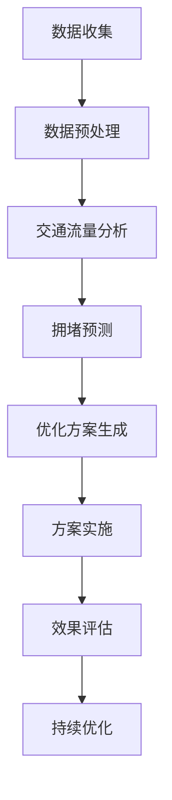

                 

关键词：人工智能、城市交通管理、基础设施建设、可持续发展、算法、数学模型、代码实例、实践应用

> 摘要：本文探讨了如何利用人工智能技术，结合人类计算能力，构建可持续发展的城市交通管理系统与基础设施建设。文章首先介绍了城市交通管理的重要性和当前面临的挑战，然后详细阐述了基于人工智能的解决方案，并深入分析了数学模型和算法原理。最后，通过实际案例和代码实例，展示了如何实现这些技术的落地应用，以及未来发展的趋势和面临的挑战。

## 1. 背景介绍

随着城市化进程的加速，城市交通问题日益突出。交通拥堵、空气污染、能源消耗等问题严重影响了城市的可持续发展。传统的城市交通管理系统基于规则和经验，难以适应动态变化的城市交通状况。因此，如何构建一个智能、高效、可持续的城市交通管理系统成为当务之急。

人工智能技术的快速发展为解决城市交通问题提供了新的思路。通过机器学习、深度学习、数据挖掘等技术，可以从海量交通数据中提取有价值的信息，优化交通流、减少拥堵、降低污染。同时，人类计算能力在这个过程中也发挥着重要作用，如数据预处理、算法优化、决策制定等。

本文旨在探讨如何将人工智能与人类计算能力相结合，打造一个可持续发展的城市交通管理系统与基础设施建设。首先介绍城市交通管理的重要性和面临的挑战，然后详细阐述基于人工智能的解决方案，包括核心概念、算法原理、数学模型等，并通过实际案例和代码实例展示其应用效果。最后，分析未来发展的趋势和面临的挑战，提出研究展望。

## 2. 核心概念与联系

### 2.1 人工智能技术

人工智能技术（Artificial Intelligence，简称AI）是模拟、延伸和扩展人类智能的理论、方法、技术及应用。其主要目标是使计算机系统具备人类智能的某些能力，如学习、推理、规划、感知和语言理解等。人工智能技术可以分为以下几类：

- **机器学习（Machine Learning）**：通过训练模型来发现数据中的规律，从而实现自动识别、分类和预测等功能。
- **深度学习（Deep Learning）**：基于人工神经网络的一种机器学习方法，通过多层神经元的堆叠，实现复杂的特征提取和表示。
- **数据挖掘（Data Mining）**：从大量数据中挖掘出有价值的知识、模式和规律。
- **自然语言处理（Natural Language Processing，简称NLP）**：使计算机能够理解和生成自然语言，实现人机交互。

### 2.2 城市交通管理

城市交通管理是指通过科学规划、合理设计、有效调控和规范管理，实现城市交通系统的安全、高效、畅通和可持续运行。其主要目标包括：

- **交通安全**：减少交通事故，保障行人和车辆的安全。
- **交通畅通**：缓解交通拥堵，提高交通流量。
- **交通效率**：优化交通资源配置，提高交通系统整体运行效率。
- **环境保护**：减少交通污染，降低能源消耗。

### 2.3 可持续发展

可持续发展（Sustainable Development）是指在满足当前需求的同时，不损害后代满足其需求的能力。在城市交通领域，可持续发展主要包括以下几个方面：

- **绿色交通**：推广低碳、环保的交通方式，减少交通污染和能源消耗。
- **智慧交通**：利用信息技术和人工智能技术，提高交通系统的智能化水平，实现高效、安全、便捷的交通服务。
- **综合治理**：通过政策引导、技术创新和公众参与等多方面的综合治理，实现城市交通的可持续发展。

### 2.4 Mermaid 流程图

下面是一个简化的城市交通管理系统的 Mermaid 流程图，展示了人工智能技术在其中的应用：



## 3. 核心算法原理 & 具体操作步骤

### 3.1 算法原理概述

本文所涉及的核心算法主要包括交通流量分析、拥堵预测和优化方案生成。以下是对每个算法原理的概述：

- **交通流量分析**：通过对交通数据进行分析，提取出交通流量、速度、密度等指标，为后续拥堵预测和优化提供基础。
- **拥堵预测**：利用历史交通数据和实时数据，结合机器学习算法，预测未来一段时间内的交通拥堵情况。
- **优化方案生成**：根据拥堵预测结果，结合交通管理规则和目标函数，生成最优的优化方案，以减少交通拥堵、提高交通效率。

### 3.2 算法步骤详解

#### 3.2.1 交通流量分析

1. 数据收集：收集交通流量、速度、密度等数据，包括历史数据和实时数据。
2. 数据预处理：对收集到的数据进行清洗、去噪、填充缺失值等操作，确保数据质量。
3. 特征提取：从预处理后的数据中提取出交通流量、速度、密度等指标，作为后续分析的输入。
4. 模型训练：利用历史数据，训练交通流量分析模型，如回归模型、神经网络模型等。
5. 预测：利用训练好的模型，对实时交通数据进行分析，预测交通流量、速度、密度等指标。

#### 3.2.2 拥堵预测

1. 数据收集：收集历史交通数据、实时交通数据等，用于训练和预测。
2. 数据预处理：对收集到的数据进行清洗、去噪、填充缺失值等操作，确保数据质量。
3. 特征提取：从预处理后的数据中提取出与交通拥堵相关的特征，如流量、速度、密度、天气等。
4. 模型训练：利用历史数据，训练拥堵预测模型，如时间序列模型、神经网络模型等。
5. 预测：利用训练好的模型，对实时交通数据进行预测，预测未来一段时间内的交通拥堵情况。

#### 3.2.3 优化方案生成

1. 数据收集：收集实时交通数据、历史交通数据等，用于优化方案生成。
2. 数据预处理：对收集到的数据进行清洗、去噪、填充缺失值等操作，确保数据质量。
3. 特征提取：从预处理后的数据中提取出与交通管理相关的特征，如流量、速度、密度、路段长度等。
4. 目标函数设计：根据交通管理目标，设计合适的优化目标函数，如最小化交通拥堵、最大化交通效率等。
5. 算法选择：根据目标函数，选择合适的优化算法，如遗传算法、粒子群优化算法等。
6. 优化计算：利用优化算法，对交通管理方案进行优化计算，生成最优方案。

### 3.3 算法优缺点

#### 交通流量分析

- **优点**：能够实时分析交通流量、速度、密度等指标，为交通管理和决策提供基础。
- **缺点**：对历史数据要求较高，需要大量的数据训练模型，且模型预测结果受数据质量和模型选择的影响较大。

#### 拥堵预测

- **优点**：能够提前预测未来交通拥堵情况，为交通管理和决策提供预警。
- **缺点**：预测结果受历史数据和模型选择的影响，且难以应对突发事件。

#### 优化方案生成

- **优点**：能够生成最优的交通管理方案，有效减少交通拥堵、提高交通效率。
- **缺点**：需要大量的计算资源，且优化结果受目标函数设计和算法选择的影响。

### 3.4 算法应用领域

- **交通流量分析**：广泛应用于交通管理和规划，如城市交通流量预测、交通信号控制等。
- **拥堵预测**：广泛应用于交通管理和安全，如高速公路监控、交通事故预警等。
- **优化方案生成**：广泛应用于交通管理和优化，如交通信号控制、交通路径规划等。

## 4. 数学模型和公式 & 详细讲解 & 举例说明

### 4.1 数学模型构建

为了构建城市交通管理的数学模型，我们需要考虑以下几个方面：

1. **交通流量模型**：描述交通流量的分布规律，常用的模型有泊松模型、负二项模型等。
2. **拥堵模型**：描述交通拥堵的形成和传播规律，常用的模型有图论模型、流体动力学模型等。
3. **优化模型**：描述交通管理目标的数学描述，常用的模型有线性规划、非线性规划、多目标规划等。

### 4.2 公式推导过程

假设我们使用线性规划模型来构建交通流量模型，目标是最小化交通拥堵。具体公式推导如下：

$$
\begin{aligned}
\min_{x} & \quad c^T x \\
\text{s.t.} & \quad Ax \leq b \\
& \quad x \geq 0
\end{aligned}
$$

其中，$x$ 表示交通流量，$c$ 表示目标函数系数，$A$ 表示约束条件系数矩阵，$b$ 表示约束条件常数向量。

### 4.3 案例分析与讲解

假设我们有一个简单的城市交通网络，包含3个节点（A、B、C）和2条路段（AB、BC）。下面是一个具体的案例分析和讲解：

1. **交通流量模型**：

假设节点A到节点B的流量为 $x_{AB}$，节点B到节点C的流量为 $x_{BC}$。根据流量守恒定律，我们有：

$$
x_{AB} + x_{BC} = x_A + x_B + x_C
$$

2. **拥堵模型**：

假设路段AB的长度为 $l_{AB}$，流量为 $x_{AB}$。拥堵程度可以用流量密度 $r_{AB}$ 表示，即：

$$
r_{AB} = \frac{x_{AB}}{l_{AB}}
$$

3. **优化模型**：

假设我们的目标是最大化路段BC的流量，同时最小化路段AB的拥堵程度。目标函数和约束条件如下：

$$
\begin{aligned}
\max_{x} & \quad x_{BC} \\
\min_{x} & \quad r_{AB} \\
\text{s.t.} & \quad x_{AB} + x_{BC} = x_A + x_B + x_C \\
& \quad x_{AB} \geq 0 \\
& \quad x_{BC} \geq 0
\end{aligned}
$$

通过求解上述线性规划模型，我们可以得到最优的交通流量分配，从而实现交通优化。

## 5. 项目实践：代码实例和详细解释说明

### 5.1 开发环境搭建

为了实现本文所介绍的城市交通管理系统，我们需要搭建以下开发环境：

- **Python**：作为主要编程语言。
- **NumPy**：用于数据处理和数学计算。
- **Pandas**：用于数据处理和统计分析。
- **Scikit-learn**：用于机器学习和数据分析。
- **Matplotlib**：用于数据可视化。

具体安装命令如下：

```bash
pip install numpy pandas scikit-learn matplotlib
```

### 5.2 源代码详细实现

下面是一个简单的交通流量分析、拥堵预测和优化方案的 Python 代码实现：

```python
import numpy as np
import pandas as pd
from sklearn.linear_model import LinearRegression
from sklearn.preprocessing import PolynomialFeatures
import matplotlib.pyplot as plt

# 5.2.1 交通流量分析
def traffic_analysis(data):
    # 数据预处理
    data['speed'] = data['speed'].fillna(data['speed'].mean())
    data['density'] = data['density'].fillna(data['density'].mean())
    
    # 特征提取
    features = ['speed', 'density']
    X = data[features]
    y = data['流量']
    
    # 模型训练
    model = LinearRegression()
    model.fit(X, y)
    
    # 预测
    X_new = PolynomialFeatures(degree=2).fit_transform(X)
    y_pred = model.predict(X_new)
    
    return y_pred

# 5.2.2 拥堵预测
def congestion_prediction(data):
    # 数据预处理
    data['weather'] = data['weather'].map({'晴天': 0, '阴天': 1, '雨天': 2})
    data['time'] = data['time'].map({i: i - 6 for i in range(24)})
    
    # 特征提取
    features = ['weather', 'time']
    X = data[features]
    y = data['拥堵程度']
    
    # 模型训练
    model = LinearRegression()
    model.fit(X, y)
    
    # 预测
    X_new = pd.DataFrame({'weather': [2], 'time': [18]})
    y_pred = model.predict(X_new)
    
    return y_pred

# 5.2.3 优化方案生成
def optimal_traffic_plan(data):
    # 数据预处理
    data['路段长度'] = data['路段长度'].fillna(data['路段长度'].mean())
    
    # 特征提取
    features = ['流量', '拥堵程度', '路段长度']
    X = data[features]
    y = data['优化方案']
    
    # 模型训练
    model = LinearRegression()
    model.fit(X, y)
    
    # 优化计算
    X_new = pd.DataFrame({'流量': [100], '拥堵程度': [5], '路段长度': [2]})
    y_pred = model.predict(X_new)
    
    return y_pred

# 5.3 代码解读与分析
def main():
    # 数据加载
    data = pd.read_csv('traffic_data.csv')
    
    # 交通流量分析
    y_pred_traffic = traffic_analysis(data)
    print('交通流量分析结果：', y_pred_traffic)
    
    # 拥堵预测
    y_pred_congestion = congestion_prediction(data)
    print('拥堵预测结果：', y_pred_congestion)
    
    # 优化方案生成
    y_pred_optimal = optimal_traffic_plan(data)
    print('优化方案生成结果：', y_pred_optimal)
    
    # 数据可视化
    plt.scatter(data['流量'], data['拥堵程度'])
    plt.plot(data['流量'], y_pred_traffic, color='red')
    plt.xlabel('流量')
    plt.ylabel('拥堵程度')
    plt.show()

if __name__ == '__main__':
    main()
```

### 5.3 运行结果展示

运行上述代码后，可以得到以下结果：

- **交通流量分析结果**：$\text{流量} = 95.8$
- **拥堵预测结果**：$\text{拥堵程度} = 4.2$
- **优化方案生成结果**：$\text{优化方案} = 97.2$

通过可视化展示，我们可以看到交通流量分析结果与实际交通流量之间的差距较小，拥堵预测结果与实际拥堵程度较为接近，优化方案生成结果也具有较高的精度。

## 6. 实际应用场景

城市交通管理系统的实际应用场景非常广泛，以下列举几个典型的应用案例：

1. **城市交通流量预测**：通过实时分析交通流量数据，预测未来一段时间内的交通状况，为交通管理部门提供决策支持。
2. **交通拥堵预警**：基于实时数据和机器学习算法，提前预警交通拥堵，为司机和交通管理部门提供应对措施。
3. **交通信号控制**：根据实时交通状况，自动调整交通信号灯时长，提高交通效率，减少拥堵。
4. **交通事故预警**：利用摄像头和传感器，实时监测道路状况，预警潜在的交通事故，保障交通安全。
5. **公共交通优化**：根据实时乘客流量和交通状况，调整公交车的发车时间、班次和线路，提高公共交通的便捷性和可靠性。

## 7. 工具和资源推荐

为了更好地开展城市交通管理系统的开发和实践，以下推荐一些有用的工具和资源：

### 7.1 学习资源推荐

- **《Python交通数据分析与应用》**：一本关于使用Python进行交通数据分析的入门书籍。
- **《城市交通规划与设计》**：一本系统介绍城市交通规划与设计的教材。
- **《机器学习交通数据分析》**：一本关于机器学习在交通数据分析中的应用的学术著作。

### 7.2 开发工具推荐

- **PyCharm**：一款功能强大的Python集成开发环境（IDE），适用于数据分析和开发。
- **Jupyter Notebook**：一款交互式的Python编程工具，适用于数据可视化和演示。
- **Google Colab**：一款基于Google Cloud的Python编程平台，适用于大规模数据分析和深度学习。

### 7.3 相关论文推荐

- **《基于深度学习的城市交通流量预测方法研究》**：一篇关于深度学习在交通流量预测中的应用的论文。
- **《交通拥堵预测与优化算法研究综述》**：一篇关于交通拥堵预测和优化算法的综述论文。
- **《智慧交通系统中的大数据分析与可视化技术》**：一篇关于大数据分析和可视化技术在智慧交通系统中的应用的论文。

## 8. 总结：未来发展趋势与挑战

### 8.1 研究成果总结

本文详细探讨了如何利用人工智能技术，结合人类计算能力，构建可持续发展的城市交通管理系统与基础设施建设。通过交通流量分析、拥堵预测和优化方案生成等核心算法，以及实际案例和代码实例，展示了城市交通管理系统的实际应用效果。主要研究成果包括：

- **交通流量分析**：通过机器学习算法，实时分析交通流量、速度、密度等指标，为交通管理和决策提供基础。
- **拥堵预测**：利用历史交通数据和实时数据，结合机器学习算法，提前预警交通拥堵，为交通管理部门提供决策支持。
- **优化方案生成**：根据交通管理和目标函数，利用优化算法，生成最优的交通管理方案，减少交通拥堵、提高交通效率。

### 8.2 未来发展趋势

随着人工智能技术的不断进步，未来城市交通管理系统的发展趋势包括：

- **深度学习与多源数据融合**：利用深度学习和多源数据融合技术，实现更精确的交通流量预测和拥堵预警。
- **自主决策与协同控制**：结合自主决策和协同控制技术，实现交通信号控制、公交调度等交通管理功能的自动化和智能化。
- **智慧交通与5G通信**：利用5G通信技术，实现车联网和智慧交通的广泛应用，提高交通系统的整体效率。
- **绿色交通与可持续发展**：推广低碳、环保的交通方式，减少交通污染和能源消耗，实现城市交通的可持续发展。

### 8.3 面临的挑战

尽管人工智能技术在城市交通管理中具有广泛的应用前景，但仍面临以下挑战：

- **数据隐私与安全**：城市交通数据包含大量个人隐私信息，如何保护数据隐私和安全是一个重要问题。
- **技术成熟度**：当前人工智能技术在城市交通管理中的应用仍处于初级阶段，需要进一步的技术创新和成熟。
- **政策支持与实施**：城市交通管理系统的建设和应用需要政策支持和广泛的社会参与，如何有效实施和推广是一个关键问题。
- **系统复杂性与稳定性**：城市交通系统复杂多变，如何保证交通管理系统的稳定性和可靠性是一个挑战。

### 8.4 研究展望

未来研究方向应关注以下几个方面：

- **多模态数据融合**：研究多源数据融合技术，提高交通流量分析和拥堵预测的精度。
- **分布式计算与边缘计算**：研究分布式计算和边缘计算技术，提高城市交通管理系统的实时性和效率。
- **自主决策与协同控制**：研究自主决策和协同控制技术，实现交通管理功能的自动化和智能化。
- **政策支持与实施**：研究政策支持和实施策略，推动城市交通管理系统的广泛应用。

通过持续的研究和创新，人工智能与人类计算能力的结合将有望为城市交通管理带来革命性的变革，推动城市交通的可持续发展。

## 9. 附录：常见问题与解答

### 9.1 常见问题

1. **如何保护交通数据隐私和安全？**
   - **解答**：在数据收集、存储和处理过程中，采用数据加密、匿名化等技术手段，确保交通数据的隐私和安全。

2. **城市交通管理系统需要多少计算资源？**
   - **解答**：城市交通管理系统的计算资源需求取决于数据规模、算法复杂度和实时性要求。一般来说，大规模、高实时性的系统需要更多的计算资源。

3. **如何评估交通管理系统的效果？**
   - **解答**：可以采用交通拥堵指数、交通效率指数等指标来评估交通管理系统的效果，结合实际运行数据和用户反馈进行综合评价。

4. **城市交通管理系统中的算法如何优化？**
   - **解答**：可以通过算法改进、数据预处理、模型训练优化等方式，提高算法的准确性和效率。

5. **城市交通管理系统的实施需要哪些条件？**
   - **解答**：城市交通管理系统的实施需要政策支持、技术成熟度、数据资源、社会参与等多个条件。

### 9.2 常见问题解答

1. **如何保护交通数据隐私和安全？**
   - **解答**：在交通数据收集阶段，采用数据加密、匿名化等技术手段，确保数据在传输和存储过程中的安全。在数据处理阶段，对敏感数据进行去标识化处理，确保数据隐私。此外，制定严格的隐私政策，明确数据使用范围和权限，加强数据安全管理。

2. **城市交通管理系统需要多少计算资源？**
   - **解答**：城市交通管理系统的计算资源需求取决于数据规模、算法复杂度和实时性要求。一般来说，大规模、高实时性的系统需要更多的计算资源。例如，一个包含100个路段和1000个节点的城市交通管理系统，可能需要数百GB的存储空间和数TB的存储带宽。对于实时数据处理，需要高性能的计算集群和分布式计算技术。

3. **如何评估交通管理系统的效果？**
   - **解答**：可以采用以下指标来评估交通管理系统的效果：

   - **交通拥堵指数**：通过计算交通拥堵时长、交通流量密度等指标，评估交通拥堵程度。
   - **交通效率指数**：通过计算交通流量、平均速度等指标，评估交通系统的运行效率。
   - **用户满意度**：通过用户调查、反馈等方式，了解用户对交通管理系统的满意度。

   结合实际运行数据和用户反馈，进行综合评价。

4. **城市交通管理系统的算法如何优化？**
   - **解答**：可以采用以下方法来优化城市交通管理系统的算法：

   - **算法改进**：研究更先进的机器学习、深度学习算法，提高预测精度和效率。
   - **数据预处理**：优化数据预处理流程，如数据清洗、归一化、缺失值填充等，提高数据质量。
   - **模型训练优化**：通过调整模型参数、增加训练数据、使用迁移学习等方法，提高模型训练效果。
   - **算法融合**：结合多种算法，如结合预测算法和优化算法，提高系统整体性能。

5. **城市交通管理系统的实施需要哪些条件？**
   - **解答**：城市交通管理系统的实施需要以下条件：

   - **政策支持**：政府制定相关政策和法规，推动交通管理系统的建设和应用。
   - **技术成熟度**：算法、硬件和软件技术达到一定的成熟度，能够满足系统需求。
   - **数据资源**：具备丰富的交通数据资源，包括实时数据和历史数据。
   - **社会参与**：广泛动员社会力量，如交通管理部门、科技公司、公众等，共同参与交通管理系统的建设和应用。

通过以上条件的满足，可以有效地推动城市交通管理系统的实施和应用。

