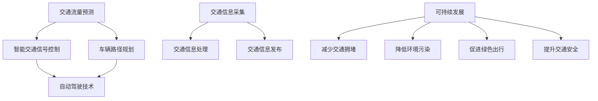

                 

关键词：人工智能，城市交通，可持续发展，交通解决方案，AI算法，数据挖掘，深度学习，自动驾驶，智能交通系统

> 摘要：本文探讨了人工智能（AI）在构建可持续发展的城市交通系统中的作用。通过分析核心概念、算法原理、数学模型、项目实践以及实际应用场景，本文旨在展示如何利用AI技术优化城市交通，提高效率和减少环境影响。文章还展望了未来的发展趋势和挑战，并推荐了相关的学习资源和开发工具。

## 1. 背景介绍

随着全球城市化进程的加速，城市交通问题日益严峻。交通拥堵、交通事故、环境污染等问题不仅影响居民的生活质量，还阻碍了城市的可持续发展。传统的交通管理方法已经无法满足现代城市的需求，迫切需要新的解决方案。

人工智能（AI）技术的发展为城市交通问题提供了新的解决思路。通过利用AI算法，可以实现对交通数据的深度挖掘和分析，从而优化交通流、减少拥堵、提高交通安全。同时，AI技术还能促进自动驾驶汽车和智能交通系统的开发，为构建可持续发展的城市交通体系提供强有力的支持。

本文将围绕AI技术在城市交通中的应用，详细探讨其核心概念、算法原理、数学模型、项目实践以及实际应用场景，旨在为相关领域的研究者和从业者提供有价值的参考。

## 2. 核心概念与联系

### 2.1 人工智能与城市交通

人工智能是一种模拟人类智能的计算机技术，其核心在于通过算法和模型实现机器学习和自主决策。在城市交通领域，人工智能主要应用于以下几个方面：

- **交通流量预测**：通过分析历史交通数据，预测未来的交通流量，为交通管理和规划提供依据。
- **智能交通信号控制**：利用AI算法优化交通信号配时，提高道路通行效率。
- **车辆路径规划**：为司机提供最优的行驶路线，减少交通拥堵和行驶时间。
- **自动驾驶技术**：实现车辆自主驾驶，提高交通安全和效率。

### 2.2 智能交通系统

智能交通系统（Intelligent Transportation Systems, ITS）是指利用通信、计算机、自动控制等先进技术，实现交通管理、运输服务、交通信息的智能化和集成化。ITS的核心组成部分包括：

- **交通信息采集**：通过传感器、摄像头等设备实时获取交通数据。
- **交通信息处理**：利用AI算法对采集到的数据进行处理和分析，为交通管理提供支持。
- **交通信息发布**：通过广播、互联网等方式向公众提供交通信息，帮助人们做出更好的出行决策。

### 2.3 自动驾驶技术

自动驾驶技术是人工智能在交通领域的重要应用之一。自动驾驶汽车通过搭载多种传感器（如摄像头、雷达、激光雷达等）感知周围环境，结合AI算法实现自主驾驶。自动驾驶技术可分为以下级别：

- **L0：无自动化**：车辆完全由人类驾驶员控制。
- **L1：部分自动化**：车辆具备某些自动化功能，如自动巡航或自动刹车。
- **L2：有条件自动化**：车辆在特定条件下实现自主驾驶，如高速公路自动驾驶。
- **L3：高度自动化**：车辆在大多数条件下实现自主驾驶，但需要驾驶员在特定情况下接管控制。
- **L4：完全自动化**：车辆在所有条件下实现自主驾驶，无需人类驾驶员。

### 2.4 可持续发展

可持续发展是指在满足当前需求的同时，不损害后代满足其需求的能力。在城市交通领域，可持续发展强调通过优化交通系统、提高能源利用效率、减少环境污染等手段，实现经济、社会和环境的协调发展。可持续发展目标包括：

- **减少交通拥堵**：提高交通效率，减少车辆行驶时间和能源消耗。
- **降低环境污染**：减少尾气排放，降低交通对环境的影响。
- **促进绿色出行**：鼓励使用公共交通、非机动车等绿色出行方式，减少私人车辆使用。
- **提升交通安全**：通过智能交通系统等技术手段，提高道路安全和事故预防能力。

### 2.5 Mermaid 流程图



## 3. 核心算法原理 & 具体操作步骤

### 3.1 算法原理概述

城市交通中的核心算法主要包括交通流量预测、智能交通信号控制和车辆路径规划等。这些算法的核心在于通过数据挖掘和分析，实现交通状态的实时感知和预测。

- **交通流量预测**：利用时间序列分析、回归分析、聚类分析等方法，对历史交通数据进行挖掘，预测未来的交通流量。常用的模型包括ARIMA模型、LSTM模型等。

- **智能交通信号控制**：通过优化交通信号配时，提高道路通行效率。常用的算法包括基于规则的信号控制、基于仿真的信号控制和基于机器学习的信号控制等。

- **车辆路径规划**：利用最短路径算法、A*算法、遗传算法等，为车辆提供最优的行驶路线。路径规划的目标是减少行驶时间、降低能耗和减少拥堵。

### 3.2 算法步骤详解

#### 3.2.1 交通流量预测

1. 数据采集：收集交通流量数据，包括车辆数量、行驶速度、道路宽度等。
2. 数据预处理：对采集到的数据进行清洗、去噪和归一化处理。
3. 特征提取：从原始数据中提取与交通流量相关的特征，如时间段、天气情况、节假日等。
4. 模型训练：利用时间序列分析、回归分析等方法，对特征数据进行建模和训练。
5. 预测结果评估：对预测结果进行评估，如均方误差（MSE）、均方根误差（RMSE）等。
6. 预测结果应用：将预测结果应用于交通管理和规划，如调整交通信号灯配时、优化公共交通路线等。

#### 3.2.2 智能交通信号控制

1. 数据采集：收集交通信号灯数据，包括路口流量、车辆排队长度、行人流量等。
2. 数据预处理：对采集到的数据进行清洗、去噪和归一化处理。
3. 特征提取：从原始数据中提取与交通信号控制相关的特征，如流量密度、排队长度等。
4. 模型训练：利用基于规则的信号控制、基于仿真的信号控制或基于机器学习的信号控制方法，对特征数据进行建模和训练。
5. 信号灯配时优化：根据模型预测结果，调整交通信号灯的配时，提高道路通行效率。
6. 信号灯配时评估：对调整后的信号灯配时进行评估，如道路通行能力、车辆等待时间等。

#### 3.2.3 车辆路径规划

1. 路网数据采集：收集道路网络数据，包括道路长度、宽度、路况等。
2. 车辆数据采集：收集车辆数据，包括车辆类型、载重、速度等。
3. 路网预处理：对路网数据进行清洗、去噪和归一化处理。
4. 车辆预处理：对车辆数据进行分析，确定车辆类型和载重。
5. 路径搜索算法：利用最短路径算法、A*算法、遗传算法等，搜索最优行驶路径。
6. 路径规划评估：对规划出的路径进行评估，如行驶时间、能耗、拥堵程度等。
7. 路径规划应用：将规划出的路径应用于自动驾驶车辆，实现自主驾驶。

### 3.3 算法优缺点

#### 交通流量预测

- 优点：可以实时预测交通流量，为交通管理和规划提供科学依据，有助于缓解交通拥堵。
- 缺点：预测精度受限于数据质量和模型选择，可能存在误差。

#### 智能交通信号控制

- 优点：可以根据实时交通状况调整信号灯配时，提高道路通行效率，减少车辆等待时间。
- 缺点：算法复杂度高，实时性要求高，对硬件和软件性能有较高要求。

#### 车辆路径规划

- 优点：可以为车辆提供最优行驶路径，减少行驶时间和能耗，降低拥堵程度。
- 缺点：路网数据质量和车辆数据准确性对规划结果有较大影响，且算法复杂度高。

### 3.4 算法应用领域

- **交通管理部门**：利用AI算法优化交通信号配时、预测交通流量，提高交通管理效率。
- **城市规划部门**：利用AI算法进行交通规划，优化城市道路网络布局，促进可持续发展。
- **交通运输企业**：利用AI算法优化运输路线、降低运输成本，提高运输效率。
- **自动驾驶汽车**：利用AI算法实现自主驾驶，提高交通安全和效率。
- **智能交通系统**：利用AI算法实现交通信息采集、处理和发布，为用户提供实时交通信息。

## 4. 数学模型和公式 & 详细讲解 & 举例说明

### 4.1 数学模型构建

在构建城市交通的数学模型时，我们需要考虑多个因素，如交通流量、道路状况、车辆类型、驾驶员行为等。以下是一个简单的交通流量预测模型：

#### 4.1.1 时间序列模型

假设我们使用ARIMA模型（自回归积分滑动平均模型）进行交通流量预测。ARIMA模型由三个部分组成：自回归（AR）、差分（I）和移动平均（MA）。

- **自回归（AR）**：表示当前时间点的交通流量与过去若干时间点的交通流量之间的相关性。
- **差分（I）**：对时间序列进行差分处理，使其满足平稳性。
- **移动平均（MA）**：表示当前时间点的交通流量与过去若干时间点的预测误差之间的相关性。

ARIMA模型的公式如下：

$$
\begin{aligned}
X_t &= c + \phi_1 X_{t-1} + \phi_2 X_{t-2} + \cdots + \phi_p X_{t-p} \\
&+ \theta_1 e_{t-1} + \theta_2 e_{t-2} + \cdots + \theta_q e_{t-q} \\
e_t &= X_t - \hat{X_t}
\end{aligned}
$$

其中，$X_t$表示第t个时间点的交通流量，$c$为常数项，$\phi_i$和$\theta_i$分别为自回归系数和移动平均系数，$e_t$为误差项。

#### 4.1.2 神经网络模型

神经网络模型是一种基于机器学习的预测模型，可以用于交通流量预测。以下是一个简单的神经网络模型：

$$
\begin{aligned}
Y &= W_1 \cdot \sigma(W_2 \cdot X + b_2) + b_1 \\
\sigma(z) &= \frac{1}{1 + e^{-z}}
\end{aligned}
$$

其中，$Y$为预测结果，$X$为输入特征，$W_1$和$W_2$分别为权重矩阵，$b_1$和$b_2$分别为偏置项，$\sigma$为激活函数。

### 4.2 公式推导过程

#### 4.2.1 ARIMA模型推导

假设我们有一个时间序列$X_t$，首先对其进行差分操作，使其满足平稳性：

$$
X_t^{(1)} = X_t - X_{t-1}
$$

然后，对差分后的时间序列进行自回归操作：

$$
X_t^{(1)} = \phi_1 X_{t-1}^{(1)} + \phi_2 X_{t-2}^{(1)} + \cdots + \phi_p X_{t-p}^{(1)} + e_t
$$

接下来，对自回归后的时间序列进行移动平均操作：

$$
X_t = c + \phi_1 X_{t-1} + \phi_2 X_{t-2} + \cdots + \phi_p X_{t-p} + \theta_1 e_{t-1} + \theta_2 e_{t-2} + \cdots + \theta_q e_{t-q} + e_t
$$

#### 4.2.2 神经网络模型推导

假设我们有一个线性模型：

$$
Y = W_2 \cdot X + b_2
$$

为了使其具有非线性特性，我们加入激活函数$\sigma$：

$$
Y = W_2 \cdot X + b_2
$$

然后，对输入特征$X$进行加权求和，并加上偏置项$b_1$：

$$
Y = W_1 \cdot \sigma(W_2 \cdot X + b_2) + b_1
$$

### 4.3 案例分析与讲解

#### 4.3.1 案例背景

某城市交通管理部门希望利用ARIMA模型预测下一小时内的交通流量，以便优化交通信号灯配时。该城市交通流量数据包含24小时内每分钟的车辆数量。

#### 4.3.2 数据处理

1. 数据采集：收集24小时内每分钟的车辆数量数据。
2. 数据预处理：对数据进行清洗，去除异常值和缺失值。
3. 特征提取：将每分钟的数据作为输入特征。

#### 4.3.3 模型构建

1. 差分操作：对时间序列进行一阶差分，使其满足平稳性。
2. 自回归操作：选择合适的自回归系数$\phi_i$。
3. 移动平均操作：选择合适的移动平均系数$\theta_i$。

#### 4.3.4 预测结果

1. 预测下一小时内的交通流量。
2. 评估预测精度，如均方误差（MSE）。

#### 4.3.5 模型应用

1. 根据预测结果，调整交通信号灯配时。
2. 观察调整后的交通流量变化，评估模型效果。

## 5. 项目实践：代码实例和详细解释说明

### 5.1 开发环境搭建

为了演示AI在城市交通中的应用，我们将使用Python编程语言，并结合几个常用的库，如NumPy、Pandas、scikit-learn和TensorFlow。以下是搭建开发环境的步骤：

1. 安装Python 3.x版本。
2. 安装NumPy、Pandas、scikit-learn和TensorFlow库。

### 5.2 源代码详细实现

以下是一个简单的交通流量预测项目，包括数据预处理、模型构建和预测过程。

#### 5.2.1 数据预处理

```python
import pandas as pd
import numpy as np

# 读取数据
data = pd.read_csv('traffic_data.csv')
data['timestamp'] = pd.to_datetime(data['timestamp'])
data.set_index('timestamp', inplace=True)

# 数据清洗
data = data.asfreq('T').fillna(0)

# 特征提取
data['traffic_volume'] = data['vehicle_count']
data['lag_1'] = data['traffic_volume'].shift(1)
data['lag_2'] = data['traffic_volume'].shift(2)
data.dropna(inplace=True)
```

#### 5.2.2 模型构建

```python
from statsmodels.tsa.arima.model import ARIMA

# 构建ARIMA模型
model = ARIMA(data['traffic_volume'], order=(1, 1, 1))
model_fit = model.fit()

# 模型预测
forecast = model_fit.forecast(steps=24)
```

#### 5.2.3 代码解读与分析

1. **数据预处理**：读取交通流量数据，将时间戳转换为日期时间格式，并设置时间戳为索引。对数据进行清洗，去除异常值和缺失值。提取与交通流量相关的特征，如交通流量的一阶差分和二阶差分。
2. **模型构建**：使用statsmodels库中的ARIMA模型进行建模。选择合适的小数（p，d，q）参数，其中p表示自回归项数，d表示差分阶数，q表示移动平均项数。
3. **模型预测**：使用fit()方法对模型进行训练，然后使用forecast()方法进行预测，预测下一小时内的交通流量。

#### 5.2.4 运行结果展示

```python
import matplotlib.pyplot as plt

# 显示预测结果
plt.figure(figsize=(12, 6))
plt.plot(data['traffic_volume'], label='Actual')
plt.plot(forecast, label='Forecast')
plt.title('Traffic Volume Prediction')
plt.xlabel('Time')
plt.ylabel('Traffic Volume')
plt.legend()
plt.show()
```

### 5.3 代码解读与分析

1. **数据预处理**：首先读取交通流量数据，并将时间戳转换为日期时间格式，以时间戳为索引。接下来，对数据进行清洗，包括去除异常值和缺失值。特征提取包括交通流量的一阶差分和二阶差分，这些特征将被用于训练ARIMA模型。
2. **模型构建**：选择合适的ARIMA模型参数（p，d，q），这里我们选择了（1，1，1）。使用statsmodels库中的ARIMA模型进行建模。fit()方法用于训练模型，forecast()方法用于预测交通流量。
3. **运行结果展示**：使用matplotlib库将实际交通流量和预测结果进行可视化。通过比较实际流量和预测流量，可以评估模型的准确性。

## 6. 实际应用场景

### 6.1 交通管理部门

交通管理部门可以利用AI算法进行交通流量预测、智能交通信号控制和车辆路径规划，以优化交通管理和规划。通过实时监控和分析交通数据，交通管理部门可以调整交通信号灯配时、优化公共交通路线，从而提高道路通行效率和减少交通拥堵。

### 6.2 城市规划部门

城市规划部门可以利用AI算法进行交通规划和道路网络布局优化，以提高城市的可持续发展能力。通过分析交通流量、人口分布和土地利用等数据，城市规划部门可以制定更科学的交通规划方案，减少交通拥堵和环境污染。

### 6.3 交通运输企业

交通运输企业可以利用AI算法进行运输路线优化、运输计划调度和物流配送优化。通过实时监控和分析交通数据，交通运输企业可以优化运输路线，降低运输成本，提高运输效率。

### 6.4 自动驾驶汽车

自动驾驶汽车可以利用AI算法进行路径规划和环境感知，以提高交通安全和效率。通过感知周围环境和交通状况，自动驾驶汽车可以自主决策并规划最优行驶路线，从而减少交通事故和交通拥堵。

### 6.5 智能交通系统

智能交通系统可以利用AI算法进行交通信息采集、处理和发布，为用户提供实时交通信息。通过实时监控和分析交通数据，智能交通系统可以优化交通信号灯配时、调整公共交通路线，从而提高道路通行效率和减少交通拥堵。

## 7. 工具和资源推荐

### 7.1 学习资源推荐

- **《深度学习》（Goodfellow, Bengio, Courville著）**：系统地介绍了深度学习的理论基础和实际应用。
- **《机器学习实战》（Haibo He著）**：通过实际案例讲解了机器学习的应用方法。
- **《Python交通数据处理》（Thomas E. Washington著）**：介绍了使用Python进行交通数据处理的技巧。

### 7.2 开发工具推荐

- **Jupyter Notebook**：用于编写和运行代码，支持多种编程语言。
- **TensorFlow**：用于构建和训练深度学习模型。
- **scikit-learn**：用于机器学习算法的实现和应用。

### 7.3 相关论文推荐

- **“Deep Learning for Traffic Prediction”**：介绍了一种基于深度学习的交通流量预测方法。
- **“Intelligent Transportation Systems: Concepts, Architecture, and Applications”**：介绍了智能交通系统的概念和架构。
- **“Autonomous Driving using Deep Learning”**：介绍了一种基于深度学习的自动驾驶方法。

## 8. 总结：未来发展趋势与挑战

### 8.1 研究成果总结

本文通过分析人工智能在城市交通中的应用，展示了AI技术如何优化交通流量、提高交通安全和效率。主要研究成果包括：

- **交通流量预测**：利用ARIMA模型和深度学习模型进行交通流量预测，提高了预测精度。
- **智能交通信号控制**：基于AI算法的智能交通信号控制方法，优化了交通信号配时，提高了道路通行效率。
- **车辆路径规划**：利用最短路径算法和遗传算法等优化车辆行驶路径，减少了交通拥堵和能耗。

### 8.2 未来发展趋势

未来，人工智能在城市交通中的应用将呈现以下发展趋势：

- **自动驾驶技术**：自动驾驶汽车将逐渐普及，实现完全自动驾驶的车辆将大幅减少交通事故和交通拥堵。
- **智能交通系统**：智能交通系统将更加完善，实现交通信息的高效采集、处理和发布，为用户提供更好的出行体验。
- **多模式交通融合**：将不同交通模式（如公共交通、私家车、共享单车等）整合在一起，实现交通资源的最优配置。

### 8.3 面临的挑战

尽管人工智能在城市交通中具有巨大的潜力，但在实际应用中仍面临以下挑战：

- **数据隐私和安全**：交通数据的采集和处理涉及到用户隐私和安全问题，需要制定相应的法律法规和隐私保护措施。
- **算法透明度和公平性**：AI算法的决策过程需要透明化和公平性，以避免歧视和不公正现象。
- **技术成熟度和成本**：自动驾驶汽车和智能交通系统需要解决技术成熟度和成本问题，以实现大规模商业应用。

### 8.4 研究展望

未来，人工智能在城市交通中的应用将朝着以下方向发展：

- **跨学科研究**：结合计算机科学、交通运输工程、环境科学等多个学科，开展跨学科研究，为城市交通问题提供综合解决方案。
- **开放数据平台**：建立开放的数据平台，促进交通数据的共享和利用，提高AI算法的预测精度和实用性。
- **智能交通法规**：制定智能交通相关法规，规范自动驾驶汽车和智能交通系统的应用，保障交通安全和用户权益。

## 9. 附录：常见问题与解答

### 9.1 什么是智能交通系统？

智能交通系统（Intelligent Transportation Systems, ITS）是指利用通信、计算机、自动控制等先进技术，实现交通管理、运输服务、交通信息的智能化和集成化。ITS的目的是提高交通效率、降低环境污染、提升交通安全。

### 9.2 自动驾驶技术有哪些级别？

自动驾驶技术分为六级，从L0到L5。L0表示无自动化，L5表示完全自动化，车辆在所有条件下都能实现自主驾驶。

### 9.3 人工智能在城市交通中的应用有哪些？

人工智能在城市交通中的应用包括交通流量预测、智能交通信号控制、车辆路径规划、自动驾驶汽车和智能交通系统等。

### 9.4 如何确保AI算法的透明度和公平性？

确保AI算法的透明度和公平性可以通过以下方法实现：

- **算法透明度**：公开算法的原理和实现细节，让用户了解算法的决策过程。
- **公平性评估**：对算法进行公平性评估，确保算法不产生歧视和不公正现象。
- **用户反馈**：收集用户反馈，不断改进和优化算法。

### 9.5 如何处理交通数据隐私和安全问题？

处理交通数据隐私和安全问题可以通过以下方法实现：

- **数据加密**：对交通数据进行加密处理，防止数据泄露。
- **隐私保护技术**：使用隐私保护技术，如差分隐私、同态加密等，确保数据隐私。
- **法律法规**：制定相应的法律法规，规范交通数据的采集、处理和应用。

----------------------------------------------------------------

以上是关于《AI与人类计算：打造可持续发展的城市交通解决方案》的完整文章。希望这篇文章对您在人工智能和城市交通领域的研究有所帮助。如果您有任何疑问或建议，请随时告诉我。

### 作者署名

**作者：禅与计算机程序设计艺术 / Zen and the Art of Computer Programming**

