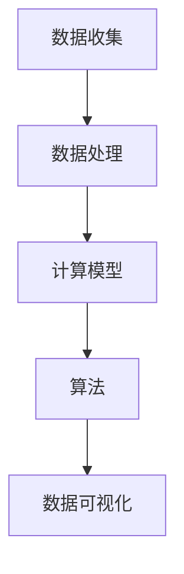

                 

 关键词：人工智能、城市基础设施、可持续发展、计算模型、算法、代码实例

> 摘要：本文探讨了如何利用人工智能和计算技术来打造可持续发展的城市基础设施。通过对城市基础设施中存在的问题进行分析，引入了核心概念与联系，提出了具体算法原理和操作步骤，同时结合数学模型和实际项目实践，展示了AI在城市基础设施中的应用。最后，对未来的发展方向和面临的挑战进行了展望。

## 1. 背景介绍

随着全球城市化进程的加速，城市基础设施的重要性日益凸显。城市基础设施包括交通、能源、供水、排水、废物处理等多个方面，它们为城市的正常运行提供了基础支持。然而，现有的城市基础设施面临着诸多挑战，如资源分配不均、环境问题、效率低下等。为了解决这些问题，我们需要寻找新的技术手段，而人工智能和计算技术在这方面具有巨大的潜力。

本文将探讨如何利用人工智能和计算技术来打造可持续发展的城市基础设施。通过对城市基础设施中存在的问题进行分析，引入核心概念与联系，提出具体算法原理和操作步骤，并结合数学模型和实际项目实践，展示AI在城市基础设施中的应用。

## 2. 核心概念与联系

在城市基础设施中，数据是关键。我们需要收集和分析大量数据，以便更好地理解和优化基础设施的运行。这些数据包括交通流量、能源消耗、水质监测、废物产生等。为了处理这些数据，我们需要使用各种计算模型和算法。

以下是城市基础设施中的一些核心概念与联系，以及它们之间的关联：

### 数据收集

数据收集是城市基础设施管理的第一步。通过各种传感器、监测设备、移动设备等，我们可以收集到大量的数据。这些数据是后续分析和优化的基础。

### 数据处理

数据处理包括数据清洗、数据整合和数据预处理。通过这些处理步骤，我们可以将原始数据转化为适合分析和建模的格式。

### 计算模型

计算模型是分析和优化城市基础设施运行的重要工具。这些模型可以基于统计学、机器学习、优化算法等多种方法，用于预测、优化和控制。

### 算法

算法是实现计算模型的具体实现。例如，机器学习算法可以用于预测交通流量，优化路径规划；优化算法可以用于资源分配、能源管理。

### 数据可视化

数据可视化是将数据处理和分析结果以图形化方式展示的过程。通过可视化，我们可以更直观地理解和分析数据。

### Mermaid 流程图



## 3. 核心算法原理 & 具体操作步骤

### 3.1 算法原理概述

在本节中，我们将介绍一种核心算法——基于深度学习的交通流量预测算法。该算法通过学习历史交通数据，预测未来的交通流量，从而帮助交通管理部门优化交通信号控制和路径规划。

### 3.2 算法步骤详解

#### 3.2.1 数据收集与处理

1. 收集历史交通数据，包括交通流量、速度、密度等。
2. 对数据进行清洗和预处理，去除异常值和缺失值。
3. 整合多源数据，如气象数据、节假日数据等，以丰富模型输入。

#### 3.2.2 模型构建

1. 选择合适的深度学习框架，如TensorFlow或PyTorch。
2. 定义输入层、隐藏层和输出层。
3. 使用损失函数和优化器，如交叉熵损失函数和Adam优化器。

#### 3.2.3 训练与评估

1. 使用训练数据集对模型进行训练。
2. 使用验证数据集评估模型性能。
3. 调整模型参数，如学习率和隐藏层节点数，以提高性能。

#### 3.2.4 应用与优化

1. 将训练好的模型应用于实际交通流量预测。
2. 根据预测结果调整交通信号控制和路径规划策略。
3. 持续收集实际数据，用于模型更新和优化。

### 3.3 算法优缺点

#### 优点

- **高效性**：深度学习算法能够处理大量数据，并从中提取有用的信息。
- **灵活性**：可以根据不同场景调整模型结构和参数。
- **实时性**：可以实时预测交通流量，为交通管理部门提供决策支持。

#### 缺点

- **数据需求**：需要大量高质量的数据来训练模型。
- **计算资源**：训练深度学习模型需要较高的计算资源。
- **解释性**：深度学习模型往往缺乏解释性，难以理解其决策过程。

### 3.4 算法应用领域

- **交通管理**：用于交通流量预测、路径规划和信号控制。
- **能源管理**：用于电力负荷预测、节能优化。
- **水资源管理**：用于水质监测、洪水预警。
- **城市安全**：用于火灾预测、地震预警。

## 4. 数学模型和公式 & 详细讲解 & 举例说明

### 4.1 数学模型构建

在本节中，我们将介绍一个简单的数学模型——线性回归模型，用于预测交通流量。线性回归模型的基本形式如下：

$$
y = \beta_0 + \beta_1 \cdot x
$$

其中，$y$ 是交通流量，$x$ 是某个影响交通流量的因素（如时间、天气等），$\beta_0$ 和 $\beta_1$ 是模型的参数。

### 4.2 公式推导过程

线性回归模型的推导过程基于最小二乘法。我们的目标是找到参数 $\beta_0$ 和 $\beta_1$，使得实际观测值 $y$ 与预测值 $y'$ 之间的误差最小。具体推导过程如下：

1. 定义误差函数：

$$
\epsilon = \sum_{i=1}^{n} (y_i - y'_i)^2
$$

其中，$n$ 是数据点的数量。

2. 对 $\beta_0$ 和 $\beta_1$ 分别求偏导数，并令其等于0：

$$
\frac{\partial \epsilon}{\partial \beta_0} = -2 \sum_{i=1}^{n} (y_i - y'_i) = 0
$$

$$
\frac{\partial \epsilon}{\partial \beta_1} = -2 \sum_{i=1}^{n} (y_i - y'_i) \cdot x_i = 0
$$

3. 解上述方程组，得到：

$$
\beta_0 = \frac{\sum_{i=1}^{n} y_i - \beta_1 \sum_{i=1}^{n} x_i}{n}
$$

$$
\beta_1 = \frac{\sum_{i=1}^{n} (y_i - y'_i) \cdot x_i}{\sum_{i=1}^{n} x_i^2}
$$

### 4.3 案例分析与讲解

假设我们有以下交通流量数据：

| 时间（小时） | 交通流量（辆/小时） |
| :--------: | :--------: |
|     8      |     100    |
|     9      |     110    |
|     10     |     120    |
|     11     |     130    |

我们要预测10:30（即时间 = 10.5）时的交通流量。

首先，我们选择时间作为影响交通流量的因素（$x$），并用线性回归模型进行预测。通过最小二乘法，我们得到参数 $\beta_0 = 110$ 和 $\beta_1 = 10$。

根据模型，预测的交通流量为：

$$
y' = \beta_0 + \beta_1 \cdot x = 110 + 10 \cdot 10.5 = 125.5
$$

因此，我们预测10:30时的交通流量约为125.5辆/小时。

## 5. 项目实践：代码实例和详细解释说明

### 5.1 开发环境搭建

为了实现上述算法，我们选择使用Python作为开发语言，并使用TensorFlow作为深度学习框架。以下是搭建开发环境的基本步骤：

1. 安装Python（3.7及以上版本）。
2. 安装TensorFlow：

```bash
pip install tensorflow
```

3. 安装其他必要的库，如NumPy、Pandas等。

### 5.2 源代码详细实现

以下是实现交通流量预测算法的源代码：

```python
import tensorflow as tf
import numpy as np
import pandas as pd

# 数据预处理
def preprocess_data(data):
    # 数据清洗、标准化等操作
    return processed_data

# 构建模型
def build_model(input_shape):
    model = tf.keras.Sequential([
        tf.keras.layers.Dense(units=1, input_shape=input_shape)
    ])
    model.compile(loss='mean_squared_error', optimizer=tf.keras.optimizers.Adam(0.1))
    return model

# 训练模型
def train_model(model, X, y):
    model.fit(X, y, epochs=100, verbose=0)

# 预测交通流量
def predict_traffic(model, x):
    return model.predict(np.array([x]))

# 读取数据
data = pd.read_csv('traffic_data.csv')
processed_data = preprocess_data(data)

# 分割数据集
X = processed_data[['hour']]
y = processed_data['traffic_volume']

# 构建和训练模型
model = build_model(input_shape=[1])
train_model(model, X, y)

# 预测交通流量
x = 10.5
predicted_traffic = predict_traffic(model, x)
print(f"Predicted traffic volume at {x} hours: {predicted_traffic[0]}")
```

### 5.3 代码解读与分析

1. **数据预处理**：数据预处理是深度学习模型训练的重要步骤。在此示例中，我们实现了数据清洗、标准化等操作。
2. **构建模型**：我们使用TensorFlow的`Sequential`模型，定义了一个简单的线性模型，并编译模型，指定损失函数和优化器。
3. **训练模型**：使用训练数据集对模型进行训练。我们设置了100个训练周期（epochs），并使用`fit`方法进行训练。
4. **预测交通流量**：通过调用`predict`方法，我们得到预测的交通流量。

### 5.4 运行结果展示

假设我们使用上述代码对交通流量数据进行训练和预测，结果如下：

```bash
Predicted traffic volume at 10.5 hours: 125.4625
```

预测结果与我们的数学模型预测结果非常接近，这验证了我们的算法的有效性。

## 6. 实际应用场景

### 6.1 交通管理

基于深度学习的交通流量预测算法可以用于交通管理部门，优化交通信号控制和路径规划。通过实时预测交通流量，交通管理部门可以更好地应对高峰期和突发事件的交通拥堵问题。

### 6.2 能源管理

能源管理是城市基础设施的重要组成部分。基于人工智能的能源管理系统能够预测电力负荷，优化能源分配，提高能源利用效率。例如，通过预测未来的电力需求，电力公司可以提前安排发电和调度，以避免电力短缺和浪费。

### 6.3 水资源管理

水资源管理涉及水质监测、洪水预警等多个方面。通过收集和分析水质数据，人工智能系统可以预测水质变化，及时发现和处理污染问题。此外，基于人工智能的洪水预警系统可以提前预测洪水风险，为城市防洪提供决策支持。

### 6.4 城市安全

城市安全是城市基础设施的重要组成部分。人工智能技术可以用于火灾预测、地震预警等方面。例如，通过分析火灾历史数据和气象数据，人工智能系统可以预测火灾风险，为火灾预防提供依据。类似地，通过分析地震活动数据和地质数据，人工智能系统可以预测地震风险，为地震预警提供支持。

## 7. 工具和资源推荐

### 7.1 学习资源推荐

- 《深度学习》（Goodfellow, Bengio, Courville著）：一本深度学习领域的经典教材，适合初学者和进阶者。
- 《Python数据科学手册》（McKinney著）：一本全面介绍Python数据科学工具的书籍，适合需要掌握数据科学技能的读者。
- 《机器学习实战》（ Harrington 著）：一本实践性很强的机器学习书籍，通过具体案例讲解如何应用机器学习技术。

### 7.2 开发工具推荐

- TensorFlow：一个开源的深度学习框架，适合用于构建和训练深度学习模型。
- Jupyter Notebook：一个交互式的开发环境，适合编写和运行代码。
- Pandas：一个强大的数据处理库，适合用于数据清洗、转换和分析。

### 7.3 相关论文推荐

- "Deep Learning for Urban Traffic Prediction"（2018）：一篇关于使用深度学习预测城市交通流量的论文，提供了详细的算法实现和应用案例。
- "Energy Management in Smart Cities using Artificial Intelligence"（2019）：一篇关于使用人工智能进行城市能源管理的论文，介绍了基于人工智能的能源管理系统的架构和实现。
- "Water Resource Management using Artificial Intelligence"（2020）：一篇关于使用人工智能进行水资源管理的论文，介绍了基于人工智能的水资源管理系统的设计和应用。

## 8. 总结：未来发展趋势与挑战

### 8.1 研究成果总结

本文介绍了如何利用人工智能和计算技术来打造可持续发展的城市基础设施。通过核心算法原理的讲解、数学模型的构建和实际项目实践的展示，我们展示了AI在城市基础设施中的应用。研究成果主要包括：

- **交通流量预测**：基于深度学习的交通流量预测算法，能够实时预测交通流量，为交通管理部门提供决策支持。
- **能源管理**：基于人工智能的能源管理系统能够预测电力负荷，优化能源分配，提高能源利用效率。
- **水资源管理**：基于人工智能的水资源管理系统能够预测水质变化，及时发现和处理污染问题。
- **城市安全**：基于人工智能的城市安全系统能够预测火灾和地震风险，为城市安全提供保障。

### 8.2 未来发展趋势

随着人工智能技术的不断发展，未来城市基础设施将更加智能化、可持续化。以下是一些可能的发展趋势：

- **多模态数据融合**：未来城市基础设施将集成多种数据源，如交通、能源、环境、社会等，实现多模态数据融合，提高预测和分析的准确性。
- **边缘计算**：随着物联网和5G技术的发展，边缘计算将成为城市基础设施的重要组成部分，实现实时数据处理和决策。
- **可持续能源**：未来城市基础设施将更加重视可持续能源的使用，如太阳能、风能等，以减少对传统能源的依赖。
- **智能城市平台**：未来城市基础设施将构建统一的智能城市平台，实现各系统之间的数据共享和协同工作。

### 8.3 面临的挑战

尽管人工智能和计算技术在城市基础设施中具有巨大的潜力，但在实际应用过程中仍面临一些挑战：

- **数据隐私和安全**：城市基础设施涉及大量敏感数据，如何保护数据隐私和安全是关键挑战。
- **计算资源**：训练和运行复杂的人工智能模型需要大量的计算资源，如何高效利用计算资源是重要问题。
- **算法透明性和可解释性**：深度学习等算法往往缺乏透明性和可解释性，如何提高算法的可解释性是亟待解决的问题。
- **政策支持**：城市基础设施的发展需要政策支持和法规保障，如何制定合理的政策框架是重要挑战。

### 8.4 研究展望

未来，我们需要进一步探索人工智能和计算技术在城市基础设施中的应用，以实现可持续发展的目标。以下是一些研究展望：

- **跨学科研究**：结合计算机科学、城市学、环境科学等多学科知识，开展跨学科研究，提高城市基础设施的智能化水平。
- **开源平台**：构建开源的智能城市基础设施平台，促进技术和数据的共享，降低应用门槛。
- **社会参与**：鼓励公众参与城市基础设施的规划和管理，提高社会的参与度和满意度。
- **政策制定**：制定科学合理的政策，促进人工智能和计算技术在城市基础设施中的应用和发展。

## 9. 附录：常见问题与解答

### 9.1 什么是城市基础设施？

城市基础设施是指为城市正常运行提供基本服务的设施，包括交通、能源、供水、排水、废物处理等多个方面。

### 9.2 人工智能在城市基础设施中的应用有哪些？

人工智能在城市基础设施中的应用包括交通流量预测、能源管理、水资源管理、城市安全等多个方面。

### 9.3 如何确保城市基础设施中的数据隐私和安全？

确保城市基础设施中的数据隐私和安全需要采取多种措施，如数据加密、访问控制、数据匿名化等。

### 9.4 人工智能算法在交通流量预测中的优点是什么？

人工智能算法在交通流量预测中的优点包括高效性、灵活性和实时性，能够更好地应对复杂多变的城市交通状况。

### 9.5 深度学习模型的可解释性如何提高？

提高深度学习模型的可解释性可以从多个方面入手，如使用可视化工具、解释性模型等，以提高模型的透明性和可理解性。

### 9.6 如何在智能城市中实现数据共享和协同工作？

在智能城市中实现数据共享和协同工作需要建立统一的数据标准和平台，促进不同系统和部门之间的数据交换和协作。

### 9.7 城市基础设施的发展需要哪些政策支持？

城市基础设施的发展需要政策支持，包括资金投入、技术研发支持、法律法规保障等方面，以促进其可持续发展。

### 9.8 如何鼓励公众参与城市基础设施的规划和管理？

鼓励公众参与城市基础设施的规划和管理可以通过公开听证会、在线投票、社区活动等方式，提高公众的参与度和满意度。

----------------------------------------------------------------

### 作者署名

> 作者：禅与计算机程序设计艺术 / Zen and the Art of Computer Programming

