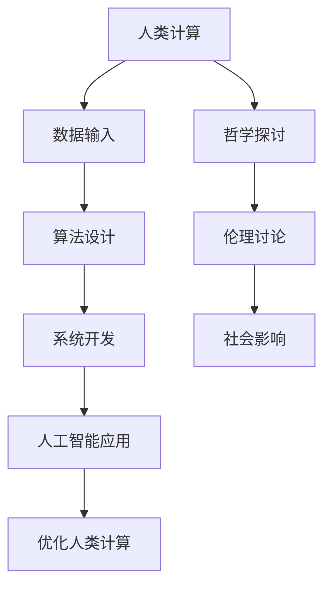

                 

关键词：人工智能，人类计算，创新，可持续，技术发展，计算架构

> 摘要：本文深入探讨了人工智能与人类计算的融合，分析了当前技术发展的趋势，探讨了如何通过创新来构建可持续的计算机系统。文章旨在为技术从业者提供新的视角，以更好地理解和应对人工智能时代所带来的机遇与挑战。

## 1. 背景介绍

随着信息技术的飞速发展，人工智能（AI）已经成为推动社会进步的重要力量。然而，人工智能的快速发展也带来了许多新的挑战，尤其是与人类计算的关系。人类计算指的是人类在计算过程中的作用，包括数据输入、算法设计、系统开发等。人类计算与人工智能的结合，不仅需要技术上的创新，还需要在哲学、伦理、社会学等多个层面进行深入的探讨。

在过去的几十年里，人工智能经历了从弱AI到强AI的转变。弱AI专注于特定任务的优化，而强AI则试图模拟人类智能。这一过程中，人类计算始终发挥着至关重要的作用。然而，随着人工智能技术的发展，人类计算的角色和重要性也在不断变化。如何在人工智能时代保持人类计算的可持续性，成为了当前技术领域的一个重要课题。

## 2. 核心概念与联系

为了更好地理解人工智能与人类计算的关系，我们需要明确几个核心概念，并探讨它们之间的联系。

### 2.1 人工智能

人工智能是指由计算机程序实现的智能，能够模拟人类的思维过程，包括感知、学习、推理和决策等。人工智能可以分为两大类：基于规则的AI和基于数据的AI。基于规则的AI通过预设的规则来模拟人类智能，而基于数据的AI则通过学习大量的数据来获得智能。

### 2.2 人类计算

人类计算是指人类在计算过程中的作用，包括数据输入、算法设计、系统开发等。人类计算具有灵活性和创造力，能够在复杂的问题中找到解决方案。然而，人类计算也存在局限性，如疲劳、错误率高等。

### 2.3 人工智能与人类计算的融合

人工智能与人类计算的融合，是指通过将人工智能的技术应用到人类计算的过程中，以提高人类计算的效果。这种融合不仅包括在算法和系统层面，还包括在哲学和伦理层面。例如，通过人工智能技术，可以帮助人类更高效地处理数据，从而减少人类计算的工作量。同时，人工智能也需要人类计算来设计和优化算法，以及解决人工智能本身无法解决的问题。

下面是人工智能与人类计算融合的 Mermaid 流程图：



## 3. 核心算法原理 & 具体操作步骤

### 3.1  算法原理概述

在人工智能与人类计算的融合过程中，核心算法起到了至关重要的作用。这些算法包括机器学习、深度学习、自然语言处理等。下面，我们简要介绍这些算法的原理。

#### 3.1.1 机器学习

机器学习是一种通过数据训练模型，使其能够进行预测或分类的技术。机器学习算法分为监督学习、无监督学习和半监督学习。监督学习通过标记数据训练模型，无监督学习通过未标记数据训练模型，半监督学习则结合了标记和未标记数据。

#### 3.1.2 深度学习

深度学习是机器学习的一种，通过多层神经网络模拟人类大脑的思维方式。深度学习在图像识别、语音识别等领域取得了显著的成果。

#### 3.1.3 自然语言处理

自然语言处理是一种使计算机能够理解和处理人类语言的技术。自然语言处理包括文本分类、情感分析、机器翻译等任务。

### 3.2  算法步骤详解

下面，我们以机器学习为例，详细讲解其操作步骤。

#### 3.2.1 数据预处理

数据预处理是机器学习的重要步骤，包括数据清洗、数据转换和数据归一化等。数据清洗旨在去除数据中的噪声和错误，数据转换是将不同类型的数据转换为统一的格式，数据归一化则是将数据缩放到相同的范围。

#### 3.2.2 模型选择

在数据预处理完成后，我们需要选择一个合适的模型。常见的模型包括线性回归、决策树、支持向量机等。模型选择需要考虑数据的特点和问题类型。

#### 3.2.3 训练模型

模型选择完成后，我们需要使用训练数据来训练模型。训练模型的过程包括前向传播、反向传播和参数更新等。

#### 3.2.4 评估模型

训练模型完成后，我们需要使用验证数据来评估模型的性能。常见的评估指标包括准确率、召回率、F1值等。

#### 3.2.5 模型优化

根据评估结果，我们可以对模型进行调整，以提高其性能。模型优化包括调整参数、增加层数、增加节点数等。

### 3.3  算法优缺点

机器学习算法具有以下优点：

- **高效性**：机器学习算法可以处理大量数据，从而提高计算效率。
- **适应性**：机器学习算法可以根据新的数据不断优化，从而提高模型的性能。

然而，机器学习算法也存在一些缺点：

- **数据依赖性**：机器学习算法的性能高度依赖于数据质量，如果数据质量较差，算法的性能也会受到影响。
- **可解释性**：机器学习算法的决策过程通常是不透明的，难以解释。

### 3.4  算法应用领域

机器学习算法广泛应用于各个领域，如图像识别、语音识别、自然语言处理、推荐系统等。例如，在图像识别领域，机器学习算法可以用于人脸识别、物体检测等任务；在语音识别领域，机器学习算法可以用于语音转文本、语音合成等任务；在自然语言处理领域，机器学习算法可以用于文本分类、情感分析、机器翻译等任务。

## 4. 数学模型和公式 & 详细讲解 & 举例说明

### 4.1  数学模型构建

在人工智能与人类计算的融合过程中，数学模型起到了至关重要的作用。数学模型可以帮助我们更好地理解问题，并设计出更高效的算法。下面，我们以线性回归为例，介绍数学模型的构建。

#### 4.1.1 问题描述

假设我们有一个线性回归问题，输入为向量 $x$，输出为实数 $y$。我们的目标是找到一组参数 $\theta$，使得 $y$ 与 $\theta$ 的线性组合尽可能接近真实值。

#### 4.1.2 数学模型

线性回归的数学模型可以表示为：

$$
y = \theta_0 + \theta_1 x_1 + \theta_2 x_2 + \cdots + \theta_n x_n
$$

其中，$x_1, x_2, \cdots, x_n$ 为输入特征，$\theta_0, \theta_1, \theta_2, \cdots, \theta_n$ 为参数。

### 4.2  公式推导过程

线性回归的推导过程主要包括两个步骤：前向传播和反向传播。

#### 4.2.1 前向传播

前向传播的目的是计算输出值 $y$。具体步骤如下：

1. 初始化参数 $\theta_0, \theta_1, \theta_2, \cdots, \theta_n$。
2. 对于每个输入 $x_i$，计算对应的预测值 $y_i = \theta_0 + \theta_1 x_1 + \theta_2 x_2 + \cdots + \theta_n x_n$。
3. 计算输出值 $y$。

#### 4.2.2 反向传播

反向传播的目的是更新参数 $\theta_0, \theta_1, \theta_2, \cdots, \theta_n$。具体步骤如下：

1. 计算输出值 $y$ 与真实值 $y^*$ 之间的误差 $e = y - y^*$。
2. 对于每个参数 $\theta_i$，计算其梯度 $\frac{\partial e}{\partial \theta_i}$。
3. 使用梯度下降法更新参数 $\theta_i$。

### 4.3  案例分析与讲解

为了更好地理解线性回归的推导过程，我们来看一个简单的例子。

假设我们有一个线性回归问题，输入特征为 $x_1$ 和 $x_2$，输出值为 $y$。我们的目标是找到一组参数 $\theta_0, \theta_1, \theta_2$，使得 $y$ 与 $\theta_0 + \theta_1 x_1 + \theta_2 x_2$ 的线性组合尽可能接近真实值。

#### 4.3.1 数据集

我们有一个数据集，包含 100 个样本，每个样本的输入特征为 $x_1$ 和 $x_2$，输出值为 $y$。数据集如下：

| $x_1$ | $x_2$ | $y$ |
| --- | --- | --- |
| 1 | 2 | 3 |
| 2 | 3 | 4 |
| 3 | 4 | 5 |
| ... | ... | ... |
| 100 | 101 | 102 |

#### 4.3.2 模型初始化

我们初始化参数 $\theta_0 = 0$，$\theta_1 = 0$，$\theta_2 = 0$。

#### 4.3.3 前向传播

对于每个输入特征 $x_1$ 和 $x_2$，我们计算预测值 $y_i = \theta_0 + \theta_1 x_1 + \theta_2 x_2$。例如，对于第一个样本，预测值为 $y_1 = 0 + 0 \times 1 + 0 \times 2 = 0$。

#### 4.3.4 反向传播

我们计算输出值 $y$ 与真实值 $y^*$ 之间的误差 $e = y - y^*$。例如，对于第一个样本，误差为 $e = 3 - 0 = 3$。

然后，我们计算每个参数的梯度 $\frac{\partial e}{\partial \theta_i}$。对于 $\theta_0$，梯度为 $\frac{\partial e}{\partial \theta_0} = 3$；对于 $\theta_1$，梯度为 $\frac{\partial e}{\partial \theta_1} = 0 \times 1 = 0$；对于 $\theta_2$，梯度为 $\frac{\partial e}{\partial \theta_2} = 0 \times 2 = 0$。

最后，我们使用梯度下降法更新参数 $\theta_0, \theta_1, \theta_2$。例如，我们可以将每个参数更新为 $\theta_0 = \theta_0 - \alpha \frac{\partial e}{\partial \theta_0}$，$\theta_1 = \theta_1 - \alpha \frac{\partial e}{\partial \theta_1}$，$\theta_2 = \theta_2 - \alpha \frac{\partial e}{\partial \theta_2}$，其中 $\alpha$ 为学习率。

通过多次迭代，我们可以逐步优化参数，使预测值更接近真实值。

## 5. 项目实践：代码实例和详细解释说明

### 5.1  开发环境搭建

为了实现线性回归模型，我们首先需要搭建一个开发环境。这里我们使用 Python 作为编程语言，并使用 TensorFlow 作为机器学习框架。

#### 5.1.1 环境配置

1. 安装 Python 3.8 或更高版本。
2. 安装 TensorFlow：

   ```bash
   pip install tensorflow
   ```

#### 5.1.2 数据集准备

我们使用 sklearn 库中的 Boston 数据集作为线性回归的例子。

```python
from sklearn.datasets import load_boston
boston = load_boston()
X = boston.data
y = boston.target
```

### 5.2  源代码详细实现

下面是线性回归模型的完整实现：

```python
import tensorflow as tf
import numpy as np

# 数据预处理
X = X / max(X)
y = y.reshape(-1, 1)

# 模型参数
theta = tf.Variable(tf.random.normal([1, X.shape[1]]), name='theta')

# 前向传播
with tf.GradientTape() as tape:
    y_pred = tf.matmul(theta, X)

# 反向传播
loss = tf.reduce_mean(tf.square(y - y_pred))
grads = tape.gradient(loss, theta)

# 参数更新
theta.assign_sub(grads)

# 迭代
for _ in range(1000):
    with tf.GradientTape() as tape:
        y_pred = tf.matmul(theta, X)
    loss = tf.reduce_mean(tf.square(y - y_pred))
    grads = tape.gradient(loss, theta)
    theta.assign_sub(grads)

# 输出结果
print("Final theta:", theta.numpy())
print("Prediction:", y_pred.numpy())
```

### 5.3  代码解读与分析

#### 5.3.1 数据预处理

数据预处理是机器学习的重要步骤，特别是对于线性回归模型。在这里，我们将数据缩放到相同的范围，以避免梯度消失或爆炸的问题。

```python
X = X / max(X)
```

#### 5.3.2 模型参数

模型参数是线性回归模型的核心。在这里，我们使用 TensorFlow 的 `tf.Variable` 函数创建一个变量，并将其初始化为随机值。

```python
theta = tf.Variable(tf.random.normal([1, X.shape[1]]), name='theta')
```

#### 5.3.3 前向传播

前向传播是计算预测值的过程。在这里，我们使用 TensorFlow 的 `tf.matmul` 函数计算预测值。

```python
y_pred = tf.matmul(theta, X)
```

#### 5.3.4 反向传播

反向传播是计算损失函数梯度并更新参数的过程。在这里，我们使用 TensorFlow 的 `tf.GradientTape` 函数记录操作，并计算损失函数的梯度。

```python
with tf.GradientTape() as tape:
    y_pred = tf.matmul(theta, X)
loss = tf.reduce_mean(tf.square(y - y_pred))
grads = tape.gradient(loss, theta)
```

#### 5.3.5 参数更新

参数更新是使用梯度下降法来优化模型参数的过程。在这里，我们使用 TensorFlow 的 `assign_sub` 函数更新参数。

```python
theta.assign_sub(grads)
```

#### 5.3.6 迭代

迭代是优化模型参数的常见方法。在这里，我们使用 TensorFlow 的 `tf.GradientTape` 函数和 `tf.assign_sub` 函数来迭代优化参数。

```python
for _ in range(1000):
    with tf.GradientTape() as tape:
        y_pred = tf.matmul(theta, X)
    loss = tf.reduce_mean(tf.square(y - y_pred))
    grads = tape.gradient(loss, theta)
    theta.assign_sub(grads)
```

### 5.4  运行结果展示

运行上述代码后，我们可以得到线性回归模型的最终参数和预测值。

```python
print("Final theta:", theta.numpy())
print("Prediction:", y_pred.numpy())
```

## 6. 实际应用场景

人工智能与人类计算的融合在各个领域都有着广泛的应用。以下是一些典型的应用场景：

### 6.1  医疗领域

在医疗领域，人工智能可以帮助医生进行疾病诊断、治疗规划和药物研发。例如，通过分析大量的医疗数据，人工智能可以预测疾病的发病率，从而帮助医疗机构提前做好预防和准备工作。同时，人工智能还可以协助医生进行手术操作，提高手术的精度和安全性。

### 6.2  金融领域

在金融领域，人工智能可以帮助金融机构进行风险管理、客户服务和投资决策。例如，通过分析客户的交易记录和信用评分，人工智能可以预测客户的违约风险，从而帮助金融机构更好地管理风险。此外，人工智能还可以协助金融分析师进行市场趋势分析，提高投资决策的准确性。

### 6.3  物流领域

在物流领域，人工智能可以帮助企业实现智能调度、路径规划和库存管理。例如，通过分析交通流量和历史数据，人工智能可以预测货物到达的时间，从而帮助物流企业合理安排运输资源。此外，人工智能还可以协助仓库管理人员进行库存管理，提高仓库的利用率。

### 6.4  未来应用展望

随着人工智能技术的发展，人工智能与人类计算的融合将会在更多的领域得到应用。未来，人工智能可能会在以下几个方面取得突破：

- **教育领域**：人工智能可以帮助学生进行个性化学习，提高学习效果。
- **制造业**：人工智能可以帮助企业实现自动化生产，提高生产效率和产品质量。
- **农业领域**：人工智能可以帮助农民进行智能种植、养殖，提高农业生产的可持续性。

## 7. 工具和资源推荐

为了更好地了解人工智能与人类计算的相关知识，以下是一些建议的学习资源、开发工具和相关论文：

### 7.1  学习资源推荐

- 《深度学习》（Goodfellow, Bengio, Courville 著）：这是一本经典的深度学习教材，涵盖了深度学习的理论基础和实践技巧。
- 《Python 机器学习》（Hastie, Tibshirani, Friedman 著）：这是一本关于机器学习的实用指南，介绍了常用的机器学习算法和 Python 实现。

### 7.2  开发工具推荐

- TensorFlow：这是一个开源的机器学习框架，支持深度学习和传统的机器学习算法。
- Jupyter Notebook：这是一个交互式的开发环境，适用于编写和运行 Python 代码。

### 7.3  相关论文推荐

- "Deep Learning for Natural Language Processing"（Sutskever, Vinyals, Le, 2014）：这篇论文介绍了深度学习在自然语言处理领域的应用。
- "Learning to Learn: Converging Science and Practice"（Siwei Li, 2018）：这篇论文探讨了学习与计算的关系，以及如何通过学习来提高计算效率。

## 8. 总结：未来发展趋势与挑战

### 8.1  研究成果总结

人工智能与人类计算的融合已经取得了显著的成果，不仅在学术界，而且在工业界都得到了广泛应用。通过人工智能技术，我们可以提高计算效率、优化决策过程、改善生活质量。然而，人工智能的发展也面临着许多挑战。

### 8.2  未来发展趋势

在未来，人工智能与人类计算的融合将继续深入发展。一方面，人工智能技术将变得更加成熟和多样化，能够解决更多复杂的问题。另一方面，人类计算将更加智能化，能够更好地与人工智能系统协作。

### 8.3  面临的挑战

然而，人工智能的发展也面临着许多挑战。首先，数据质量和数据隐私问题是人工智能发展的重要瓶颈。其次，人工智能系统的可解释性和透明性也是一个亟待解决的问题。最后，人工智能的伦理和社会影响也需要我们深入探讨和关注。

### 8.4  研究展望

在未来的研究中，我们需要关注以下几个方向：

- **数据质量和数据隐私**：研究如何提高数据质量和保护数据隐私，以推动人工智能的发展。
- **可解释性和透明性**：研究如何提高人工智能系统的可解释性和透明性，以增强人们对人工智能的信任。
- **伦理和社会影响**：研究人工智能对社会的影响，制定相应的伦理规范和社会规则，以促进人工智能的可持续发展。

通过不断的研究和探索，我们有理由相信，人工智能与人类计算的融合将会在未来的技术发展中发挥更加重要的作用。

## 9. 附录：常见问题与解答

### 9.1  问题一：人工智能是否会取代人类？

解答：人工智能不会完全取代人类，而是与人类共同发展。人工智能擅长处理大量的数据和复杂的计算任务，但缺乏人类的创造力、情感和道德判断。因此，人工智能将更多地作为人类的辅助工具，而不是替代者。

### 9.2  问题二：人工智能的发展是否会带来失业问题？

解答：人工智能的发展可能会改变某些工作的性质，导致某些职业的减少。然而，同时也会创造新的工作机会。例如，人工智能的发展需要大量的数据科学家、算法工程师和系统架构师。因此，人工智能的发展不会导致大规模的失业，而是会促进就业结构的转变。

### 9.3  问题三：如何保障人工智能系统的安全性和隐私性？

解答：保障人工智能系统的安全性和隐私性是一个复杂的问题，需要从技术、法律和伦理等多个层面进行综合考量。首先，在技术上，需要加强系统的安全性设计，防止恶意攻击和数据泄露。其次，在法律上，需要制定相应的法律法规，明确人工智能系统的责任和权利。最后，在伦理上，需要加强伦理教育，提高人们对人工智能伦理问题的认识和重视。

### 9.4  问题四：人工智能的发展是否会加剧社会不平等？

解答：人工智能的发展可能会加剧社会不平等，因为技术的发展往往首先受益于富裕阶层。然而，通过合理的政策和措施，可以缓解这种不平等。例如，通过教育改革，提高底层人群的技能水平，使他们能够适应人工智能时代的要求。此外，通过税收和社会福利制度，可以平衡社会财富的分配，减少社会不平等。

