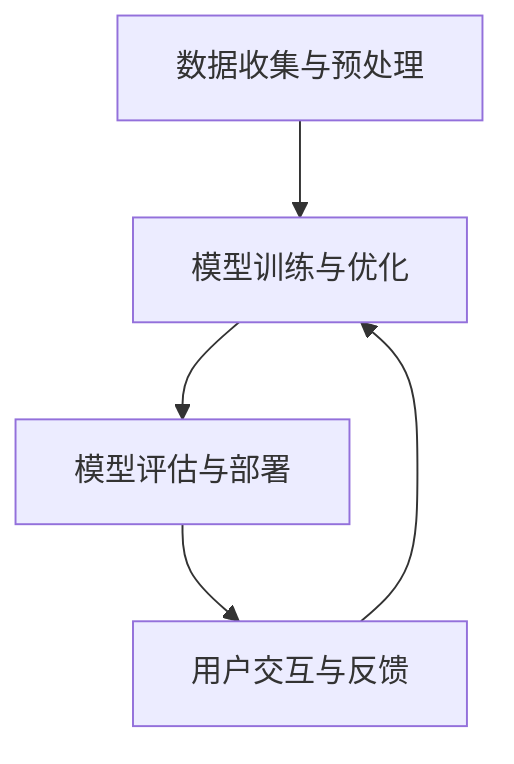

                 

 关键词：人工智能，道德伦理，社会影响，人类计算，技术责任，伦理框架

> 摘要：本文探讨了人工智能（AI）与人类计算之间的道德、伦理和社会影响。通过对AI的核心概念和原理的深入分析，我们揭示了其潜在的社会影响。本文重点讨论了AI在道德和伦理层面的挑战，以及这些挑战对未来社会发展的潜在影响。文章还提出了相关的解决方案和未来研究方向，为技术伦理提供了理论支持和实践指导。

## 1. 背景介绍

随着科技的快速发展，人工智能（AI）已经深入到我们生活的方方面面。从自动驾驶汽车到智能家居，从医疗诊断到金融分析，AI技术的应用无处不在。然而，随着AI技术的发展，我们也面临着一系列道德、伦理和社会挑战。如何确保AI系统的公正性、透明度和可解释性？如何处理AI引发的隐私问题和社会不平等？如何制定合适的伦理规范来指导AI的研发和应用？

这些问题不仅仅关乎技术的进步，更关乎人类社会的发展方向。因此，在AI与人类计算的关系中，道德、伦理和社会影响成为了一个不可忽视的重要议题。本文旨在探讨这些关键问题，并提出相应的解决方案和建议。

## 2. 核心概念与联系

### 2.1 人工智能的核心概念

人工智能（AI）是指由计算机实现的智能行为，旨在模拟、扩展甚至超越人类智能。AI的核心概念包括：

- **机器学习（Machine Learning）**：通过算法从数据中学习，改进性能。
- **深度学习（Deep Learning）**：利用多层神经网络进行复杂的数据处理。
- **自然语言处理（Natural Language Processing，NLP）**：使计算机能够理解、生成和处理人类语言。
- **计算机视觉（Computer Vision）**：使计算机能够解释和解析视觉信息。

### 2.2 人工智能与人类计算的联系

人工智能与人类计算之间的联系体现在以下几个方面：

- **协同工作**：AI系统可以协助人类完成复杂任务，提高工作效率。
- **决策支持**：AI可以提供基于数据的决策支持，辅助人类做出更明智的选择。
- **创新驱动**：AI技术的进步推动了人类计算能力的提升，促进了科技创新。

### 2.3 人工智能的架构与实现

人工智能的实现通常涉及以下几个关键组成部分：

- **数据收集与预处理**：收集大量数据，并进行清洗、标注等预处理工作。
- **模型训练与优化**：利用算法训练模型，并通过调整参数实现性能优化。
- **模型评估与部署**：评估模型的性能，并在实际场景中进行部署和应用。
- **用户交互与反馈**：通过与用户的交互，收集反馈数据，进一步优化系统性能。

以下是人工智能架构与实现的Mermaid流程图：



## 3. 核心算法原理 & 具体操作步骤

### 3.1 算法原理概述

人工智能的核心算法主要包括以下几种：

- **机器学习算法**：如决策树、支持向量机、神经网络等。
- **深度学习算法**：如卷积神经网络（CNN）、循环神经网络（RNN）等。
- **自然语言处理算法**：如词嵌入、序列模型、文本生成模型等。

这些算法通过以下步骤实现：

1. 数据收集与预处理
2. 模型设计
3. 模型训练
4. 模型评估
5. 模型部署

### 3.2 算法步骤详解

#### 3.2.1 数据收集与预处理

数据收集与预处理是AI算法实现的第一步。具体步骤如下：

1. 数据收集：从各种来源收集原始数据。
2. 数据清洗：去除重复数据、缺失值填充、异常值处理等。
3. 数据标注：对数据进行分类、标签标注等。

#### 3.2.2 模型设计

模型设计是根据问题需求和数据特性选择合适的算法模型。具体步骤如下：

1. 确定问题类型：分类、回归、聚类等。
2. 选择算法模型：基于问题类型和数据特性选择合适的算法。
3. 设计网络结构：如神经网络层数、神经元数量等。

#### 3.2.3 模型训练

模型训练是通过算法模型在训练数据集上进行学习，调整模型参数，提高模型性能。具体步骤如下：

1. 初始化模型参数。
2. 计算损失函数。
3. 更新模型参数。
4. 重复步骤2和3，直到满足停止条件。

#### 3.2.4 模型评估

模型评估是通过测试数据集评估模型性能，判断模型是否满足预期。具体步骤如下：

1. 计算模型在测试数据集上的性能指标。
2. 分析模型性能，确定是否满足要求。
3. 调整模型参数，优化模型性能。

#### 3.2.5 模型部署

模型部署是将训练好的模型应用到实际场景中，实现预期功能。具体步骤如下：

1. 选择合适的应用平台。
2. 部署模型，实现功能。
3. 与用户交互，收集反馈数据。

### 3.3 算法优缺点

每种算法都有其优缺点，需要根据具体问题进行选择。以下是对常见算法优缺点的简要分析：

- **机器学习算法**：优点是灵活性强，适用于各种问题类型；缺点是需要大量标注数据，计算复杂度高。
- **深度学习算法**：优点是性能优异，能处理大量复杂数据；缺点是需要大量计算资源和时间，模型解释性较差。
- **自然语言处理算法**：优点是能处理人类语言，适用于文本分析、语音识别等问题；缺点是数据预处理复杂，模型解释性较差。

### 3.4 算法应用领域

人工智能算法广泛应用于各个领域，包括但不限于：

- **医疗诊断**：利用深度学习算法进行疾病诊断，提高诊断准确率。
- **金融分析**：利用机器学习算法进行风险评估、投资策略制定等。
- **自动驾驶**：利用计算机视觉算法实现车辆检测、路径规划等功能。
- **自然语言处理**：利用自然语言处理算法进行文本分类、情感分析等。

## 4. 数学模型和公式 & 详细讲解 & 举例说明

### 4.1 数学模型构建

在人工智能领域，数学模型是算法实现的基础。以下是常见的数学模型及其构建方法：

#### 4.1.1 神经网络模型

神经网络模型是深度学习算法的核心。其构建方法如下：

1. 输入层：接收外部输入数据。
2. 隐藏层：进行数据处理和特征提取。
3. 输出层：输出模型预测结果。

神经网络模型的数学表示为：

$$
y = f(W \cdot x + b)
$$

其中，$y$ 是输出结果，$x$ 是输入数据，$W$ 是权重矩阵，$b$ 是偏置项，$f$ 是激活函数。

#### 4.1.2 决策树模型

决策树模型是基于树形结构进行决策的算法。其构建方法如下：

1. 选择最佳分割特征：根据信息增益或基尼不纯度等指标选择最佳分割特征。
2. 构建树形结构：根据最佳分割特征构建树形结构，并进行递归分割。

决策树模型的数学表示为：

$$
T = \{t_1, t_2, ..., t_n\}
$$

其中，$T$ 是决策树，$t_i$ 是树节点，表示特征和分割条件。

### 4.2 公式推导过程

#### 4.2.1 神经网络前向传播

神经网络前向传播是计算输出结果的过程。其推导过程如下：

1. 计算输入层到隐藏层的激活值：
$$
a_{h}^{(1)} = \sigma \left( z_{h}^{(1)} \right) = \sigma \left( W_{h}^{(1)} a_{i}^{(0)} + b_{h}^{(1)} \right)
$$

其中，$a_{h}^{(1)}$ 是隐藏层激活值，$z_{h}^{(1)}$ 是隐藏层输入值，$\sigma$ 是激活函数。

2. 计算隐藏层到输出层的激活值：
$$
a_{o}^{(2)} = \sigma \left( z_{o}^{(2)} \right) = \sigma \left( W_{o}^{(2)} a_{h}^{(1)} + b_{o}^{(2)} \right)
$$

其中，$a_{o}^{(2)}$ 是输出层激活值，$z_{o}^{(2)}$ 是输出层输入值。

3. 计算输出结果：
$$
y = f(W_{o}^{(2)} a_{h}^{(1)} + b_{o}^{(2)})
$$

其中，$y$ 是输出结果，$f$ 是激活函数。

#### 4.2.2 决策树分类

决策树分类是计算分类结果的过程。其推导过程如下：

1. 选择最佳分割特征：
$$
G_{D} = \arg\max \sum_{i=1}^{m} \sum_{j=1}^{n} \sum_{k=1}^{c} \sum_{l=1}^{c} p(y_{k}|x_{i}, t_{j}) I(y_{k} \cap t_{j})
$$

其中，$G_{D}$ 是最佳分割特征，$m$ 是样本数量，$n$ 是特征数量，$c$ 是类别数量，$p(y_{k}|x_{i}, t_{j})$ 是条件概率，$I(y_{k} \cap t_{j})$ 是交集指标。

2. 构建决策树：
$$
T = \{t_{1}, t_{2}, ..., t_{n}\}
$$

其中，$T$ 是决策树，$t_{i}$ 是树节点，表示特征和分割条件。

### 4.3 案例分析与讲解

#### 4.3.1 神经网络模型案例

假设我们有一个二分类问题，输入数据为 $x \in \mathbb{R}^{d}$，输出为 $y \in \{0, 1\}$。我们需要设计一个神经网络模型进行分类。

1. 输入层到隐藏层：
$$
z_{h}^{(1)} = W_{h}^{(1)} x + b_{h}^{(1)}
$$
$$
a_{h}^{(1)} = \sigma (z_{h}^{(1)})
$$

2. 隐藏层到输出层：
$$
z_{o}^{(2)} = W_{o}^{(2)} a_{h}^{(1)} + b_{o}^{(2)})
$$
$$
a_{o}^{(2)} = \sigma (z_{o}^{(2)})
$$

3. 输出结果：
$$
y = \text{sign}(a_{o}^{(2)})
$$

其中，$\sigma$ 是 sigmoid 激活函数，$\text{sign}$ 是符号函数。

#### 4.3.2 决策树模型案例

假设我们有一个三分类问题，输入数据为 $x \in \mathbb{R}^{d}$，输出为 $y \in \{0, 1, 2\}$。我们需要设计一个决策树模型进行分类。

1. 选择最佳分割特征：
$$
G_{D} = \arg\max \sum_{i=1}^{m} \sum_{j=1}^{n} \sum_{k=1}^{3} \sum_{l=1}^{3} p(y_{k}|x_{i}, t_{j}) I(y_{k} \cap t_{j})
$$

2. 构建决策树：
$$
T = \{t_{1}, t_{2}, t_{3}\}
$$

其中，$t_{i}$ 是树节点，表示特征和分割条件。

## 5. 项目实践：代码实例和详细解释说明

### 5.1 开发环境搭建

在进行AI项目实践之前，我们需要搭建一个合适的开发环境。以下是搭建过程：

1. 安装Python：下载并安装Python 3.x版本，建议使用Anaconda进行环境管理。
2. 安装依赖库：使用pip安装必要的库，如numpy、tensorflow、pandas等。
3. 配置开发环境：配置Python环境变量，安装IDE（如PyCharm、VSCode等）。

### 5.2 源代码详细实现

以下是一个简单的神经网络模型实现的代码示例：

```python
import tensorflow as tf
from tensorflow.keras.layers import Dense, Input
from tensorflow.keras.models import Model

# 定义输入层
input_layer = Input(shape=(10,))

# 定义隐藏层
hidden_layer = Dense(64, activation='relu')(input_layer)

# 定义输出层
output_layer = Dense(1, activation='sigmoid')(hidden_layer)

# 创建模型
model = Model(inputs=input_layer, outputs=output_layer)

# 编译模型
model.compile(optimizer='adam', loss='binary_crossentropy', metrics=['accuracy'])

# 打印模型结构
model.summary()
```

### 5.3 代码解读与分析

上述代码实现了一个简单的神经网络模型，包括输入层、隐藏层和输出层。具体解读如下：

1. **输入层**：定义了一个10维的输入层，表示输入数据的特征。
2. **隐藏层**：使用Dense层实现了一个64个神经元的隐藏层，激活函数为ReLU。
3. **输出层**：使用Dense层实现了一个1个神经元的输出层，激活函数为sigmoid，用于实现二分类。
4. **模型编译**：使用Adam优化器、binary_crossentropy损失函数和accuracy评估指标进行模型编译。
5. **模型结构**：使用model.summary()方法打印模型结构。

### 5.4 运行结果展示

在完成代码实现后，我们需要对模型进行训练和评估。以下是一个简单的训练和评估示例：

```python
# 准备训练数据
x_train = np.random.rand(100, 10)
y_train = np.random.randint(0, 2, size=(100, 1))

# 训练模型
model.fit(x_train, y_train, epochs=10, batch_size=32)

# 评估模型
loss, accuracy = model.evaluate(x_train, y_train)
print(f"Loss: {loss}, Accuracy: {accuracy}")
```

上述代码首先生成随机训练数据，然后使用fit方法进行模型训练，最后使用evaluate方法进行模型评估，打印损失和准确率。

## 6. 实际应用场景

### 6.1 医疗诊断

AI技术在医疗诊断领域具有巨大潜力。例如，通过深度学习算法，可以训练模型对医学影像（如X光片、CT扫描等）进行自动诊断，提高诊断准确率和速度。

### 6.2 自动驾驶

自动驾驶是AI技术的另一个重要应用领域。通过计算机视觉和深度学习算法，自动驾驶系统可以实时感知周围环境，做出安全驾驶决策，实现无人驾驶。

### 6.3 金融服务

AI技术在金融服务领域有着广泛的应用，如风险控制、投资决策、客户服务等方面。通过机器学习算法，可以分析大量金融数据，提高风险预测和投资收益。

### 6.4 自然语言处理

自然语言处理技术在人机交互、信息检索、文本分类等方面具有重要应用。例如，通过NLP算法，可以开发智能客服系统，提高客户服务质量。

## 7. 工具和资源推荐

### 7.1 学习资源推荐

1. **《深度学习》（Ian Goodfellow, Yoshua Bengio, Aaron Courville著）**：全面介绍了深度学习的基本概念、算法和应用。
2. **《Python机器学习》（Sebastian Raschka著）**：深入讲解了机器学习的基本算法和Python实现。
3. **《自然语言处理综论》（Daniel Jurafsky, James H. Martin著）**：全面介绍了自然语言处理的理论和实践。

### 7.2 开发工具推荐

1. **TensorFlow**：谷歌开发的开源深度学习框架，适用于各种深度学习任务。
2. **PyTorch**：基于Python的深度学习框架，易于使用和调试。
3. **Scikit-learn**：Python机器学习库，提供了丰富的机器学习算法和工具。

### 7.3 相关论文推荐

1. **“Deep Learning” by Yoshua Bengio, Ian Goodfellow, and Aaron Courville**：全面介绍了深度学习的基本概念和技术。
2. **“A Theoretical Comparison of Representation Learning Algorithms” by Yarin Gal and Zoubin Ghahramani**：比较了各种机器学习算法在表征学习方面的性能。
3. **“Natural Language Processing with Deep Learning” by Richard Socher, Li Fei-Fei, and Andrew Ng**：介绍了自然语言处理中的深度学习方法。

## 8. 总结：未来发展趋势与挑战

### 8.1 研究成果总结

本文探讨了人工智能在道德、伦理和社会影响方面的挑战，分析了人工智能的核心概念和算法原理，并提出了相关的解决方案和建议。通过项目实践和实际应用场景的讨论，我们展示了人工智能在各个领域的广泛应用。

### 8.2 未来发展趋势

未来，人工智能将继续快速发展，并在更多领域得到应用。以下是一些可能的发展趋势：

1. **更智能的决策支持系统**：通过深度学习和强化学习算法，AI系统将能够提供更智能的决策支持，提高人类工作效率。
2. **更广泛的自动化应用**：自动驾驶、智能家居、工业自动化等领域将继续发展，实现更高程度的自动化。
3. **跨学科融合**：人工智能与其他领域的融合将推动科技创新，如AI+医疗、AI+金融、AI+教育等。

### 8.3 面临的挑战

然而，随着人工智能的发展，我们也面临着一系列挑战：

1. **伦理问题**：如何确保AI系统的公正性、透明度和可解释性，避免歧视和不公平。
2. **隐私保护**：如何保护用户的隐私，避免数据滥用。
3. **安全风险**：如何防范AI系统的安全威胁，如恶意攻击和隐私泄露。
4. **就业影响**：人工智能的发展将对就业市场产生重大影响，需要制定相应的政策应对。

### 8.4 研究展望

在未来的研究中，我们应重点关注以下几个方面：

1. **伦理规范制定**：制定适用于不同领域的AI伦理规范，指导AI的研发和应用。
2. **隐私保护技术**：开发新的隐私保护技术，提高数据安全性。
3. **安全防护机制**：建立完善的安全防护机制，防范AI系统的恶意攻击。
4. **跨学科合作**：推动人工智能与其他领域的跨学科合作，促进科技创新。

## 9. 附录：常见问题与解答

### 9.1 人工智能是什么？

人工智能（AI）是指由计算机实现的智能行为，旨在模拟、扩展甚至超越人类智能。AI技术包括机器学习、深度学习、自然语言处理、计算机视觉等。

### 9.2 人工智能的应用领域有哪些？

人工智能广泛应用于医疗、金融、交通、教育、娱乐等领域，如医疗诊断、自动驾驶、金融分析、教育辅助、智能客服等。

### 9.3 人工智能的伦理问题有哪些？

人工智能的伦理问题包括隐私保护、歧视、透明度、可解释性等。如何确保AI系统的公正性、透明度和可解释性是当前面临的重要挑战。

### 9.4 如何保护人工智能系统的安全？

保护人工智能系统的安全需要从多个方面入手，包括数据安全、算法安全、系统安全等。具体措施包括加密数据传输、保护算法知识产权、建立安全防护机制等。

## 作者署名

作者：禅与计算机程序设计艺术 / Zen and the Art of Computer Programming

