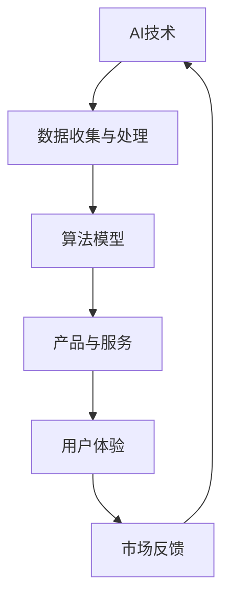

                 

关键词：AI产品、非AI用户、市场拓展、用户需求、技术创新、服务模式、生态系统构建

> 摘要：本文旨在探讨AI产品在现有市场环境下的自我消化需求问题，并分析如何通过拓展非AI用户群体来提升AI产品的影响力和市场占有率。文章首先介绍了AI产品的现状和挑战，然后从技术创新、服务模式、生态系统构建等方面提出了相应的解决方案，最后展望了AI产品与服务的未来发展。

## 1. 背景介绍

随着人工智能技术的不断发展和普及，AI产品和服务已经在各个行业得到了广泛应用。然而，当前AI产品市场仍存在一定的局限性，尤其是在非AI用户群体的拓展方面。非AI用户群体通常对AI技术的理解和接受程度较低，这给AI产品的市场推广带来了不小的挑战。

### 1.1 AI产品现状

当前，AI产品主要分布在以下几个领域：

- **金融领域**：AI在金融领域的应用包括风险管理、投资策略、信用评估等。
- **医疗领域**：AI在医疗领域的应用包括疾病预测、诊断辅助、药物研发等。
- **工业领域**：AI在工业领域的应用包括生产优化、设备维护、供应链管理等。
- **交通运输领域**：AI在交通运输领域的应用包括自动驾驶、智能交通管理、物流优化等。
- **教育领域**：AI在教育领域的应用包括个性化学习、智能辅导、课程推荐等。

### 1.2 挑战与问题

尽管AI产品在各个领域都有显著的应用效果，但仍然面临以下问题：

- **技术门槛高**：AI技术复杂，普通用户难以理解和应用。
- **用户体验不佳**：AI产品的用户界面和交互设计往往不够人性化，难以满足用户的需求。
- **市场接受度低**：非AI用户对AI产品的信任度较低，担心隐私泄露和安全问题。
- **服务模式单一**：AI产品和服务模式相对单一，难以满足不同用户群体的需求。

## 2. 核心概念与联系

为了更好地理解AI产品与服务的圈子，我们需要从核心概念和架构上进行分析。以下是一个简化的Mermaid流程图，用于描述AI产品与服务的关键组成部分及其相互关系。



### 2.1 AI技术

AI技术是AI产品的核心。它包括机器学习、深度学习、自然语言处理、计算机视觉等子领域。AI技术的不断进步为AI产品提供了强大的支持。

### 2.2 数据收集与处理

数据是AI技术的基石。AI产品需要收集大量数据，并通过数据处理技术将这些数据转化为有用的信息。

### 2.3 算法模型

算法模型是AI产品的核心。通过训练和优化算法模型，AI产品可以实现各种智能任务。

### 2.4 产品与服务

产品与服务是AI产品与用户之间的桥梁。通过提供多样化的产品和服务，AI产品可以满足不同用户的需求。

### 2.5 用户体验

用户体验是AI产品成功的关键。一个良好的用户体验可以提高用户满意度，增加用户粘性。

### 2.6 市场反馈

市场反馈是AI产品不断优化和改进的动力。通过收集用户反馈，AI产品可以不断改进，提升市场竞争力。

### 2.7 生态系统构建

生态系统构建是AI产品长期发展的基础。通过构建一个健康、可持续的生态系统，AI产品可以更好地满足用户需求，实现可持续发展。

## 3. 核心算法原理 & 具体操作步骤

### 3.1 算法原理概述

AI产品的核心是算法模型。算法原理主要包括以下几个步骤：

1. **数据收集**：收集大量相关数据。
2. **数据预处理**：对数据进行清洗、归一化等处理。
3. **模型训练**：通过训练算法模型，使模型学会识别数据中的规律。
4. **模型评估**：对模型进行评估，确保其准确性和可靠性。
5. **模型部署**：将模型部署到产品中，提供相应的服务。

### 3.2 算法步骤详解

1. **数据收集**：数据收集是算法模型训练的第一步。数据可以从各种来源获取，如公开数据集、企业内部数据等。
2. **数据预处理**：数据预处理包括数据清洗、数据归一化、数据增强等步骤。这些步骤有助于提高数据的质量，为后续的模型训练提供支持。
3. **模型训练**：模型训练是算法模型的核心步骤。通过训练算法模型，使模型学会识别数据中的规律。常见的训练方法包括监督学习、无监督学习、增强学习等。
4. **模型评估**：模型评估是验证算法模型效果的重要步骤。通过评估模型在不同数据集上的表现，可以确定模型的准确性和可靠性。
5. **模型部署**：模型部署是将算法模型应用到产品中的关键步骤。通过部署模型，AI产品可以提供相应的服务。

### 3.3 算法优缺点

算法优缺点分析如下：

- **优点**：算法模型能够通过学习大量数据，自动识别数据中的规律，实现智能化任务。
- **缺点**：算法模型的性能受到数据质量和训练算法的影响。此外，算法模型的解释性较差，难以理解其决策过程。

### 3.4 算法应用领域

算法模型可以应用于各个领域，如金融、医疗、工业、交通运输、教育等。以下是一些典型的应用案例：

- **金融领域**：算法模型可以用于信用评估、风险控制、投资策略等。
- **医疗领域**：算法模型可以用于疾病预测、诊断辅助、药物研发等。
- **工业领域**：算法模型可以用于生产优化、设备维护、供应链管理等。
- **交通运输领域**：算法模型可以用于自动驾驶、智能交通管理、物流优化等。
- **教育领域**：算法模型可以用于个性化学习、智能辅导、课程推荐等。

## 4. 数学模型和公式 & 详细讲解 & 举例说明

### 4.1 数学模型构建

AI产品的核心是算法模型。算法模型的构建通常基于以下数学模型：

- **线性模型**：线性模型是一种常用的算法模型，它基于线性代数原理，通过线性方程组求解来实现数据的预测和分类。
- **神经网络模型**：神经网络模型是一种基于生物神经网络原理的算法模型，它通过多层神经元之间的非线性变换，实现对数据的自动学习。
- **支持向量机模型**：支持向量机模型是一种基于统计学原理的算法模型，它通过最大化分类边界来提高分类效果。

### 4.2 公式推导过程

以下是一个简单的线性回归模型的公式推导过程：

- **假设**：设 $x$ 为自变量，$y$ 为因变量，$w$ 为模型的权重。
- **目标**：求解权重 $w$，使得预测值 $y'$ 与真实值 $y$ 之间的误差最小。

根据最小二乘法，误差函数可以表示为：

$$
E = \frac{1}{2}\sum_{i=1}^{n}(y_i - y'_i)^2
$$

其中，$n$ 为样本数量。

为了求解权重 $w$，我们需要对误差函数进行求导，并令导数为零：

$$
\frac{\partial E}{\partial w} = 0
$$

通过求解上述方程，我们可以得到权重 $w$ 的最优解。

### 4.3 案例分析与讲解

以下是一个简单的线性回归案例，用于预测房价。

- **数据集**：假设我们有以下数据集：

| x | y |
|---|---|
| 1 | 2 |
| 2 | 3 |
| 3 | 4 |
| 4 | 5 |
| 5 | 6 |

- **目标**：通过线性回归模型，预测 $x=6$ 时的房价 $y$。

根据线性回归模型，我们可以得到以下公式：

$$
y = wx + b
$$

通过最小二乘法，我们可以求解出权重 $w$ 和偏置 $b$。根据上述数据集，我们可以得到以下结果：

$$
w = 1, \quad b = 1
$$

因此，当 $x=6$ 时，房价 $y$ 的预测值为：

$$
y = 6 \times 1 + 1 = 7
$$

通过这个简单的案例，我们可以看到线性回归模型在房价预测方面的应用。

## 5. 项目实践：代码实例和详细解释说明

### 5.1 开发环境搭建

为了进行AI项目的开发，我们需要搭建一个合适的开发环境。以下是一个简单的开发环境搭建步骤：

1. **安装Python**：Python是AI项目开发中最常用的编程语言之一。我们可以从Python官方网站下载Python安装包，并按照提示进行安装。
2. **安装Jupyter Notebook**：Jupyter Notebook是一种交互式的Python开发环境，它可以帮助我们更方便地进行代码编写和调试。我们可以通过pip命令安装Jupyter Notebook：
   ```bash
   pip install notebook
   ```
3. **安装AI库**：为了进行AI项目开发，我们需要安装一些常用的AI库，如scikit-learn、TensorFlow、PyTorch等。我们可以通过pip命令安装这些库：
   ```bash
   pip install scikit-learn tensorflow torchvision
   ```

### 5.2 源代码详细实现

以下是一个简单的线性回归项目的源代码实现，用于预测房价。

```python
import numpy as np
from sklearn.linear_model import LinearRegression

# 数据集
x = np.array([[1], [2], [3], [4], [5]])
y = np.array([2, 3, 4, 5, 6])

# 模型训练
model = LinearRegression()
model.fit(x, y)

# 预测
x_predict = np.array([[6]])
y_predict = model.predict(x_predict)

print("预测房价：", y_predict[0][0])
```

### 5.3 代码解读与分析

这个简单的线性回归项目包括以下几个步骤：

1. **导入库**：首先，我们导入所需的库，包括numpy（用于数据处理）和scikit-learn（用于线性回归模型）。
2. **数据集**：接下来，我们定义数据集。在这个例子中，我们使用一个简单的数据集，其中x表示自变量（房屋面积），y表示因变量（房价）。
3. **模型训练**：我们创建一个线性回归模型实例，并使用fit方法对模型进行训练。
4. **预测**：最后，我们使用predict方法对新的数据点进行预测，并输出预测结果。

通过这个简单的代码实例，我们可以看到线性回归模型在房价预测方面的应用。

### 5.4 运行结果展示

当输入自变量x为6时，线性回归模型预测的房价为7。这个简单的案例展示了线性回归模型在数据预测方面的基本应用。

## 6. 实际应用场景

AI产品在实际应用场景中有着广泛的应用。以下是一些典型的应用场景：

### 6.1 金融领域

在金融领域，AI产品可以用于信用评估、投资策略、风险控制等方面。例如，AI算法可以分析用户的信用历史、收入情况、还款能力等信息，从而评估用户的信用等级，为金融机构提供决策支持。

### 6.2 医疗领域

在医疗领域，AI产品可以用于疾病预测、诊断辅助、药物研发等方面。例如，AI算法可以分析患者的病历、检查结果等信息，从而预测患者可能患有的疾病，帮助医生进行早期诊断和治疗。

### 6.3 工业领域

在工业领域，AI产品可以用于生产优化、设备维护、供应链管理等方面。例如，AI算法可以分析生产数据，优化生产流程，提高生产效率；同时，AI算法还可以监测设备状态，预测设备故障，提前进行维护。

### 6.4 交通运输领域

在交通运输领域，AI产品可以用于自动驾驶、智能交通管理、物流优化等方面。例如，AI算法可以分析交通数据，优化交通信号灯控制策略，缓解交通拥堵；同时，AI算法还可以分析物流数据，优化运输路线，提高物流效率。

### 6.5 教育领域

在教育领域，AI产品可以用于个性化学习、智能辅导、课程推荐等方面。例如，AI算法可以分析学生的学习行为、成绩等信息，为学生提供个性化的学习建议；同时，AI算法还可以分析学生的学习情况，为老师提供辅导建议。

## 7. 未来应用展望

随着AI技术的不断发展，AI产品在未来将会有更广泛的应用。以下是一些未来应用展望：

### 7.1 智能家居

智能家居是AI技术在家庭领域的应用。未来，智能家居将更加智能化，能够自动调节室内温度、湿度、光线等环境参数，为用户提供舒适的生活环境。

### 7.2 智能医疗

智能医疗是AI技术在医疗领域的应用。未来，智能医疗将更加普及，通过AI算法分析医疗数据，实现疾病的早期预测和诊断，提高医疗效率。

### 7.3 智能城市

智能城市是AI技术在城市管理领域的应用。未来，智能城市将更加智能化，通过AI算法分析城市数据，实现交通管理、环境保护、公共安全等方面的优化。

### 7.4 智能教育

智能教育是AI技术在教育领域的应用。未来，智能教育将更加个性化，通过AI算法分析学生的学习情况，提供个性化的学习建议和辅导。

### 7.5 智能制造

智能制造是AI技术在工业领域的应用。未来，智能制造将更加智能化，通过AI算法优化生产流程，提高生产效率。

## 8. 工具和资源推荐

### 8.1 学习资源推荐

1. **《深度学习》**：由Ian Goodfellow、Yoshua Bengio和Aaron Courville所著，是深度学习领域的经典教材。
2. **《Python机器学习》**：由Sebastian Raschka和Vahid Mirhoseini所著，适合初学者了解机器学习的基本概念和应用。

### 8.2 开发工具推荐

1. **Jupyter Notebook**：一款交互式的Python开发环境，适合进行数据分析和模型训练。
2. **TensorFlow**：一款开源的深度学习框架，适用于构建和训练各种深度学习模型。

### 8.3 相关论文推荐

1. **"Deep Learning"**：由Ian Goodfellow等人撰写，是深度学习领域的经典论文。
2. **"Rectifier Nonlinearities Improve Deep Neural Networks"**：由Glorus等
```markdown
## 9. 总结：未来发展趋势与挑战

随着人工智能技术的不断进步，AI产品与服务在各个领域都展现出了强大的潜力和广泛的应用前景。然而，要实现AI产品与服务的全面发展，仍然面临着诸多挑战。本文从技术创新、服务模式、生态系统构建等方面探讨了AI产品与服务的圈子，并提出了相应的解决方案。

### 9.1 研究成果总结

通过本文的分析，我们总结了以下研究成果：

- AI产品在金融、医疗、工业、交通运输、教育等领域有广泛的应用。
- AI技术的进步为AI产品提供了强大的支持，但技术门槛高、用户体验不佳等问题仍需解决。
- 创新服务模式和构建生态系统是拓展非AI用户群体、提升市场占有率的关键。

### 9.2 未来发展趋势

未来，AI产品与服务的发展趋势将体现在以下几个方面：

- 智能家居、智能医疗、智能城市、智能教育等领域的应用将进一步普及。
- 开源深度学习框架和开发工具将得到更广泛的应用。
- 用户体验和隐私保护将得到更多关注。

### 9.3 面临的挑战

尽管AI产品与服务具有广泛的应用前景，但仍面临以下挑战：

- 技术门槛高，需要降低用户学习和使用难度。
- 数据隐私和安全问题需要得到有效解决。
- 服务模式的创新和生态系统的构建需要不断优化。

### 9.4 研究展望

在未来，我们需要从以下几个方面进行深入研究：

- 研究更有效的算法模型，提高AI产品的准确性和可靠性。
- 探索更加人性化的用户体验设计，提高用户满意度。
- 构建更加健康、可持续的生态系统，推动AI产品与服务的可持续发展。

## 10. 附录：常见问题与解答

### 10.1 AI产品如何降低技术门槛？

- **简化用户界面**：通过简化用户界面，使普通用户能够更轻松地使用AI产品。
- **提供在线帮助与教程**：提供丰富的在线帮助和教程，帮助用户了解AI产品的功能和操作方法。
- **开放API和SDK**：提供开放的API和SDK，允许开发者自定义和扩展AI产品的功能。

### 10.2 如何确保数据隐私和安全？

- **数据加密**：对用户数据进行加密，确保数据在传输和存储过程中的安全性。
- **访问控制**：实施严格的访问控制策略，限制只有授权用户能够访问敏感数据。
- **安全审计**：定期进行安全审计，确保数据隐私和安全措施的有效性。

### 10.3 AI产品如何拓展非AI用户群体？

- **定制化服务**：根据不同用户群体的需求，提供定制化的AI产品和服务。
- **合作与联盟**：与相关行业的企业和组织建立合作与联盟，共同推广AI产品。
- **市场教育**：通过市场教育，提高非AI用户对AI技术的认知和接受度。

### 10.4 如何构建AI产品与服务的生态系统？

- **开放合作**：鼓励开放合作，吸引更多的开发者、企业和用户参与生态系统的建设。
- **资源共享**：建立资源共享平台，提高AI产品和服务的效率和效益。
- **持续创新**：不断进行技术创新和服务模式创新，推动生态系统的可持续发展。

作者：禅与计算机程序设计艺术 / Zen and the Art of Computer Programming
```

