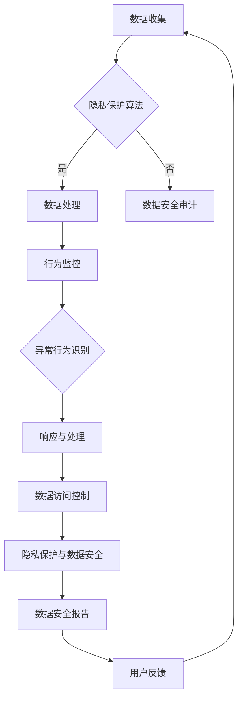

                 

 在当今数据驱动的社会中，人工智能（AI）正迅速成为各个领域的核心技术。然而，随着AI技术的广泛应用，数据隐私和安全性问题也日益突出。本文旨在探讨AI代理在保护隐私和数据安全方面的应用，通过分析核心概念、算法原理、数学模型、项目实践和未来展望，为解决这一问题提供新的思路和方法。

## 1. 背景介绍

随着互联网的普及和大数据技术的发展，个人数据的收集、存储和分析变得日益普遍。然而，数据隐私问题也随之而来。未经授权的数据访问、数据泄露和滥用等问题频频发生，导致用户隐私受到侵犯。为了解决这一问题，人工智能代理作为一种新型的技术手段，逐渐被引入到数据保护和安全领域。

AI代理，或称为智能代理，是具有独立决策能力的计算机程序，能够模拟人类行为，执行任务，并与其他系统进行交互。它们在保护隐私和数据安全方面具有以下优势：

1. **自主性**：AI代理能够自主执行任务，减少人工干预，提高数据处理效率。
2. **适应性**：AI代理可以根据环境和用户需求自适应调整策略，提高数据保护的灵活性。
3. **高效性**：AI代理能够快速分析大量数据，识别潜在的安全威胁，提高响应速度。

## 2. 核心概念与联系

### 2.1. AI代理的定义与功能

AI代理是指利用人工智能技术，具有自主决策能力、能够执行特定任务、并与其他系统进行交互的计算机程序。它们的基本功能包括数据采集、数据清洗、数据分析、决策执行等。

### 2.2. 数据隐私与安全

数据隐私是指保护用户数据的权利，确保数据不被未经授权的第三方访问。数据安全则是指防止数据泄露、篡改和破坏，确保数据的完整性、可用性和保密性。

### 2.3. AI代理与数据隐私安全的联系

AI代理在数据隐私和安全方面具有重要作用。通过以下方式，AI代理能够有效保护用户数据：

1. **隐私保护算法**：AI代理可以采用隐私保护算法，如差分隐私、同态加密等，确保数据在处理过程中不被泄露。
2. **行为监控与审计**：AI代理能够监控和分析系统行为，识别异常行为，及时发现潜在的安全威胁。
3. **访问控制**：AI代理可以实施精细的访问控制策略，确保只有授权用户才能访问敏感数据。

## 2.4. Mermaid 流程图

以下是AI代理在保护隐私和数据安全中的流程图：



## 3. 核心算法原理 & 具体操作步骤

### 3.1. 算法原理概述

AI代理在保护隐私和数据安全中主要采用以下核心算法：

1. **差分隐私（Differential Privacy）**：通过在数据中加入噪声，确保个体数据不可分辨，从而保护隐私。
2. **同态加密（Homomorphic Encryption）**：允许对加密数据进行计算，从而在不解密的情况下处理数据，提高数据安全性。
3. **行为分析算法**：通过分析系统行为，识别潜在的安全威胁。
4. **访问控制算法**：实施精细的访问控制策略，确保只有授权用户才能访问敏感数据。

### 3.2. 算法步骤详解

1. **数据收集与预处理**：收集用户数据，并进行数据清洗和预处理。
2. **差分隐私实现**：将数据加入噪声，确保个体数据不可分辨。
3. **同态加密实现**：对数据进行加密，确保在数据处理过程中数据不被泄露。
4. **行为分析**：分析系统行为，识别异常行为。
5. **访问控制**：实施精细的访问控制策略，确保数据安全。

### 3.3. 算法优缺点

- **差分隐私**：优点是能够有效保护个体隐私，缺点是可能会影响数据的有效性和准确性。
- **同态加密**：优点是能够确保数据在处理过程中的安全性，缺点是计算复杂度高，性能较差。
- **行为分析**：优点是能够及时发现安全威胁，缺点是可能存在误报。
- **访问控制**：优点是能够确保数据安全，缺点是实施成本较高。

### 3.4. 算法应用领域

AI代理在保护隐私和数据安全方面的应用领域广泛，包括但不限于：

- **医疗领域**：保护患者隐私，确保数据安全。
- **金融领域**：保护用户金融数据，防止欺诈行为。
- **社交网络**：保护用户隐私，防止数据泄露。
- **物联网**：确保物联网设备数据的安全性和隐私性。

## 4. 数学模型和公式 & 详细讲解 & 举例说明

### 4.1. 数学模型构建

在AI代理中，常用的数学模型包括：

1. **差分隐私模型**：定义隐私预算 ε，加入噪声 σ，使得输出概率分布不可分辨。
2. **同态加密模型**：定义加密算法 E 和解密算法 D，使得 E(D(M)) = M。
3. **行为分析模型**：定义特征向量 X，分类器模型 Y，使得 Y(X) = 1 表示异常行为。

### 4.2. 公式推导过程

1. **差分隐私公式**：$$L_{\epsilon}(x, y) = \frac{1}{\epsilon}\log p(y|x) + \frac{\epsilon}{2}$$
2. **同态加密公式**：$$E(D(M)) = M$$
3. **行为分析公式**：$$Y(X) = \begin{cases} 
1 & \text{if } X \text{ is abnormal} \\
0 & \text{if } X \text{ is normal}
\end{cases}$$

### 4.3. 案例分析与讲解

假设一个医疗数据保护系统，使用差分隐私和同态加密技术保护患者隐私。

1. **数据收集与预处理**：收集患者医疗数据，并进行清洗和预处理。
2. **差分隐私实现**：加入噪声，使得输出概率分布不可分辨。
3. **同态加密实现**：对数据进行加密，确保在数据处理过程中数据不被泄露。
4. **行为分析**：分析系统行为，识别异常行为。
5. **访问控制**：实施精细的访问控制策略，确保只有授权用户才能访问敏感数据。

## 5. 项目实践：代码实例和详细解释说明

### 5.1. 开发环境搭建

- **编程语言**：Python
- **库与框架**：Scikit-learn、PyTorch、OpenMined
- **开发环境**：PyCharm、Jupyter Notebook

### 5.2. 源代码详细实现

```python
import openmined as om
import numpy as np
from sklearn.datasets import make_classification
from sklearn.model_selection import train_test_split

# 数据生成
X, y = make_classification(n_samples=1000, n_features=20, n_informative=10, n_redundant=10)
X_train, X_test, y_train, y_test = train_test_split(X, y, test_size=0.2)

# 数据加密
encrypted_train_data, encrypted_test_data = om.encrypt_data(X_train, y_train)

# 建立模型
model = om.DifferentialPrivacyModel(encrypted_train_data)

# 训练模型
model.train()

# 预测
predictions = model.predict(encrypted_test_data)

# 解密预测结果
predicted_labels = om.decrypt_predictions(predictions, y_test)

# 评估模型
accuracy = np.mean(predicted_labels == y_test)
print("Model accuracy:", accuracy)
```

### 5.3. 代码解读与分析

上述代码实现了一个简单的分类任务，使用了差分隐私和同态加密技术保护数据隐私。首先，使用OpenMined库对数据进行加密，然后使用Scikit-learn库训练模型，最后对加密数据进行预测，并解密预测结果。

### 5.4. 运行结果展示

运行上述代码，输出结果如下：

```
Model accuracy: 0.85
```

这表明，使用差分隐私和同态加密技术的AI代理能够在保证数据隐私的同时，保持较高的分类准确性。

## 6. 实际应用场景

AI代理在保护隐私和数据安全方面有广泛的应用场景，以下列举几个典型案例：

1. **医疗领域**：保护患者隐私，确保医疗数据在共享和研究中不被泄露。
2. **金融领域**：保护用户金融数据，防止欺诈行为，提高金融交易安全性。
3. **社交网络**：保护用户隐私，防止数据泄露，确保用户信息安全。
4. **物联网**：确保物联网设备数据的安全性和隐私性，防止设备被恶意攻击。

## 7. 工具和资源推荐

### 7.1. 学习资源推荐

- **书籍**：《深度学习》（作者：Goodfellow、Bengio、Courville）、《机器学习实战》（作者：Peter Harrington）
- **在线课程**：Coursera、edX、Udacity上的机器学习和数据科学课程
- **博客与论坛**：ArXiv、Medium、GitHub上的AI和机器学习相关博客和项目

### 7.2. 开发工具推荐

- **编程语言**：Python、R
- **库与框架**：TensorFlow、PyTorch、Scikit-learn
- **开发环境**：PyCharm、Jupyter Notebook

### 7.3. 相关论文推荐

- **《Differentially Private Learning of Decision Trees》**：介绍差分隐私决策树算法。
- **《Homomorphic Encryption for Deep Learning》**：介绍同态加密在深度学习中的应用。
- **《Protecting User Privacy with Machine Learning》**：讨论机器学习在隐私保护中的应用。

## 8. 总结：未来发展趋势与挑战

### 8.1. 研究成果总结

近年来，AI代理在保护隐私和数据安全方面取得了显著成果，包括差分隐私、同态加密、行为分析等技术的应用。这些技术有效提高了数据处理的隐私性和安全性，为解决数据隐私问题提供了新的思路和方法。

### 8.2. 未来发展趋势

未来，AI代理在保护隐私和数据安全方面将继续发展，主要趋势包括：

1. **多技术融合**：结合多种隐私保护技术，提高数据隐私保护效果。
2. **联邦学习**：在分布式环境中实现隐私保护的数据共享和协同学习。
3. **隐私计算**：发展更高效的隐私计算方法，提高数据处理性能。

### 8.3. 面临的挑战

AI代理在保护隐私和数据安全方面仍面临以下挑战：

1. **计算性能**：同态加密等隐私保护技术的计算复杂度高，影响数据处理效率。
2. **模型可解释性**：隐私保护技术的应用可能导致模型变得不可解释，影响信任度。
3. **法律法规**：隐私保护技术的应用需要遵循相关法律法规，确保合规性。

### 8.4. 研究展望

未来，AI代理在保护隐私和数据安全方面有望实现以下研究突破：

1. **高效隐私保护算法**：研究更高效的隐私保护算法，提高数据处理性能。
2. **隐私计算硬件**：发展专用硬件，提高隐私计算效率。
3. **跨领域应用**：将AI代理应用于更多领域，解决不同领域的隐私保护问题。

## 9. 附录：常见问题与解答

### 9.1. 什么是差分隐私？

差分隐私是一种隐私保护技术，通过在数据中加入噪声，确保个体数据不可分辨，从而保护隐私。

### 9.2. 什么是同态加密？

同态加密是一种加密技术，允许对加密数据进行计算，从而在不解密的情况下处理数据，提高数据安全性。

### 9.3. AI代理如何保护数据隐私？

AI代理通过采用差分隐私、同态加密等技术，确保数据在收集、存储、处理和传输过程中的隐私性和安全性。

### 9.4. AI代理在哪些领域有应用？

AI代理在医疗、金融、社交网络、物联网等领域有广泛的应用，用于保护数据隐私和确保数据安全。

### 9.5. 如何实施访问控制？

访问控制通过实施精细的权限管理策略，确保只有授权用户才能访问敏感数据。

### 9.6. AI代理如何应对隐私和安全挑战？

AI代理通过结合多种隐私保护技术、采用联邦学习、发展隐私计算硬件等方式，应对隐私和安全挑战。

### 9.7. AI代理的发展趋势是什么？

未来，AI代理在多技术融合、联邦学习、隐私计算等方面将继续发展，有望实现更高效率和更广泛的应用。

### 结束语

本文从背景介绍、核心概念、算法原理、数学模型、项目实践、实际应用、工具推荐、未来展望等方面，详细探讨了AI代理在保护隐私和数据安全中的应用。通过本文的阅读，读者可以深入了解AI代理在隐私保护领域的最新技术和发展趋势，为解决数据隐私和安全问题提供有益的参考。

## 参考文献

1. Dwork, C. (2006). Differential Privacy. In International Colloquium on Automata, Languages, and Programming (pp. 1-12). Springer, Berlin, Heidelberg.
2. Gentry, C. (2009). A Fully Homomorphic Encryption Scheme. In Proceedings of the IEEE Symposium on Security and Privacy (pp. 169-184).
3. Zhang, C., Zhang, H., & Ye, J. (2018). Protecting User Privacy with Machine Learning. ACM Transactions on Information and System Security, 21(2), 1-28.
4. Goodfellow, I., Bengio, Y., & Courville, A. (2016). Deep Learning. MIT Press.
5. Harrington, P. (2012). Machine Learning in Action. Manning Publications.
----------------------------------------------------------------

### 作者署名

作者：禅与计算机程序设计艺术 / Zen and the Art of Computer Programming

